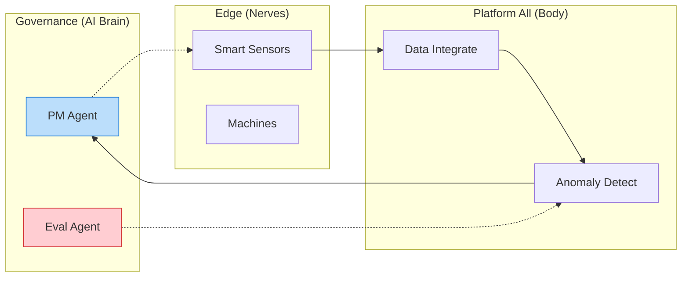

# Enterprise AI Solutions: Platform All
### The Future of Autonomous Enterprise ("연결되지 않는 것은 없다")

> [!NOTE] Welcome
> 당사의 기업 포트폴리오 저장소에 오신 것을 환영합니다.
> 우리는 단순한 AI 도입을 넘어, **자율 에이전트(Autonomous Agents)** 를 통해 기업의 의사결정과 실행 프로세스를 혁신하는 **"Platform All"** 기술을 제공합니다.

---

## 🚀 Quick Navigation (빠른 시작)

가장 먼저 확인해야 할 핵심 문서들입니다.

| 구분 | 문서명 | 내용 요약 |
| :--- | :--- | :--- |
| **👀 1분 요약** | **[[01_Visual_Summary|시각적 브리핑]]** | 텍스트 없이 **도표 5개**로 보는 전체 사업 요약. (강력 추천) |
| **📑 경영진용** | **[[00_Executive_Summary|경영진 요약]]** | AI 도입의 현실과 당사의 3단계 도입 방법론. |
| **🏭 성공 사례** | **[[02_Solution_Suite|솔루션 스위트]]** | 세아특수강, 포미아 등 대기업 실증 성공 사례. |
| **🛠️ 엔지니어용** | **[[Architecture_Overview|기술 아키텍처]]** | 'Platform All' 생태계 및 거버넌스 에이전트 상세. |

---

## 🏗️ Architecture Preview (핵심 구조)

당사의 시스템은 **판단(Brain)**, **플랫폼(Body)**, **현장(Nerves)** 이 유기적으로 연결된 살아있는 신경망입니다.

---

## 📚 Methodology (일하는 방식)

우리는 단순히 결과물만 납품하지 않습니다. **"AI와 함께 일하는 방법"**을 이식합니다.

*   **[[00_PM_Roles_Guide|AI 프로젝트 관리]]**: 인공지능이 24시간 리스크를 감시하는 관리 체계.
*   **[[00_Team_Roles_Guide|Human-AI 협업]]**: 인간과 AI 에이전트가 짝을 이뤄 일하는 하이브리드 워크포스.
*   **[[00_AI_Workflow_Guide|자율 개발 (ADLC)]]**: 요구사항만 주면 코드를 작성하고 테스트하는 자율 개발 시스템.

---

## 🏆 Proven Technology (검증된 기술)

*   **GS 인증 1등급** (소프트웨어 품질 인증)
*   **특허 등록** (이상 탐지 및 예지 보전 기술)
*   **SCI급 논문 발표** (산업 AI 실증 연구)
*   👉 **[[04_Academic_Publications|기술 검증 상세 보기]]**

---

## 📬 Contact Strategy

> **"AI는 마법이 아닙니다. 철저한 엔지니어링입니다."**
> 귀사의 데이터 더미 속에 숨겨진 '의사결정의 금맥'을 찾아드리겠습니다.

*   **Pilot 문의**: `Phase 1: 진단 및 파일럿` 단계부터 시작해보세요.
*   **System 데모**: 실제 작동하는 자율 에이전트 시스템을 시연해 드립니다.

[**포트폴리오 전체 맵 보기 (Relationship Map)**](portfolio_docs/00_Relationship_Map.md)
