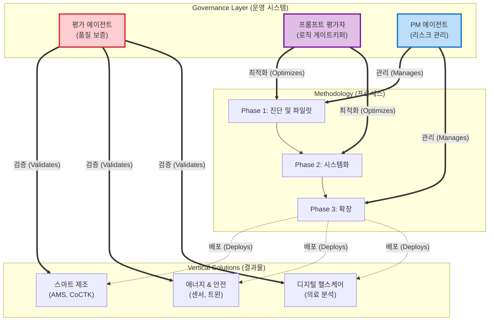
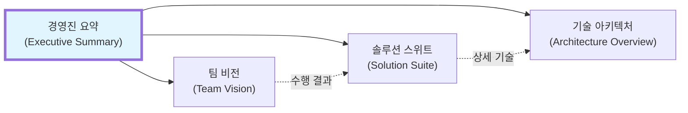

# 솔루션 아키텍처 맵 (Solution Architecture Map)

**문서 ID**: `doc.solution.map`

> [!INFO] 목적 (Purpose)
> 본 맵은 당사의 **거버넌스 에이전트**, **산업별 솔루션**, 그리고 **구현 방법론**이 어떻게 유기적으로 결합하여 기업 가치를 창출하는지 시각화합니다.

---

## 🗺️ 전사적 시스템 아키텍처

---

## 🔗 핵심 문서 관계도

## 📂 문서 네비게이션 허브
| 문서명 | 역할 | ID |
| :--- | :--- | :--- |
| **[[00_Executive_Summary]]** | **시작점 (Entry Point)** | `doc.executive.summary` |
| **[[02_Solution_Suite]]** | **성공 사례 (Case Studies)** | `doc.solution.suite` |
| **[[00_Team_Vision]]** | **팀 & 비전 (Team & Vision)** | `doc.team.vision` |
| **[[Architecture_Overview]]** | **기술 상세 (Deep Tech)** | `page.portfolio.architecture` |

---

## 🔗 심층 탐구 (Deep Dives)
*   **[[00_Executive_Summary]]**: 비즈니스 관점의 핵심 요약.
*   **[[02_Solution_Suite]]**: 검증된 가치와 ROI 증명.
*   **[[00_Team_Vision]]**: 코드를 만드는 사람들의 철학.
