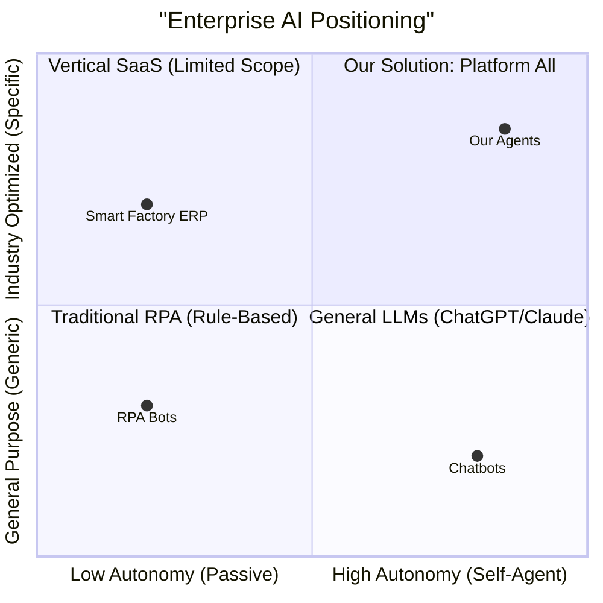
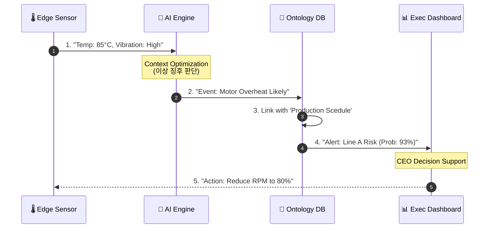

# Visual Executive Summary: The Silent Briefing

**문서 ID**: `doc.visual.summary`

> [!NOTE] 문서 개요
> 긴 글을 읽을 시간이 없는 의사결정권자를 위한 **100% 시각화 요약본**입니다.
> 당사의 기업 가치, 기술 구조, 비용 절감 효과를 5개의 핵심 도표로 설명합니다.

---

## 1. Paradigm Shift (시장 내 위치)

엔터프라이즈 AI 시장에서 당사의 독보적인 포지셔닝을 보여줍니다.
저희는 단순 반복 업무만 하는 **RPA**나, 환각(Hallucination) 위험이 있는 **일반 LLM**과 다릅니다.



> **해석**: 당사는 높은 **자율성(Autonomy)** 과 산업 특화된 **전문성(Specificity)** 을 동시에 만족하는 '제 1사분면'의 솔루션을 제공합니다.

---

## 2. Integrated Architecture (시스템 구조도)

"Platform All"이 어떻게 현장의 센서부터 경영진의 의사결정까지 연결하는지 보여줍니다.

```mermaid
graph TB
    subgraph "Brain: Governance Layer (판단)"
        PM[PM Agent<br/>(Risk Manage)]
        QA[Eval Agent<br/>(Quality Check)]
        Prompt[Prompt Agent<br/>(Logic Optimize)]
    end

    subgraph "Body: Platform Layer (처리)"
        AMS[AMS Engine<br/>(이상 탐지)]
        DPS[DPS Platform<br/>(데이터 통합)]
        Knowledge[(Knowledge Graph<br/>기업 지식 저장소)]
    end

    subgraph "Nerves: Edge Layer (감각)"
        IoT[Smart Sensors]
        PLC[Manufacturing Equip]
        Human[Field Workers]
    end

    %% Connections
    IoT & PLC & Human -->|Raw Data| DPS
    DPS -->|Context| AMS
    AMS -->|Insight| Knowledge
    Knowledge -->|Report| PM
    
    %% Governance Control
    QA -.->|Audit| AMS & DPS
    PM -.->|Action| Human
    
    style PM fill:#bbdefb,stroke:#1976d2,stroke-width:2px
    style QA fill:#ffcdd2,stroke:#d32f2f,stroke-width:2px
    style AMS fill:#fff9c4,stroke:#fbc02d,stroke-width:2px
```

---

## 3. Human-AI Workforce (미래 조직도)

인간과 AI가 섞여 있는 당사의 하이브리드 팀 구조입니다. 인간은 '결정'하고, AI는 '실행'합니다.

```mermaid
graph TD
    CEO[Human CEO<br/>(Final Decision)]
    
    subgraph "Planning Team"
        H_Plan[Human Planner]
        A_Plan[AI Researcher Bot]
        A_Doc[AI Document Bot]
    end
    
    subgraph "Dev Team"
        H_Dev[Human Architect]
        A_Code[AI Coder]
        A_Review[AI Code Reviewer]
    end
    
    subgraph "Ops Team"
        H_Ops[Human Manager]
        A_Risk[AI Risk Watchdog]
        A_Sec[AI Security Guard]
    end
    
    CEO --> H_Plan & H_Dev & H_Ops
    H_Plan --- A_Plan & A_Doc
    H_Dev --- A_Code & A_Review
    H_Ops --- A_Risk & A_Sec
    
    style CEO fill:#e1f5fe
    style H_Plan fill:#e1f5fe
    style H_Dev fill:#e1f5fe
    style H_Ops fill:#e1f5fe
    style A_Plan fill:#f3e5f5,stroke-dasharray: 5 5
    style A_Code fill:#f3e5f5,stroke-dasharray: 5 5
    style A_Risk fill:#f3e5f5,stroke-dasharray: 5 5
```

---

## 4. Value Proposition (ROI 흐름)

AI 도입 후 시간 경과에 따른 비용 절감 및 생산성 향상 곡선입니다.

```mermaid
xychart-beta
    title "Cost vs Productivity after AI Adoption"
    x-axis [Q1, Q2, Q3, Q4]
    y-axis "Value Index" 0 --> 100
    line [10, 30, 70, 95] "Productivity (AI Learning)"
    line [90, 70, 40, 20] "Operational Cost"
```

> **해석**: 도입 초기(Q1)에는 학습 비용이 발생하지만, Q3분기부터 **생산성이 폭발적으로 증가(Exponential Growth)** 하고 운영 비용은 급격히 하락합니다.

---

## 5. Data Journey (데이터의 여정)

단 하나의 센서 데이터가 어떻게 경영진의 '전략적 정보'로 변환되는지 보여줍니다.



---

## 🔗 관련 문서
*   **[[00_Executive_Summary|경영진 요약]]**: 텍스트로 된 상세 요약.
*   **[[00_Relationship_Map|전체 맵 보기]]**: 문서 간 연결 관계도.
