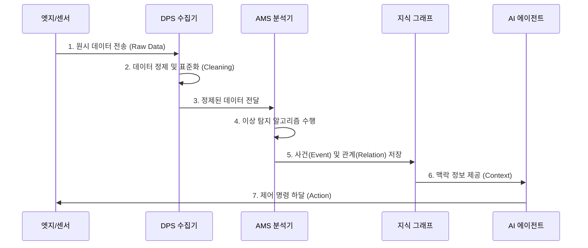

# Enterprise Architecture Overview: Platform All

**문서 ID**: `page.portfolio.architecture`

> [!IMPORTANT] 플랫폼 비전 (Platform Vision)
> **"Platform All: 연결되지 않는 것은 없다."**
> 당사의 아키텍처는 단순한 소프트웨어의 집합이 아닙니다. **현장의 물리적 설비(OT)** 와 **기업의 의사결정 시스템(IT)** 을 **AI 에이전트**로 연결하는 거대한 **디지털 신경망(Digital Neural Network)** 입니다.

---

## 🏗️ 시스템 아키텍처 청사진 (System Blueprint)

당사의 솔루션은 **'Governance Layer (두뇌)'**, **'Platform Layer (미들웨어)'**, **'Edge Layer (신경망)'**의 3계층 구조로 이루어져 있습니다.

```mermaid
graph TB
    subgraph "Layer 1: Governance & Control (The Brain)"
        EVAL[Evaluation Agent<br/>(System Validator)]
        PROMPT[Prompt Engineer<br/>(Logic Gatekeeper)]
        PM[PM Agent<br/>(Risk Manager)]
    end

    subgraph "Layer 2: Platform All (The Backbone)"
        AMS[AMS Engine<br/>(Analysis)]
        DPS[DPS Platform<br/>(Data Integration)]
        API[Unified API Gateway]
        DB[(Knowledge Graph<br/>Neo4j)]
    end

    subgraph "Layer 3: Edge & IoT (The Nerves)"
        Sensor[Smart Sensors]
        PLC[Legacy PLC]
        Worker[Human Worker]
    end

    %% Data Flow
    Sensor & PLC & Worker -->|Raw Data| API
    API -->|Stream| DPS
    DPS -->|Context| AMS
    AMS -->|Insight| DB
    
    %% Governance Flow
    EVAL -.->|Audit| Layer 2
    PM -.->|Track| Layer 2
    PROMPT -.->|Optimize| Layer 1
    
    style EVAL fill:#ffcdd2,stroke:#c62828
    style AMS fill:#fff9c4,stroke:#fbc02d
    style Sensor fill:#e1f5fe,stroke:#0277bd
```

---

## ⚙️ 1. Governance Layer (통제 및 최적화)

기술적인 무결성과 비즈니스 목표의 일치를 보장하는 AI 관리 계층입니다.

### 🛡️ Evaluation Framework (시스템 감사관)
*   **기능**: 시스템 내의 모든 데이터 흐름과 코드 실행을 실시간으로 감시합니다.
*   **AI 역량**: 아키텍처 규칙을 위배하는 이상 징후(예: 허가되지 않은 API 호출)를 탐지하면 즉시 차단하고 관리자에게 보고합니다.

### 🎓 Prompt Evaluation Engine (로직 최적화기)
*   **기능**: AI 에이전트들이 사용하는 '언어 모델'의 성능을 지속적으로 측정하고 개선합니다.
*   **AI 역량**: 새로운 데이터 패턴이 발견되면, 에이전트의 판단 프롬프트를 자동으로 업데이트하여 정확도를 유지합니다 (Self-Optimization).

---

## 💾 2. Platform All (핵심 운영 체제)

데이터를 수집하고 가공하여 가치 있는 정보로 변환하는 핵심 엔진입니다.

### 🏭 AMS (Anomaly Management System)
*   **역할**: 이상 징후 탐지 및 원인 분석.
*   **Tech Stack**: Python, Bayesian Networks, Scikit-learn.
*   **특징**: 피쉬본(Fishbone) 다이어그램을 역설계하여, 문제 발생 시 '어떤 설비의 어떤 부품이 원인인지' 확률적으로 계산해냅니다 (정확도 93.7%).

### 🌐 DPS (Data Processing System)
*   **역할**: 이기종 데이터 통합 및 표준화.
*   **Tech Stack**: Docker Microservices, Neo4j Graph DB.
*   **특징**: 서로 다른 언어를 쓰는 설비들(PLC, MES, ERP)의 데이터를 하나의 '표준 언어(Ontology)'로 통역하여 통합 저장합니다.

---

## 🔌 3. Edge & IoT Layer (물리적 연결)

현장의 데이터를 가장 빠르고 정확하게 수집합니다.

*   **Smart Sensors**: 진동, 온도, 전력 데이터를 엣지단에서 1차 분석하여 필요한 정보만 서버로 전송합니다 (대역폭 70% 절감).
*   **Virtual Sensors**: 고가의 물리적 센서를 대체하는 AI 기반 소프트웨어 센서로, 데이터 패턴만으로 내부 상태를 추정합니다.

---

## 📂 데이터 파이프라인 (Data Pipeline)



---

## 🔒 보안 및 안정성 (Security & Reliability)

기존 연구실 수준의 AI가 아닙니다. 엔터프라이즈급 보안을 자랑합니다.

*   **Role-Based Access Control (RBAC)**: AI 에이전트별로 접근 권한을 엄격히 제어합니다.
*   **Traceability**: AI가 내린 모든 결정은 "왜 그런 결정을 내렸는지"에 대한 근거 데이터와 함께 로그로 영구 보존됩니다.
*   **Fail-Safe**: 시스템 오류 발생 시 즉시 안전 모드로 전환되어 현장 설비를 보호합니다.

---

## 관련 문서
*   **[[02_Solution_Suite|솔루션 상세 보기]]**: 이 아키텍처로 구현된 실제 솔루션들.
*   **[[00_Executive_Summary|경영진 요약]]**: 비즈니스 관점의 요약.
