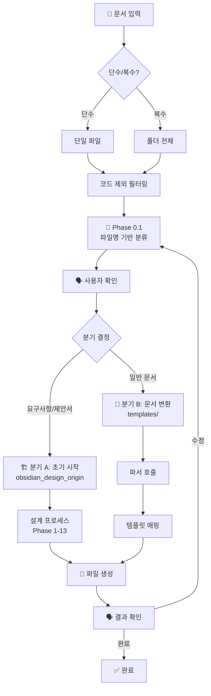

# 문서→템플릿 변환 프롬프트

> **역할**: PM 실무 문서를 templates 폴더 구조에 맞는 MD 형식으로 변환

---

## 전체 흐름도



---

## Phase 0.0: 입력 설정

### 사용자에게 질문

**Q1. 입력 방식**
```
단일 파일을 변환하시겠습니까, 폴더 전체를 변환하시겠습니까?
○ 단수 - 단일 파일with
○ 복수 - 폴더 전체 (코드 파일 자동 제외)
```

**Q2. 프로젝트 폴더명**
```
변환된 문서를 저장할 프로젝트 폴더명을 입력해주세요.
(예: "2024_신규시스템_구축")
```

---

## Phase 0.1: 문서 유형 분류 (파일명 기반)

### 1. 파일 필터링

**제외 대상**:
- 소스코드: `*.py`, `*.js`, `*.ts`, `*.java`, `*.cs`, `*.go`
- 임시파일: `~$*`, `*.tmp`, `*.bak`
- 시스템: `.git/`, `node_modules/`, `__pycache__/`

### 2. 파일명 패턴 매칭

| 패턴 | 문서 유형 | 분기 |
|------|----------|------|
| `*요구*`, `*RFP*`, `*기획*` | 요구사항 | **초기 시작** |
| `*제안*`, `*Proposal*` | 제안서 | **초기 시작** |
| `*견적*`, `*Quotation*` | 견적서 | 착수 |
| `*계약*`, `*Contract*` | 계약서 | 착수 |
| `*과업*`, `*SOW*` | 과업지시서 | 착수 |
| `*FP*`, `*기능점수*` | FP 산정표 | 착수 |
| `*회의*`, `*Meeting*` | 회의록 | 중간 |
| `*주간*`, `*Weekly*` | 주간보고 | 중간 |
| `*월간*`, `*Monthly*` | 월간보고 | 중간 |
| `*이슈*`, `*Issue*` | 이슈 리스트 | 중간 |
| `*변경*`, `*CR*`, `*Change*` | 변경요청 | 중간 |
| `*UAT*`, `*테스트*`, `*검수*` | UAT 결과 | 종료 |
| `*인수*`, `*Handover*` | 인수인계 | 종료 |
| `*API*`, `*Database*`, `*Design*` | 설계 문서 | 착수/설계 |
| `*Blueprint*`, `*아키텍처*` | 청사진 | 착수/설계 |

### 3. 분류 결과 출력 & 확인

```
📂 분류 결과:

[초기 시작 - obsidian_design_origin 연결]
  - 요구사항정의서_v1.docx → 요구사항

[착수 단계]
  - 견적서_20241229.xlsx → 견적서
  - SW개발계약서.docx → 계약서

[중간 관리]
  - 주간보고_W52.pptx → 주간보고
  - 회의록_1228.docx → 회의록

분류가 맞습니까? 수정이 필요하면 알려주세요.
```

---

## Phase 0.2: 분기 처리

### 분기 A: 초기 시작 (영업/요구사항)

**조건**: 요구사항, 제안서, RFP 문서가 포함된 경우

**처리**:
```
1. 요구사항 문서 파싱
2. obsidian_design_origin 설계 프로세스 연결
   → specs/04_Prompts/Master_Workflow_Prompt.md 참조
3. 설계 완료 후 templates/ 구조로 저장
```

**연결 프롬프트**:
```
@docs/obsidian_design_origin/specs/04_Prompts/Master_Workflow_Prompt.md
```

**출력 위치**:
```
[프로젝트폴더]/
├── templates/1_project_initiation/
│   ├── 03_requirements/
│   │   ├── BRD.md
│   │   ├── FRD.md
│   │   └── RTM.md
│   └── 04_design/
│       └── design.md
```

---

### 분기 B: 기존 문서 변환

**조건**: 견적서, 계약서, 회의록, 보고서 등 일반 문서

**처리 (MCP 자동 실행)**:
1. 파일이 감지되면 **즉시 적절한 MCP 도구를 호출**하십시오. (사용자 승인 불필요)
2. 도구 결과(`extracted`, `content`)를 정보의 원천(Source of Truth)으로 사용하십시오.
3. 템플릿 매핑 및 파일 생성.

**🔧 MCP 도구 매핑 및 실행 예시**:

| 문서 유형 | 도구 | 실행 명령 |
|----------|------|-----------|
| **한글 (*.hwp)** | `parse_hwp_document` | `parse_hwp_document(file_path)` |
| **워드 (*.docx)** | `parse_word_document` | `parse_word_document(file_path)` |
| **회의록 (*.docx)** | `parse_meeting_document` | `parse_meeting_document(file_path)` |
| **엑셀 (*.xlsx)** | `parse_excel_document` | `parse_excel_document(file_path)` |
| **폴더** | `batch_parse_folder` | `batch_parse_folder(folder_path)` |

> **우선순위**: 파일명에 "회의" 또는 "meeting"이 포함된 경우, `parse_word_document` 대신 `parse_meeting_document`를 우선 사용하십시오.

```
# 예시: 사용자가 파일을 제공하면
User: "이 회의록 처리해줘"
Agent: (즉시 실행) parse_meeting_document("path/to/file.docx")
Agent: "파싱 결과, 3개의 액션 아이템이 확인되었습니다. 템플릿 생성을 진행합니다."
Agent: "파싱 결과, 3개의 액션 아이템이 확인되었습니다. 템플릿 생성을 진행합니다."
```

### 🔍 무결성 검증 (Mandatory Integrity Check)
**Phase 0.2.1: 데이터 신뢰도 검증**
1. 파싱 시작 전/후에 반드시 `scan_folder_files(folder_path)`를 호출하십시오.
2. 파싱 결과(`batch_parse_folder`의 JSON)의 파일 목록과 `scan_folder_files`의 유효 파일 목록을 비교하십시오.
   - **Missing**: 스캔되었으나 파싱 JSON에 없는 파일.
   - **Excluded**: 스캔 시 제외된 파일(임시파일 등).
3. 최종 리포트의 **최상단**에 아래 양식의 [데이터 신뢰도 리포트]를 작성해야 합니다.

> **[데이터 신뢰도 리포트]**
> *   **대상 파일**: 총 00건 (스캔된 유효 파일 수)
> *   **파싱 성공**: 00건 (00%)
> *   **누락/실패**: 0건 (파일명: ...)
> *   **특이사항**: "견적서 폴더의 임시 파일(~$) 2건은 제외됨"

### 🚨 적응형 파싱 (오류 대응)
만약 도구 실행이 실패하거나 결과가 비정상적일 경우:
1. `read_file_chunk(file_path)`를 호출하여 파일 헤더와 디코딩 상태를 확인하십시오.
2. 인코딩 문제라면 올바른 인코딩을 유추하여 재시도하거나, 파일 손상 여부를 판단하여 보고하십시오.


**파서 참조**:
```
@prompts/parsers/[단계]/[문서유형]_parser.md
```

---

## Phase 0.3: 템플릿 매핑

### 템플릿 구조 참조

```
templates/
├── 0_pre_sales/
│   ├── rfp_response.md
│   └── proposal.md
├── 1_project_initiation/
│   ├── 05_quotation/
│   │   ├── quotation_template.md
│   │   ├── cost_calculation.md
│   │   └── fp_estimation.md
│   ├── 06_contract/
│   │   └── contract_template.md
│   └── 07_sow/
│       └── sow_template.md
├── 2_project_execution/
│   ├── 01_status_report/
│   ├── 04_meeting/
│   ├── 05_issue_list/
│   └── 07_requirements_change/
└── 3_project_closure/
    ├── 01_uat_result/
    └── 02_operation_handover/
```

### 매핑 규칙

| 문서 유형 | 템플릿 경로 |
|----------|------------|
| 견적서 | `1_project_initiation/05_quotation/quotation_template.md` |
| 계약서 | `1_project_initiation/06_contract/contract_template.md` |
| 과업지시서 | `1_project_initiation/07_sow/sow_template.md` |
| 회의록 | `2_project_execution/04_meeting/meeting_template.md` |
| 주간보고 | `2_project_execution/01_status_report/weekly_report.md` |
| 이슈 리스트 | `2_project_execution/05_issue_list/issue_list.md` |
| UAT 결과 | `3_project_closure/01_uat_result/UAT_report.md` |

---

## Phase 0.4: 파일 생성 & 피드백

### 1. 파일 생성

```
📁 [프로젝트폴더]/
├── 1_project_initiation/
│   └── 05_quotation/
│       └── quotation_2024.md  ← 생성됨
├── 2_project_execution/
│   └── 04_meeting/
│       └── meeting_1228.md   ← 생성됨
```

### 2. 결과 확인

```
✅ 생성 완료:
  - quotation_2024.md (견적서)
  - meeting_1228.md (회의록)

수정이 필요한 부분이 있으면 알려주세요.
```

### 3. 피드백 반영

사용자 피드백에 따라:
- 내용 수정
- 템플릿 재매핑
- 추가 정보 요청

---

## 참조 문서

- **템플릿 구조**: `@templates/README.md`
- **문서 관계**: `@templates/document_relationships.md`
- **설계 프로세스**: `@docs/obsidian_design_origin/README.md`
