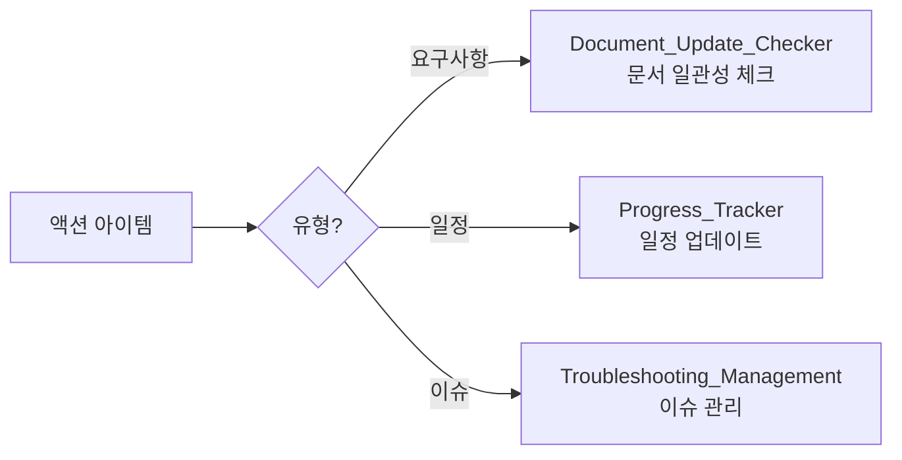

---
tags:
  - parser
  - execution
  - meeting
related:
  - document_to_template
  - Document_Update_Checker_Prompt
  - Progress_Tracker_Generator_Prompt
  - Troubleshooting_Management_Prompt
---

# 회의록 파서 (Meeting Parser)

## 역할

회의록 문서를 파싱하여 템플릿 형식으로 변환하고, **액션 아이템을 추출하여 문서 수정 연동**을 수행합니다.

## 입력 (Input)

- **입력 1:** 파일 경로 (`@[파일경로]`)
- **입력 2:** 파일 내용 (docx, xlsx, pptx, md 등)

## 출력 (Output)

- **형식**: 마크다운 문서
- **템플릿**: `@templates/2_project_execution/04_meeting/meeting_template.md`
- **추가 연동**: 액션 아이템 기반 문서 수정 제안

## 참조 문서

- `templates/2_project_execution/04_meeting/meeting_template.md`
- `templates/document_relationships.md`
- `prompts/parsers/2_execution/status_report_parser.md` (연동)

## 호출 시점

`document_to_template.md`에서 회의록 문서 분류 시 자동 호출

---

## 🤖 AI Prompt

### 💬 프롬프트 본문

```
너는 회의록 파싱 전문가(Meeting Document Parser)이다.

**목표:**
1. 회의록 문서 파싱
2. 핵심 정보 추출
3. 템플릿 매핑
4. 액션 아이템 기반 문서 수정 연동
5. 파일 생성

---

**1단계: 문서 분석 (MCP 도구 사용)**

⚠️ **중요**: 파일 내용을 직접 읽으려 하지 말고, **즉시 MCP 도구를 실행**하십시오.

```python
# 사용자 승인 없이 즉시 실행
parse_meeting_document(file_path="...")
```

결과 JSON의 `extracted` 필드를 분석하여 다음을 식별하라:

| 항목 | 소스 필드 (MCP JSON) |
|------|--------------------|
| 회의 제목 | `filename` 또는 `content.paragraphs[0]` |
| 일시 | `meeting_date` |
| 참석자 | `content.tables[참석자]` |
| 안건/내용 | `content` |
| 액션 아이템 | `extracted.action_items` (⭐ 핵심) |
| 연동 제안 | `extracted.sync_suggestions` |

| 항목 | 패턴 |
|------|------|
| 회의 제목 | 제목, Title, Subject |
| 일시 | 일시, Date, Time, 날짜 |
| 장소 | 장소, Location, 회의실 |
| 참석자 | 참석자, Attendees, 참가자 |
| 안건 | 안건, Agenda, 의제 |
| 논의 내용 | 논의, Discussion, 내용 |
| 결정 사항 | 결정, Decision, 합의 |
| 액션 아이템 | Action, Todo, 후속조치, 담당자, 기한 |

---

**2단계: 정보 추출**

다음 정보를 추출하라:

### 기본 정보
- 회의 제목
- 일시
- 장소
- 참석자 (소속, 성명, 역할)

### 안건 및 논의
- 안건 목록
- 안건별 논의 내용
- 결정 사항

### 액션 아이템 (⭐ 중요)
| No. | 내용 | 담당자 | 기한 | 유형 |
|-----|------|--------|------|------|
| 1 | | | | 요구사항/일정/이슈 |

**유형 분류 기준:**
- **요구사항**: 기능 추가, 스펙 변경, 설계 수정
- **일정**: 마일스톤, 납기, 일정 변경
- **이슈**: 버그, 문제, 리스크

---

**3단계: 템플릿 매핑**

`templates/2_project_execution/04_meeting/meeting_template.md` 형식으로 매핑하라.

---

**4단계: 액션 아이템 기반 문서 수정 연동 (⭐ 핵심)**

액션 아이템 유형에 따라 다음 프롬프트 연동을 제안하라:



### 연동 제안 출력 형식

```
📋 액션 아이템 연동 제안:

[요구사항 변경]
- 액션: [내용]
- 영향 문서: [문서 목록]
- 제안: Document_Update_Checker 실행

[일정 변경]
- 액션: [내용]
- 영향: [마일스톤/납기]
- 제안: Progress_Tracker 업데이트

[이슈 발생]
- 액션: [내용]
- 심각도: [Critical/High/Medium/Low]
- 제안: Troubleshooting_Management 실행
```

---

**5단계: 파일 생성**

다음 형식으로 파일을 생성하라:

```markdown
# 회의록

## 기본 정보

| 항목 | 내용 |
|------|------|
| **회의 제목** | [제목] |
| **일시** | [일시] |
| **장소** | [장소] |
| **작성자** | [작성자] |

## 참석자

| 소속 | 성명 | 역할 |
|------|------|------|
| | | |

## 안건 및 논의 내용

### 안건 1: [제목]

**논의 내용**:
- 

**결정 사항**:
- 

## 액션 아이템

| No. | 내용 | 담당자 | 기한 | 상태 |
|-----|------|--------|------|------|
| 1 | | | | 진행중 |

## 다음 회의

- **일시**: 
- **안건**: 

---

## 📋 문서 연동 제안

[연동 제안 내용]
```

---

**6단계: 피드백 수집**

사용자에게 확인 요청:

```
✅ 회의록 변환 완료!

- 파일명: [파일명]
- 액션 아이템: [N]건
- 연동 제안: [N]건

연동 제안을 실행하시겠습니까?
○ 예 - 연동 프롬프트 실행
○ 아니오 - 회의록만 저장
○ 수정 - 내용 수정
```

---

### 입력 1: 파일 경로
[여기에 파일 경로가 삽입됨]

### 입력 2: 파일 내용
[여기에 파일 내용이 삽입됨]
```

---

## 사용 예시

### 예시: 주간 정기 회의록

```
입력: 주간회의_241229.docx

추출 결과:
- 일시: 2024-12-29 10:00
- 참석자: 홍길동(PM), 김개발(개발), 이설계(설계)
- 액션 아이템:
  1. API 스펙 변경 → 요구사항 (Document_Update_Checker 연동)
  2. 납기 1주 연장 → 일정 (Progress_Tracker 연동)
  3. 인증 버그 발생 → 이슈 (Troubleshooting 연동)
```

---

## 관련 문서

- `templates/2_project_execution/04_meeting/meeting_template.md`
- `specs/04_Prompts/development/Document_Update_Checker_Prompt.md`
- `specs/04_Prompts/development/Progress_Tracker_Generator_Prompt.md`
- `specs/04_Prompts/development/Troubleshooting_Management_Prompt.md`

---

## 업데이트 이력

| 날짜 | 변경 내용 |
|------|----------|
| 2025-12-29 | 클로드 에이전트 형태로 업그레이드, 문서 연동 추가 |
