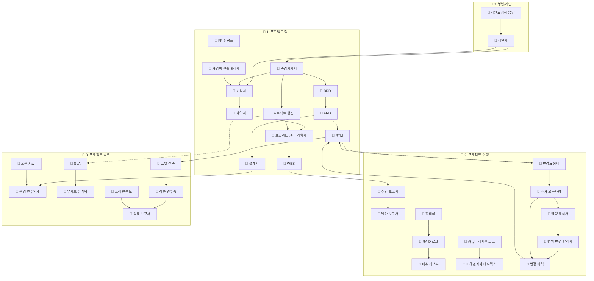
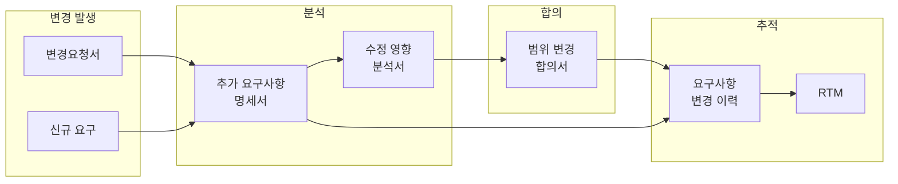
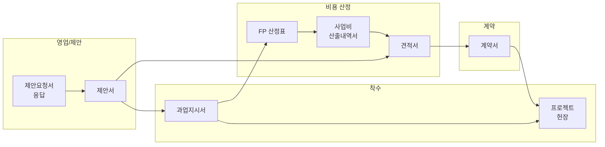
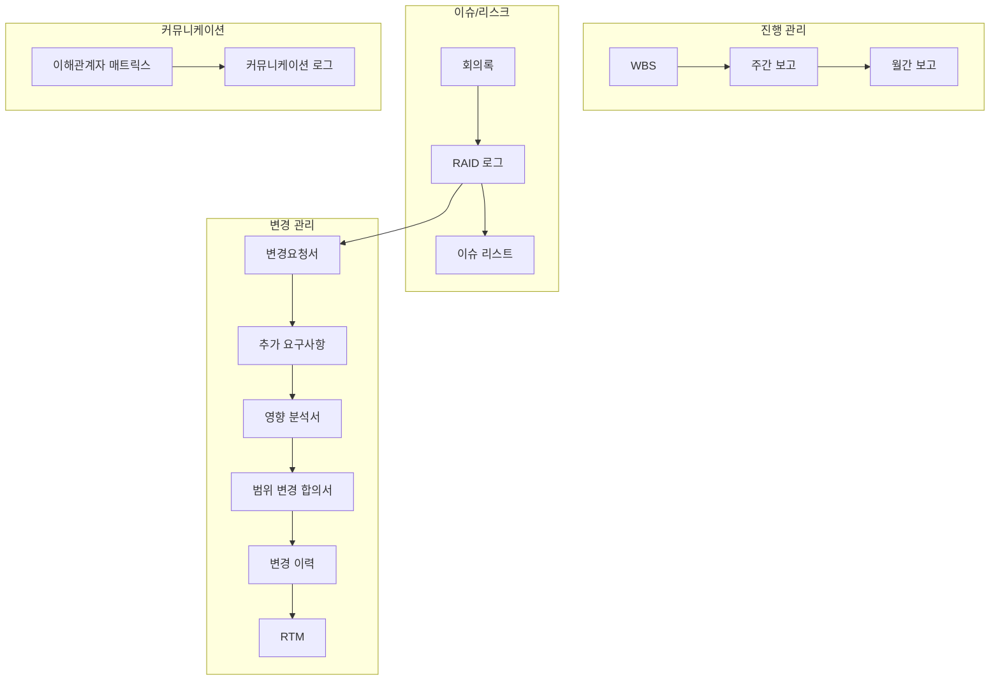
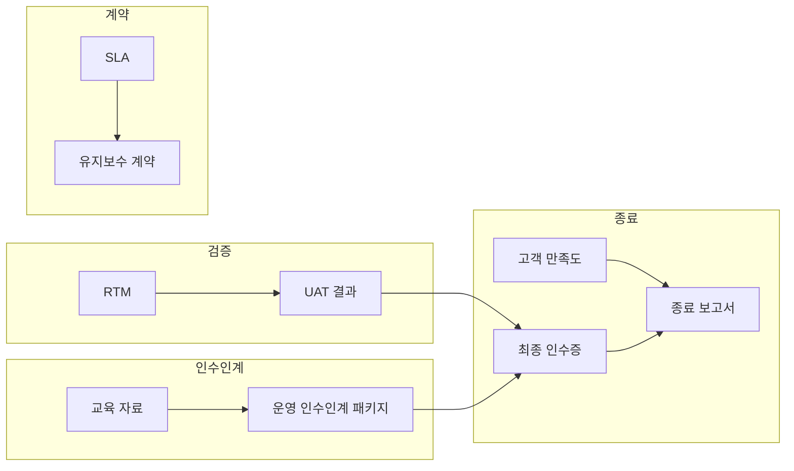

# PM 템플릿 문서 관계도

프로젝트 단계별 문서 간 관계 및 흐름을 시각화합니다.

---

## 📊 전체 문서 흐름도

---

## 🔄 요구사항 변경 관리 흐름

---

## 📐 영업/제안 → 착수 흐름

---

## 📈 수행 단계 상세 관계

---

## 🏁 종료 단계 상세 관계

---

## 📁 참조

- **문서 관계 JSON**: [document_relationships.json](./document_relationships.json)

---

## 🔗 관계 유형

| 유형 | 설명 | 표시 |
|------|------|------|
| `input` | A가 B의 입력 | A → B |
| `precedes` | A가 B보다 선행 | A → B |
| `contains` | A가 B를 포함 | A → B |
| `triggers` | A가 B를 촉발 | A → B |
| `tracks` | A를 B에서 추적 | A → B |
| `updates` | A가 B를 수정 | A -.-> B |
