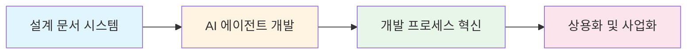

# AI 에이전트 기반 개발 혁신 프로젝트

> [!NOTE] 프로젝트 비전
> **AI 에이전트를 활용한 소프트웨어 개발의 패러다임 전환**
> 설계 문서 중심 개발 방법론과 AI 에이전트를 결합하여, 개발 생산성과 품질을 동시에 향상시키는 혁신적인 개발 프로세스 구축

---

## 📌 한눈에 보는 프로젝트

### 🎯 핵심 목표
**AI 에이전트를 활용한 설계 문서 기반 개발 시스템 구축 및 상용화**



### 🔄 프로젝트 진행 단계

| 기간 | 단계 | 핵심 활동 | 성과물 |
|------|------|-----------|--------|
| **2025 상반기** | 기술 연구 개발 | AI 에이전트 테스트 & 설계 문서 시스템 구축 | [AI_agent_test](../AI_agent_test) 프로젝트 |
| **2025 중반~현재** | 사업화 준비 | 사업 기획 & PM 활동 | 포트폴리오 & 사업 계획서 |
| **향후** | 상용화 | 제품 출시 & 시장 진입 | SaaS 플랫폼 |

---

## 🏗️ 프로젝트 배경

### Phase 1: 기술 연구 및 산업 DX 리딩 (2020~2025년 초)

> [!SUCCESS] Multi-Solution Expertise: 13+ Projects across 4 Core Domains
> **총괄 PM / Lead Developer**: 권순룡 (한솔코에버 연구소 팀장)  
> **주요 성과 요약**:
> - 🤖 **AI & Analytics**: AMS(피쉬본 이상탐지-특허/논문), CoCTK(데이터 분석 엔진), 일본 도료기업 전사 DX
> - 🌐 **Digital Platforms**: DPS(금속산업 AI 플랫폼-5층 아키텍처), 생산정보 연계 통합 운영(YP-25-3061)
> - 📡 **Smart Sensors & IoT**: 저비용 스마트센서 3종, AI 복합 센서(Edge AI), 실시간 전력품질 분석
> - ⚡ **Energy & Safety**: 산업용 클린룸 에너지 최적화(**GS 인증**), EV/ESS 디지털트윈 안전 시스템
>
> **기술 및 비즈니스 가치**:
> - ✅ **GS 인증 3개** 취득 및 특허 출원/등록 (한솔코에버 명의)
> - ✅ **학술적 검증**: 2020~2025년 **9편의 논문** 발표 (AI, 에너지, 데이터 분석 분야)
> - ✅ **대기업/기관 납품**: 세아특수강, 포미아(포항소재산업진흥원), 일본 글로벌 기업 등
> - ✅ **성과 검증**: 이상 탐지율 93.7%, 에너지 효율 20% 향상, 연간 수십억 원 규모의 손실 방지
> 
> 📖 상세 정보: [Projects Overview](portfolio/02_Projects_Overview.md) | [Academic Publications](portfolio/04_Academic_Publications.md) 🎓 | [Architecture Overview](portfolio/Architecture_Overview.md)

#### 핵심 영역별 성과
| 영역 | 주요 솔루션 | 핵심 기술 스택 |
|:---|:---|:---|
| **AI 엔진** | AMS, CoCTK | Python, ML Clustering, Random Forest, Linear Regression |
| **플랫폼** | DPS, DX 실증센터 | Docker Microservices, Neo4j Ontology, REST API |
| **IoT/센서** | 복합 센서, 저비용 센서 | Edge Computing, Modbus, RS232C-LAN, OPC-UA |
| **최적화** | 에너지 관리, 디지털트윈 | Time-series Anomaly, Pattern Recognition, GS인증 SW |

**1. 설계 문서 시스템 구축** (`obsidian_design_origin`)
- ✅ ID 기반 문서 관리 시스템 (`type.module.name` 형식)
- ✅ 25개 AI 프롬프트 라이브러리 구축
- ✅ 11개 설계 문서 템플릿 제작
- ✅ 문서 간 관계 추적 시스템 (Cross-Reference)
- ✅ 옵시디언 기반 지식 그래프 구조

**2. AI 에이전트 평가 프레임워크**
- ✅ 6개 관점 종합 평가 시스템
  - 업체 표준 문서 생성 가이드 (82점/B등급)
  - AI 기반 설계 문서 중심 개발 가이드 (81점/B등급)
  - 제품 평가 AI 가이드 (78점/C등급)
  - 개발업체 평가 (80점/B등급)
  - 팀별 평가 (74점/C등급)
  - 외부기관 평가 (75점/C등급)
- ✅ **종합 평가**: 78.74점 (C등급) - 개선 방향 도출

**3. 개발 프로세스 혁신**
- ✅ 설계 문서 기반 AI 협업 워크플로우
- ✅ 토큰 최적화 전략 수립
- ✅ 문서-코드 동기화 프로세스

**4. 실제 프로젝트 적용**
- ✅ AMS (Alarm Management System) 프로젝트
- ✅ C# WinForms 기반 Widget 시스템 개발
- ✅ 설계 문서 기반 개발 검증

#### 기술 스택
- **문서 시스템**: Obsidian, Markdown, Mermaid
- **개발 환경**: C#, .NET, WinForms
- **AI 도구**: Cursor AI, Claude, GPT
- **백엔드**: Supabase, React Query

### Phase 2: 사업화 준비 (2025 중반~현재)

> [!TIP] 사업 전환 및 PM 활동
> **핵심**: 기술 성과를 바탕으로 사업 모델 수립 및 포트폴리오 구축

#### 주요 활동

**1. 사업 기획**
- 🎯 타겟 시장 분석 (개발팀, 스타트업, 중소기업)
- 🎯 가치 제안 정의 (개발 생산성 향상, 품질 보증, 비용 절감)
- 🎯 비즈니스 모델 수립 (SaaS, 컨설팅, 교육)

**2. 포트폴리오 구축**
- 📚 [AI 업무 혁신을 위한 9단계 실행 가이드](portfolio/00_Portfolio_Index.md)
- 📚 "실행-자산화-확장" 방법론 체계화
- 📚 Phase별 실행 가이드 및 사례 정리

**3. PM 활동**
- 📊 프로젝트 로드맵 수립
- 📊 우선순위 관리 및 리소스 배분
- 📊 이해관계자 커뮤니케이션

---

## 📂 프로젝트 구조

```
github_moobeak/
├── Testing_AI_agents_for_public_use/     # 현재 저장소 (공개용)
│   ├── portfolio/                         # 포트폴리오 (9단계 가이드)
│   │   ├── 00_Portfolio_Index.md         # 포트폴리오 메인
│   │   ├── Phase_1_Foundation/           # 기반 구축 (Steps 1-5)
│   │   ├── Phase_2_Assets/               # 자산화 (Steps 6-7)
│   │   └── Phase_3_Expansion/            # 확장 (Steps 8-9)
│   └── README.md                         # 이 문서
│
└── AI_agent_test/                        # 기술 연구 프로젝트 (비공개)
    ├── AMS/                              # AMS 프로젝트 (v1.0, v2.0)
    │   ├── front_back_basic/            # Widget 시스템
    │   └── docs/                        # 설계 문서 & 평가 리포트
    │       ├── evaluation/              # 평가 결과 (2025-12-01, 02)
    │       ├── evaluation_pre/          # 평가 프레임워크
    │       └── meta/                    # 개발자 가이드, 학습 문서
    └── Original_Development_Plan/        # 원본 개발 계획 & 설계 문서
        └── docs/                        # obsidian_design_origin
```

---

## 🚀 핵심 성과물

### 1. 설계 문서 시스템
**위치**: `../AI_agent_test/Original_Development_Plan/docs/`

- **ID 시스템**: 문서 고유 식별자 및 관계 추적
- **프롬프트 라이브러리**: 25개 AI 프롬프트 (체계적 구조)
- **템플릿 시스템**: 11개 설계 문서 템플릿
- **워크플로우 가이드**: AI 기반 개발 프로세스

**평가 결과**:
- ✅ 구조적 완결성: 우수
- ✅ 문서 간 관계성: 우수
- ⚠️ 비기능 요구사항: 보완 필요

### 2. AI 업무 혁신 9단계 가이드
**위치**: [portfolio/00_Portfolio_Index.md](portfolio/00_Portfolio_Index.md)

**3단계 철학**: 실행(Foundation) → 자산화(Assets) → 확장(Expansion)

| Phase | 단계 | 설명 |
|-------|------|------|
| **🟦 Phase 1** | Foundation | 반복 업무 식별 → 전문성 타겟팅 → 마이크로 시작 → 모듈화 → I/O 최적화 |
| **🟩 Phase 2** | Assets | 일일 로그 작성 → 시각 자산 구축 |
| **🟧 Phase 3** | Expansion | 피드백 루프 → 지속적 업데이트 |

### 3. 평가 프레임워크
**위치**: `../AI_agent_test/AMS/docs/evaluation/`

**6가지 평가 관점**:
1. 업체 표준 문서 생성 가이드
2. AI 기반 설계 문서 중심 개발 가이드
3. 제품 평가 AI 가이드
4. 개발업체 평가
5. 팀별 평가
6. 외부기관 평가

---

## 🎯 향후 계획

### 단기 목표 (3개월)
- [ ] 포트폴리오 완성 및 공개
- [ ] 설계 문서 시스템 개선 (비기능 요구사항 보완)
- [ ] 데모 프로젝트 제작 (공개용)
- [ ] 기술 블로그 시작

### 중기 목표 (6개월)
- [ ] SaaS 플랫폼 MVP 개발
- [ ] 베타 테스터 모집 및 피드백 수집
- [ ] 사업 파트너 발굴
- [ ] 투자 유치 준비

### 장기 목표 (1년)
- [ ] 상용 서비스 출시
- [ ] 100개 팀 사용 달성
- [ ] 오픈소스 커뮤니티 구축
- [ ] 교육 프로그램 런칭

---

## 📖 주요 문서

### 포트폴리오
- [📘 포트폴리오 메인](portfolio/00_Portfolio_Index.md)
- [🟦 Phase 1: Foundation](portfolio/Phase_1_Foundation/)
  - [Step 1: 반복적 업무 식별](portfolio/Phase_1_Foundation/Step_01_Repetitive_Work.md) - **AMS 프로젝트 핵심 성과**
  - [Step 4: 모듈화 전략](portfolio/Phase_1_Foundation/Step_04_Modularization.md) - **대폭 강화**
  - [Step 5: I/O 최적화](portfolio/Phase_1_Foundation/Step_05_IO_Optimization.md) - **대폭 강화**
- [🟩 Phase 2: Assets](portfolio/Phase_2_Assets/)
- [🟧 Phase 3: Expansion](portfolio/Phase_3_Expansion/)
- [🏗️ Architecture Overview](portfolio/Architecture_Overview.md) - **Architecture for Multiple Solutions**
- [🎓 Academic Publications](portfolio/04_Academic_Publications.md) - **9+ Recent Research Papers** 🎓
- [🧪 Testing Context](portfolio/Testing_Context.md) - **GS Certification & Global DX Cases**

### 기술 문서 (AI_agent_test)
- [📋 개발자 가이드](../AI_agent_test/AMS/docs/meta/Developer_Guide.md)
- [📊 종합 평가 리포트](../AI_agent_test/AMS/docs/evaluation/results/2025-12-02/종합_평가_리포트/Master_Blueprint_Generator_Evaluation_Report.md)
- [🔧 평가 프레임워크](../AI_agent_test/AMS/docs/evaluation/Master_Blueprint_Generator_Evaluation_Framework.md)

---

## 🤝 기여 방법

이 저장소는 AI 에이전트 기반 개발 혁신을 위한 오픈 프로젝트입니다.

**기여 방법**:
1. 이슈 제기 (기능 제안, 버그 리포트)
2. Pull Request (문서 개선, 가이드 추가)
3. 피드백 공유 (사용 경험, 개선 아이디어)

---

## 📬 연락처

**프로젝트 관리자**: [Your Name]
**이메일**: [Your Email]
**GitHub**: [Your GitHub Profile]

---

> [!QUOTE] 프로젝트 철학
> "작은 성공부터 시작하여, 지식을 자산화하고, 지속적으로 확장한다"
> - AI 업무 혁신 9단계 가이드 중에서
