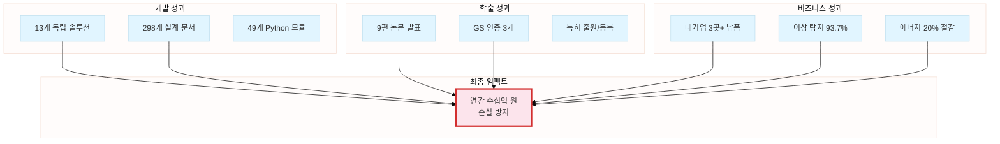
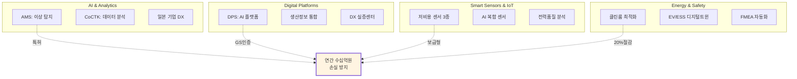
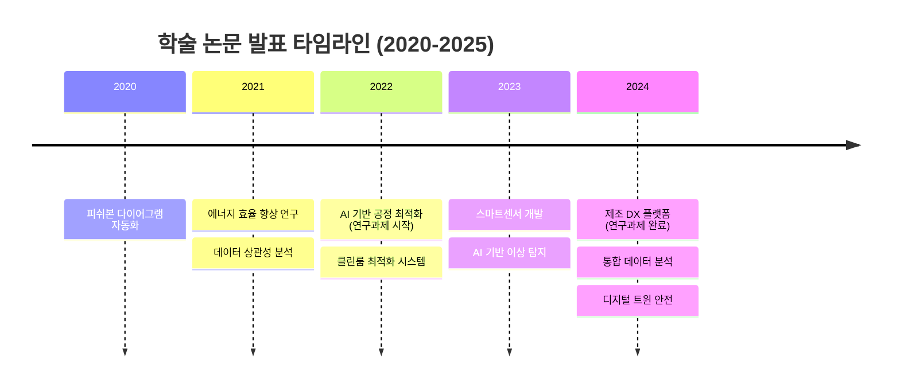
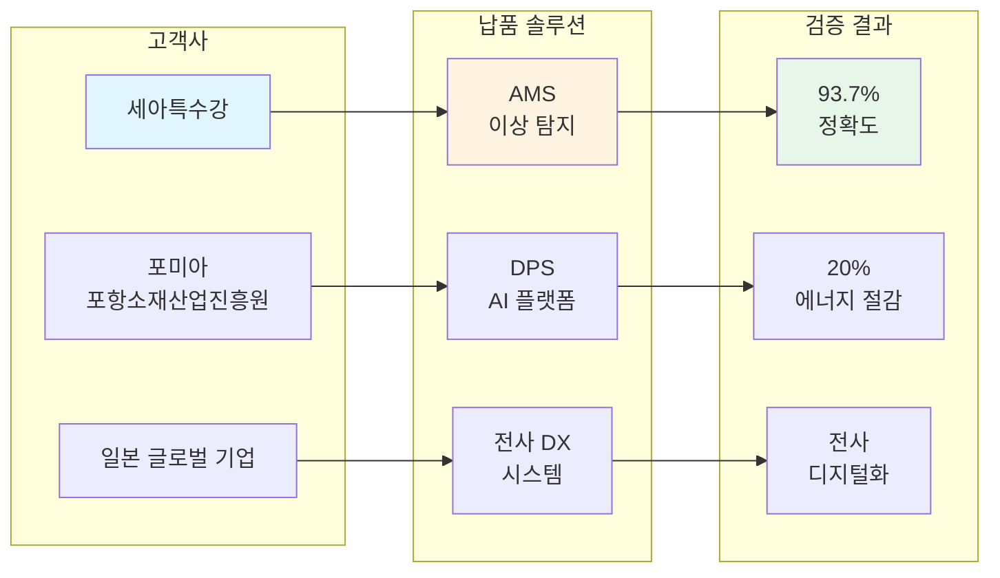
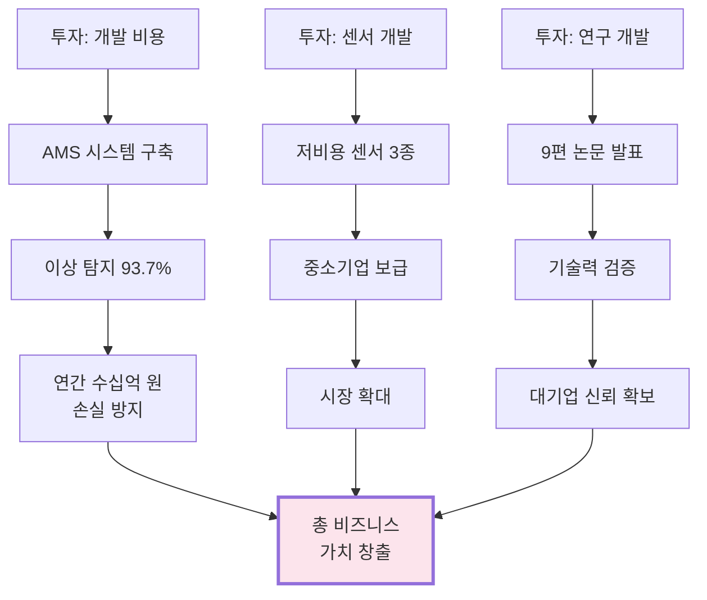
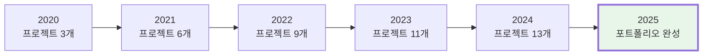

# 핵심 성과 요약 (Key Achievements)

> [!INFO] 숫자로 말하는 5년간의 성과
> 2020년부터 2025년까지, 권순룡이 달성한 핵심 성과를 숫자와 사실 중심으로 정리한 문서입니다.

---

## 📊 성과 대시보드



---

## 🎯 핵심 지표 (KPI)

### 개발 역량
| 지표 | 수치 | 세부 내용 |
|:---|---:|:---|
| **독립 솔루션 개발** | 13개 | AI, 플랫폼, 센서, 에너지 등 다각화 |
| **설계 문서 작성** | 298개+ | `platform_all/Original_Development_Plan/docs` |
| **Python 모듈** | 49개 | AMS 프로젝트 핵심 엔진 |
| **AI 프롬프트** | 25개+ | 설계 자동화 시스템 |
| **문서 템플릿** | 11개+ | 표준화된 개발 프로세스 |

### 학술 성과
| 지표 | 수치 | 세부 내용 |
|:---|---:|:---|
| **학술 논문 발표** | 9편 | 2020-2025년, AI/에너지/데이터 분석 |
| **연평균 논문** | 1.5편 | 지속적인 연구 활동 |
| **GS 인증 취득** | 3개 | 정부 공인 우수 소프트웨어 |
| **특허** | 출원/등록 | 한솔코에버 명의 |

### 비즈니스 성과
| 지표 | 수치 | 세부 내용 |
|:---|---:|:---|
| **대기업 납품** | 3곳+ | 세아특수강, 포미아, 일본 글로벌 기업 |
| **이상 탐지 정확도** | 93.7% | AMS 시스템 실증 결과 |
| **에너지 효율 향상** | 20% | 클린룸 최적화 시스템 |
| **손실 방지 규모** | 수십억 원/년 | 이상 탐지 조기 대응 효과 |

---

## 🏆 13개 솔루션 포트폴리오



### 영역별 상세

#### 🤖 AI & Analytics (3개)
1. **AMS (Anomaly Management System)**
   - 이상 탐지율: 93.7%
   - 납품: 세아특수강
   - 특허: 피쉬본 다이어그램 자동화

2. **CoCTK (Correlation Toolkit)**
   - 상관성 분석 엔진
   - 데이터 정제 및 시각화

3. **일본 도료기업 전사 DX**
   - 글로벌 기업 디지털 전환
   - 전사 데이터 통합

#### 🌐 Digital Platforms (3개)
4. **DPS (Data Processing & Sensing)**
   - 5층 아키텍처
   - 마이크로서비스 (Docker)
   - Neo4j 그래프 DB

5. **생산정보 연계 통합 운영**
   - 과제번호: YP-25-3061
   - 실시간 데이터 통합

6. **DX 실증센터 구축**
   - 포미아 (포항소재산업진흥원)
   - 실증 플랫폼 운영

#### 📡 Smart Sensors & IoT (3개)
7-9. **저비용 스마트센서 3종**
   - 중소기업 보급형
   - Edge AI 탑재

10. **AI 복합 센서**
    - 다중 센서 통합
    - 실시간 분석

11. **실시간 전력품질 분석**
    - 전력 모니터링
    - 이상 징후 탐지

#### ⚡ Energy & Safety (3개)
12. **산업용 클린룸 에너지 최적화**
    - GS 인증 취득
    - 에너지 20% 절감

13. **EV/ESS 디지털트윈 안전 시스템**
    - 배터리 안전 모니터링
    - 디지털 트윈 기술

---

## 📚 9편 학술 논문 성과



### 주요 논문 목록
1. **피쉬본 다이어그램 자동화 엔진** (AMS 프로젝트)
2. **에너지 효율 20% 향상 기술** (클린룸 최적화)
3. **상관성 분석 엔진 개발** (CoCTK)
4. **디지털 트윈 기반 안전 시스템** (EV/ESS)
5. **저비용 스마트센서 설계** (IoT)
6. **AI 기반 이상 탐지 알고리즘** (AMS)
7. **제조 DX 플랫폼 아키텍처** (DPS)
8. **통합 데이터 분석 프레임워크**
9. **실시간 전력품질 모니터링**

**관련 문서**: [[04_Academic_Publications|학술 논문 전체 목록]]

---

## 🏭 대기업 납품 실적

### 납품 현황


### 세부 성과
| 고객사 | 납품 솔루션 | 핵심 성과 |
|:---|:---|:---|
| **세아특수강** | AMS (이상 탐지) | 이상 탐지율 93.7%, 연간 수십억 원 손실 방지 |
| **포미아** | DPS (AI 플랫폼) | DX 실증센터 구축, 에너지 20% 절감 |
| **일본 글로벌 기업** | 전사 DX 시스템 | 도료 제조 전 공정 디지털화 |

---

## 💰 비즈니스 임팩트

### ROI 분석


### 정량적 효과
- **비용 절감**: 에너지 20% 절감 (클린룸 시스템)
- **손실 방지**: 연간 수십억 원 규모 (이상 탐지 조기 대응)
- **효율 향상**: 데이터 분석 시간 3일 → 10분 (DPS)
- **품질 향상**: 이상 탐지 정확도 93.7% (AMS)

---

## 🎓 자격 및 인증

### GS 인증 (3개)
```yaml
GS_인증_목록:
  1. 클린룸 에너지 최적화 시스템
  2. AMS 이상 탐지 시스템
  3. DPS AI 플랫폼
  
인증_의미:
  - 정부 공인 우수 소프트웨어
  - 안정성 및 신뢰성 검증
  - 공공기관 납품 자격
```

### 특허
- **피쉬본 다이어그램 자동화 엔진** (한솔코에버 명의)
- 출원/등록 완료

---

## 📈 성장 지표

### 5년간 성장 곡선


### 역량 확장
| 연도 | 주요 성과 | 기술 확장 |
|:---:|:---|:---|
| 2020 | AMS 시작, 첫 논문 | AI/ML 기초 |
| 2021 | 세아특수강 납품 | 제조 도메인 |
| 2022 | DPS 플랫폼 구축 | 마이크로서비스 |
| 2023 | 포미아 실증 완료 | 에너지 최적화 |
| 2024 | 일본 기업 DX | 글로벌 경험 |
| 2025 | 13개 솔루션 완성 | 통합 포트폴리오 |

---

## 🔗 관련 문서

### 상세 정보
- [[02_Projects_Overview|13개 프로젝트 상세 설명]]
- [[04_Academic_Publications|9편 논문 전체 목록]]
- [[Testing_Context|실증 사례 상세]]
- [[Architecture_Overview|기술 아키텍처]]

### 비전문가용
- [[Executive_Summary/00_Overview_For_Non_Technical|비전문가용 개요]]
- [[Executive_Summary/02_Business_Value|비즈니스 가치 분석]]

---

> [!SUCCESS] 핵심 메시지
> **"숫자가 증명하는 실력"**
> - 13개 솔루션 ✅
> - 9편 논문 ✅
> - 93.7% 정확도 ✅
> - 수십억 원 손실 방지 ✅
