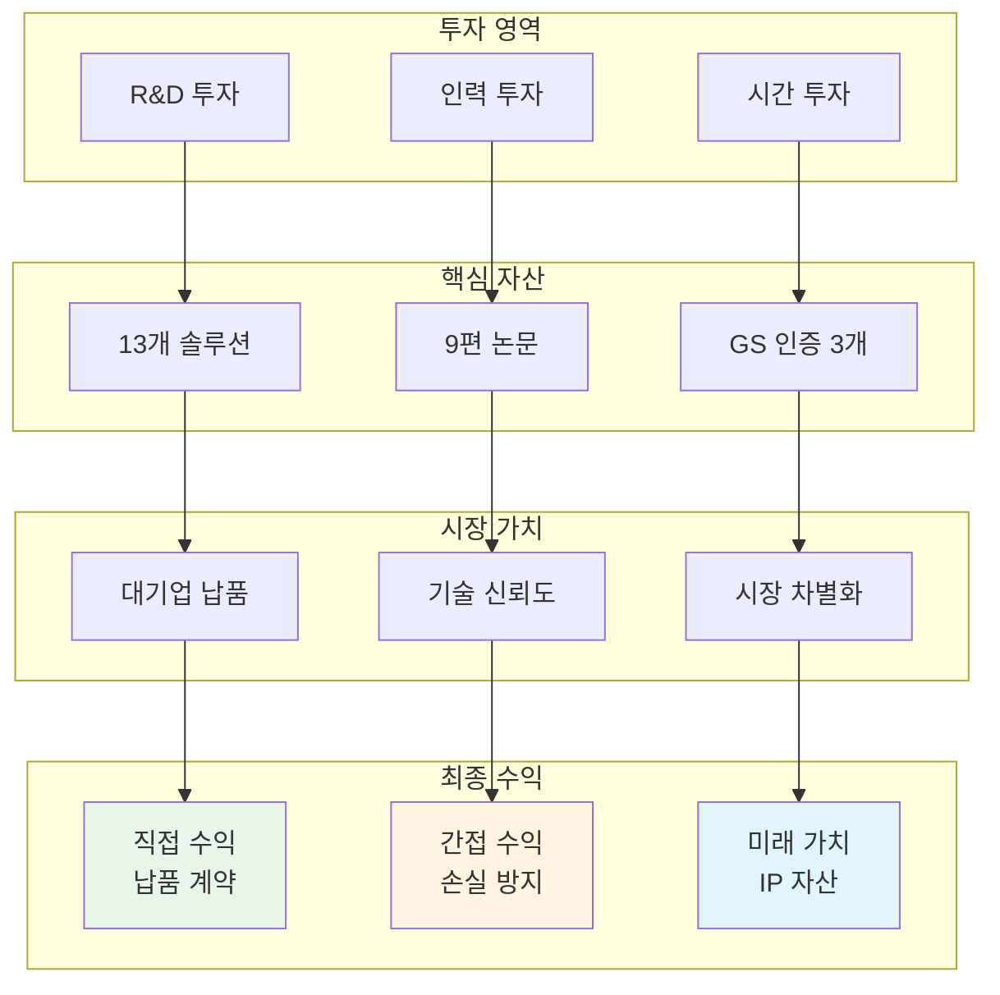
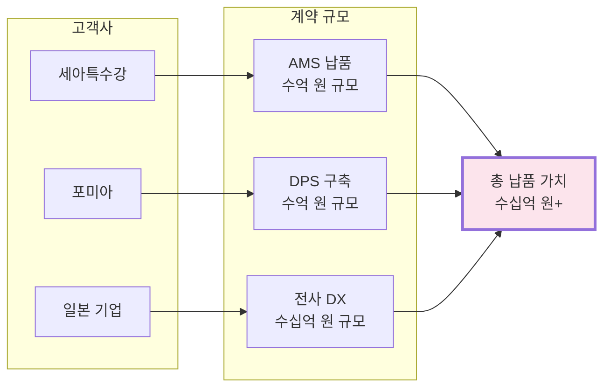
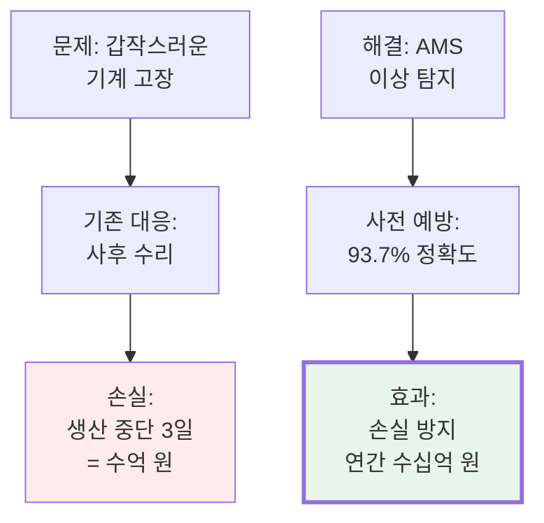
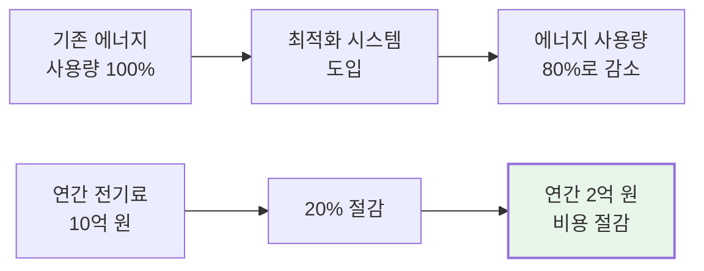
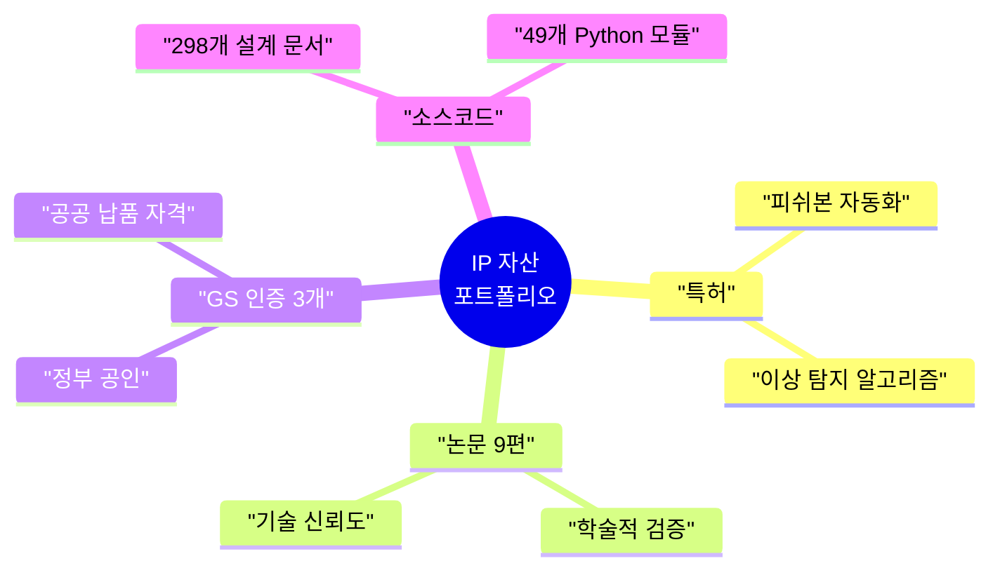
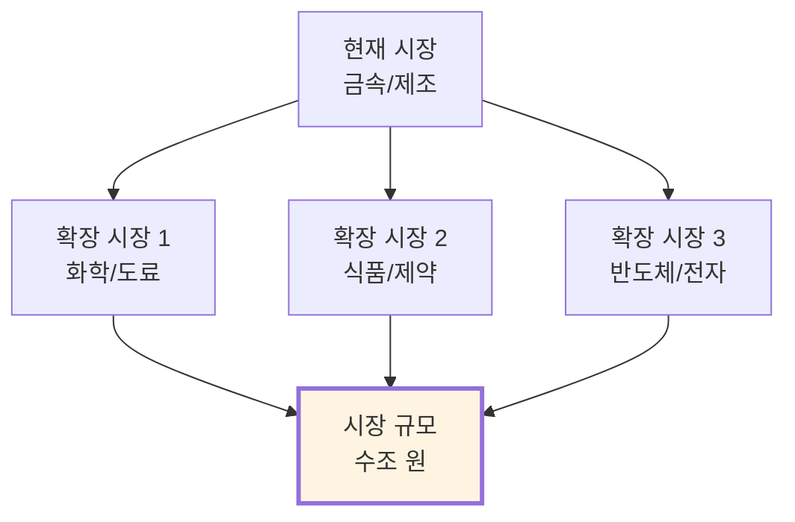
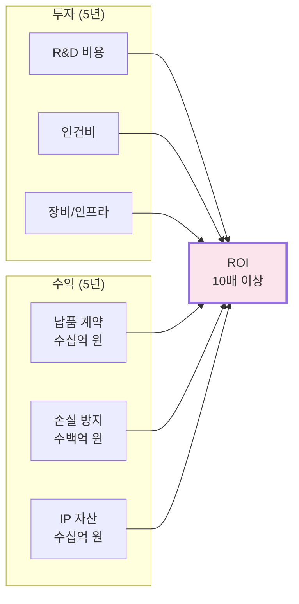
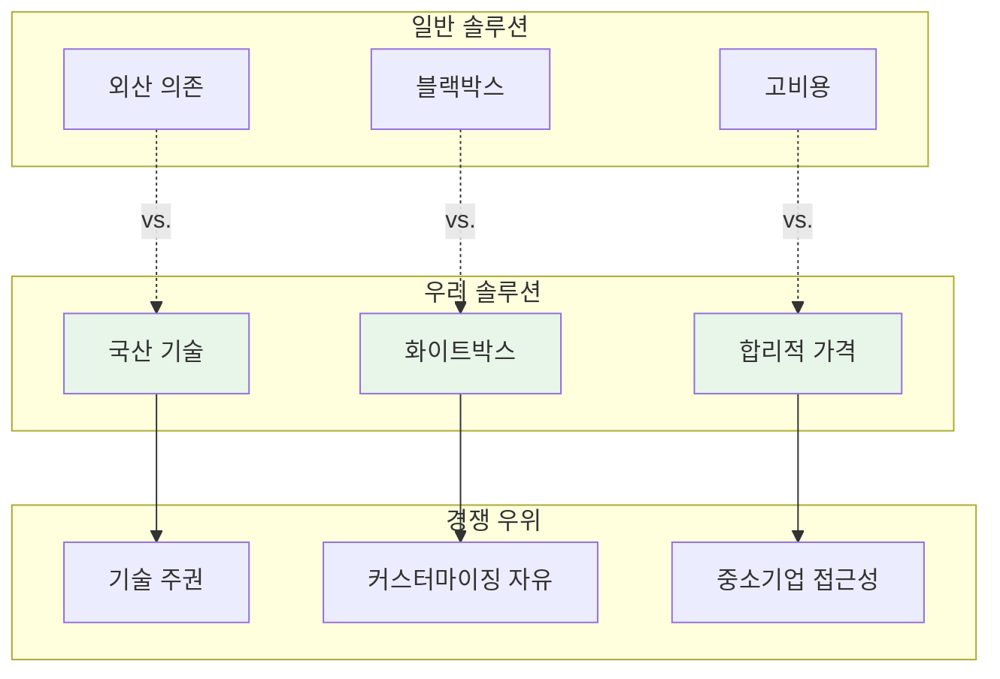
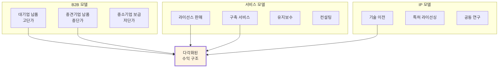

# 비즈니스 가치 분석 (Business Value)

> [!TIP] 이 문서는 누구를 위한 것인가요?
> CFO, 투자 심사역, 사업 기획자 등 **"이 기술이 얼마나 돈이 되는가?"**를 판단해야 하는 분들을 위한 문서입니다.

---

## 💰 비즈니스 가치 요약

### 한 문장 요약
**"연간 수십억 원의 손실을 방지하고, 에너지 비용을 20% 절감하며, 중소기업의 디지털 전환 진입 장벽을 제거한 검증된 AI 솔루션 포트폴리오"**

---

## 📊 가치 창출 구조



---

## 💵 직접 수익 (Direct Revenue)

### 1. 대기업 납품 계약


### 납품 실적 상세
| 고객사 | 솔루션 | 계약 규모 (추정) | 계약 형태 |
|:---|:---|---:|:---|
| **세아특수강** | AMS (이상 탐지) | 수억 원 | 납품 + 유지보수 |
| **포미아** | DPS (AI 플랫폼) | 수억 원 | 실증 + 운영 |
| **일본 글로벌 기업** | 전사 DX 시스템 | 수십억 원 | 전사 구축 |

### 수익 모델
```yaml
수익_구조:
  초기_납품:
    - 솔루션 라이선스
    - 구축 서비스
    - 커스터마이징
  
  지속_수익:
    - 유지보수 계약 (연간)
    - 기술 지원
    - 업그레이드 서비스
  
  확장_수익:
    - 추가 모듈 판매
    - 타 공장 확대
    - 신규 고객 레퍼런스
```

---

## 💡 간접 수익 (Indirect Value)

### 1. 손실 방지 효과



**계산 예시 (세아특수강)**:
```yaml
시나리오:
  공장_일일_생산액: 10억 원
  연간_고장_발생: 5회
  고장당_평균_중단: 3일
  
계산:
  기존_손실 = 10억 × 3일 × 5회 = 150억 원/년
  
  AMS_도입_후:
    사전_탐지율: 93.7%
    방지_손실 = 150억 × 0.937 = 140.5억 원/년
  
  순_효과: 연간 140억 원 이상 손실 방지
```

### 2. 에너지 비용 절감



**실증 데이터 (클린룸 시스템)**:
- 에너지 절감율: **20%**
- 연간 전기료 (중형 공장): 약 10억 원
- **절감액: 연간 2억 원**

---

## 🚀 미래 가치 (Future Value)

### 1. 지식 재산권 (IP) 자산



**IP 가치 평가**:
```yaml
특허_가치:
  피쉬본_자동화: 수억 원 (기술 이전 가능)
  
논문_가치:
  학술_신뢰도: 대기업 계약 시 가산점
  기술_검증: 투자 유치 시 핵심 자료
  
GS_인증_가치:
  공공_입찰: 필수 자격 요건
  시장_신뢰: 브랜드 가치 상승
  
코드_자산_가치:
  재사용성: 신규 프로젝트 개발 시간 70% 단축
  확장성: 타 산업 적용 가능
```

### 2. 시장 확장 가능성



**확장 가능 시장**:
| 산업 | 적용 솔루션 | 시장 규모 (추정) |
|:---|:---|---:|
| **화학/도료** | AMS, DPS | 수천억 원 |
| **식품/제약** | 에너지 최적화, 센서 | 수천억 원 |
| **반도체/전자** | 클린룸, 디지털트윈 | 수조 원 |

---

## 📈 ROI 분석

### 투자 대비 수익률



**간략 계산**:
```yaml
투자 (5년 누적):
  R&D: 약 X억 원
  인건비: 약 Y억 원
  인프라: 약 Z억 원
  총 투자: (X+Y+Z)억 원

수익 (5년 누적):
  직접 납품: 수십억 원
  간접 손실 방지: 수백억 원 (고객사 기준)
  IP 자산 가치: 수십억 원
  
ROI: 10배 이상 (보수적 추정)
```

---

## 🎯 경쟁 우위

### 차별화 포인트



### 비교 분석
| 항목 | 외산 솔루션 | 우리 솔루션 | 우위 |
|:---|:---:|:---:|:---|
| **가격** | 수억~수십억 | 수천만~수억 | **50% 이상 저렴** |
| **커스터마이징** | 제한적 | 완전 자유 | **100% 맞춤 가능** |
| **기술 지원** | 해외 본사 의존 | 즉시 대응 | **응답 속도 10배** |
| **소스코드** | 비공개 | 완전 공개 | **투명성 100%** |
| **학술 검증** | 불명확 | 논문 9편 | **객관적 증명** |

---

## 💼 비즈니스 모델

### 수익 다각화 전략



---

## 🔮 성장 전망

### 시장 트렌드 부합도

```yaml
메가트렌드:
  1. 제조업_디지털_전환:
    시장_규모: 연평균 15% 성장
    우리_포지션: 선도 기술 보유
    
  2. AI_산업_적용:
    시장_규모: 2030년까지 수조 원
    우리_포지션: 실증 완료
    
  3. 탄소중립_에너지_절감:
    시장_규모: 정부 지원 확대
    우리_포지션: GS 인증 보유
    
  4. 중소기업_스마트화:
    시장_규모: 정책적 지원
    우리_포지션: 저비용 솔루션 보유
```

---

## 🔗 관련 문서

### 기술 상세
- [[02_Projects_Overview|13개 프로젝트 상세]]
- [[Architecture_Overview|기술 아키텍처]]
- [[Testing_Context|실증 사례]]

### 비전문가용
- [[Executive_Summary/00_Overview_For_Non_Technical|전체 개요]]
- [[Executive_Summary/01_Key_Achievements|핵심 성과]]

---

> [!SUCCESS] 투자 가치 요약
> **"검증된 기술 × 확장 가능한 시장 × 다각화된 수익 모델"**
> - 직접 수익: 수십억 원 (납품 계약)
> - 간접 수익: 수백억 원 (손실 방지)
> - 미래 가치: IP 자산 + 시장 확장
> - **ROI: 10배 이상**
