# 기술을 쉽게 설명하면? (Technology Simplified)

> [!INFO] 이 문서의 목적
> 복잡한 기술 용어 없이, 비유와 스토리텔링으로 **"이 사람이 만든 기술이 무엇이고, 어떻게 작동하는지"**를 쉽게 이해할 수 있도록 설명합니다.

---

## 🎯 전체 그림: 공장의 "AI 건강 관리 시스템"

### 비유로 이해하기
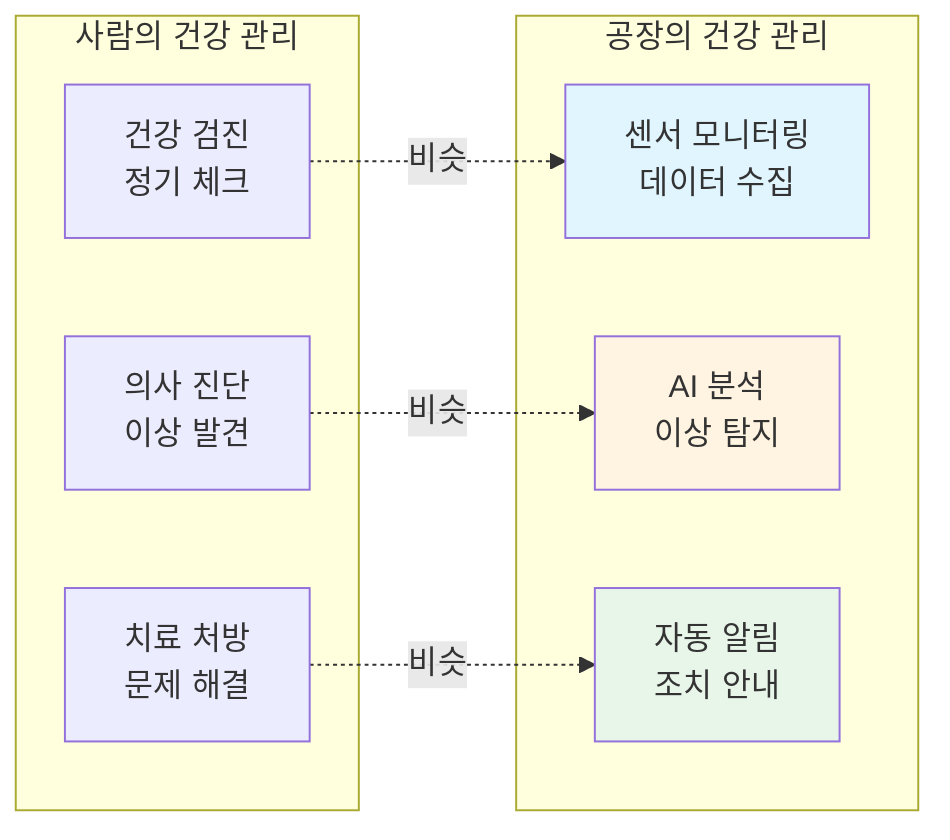

**핵심 메시지**:
- 사람이 병원에서 건강 검진을 받듯이, 공장 기계도 AI가 상태를 체크합니다.
- 의사가 이상 징후를 발견하듯이, AI가 고장 징후를 미리 발견합니다.
- 의사가 치료를 처방하듯이, AI가 조치 방법을 알려줍니다.

---

## 🤖 솔루션 1: AMS (공장의 AI 의사)

### 무엇을 하나요?
**"공장 기계가 고장 나기 전에 미리 알려주는 AI 시스템"**

### 어떻게 작동하나요?

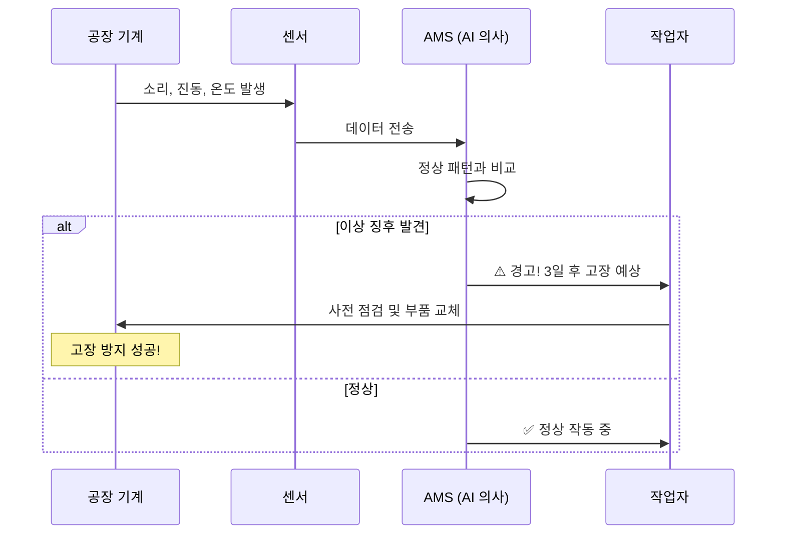

### 실제 사례로 이해하기

**상황**: 세아특수강 공장의 압연 기계
```yaml
문제:
  - 갑자기 기계가 고장 나면 생산이 3일 중단
  - 하루 생산액이 10억 원이면, 손실은 30억 원
  
기존_방식:
  - 고장 나면 그때 수리 (사후 대응)
  - 예측 불가능
  
AMS_도입_후:
  - AI가 소리와 진동 패턴을 분석
  - "3일 후 베어링 고장 예상" 미리 알림
  - 주말에 미리 교체 → 생산 중단 없음
  
결과:
  - 이상 탐지 정확도: 93.7%
  - 연간 손실 방지: 수십억 원
```

### 비유: 자동차 경고등
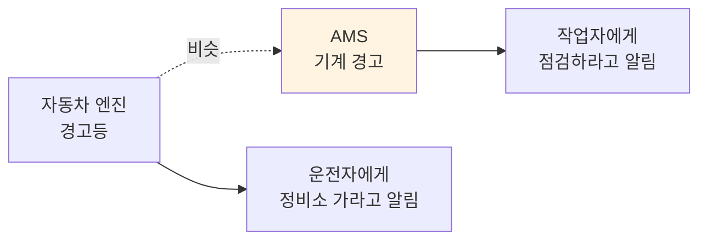

**설명**:
- 자동차 계기판의 경고등이 켜지면 "엔진 점검하세요"라고 알려주죠?
- AMS도 똑같습니다. 기계 상태를 보고 "이 부품 곧 고장 날 것 같아요"라고 미리 알려줍니다.

---

## 🌐 솔루션 2: DPS (공장의 AI 비서)

### 무엇을 하나요?
**"복잡한 공장 데이터를 AI가 자동으로 정리하고 분석해주는 시스템"**

### 어떻게 작동하나요?

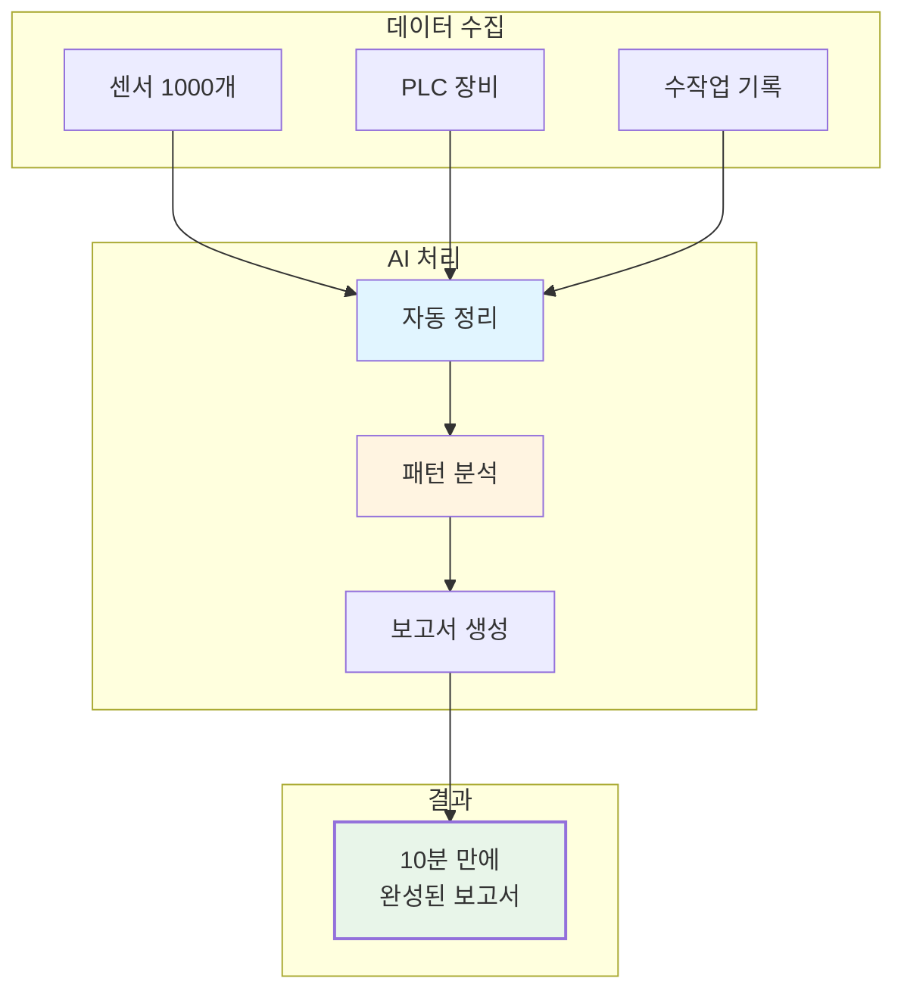

### 실제 사례로 이해하기

**상황**: 포미아 (포항소재산업진흥원) DX 실증센터
```yaml
문제:
  - 공장 데이터가 엑셀 파일 수백 개에 흩어져 있음
  - 보고서 만드는 데 3일 소요
  - 사람이 수작업으로 정리 → 실수 많음
  
DPS_도입_후:
  - AI가 자동으로 데이터 수집
  - 패턴 분석 및 이상 징후 탐지
  - 10분 만에 보고서 자동 생성
  
결과:
  - 작업 시간: 3일 → 10분 (99% 단축)
  - 정확도: 수작업 70% → AI 95%
  - 인력 절감: 3명 → 1명
```

### 비유: 스마트폰 AI 비서
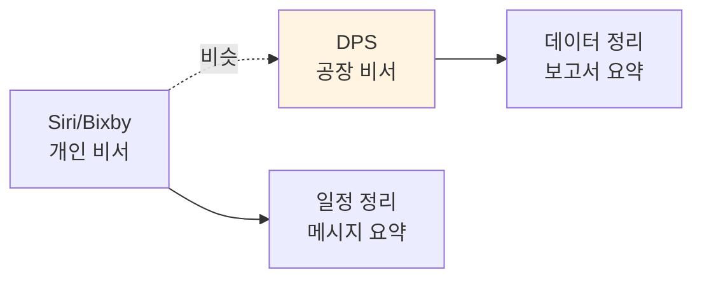

**설명**:
- 스마트폰의 AI 비서가 "오늘 일정 알려줘"라고 하면 자동으로 정리해주죠?
- DPS도 똑같습니다. "이번 주 생산 현황 보고서 만들어줘"라고 하면 AI가 자동으로 만들어줍니다.

---

## 📡 솔루션 3: 스마트센서 (공장의 저비용 CCTV)

### 무엇을 하나요?
**"비싼 센서 대신, 저렴한 가격으로 공장 데이터를 수집하는 IoT 센서"**

### 가격 비교

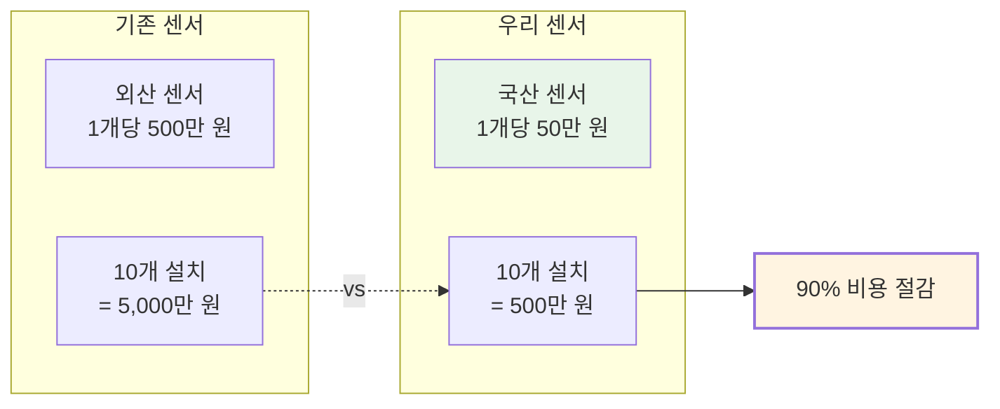

### 실제 사례로 이해하기

**상황**: 일본 도료 제조 기업
```yaml
문제:
  - 중소 규모 공장이라 비싼 센서 구매 부담
  - 센서 1개당 500만 원 × 100개 = 5억 원
  - 예산 부족으로 디지털화 포기
  
우리_센서_도입:
  - 센서 1개당 50만 원 × 100개 = 5천만 원
  - 기능은 동일 (온도, 압력, 진동 측정)
  - Edge AI 탑재로 현장에서 바로 분석
  
결과:
  - 비용: 5억 원 → 5천만 원 (90% 절감)
  - 전사 디지털화 성공
  - 데이터 기반 의사결정 가능
```

### 비유: 스마트폰 vs 고급 카메라
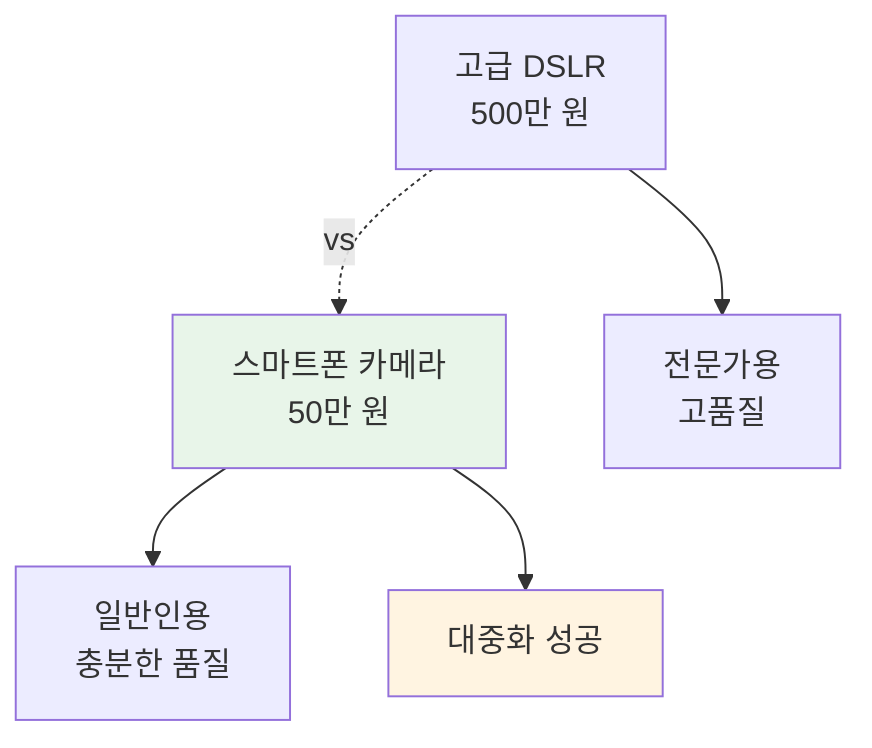

**설명**:
- 전문 사진작가는 500만 원짜리 DSLR을 쓰지만, 일반인은 스마트폰으로도 충분하죠?
- 우리 센서도 똑같습니다. 대기업은 비싼 센서를 쓰지만, 중소기업은 우리 센서로도 충분합니다.

---

## ⚡ 솔루션 4: 에너지 최적화 (전기료 절약 AI)

### 무엇을 하나요?
**"공장의 전기 사용 패턴을 AI가 분석하여 낭비를 줄여주는 시스템"**

### 어떻게 작동하나요?

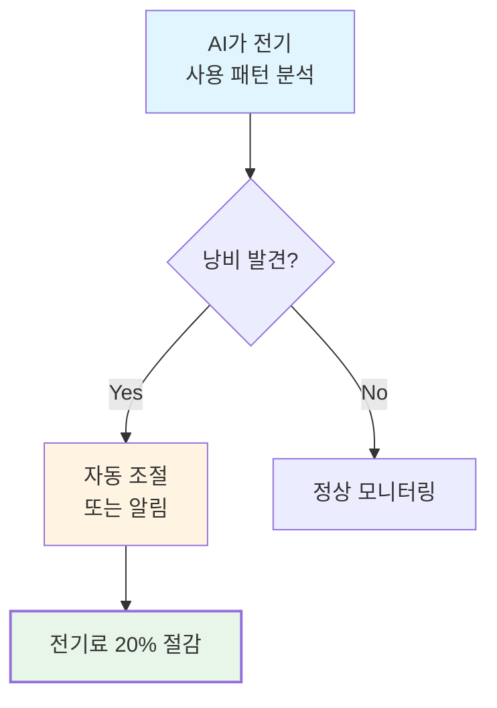

### 실제 사례로 이해하기

**상황**: 산업용 클린룸 (GS 인증 취득)
```yaml
문제:
  - 클린룸은 24시간 공조 시스템 가동
  - 연간 전기료: 10억 원
  - 비효율적인 운영으로 낭비 많음
  
AI_최적화_후:
  - AI가 온도, 습도, 생산 일정 분석
  - "지금은 생산 없으니 공조 70%로 낮춰도 됨" 자동 조절
  - 필요할 때만 100% 가동
  
결과:
  - 에너지 사용량: 20% 감소
  - 연간 전기료 절감: 2억 원
  - GS 인증 취득 (정부 공인 품질)
```

### 비유: 스마트 온도조절기
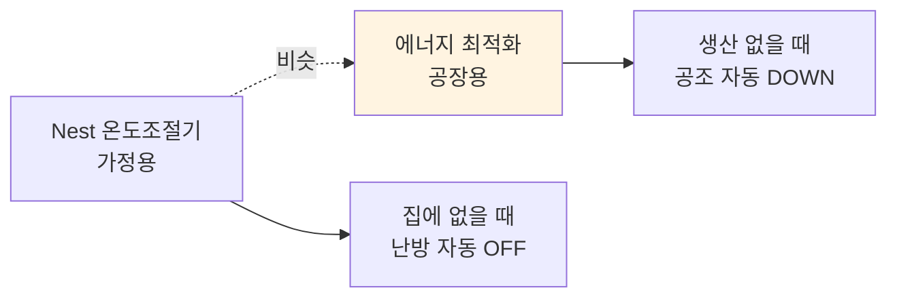

**설명**:
- 스마트 온도조절기가 "집에 사람 없으니 난방 끄자"라고 자동으로 판단하죠?
- 우리 시스템도 똑같습니다. "지금 생산 안 하니 공조 줄이자"라고 AI가 자동으로 조절합니다.

---

## 🔧 핵심 기술 요약

### 기술 스택을 쉽게 설명하면?

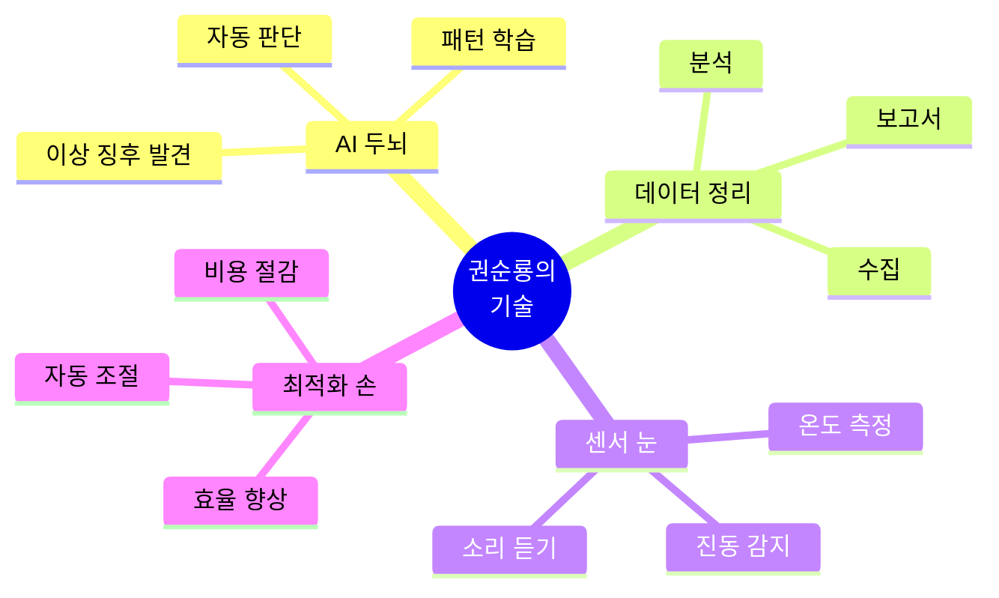

### 각 기술을 한 문장으로
| 기술 | 쉬운 설명 | 비유 |
|:---|:---|:---|
| **AI/ML** | 데이터를 보고 패턴을 학습하는 기술 | 의사가 경험으로 병을 진단하듯이 |
| **센서/IoT** | 공장 상태를 실시간으로 측정하는 장비 | 체온계, 혈압계처럼 |
| **데이터 분석** | 복잡한 숫자를 의미 있는 정보로 바꾸는 기술 | 회계사가 장부를 정리하듯이 |
| **자동화** | 사람이 하던 반복 작업을 AI가 대신하는 것 | 로봇 청소기처럼 |

---

## 💡 왜 이 기술이 중요한가요?

### 문제 → 해결 → 가치

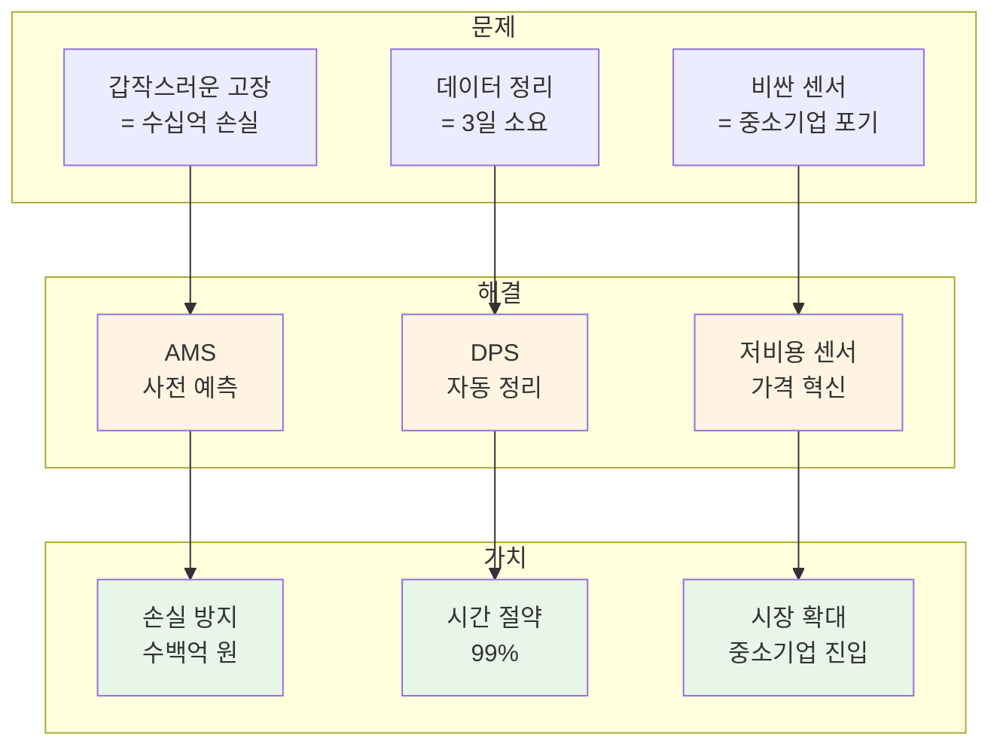

---

## 🔗 더 알아보기

### 기술 상세 (전문가용)
- [[Architecture_Overview|기술 아키텍처 상세]]
- [[02_Projects_Overview|13개 프로젝트 설명]]

### 비전문가용
- [[Executive_Summary/00_Overview_For_Non_Technical|전체 개요]]
- [[Executive_Summary/01_Key_Achievements|핵심 성과]]
- [[Executive_Summary/02_Business_Value|비즈니스 가치]]

---

> [!TIP] 핵심 메시지
> **"복잡한 기술이지만, 하는 일은 단순합니다"**
> - AMS = 공장의 AI 의사 (고장 예측)
> - DPS = 공장의 AI 비서 (데이터 정리)
> - 센서 = 공장의 저비용 CCTV (상태 측정)
> - 최적화 = 전기료 절약 AI (비용 절감)
