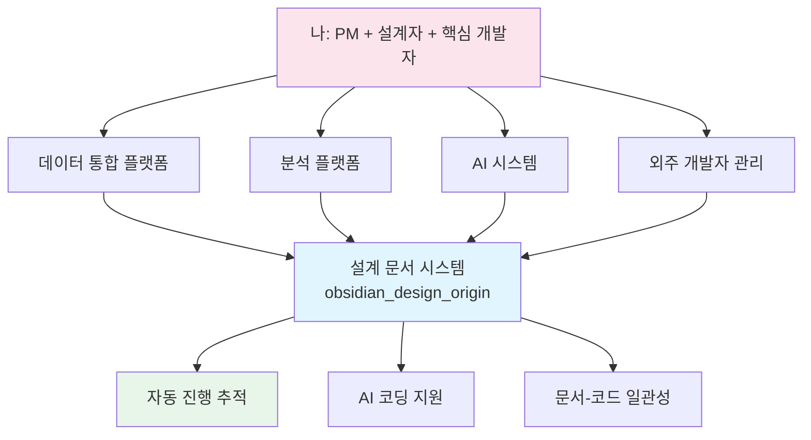
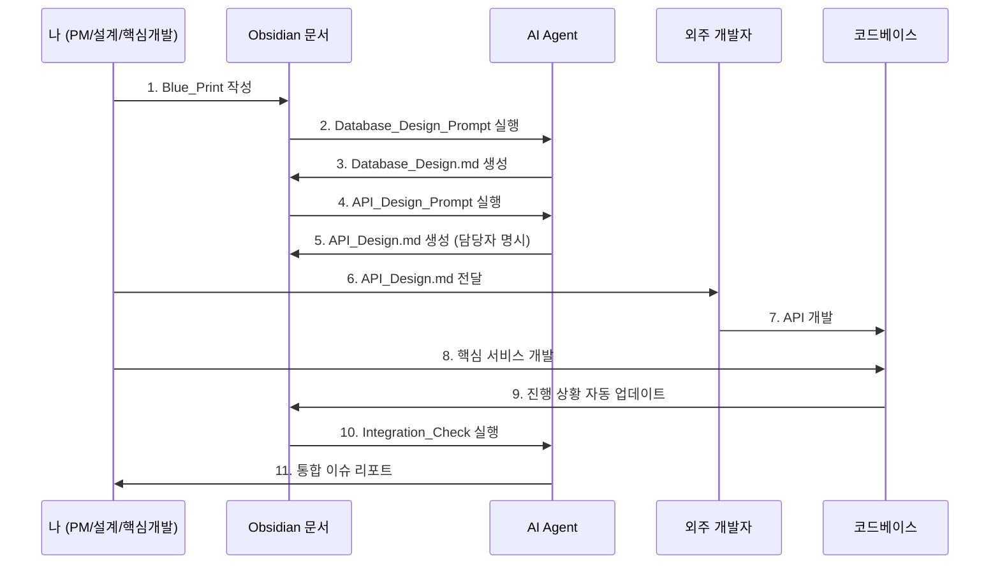

# Step 1: 반복적 업무 식별 (Repetitive Work Identification)

**Phase**: 🟦 Phase 1: Foundation (Small Wins)
**핵심**: 매일/매주 반복하는 단순하고 규칙적인 작업을 리스트업

> [!TIP] 시작 원칙
> 엑셀 데이터 정리, 이메일 요약, 특정 포맷의 보고서 초안 작성 등 단순 반복 업무부터 시작하세요.

---

## 🎯 실제 적용 사례

> [!NOTE] 핵심 성과 - AMS 프로젝트
## 1. 개요 및 프로젝트 다양성
본 단계에서는 산업 현장의 반복적이고 비효율적인 업무를 식별하고, 이를 인공지능과 플랫폼 기술로 해결하기 위한 프로젝트 착수 과정을 다룹니다. 저는 단순히 하나의 사업이 아닌, **다양한 산업 분야(금속, 도료, 자동차, 에너지 등)에서 13개 이상의 독립된 솔루션**을 기획하고 이끌었습니다.

## 2. 주요 프로젝트 배경 및 문제 정의

### 사례 A: 금속산업 AI/DPS 플랫폼 (국내 국책과제)
- **대상**: 세아특수강 & 포미아(포항소재산업진흥원)
- **문제**: 복잡한 금속 공정(轧制, 충压 등)에서 발생하는 데이터 섬(Data Silo) 현상과 전문가 의존적인 의사결정.
- **해결**: 모듈화된 5층 아키텍처(DPS)와 피쉬본 기반 이상탐지(AMS) 통합 솔루션 구축.

### 사례 B: 일본 도료 전문기업 글로벌 DX
- **대상**: 일본 글로벌 도료 기업
- **문제**: 도료 생산 공정의 전문가 지식이 구조화되지 않아 AI 모델링에 한계가 있고, 실시간 의사결정 지원 시스템 부재.
- **해결**: 전문가 지식을 온톨로지로 통합한 데이터 중심 AI 플랫폼 개발 및 전사적 DX 가속화.

### 사례 C: 산업용 에너지 & 클린룸 최적화
- **대상**: 반도체/금속 가공 공장 클린룸
- **문제**: 초미세먼지 제어 등을 위한 클린룸 운영 시 발생하는 막대한 에너지 낭비와 관리 효율 저하.
- **해결**: 에너지 소비 패턴 분석 엔진 기반 AI 최적화 규칙 생성(GS인증 획득).

---

**PM 역할 및 책임** (권순룡):
1. **다양한 도메인 분석**: 금속, 자동차, 화학(도료) 등 각기 다른 산업의 핵심 공정 및 문제점 식별.
2. **기술 로드맵 수립**: 각 솔루션별(AMS, DPS, CoCTK, 스마트센서 등) 핵심 기술 정의 및 개발 리딩.
3. **팀 리더십 및 성과 관리**: 다기능 팀(HW, SW, AI)을 이끌며 정량적 성과(GS인증, 특허) 창출.
4. **글로벌 협업**: 해외 기업(일본 등)과의 기술 요구사항 조율 및 현지 최적화 수행.

**실제 상황 (Lead Developer Perspective)**:
- 핵심 엔진(Python 49개 파일)은 100% 직접 개발하되, 다양한 플랫폼 연동은 협업을 통해 관리.
- 단순 코딩을 넘어 각 산업별 데이터 특성을 고려한 알고리즘 최적화 주도.
- 외주 개발자 1명과 협업하며 전체 시스템 설계 및 관리
- 핵심 기능과 복잡한 AI 로직은 내가 직접 개발
- 외주 개발자의 작업 진행 상황 파악 및 관리 필요
- 설계 문서 작성, 코드 리뷰, 통합 작업 모두 담당

**반복되는 문제점**:
- ❌ 매일 외주 개발자의 진행 상황 파악에 시간 소요
- ❌ 내가 작성한 설계 의도와 실제 코드 불일치 발견
- ❌ 데이터 통합/분석/AI 세 영역의 설계 문서 관리 부담
- ❌ 매주 진행 상황 보고서 작성 (발주처 보고용)
- ❌ 내가 개발한 부분과 외주 개발 부분의 통합 이슈 추적 어려움
- ❌ 설계 변경 시 관련 문서 일일이 수동 업데이트

### 🚀 해결책: 문서 구조 중심 개발 시스템

#### 핵심 아이디어
**"혼자서도 전체 시스템을 관리할 수 있도록, 설계 문서를 중심으로 자동화된 개발 추적 시스템 구축"**

#### 왜 이 시스템이 필요했나?


**핵심 목표**:
1. 내가 모든 영역을 파악할 수 있는 통합 문서 시스템
2. 외주 개발자에게 명확한 설계 가이드 제공
3. 설계 변경 시 관련 문서 자동 추적
4. AI 에이전트를 활용한 반복 작업 자동화

---

## 🛠️ 구축한 시스템: obsidian_design_origin

**위치**: `platform_all/Original_Development_Plan/docs/obsidian_design_origin/`

### 1️⃣ 설계 문서 시스템 구조

#### 📁 폴더 구조
```
obsidian_design_origin/
├── architecture/              # 실제 설계 문서 (10개+)
│   ├── Blue_Print.md         # 프로젝트 청사진
│   ├── Database_Design.md    # DB 설계 (통합/분석/AI)
│   ├── API_Design.md         # API 설계
│   ├── Component_Interfaces_Design.md
│   ├── State_Management_Design.md
│   ├── Screen_Design.md
│   └── ...
├── specs/
│   ├── 04_Prompts/           # 25개+ AI 프롬프트
│   │   ├── Blueprint_Generation_Prompt.md
│   │   ├── Database_Design_Prompt.md
│   │   ├── chain/            # 프롬프트 체인 (순차 실행)
│   │   └── development/      # 개발 워크플로우 프롬프트
│   └── 05_Templates/         # 11개+ 문서 템플릿
├── phases/                    # 7개 Phase 가이드
├── conventions/               # 작성 가이드
└── meta/                      # 전략 문서
```

#### 📋 핵심 설계 문서 (AMS 프로젝트 예시)

**1. Blue_Print.md** - 프로젝트 청사진
```yaml
프로젝트명: AMS (Anomaly Management System)
목적: AI 기반 이상 관리 시스템
담당자:
  - PM/설계자/핵심 개발: 나
  - 외주 개발자: UI/일반 기능 개발
핵심 영역:
  - 데이터 통합: 공장 데이터 수집 및 전처리
  - 분석 플랫폼: 데이터 분석 및 시각화
  - AI 시스템: 이상 탐지, 원인 분석, FMEA 생성
```

**2. Database_Design.md** - 데이터베이스 설계
- **MSSQL Server (FactAI)** - 메인 데이터베이스
- **Neo4j (Graph Database)** - 관계 분석용
- ID 시스템으로 문서 간 관계 자동 추적

예시:
```markdown
### Table: AMS3000M (내가 설계)
- Semantic Concept: AMS 설정 정보
- 개발 담당: 나 (핵심 로직)

| Column | Type | Mapped Field (FE) | 담당 |
|--------|------|-------------------|------|
| SNRO_ID | INT | `type.ams.config.snroId` | 나 |
| FBS_ID | INT | `type.ams.config.fbsId` | 외주 |
...

사용 위치:
- api.ams.config.get (외주 개발)
- service.ams.main (내가 개발)
- service.ams.pipeline (내가 개발)
```

**3. API_Design.md** - API 엔드포인트 설계
```markdown
### API: api.ams.config.get
- 개발 담당: 외주 개발자
- 연관 서비스: service.ams.main (내가 개발)
- 검증 필요 사항:
  - FBS_ID FK 제약 조건 확인
  - 권한 체크 로직 (내가 검토)
```

---

### 2️⃣ ID 시스템 (파일 to 파일 자동화 핵심)

#### ID 명명 규칙: `type.module.name` 형식

**예시**:
- `type.ams.config.snroId` - AMS 설정 ID
- `api.ams.config.get` - AMS 설정 조회 API (외주)
- `service.ams.main` - AMS 메인 서비스 (나)
- `db.AMS3000M` - AMS 설정 테이블

#### 문서 간 관계 추적 (내가 파악하기 위한 핵심)
```yaml
relations:
  - source: api.ams.config.get
    relation: uses
    target: db.AMS3000M
    developer: 외주
    reviewer: 나

  - source: service.ams.main
    relation: calls
    target: api.ams.config.get
    developer: 나
    integration_point: true
```

**이점**:
- ✅ 외주 개발자의 작업이 어디에 영향을 미치는지 즉시 파악
- ✅ 내가 개발한 부분과의 통합 지점 자동 추적
- ✅ 설계 변경 시 영향받는 모든 문서 자동 탐지

---

### 3️⃣ AI 프롬프트 라이브러리 (25개+)

**위치**: `specs/04_Prompts/`

**핵심 프롬프트 카테고리**:

1. **설계 프롬프트** (내가 사용)
   - Blueprint 생성
   - Database 설계
   - API 설계
   - 문서 간 일관성 검증

2. **개발 가이드 프롬프트** (외주 개발자용)
   - Development_Workflow_Prompt
   - Developer_Cross_Check_Prompt
   - Troubleshooting_Management_Prompt

3. **통합 검증 프롬프트** (내가 사용)
   - Integration_Checklist_Prompt
   - Document_Update_Checker_Prompt
   - API-DB 링크 검증

4. **프롬프트 체인** (자동 순차 실행)
   ```
   2.1_Define_Pages.md
   → 2.2_Map_Components_To_Pages.md
   → 2.3_Generate_Dependency_Graph.md
   → 2.4_Assemble_Blueprint.md
   ```

---

### 4️⃣ 파일 to 파일 자동화 워크플로우



**핵심 특징**:
- ✅ **Input File → AI Process → Output File** 형식
- ✅ 외주 개발자에게 명확한 가이드 자동 생성
- ✅ 내가 개발한 부분과 외주 부분의 통합 지점 자동 추적
- ✅ 설계 변경 시 영향받는 문서/코드 자동 탐지

---

## 📊 실제 적용 프로젝트

### 프로젝트 1: AMS (Anomaly Management System)

**기술 스택**:
- **Backend (내가 주로 개발)**:
  - Python 3.9.18, pandas, scikit-learn
  - 머신러닝 모델, 베이지안 네트워크
- **Database (내가 설계)**:
  - MSSQL Server + Neo4j (Graph DB)
- **Frontend (외주 + 내가 일부)**:
  - C# WinForms (DevExpress) - 외주 주로
  - React 18.3.1 - 내가 주로

**역할 분담**:
| 영역 | 담당 | 설명 |
|------|------|------|
| 데이터 통합 | 나 | 공장 데이터 수집, 전처리 파이프라인 |
| AI/ML | 나 | 이상 탐지, 원인 분석, FMEA 생성 |
| 분석 로직 | 나 | 베이지안 네트워크, 그래프 분석 |
| UI 개발 | 외주 | WinForms 화면 개발 |
| API 개발 | 외주 | 기본 CRUD API |
| 통합 및 검증 | 나 | 전체 시스템 통합 및 테스트 |

**설계 문서 시스템 적용 결과**:
- ✅ 10개+ 설계 문서로 전체 시스템 가시화
- ✅ 외주 개발자에게 명확한 개발 가이드 제공
- ✅ 통합 지점 자동 추적으로 버그 사전 방지

---

## 💡 핵심 성과

### 1️⃣ 반복 업무 자동화 달성

**Before (자동화 전)**:
- 외주 개발자 진행 상황 파악: **1.5시간/일**
- 설계 문서 작성 및 업데이트: **4시간/주**
- 통합 이슈 추적 및 해결: **5시간/주**
- 발주처 보고서 작성: **2시간/주**
- **총 소요 시간: 약 18.5시간/주**

**After (자동화 후)**:
- 진행 상황 자동 추적: **30분/일**
- 설계 문서 자동 생성: **1시간/주**
- 통합 이슈 자동 탐지: **1시간/주**
- 보고서 자동 생성: **30분/주**
- **총 소요 시간: 약 5시간/주**
- **⏱️ 시간 절감: 73% (18.5시간 → 5시간)**

### 2️⃣ 품질 향상

- ✅ 설계 의도와 코드의 일관성 유지 (ID 시스템)
- ✅ 외주 개발 코드와 내 코드의 통합 이슈 사전 탐지
- ✅ 문서 간 관계 자동 추적으로 누락 방지
- ✅ 외주 개발자 코드 리뷰 시간 단축

### 3️⃣ 관리 효율 향상

- ✅ 외주 개발자에게 명확한 가이드 제공 → 커뮤니케이션 비용 감소
- ✅ 설계 변경 시 영향 범위 자동 파악
- ✅ 발주처 보고서 자동 생성 → PM 업무 부담 감소
- ✅ 혼자서도 데이터 통합 + 분석 + AI 전 영역 관리 가능

---

## 🔗 관련 문서

### Phase 1 내 연관 Step
- [[Step_02_Expertise_Targeting|Step 2: 전문성 중심 타겟팅]] - AI 환각 방지 평가 시스템
- [[Step_03_Micro_Starts|Step 3: 초소형 단위 시작]] - 실제 프로젝트 사례
- [[Step_04_Modularization|Step 4: 모듈화 전략]] - 프롬프트 모듈화
- [[Step_05_IO_Optimization|Step 5: I/O 최적화]] - 파일 기반 워크플로우

### 실제 설계 문서 (AI_agent_test)
- [Blue_Print.md](../../../AI_agent_test/AMS/docs/obsidian_design_origin/architecture/Blue_Print.md)
- [Database_Design.md](../../../AI_agent_test/AMS/docs/obsidian_design_origin/architecture/Database_Design.md)
- [API_Design.md](../../../AI_agent_test/AMS/docs/obsidian_design_origin/architecture/API_Design.md)

### 프롬프트 라이브러리
- [Blueprint_Generation_Prompt.md](../../../AI_agent_test/AMS/docs/obsidian_design_origin/specs/04_Prompts/Blueprint_Generation_Prompt.md)
- [Database_Design_Prompt.md](../../../AI_agent_test/AMS/docs/obsidian_design_origin/specs/04_Prompts/Database_Design_Prompt.md)
- [Integration_Checklist_Prompt.md](../../../AI_agent_test/AMS/docs/obsidian_design_origin/specs/04_Prompts/Integration_Checklist_Prompt.md)

---

> [!SUCCESS] Step 1 핵심 교훈
> **"외주 개발자 1명과 함께 데이터 통합 + 분석 + AI 전 영역을 관리할 때, 문서 중심 자동화 시스템을 구축하면 73%의 시간을 절감할 수 있다"**
>
> **핵심 포인트**:
> - 혼자서도 전체를 파악할 수 있는 통합 문서 시스템
> - 외주 개발자에게 명확한 가이드 자동 제공
> - 통합 지점 자동 추적으로 사전 이슈 방지
>
> **다음 단계**: Step 2에서는 AI의 환각을 방지하기 위한 전문성 기반 평가 시스템을 구축합니다.
