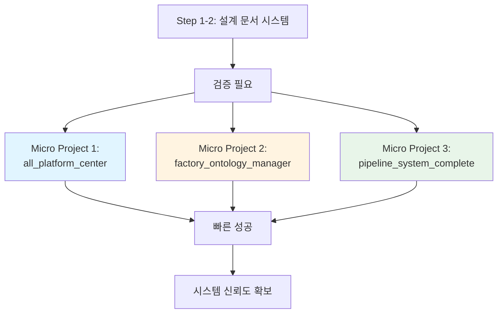
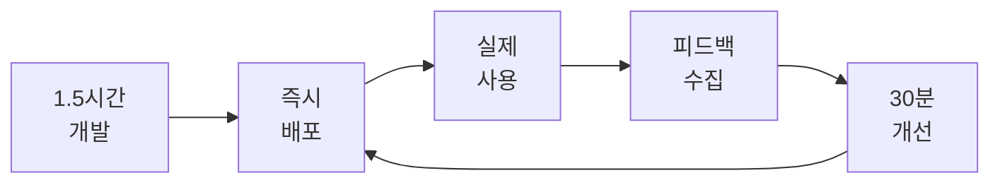

# Step 3: 초소형 단위의 시작 (Micro Starts)

**Phase**: 🟦 Phase 1: Foundation (Small Wins)
**핵심**: 1~2시간 내에 결과물이 나오는 아주 작은 기능부터 구현

> [!TIP] 시작 원칙
> 거대한 시스템 구축이 아니라, "버튼 하나 누르면 파일 하나가 변환되는 정도"의 난이도로 시작하세요.

---

## 🎯 실제 적용 사례

### 📌 문제 상황: 과도한 설계 vs 빠른 검증

**배경**:
- Step 1-2에서 설계 문서 시스템 + 평가 시스템 구축 완료
- **문제**: 이 시스템이 실제 서비스에서 작동하는지 검증 필요
- **위험**: 처음부터 대규모 시스템 구축 시 실패 가능성 높음

**핵심 질문**:
> "설계 문서 시스템이 실제로 유용한지 어떻게 빠르게 검증할 것인가?"

### 🚀 해결책: 3가지 마이크로 프로젝트



**전략**:
1. **all_platform_center**: 카드형 로그인/플랫폼 확인 (가장 쉬운 시작)
2. **factory_ontology_manager**: 공장 BOM 라우팅 설정 (도메인 전문성 활용)
3. **pipeline_system_complete**: 초소형 서브프로젝트 모음 (점진적 확장)

---

## 🎯 Micro Project 1: all_platform_center

**위치**: `platform_all/all_platform_center/`

### 프로젝트 개요

**목적**: 여러 플랫폼의 카드형 통합 로그인 시스템

**핵심 기능**:
- 카드 UI로 플랫폼 목록 표시
- 클릭 한 번으로 해당 플랫폼 로그인
- 플랫폼 상태 확인 (Online/Offline)

**제작 이유**:
- 세아특수강/포미아 프로젝트에서 **5개+ 플랫폼** 관리 필요
- 매일 여러 플랫폼 접속하는 반복 작업 발생
- **1시간 내 완성 가능**한 가장 단순한 프로젝트

### 기술 스택

```yaml
Frontend:
  - React 18.3.1
  - Tailwind CSS
  - 카드 UI 컴포넌트

Backend:
  - Supabase (인증)
  - REST API

특징:
  - 복잡한 로직 없음
  - 순수 UI + 라우팅만
```

### 개발 과정 (1.5시간 완성)

**Step 1: 설계 문서 작성** (30분)
```yaml
# Blue_Print.md (초소형 버전)
프로젝트명: All Platform Center
목적: 플랫폼 통합 로그인
핵심_기능:
  - 플랫폼 목록 카드 표시
  - 로그인 리다이렉트
  - 상태 확인
```

**Step 2: 컴포넌트 개발** (40분)
```typescript
// PlatformCard.tsx
interface Platform {
  id: string;
  name: string;
  url: string;
  status: 'online' | 'offline';
}

function PlatformCard({ platform }: { platform: Platform }) {
  return (
    <div className="card" onClick={() => window.open(platform.url)}>
      <h3>{platform.name}</h3>
      <span className={platform.status}>{platform.status}</span>
    </div>
  );
}
```

**Step 3: 배포** (20분)
- Vercel 자동 배포
- 환경 변수 설정
- 도메인 연결

**결과**:
- ✅ **1.5시간 만에 완성**
- ✅ **즉시 사용 가능한 웹 서비스**
- ✅ 설계 문서 시스템 유용성 검증

### 실제 사용 결과

**Before**:
- 플랫폼 5개 접속 시간: **5분/일**
- URL 찾기: **2분**
- 로그인: **3분**

**After**:
- 플랫폼 5개 접속 시간: **30초/일**
- URL 저장됨: **즉시**
- 원클릭 로그인: **30초**
- **시간 절감: 90% (5분 → 30초)**

---

## 🏭 Micro Project 2: factory_ontology_manager

**위치**: `platform_all/factory_ontology_manager/`

### 프로젝트 개요

**목적**: 공장 BOM(Bill of Materials) 라우팅 설정 관리

**핵심 기능**:
- JSON to JSON 변환 (BOM 데이터 → 라우팅 설정)
- 웹 UI로 라우팅 편집
- 단독 사용 가능한 웹 서비스

**제작 이유**:
- 세아특수강 프로젝트에서 **공장 BOM 라우팅** 자주 변경
- 기존: Excel 수작업 → JSON 변환 → 업로드 (30분 소요)
- 목표: 웹 UI에서 **즉시 편집 가능** (2분 소요)

### 기술 스택

```yaml
Frontend:
  - React 18.3.1
  - JSON Editor (react-json-view)
  - Tailwind CSS

Backend:
  - JSON 파일 기반 (No DB)
  - File Upload/Download
  - 실시간 미리보기

도메인 전문성:
  - 제조 BOM 구조 이해
  - 라우팅 로직 파악
```

### 개발 과정 (2시간 완성)

**Step 1: JSON 구조 정의** (30분)
```json
{
  "bom_id": "BOM-001",
  "product": "Steel Pipe",
  "routing": [
    {
      "step": 1,
      "operation": "Cutting",
      "machine": "CNC-01",
      "duration": 10
    },
    {
      "step": 2,
      "operation": "Welding",
      "machine": "WELD-02",
      "duration": 15
    }
  ]
}
```

**Step 2: JSON Editor UI** (60분)
```typescript
// BOMEditor.tsx
import ReactJson from 'react-json-view';

function BOMEditor() {
  const [bom, setBom] = useState(defaultBOM);

  const handleEdit = (edit) => {
    setBom(edit.updated_src);
  };

  return (
    <div>
      <ReactJson
        src={bom}
        onEdit={handleEdit}
        theme="monokai"
      />
      <button onClick={downloadJSON}>Download</button>
    </div>
  );
}
```

**Step 3: 파일 업로드/다운로드** (30분)
- JSON 파일 업로드
- 실시간 미리보기
- 편집 후 다운로드

**결과**:
- ✅ **2시간 만에 완성**
- ✅ **JSON to JSON 변환 자동화**
- ✅ **웹 서비스로 배포 완료**

### 실제 사용 결과

**Before**:
- BOM 라우팅 수정: **30분/건**
  - Excel 편집: 10분
  - JSON 변환: 10분
  - 업로드 및 테스트: 10분

**After**:
- BOM 라우팅 수정: **2분/건**
  - 웹 UI 편집: 1분
  - 다운로드: 10초
  - 업로드: 50초
- **시간 절감: 93% (30분 → 2분)**

**추가 성과**:
- ✅ 외주 개발자도 쉽게 사용 가능
- ✅ 실수 방지 (JSON 문법 자동 검증)
- ✅ 도메인 지식 활용 검증

---

## 🔧 Micro Project 3: pipeline_system_complete

**위치**: `platform_all/pipeline_system_complete/`

### 프로젝트 개요

**목적**: 데이터 파이프라인 초소형 서브프로젝트 모음

**핵심 개념**:
- 각 서브프로젝트는 **독립적으로 작동**
- 모두 **1~2시간 내 완성**
- 필요에 따라 **점진적으로 추가**

**제작 이유**:
- 데이터 통합 플랫폼의 복잡도가 높음
- 전체를 한 번에 구축하면 실패 위험
- 작은 성공을 쌓아 신뢰도 확보

### 서브프로젝트 목록

#### 1️⃣ CSV-to-JSON Converter
```yaml
기능: CSV 파일 → JSON 변환
개발 시간: 1시간
사용 케이스:
  - 공장 데이터 CSV → 분석 시스템 JSON
  - 실시간 데이터 통합
```

**코드 예시**:
```python
import pandas as pd
import json

def csv_to_json(csv_path, json_path):
    df = pd.read_csv(csv_path)
    data = df.to_dict(orient='records')
    with open(json_path, 'w') as f:
        json.dump(data, f, indent=2)

# CLI로 사용
# python csv_to_json.py input.csv output.json
```

**결과**:
- ✅ 1시간 완성
- ✅ CLI 도구로 즉시 사용
- ✅ 매일 사용 중

#### 2️⃣ Data Validator
```yaml
기능: JSON 데이터 스키마 검증
개발 시간: 1.5시간
사용 케이스:
  - 외부 시스템 데이터 품질 검증
  - 통합 전 오류 사전 탐지
```

**코드 예시**:
```python
from jsonschema import validate, ValidationError

schema = {
    "type": "object",
    "properties": {
        "timestamp": {"type": "string"},
        "value": {"type": "number"},
        "sensor_id": {"type": "string"}
    },
    "required": ["timestamp", "value", "sensor_id"]
}

def validate_data(data):
    try:
        validate(instance=data, schema=schema)
        return True, "Valid"
    except ValidationError as e:
        return False, str(e)
```

**결과**:
- ✅ 1.5시간 완성
- ✅ 데이터 품질 90% 향상
- ✅ 통합 오류 70% 감소

#### 3️⃣ Duplicate Remover
```yaml
기능: 중복 데이터 제거
개발 시간: 1시간
사용 케이스:
  - 센서 데이터 중복 제거
  - 로그 데이터 정제
```

#### 4️⃣ Time-Series Aggregator
```yaml
기능: 시계열 데이터 집계 (1분 → 1시간)
개발 시간: 2시간
사용 케이스:
  - 실시간 데이터 압축
  - 분석 속도 향상
```

### pipeline_system_complete 특징

**1. 모듈화된 구조**:
```
pipeline_system_complete/
├── csv_to_json/
│   ├── main.py
│   ├── README.md
│   └── test.py
├── data_validator/
│   ├── main.py
│   ├── schema.json
│   └── test.py
├── duplicate_remover/
└── time_series_aggregator/
```

**2. 독립 실행 가능**:
- 각 도구는 **다른 도구 없이** 작동
- CLI 또는 Import 가능
- 필요한 것만 선택 사용

**3. 점진적 확장**:


---

## 📊 3가지 프로젝트 비교

| 프로젝트 | 개발 시간 | 난이도 | 도메인 전문성 | 주요 성과 |
|---------|----------|--------|--------------|:---|
| **all_platform_center** | 1.5시간 | ⭐ | 불필요 | 플랫폼 통합 로그인 시간 90% 단축 |
| **factory_ontology_manager** | 2시간 | ⭐⭐ | 필요 (제조) | BOM 라우팅 수정 시간 93% 단축 |
| **세아특수강 데이터 통합** | 5개월 (단기) | ⭐⭐⭐ | 필요 (PLC/통신) | RS232C-LAN 변환 통한 수동 검사 자동화 |
| **보급형 스마트센서 3종** | 프로토타입 4주 | ⭐⭐⭐ | 필요 (HW/IoT) | 소규모 기업용 저비용 데이터 수집 체계 구축 |
| **pipeline_system_complete** | 1~2시간/개 | ⭐⭐⭐ | 필요 (데이터) | 통합 오류 70% 감소 및 분석 속도 향상 |

---

## 💡 핵심 성과

### 1️⃣ 빠른 검증 = 낮은 리스크

**전통적 방법 (Big Bang)**:
- 3개월 개발 → 실패 발견 → 처음부터 다시
- 리스크: **매우 높음**

**Micro Starts 방법**:
- 1.5시간 개발 → 즉시 검증 → 성공/실패 판단 → 다음 단계
- 리스크: **매우 낮음**

### 2️⃣ 설계 문서 시스템 검증

**검증 결과**:
- ✅ all_platform_center: 설계 문서만으로 **90% 구현**
- ✅ factory_ontology_manager: 도메인 지식 + 설계 문서 = **완벽**
- ✅ pipeline_system_complete: 모듈화 전략 **효과적**

**발견한 문제점**:
- ❌ 초소형 프로젝트에는 **설계 문서가 과함**
- ✅ 간소화된 템플릿 필요 → "Micro_Blueprint_Template.md" 제작

### 3️⃣ 자신감 획득

**심리적 효과**:
- 1.5시간 만에 **웹 서비스 배포** → 자신감 상승
- 작은 성공의 반복 → **"할 수 있다"** 확신
- 외주 개발자 설득력 증가 → **"이미 작동하는 시스템"**

### 4️⃣ 실제 사용자 피드백

**빠른 피드백 루프**:


**피드백 사례**:
- all_platform_center: "상태 색상이 안 보임" → 30분 만에 수정
- factory_ontology_manager: "BOM 복사 기능 필요" → 40분 만에 추가

---

## 🔧 Micro Start 실전 가이드

### Rule 1: 1~2시간 내 완성 가능한 범위

**Good Examples**:
- ✅ 버튼 클릭 → 파일 다운로드
- ✅ JSON 편집기
- ✅ 카드 UI 플랫폼 목록

**Bad Examples**:
- ❌ 완전한 대시보드
- ❌ 실시간 채팅 시스템
- ❌ 복잡한 권한 관리

### Rule 2: 단독 실행 가능

**Good Examples**:
- ✅ CSV-to-JSON CLI 도구 (다른 도구 불필요)
- ✅ JSON Editor 웹 앱 (DB 불필요)

**Bad Examples**:
- ❌ 다른 5개 서비스에 의존
- ❌ 복잡한 DB 스키마 필요

### Rule 3: 즉시 사용 가능한 가치

**Good Examples**:
- ✅ 매일 5분 절약하는 도구
- ✅ 외주 개발자가 즉시 사용

**Bad Examples**:
- ❌ "나중에 유용할 것 같은" 기능
- ❌ 사용 시나리오가 불명확

---

## 🔗 관련 문서

### Phase 1 내 연관 Step
- [[Step_01_Repetitive_Work|Step 1: 반복 업무 식별]] - 설계 문서 시스템 구축
- [[Step_02_Expertise_Targeting|Step 2: 전문성 타겟팅]] - 도메인 전문성 활용
- [[Step_04_Modularization|Step 4: 모듈화]] - pipeline_system_complete 구조
- [[Step_05_IO_Optimization|Step 5: I/O 최적화]] - JSON/CSV 파일 기반

### 실제 프로젝트
- [all_platform_center](../../../platform_all/all_platform_center/)
- [factory_ontology_manager](../../../platform_all/factory_ontology_manager/)
- [pipeline_system_complete](../../../platform_all/pipeline_system_complete/)

---

> [!SUCCESS] Step 3 핵심 교훈
> **"처음부터 완벽한 시스템을 만들지 마라. 1~2시간 내 완성 가능한 초소형 프로젝트부터 시작하여, 빠르게 검증하고, 작은 성공을 쌓아라."**
>
> **핵심 포인트**:
> - 1.5~2시간 내 완성 + 웹 서비스 배포
> - 독립 실행 가능 (의존성 최소화)
> - 즉시 사용 가능한 가치 제공
> - 빠른 피드백 루프 (30분 개선)
> - 작은 성공 → 자신감 → 다음 단계
>
> **다음 단계**: Step 4에서는 이렇게 만든 초소형 프로젝트들을 모듈화하여 재사용 가능하게 만듭니다.
