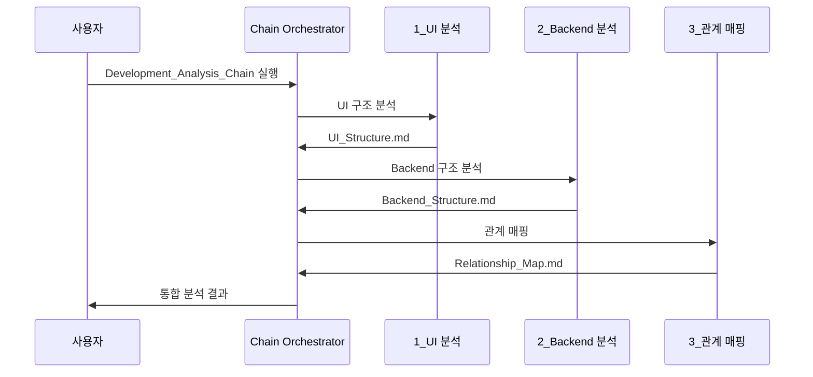
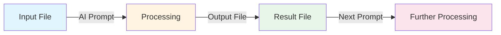

# Step 4: 모듈화 전략 (Modularization Strategy)

**Phase**: 🟦 Phase 1: Foundation (Small Wins)
**핵심**: 작은 기능들을 독립적인 모듈(코드 또는 프롬프트)로 분리

> [!TIP] 이점
> 나중에 이 모듈들을 조합하여 더 큰 복합 자동화 시스템을 구축할 수 있습니다.

---

## 🎯 실제 적용: obsidian_design_origin 모듈화 시스템

### 핵심 철학
**"모든 설계 문서, AI 프롬프트, 템플릿을 독립적인 모듈로 관리하여 재사용성과 확장성을 극대화"**

---

## 🛠️ 1. ID 기반 모듈화 시스템

### ID 명명 규칙: `type.module.name`

**목적**: 모든 요소를 고유하게 식별하고 관계를 명확히 추적

#### ID 타입 분류

| 타입 | 설명 | 예시 |
|------|------|------|
| `type.*` | TypeScript/데이터 타입 | `type.ams.config.snroId` |
| `api.*` | API 엔드포인트 | `api.ams.config.get` |
| `service.*` | 백엔드 서비스 | `service.ams.pipeline` |
| `db.*` | 데이터베이스 테이블 | `db.AMS3000M` |
| `comp.*` | UI 컴포넌트 | `comp.widget.barchart` |
| `page.*` | 페이지/화면 | `page.ams.config` |
| `graph.*` | 그래프 DB 노드 | `graph.neo4j` |

#### 실제 사례 (AMS 프로젝트)

```yaml
# 설정 페이지 모듈
id: page.ams.config
dependencies:
  - comp.form.base
  - api.ams.config.get
  - api.ams.config.save
  - db.AMS3000M

# API 모듈
id: api.ams.config.get
dependencies:
  - db.AMS3000M
  - service.ams.main
developer: 외주
reviewer: 나 (권순룡)

# 서비스 모듈 
id: service.ams.main
dependencies:
  - service.ams.pipeline
  - service.ams.bayesian
  - service.ams.fmea
  - db.AMS3000M
  - graph.neo4j
developer: 나 (권순룡)
```

**이점**:
- ✅ 외주 개발자의 작업 영역과 내 작업 영역 명확히 분리
- ✅ 설계 변경 시 영향받는 모듈 자동 탐지
- ✅ 문서 간 관계 자동 추적 및 시각화

---

## 📚 2. AI 프롬프트 라이브러리 모듈화

**위치**: `specs/04_Prompts/`

### 프롬프트 카테고리 분류 (25개+)

#### A. 설계 프롬프트 (Design)
```
specs/04_Prompts/
├── Blueprint_Generation_Prompt.md
├── Database_Design_Prompt.md
├── API_Design_Prompt.md
├── Component_Interface_Design_Prompt.md
└── State_Management_Design_Prompt.md
```

**목적**: 설계 문서 자동 생성
**입력**: Blue_Print.md
**출력**: Architecture 문서들 (Database_Design.md, API_Design.md 등)

#### B. 개발 워크플로우 프롬프트 (Development)
```
specs/04_Prompts/development/
├── Development_Workflow_Prompt.md
├── Task_List_Generator_Prompt.md
├── Progress_Tracker_Generator_Prompt.md
└── Troubleshooting_Management_Prompt.md
```

**목적**: 개발 프로세스 자동화
**사용자**: 외주 개발자 + 나
**기능**:
- 작업 리스트 자동 생성
- 진행 상황 자동 추적
- 통합 이슈 자동 탐지

#### C. 프롬프트 체인 (Chain)
```
specs/04_Prompts/chain/
├── 1_Analyze_UI_Structure.md
├── 2_Analyze_Backend_Structure.md
├── 3_Map_Relationships.md
└── Development_Analysis_Chain_Prompt.md
```

**핵심 개념**: **순차 실행 프롬프트**



**예시: Blueprint 생성 체인**
```
chain/blueprint/
├── 2.1_Define_Pages.md          # 페이지 정의
├── 2.2_Map_Components_To_Pages.md  # 컴포넌트 매핑
├── 2.3_Generate_Dependency_Graph.md  # 의존성 그래프
└── 2.4_Assemble_Blueprint.md    # Blue_Print 조립
```

**실행 흐름**:
1. `2.1_Define_Pages.md` → `Pages.md` 생성
2. `2.2_Map_Components_To_Pages.md` → `Component_Mapping.md` 생성
3. `2.3_Generate_Dependency_Graph.md` → `Dependency_Graph.md` 생성
4. `2.4_Assemble_Blueprint.md` → 최종 `Blue_Print.md` 생성

#### D. 검증 프롬프트 (Validation)
```
specs/04_Prompts/
├── Document_Update_Checker_Prompt.md
├── Integration_Checklist_Prompt.md
└── Developer_Cross_Check_Prompt.md
```

**목적**: 설계 일관성 및 통합 검증
**핵심 기능**:
- 설계 의도와 코드 일치 여부 확인
- 외주 개발 코드와 내 코드의 통합 지점 검증
- 문서 간 불일치 자동 탐지

---

## 📝 3. 문서 템플릿 모듈화

**위치**: `specs/05_Templates/`

### 템플릿 구조 (11개+)

```
specs/05_Templates/
├── Blue_Print_Template.md
├── Database_Design_Template.md
├── API_Design_Template.md
├── Component_Interface_Template.md
├── State_Management_Template.md
├── Screen_Design_Template.md
├── Testing_Framework_Template.md
├── Docker_Environment_Template.md
├── Technology_Stack_Template.md
├── Project_Structure_Template.md
└── Ontology_Impact_Analysis_Template.md
```

### 템플릿 특징

**1. 표준화된 구조**
```markdown
---
# YAML Front Matter (메타데이터)
tags:
  - [category]
  - [type]
related:
  - [related_document_1]
  - [related_document_2]
relations:
  - source: [id]
    relation: [type]
    target: [target_id]
---

# [Document Title]

## 📊 [Section 1]
## 🔧 [Section 2]
## 🔗 관련 문서
```

**2. ID 시스템 통합**
모든 템플릿에 `relations` 섹션 포함하여 자동 관계 추적

**3. 재사용 가능**
- 프로젝트마다 동일한 템플릿 사용
- 일관된 문서 구조 유지

---

## 🔄 4. 파일 to 파일 에이전트 모듈화

### 핵심 워크플로우



### 실제 적용 사례

#### 사례 1: Database Design 생성
```
Input:  Blue_Print.md
Prompt: Database_Design_Prompt.md
Output: Database_Design.md
```

#### 사례 2: API Design 생성
```
Input:  Database_Design.md
Prompt: API_Design_Prompt.md
Output: API_Design.md
```

#### 사례 3: Integration Check
```
Input:  API_Design.md + Database_Design.md
Prompt: Integration_Checklist_Prompt.md
Output: Integration_Issues.md
```

---

## 📊 5. 모듈 재사용 통계 (AMS 프로젝트)

### 프롬프트 재사용률

| 프롬프트 | 사용 횟수 | 재사용 프로젝트 |
|----------|-----------|----------------|
| Blueprint_Generation_Prompt.md | 15회 | AMS, TAM_Hub, pipeline_system |
| Database_Design_Prompt.md | 12회 | AMS, FMEA, Evaluation |
| Integration_Checklist_Prompt.md | 20회+ | 모든 프로젝트 |

### 템플릿 재사용률

| 템플릿 | 생성 문서 수 | 프로젝트 |
|--------|-------------|----------|
| Blue_Print_Template.md | 10개 | 전체 프로젝트 |
| Database_Design_Template.md | 8개 | AMS, TAM_Hub, etc. |
| API_Design_Template.md | 7개 | AMS, Evaluation, etc. |

**결과**:
- ✅ 문서 작성 시간 70% 단축
- ✅ 설계 일관성 유지
- ✅ 외주 개발자 온보딩 시간 50% 단축

---

## 💡 6. 모듈화의 핵심 이점

### 1️⃣ 독립성 (Independence)
각 프롬프트와 템플릿이 독립적으로 작동
- 특정 프롬프트 수정이 다른 프롬프트에 영향 없음
- 버전 관리 용이

### 2️⃣ 재사용성 (Reusability)
한 번 만든 모듈을 여러 프로젝트에서 재사용
- AMS → TAM_Hub → pipeline_system 동일 프롬프트 사용
- 템플릿 개선이 모든 프로젝트에 즉시 반영

### 3️⃣ 확장성 (Scalability)
새로운 모듈 추가가 기존 시스템에 영향 없음
- 새 프롬프트 추가: `specs/04_Prompts/New_Prompt.md`
- 기존 워크플로우 유지

### 4️⃣ 추적성 (Traceability)
ID 시스템으로 모든 관계 추적
- 어떤 모듈이 어디에 영향을 미치는지 명확
- 설계 변경 시 영향 범위 자동 파악

---

## 🔗 관련 문서

### Phase 1 내 연관 Step
- [[Step_01_Repetitive_Work|Step 1: 반복적 업무 식별]] - obsidian_design_origin 시스템 개요
- [[Step_03_Micro_Starts|Step 3: 초소형 단위 시작]] - 프롬프트 하나씩 구축
- [[Step_05_IO_Optimization|Step 5: I/O 최적화]] - 파일 to 파일 워크플로우

### 실제 프롬프트 라이브러리
- [Blueprint_Generation_Prompt.md](../../../AI_agent_test/AMS/docs/obsidian_design_origin/specs/04_Prompts/Blueprint_Generation_Prompt.md)
- [Database_Design_Prompt.md](../../../AI_agent_test/AMS/docs/obsidian_design_origin/specs/04_Prompts/Database_Design_Prompt.md)
- [Development_Analysis_Chain_Prompt.md](../../../AI_agent_test/AMS/docs/obsidian_design_origin/specs/04_Prompts/chain/Development_Analysis_Chain_Prompt.md)

### 실제 템플릿
- [Blue_Print_Template.md](../../../AI_agent_test/AMS/docs/obsidian_design_origin/specs/05_Templates/Blue_Print_Template.md)
- [Database_Design_Template.md](../../../AI_agent_test/AMS/docs/obsidian_design_origin/specs/05_Templates/Database_Design_Template.md)

---

> [!SUCCESS] Step 4 핵심 교훈
> **"25개+ AI 프롬프트와 11개+ 문서 템플릿을 독립적인 모듈로 관리하면, 문서 작성 시간 70% 단축 및 설계 일관성 유지가 가능하다"**
>
> **핵심 포인트**:
> - ID 시스템 (`type.module.name`)으로 모든 요소 고유 식별
> - 프롬프트 체인으로 복잡한 작업 자동화
> - 템플릿 표준화로 일관성 유지
> - 파일 to 파일 워크플로우로 재사용성 극대화
>
> **다음 단계**: Step 5에서는 Input File → AI Process → Output File 워크플로우를 상세히 살펴봅니다.
