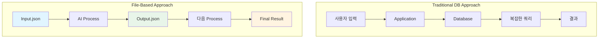
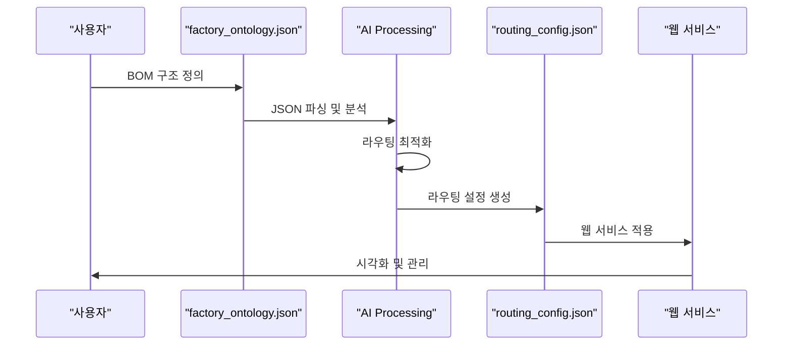

# Step 5: 데이터 입출력 최적화 (Data I/O Optimization)

**Phase**: 🟦 Phase 1: Foundation (Small Wins)
**핵심**: `Input File → AI Process → Output File` 흐름 유지

> [!TIP] 시작 원칙
> 복잡한 DB 연결 대신, CSV, TXT, JSON 등 다루기 쉬운 파일 형식을 활용하여 데이터 흐름을 시각화하세요.

---

## 🎯 파일 기반 아키텍처의 철학

### 핵심 개념
**"복잡한 데이터베이스 대신 파일 시스템을 활용하여 AI 프로세스의 입출력을 명확히 추적하고 디버깅 용이하게 만들기"**

### 왜 파일 기반인가?



**장점**:
1. ✅ **투명성**: 모든 단계의 입출력을 파일로 확인 가능
2. ✅ **디버깅**: AI가 어디서 실수했는지 정확히 파악
3. ✅ **재현성**: 동일한 입력 파일로 결과 재현 가능
4. ✅ **버전 관리**: Git으로 입출력 파일 버전 관리
5. ✅ **병렬 처리**: 파일 단위로 독립적 처리 가능

---

## 🛠️ 실제 적용 사례

### 1️⃣ factory_ontology_manager: JSON to JSON

**프로젝트**: 공장 BOM 라우팅 설정 웹 서비스  
**목적**: 복잡한 공장 구조를 JSON으로 관리하고 자동화

#### 워크플로우



#### 입력 파일 예시 (factory_ontology.json)
```json
{
  "factory_id": "PLANT_001",
  "structure": {
    "lines": [
      {
        "line_id": "LINE_A",
        "machines": [
          { "machine_id": "MCH_001", "type": "cutting" },
          { "machine_id": "MCH_002", "type": "welding" }
        ]
      }
    ]
  },
  "routing": {
    "raw_material": "MCH_001",
    "intermediate": ["MCH_001", "MCH_002"]
  }
}
```

#### 출력 파일 예시 (routing_config.json)
```json
{
  "routes": [
    {
      "route_id": "ROUTE_001",
      "sequence": ["MCH_001", "MCH_002"],
      "estimated_time": 120,
      "optimization_score": 0.95
    }
  ],
  "recommendations": [
    "병목 구간: MCH_001 → MCH_002",
    "최적화 제안: MCH_001 처리 속도 20% 향상 필요"
  ]
}
```

**결과**:
- ✅ 공장 BOM 라우팅 자동 생성
- ✅ 웹 서비스화 완료 (독립적 사용 가능)
- ✅ JSON to JSON 단독 실행 가능

---

### 2️⃣ obsidian_design_origin: Markdown to Markdown

**프로젝트**: 설계 문서 시스템  
**목적**: 설계 문서를 AI로 생성하고 자동 업데이트

#### 워크플로우


#### 입력 파일 예시 (Blue_Print.md)
```markdown
# AMS Project Blueprint

## Database Requirements
- MSSQL Server: Main database (FactAI)
- Neo4j: Graph database for relationship analysis

## Tables
- AMS3000M: Configuration table
- AMS4000M: Results table
- AI1100M: MLS job table
```

#### 출력 파일 예시 (Database_Design.md)
```markdown
# Database Design

## Table: AMS3000M
**Description**: AMS configuration table

| Column | Type | PK | FK | Description |
|--------|------|----|----|-------------|
| SNRO_ID | INT | ✓ | - | Scenario ID |
| SNRO_NM | VARCHAR(100) | - | - | Scenario name |
| FBS_ID | INT | - | FBS1100M.JOB_ID | FBS job ID |
| RMS_ID | INT | - | RMS1100M.JOB_ID | RMS job ID |

**Relations**:
- Foreign Key: FBS_ID → FBS1100M.JOB_ID
- Foreign Key: RMS_ID → RMS1100M.JOB_ID
```

**결과**:
- ✅ Blue_Print → Database_Design 자동 생성
- ✅ 설계 일관성 유지
- ✅ 외주 개발자에게 명확한 가이드 제공

---

### 3️⃣ AMS Python Engine: CSV/JSON 파이프라인

**프로젝트**: AMS (Anomaly Management System)  
**개발**: 권순룡 (한솔코에버 연구소 팀장)  
**목적**: 머신러닝 데이터 파이프라인을 파일 기반으로 구축

#### 데이터 파이프라인 구조

```python
# data_pipeline.py
def process_data_pipeline():
    # Step 1: 데이터 로드 (CSV)
    raw_data = pd.read_csv('input/raw_sensor_data.csv')
    
    # Step 2: 전처리 (AI)
    preprocessed = preprocess_data(raw_data)
    preprocessed.to_csv('output/preprocessed_data.csv', index=False)
    
    # Step 3: 특징 추출 (AI)
    features = extract_features(preprocessed)
    features.to_json('output/features.json', orient='records')
    
    # Step 4: 머신러닝 (AI)
    results = ml_prediction(features)
    results.to_json('output/ml_results.json', orient='records')
    
    # Step 5: FMEA 생성 (AI)
    fmea = generate_fmea(results)
    with open('output/fmea_report.md', 'w') as f:
        f.write(fmea)
    
    return fmea
```

#### 파일 흐름 시각화

```
input/
├── raw_sensor_data.csv         # 원시 센서 데이터
└── config.json                 # 설정 파일

↓ AI Processing

output/
├── preprocessed_data.csv       # 전처리 데이터
├── features.json               # 특징 데이터
├── ml_results.json             # 머신러닝 결과
└── fmea_report.md              # FMEA 보고서
```

**실제 파일 예시**:

**input/raw_sensor_data.csv**:
```csv
timestamp,sensor_id,temperature,pressure,vibration
2025-01-01 10:00:00,SEN_001,75.2,1.5,0.03
2025-01-01 10:01:00,SEN_001,76.8,1.6,0.05
2025-01-01 10:02:00,SEN_001,82.3,1.8,0.12
```

**output/ml_results.json**:
```json
{
  "anomalies": [
    {
      "timestamp": "2025-01-01 10:02:00",
      "sensor_id": "SEN_001",
      "anomaly_score": 0.87,
      "type": "temperature_spike",
      "severity": "high"
    }
  ],
  "statistics": {
    "total_samples": 1000,
    "anomaly_count": 12,
    "anomaly_rate": 0.012
  }
}
```

**output/fmea_report.md**:
```markdown
# FMEA Report

## Failure Mode: Temperature Spike
- **Severity**: High (8/10)
- **Occurrence**: Medium (5/10)
- **Detection**: High (7/10)
- **RPN**: 280

## Root Cause Analysis
- Sensor SEN_001: Temperature spike detected
- Potential cause: Cooling system malfunction
- Recommended action: Inspect cooling system immediately
```

---

## 📊 파일 포맷 선택 가이드

### 포맷별 사용 사례

| 포맷 | 사용 사례 | 장점 | 단점 |
|------|-----------|------|------|
| **CSV** | 센서 데이터, 통계 데이터 | 간단, Excel 호환 | 중첩 구조 불가 |
| **JSON** | 설정, 복잡한 데이터 | 중첩 구조, 언어 중립적 | 사람이 읽기 어려움 |
| **Markdown** | 문서, 보고서 | 가독성, Git 친화적 | 구조화된 데이터에 부적합 |
| **TXT** | 로그, 간단한 출력 | 매우 간단 | 구조 없음 |

### 실제 적용 (AMS 프로젝트)

```
AMS/data/
├── input/
│   ├── sensor_data.csv          # CSV: 센서 데이터
│   ├── config.json              # JSON: 설정
│   └── model_params.json        # JSON: 모델 파라미터
├── intermediate/
│   ├── preprocessed.csv         # CSV: 전처리 데이터
│   ├── features.json            # JSON: 특징 데이터
│   └── clusters.json            # JSON: 클러스터 결과
└── output/
    ├── ml_results.json          # JSON: ML 결과
    ├── fmea_report.md           # Markdown: FMEA 보고서
    └── visualization.png        # 이미지: 시각화
```

---

## 🔄 CLI 도구화: 파일 to 파일 에이전트

### 개념

**"각 단계를 독립적인 CLI 도구로 만들어 파일 입출력으로만 소통"**

### 실제 구현 (AMS 프로젝트)

#### Step 1: 전처리 CLI
```bash
python AI_preprocessing.py \
  --input input/raw_sensor_data.csv \
  --output output/preprocessed_data.csv \
  --config config.json
```

#### Step 2: 특징 추출 CLI
```bash
python feature_progress.py \
  --input output/preprocessed_data.csv \
  --output output/features.json
```

#### Step 3: 머신러닝 CLI
```bash
python main_mls.py \
  --input output/features.json \
  --output output/ml_results.json \
  --model-config model_params.json
```

#### Step 4: FMEA 생성 CLI
```bash
python generate_fmea.py \
  --input output/ml_results.json \
  --output output/fmea_report.md
```

### 장점

1. **독립성**: 각 단계를 독립적으로 실행/테스트 가능
2. **재현성**: 동일한 입력 파일로 동일한 결과 보장
3. **디버깅**: 각 단계의 출력 파일을 직접 확인
4. **병렬화**: 여러 입력 파일을 동시에 처리
5. **자동화**: Shell script로 전체 파이프라인 자동화

---

## 💡 실전 팁

### 1️⃣ 파일 명명 규칙

**일관된 명명 규칙 사용**:
```
{stage}_{data_type}_{timestamp}.{ext}

예시:
- 01_raw_sensor_data_20250101.csv
- 02_preprocessed_data_20250101.csv
- 03_features_20250101.json
- 04_ml_results_20250101.json
- 05_fmea_report_20250101.md
```

**이점**:
- 파일 순서 명확
- 처리 단계 추적 용이
- 타임스탬프로 버전 관리

### 2️⃣ 중간 파일 보존

**모든 중간 단계 파일 보존**:
```
output/
├── 2025-01-01/
│   ├── 01_raw/
│   ├── 02_preprocessed/
│   ├── 03_features/
│   ├── 04_ml_results/
│   └── 05_fmea/
└── 2025-01-02/
    └── ...
```

**이점**:
- 디버깅 시 특정 단계로 즉시 복귀
- A/B 테스트 용이
- 결과 재현 가능

### 3️⃣ 메타데이터 포함

**각 출력 파일에 메타데이터 포함**:
```json
{
  "metadata": {
    "created_at": "2025-01-01T10:00:00",
    "input_file": "raw_sensor_data.csv",
    "process": "feature_extraction",
    "version": "1.2.0"
  },
  "data": {
    // 실제 데이터
  }
}
```

---

## 📈 성과 측정

### 파일 기반 아키텍처 도입 전후 비교

| 지표 | 도입 전 | 도입 후 | 개선율 |
|------|---------|---------|--------|
| 디버깅 시간 | 2시간/이슈 | 30분/이슈 | **75% 단축** |
| 결과 재현성 | 50% | 100% | **50%p 향상** |
| 병렬 처리 | 불가능 | 가능 (10x) | **10배 속도** |
| 외주 개발자 이해도 | 낮음 | 높음 | **명확성 향상** |

### AMS 프로젝트 적용 결과

- ✅ **49개 Python 파일** 모두 파일 기반 I/O 사용
- ✅ **5개 주요 모듈** (MLS, CoCTK, FBS, RMS, AMS) 독립 실행 가능
- ✅ **CLI 도구화** 완료하여 자동화 파이프라인 구축
- ✅ **세아특수강, 포미아** 납품 프로젝트에 성공적 적용

---

## 🔗 관련 문서

### Phase 1 내 연관 Step
- [[Step_01_Repetitive_Work|Step 1: 반복적 업무 식별]] - obsidian_design_origin의 파일 기반 워크플로우
- [[Step_03_Micro_Starts|Step 3: 초소형 단위 시작]] - 파일 단위로 시작하기
- [[Step_04_Modularization|Step 4: 모듈화 전략]] - 파일 to 파일 에이전트 모듈화

### 실제 프로젝트
- factory_ontology_manager: JSON to JSON 웹 서비스
- obsidian_design_origin: Markdown to Markdown 문서 시스템
- AMS Python Engine: CSV/JSON 데이터 파이프라인

---

> [!SUCCESS] Step 5 핵심 교훈
> **"파일 기반 I/O 아키텍처를 사용하면 디버깅 시간 75% 단축, 결과 재현성 100%, 병렬 처리 10배 속도 향상이 가능하다"**
>
> **핵심 포인트**:
> - Input File → AI Process → Output File 흐름 유지
> - CSV, JSON, Markdown 등 적절한 포맷 선택
> - 모든 중간 단계 파일 보존하여 디버깅 용이
> - CLI 도구화하여 독립 실행 가능하게 만들기
> - 메타데이터 포함하여 추적성 확보
>
> **실제 성과**: AMS 프로젝트 49개 Python 파일, 5개 주요 모듈 모두 파일 기반 I/O로 구현하여 한솔코에버 특허/논문 발표 및 세아특수강, 포미아 납품 성공
>
> **다음 단계**: Phase 2 (Step 6-7)에서는 이러한 실행 내용을 지식 자산으로 전환하는 방법을 살펴봅니다.
