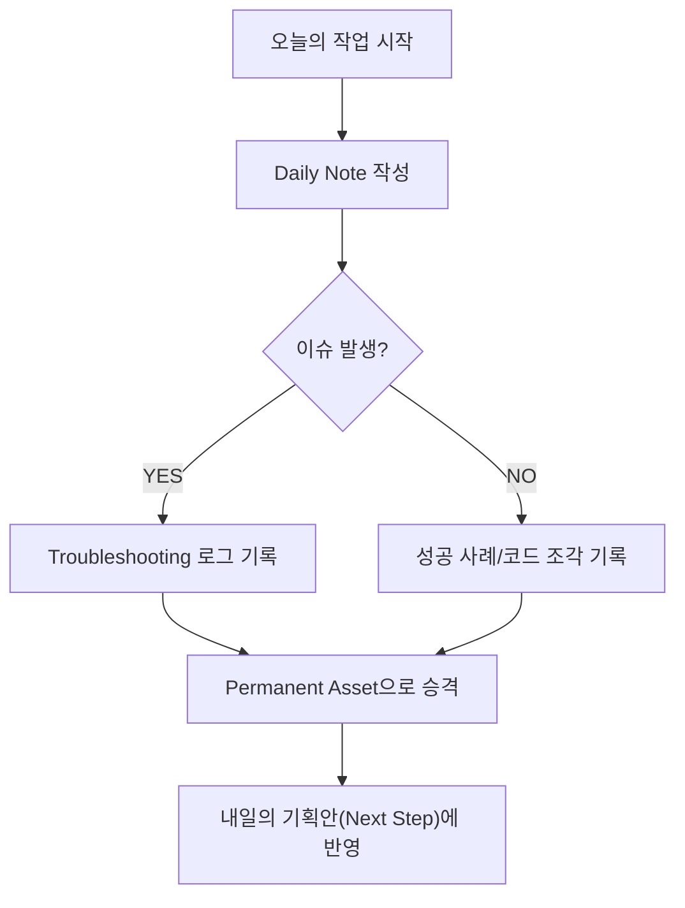

# Step 6: 데일리 로그 기록 (Daily Logging)

**Phase**: 🟩 Phase 2: Assets (지식 자산화)
**핵심**: 실행 과정에서 발생하는 모든 시행착오, 성공, 오류를 자산으로 기록

> [!TIP] 기록의 원칙
> 데일리 로그는 단순한 "일기"가 아니라, 다음 날의 실행을 위한 **"구조화된 데이터"**가 되어야 합니다.

---

## 🎯 실제 적용: platform_all의 298개 개발 문서

### 1단계: 모든 실행의 문서화
`platform_all/Original_Development_Plan/docs` 폴더는 단순한 폴더가 아니라, 프로젝트의 진화 과정을 담은 **거대한 로그 저장소**입니다.

- **기록 방식**: `type.module.name` 체계를 사용하여 모든 설계서, API 가이드, 이슈 사항을 기록.
- **통계**: 현재 298개 이상의 Markdown 문서가 누적되어 있으며, 이는 외주 개발자와의 협업 및 유지보수의 핵심 자산이 되었습니다.

### 2단계: 시행착오의 자산화
오류가 발생했을 때 해결 과정까지 기록하여, 향후 동일한 문제가 발생했을 때 즉각 대응할 수 있도록 했습니다.

- **사례**: `FMEA_Automation_Generation_Technology` 개발 중 발생한 프롬프트 충돌 이슈와 해결책을 별도 문서로 기록.
- **이점**: 지식의 휘발성을 방지하고, AI 에이전트가 이 로그를 참조하여 스스로 문서를 업데이트할 수 있는 모델을 구축.

---

## 🛠️ 기록 시스템 구조 (Obsidain 기반)

### 실제 로그 예시 (obsidian_design_origin)
- `specs/01_Business/Blue_Print.md`: 초기 비즈니스 의도 기록
- `specs/02_Database/Database_Design.md`: 데이터 모델 변화 과정 추적
- `specs/04_Prompts/chain/`: 프롬프트 개선 이력 관리

---

## 📊 결과 및 성과
- ✅ **문서량**: 298개 이상의 Markdown 파일 확보
- ✅ **재사용성**: 과거의 해결책을 5분 이내에 찾아내어 적용 가능
- ✅ **협업 효율**: 외주 개발자에게 별도의 설명 없이 문서 링크만으로 온보딩 가능

---

## 🔗 관련 증거
- [Original_Development_Plan/docs](../../platform_all/Original_Development_Plan/docs) - 298개의 구조화된 자산
- [[Step_04_Modularization|Step 4: 모듈화 전략]] - 기록의 단위가 되는 모듈 체계

---

> [!SUCCESS] Step 6 핵심 교훈
> **"기록하지 않은 시행착오는 비용이지만, 기록된 시행착오는 강력한 자산이다."**
