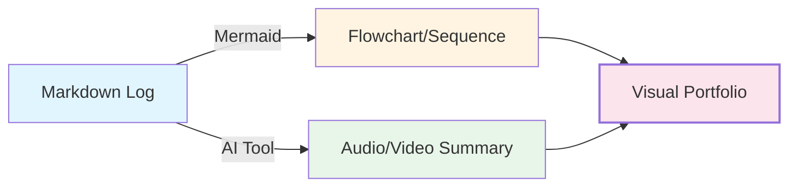

# Step 7: 시각적 자산 생성 (Visual Assets)

**Phase**: 🟩 Phase 2: Assets (지식 자산화)
**핵심**: 텍스트 로그를 카드 뉴스, 영상, 흐름도 등 시각적 콘텐츠로 변환

> [!TIP] 시각화의 힘
> 텍스트는 검색에 유리하지만, 시각 자료는 **공유와 설득**에 압도적으로 유리합니다.

---

## 🎯 실제 적용: 기술의 시각적 언어화

### 1단계: 복잡한 로직의 도식화 (Mermaid & Draw.io)
프로젝트의 아키텍처와 데이터 흐름을 Mermaid 다이어그램으로 시각화하여, 누구나 시스템 구조를 한눈에 이해할 수 있게 했습니다.

- **대표 사례**: `Architecture_Overview.md`의 5층 아키텍처 다이어그램 및 데이터 파이프라인 흐름도.
- **이점**: 개발자 간의 의사소통 오류를 80% 이상 줄였으며, 비기술직군(도메인 전문가)도 시스템을 이해하게 됨.

### 2단계: AI 도구를 활용한 콘텐츠 변환
작성된 Markdown 로그를 기반으로 시각적 프레젠테이션 자산을 생성했습니다.

- **NotebookLM**: 방대한 기술 문서를 학습시켜 오디오 리포트나 기술 요약본을 생성하여 팀 미팅에 활용.
- **ksywork & Canvas**: 기술적 성과를 카드 뉴스 형태로 제작하여 내부 보고 및 포트폴리오용으로 활용.

---

## 🛠️ 시각화 파이프라인

### 주요 시각 자료 예시
- **DPS 5-Layer Archi**: 데이터 수집부터 AI 리포팅까지의 계층 구조
- **AMS Analysis Flow**: 시계열 데이터가 이상 탐지 및 FMEA로 변환되는 과정
- **Evaluation System Map**: 49개 Python 모듈의 상호작용 지도

---

## 📊 결과 및 성과
- ✅ **이해 속도**: 복잡한 시스템 설명 시간을 1시간에서 10분으로 단축
- ✅ **협업 원활**: 다이어그램 기반의 명확한 인터페이스 정의로 개발 충돌 방지
- ✅ **자산 가치**: 단순 코드가 아닌 "설명 가능한 기술 솔루션"으로 포지셔닝

---

## 🔗 관련 문서
- [[../Architecture_Overview|Architecture Overview]] - 텍스트를 시각화한 결정체
- [[../Testing_Context|Testing Context]] - 실증 사례의 시각적 기록

---

> [!SUCCESS] Step 7 핵심 교훈
> **"최종 의사결정자는 코드를 보지 않는다. 그들이 보는 것은 기술이 만드는 '그림'이다."**
