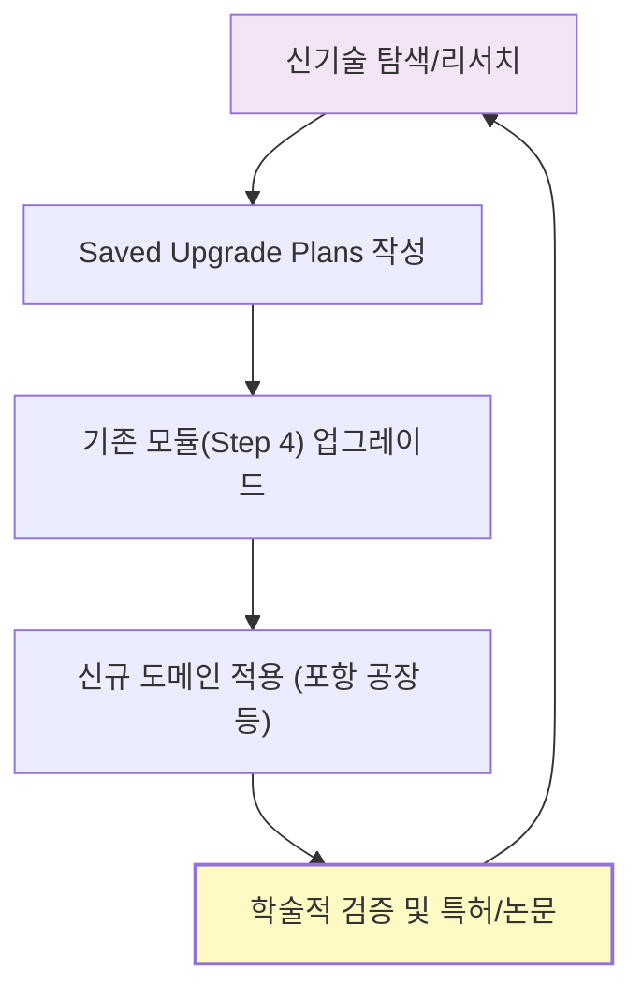

# Step 9: 지속적 업데이트 (Continuous Update)

**Phase**: 🟧 Phase 3: Expansion (무한 확장)
**핵심**: 기술 트렌드를 상시 모니터링하고, 도메인 지식을 확장하여 시스템을 무한히 진화시킴

> [!GOAL] 궁극의 루프
> **"학습(Learn) → 실행(Execute) → 기록(Record) → 공유(Share)"**의 루프를 내면화하십시오.

---

## 🎯 실제 적용: 멈추지 않는 상향 평준화

### 1단계: 저장된 업그레이드 방안 (Saved Upgrade Plans)
현재의 기술에 안주하지 않고, 미래에 도입할 기술(TimeSeriesMcpOrchestrator 등)을 미리 설계하고 비축해두는 습관을 시스템화했습니다.

- **프로젝트**: `저장된업그레이드방안`
- **활동**: 매주 차세대 AI 기술(Agentic Workflow, RAG 최적화 등)을 리서치하여 현재 시스템(`platform_all`)에 어떻게 녹여낼지 설계안을 미리 작성.

### 2단계: 리버스 엔지니어링 및 기술 내재화
글로벌 기술 리더들의 시스템을 거꾸로 분석(Reverse Engineering)하여 우리만의 독자적인 기술로 변환시켰습니다.

- **결과**: `Original_Development_Plan`이 처음의 단순 기획에서 현재의 거대한 10개 주요 프로젝트군으로 진화한 원동력.
- **증빙**: 2020년부터 2025년까지 꾸준히 발표된 **9편의 학술 논문**과 **GS 인증** 성과들.

---

## 🛠️ 지속 성장의 사이클

---

## 📊 지속적 업데이트의 결과
- ✅ **기술적 깊이**: 단순 웹 앱 개발자에서 AI 기반 제조 DX 통합 설계자로 성장
- ✅ **사업적 확장**: 13개 이상의 개별 솔루션을 하나의 거대한 '플랫폼 자산'으로 통합
- ✅ **학문적 성취**: 매년 1.5편 이상의 고품질 논문 발표를 통한 기술적 공신력 확보

---

## 🔗 관련 자산
- [저장된업그레이드방안](../../platform_all/저장된업그레이드방안) - 미래 기술을 준비하는 저장소
- [[../04_Academic_Publications|학술 논문 목록]] - 5년간의 지속적 업데이트가 만든 결실

---

> [!SUCCESS] Step 9 핵심 교훈
> **"정체는 곧 도태다. 시스템은 생물처럼 끊임없이 먹이(학습)를 먹고 자라야 한다."**
