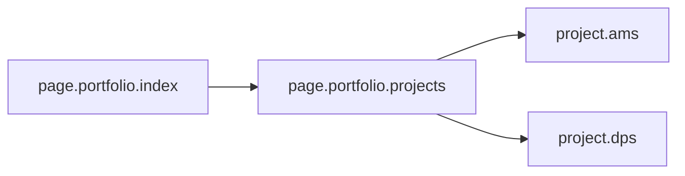
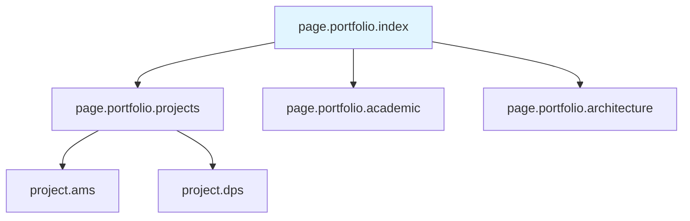

# ID 시스템 가이드

> [!NOTE] 문서 목적
> 포트폴리오 문서에서 사용하는 ID 시스템의 명명 규칙과 사용 방법을 정의합니다. AI가 문서를 참조하고 생성할 때 일관된 ID 체계를 사용하여 문서 간 관계를 명확히 추적할 수 있습니다.

---

## ID 명명 규칙

### 기본 형식: `type.module.name`

모든 요소는 `type.module.name` 형식의 고유 ID를 가집니다.

**구성 요소**:
- **type**: 요소의 타입 (필수)
- **module**: 모듈 또는 카테고리 (필수)
- **name**: 구체적인 이름 (필수)

**예시**:
- `page.portfolio.index` - 포트폴리오 인덱스 페이지
- `api.ams.config.get` - AMS 설정 조회 API
- `service.ams.pipeline` - AMS 파이프라인 서비스

---

## ID 타입 분류

### 포트폴리오 문서용 타입

| 타입 | 설명 | 예시 | 사용 위치 |
|------|------|------|----------|
| `page.*` | 문서/페이지 | `page.portfolio.index`, `page.portfolio.projects` | 문서 헤더, 관계 맵 |
| `phase.*` | Phase 단계 | `phase.foundation.step01`, `phase.assets.step06` | Phase 문서 |
| `project.*` | 프로젝트 | `project.ams`, `project.dps`, `project.sensor` | 프로젝트 개요 |
| `template.*` | 템플릿 | `template.project.summary`, `template.evaluation` | 템플릿 문서 |
| `guide.*` | 가이드 문서 | `guide.id.system`, `guide.ai.workflow` | 가이드 문서 |

### 기술 문서용 타입 (참고)

| 타입 | 설명 | 예시 |
|------|------|------|
| `api.*` | API 엔드포인트 | `api.ams.config.get` |
| `service.*` | 백엔드 서비스 | `service.ams.pipeline` |
| `db.*` | 데이터베이스 테이블 | `db.AMS3000M` |
| `comp.*` | UI 컴포넌트 | `comp.widget.barchart` |
| `type.*` | TypeScript/데이터 타입 | `type.ams.config.snroId` |
| `graph.*` | 그래프 DB 노드 | `graph.neo4j` |

---

## 포트폴리오 문서 ID 예시

### 문서 ID

```yaml
# 메인 문서
page.portfolio.index: "00_Portfolio_Index.md"
page.portfolio.relationship_map: "00_Relationship_Map.md"
page.portfolio.projects: "02_Projects_Overview.md"
page.portfolio.academic: "04_Academic_Publications.md"
page.portfolio.architecture: "Architecture_Overview.md"
page.portfolio.testing: "Testing_Context.md"

# Phase 문서
phase.foundation.step01: "Phase_1_Foundation/Step_01_Repetitive_Work.md"
phase.foundation.step02: "Phase_1_Foundation/Step_02_Expertise_Targeting.md"
phase.foundation.step03: "Phase_1_Foundation/Step_03_Micro_Starts.md"
phase.foundation.step04: "Phase_1_Foundation/Step_04_Modularization.md"
phase.foundation.step05: "Phase_1_Foundation/Step_05_IO_Optimization.md"

phase.assets.step06: "Phase_2_Assets/Step_06_Daily_Log.md"
phase.assets.step07: "Phase_2_Assets/Step_07_Visuals.md"

phase.expansion.step08: "Phase_3_Expansion/Step_08_Feedback_Loop.md"
phase.expansion.step09: "Phase_3_Expansion/Step_09_Continuous_Update.md"

# 가이드 문서
guide.id.system: "00_ID_System_Guide.md"
guide.ai.workflow: "00_AI_Workflow_Guide.md"
guide.team.roles: "00_Team_Roles_Guide.md"
guide.pm.roles: "00_PM_Roles_Guide.md"

# 템플릿
template.project.summary: "templates/Project_Summary_Template.md"
template.evaluation: "templates/Evaluation_Prompt_Template.md"
```

### 프로젝트 ID

```yaml
# 주요 프로젝트
project.ams: "AMS (Anomaly Management System)"
project.dps: "DPS (데이터수집시스템)"
project.coctk: "CoCTK (Consulting Tool Kit)"
project.sensor: "스마트센서 3종"
project.energy: "에너지 최적화 시스템"
project.fmea: "FMEA 자동화 시스템"
project.digital_twin: "디지털 트윈 안전 시스템"
```

---

## ID 사용 규칙

### 1. 명명 규칙

- **소문자 사용**: 모든 ID는 소문자로 작성
- **점(.) 구분**: 타입, 모듈, 이름은 점(.)으로 구분
- **언더스코어(_) 허용**: 이름 내부에서 단어 구분 시 언더스코어 사용 가능
- **숫자 허용**: 이름에 숫자 사용 가능 (예: `step01`, `sensor_3`)

**올바른 예시**:
- ✅ `page.portfolio.index`
- ✅ `phase.foundation.step_01`
- ✅ `project.ams_v2`
- ✅ `template.evaluation_prompt`

**잘못된 예시**:
- ❌ `Page.Portfolio.Index` (대문자 사용)
- ❌ `page-portfolio-index` (하이픈 사용)
- ❌ `page portfolio index` (공백 사용)

### 2. 참조 방법

#### 문서 내 참조

```markdown
## 관련 문서

- [[00_Portfolio_Index|포트폴리오 인덱스]] (`page.portfolio.index`)
- [[Phase_1_Foundation/Step_04_Modularization|모듈화 전략]] (`phase.foundation.step04`)
```

#### 관계 맵에서 참조



### 3. 확장 규칙

#### 새로운 타입 추가

새로운 타입을 추가할 때는 다음을 고려:

1. **기존 타입과의 구분**: 명확히 구분되는 타입인가?
2. **일관성**: 기존 명명 규칙을 따르는가?
3. **확장성**: 향후 확장 가능한가?

**예시**: 평가 결과 문서 타입 추가
- `eval.phase.01` - Phase 1 평가 결과
- `eval.phase.02` - Phase 2 평가 결과
- `eval.summary.recruiter` - 채용담당자 종합 평가

---

## ID 시스템의 이점

### 1. 문서 간 관계 명확화

- ID를 통해 문서 간 의존성 추적
- 관계 맵에서 시각적 표현 가능
- AI가 문서 참조 시 정확한 링크 생성

### 2. 일관성 유지

- 모든 문서에서 동일한 ID 체계 사용
- 새로운 문서 추가 시 자동으로 ID 부여
- 문서 구조 변경 시에도 ID로 추적 가능

### 3. AI 활용 용이성

- AI가 ID 기반으로 문서 검색 및 참조
- 문서 생성 시 자동으로 ID 부여
- 문서 간 관계 자동 추론

---

## 실제 적용 예시

### 문서 헤더에 ID 추가

```markdown
---
id: page.portfolio.index
title: 포트폴리오 인덱스
type: page
module: portfolio
name: index
---

# 포트폴리오 인덱스

...
```

### 관계 맵에 ID 사용



### 문서 간 참조

```markdown
## 관련 프로젝트

- [[02_Projects_Overview#AMS|AMS 프로젝트]] (`project.ams`)
- [[02_Projects_Overview#DPS|DPS 프로젝트]] (`project.dps`)

## 관련 Phase

- [[Phase_1_Foundation/Step_04_Modularization|모듈화 전략]] (`phase.foundation.step04`)
```

---

## 체크리스트

### 새 문서 생성 시

- [ ] 문서에 적절한 ID 부여 (`type.module.name`)
- [ ] 문서 헤더에 ID 메타데이터 추가
- [ ] 관계 맵에 ID 반영
- [ ] 관련 문서와의 관계 명시

### 기존 문서 업데이트 시

- [ ] 기존 ID 유지 (변경 시 영향도 확인)
- [ ] 관계 맵 업데이트
- [ ] 참조 문서의 ID 일관성 확인

---

## 관련 문서

- [[00_AI_Workflow_Guide|AI 워크플로우 가이드]] - ID 시스템을 활용한 AI 워크플로우
- [[Phase_1_Foundation/Step_04_Modularization|모듈화 전략]] - 실제 프로젝트에서의 ID 시스템 적용 사례
- [[00_Relationship_Map|관계 맵]] - ID 기반 문서 관계 시각화

---

> [!TIP] 빠른 참조
> - **기본 형식**: `type.module.name`
> - **타입 목록**: `page`, `phase`, `project`, `template`, `guide`
> - **예시**: `page.portfolio.index`, `phase.foundation.step01`, `project.ams`

