# 포트폴리오 관계 맵 (Portfolio Relationship Map)

**문서 ID**: `page.portfolio.relationship_map`

> [!INFO] 이 문서의 목적
> 13개 프로젝트, 9편 논문, 9단계 실행 가이드, 그리고 실증 사례 간의 관계를 시각화하여 전체 포트폴리오의 구조를 한눈에 파악할 수 있도록 합니다.

---

## 🗺️ 전체 온톨로지 구조

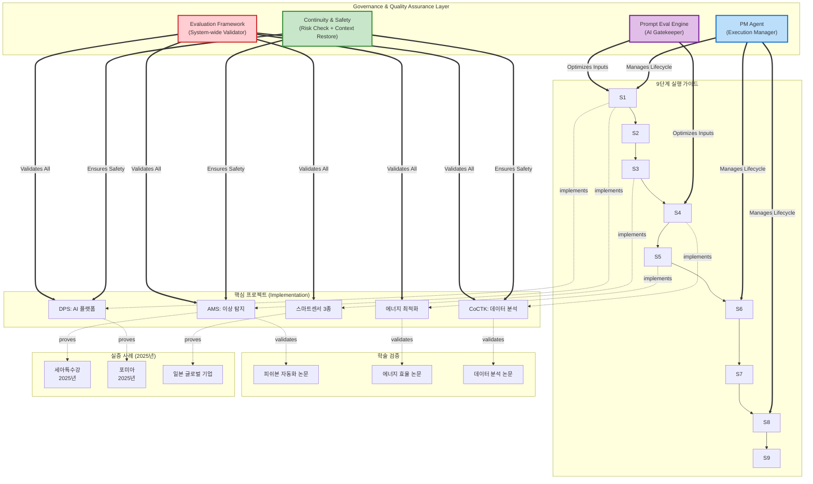

---

## 🔗 프로젝트별 상세 관계

### 🧬 AMS 기술 진화 계보 (Technology Lineage)

> [!NOTE] **인터뷰 기반 기술 진화 스토리**
> 2020년 O-WELL(일본) 프로젝트에서 시작된 알고리즘이 4년간 진화하여 AMS의 핵심 엔진이 되었고, 동시에 각 프로젝트의 경험이 LLM 에이전트 설계의 토대가 되었습니다.

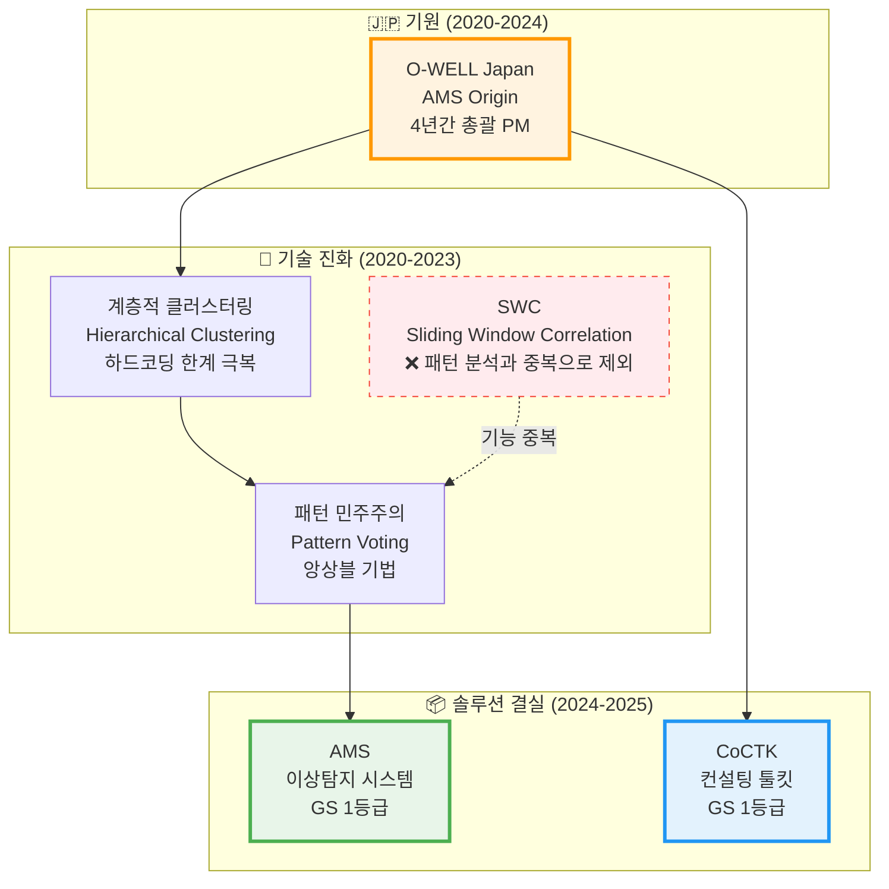

**핵심 인사이트:**
- **O-WELL Japan (2020-2024)**: 초기 백엔드 개발 → 풀스택 개발 및 총괄 PM으로 확장
- **계층적 클러스터링**: 데이터 심도에 따른 가지치기로 하드코딩 한계 극복
- **패턴 민주주의(Pattern Voting)**: 패턴별 피쉬본 생성 후 투표로 종합하는 앙상블 기법
- **SWC 제외**: 초기 도입했으나 패턴 분석과 기능 중복으로 최적화 과정에서 제거

---

### 🤖 LLM 에이전트 설계 토대 관계

> [!NOTE] **프로젝트 경험 → LLM 에이전트 설계**
> 각 프로젝트에서 쌓은 경험이 LLM 에이전트 설계의 토대가 되었습니다.

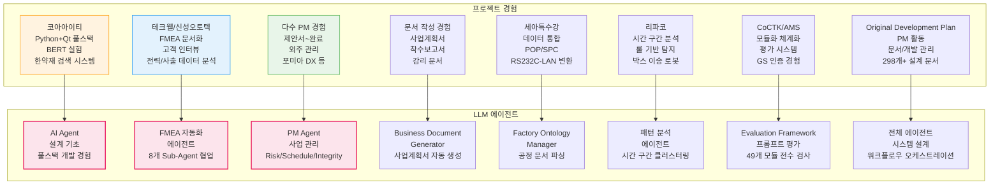

**핵심 인사이트:**
- **코아아이티**: Python+Qt 풀스택 개발 및 BERT 실험 경험을 쌓아 AI Agent 설계 및 개발의 기초가 됨
- **테크웰/신성오토텍**: FMEA 문서화 및 고객 인터뷰 경험을 쌓아 FMEA 자동화 에이전트 설계의 토대 마련 → [[02_Projects_Overview#022-fmea-자동화-에이전트-진화-스토리-난해한-기술을-현장이-이해하는-언어로|FMEA 자동화 에이전트 진화 스토리]]
- **다수 PM 경험**: 제안서 작성, 외주 관리, 완료서 작성 등 PM 경험을 통해 PM Agent 설계의 토대 마련
- **문서 작성 경험**: 사업계획서, 제안서, 착수보고서, 감리 문서 작성 경험을 통해 Business Document Generator 설계의 토대 마련 → [[02_Projects_Overview#025-business-document-generator-진화-스토리-사업계획서를-하도-만들다-보니-만든-자동화-시스템|Business Document Generator 진화 스토리]]
- **세아특수강**: 데이터 통합, POP/SPC 개발 경험을 쌓아 Factory Ontology Manager AI Agent 설계의 토대 마련 → [[02_Projects_Overview#023-factory-ontology-manager-ai-agent-진화-스토리-5년간의-비전과-현실의-만남|Factory Ontology Manager 진화 스토리]]
- **리파코**: 시간 구간 분석 및 룰 기반 탐지 경험을 쌓아 패턴 분석 에이전트 설계의 토대 마련
- **CoCTK/AMS**: 모듈화 및 체계화 경험, GS 인증 프로세스 경험을 쌓아 Evaluation Framework와 프롬프트 평가 엔진 설계의 토대 마련
- **Original Development Plan**: 다수 PM 경험(제안서~완료, 외주 관리)을 통해 전체 에이전트 시스템 설계의 토대 마련 → [[02_Projects_Overview#021-코딩-에이전트-진화-스토리-외주-개발자-관리의-한계를-넘어서|코딩 에이전트 진화 스토리]]

---

### 🤖 AI Agent 진화 스토리 흐름

> [!NOTE] 스토리텔링 접근
> 각 프로젝트에서 겪은 실제 문제와 해결 과정이 AI Agent 개발로 이어지는 자연스러운 진화 흐름을 보여줍니다. 상세한 스토리는 [[02_Projects_Overview#02-llm-에이전트-설계-토대-관계|02_Projects_Overview.md의 LLM 에이전트 설계 토대 관계 섹션]]을 참조하세요.

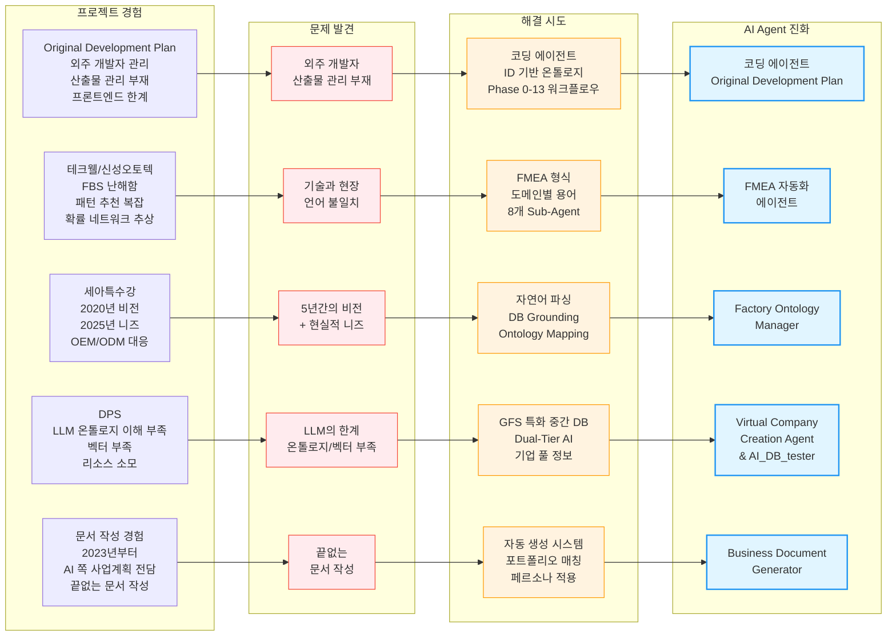

**스토리텔링 섹션 링크:**
- [[02_Projects_Overview#021-코딩-에이전트-진화-스토리-외주-개발자-관리의-한계를-넘어서|0.2.1 코딩 에이전트 진화 스토리]]: 외주 개발자 관리의 한계를 넘어서
- [[02_Projects_Overview#022-fmea-자동화-에이전트-진화-스토리-난해한-기술을-현장이-이해하는-언어로|0.2.2 FMEA 자동화 에이전트 진화 스토리]]: 난해한 기술을 현장이 이해하는 언어로
- [[02_Projects_Overview#023-factory-ontology-manager-ai-agent-진화-스토리-5년간의-비전과-현실의-만남|0.2.3 Factory Ontology Manager AI Agent 진화 스토리]]: 5년간의 비전과 현실의 만남
- [[02_Projects_Overview#024-virtual-company-creation-agent--ai_db_tester-vacts-진화-스토리-llm을-서포트하기-위한-특화-중간-db|0.2.4 Virtual Company Creation Agent & AI_DB_tester (VACTS) 진화 스토리]]: LLM을 서포트하기 위한 특화 중간 DB
- [[02_Projects_Overview#025-business-document-generator-진화-스토리-사업계획서를-하도-만들다-보니-만든-자동화-시스템|0.2.5 Business Document Generator 진화 스토리]]: 사업계획서를 하도 만들다 보니 만든 자동화 시스템

---

### 📊 주요 기술 기여도 매트릭스

| 프로젝트 | AMS 모듈 기여 | LLM 에이전트 토대 |
|:---|:---|:---|
| **O-WELL Japan** | FBS 모듈 (피쉬본 개념, 중요도 앙상블) | - |
| **FBS** | FBS 모듈 (계층 구조, 중요도 소팅) | - |
| **에너지 패턴 분석** | Pattern 모듈 (계층적 클러스터링, 패턴 민주주의) | - |
| **EEMS** | RMS 모듈 (룰 생성 기법) | - |
| **클린룸 에너지 최적화** | RMS 모듈 (AI RMS 뿌리) | - |
| **리파코** | Pattern 모듈 (시간 구간 클러스터링) | 리파코에서 시간 구간 분석 및 룰 기반 탐지 경험을 쌓아 패턴 분석 에이전트 설계의 토대 마련 |
| **CoCTK** | AMS Core (모듈화/체계화) | CoCTK에서 모듈화·체계화 경험을 쌓아 Evaluation Framework 설계의 토대 마련 |
| **코아아이티** | - | 코아아이티에서 Python+Qt 풀스택 개발 및 BERT 실험 경험을 쌓아 AI Agent 설계 및 개발의 기초가 됨 |
| **테크웰/신성오토텍** | FMEA 모듈 (문서화 경험) | 테크웰/신성오토텍에서 FMEA 문서화 및 고객 인터뷰 경험을 쌓아 FMEA 자동화 에이전트 설계의 토대 마련 |
| **포미아 DX/세아특수강** | - | 포미아 DX에서 PM 경험, 세아특수강에서 데이터 통합 및 POP/SPC 개발 경험을 쌓아 Factory Ontology Manager와 PM Agent 설계의 토대 마련 |
| **다수 PM 경험** | - | 다수 PM 경험(제안서 작성, 외주 관리, 완료서 작성 등)을 통해 PM Agent 설계의 토대 마련 |
| **문서 작성 경험** | - | 다수 문서 작성 경험(사업계획서, 제안서, 착수보고서, 감리 문서 등)을 통해 Business Document Generator 설계의 토대 마련 |
| **Original Development Plan** | - | 다수 PM 경험(제안서~완료, 외주 관리)을 통해 전체 에이전트 시스템 설계의 토대 마련 |

---

### 1️⃣ AMS (Analysis Management System)

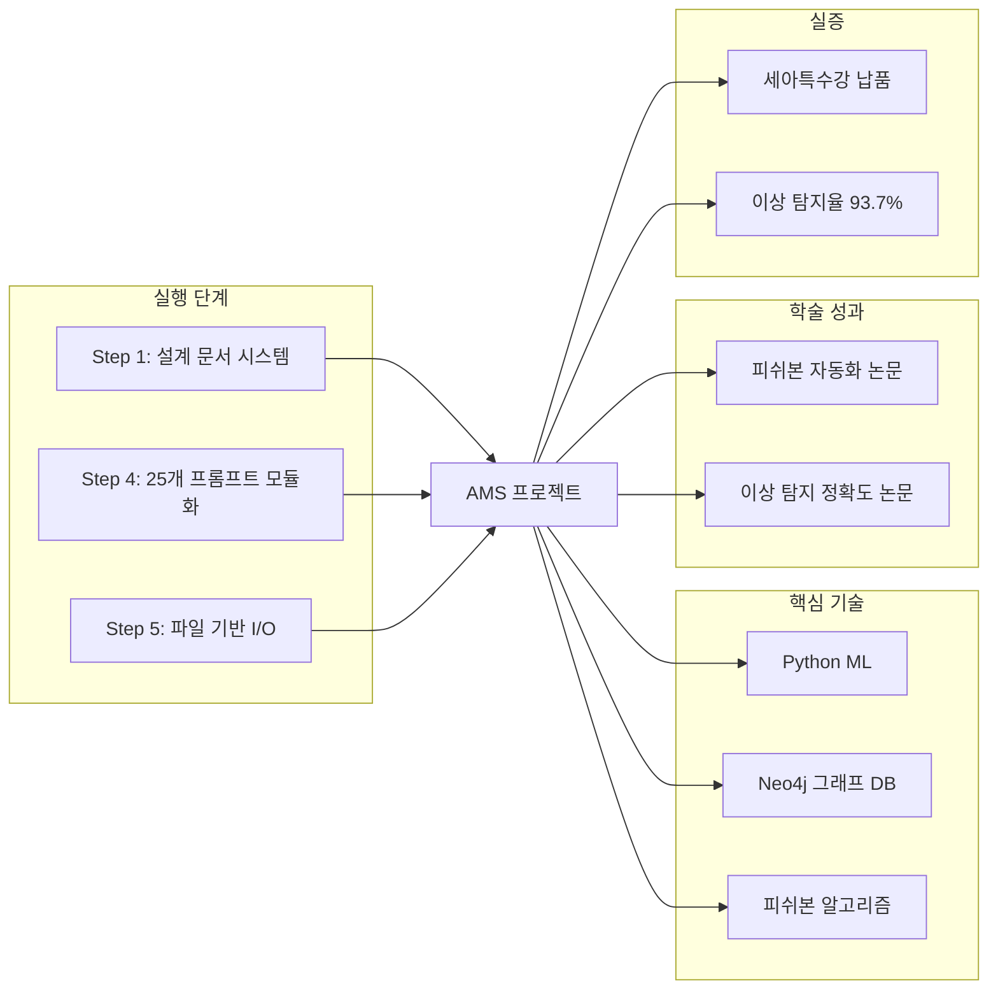

**관련 문서**:
- [[Phase_1_Foundation/Step_01_Repetitive_Work|Step 1: 반복 업무 식별]]
- [[Phase_1_Foundation/Step_04_Modularization|Step 4: 모듈화 전략]]
- [[02_Projects_Overview#AMS|AMS 프로젝트 개요]]
- [[04_Academic_Publications#피쉬본|피쉬본 다이어그램 자동화 논문]]
- [[Testing_Context#세아특수강|세아특수강 실증 사례]]

---

### 2️⃣ DPS (데이터수집시스템)

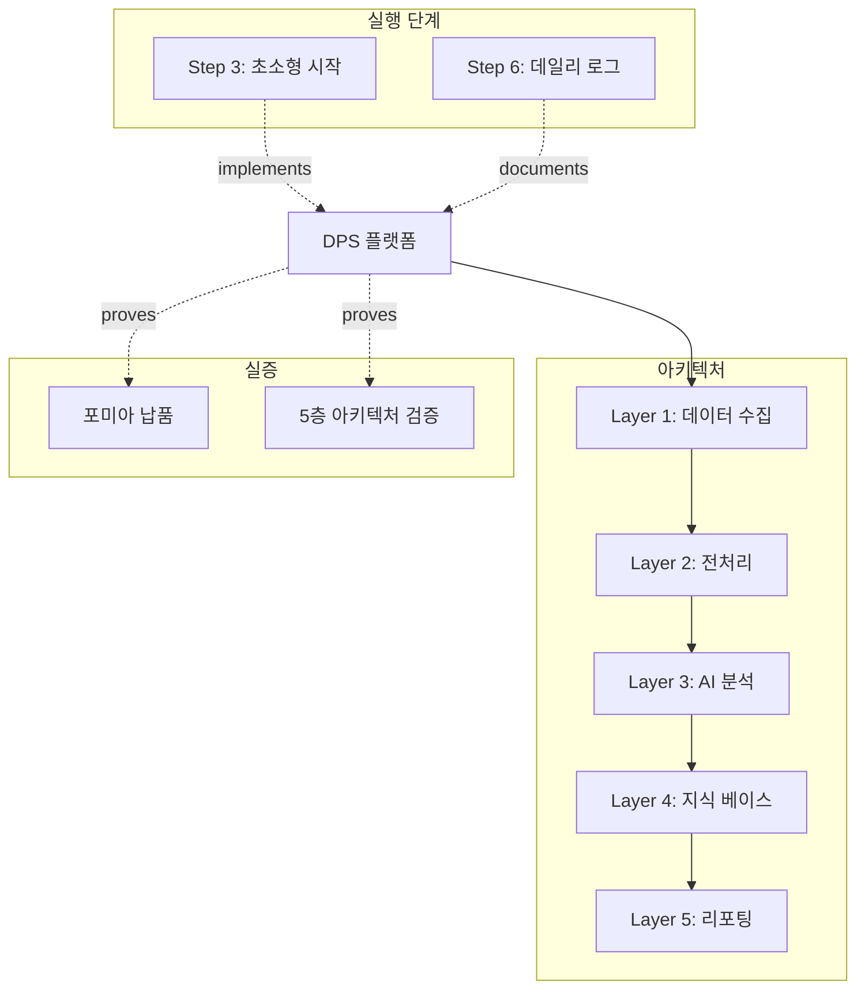

**관련 문서**:
- [[Architecture_Overview#DPS|DPS 5층 아키텍처]]
- [[Phase_1_Foundation/Step_03_Micro_Starts|Step 3: 초소형 단위 시작]]
- [[Testing_Context#포미아|포미아 실증 사례]]

---

### 3️⃣ 스마트센서 & IoT 생태계

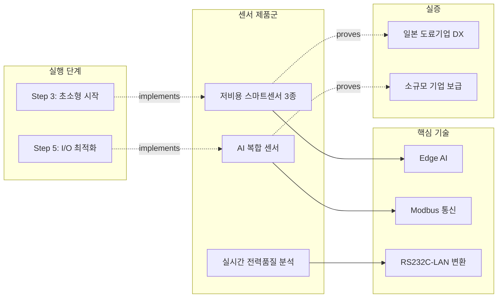

**관련 문서**:
- [[02_Projects_Overview#센서|스마트센서 프로젝트]]
- [[Phase_1_Foundation/Step_03_Micro_Starts|Step 3: 초소형 단위 시작]]

---

## 📚 학술 논문 → 프로젝트 매핑

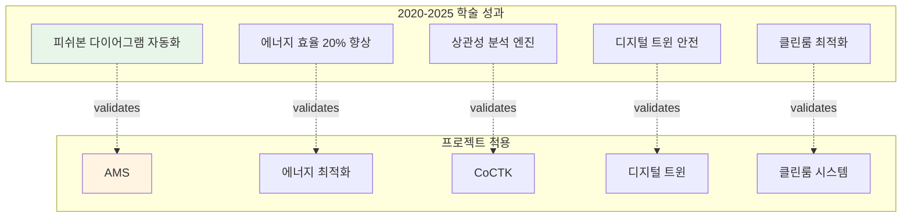

**관련 문서**:
- [[04_Academic_Publications|학술 논문 전체 목록]]

---

## 🏭 실증 사례 네트워크

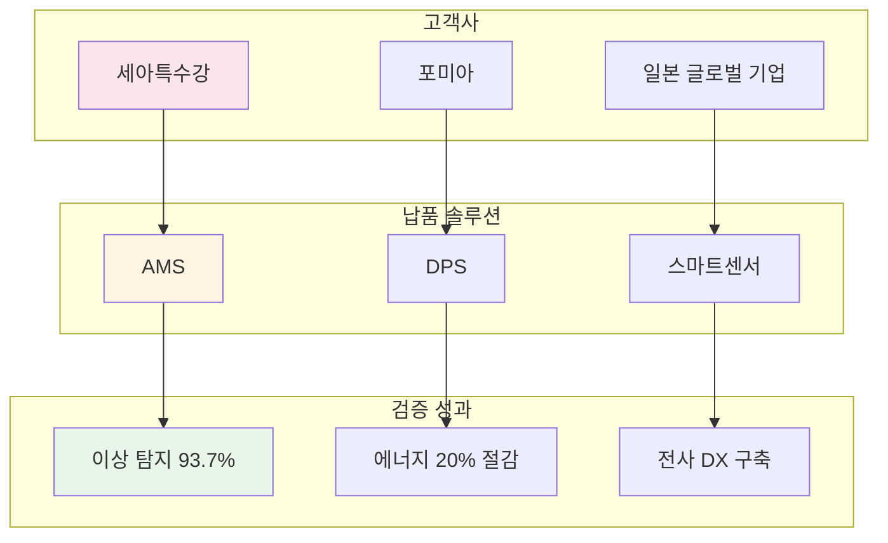

**관련 문서**:
- [[Testing_Context|실증 및 검증 사례 전체]]

---

## 🏭 스마트공장 및 컨설팅 프로젝트 상세 (2020-2026) - 29개

### 연도별 프로젝트 현황

| 연도 | 구축/컨설팅 수 | 주요 발주처 | 핵심 솔루션 |
|:---|:---:|:---|:---|
| **2020** | 3 | O-WELL(일본), 에스에이치, 에이치피엔씨 | **AMS Origin**, FBS |
| **2021** | 7 | 한중엔시에스, 알티스트, 대성금형 등 | AI 백엔드, FBS |
| **2022** | 6 | 롯데알루미늄, 송월타올, 이튼 등 | SWC, 전력 패턴 분석 |
| **2023** | 6 | 해태가루비, 코스모폴, 리파코, 코아아이티 등 | CoCTK, NLP, 로봇 분석 |
| **2024** | 6 | 에스에이치(풀 플랫폼), 테크웰, 신성오토텍 등 | **AMS 플랫폼**, FMEA |
| **2025-26** | 1 | 테이패스 새만금 | **CoCTK 시험 적용** |

### 솔루션 적용 현황

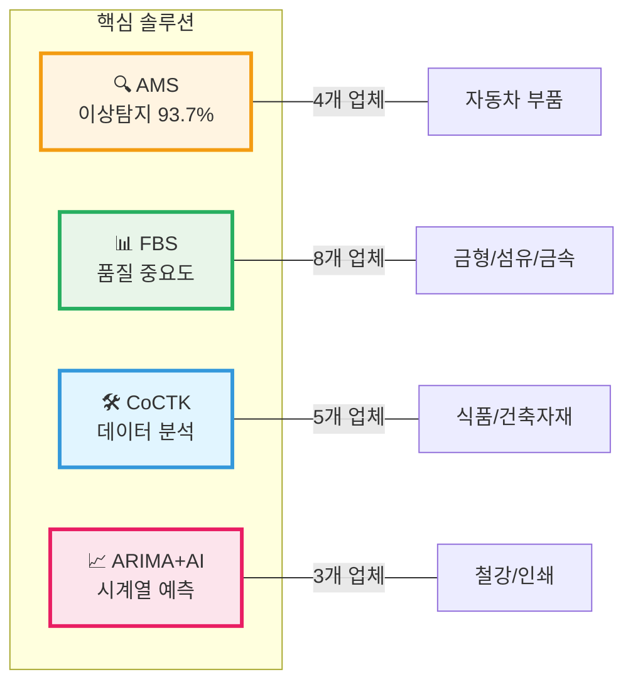

### 주요 성과
- **AMS 납품**: 에스에이치아이엔티 (2024)
- **CoCTK 납품**: 테이패스 새만금 (2025-2026)
- **GS 1등급 취득**: AMS/PDS, CoCTK

**관련 문서**:
- [[02_Projects_Overview#스마트공장|스마트공장 구축 프로젝트 상세]]

---

## 🎯 9단계 실행 가이드 흐름

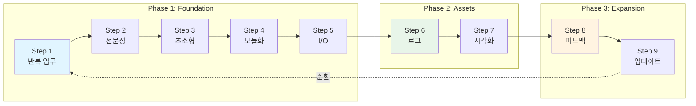

**관련 문서**:
- [[00_Portfolio_Index|포트폴리오 메인 인덱스]]

---

## 🔍 핵심 허브(Hub) 문서

### 진입점(Entry Points)
1. **[[00_Portfolio_Index|포트폴리오 인덱스]]** (`page.portfolio.index`) - 전체 시작점
2. **[[02_Projects_Overview|프로젝트 개요]]** (`page.portfolio.projects`) - 13개 솔루션 허브
3. **[[Architecture_Overview|아키텍처 개요]]** (`page.portfolio.architecture`) - 기술 허브
4. **[[04_Academic_Publications|학술 논문]]** (`page.portfolio.academic`) - 연구 허브

### 가이드 문서
5. **[[00_ID_System_Guide|ID 시스템 가이드]]** (`guide.id.system`) - ID 명명 규칙
6. **[[00_AI_Workflow_Guide|AI 워크플로우 가이드]]** (`guide.ai.workflow`) - AI 문서 참조 전략
7. **[[00_Team_Roles_Guide|팀 역할 가이드]]** (`guide.team.roles`) - 팀 역할 정의
8. **[[00_PM_Roles_Guide|PM 역할 가이드]]** (`guide.pm.roles`) - PM 역할 구분

### 연결도(Degree) 순위
```yaml
최다_연결_문서:
  1. 00_Portfolio_Index.md (20개+ 링크)
  2. 00_Relationship_Map.md (현재 문서)
  3. 02_Projects_Overview.md (13개 링크)
  4. Architecture_Overview.md (10개 링크)
  5. Step_01_Repetitive_Work.md (8개 링크)
```

### 가이드 문서 네트워크
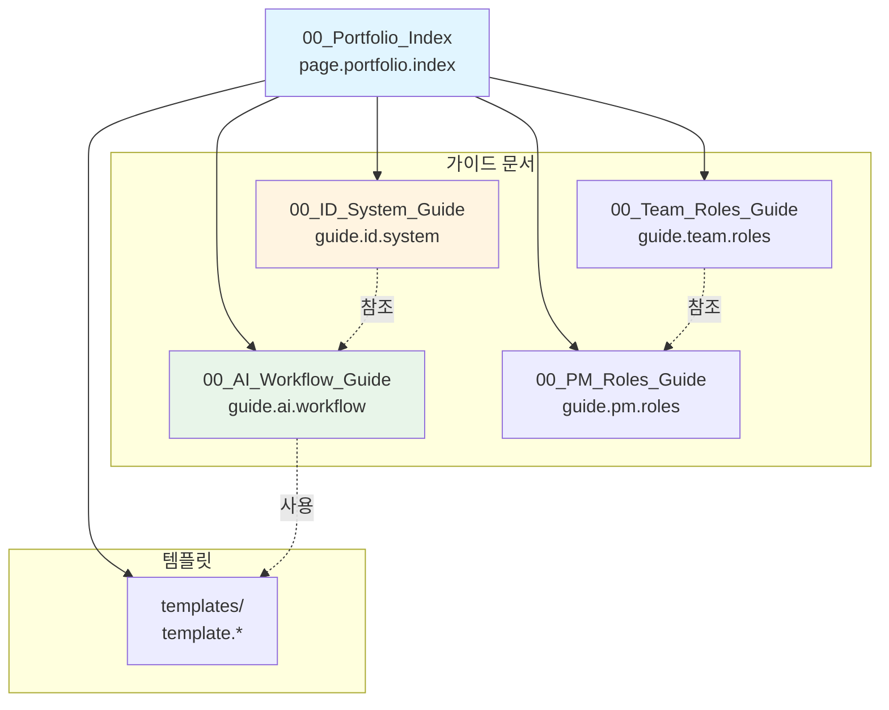

---

## 📊 관계 유형 정의

```yaml
관계_타입:
  implements: "Step → Project (구현 관계)"
  validates: "Project → Paper (학술 검증)"
  proves: "Project → Testing (실증 관계)"
  uses: "Project → Technology (기술 사용)"
  extends: "Step → Next Step (확장 관계)"
  references: "Document ↔ Document (참조)"
  guides: "Guide → Document (가이드 관계)"
  templates: "Template → Document (템플릿 관계)"
```

## 🔗 ID 기반 문서 관계

### ID 시스템 적용

모든 문서는 `type.module.name` 형식의 ID를 가지며, 관계 맵에서 ID를 통해 명확히 추적할 수 있습니다.

**주요 ID 예시**:
- `page.portfolio.index` - 포트폴리오 인덱스
- `guide.id.system` - ID 시스템 가이드
- `guide.ai.workflow` - AI 워크플로우 가이드
- `guide.team.roles` - 팀 역할 가이드
- `guide.pm.roles` - PM 역할 가이드
- `template.project.summary` - 프로젝트 요약 템플릿
- `phase.foundation.step01` - Step 1 문서
- `project.ams` - AMS 프로젝트
- `project.pm_agent` - PM Agent (사업 관리)
- `project.ai_db_tester` - AI_DB_tester (VACTS) - Virtual Company Creation Agent 테스트 자동화 시스템 (LangGraph 기반 자연어 쿼리 포함)
- `project.factory_ontology_manager_ai_agent` - Factory Ontology Manager AI Agent - 자연어 기반 공정 문서 파싱 및 캔버스 레이아웃 자동 생성

**관련 문서**: [[00_ID_System_Guide|ID 시스템 가이드]] (`guide.id.system`)

---

> [!TIP] 옵시디언 그래프 뷰 활용
> 이 문서를 중심으로 옵시디언의 그래프 뷰(Graph View)를 열면 전체 포트폴리오의 지식 네트워크를 시각적으로 탐색할 수 있습니다.
