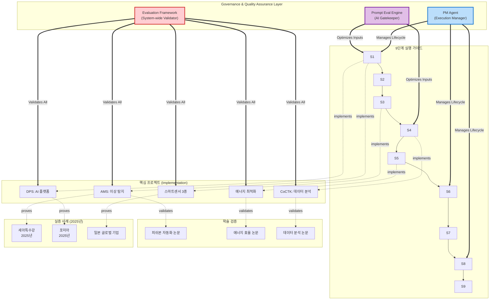
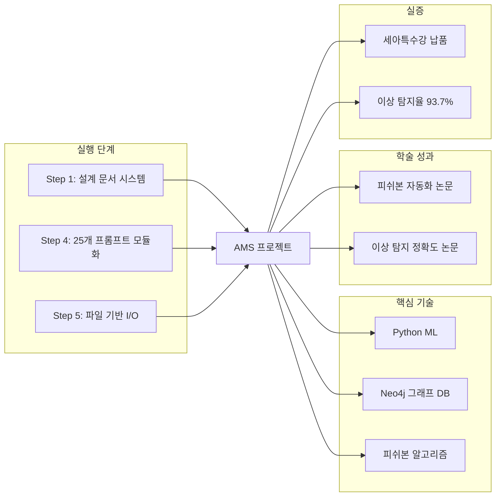
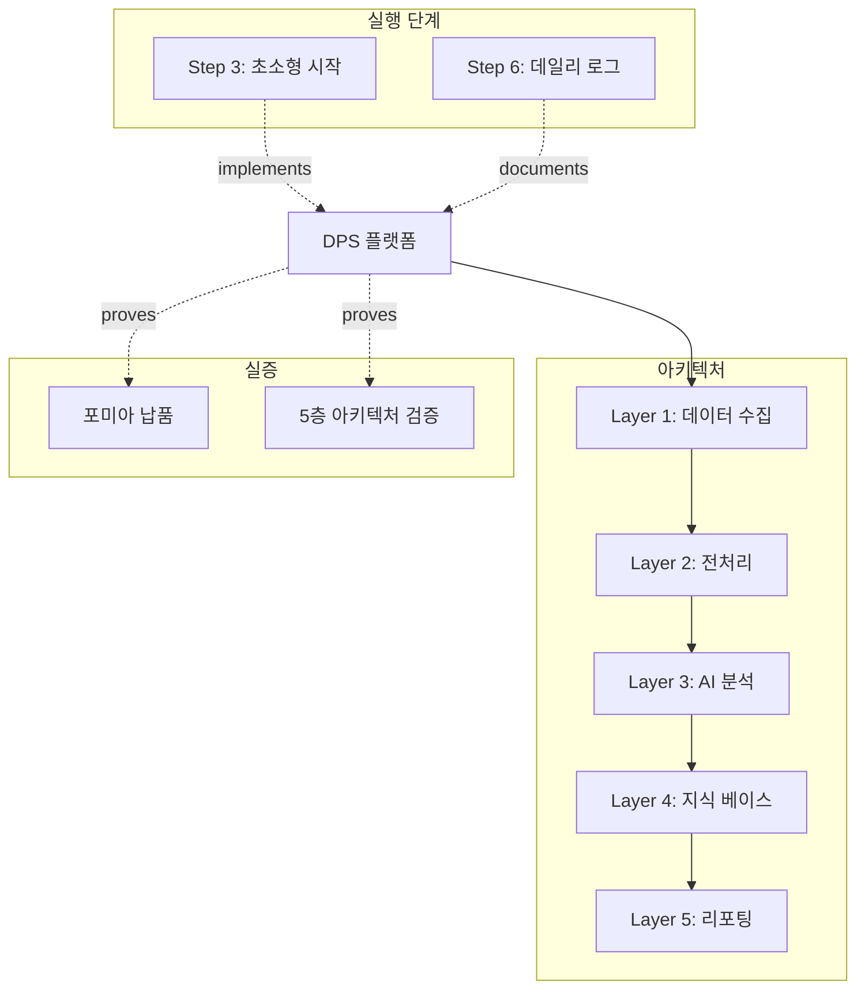
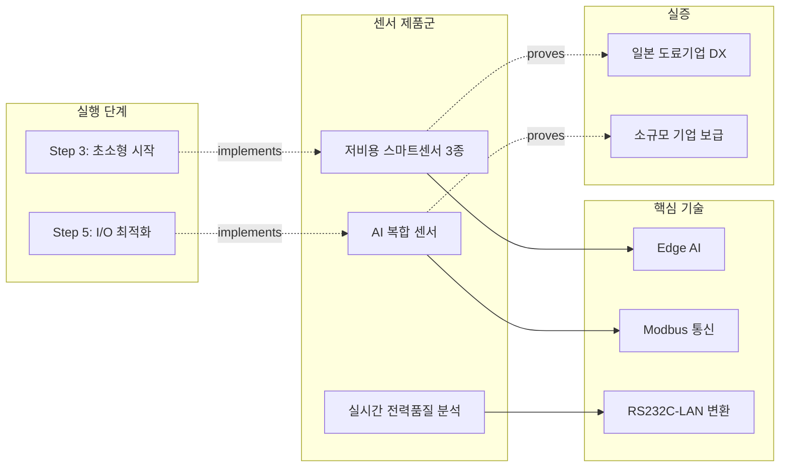
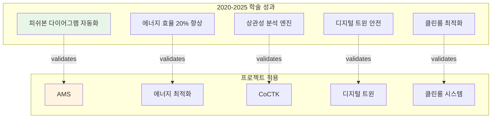
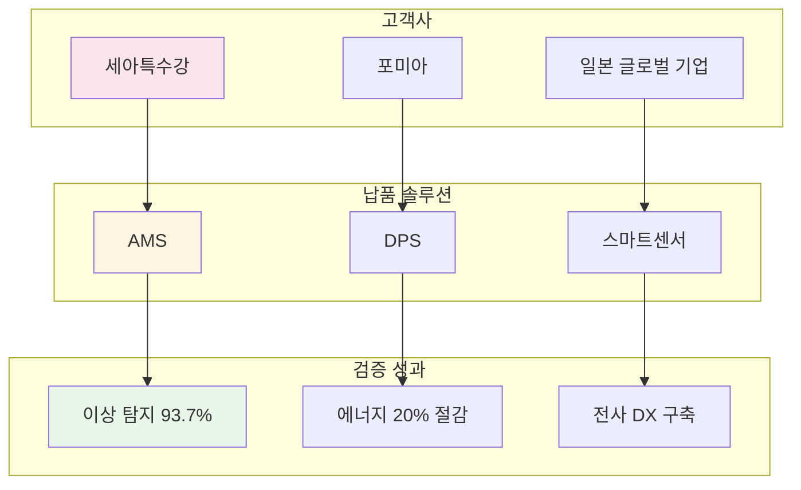
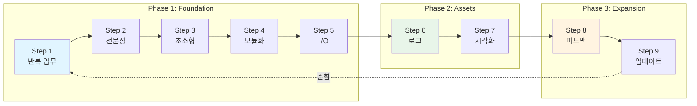
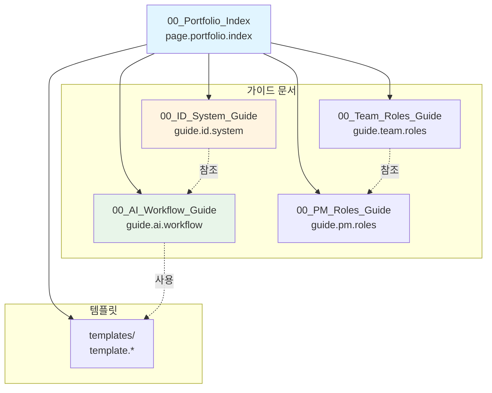

# 포트폴리오 관계 맵 (Portfolio Relationship Map)

**문서 ID**: `page.portfolio.relationship_map`

> [!INFO] 이 문서의 목적
> 13개 프로젝트, 9편 논문, 9단계 실행 가이드, 그리고 실증 사례 간의 관계를 시각화하여 전체 포트폴리오의 구조를 한눈에 파악할 수 있도록 합니다.

---

## 🗺️ 전체 온톨로지 구조



---

## 🔗 프로젝트별 상세 관계

### 1️⃣ AMS (Anomaly Management System)



**관련 문서**:
- [[Phase_1_Foundation/Step_01_Repetitive_Work|Step 1: 반복 업무 식별]]
- [[Phase_1_Foundation/Step_04_Modularization|Step 4: 모듈화 전략]]
- [[02_Projects_Overview#AMS|AMS 프로젝트 개요]]
- [[04_Academic_Publications#피쉬본|피쉬본 다이어그램 자동화 논문]]
- [[Testing_Context#세아특수강|세아특수강 실증 사례]]

---

### 2️⃣ DPS (데이터수집시스템)



**관련 문서**:
- [[Architecture_Overview#DPS|DPS 5층 아키텍처]]
- [[Phase_1_Foundation/Step_03_Micro_Starts|Step 3: 초소형 단위 시작]]
- [[Testing_Context#포미아|포미아 실증 사례]]

---

### 3️⃣ 스마트센서 & IoT 생태계



**관련 문서**:
- [[02_Projects_Overview#센서|스마트센서 프로젝트]]
- [[Phase_1_Foundation/Step_03_Micro_Starts|Step 3: 초소형 단위 시작]]

---

## 📚 학술 논문 → 프로젝트 매핑



**관련 문서**:
- [[04_Academic_Publications|학술 논문 전체 목록]]

---

## 🏭 실증 사례 네트워크



**관련 문서**:
- [[Testing_Context|실증 및 검증 사례 전체]]

---

## 🎯 9단계 실행 가이드 흐름



**관련 문서**:
- [[00_Portfolio_Index|포트폴리오 메인 인덱스]]

---

## 🔍 핵심 허브(Hub) 문서

### 진입점(Entry Points)
1. **[[00_Portfolio_Index|포트폴리오 인덱스]]** (`page.portfolio.index`) - 전체 시작점
2. **[[02_Projects_Overview|프로젝트 개요]]** (`page.portfolio.projects`) - 13개 솔루션 허브
3. **[[Architecture_Overview|아키텍처 개요]]** (`page.portfolio.architecture`) - 기술 허브
4. **[[04_Academic_Publications|학술 논문]]** (`page.portfolio.academic`) - 연구 허브

### 가이드 문서
5. **[[00_ID_System_Guide|ID 시스템 가이드]]** (`guide.id.system`) - ID 명명 규칙
6. **[[00_AI_Workflow_Guide|AI 워크플로우 가이드]]** (`guide.ai.workflow`) - AI 문서 참조 전략
7. **[[00_Team_Roles_Guide|팀 역할 가이드]]** (`guide.team.roles`) - 팀 역할 정의
8. **[[00_PM_Roles_Guide|PM 역할 가이드]]** (`guide.pm.roles`) - PM 역할 구분

### 연결도(Degree) 순위
```yaml
최다_연결_문서:
  1. 00_Portfolio_Index.md (20개+ 링크)
  2. 00_Relationship_Map.md (현재 문서)
  3. 02_Projects_Overview.md (13개 링크)
  4. Architecture_Overview.md (10개 링크)
  5. Step_01_Repetitive_Work.md (8개 링크)
```

### 가이드 문서 네트워크


---

## 📊 관계 유형 정의

```yaml
관계_타입:
  implements: "Step → Project (구현 관계)"
  validates: "Project → Paper (학술 검증)"
  proves: "Project → Testing (실증 관계)"
  uses: "Project → Technology (기술 사용)"
  extends: "Step → Next Step (확장 관계)"
  references: "Document ↔ Document (참조)"
  guides: "Guide → Document (가이드 관계)"
  templates: "Template → Document (템플릿 관계)"
```

## 🔗 ID 기반 문서 관계

### ID 시스템 적용

모든 문서는 `type.module.name` 형식의 ID를 가지며, 관계 맵에서 ID를 통해 명확히 추적할 수 있습니다.

**주요 ID 예시**:
- `page.portfolio.index` - 포트폴리오 인덱스
- `guide.id.system` - ID 시스템 가이드
- `guide.ai.workflow` - AI 워크플로우 가이드
- `guide.team.roles` - 팀 역할 가이드
- `guide.pm.roles` - PM 역할 가이드
- `template.project.summary` - 프로젝트 요약 템플릿
- `phase.foundation.step01` - Step 1 문서
- `project.ams` - AMS 프로젝트
- `project.pm_agent` - PM Agent (사업 관리)

**관련 문서**: [[00_ID_System_Guide|ID 시스템 가이드]] (`guide.id.system`)

---

> [!TIP] 옵시디언 그래프 뷰 활용
> 이 문서를 중심으로 옵시디언의 그래프 뷰(Graph View)를 열면 전체 포트폴리오의 지식 네트워크를 시각적으로 탐색할 수 있습니다.
