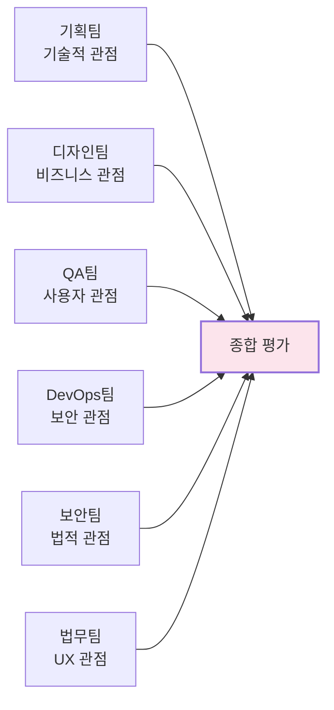

# 팀 역할 가이드

> [!NOTE] 문서 목적
> 포트폴리오 문서를 평가할 때 각 팀의 전문성, 협업 능력, 성과를 평가하기 위한 팀 역할 정의 및 협업 프로세스를 명시합니다.

---

## 팀 역할 개요

포트폴리오 문서는 다양한 관점에서 평가될 수 있으며, 각 팀은 자신의 전문 분야가 아닌 다른 관점에서 평가하여 다각도로 문서의 완성도를 검증합니다.

---

## 팀별 역할 및 평가 관점

### 1. 기획팀 - 기술적 관점 평가

**전문 분야**: 기획, 요구사항 분석  
**평가 관점**: 기술적 실현 가능성, 개발 복잡도, 기술적 리스크

**평가 항목**:
- [ ] 기술 스택이 기능 요구사항에 적합한가?
- [ ] 아키텍처 설계가 현실적인가?
- [ ] 개발 복잡도가 정확히 평가되었는가?
- [ ] 기술적 리스크가 고려되었는가?
- [ ] 유지보수성 고려사항이 있는가?

**관련 문서**:
- [[Architecture_Overview|아키텍처 개요]] (`page.portfolio.architecture`)
- [[Phase_1_Foundation/Step_04_Modularization|모듈화 전략]] (`phase.foundation.step04`)

---

### 2. 디자인팀 - 비즈니스 관점 평가

**전문 분야**: UI/UX 디자인  
**평가 관점**: 비즈니스 가치, 사용자 가치, 시장성

**평가 항목**:
- [ ] 비즈니스 목표가 명확히 명시되었는가?
- [ ] 사용자 가치가 정의되었는가?
- [ ] 경쟁 제품 대비 차별점이 있는가?
- [ ] 기능 우선순위가 비즈니스 가치 기반인가?

**관련 문서**:
- [[Executive_Summary/02_Business_Value|비즈니스 가치]] (`page.portfolio.business_value`)
- [[Executive_Summary/01_Key_Achievements|핵심 성과]] (`page.portfolio.achievements`)

---

### 3. QA팀 - 사용자 관점 평가

**전문 분야**: 품질 보증, 테스트  
**평가 관점**: 사용자 친화성, 접근성, 사용자 경험

**평가 항목**:
- [ ] 사용자 플로우가 직관적인가?
- [ ] 에러 처리가 사용자 친화적인가?
- [ ] 접근성 요구사항이 반영되었는가?
- [ ] 사용자 피드백 수집 방안이 있는가?

**관련 문서**:
- [[Testing_Context|테스트 컨텍스트]] (`page.portfolio.testing`)
- [[Executive_Summary/00_Overview_For_Non_Technical|비전문가용 개요]] (`page.portfolio.overview`)

---

### 4. DevOps팀 - 보안 관점 평가

**전문 분야**: 인프라, 배포, 운영  
**평가 관점**: 보안 요구사항, 모니터링, 인프라 안정성

**평가 항목**:
- [ ] 인증/인가 메커니즘이 명시되었는가?
- [ ] 데이터 암호화 요구사항이 있는가?
- [ ] 보안 취약점 대응 방안이 있는가?
- [ ] 보안 모니터링 방안이 있는가?

**관련 문서**:
- [[Architecture_Overview|아키텍처 개요]] (`page.portfolio.architecture`)
- [[Testing_Context|테스트 컨텍스트]] (`page.portfolio.testing`)

---

### 5. 보안팀 - 법적 관점 평가

**전문 분야**: 보안, 컴플라이언스  
**평가 관점**: 법적 준수, 규제 요구사항, 라이선스

**평가 항목**:
- [ ] 개인정보 보호법 준수 요구사항이 있는가?
- [ ] 데이터 보관 및 삭제 정책이 명시되었는가?
- [ ] 라이선스 요구사항이 명시되었는가?
- [ ] 지적재산권 보호 방안이 있는가?

**관련 문서**:
- [[Executive_Summary/01_Key_Achievements|핵심 성과]] (`page.portfolio.achievements`)
- [[04_Academic_Publications|학술 논문]] (`page.portfolio.academic`)

---

### 6. 법무팀 - 사용자 경험 관점 평가

**전문 분야**: 법무, 계약  
**평가 관점**: 사용자 여정, UI/UX 일관성, 접근성

**평가 항목**:
- [ ] 사용자 여정이 명확히 정의되었는가?
- [ ] UI/UX 일관성이 고려되었는가?
- [ ] 접근성 표준 준수가 고려되었는가?

**관련 문서**:
- [[Executive_Summary/00_Overview_For_Non_Technical|비전문가용 개요]] (`page.portfolio.overview`)
- [[Executive_Summary/04_Visual_Portfolio|시각적 포트폴리오]] (`page.portfolio.visual`)

---

## 협업 프로세스

### 팀 간 협업 워크플로우

### 평가 프로세스

1. **개별 팀 평가**: 각 팀이 자신의 전문 분야가 아닌 다른 관점에서 평가
2. **평가 결과 수집**: 각 팀의 평가 결과를 수집
3. **종합 분석**: 모든 관점을 통합하여 종합 평가
4. **개선 제안**: 다각도 평가 결과를 바탕으로 개선 제안

---

## 평가 기준

### 점수 체계

| 팀 | 평가 관점 | 배점 | 평가 항목 수 |
|----|----------|------|------------|
| 기획팀 | 기술적 관점 | 20점 | 5개 |
| 디자인팀 | 비즈니스 관점 | 20점 | 4개 |
| QA팀 | 사용자 관점 | 20점 | 4개 |
| DevOps팀 | 보안 관점 | 15점 | 4개 |
| 보안팀 | 법적 관점 | 15점 | 4개 |
| 법무팀 | 사용자 경험 관점 | 10점 | 3개 |
| **총합** | | **100점** | **24개** |

---

## 관련 문서

- [[00_PM_Roles_Guide|PM 역할 가이드]] (`guide.pm.roles`)
- [[00_ID_System_Guide|ID 시스템 가이드]] (`guide.id.system`)
- 평가 리포트: `docs/evaluation/results/2025-12-25/05_팀별_평가/Team_Evaluation_Report.md`

---

## ID 참조

- **가이드 ID**: `guide.team.roles`
- **팀 ID**: `team.[name]`
- **평가 ID**: `eval.team.[name]`

---

> [!NOTE] 사용 가이드
> - 각 팀은 자신의 전문 분야가 아닌 다른 관점에서 평가
> - 평가 결과는 종합적으로 분석하여 개선 제안 도출
> - 평가 기준은 평가 프레임워크 문서 참조

