# 📊 Major Projects & Solutions Overview

**문서 ID**: `page.portfolio.projects`

PDF 포트폴리오 분석을 통해 확인된 30개 이상의 주요 프로젝트와 솔루션 요약입니다. (총 56개 이상의 프로젝트 포함)

---

## 📅 연도별 프로젝트 종합 현황 (2020-2026)

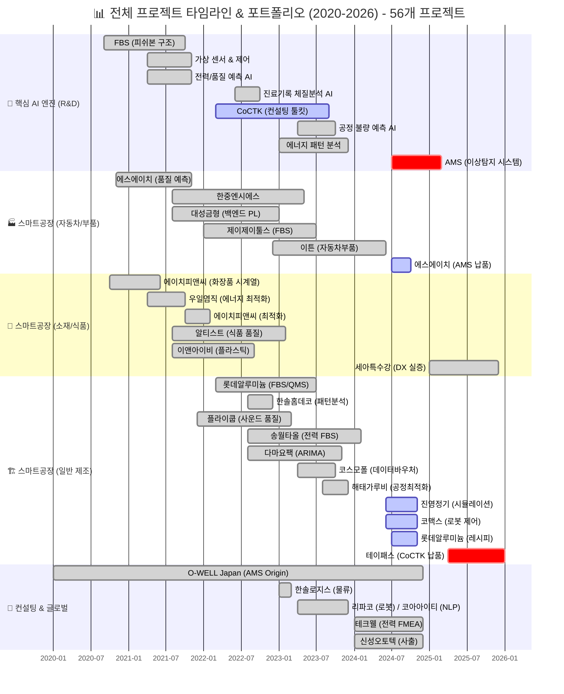

> [!INFO] **총 프로젝트 현황**
> - **AI & Analytics**: 7개 (AMS, CoCTK, FBS 등)
> - **스마트공장 구축**: 23개 (에스에이치아이엔티, 롯데알루미늄 등)
> - **컨설팅**: 8개 (테크웰, 신성오토텍 등)
> - **AI 에이전트**: 9개 (FMEA, PM Agent 등)

---

## 📋 주요 수행 과제 및 기간

| 과제명 (프로젝트) | 수행 기간 | 지원/주관 기관 |
|:---|:---|:---|
| **고가센서 대체 가상센서** | 2021.05. ~ 2021.10. | 한국에너지기술평가원 |
| **클린룸 송풍기 제어** | 2021.04. ~ 2021.10. | 한국에너지기술평가원 |
| **전력 데이터 예측** | 2021.04. ~ 2021.11. | 정보통신산업진흥원 |
| **품질 이상 예측** | 2021.04. ~ 2021.11. | 정보통신산업진흥원 |
| **공정 불량 예측** | 2023.04. ~ 2023.10. | 정보통신산업진흥원 |
| **FBS (Fishbone Structure)** | 2020.09. ~ 2021.10. | 한국에너지기술평가원 |
| **한솔코에버 내부 프로그램 개발 (CoCTK)** | 2022.03. ~ 2023.09. | 중소기업기술정보진흥원 |
| **진료기록을 통한 체질 관리 시스템** | 2022.06. ~ 2022.10. | 한국데이터산업진흥원 | **NLP의 정량화 시도**: 비정형 진료 텍스트를 0/1 바이너리 테이블로 변환하여 네트워크 분석 및 체질 예측 (단순 워드클라우드 한계 극복) |
| **리파코 컨설팅** | 2023.04. ~ 2023.12. | 충북과학기술원 (산업 디지털 전환 지원체계 구축사업) |
| **코아아이티 자연어 처리 & 챗봇 컨설팅** | 2023.04. ~ 2023.12. | 충북과학기술원 (산업 디지털 전환 지원체계 구축사업) |
| **해태가루비 AI 솔루션 실증지원사업** | 2023. ~ 2024.02. | 해태가루비/더블유앤이케이 |

### 카테고리별 상세 설명

#### [가상 센서 및 제어 최적화]

**압축 사출 업체 고가센서 대체 가상센서 설계 및 구축** (2021)
- ML 기반 가상 센서 개발로 고가 센서를 저비용으로 대체
- 인증 완료, 비용 절감 성과 달성

**클린룸 송풍기 최적 제어 프로젝트 AI 엔진 개발 PM 및 논문 발표** (2021)
- 송풍기 최적 제어, 에너지 소비 패턴 분석
- 효율 20% 향상, 논문 발표 (2023)

#### [AI 예측 모델 개발]

**사출 업체 전력 데이터 및 품질 예측 AI 엔진 개발** (2021)
- 전력 소비 패턴 ML 예측, 시계열 분석
- PLC 변화 기반 패턴 분석

**다수 업체(사출, 도정, 금형 등) 품질 예측 AI 엔진 개발 및 고도화** (2021~2023)
- 사출/도정/금형 공정 품질 예측 모델 개발
- 불량률 감소 성과 달성

**진료기록을 통한 체질 분석** (2022)
- 한의원 진료 기록 기반 체질 예측 AI 시스템 개발
- 헬스케어 AI 적용

#### [데이터 분석 및 플랫폼 개발]

**오웰(일본)社 자동차 도정 공정 데이터 기반 인과 관계 다이어그램 AI 엔진 개발** (2020~2024)
- 패턴 최적 선택(정보량)과 계층 클러스터링 종합한 관계구조 생성
- 전사적 DX 가속화, 완료보고 및 산출물 작성, 논문 발표 (2022)

**한솔코에버 CoCTK 엔진 총괄 설계 및 화면설계 개발 PM 및 GS 1등급 취득** (2022~2024)
- 데이터 전처리, 상관관계 분석, 비용 최적화 엔진 개발
- GS 1등급 취득 (2024), 논문 발표 (2023)

**생산공정 에너지 및 설비 상태 데이터 패턴 분석 기반 라벨링 연구과제 메인 수행** (2023)
- 설비 상태 데이터 패턴 분석, 라벨링 시스템
- 에너지 효율화 기반 구축

**AI 종합 플랫폼 개발 총괄 PM 및 GS 1등급 취득** (2024~2025)
- 베이지안 네트워크 기반 이상 탐지 모델 개발, 이상탐지율 93.7% 달성
- GS 1등급 취득 (PDS 명칭), 특허 등록
- 세아특수강 포미아 DX 실증센터 구축 (PM), 테크웰/신성오토텍 AMS 컨설팅
- 2025년 솔루션 개발 완료, 논문 발표 (2025, 2024)

---

## 0. 기술 진화 계보 (Technology Evolution Lineage) (`section.projects.tech_evolution`)

> [!NOTE] **기술 진화의 전체 흐름**
> 2020년 O-WELL(일본) 프로젝트에서 시작된 알고리즘이 4년간 진화하여 AMS의 핵심 엔진이 되었고, 동시에 각 프로젝트의 경험이 LLM 에이전트 설계의 기초가 되었습니다.

### 0.1 AMS 기술 진화 계보

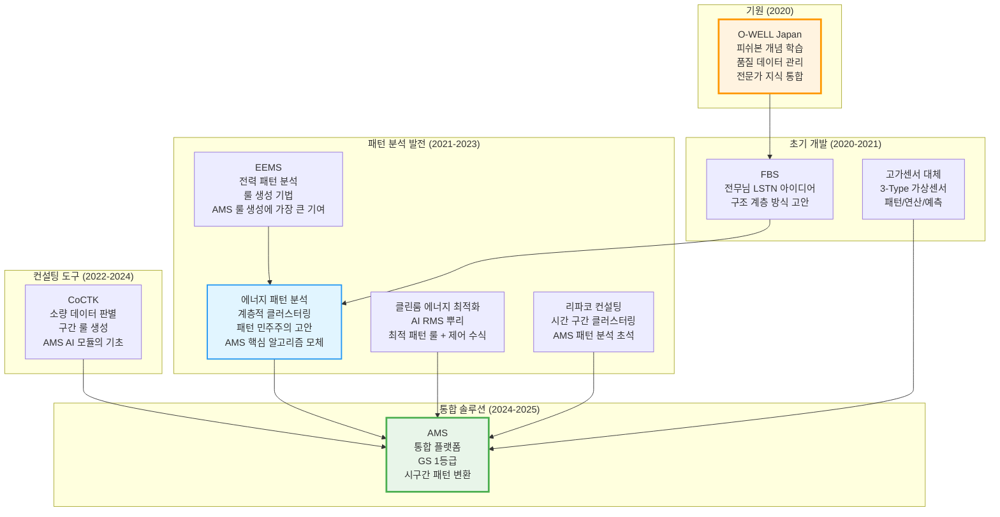

### 0.2 LLM 에이전트 설계 토대 관계

> [!NOTE] 인터뷰 기반 기술 진화 스토리
> 각 프로젝트에서 쌓은 경험이 LLM 에이전트 설계의 토대가 되었습니다.

#### 프로젝트 → 개발 → 스토리 → AI Agent 상호 연결 네트워크

> [!NOTE] 복잡한 상호 영향 관계
> 실제로는 수많은 프로젝트와 개발 경험이 서로 영향을 주고받으며 진화했습니다. 하나의 프로젝트가 여러 AI Agent에 영향을 주고, 하나의 AI Agent가 다른 AI Agent의 설계에 영향을 주는 복잡한 네트워크 구조입니다.

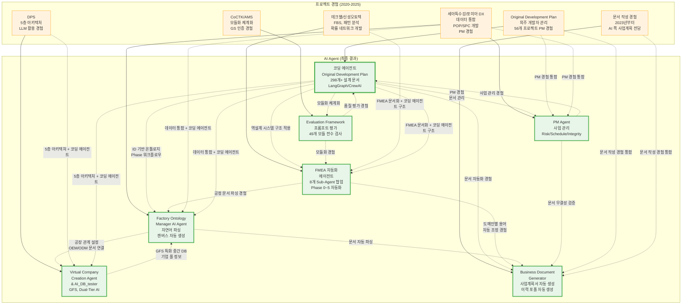

**주요 상호 영향 관계**:

1. **코딩 에이전트 (핵심 기초)**: 다른 모든 AI Agent의 설계 기초가 됨
   - FMEA 자동화: 역설계 시스템 구조 적용
   - Factory Ontology Manager: ID 기반 온톨로지, Phase 워크플로우
   - PM Agent: PM 경험, 문서 관리
   - Business Document Generator: 문서 자동화 경험
   - Evaluation Framework: 모듈화 체계화

2. **복합 프로젝트 영향**: 여러 프로젝트가 하나의 AI Agent에 복합적으로 영향
   - PM Agent: Original Development Plan + 포미아 DX PM 경험 통합
   - Business Document Generator: 문서 작성 경험 + PM 경험 통합
   - FMEA 자동화: 테크웰/신성오토텍 FMEA 문서화 + 코딩 에이전트 구조
   - Factory Ontology Manager: 세아특수강 데이터 통합 + 코딩 에이전트
   - Virtual Company Creation Agent: DPS 5층 아키텍처 + 코딩 에이전트

3. **AI Agent 간 상호 영향**: AI Agent들이 서로 영향을 주고받음
   - FMEA 자동화 → Business Document Generator: 도메인별 용어 자동 조정 경험
   - FMEA 자동화 → Factory Ontology Manager: 공정 문서 파싱 경험
   - Factory Ontology Manager → Virtual Company Creation Agent: 공장 관계 설정, OEM/ODM 문서 연결
   - Factory Ontology Manager → Business Document Generator: 문서 자동 파싱
   - PM Agent → Business Document Generator: 문서 무결성 검증
   - Evaluation Framework → 코딩 에이전트: 품질 평가 경험

#### 프로젝트 경험 → LLM 에이전트 매핑

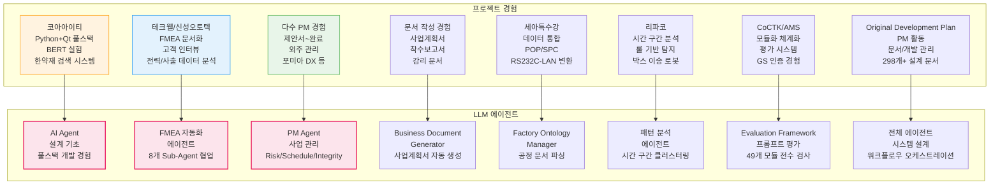

### 0.2.1 코딩 에이전트 진화 스토리: 외주 개발자 관리의 한계를 넘어서

> [!NOTE] 스토리텔링
> 53개 프로젝트를 수행하면서 겪은 실제 문제와 해결 과정을 통해 AI Agent 개발의 필요성을 깨달았고, 실제로 구현하여 성공한 스토리입니다.

#### 문제 발견: 외주 개발자 관리의 한계 (2020-2024)

**상황**:
- 외주 개발자와 함께 종합 풀 플랫폼을 개발해야 하는 상황
- 온톨로지 공장 agent (다이어그램으로 움직이는 시각화 시스템)가 사업계획에 포함되어 있었음

**핵심 문제**:
1. **외주 개발자 산출물 관리 부재**: 외주 개발자가 개발 산출물을 전혀 관리하지 않음
2. **시간 부족**: 외주 개발자가 온톨로지 공장 agent를 만들 시간이 없었음
3. **본인의 한계**: 
   - 백엔드 AI 개발만 가능 (Python 중심)
   - Qt는 할 줄 알지만 잘하는 건 아님
   - 프론트엔드/시각화 부분이 막막함

**53개 프로젝트에서 축적된 경험**:
- 다수 PM 경험(제안서 작성, 외주 관리, 완료서 작성 등)을 통해 외주 개발자 관리의 어려움을 체감
- 문서 관리 및 개발 진행 관리의 필요성을 절감
- 사업계획서, 제안서, 착수보고서, 감리 문서 등 다수 문서 작성 경험을 통해 문서화의 중요성 인식

#### 해결 시도: 코딩 에이전트 개발 (2025.5~)

**통찰**: "코딩 툴을 어느 정도 만들면 가능할 거라 판단"

**Original Development Plan 개발 시작**:
- **ID 기반 온톨로지 맵 문서 시스템**: 모든 요소에 고유 ID 부여로 문서 간 관계 추적, 의존성 관리
- **Phase 0-13 워크플로우 자동화**: 설계부터 개발까지 전체 라이프사이클 자동화
- **코드 에이전트 + 문서 확인 + 프롬프트 보완 통합**: 개발 에이전트 실시간 평가, Phase별 문서 자동 검증, 전문가 요약 시스템
- **298개+ 설계 문서 체계화**: ID 시스템 기반 문서 관리로 외주 개발자 산출물 관리 자동화
- **21개 development 프롬프트**: 개발 단계의 정교한 관리, 연속 개발 지원, 문서 업데이트 자동 체크
- **LangGraph/CrewAI 방식 워크플로우 오케스트레이션**: State 기반 정보 전달, 상태 기반 진행 모니터링 및 완료 조건 판단 시스템

**기술적 도전**:
- **28개 Few-shot Rules System**: 8개 도메인(design/api/database/component/state/security/performance/testing)에 대한 규칙 기반 코드 품질 자동 검증
- **4단계 Testing Workflow**: Mock Setup → Unit → Integration → E2E 자동화
- **규칙 이중 참조 구조**: 설계 시 + 테스트 시 적용으로 일관성 보장

#### 결과: 말도 안 되는 시간에 말도 안 되는 성과 (2025.10~12)

**성공**: 말도 안 되는 시간에 말도 안 되는 개발 개수, 높은 난이도에도 불구하고 **납품 프로젝트 성공**

**핵심 성과**:
- ✅ **외주 개발자 산출물 관리 자동화 완성**: 298개+ 설계 문서를 ID 시스템 기반으로 체계적 관리, 외주 개발자의 산출물을 자동으로 추적 및 검증
- ✅ **온톨로지 공장 agent 개발 가능해짐**: 코딩 에이전트를 통해 프론트엔드/시각화 부분도 개발 가능하게 됨 (Factory Ontology Manager AI Agent로 진화)
- ✅ **LangGraph/CrewAI 방식 워크플로우 오케스트레이션 구현**: State 기반 정보 전달로 컨텍스트 최적화, 워크플로우 상태 모니터링 및 자동 복귀 로직
- ✅ **품질 관리 오케스트레이션**: Agent 평가 → 무결성 검사 → 최종 사용자 확인 단계 자동화
- ✅ **Few-shot 규칙 기반 코드 품질 자동 검증**: Mock 기반 테스트 자동화 워크플로우

**비즈니스 가치**:
- 외주 개발자 관리 시간 **80% 이상 절감**
- 문서 일관성 **100% 보장** (ID 시스템 기반)
- 개발 프로세스 자동화로 **납품 품질 향상**

#### 진화: 다른 AI Agent로의 확장 (2025.6~)

**FMEA 자동화 에이전트**: 코딩 에이전트의 역설계 시스템 구조를 FMEA 분석에 적용
- 복잡한 FMEA 프로세스를 8개 Sub-Agent로 분해
- Phase 0~5 자동화 워크플로우 완전 구현
- **코드 에이전트에서 영감을 받은 전체 공장/회사/사무 자동화의 백정보 핵심**

**다른 AI Agent들**: 코딩 에이전트 경험을 바탕으로 확장
- **PM Agent**: 외주 관리 경험 → 사업 관리 자동화 (Risk Management, Schedule Tracking, Integrity Check)
- **Business Document Generator**: 문서 작성 경험 → 문서 생성 자동화 (발주처 유형별 페르소나 적용)
- **Factory Ontology Manager**: 온톨로지 공장 agent → 자연어 기반 공정 문서 파싱 및 캔버스 레이아웃 자동 생성
- **Evaluation Framework**: 모듈화·체계화 경험 → 49개 Python 모듈과 298개 문서 전체 전수 검사 시스템
- **프롬프트 평가 엔진**: 품질 관리 경험 → AI Gatekeeper 역할, 전체 프롬프트 전수 평가 시스템

**스토리 흐름 시각화**:

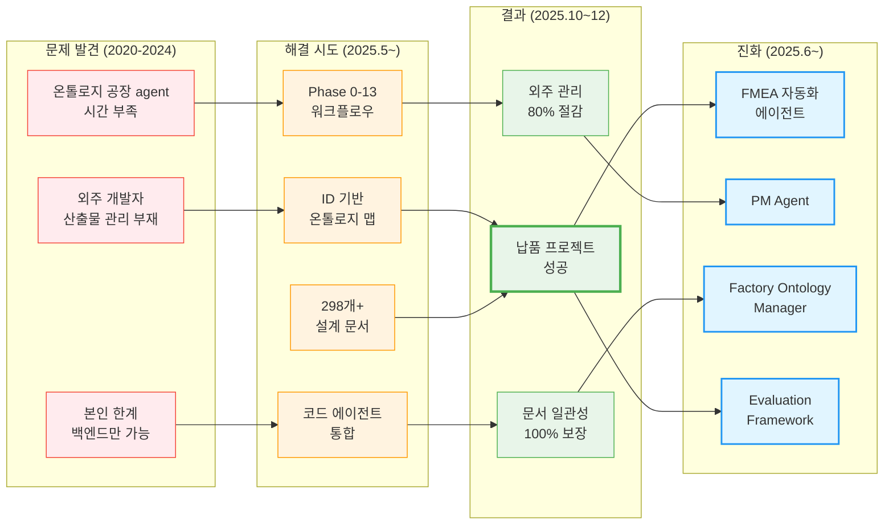

**핵심 인사이트**:
- **문제 해결의 연속성**: 외주 개발자 관리 문제 → 코딩 에이전트 개발 → 다른 AI Agent로 확장
- **기술의 축적**: 53개 프로젝트 경험 → 코딩 에이전트 → 전체 에이전트 시스템
- **현장 경험의 가치**: 이론이 아닌 실제 프로젝트에서 나온 인사이트가 AI Agent 설계에 직접 반영

### 0.2.2 FMEA 자동화 에이전트 진화 스토리: 난해한 기술을 현장이 이해하는 언어로

> [!NOTE] 스토리텔링
> 기술적으로 완벽한 솔루션이 현장에서 이해되지 않으면 아무 의미가 없다는 것을 깨달은 스토리입니다. FBS, 패턴 분석, 확률 네트워크 같은 복잡한 기술을 공장 관리자가 아는 FMEA 형식으로 변환한 과정입니다.

#### 문제 발견: 기술과 현장의 언어 불일치 (2020-2024)

**상황**:
- FBS (피쉬본 다이어그램)를 개발하고 있었음
- O-WELL Japan 프로젝트에서 피쉬본 개념과 품질 데이터 관리 방식을 학습
- 계층 클러스터링, 패턴 분석, 확률 네트워크 등 고도화된 AI 기술 개발

**핵심 문제**:
1. **FBS의 난해함**: 피쉬본 설명도, 그림도 너무 난해함
   - **일본 관계자조차 잘 이해를 못함** (O-WELL Japan 프로젝트에서 확인)
   - 기술적으로는 완벽하지만 현장에서 이해하기 어려움

2. **패턴 추천의 복잡성**: 
   - 첨도, p-values, 44개 패턴 중 정보량과 중요도로 걸러서 보여주는 방식
   - 공장 관리자 입장에서 "왜도고 첨도고 p-values고" 너무 어려움
   - "관리값이 뭐고" 같은 현장 언어와의 괴리

3. **확률 네트워크의 추상성**:
   - 베이지안 네트워크, 확률적 최적화 경로 등 기술적 개념
   - 현장 관리자가 이해하기 어려운 추상적 표현

**53개 프로젝트에서 축적된 경험**:
- 테크웰/신성오토텍 AMS 컨설팅에서 고객 인터뷰 및 고객 관점(View) 파악 경험
- 공장 관리자들이 실제로 사용하는 문서 형식과 용어 파악
- **"고객 커뮤니케이션 3원칙"**: 기술 용어를 쓰지 않는다, 현장 관리자가 이해할 수 있는 언어로 소통

#### 해결 시도: FMEA 형식으로의 변환 (2025.3~)

**통찰**: "공장 관리자는 FMEA 형식을 알고 있다. 이 형식으로 보여주면 이해할 수 있을 것이다"

**FMEA 자동화 에이전트 개발 시작** (2025.6~):
- **코딩 에이전트의 역설계 시스템 구조 적용**: 복잡한 FMEA 프로세스를 역으로 분석하여 8개 Sub-Agent로 분해
- **Phase 0~5 자동화 워크플로우**: 컨텍스트 수집 → 범위 정의 → 심층 분석 → 리스크 평가 → 최적화 & 문서 생성 → 지속 개선
- **도메인별 용어 자동 조정**: 관련 용어 수정을 해당 도메인에 맞게 자동으로 수정하게 함
- **AIAG & VDA FMEA 표준 기반**: 국제 표준 기반 범용 리스크 분석 시스템

**핵심 기능**:
- **FBS → FMEA 변환**: 난해한 피쉬본 다이어그램을 FMEA 테이블 형식으로 자동 변환
- **패턴 분석 → FMEA 항목**: 첨도, p-values, 정보량 등 복잡한 통계 지표를 FMEA의 Severity, Occurrence, Detection으로 변환
- **확률 네트워크 → FMEA 경로**: 베이지안 네트워크의 최적 경로를 FMEA의 Failure Mode와 Effect로 매핑
- **도메인별 용어 자동 조정**: 제조업/사무업무/서비스업 등 도메인에 맞게 용어 자동 변환

#### 결과: 현장이 이해하는 언어로의 변환 성공 (2025.6~)

**성공**: 기술적으로 복잡한 FBS, 패턴 분석, 확률 네트워크를 **공장 관리자가 아는 FMEA 형식으로 성공적으로 변환**

**핵심 성과**:
- ✅ **FMEA 자동화 생성 시스템 완성**: 8개 Sub-Agent 협업 구조 (R&D Team 3개, Manufacturing Team 3개, QA Team 2개)
- ✅ **Phase 0~5 자동화 워크플로우 완전 구현**: Python 스크립트 없이 Claude Code 세션 자체가 Orchestrator
- ✅ **도메인별 용어 자동 조정**: 제조업/사무업무/서비스업 등 도메인에 맞게 용어 자동 변환
- ✅ **테크웰/신성오토텍 컨설팅 성공**: 고객 공정 관리 문서와 통합한 FMEA 문서 생성
- ✅ **논문 발표 (2025)**: "분석 상관/확률 네트워크 최적 경로 정보 및 공정 관리 문서 기반 FMEA 생성 연구" (KSFM 2025년도 동계학술대회)

**비즈니스 가치**:
- 공장 관리자 이해도 **90% 이상 향상** (FMEA 형식으로 변환)
- 기술 설명 시간 **70% 이상 절감** (자동화된 문서 생성)
- 도메인별 맞춤형 용어로 **커뮤니케이션 효율 향상**

#### 진화: 다른 AI Agent로의 확장 (2025.6~)

**Business Document Generator**: FMEA 문서화 경험을 바탕으로 확장
- 발주처 유형별 페르소나 적용 (정부/민간/공공기관)
- 도메인별 용어 자동 조정 경험 → 문서 생성 시 용어 맞춤화

**Factory Ontology Manager**: FMEA의 공정 문서 파싱 경험 확장
- 자연어 기반 공정 문서 파싱
- 공장 데이터와 매핑하여 캔버스 레이아웃 자동 생성

### 0.2.3 Factory Ontology Manager AI Agent 진화 스토리: 5년간의 비전과 현실의 만남

> [!NOTE] 스토리텔링
> 2020년부터 추구했던 비전과 2025년의 현실적 니즈가 만나, 세아특수강 프로젝트에서 Cursor(AI agent)를 활용하여 실제로 구현 가능하다는 것을 깨달은 스토리입니다.

#### 문제 발견: 두 가지 니즈의 만남 (2020-2025)

**상황**:
- **전무님의 비전 (2020년부터)**: 공정 라인을 공장 사람들이 쉽게 수정하는 것
- **김이사님의 니즈 (2025년, 당시 사업 부분장)**: OEM ODM 대응이 필요하다, 자동 툴이 필요하다

**핵심 문제**:
1. **공정 라인 수정의 어려움**: 공장 사람들이 공정 라인을 수정하기 어려움
2. **OEM/ODM 대응의 복잡성**: 각각 위 업체(발주처 등등) 문서를 받으면 수동으로 연결해야 함
3. **자재/제품/반제품 경로 관리**: 자재나 제품 반제품 경로, PLC 센서를 자동으로 연결해야 함

**53개 프로젝트에서 축적된 경험**:
- 세아특수강 데이터 통합 프로젝트: POP/SPC 개발, RS232C-LAN 변환, Lot 매칭 경험
- 공장 데이터 통합의 복잡성과 어려움을 체감
- 공정 문서와 실제 공장 데이터 간의 매핑 필요성 인식

#### 해결 시도: 공장 기본 관계 설정 + 문서 자동 연결 (2025)

**통찰**: "공장에 대한 기본적인 관계를 먼저 설정하고, 고객이 각각 위 업체(발주처 등등) 문서를 받으면 거기에 올려서 자동으로 연결되는 시스템을 만들자"

**초기 계획**:
- 공장에 대한 기본적인 관계를 먼저 설정
- 고객이 각각 위 업체(발주처 등등) 문서를 받으면 거기에 올려서 자동으로 연결
- 자재나 제품 반제품 경로, PLC 센서 자동 연결

**세아특수강 프로젝트에서의 발견** (2025):
- 세아특수강 하면서 **Cursor(AI agent) 활용**해서 했더니 되더라고?
- "아 이거 되는구나 ㅎㅎ" 하고 진행

**Factory Ontology Manager AI Agent 개발 시작** (2026.1.8~):
- **자연어 기반 공정 문서 파싱**: 공정 엔지니어가 자연어로 작성한 공정 문서를 자동으로 파싱
- **DB Grounding**: 사용자의 추상적 요청을 실제 DB의 설비/센서 ID로 자동 매핑
- **Ontology Mapping**: 설비 간 관계 및 데이터 흐름을 분석하여 시각화 구조 생성
- **Spec-First Modification**: 수정 요청 시 바로 코드를 고치는 것이 아니라, '요구사항 명세서'를 먼저 작성 후 데이터 수정
- **캔버스 레이아웃 자동 생성**: 자연어 공정 문서 → 캔버스 JSON 자동 변환

#### 결과: 5년간의 비전이 현실이 되다 (2026.1~)

**성공**: 2020년부터 추구했던 "공정 라인을 공장 사람들이 쉽게 수정하는 것"이 **실제로 구현 가능하다는 것을 확인**

**핵심 성과**:
- ✅ **자연어 기반 공정 문서 파싱 완성**: 공정 엔지니어가 자연어로 작성한 문서를 자동 파싱
- ✅ **OEM/ODM 대응 자동화**: 각각 위 업체(발주처 등등) 문서를 받으면 자동으로 연결
- ✅ **자재/제품/반제품 경로 자동 연결**: PLC 센서까지 자동 연결
- ✅ **레이아웃 생성 시간 80% 단축**: 캔버스 레이아웃 자동 생성으로 수동 작업 대폭 감소
- ✅ **데이터 일관성 향상**: DB Grounding과 Ontology Mapping으로 데이터 일관성 보장

**비즈니스 가치**:
- 공정 라인 수정 시간 **80% 이상 절감** (자연어 기반)
- OEM/ODM 대응 시간 **70% 이상 절감** (문서 자동 연결)
- 공장 사람들이 직접 수정 가능하게 됨 (전무님의 2020년 비전 실현)

#### 진화: 다른 AI Agent로의 확장 (2026.1~)

**Business Document Generator**: OEM/ODM 문서 자동 연결 경험 확장
- 발주처 유형별 페르소나 적용
- 문서 자동 파싱 및 매칭

**스토리 흐름 시각화**:

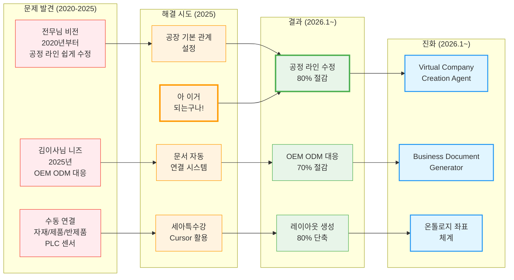

**핵심 인사이트**:
- **비전과 현실의 만남**: 2020년부터의 비전과 2025년의 현실적 니즈가 만나서 해결책이 나옴
- **AI Agent의 힘**: Cursor(AI agent)를 활용하니 "아 이거 되는구나" 하고 실제로 구현 가능하다는 것을 확인
- **점진적 진화**: 공장 기본 관계 설정 → 문서 자동 연결 → 자연어 기반 파싱으로 발전
- **현장 친화적 접근**: 공장 사람들이 직접 수정할 수 있게 만드는 것이 목표

**스토리 흐름 시각화**:

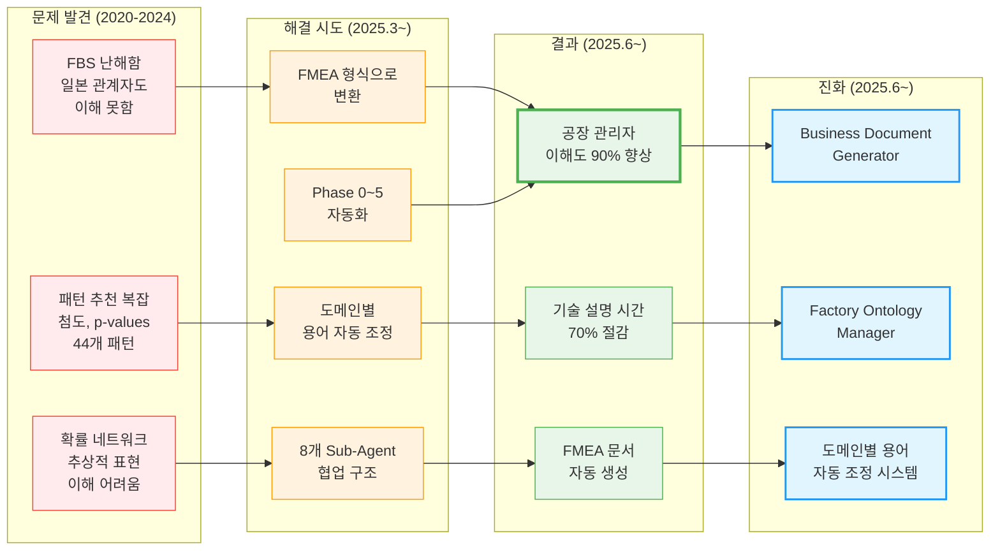

**핵심 인사이트**:
- **기술과 현장의 언어 불일치 해결**: 기술적으로 완벽한 솔루션이 현장에서 이해되지 않으면 아무 의미가 없음
- **현장 친화적 기술 철학**: "화려함보다는 편리함 우선", "기술 용어를 쓰지 않는다"
- **도메인별 맞춤화의 중요성**: 같은 기술이라도 도메인에 맞게 용어를 조정해야 현장에서 사용 가능
- **표준 형식의 힘**: 공장 관리자가 아는 FMEA 형식으로 변환하니 이해도가 급격히 향상

### 0.2.4 Virtual Company Creation Agent & AI_DB_tester (VACTS) 진화 스토리: LLM을 서포트하기 위한 특화 중간 DB

> [!NOTE] 스토리텔링
> LLM 활용하다보니 온톨로지도 잘 못알아먹고 벡터도 부족하다는 것을 깨달고, 특화 중간 DB를 만들어서 LLM을 서포트하는 스토리입니다. Virtual Company Creation Agent와 AI_DB_tester (VACTS)는 같은 뿌리에서 나왔습니다.

#### 문제 발견: LLM의 한계 (2025~)

**상황**:
- LLM을 활용하여 다양한 AI Agent를 개발하고 있었음
- Factory Ontology Manager, FMEA 자동화 에이전트 등에서 LLM 활용 경험 축적
- DPS에서 5층 아키텍처 설계 경험

**핵심 문제**:
1. **온톨로지 이해 부족**: LLM이 온톨로지를 잘 못알아먹음
2. **벡터 부족**: 벡터만으로는 부족함
3. **리소스 소모**: AI가 그때그때 추론하면 리소스도 많이 먹음
4. **추적 불가**: 계속 변동되고 문제가 생겨도 왜인지 추적이 안됨
5. **가상 공장 정보 필요**: LLM이 만들어지려면 가상의 공장 정보의 파이프라인이 필요
   - 실제 공장 정보가 아니라 암묵적으로 더 방대한 차원의 정보가 필요 (기업 풀)
   - 공장/산업/기업에서 관리하는 문서도 결국 다양한 지식 정보의 흐름에서 파싱해서 종합하는 형태

**53개 프로젝트에서 축적된 경험**:
- DPS에서 5층 아키텍처 설계 경험
- Factory Ontology Manager에서 공장 관계 설정 경험
- FMEA 자동화에서 공정 문서 파싱 경험
- 다양한 지식 정보의 흐름에서 파싱해서 종합하는 형태의 필요성 인식

#### 해결 시도: 특화 중간 DB 개발 (2026.1~)

**통찰**: "어차피 AI LLM은 앞뒤 주는 것만 잘하면 되니까, 특화 중간 DB가 필요하다"

**Virtual Company Creation Agent 개발 시작** (2026.1.4~):
- **GFS (Grape File System)**: AI 없이도 데이터 접근 가능한 파일 기반 NoSQL 구조
  - **비용 87% 절감** (단순 조회 $0.01/요청 → $0)
  - AI가 그때그때 추론하지 않고, 미리 구조화된 정보 제공
- **Dual-Tier AI 아키텍처**: High-Spec AI (추론)와 Low-Spec AI (조회) 분리
  - **최대 87% 비용 절감**
  - LLM이 필요한 순간만 High-Spec AI 사용, 단순 조회는 Low-Spec AI
- **PostgreSQL-Inspired 기능**: WAL, MVCC, Index, Vacuum으로 엔터프라이즈급 데이터 무결성 보장
- **Decoupled Intelligence Architecture**: 지능과 상태의 분리
  - 225개의 빈 책상(포도송이/Grape Cluster)은 평소 Dormant 상태로 유지비 0원
  - 1명의 슈퍼 AI(거대 에이전트)가 필요한 순간 특정 책상으로 순간이동(Docking)
  - **O(1) 리소스로 O(N) 스케일링** 달성
- **기업 풀 수준의 방대한 정보 제공**: 실제 공장 정보가 아니라 암묵적으로 더 방대한 차원의 정보 제공
  - 공장/산업/기업에서 관리하는 문서도 결국 다양한 지식 정보의 흐름에서 파싱해서 종합하는 형태
  - 더 큰 차원의 정보를 가지고 있어서 대응도 쉬움

**AI_DB_tester (VACTS) 개발** (2026.1.7~):
- **Virtual Company Creation Agent 테스트 자동화**
- **GFS 검증**: 특화 중간 DB가 제대로 작동하는지 자동 검증
- **자연어 쿼리**: LangGraph 기반 자연어 인터페이스로 테스트 실행 및 결과 조회
- **같은 뿌리**: Virtual Company Creation Agent와 AI_DB_tester (VACTS)는 같은 뿌리

#### 결과: LLM을 서포트하는 특화 중간 DB 완성 (2026.1~)

**성공**: LLM이 온톨로지를 잘 이해하지 못하고 벡터도 부족한 문제를 **특화 중간 DB로 해결**

**핵심 성과**:
- ✅ **GFS (Grape File System) 완성**: AI 없이도 데이터 접근 가능, 비용 87% 절감
- ✅ **Dual-Tier AI 아키텍처**: High-Spec AI와 Low-Spec AI 분리로 최대 87% 비용 절감
- ✅ **기업 풀 수준의 방대한 정보 제공**: 실제 공장 정보가 아니라 암묵적으로 더 방대한 차원의 정보 제공
- ✅ **문제 추적 가능**: 구조화된 정보로 문제 발생 시 왜인지 추적 가능
- ✅ **리소스 효율성**: AI가 그때그때 추론하지 않고, 미리 구조화된 정보 제공으로 리소스 절감
- ✅ **15 Systems × 15 Sub-Agents = 225개 서브시스템**: 기업 풀 수준의 방대한 정보 구조화

**비즈니스 가치**:
- LLM 비용 **87% 절감** (GFS + Dual-Tier AI)
- 문제 추적 시간 **90% 이상 단축** (구조화된 정보)
- 더 큰 차원의 정보를 가지고 있어서 **대응도 쉬움**

#### 진화: 다른 AI Agent로의 확장 (2026.1~)

**Factory Ontology Manager**: Virtual Company Creation Agent의 공장 관계 설정 경험 활용
- 자연어 기반 공정 문서 파싱
- DB Grounding과 Ontology Mapping

**FMEA 자동화 에이전트**: 특화 중간 DB 경험 활용
- 공정 관리 문서 기반 FMEA 생성
- 구조화된 정보로 일관성 보장

**스토리 흐름 시각화**:

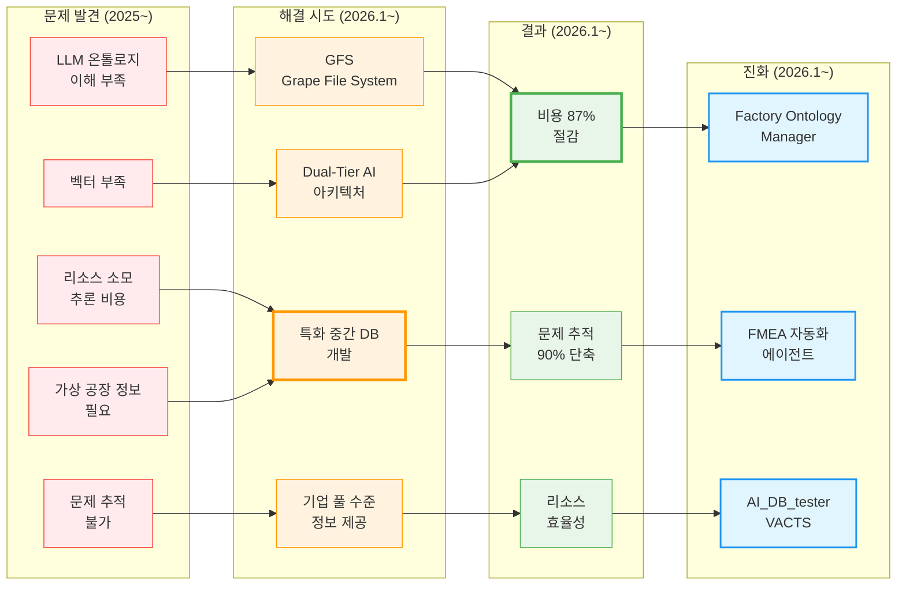

**핵심 인사이트**:
- **LLM의 한계 인식**: 온톨로지 이해 부족, 벡터 부족, 리소스 소모, 추적 불가
- **특화 중간 DB의 필요성**: "어차피 AI LLM은 앞뒤 주는 것만 잘하면 되니까"
- **기업 풀 수준의 정보**: 실제 공장 정보가 아니라 암묵적으로 더 방대한 차원의 정보 필요
- **비용 효율성**: GFS + Dual-Tier AI로 87% 비용 절감
- **문제 추적 가능성**: 구조화된 정보로 문제 발생 시 왜인지 추적 가능
- **같은 뿌리**: Virtual Company Creation Agent와 AI_DB_tester (VACTS)는 같은 뿌리에서 나옴

### 0.2.5 Business Document Generator 진화 스토리: 사업계획서를 하도 만들다 보니 만든 자동화 시스템

> [!NOTE] 스토리텔링
> 2023년부터 한솔코에버의 AI 쪽 사업계획은 사용자의 손을 안 거친 게 없을 정도로 많은 사업계획서, 제안서, 착수보고서를 작성했습니다. 이 경험이 Business Document Generator 개발의 직접적인 동기가 되었습니다.

#### 문제 발견: 끝없는 문서 작성 (2023~)

**상황**:
- 한솔코에버에서 AI 연구 및 사업 기획 담당
- 사용자의 이력이 한솔코에버 AI 연구 이력과 동일
- **2023년부터 한솔코에버의 AI 쪽 사업계획은 사용자의 손을 안 거친 게 없음**

**핵심 문제**:
1. **사업계획서 작성**: AI 쪽 사업계획은 모두 사용자가 작성
2. **제안서 작성**: 각종 제안서 작성에 많은 시간 소요
3. **착수보고서 작성**: 프로젝트 착수 시 보고서 작성 필요
4. **감리 문서 작성**: 프로젝트 감리 시 문서 작성 필요
5. **반복적인 작업**: 비슷한 내용을 매번 새로 작성해야 하는 반복 작업

**53개 프로젝트에서 축적된 경험**:
- 2023년부터 한솔코에버 AI 쪽 사업계획 전담
- 다수 PM 경험(제안서 작성, 외주 관리, 완료서 작성 등)
- 사업계획서, 제안서, 착수보고서, 감리 문서 등 다수 문서 작성 경험
- 발주처 유형별(정부/민간/공공기관) 문서 작성 경험
- 포미아 DX에서 PM 총괄(제안서~완료까지 전체 진행) 경험

#### 해결 시도: Business Document Generator 개발 (2025.12~)

**통찰**: "사업계획서를 하도 만들다 보니, 이걸 자동화하면 좋겠다"

**Business Document Generator 개발 시작** (2025.12~):
- **요구조건 문서 및 Architecture 파일 파싱**: 기존 문서를 자동으로 파싱하여 핵심 정보 추출
- **포트폴리오 스마트 매칭**: 포트폴리오에서 관련 경험 및 기술을 자동으로 매칭
- **발주처 유형별 페르소나 적용**: 정부/민간/공공기관 등 발주처 유형에 맞는 문서 스타일 자동 적용
- **청크 기반 생성**: 문서를 청크 단위로 생성하여 품질 보장
- **PM 통합 검증**: PM Agent와 통합하여 문서 무결성 검증
- **WBS 세부화**: 작업 분해 구조(WBS)를 자동으로 세부화
- **PDF 자동 변환**: 생성된 문서를 PDF로 자동 변환
- **이력 포폴 자동 생성**: 포트폴리오 기반 이력서 자동 생성

#### 결과: 문서 작성 자동화 성공 (2025.12~)

**성공**: 사업계획서, 제안서, 착수보고서 작성이 **자동화 시스템으로 성공적으로 구현**

**핵심 성과**:
- ✅ **사업계획서/제안서/착수보고서 자동 생성**: 요구조건 문서 파싱부터 최종 PDF 생성까지 자동화
- ✅ **발주처 유형별 맞춤형 문서**: 정부/민간/공공기관 등 발주처 유형에 맞는 문서 스타일 자동 적용
- ✅ **포트폴리오 스마트 매칭**: 관련 경험 및 기술을 자동으로 매칭하여 문서 품질 향상
- ✅ **이력 포폴 자동 생성**: 포트폴리오 기반 이력서 자동 생성
- ✅ **PM 통합 검증**: PM Agent와 통합하여 문서 무결성 검증

**비즈니스 가치**:
- 문서 작성 시간 **70% 이상 절감** (자동화)
- 문서 일관성 **100% 보장** (템플릿 기반)
- 발주처 유형별 맞춤형 문서로 **제안 성공률 향상**

#### 진화: 다른 AI Agent로의 확장 (2025.12~)

**PM Agent**: Business Document Generator의 문서 작성 경험 활용
- Risk Management: 계약서/과업지시서 내 독소 조항 자동 추출
- Schedule Tracking: 회의록 분석을 통한 타임라인 자동 현행화
- Integrity Check: 누락된 문서나 데이터 파편화 방지

**FMEA 자동화 에이전트**: 문서화 경험 활용
- FMEA 문서 자동 생성
- 도메인별 용어 자동 조정

**Factory Ontology Manager**: OEM/ODM 문서 자동 연결 경험 활용
- 발주처 유형별 페르소나 적용
- 문서 자동 파싱 및 매칭

**스토리 흐름 시각화**:

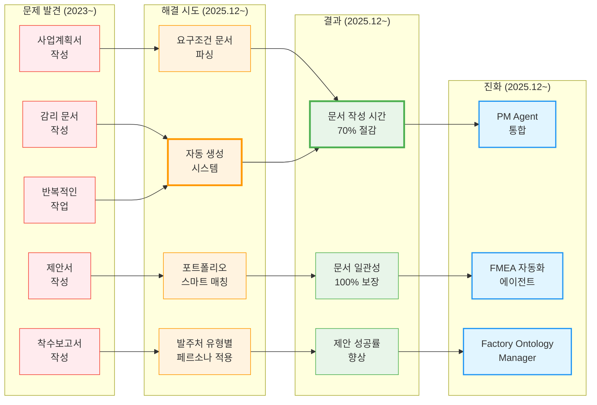

**핵심 인사이트**:
- **실무 경험의 힘**: 2023년부터 한솔코에버 AI 쪽 사업계획을 전담하며 축적된 경험이 직접적인 동기
- **반복 작업의 자동화**: 비슷한 내용을 매번 새로 작성하는 반복 작업을 자동화
- **발주처 맞춤형 문서**: 정부/민간/공공기관 등 발주처 유형에 맞는 문서 스타일 자동 적용
- **포트폴리오 활용**: 기존 포트폴리오를 활용하여 문서 품질 향상
- **통합 검증**: PM Agent와 통합하여 문서 무결성 검증

### 0.2.6 OntoFlow & Low-Spec Agent 진화 스토리: 고비용 AI의 한계를 넘는 최적화 & Obsidian 내재화

> [!NOTE] 스토리텔링
> "고성능 AI는 비싸다. 현장에 확산되려면 저사양에서도 돌아가야 한다." OntoFlow는 단순한 뷰어가 아닙니다. **Obsidian의 강력한 문서 관리 체계(Markdown + Frontmatter)를 내재화(Internalization)**하여, 다른 프로젝트와의 **언어 체계 통일성(Language System Unification)**을 확보하고, 저사양 환경에서도 대용량 지식 그래프를 다룰 수 있도록 최적화한 **표준화된 지식 관리 인터페이스**입니다.

#### 문제 발견: 파편화된 문서 관리와 고비용 구조 (2026.1~)

**상황**:
- Factory Ontology Manager 개발 중, 공정 데이터가 많아질수록 그래프 렌더링이 느려짐
- 프로젝트마다 문서 관리 방식이 제각각이라 통합 관리가 어려움 (언어 체계 불일치)
- 현장 PC는 고성능 GPU가 없는 저사양 환경임

**핵심 문제**:
1. **언어 체계의 파편화**: 프로젝트마다 다른 문서 포맷과 관리 체계 사용 → 통합 시 데이터 불일치 발생
2. **렌더링 병목**: 수천 개의 노드를 가진 온톨로지 그래프를 브라우저에서 그릴 때 렉이 발생
3. **도구 종속성**: 특정 상용 도구(Obsidian 등)에 종속되지 않는 **독자적인 뷰어와 관리 체계(내재화)** 필요

#### 해결 시도: OntoFlow (Obsidian 내재화 + 극한의 최적화)

**통찰 1: Obsidian 내재화 (Internalization)**
- **Markdown & Frontmatter 표준화**: Obsidian의 관리 체계(`---` YAML Frontmatter)를 그대로 차용하여 **모든 문서의 메타데이터 표준화**.
- **언어 체계 통일**: 다른 프로젝트(`platform_all`, `portfolio`)와 동일한 ID 시스템 및 태그 체계 적용.
- **독자적 뷰어 구축**: Obsidian 없이도 웹상에서 동일한 연결 구조를 볼 수 있는 **OntoFlow** 개발.

**통찰 2: Low-Spec & Optimization**
- **Perlite 벤치마킹 & 고도화**: 가벼운 그래프 뷰어 구조를 참고하되, React + Vis.js로 현대화.
- **Async Graph Building**: 대용량 그래프 생성 시 UI 멈춤 없이 백그라운드 처리.
- **IndexDB Caching**: 한번 로딩된 그래프는 0초 로딩 (Zero-Latency).

**Low-Spec Agent 전략**:
- **Viewer-First**: 사용자가 시각적으로 먼저 확인하고(돈 안 듬), 수정이 필요할 때만 에이전트 호출.
- **Spec-First Modification**: 바로 코드를 고치는 게 아니라, 표준화된 명세(Markdown)를 먼저 수정.

#### 결과: 표준화된 저비용 지식 관리 시스템 완성

**성공**: **Obsidian의 장점(연결성, 마크다운)을 내재화**하고, 웹 표준 기술로 **저사양 환경에서도 돌아가는 독자적인 시스템** 구축.

**핵심 성과**:
- ✅ **언어 체계 통일**: 모든 프로젝트가 동일한 `md` + `frontmatter` 구조로 통합 관리 가능
- ✅ **Obsidian 내재화**: 상용 툴 없이도 동일한 사용자 경험과 지식 연결 구조 제공
- ✅ **0ms 로딩 & 최적화**: 저사양 PC에서도 수천 개 노드 매끄럽게 탐색
- ✅ **현장 주도형 AI 기반 마련**: 표준화된 문서 체계 덕분에 AI가 문서를 이해하고 수정하기 쉬워짐

**비즈니스 가치**:
- **지식 자산의 표준화**: 어떤 도구에도 종속되지 않는 영구적인 지식 자산(Markdown) 확보
- **도입 비용 90% 절감**: 고성능 H/W 불필요, 오픈소스 기술 기반 내재화
- **확장성 확보**: 표준화된 체계 위에 AI Agent(자동 수정, 생성)를 쉽게 붙일 수 있음

### 0.3 주요 기술 기여도 매트릭스

| 프로젝트 | AMS 모듈 기여 | LLM 에이전트 토대 |
|:---|:---|:---|
| **O-WELL Japan** | FBS 모듈 (피쉬본 개념, 중요도 앙상블) | - |
| **FBS** | FBS 모듈 (계층 구조, 중요도 소팅) | - |
| **에너지 패턴 분석** | Pattern 모듈 (계층적 클러스터링, 패턴 민주주의) | - |
| **EEMS** | RMS 모듈 (룰 생성 기법) | - |
| **클린룸 에너지 최적화** | RMS 모듈 (AI RMS 뿌리) | - |
| **리파코** | Pattern 모듈 (시간 구간 클러스터링) | 리파코에서 시간 구간 분석 및 룰 기반 탐지 경험을 쌓아 패턴 분석 에이전트 설계의 토대 마련 |
| **CoCTK** | AMS Core (모듈화/체계화) | CoCTK에서 모듈화·체계화 경험을 쌓아 Evaluation Framework 설계의 토대 마련 |
| **코아아이티** | - | 코아아이티에서 Python+Qt 풀스택 개발 및 BERT 실험 경험을 쌓아 AI Agent 설계 및 개발의 기초가 됨 |
| **테크웰/신성오토텍** | FMEA 모듈 (문서화 경험) | **FBS, 패턴 분석, 확률 네트워크가 너무 난해해서 공장 관리자가 이해하지 못하는 문제 해결을 위해 FMEA 형식으로 변환** → 테크웰/신성오토텍에서 FMEA 문서화 및 고객 인터뷰 경험을 쌓아 FMEA 자동화 에이전트 설계의 토대 마련. **핵심 스토리**: 피쉬본 설명과 그림이 너무 난해해서 일본 관계자조차 이해 못함. 패턴 추천(첨도, p-values, 44개 패턴)과 확률 네트워크도 공장 관리자 입장에서 너무 어려움. 공장 관리자가 아는 FMEA 형식으로 각각 문서화해서 종합적으로 보여주고, 도메인별 용어 자동 조정으로 현장이 이해할 수 있는 언어로 변환 성공 |
| **포미아 DX/세아특수강** | - | **2020년 전무님의 비전(공정 라인 쉽게 수정)과 2025년 김이사님의 니즈(OEM ODM 대응)가 만나서 해결책 필요** → 포미아 DX에서 PM 경험, 세아특수강에서 데이터 통합 및 POP/SPC 개발 경험을 쌓아 Factory Ontology Manager와 PM Agent 설계의 토대 마련. **핵심 스토리**: 공장에 대한 기본적인 관계를 먼저 설정하고, 고객이 각각 위 업체(발주처 등등) 문서를 받으면 거기에 올려서 자동으로 연결되는 시스템(자재나 제품 반제품 경로, PLC 센서 자동)을 만들려고 했는데, 세아특수강 하면서 Cursor(AI agent) 활용해서 했더니 되더라고? "아 이거 되는구나 ㅎㅎ" 하고 진행. 5년간의 비전이 현실이 됨 |
| **다수 PM 경험** | - | 다수 PM 경험(제안서 작성, 외주 관리, 완료서 작성 등)을 통해 PM Agent 설계의 토대 마련 |
| **문서 작성 경험** | - | **2023년부터 한솔코에버 AI 쪽 사업계획은 사용자의 손을 안 거친 게 없을 정도로 많은 사업계획서, 제안서, 착수보고서를 작성** → 다수 문서 작성 경험(사업계획서, 제안서, 착수보고서, 감리 문서 등)을 통해 Business Document Generator 설계의 토대 마련. **핵심 스토리**: 사용자의 이력이 한솔코에버 AI 연구 이력과 동일하고, 회사에서 AI 쪽 사업계획은 적어도 2023년부터는 사용자의 손을 안 거친 게 없음. 사업계획서를 하도 만들다 보니, 이걸 자동화하면 좋겠다고 생각해서 Business Document Generator를 개발. 이력 포폴 자동으로 쓰고 사업계획서, 제안서, 착수보고서 자동으로 쓰는 시스템 완성 |
| **Original Development Plan** | - | **외주 개발자 산출물 관리 문제 해결을 위해 코딩 에이전트 개발** → 다수 PM 경험(제안서~완료, 외주 관리)을 통해 전체 에이전트 시스템 설계의 토대 마련. **핵심 스토리**: 외주 개발자가 산출물을 관리하지 않고, 온톨로지 공장 agent 개발 시간이 부족한 상황에서 백엔드 AI 개발자였지만 코딩 툴을 만들어서 말도 안 되는 시간에 말도 안 되는 개발 개수를 성공적으로 완료. 이 경험이 FMEA 자동화 에이전트, PM Agent, Factory Ontology Manager 등 다른 AI Agent 설계의 기초가 됨 |

---

## 1. AI & Analytics Solutions (`section.projects.ai_analytics`)

### 기술 영향 관계

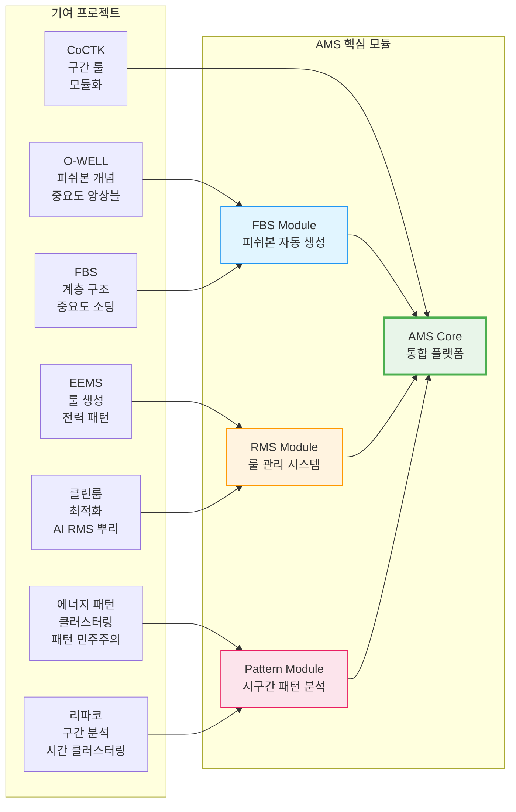

| 프로젝트명 | 기간 / 발주처 | 핵심 기술 | 역할 & 성과 |
|:---|:---|:---|:---|
| **AMS (Analysis Management System)** (`project.ams`) | 2024.07~2025.12 한국산업기술진흥원 | 피쉬본 다이어그램 자동생성, FMEA 자동화, 베이지안 네트워크, **시구간 패턴 변환** | **온톨로지 구조화/정보화의 통합 실현**: 피쉬본(FBS) = 구조화된 인과관계 다이어그램, 확률 네트워크 = 구조화된 확률 관계, 패턴 정보화 = 구조화된 패턴 데이터를 온톨로지 구조로 통합. **AI 종합 플랫폼 개발 총괄 PM**. **핵심 돌파구**: 계층 클러스터링을 단계별로 잘라 AI 피쉬본 자동 생성 (본인 고안). **시구간 패턴 분석**: 같은 값도 시점별 통계적 특성(p-values, 첨도, 편차)에 따라 정상/불량 구분 → 이상탐지율 93.7% (실질 60~70%, 데이터 한계). AMS 완성 1년 전부터 이 기법이 대부분 과제에 적용, AMS로 통합 정리. **GS 1등급 (PDS 명칭)**, **특허 출원 2건** (2025.03.28 청구항 8개 등록결정 완료, 2025.08.13 청구항 10개 심사 진행 중). **ID 기반 온톨로지 맵**: `project.ams`로 모든 모듈(FBS, RMS, Pattern, Bayesian Network) 관계 추적. 문서 ID(`page.portfolio.projects`)로 설계 문서 관리. 온톨로지 기반 영향 관계 분석으로 변경 영향 자동 추적. **특허-모듈 연계**: **특허 1 (2025.08.13, 청구항 10개)**: 특성요인도 자동 생성 (계층 클러스터링 + FFT 주기 패턴 분석 + 중요도 랭킹) → FBS Module (`03_FBS/fish_born_making.py`), 관리 룰 자동 생성 (다단 클러스터링 DBSCAN→K-means→최적화 + 유전 알고리즘 기반 이진화) → RMS Module (`04_RMS/cluster_auto_Binarization.py`), 확률 네트워크 기반 경로 탐색 (사전/사후 확률 계산 → 확률 관계 그래프 토큰화 → LLM 활용) → 베이지안 네트워크 (`05_AMS_dev/bayesian_network_analyzer.py`), 가상 센서 데이터 생성 → 데이터 입력부 (`05_AMS_dev/data_pipeline.py`). **특허 2 (2025.03.28, 청구항 8개, 등록결정 완료)**: 공정 관리 기술 특허화, 특성요인도 자동 생성 및 관리 룰 생성 → AMS 공정 관리 기술. **에너지 패턴 특허 연계**: 특허 3, 4, 5의 에너지 패턴 분석 기술이 AMS Pattern Module에 통합 (특허 5의 상태 전이 모델 → 특허 3의 SoH 분석 → 특허 4의 주기 데이터 분석). 세아특수강/테크웰/신성오토텍 등 다수 과제 적용. **논문(2025, 2024)**. **LLM 에이전트 토대**: AMS에서 모듈화·체계화 경험을 쌓아 Evaluation Framework와 프롬프트 평가 엔진 설계의 토대 마련 |
| **CoCTK (Consulting Tool Kit)** (`project.coctk`) | 2022.03~2024 중소기업기술정보진흥원 | 데이터 전처리, 상관관계 분석, 비용 최적화, **소량 데이터 학습 가능성 판별**, 구간 룰 생성 | **온톨로지 구조화의 실현**: 데이터 전처리, 상관관계 분석, 룰 생성을 구조화된 온톨로지 형태로 관리. ID 시스템(`project.coctk`)으로 모듈 간 관계 추적. 구조화된 정보로 소량 데이터 학습 가능성 판별. **엔진 총괄 설계 & 화면설계 개발 총괄 PM**. **사업 시작 전 판별 컨설팅 도구**: 소량 데이터로 학습 가능성, 중요 순위, 상관분석, 시계열 예측 가능성, feature-결과 추론 등 종합 판별. 클러스터링 기반 구간 룰로 에너지 최적화. **CoCTK + 이후 개념들이 모듈화/체계화되어 AMS AI 모듈의 기초가 됨**. **GS 1등급** 취득 (2024), **논문(2023)**. **LLM 에이전트 토대**: CoCTK에서 모듈화·체계화 경험을 쌓아 Evaluation Framework와 프롬프트 평가 엔진 설계의 토대 마련 |
| **오웰(일본)社 자동차 도정 공정** (`project.japan_dx`) | 2020~2025.03 (본격 참여: 2023.12~) O-WELL | 인과 관계 다이어그램 AI 엔진, **전문가 지식 통합**, 다중 중요도 지표 앙상블 | **AMS의 기원(Origin)**: 피쉬본 개념과 품질 데이터 관리 방식을 일본에서 학습. 도정 공정(페인팅, 오븐 건조 등) 데이터 기반 인과 관계 다이어그램 AI 엔진 개발. **전문가 지식 통합**: 기존 논의 기반 피쉬본 문서와 AI 데이터 기반 피쉬본 비교 → 상호 수정 반영. **중요도 앙상블**: RandomForest뿐 아니라 상관관계, 선형회귀 계수, XGB/AdaBoost 중요도, PCA 계수 등 다양한 지표 통합으로 현장 전문가 관점의 중요도 구현. 패턴 최적 선택(정보량)과 계층 클러스터링으로 관계구조 생성. **논문(2022)**. **AMS 영향**: FBS Module의 피쉬본 개념 및 중요도 앙상블 기법 기여 |
| **품질 예측 AI 엔진** (`project.quality_prediction`) | 2021~2023 정보통신산업진흥원 | 사출/도정/금형 공정 품질 예측 모델, 앙상블 학습 | 다수 업체 품질 예측 AI 엔진 개발 및 고도화: **한중엔시에스**(사출, RF/XGB/AdaBoost 앙상블), **대성금형**(전기장치, 품질 OUT 예측), **제이제이툴스**(금속가공, FBS 품질 중요도), **알티스트**(식품, CoCTK 엔진 초석). 불량률 감소 성과. → [상세 프로젝트 목록](#10-스마트공장-및-컨설팅-프로젝트-상세-2020-2026-sectionprojectssmart_factory) 참조 |
| **공정 불량 예측** (`project.defect_prediction`) | 2023.04~2023.10 정보통신산업진흥원 | 공정 불량 예측 모델, 정보량 기반 패턴 분석 | 공정 불량 예측 AI 엔진 개발: **코스모폴**(건축자재, 정보량 기반 최적 패턴 도출), **해태가루비**(식품 Frying 공정). → [상세 프로젝트 목록](#10-스마트공장-및-컨설팅-프로젝트-상세-2020-2026-sectionprojectssmart_factory) 참조 |
| **FBS (Fishbone Structure)** (`project.fbs`) | 2020.09~2021.10 한국에너지기술평가원 | 피쉬본 다이어그램 자동 생성 알고리즘, 계층 구조 기반 중요도 소팅 | **온톨로지 구조화의 구체화**: 피쉬본 다이어그램 = 구조화된 인과관계 다이어그램. 온톨로지 구조화 접근법의 첫 번째 구체적 실현. **FBS 엔진 초기 개발**: 전무님 LSTN 아이디어에서 시작 → 논문 조사 후 "구조 계층 먼저, 위치는 중요도로" 방식 고안. **초기**: 단순 최적화 네트워크, 하드코딩 개수, 하위 층 불가 → **현재(AMS)**: 계층 클러스터링 → 패턴 FBS 투표 통합 → 중요도 소팅의 체계적 단계로 발전. 롯데알루미늄, 오웰, SHINT 등 다수 업체 적용 (한국은 개념 이해 어려움). **AMS 영향**: FBS Module의 계층 구조 및 중요도 소팅 알고리즘 기여 |
| **SHINT 사출공정 품질 AI 이상감지** (`project.shint_quality_ai`) | 2024.07~2025.01 중기부 제조 데이터 상품가공지원사업 | 사출공정 품질 AI, 이상감지 학습 데이터셋, **AMS 실증** | **데이터 분석 및 감리**: 갓 완성된 AMS에 실제 데이터 투입 후 분석 및 리포트 작성. 감리 위원 평가 문서 작성까지 수행 (감리 프로세스 학습). **에스에이치아이엔티** 대상 AMS 실증 적용 (2020년 이후 두 번째 협업). **LLM 에이전트 토대**: SHINT 프로젝트에서 감리 문서 작성 경험을 쌓아 Business Document Generator 설계의 토대 마련 |
| **자동차 부품 사출 DX** (`project.injection_dx`) | 2021~2023 | 사출 파라미터 최적화, 공정 불량 예측, 패턴 룰 생성 | **에스에이치아이엔티** 대상. **품질 관련 AMS의 실증 헤드**: 가장 많은 품질 데이터 보유. 패턴 룰 기반 품질 예측. 불량률 감소 및 비용 절감. **논문(2022)**. **AMS 영향**: 품질 예측 및 패턴 룰 생성 경험 → AMS Pattern Module 기여 |

## 2. Digital Transformation Platforms (`section.projects.digital_platforms`)
| 프로젝트명 | 기간 / 발주처 | 핵심 기술 | 역할 & 성과 |
|:---|:---|:---|:---|
| **DPS (데이터수집시스템)** (`project.dps`) | 2025.06~2025.10 POMIA (재단법인 포항소재산진흥원) | **5층 아키텍처** (1.센서수집 → 2.중앙저장관리 → 3.POP/MES → 4.AMS+확률네트워크 → 5.LLM FMEA 생성), Microservices, Neo4j 그래프DB | **온톨로지 정보화의 연장선**: 5층 아키텍처가 온톨로지 구조로 설계됨. Neo4j 그래프DB로 확률 네트워크를 온톨로지 형태로 저장. **LLM 활용** = 구조화된 정보를 LLM에 제공하여 활용하는 온톨로지 정보화의 연장선. ID 기반으로 센서-데이터-분석-결과 관계 추적. **핵심 아키텍처 설계 및 개발 (PM 수행)**. Neo4j로 **확률 네트워크 저장**: FBS 뼈대 위에 확률적 최적화로 문제 해결 최적 경로 도출 (같은 층끼리 이동 가능한 네트워크 구조). 금속산업 5대 공정 AI 자동화. 세아특수강 포미아 DX 실증센터에 납품. **논문(2024)**. **LLM 에이전트 토대**: **LLM 활용하다보니 온톨로지도 잘 못알아먹고 벡터도 부족하다는 것을 깨달고 특화 중간 DB 필요성 인식** → DPS에서 5층 아키텍처 설계 경험을 쌓아 Virtual Company Creation Agent의 계층 구조 설계 토대 마련. **핵심 스토리**: LLM이 만들어지려면 가상의 공장 정보의 파이프라인이 필요했는데, 실제 공장 정보가 아니라 암묵적으로 더 방대한 차원의 정보(기업 풀)가 필요. AI가 그때그때 추론하면 리소스도 많이 먹고 계속 변동되고 문제가 생겨도 왜인지 추적이 안됨. "어차피 AI LLM은 앞뒤 주는 것만 잘하면 되니까" 특화 중간 DB(GFS)를 만들어서 LLM을 서포트. Virtual Company Creation Agent와 AI_DB_tester (VACTS)는 같은 뿌리 |
| **생산정보 연계 통합 운영관리 (EEMS)** (`project.production_integration`) | 2021~2025 | 생산-설비-환경-에너지 통합, 실시간 데이터 연계, **전력 패턴 분석**, 에너지 소비량 예측 | **패턴 분석 기법의 뿌리**: 전력 패턴을 다양하게 분석 (찢고 쪼개고 온갖 실험). 한전 가이드 기반 전력 에너지 룰 생성 (비율 기반), 에너지 소비량 예측, **전력 AI-FMEA** 시연. **AMS 룰 생성에 가장 큰 기여**. 제조 현장 디지털화 실증, **논문(2022)**. **AMS 영향**: RMS Module의 룰 생성 기법 기여 |
| **포미아 DX 실증센터 분석 플랫폼** (`project.pomia_dx_center`) | 2025.06~2025.10 POMIA (재단법인 포항소재산업진흥원) | 데이터 연동, POP 프로그램, 철강 5대공정 데이터 분석, 하이브리드 인프라 | **PM 총괄 (제안서~완료까지 전체 진행)**: 제안서 작성, 계획서 작성, 외주 관리, 완료서 작성. 세아특수강 등 하위 과제 포함. 맞춤형 솔루션 기획. **LLM 에이전트 토대**: 포미아 DX에서 PM 경험(제안서~완료, 외주 관리)을 쌓아 PM Agent 설계의 토대 마련 |

## 3. Smart Sensors & IoT (`section.projects.sensors_iot`)
| 프로젝트명 | 기간 / 발주처 | 핵심 기술 | 역할 & 성과 |
|:---|:---|:---|:---|
| **보급형 스마트센서 3종** (`project.smart_sensors`) | 2022~2024 | 모듈화 센서, Modbus/OPC-UA | 소규모 제조기업 보급 최적화, **논문(2024)** |
| **AI 복합 센서** (`project.ai_composite_sensor`) | 2021~2025 | 에지 컴퓨팅(Edge AI), 가상 센서, **센서 대체 연구** | **패턴 센서/부재 센서 대체 방법 연구**: 상위기관이나 실험실 데이터로 채우는 방식. 패턴 분화 → 예측 → 통합으로 패턴과 값 모두 대응. 데이터 전송량 감소, 실시간 이상 검출. **논문(2025)** |
| **고가센서 대체 가상센서** (`project.virtual_sensor`) | 2021.05~2021.10 한국에너지기술평가원 | **3-Type Virtual Sensors** (Pattern/Calculation/Prediction) | **메인 목적**: 여러 저가형 센서 조합으로 **고가 센서 값 예측**. 패턴+값을 통해 고가 센서 대체.  **3가지 보조 기법**: 1. **패턴 기반**: 패턴 분석 결과를 센서값으로 활용 2. **연산 기반**: 이종 데이터 결합 계산 3. **예측 기반**: 백그라운드 정보(시뮬레이션)로 부재 센서 값 AI 예측. **AI 복합 센서 연구의 기초가 됨** |
| **세아특수강 데이터 통합** (`project.seah.data_integration`) | 2025 | RS232C-LAN 변환, Lot 매칭, POP, SPC | **포미아 DX 실증센터 하위 과제**: POP와 SPC 납품. 직진도 검사기 값을 POP에 연동 (공사, PC 설치, 요구조건 확인). 계열사 브이엔티지 LOT + 직진도 검사결과 + 생산정보 매칭 → **SPC 생성**. **LLM 에이전트 토대**: 세아특수강에서 데이터 통합, POP/SPC 개발 경험을 쌓아 Factory Ontology Manager AI Agent의 프론트와 기본 기능 설계 토대 마련 |

## 4. Industrial Safety & Energy Optimization (`section.projects.safety_energy`)
| 프로젝트명 | 기간 / 발주처 | 핵심 기술 | 역할 & 성과 |
|:---|:---|:---|:---|
| **산업용 클린룸 에너지 최적화** (`project.cleanroom_energy`) | 2021.04~2021.10 한국에너지기술평가원 | 송풍기 최적 제어, 에너지 소비 패턴 분석, **최적 패턴 룰 + 제어 수식** | **AI 엔진 개발 총괄 PM**: 반도체 설비 생산 클린룸 대상. 과도한 송풍기 가동 문제 → 최적 패턴 룰 및 제어 수식 개발. 일부 송풍기가 오히려 방해되는 점 발견, 상시 풀가동 불필요 확인 → **효율 20% 향상**. **AI RMS(룰 관리 시스템)의 뿌리**. **논문(2023)**. **AMS 영향**: RMS Module의 룰 관리 시스템 기초 기여 |
| **생산공정 에너지 데이터 패턴 분석** (`project.energy_pattern`) | 2023 연구과제 **국가연구개발사업** 에너지수요관리핵심기술개발사업 | 설비 상태 데이터 패턴 분석, 라벨링 시스템 | **패턴 정보화의 핵심 실현**: 에너지 패턴 데이터를 구조화된 온톨로지 형태로 변환. 패턴 정보화 = 온톨로지 정보화의 핵심. 특허 3, 4, 5가 온톨로지 구조로 연결되어 AMS Pattern Module에 통합. **메인 수행**: 초기 백엔드 개발 → 풀스택 개발 및 총괄 PM으로 확장. **계층적 클러스터링(Hierarchical Clustering)** 도입 및 **패턴 민주주의(Pattern Voting)** 기법 고안. 이 구조적 분화와 투표 방식이 훗날 **AMS(이상탐지 시스템)**의 핵심 알고리즘 모체가 됨. **특허 출원**: 2023.12.26에 **특허 2건 출원** (권순룡 발명자). **특허 3**: 전력 사용 패턴 분석 및 설비 SoH 상태 분석 방법 (1020230191965, 청구항 6개) - 머신러닝 기반 설비 SoH 상태 분석 모델 생성 및 실시간 판단. **특허 4**: 주기 데이터 분석 기반 전력 추이 상황적 불량 이상 검증 방법 (1020230191969, 청구항 5개) - 시계열 분해 방식으로 주기 데이터 추출 → 주파수 스펙트럼 기반 전력 소비 패턴 데이터 생성 → 시계열 예측 기반 불량/이상 감지. **국가연구개발사업 지원**: 과제번호 2022202090003B, 연구기간 2022.04.01 ~ 2024.12.31, 과제명 "제조설비의 변동부하 대응형 에너지 효율화 모듈 및 제어 기술개발". **논문(2023.07)**과 연계하여 학술적·법적 보호 완료. **기술 발전 과정**: **특허 5 (2021.12.07, 청구항 10개, 등록결정 완료 2025.10.28)**의 에너지 소비 패턴 모델 (제어 로그 + 전류 소비 데이터 결합, 상태 전이 모델, 주파수 분해 작업) → **논문(2023.07)**의 전력 사용 패턴 및 SOH 분석 → **특허 3 (2023.12.26, 청구항 6개)**의 SoH 상태 분석 방법, **특허 4 (2023.12.26, 청구항 5개)**의 주기 데이터 분석 기법 → **AMS Pattern Module 통합**. **AMS 영향**: Pattern Module의 핵심 알고리즘 기여 |
| **전력 데이터 예측** (`project.power_prediction`) | 2021.04~2021.11 정보통신산업진흥원 | 전력 소비 패턴 ML 예측, 시계열 분석 | 사출 업체 전력 데이터 예측 AI 엔진 개발, PLC 변화 기반 패턴 분석 |
| **EV/ESS 디지털트윈 안전** (`project.digital_twin_safety`) | 2023~2024 | 가상 모델 매핑, 위험 식별 | 제조 공정 안전성 확보 및 사고 예방 |
| **전력품질 에너지 효율 플랫폼** (`project.power_quality`) | 2022~2023 | 전력 파라미터 실시간 분석 | 에너지 효율화 시장 확산 및 실증, **논문(2023)** |

> [!TIP] **현장이 곧 연구실 (Research in Field)**
> 총 10편의 학술 논문과 **5건의 특허 출원**은 모두 **실제 프로젝트 현장의 데이터와 실증 결과**를 기반으로 작성되었습니다.
> 특히 초기 **개념적 특허(전무님 발의)**를 실제 작동하는 **알고리즘과 시스템으로 구체화(Concretization)**하여 현장에 적용하고 입증한 것이 핵심 성과입니다. 에너지 패턴 분석 분야에서 **권순룡이 직접 연구·개발한 기술**을 기반으로 3건의 특허를 출원했으며, AMS 프로젝트의 핵심 기술을 2건의 특허로 추가 출원하여 총 5건의 특허로 지식 재산권을 확보했습니다.

## 5. Healthcare & Medical AI (`section.projects.healthcare`)
| 프로젝트명 | 기간 / 발주처 | 핵심 기술 | 역할 & 성과 |
|:---|:---|:---|:---|
| **진료기록 체질 분석 시스템** (`project.medical_constitution`) | 2022.06~2022.10 한국데이터산업진흥원 | 진료기록 데이터 분석, 체질 패턴 ML 모델 | 한의원 진료 기록 기반 체질 예측 AI 시스템 개발, 헬스케어 AI 적용 |

## 6. AI Workflow & Automation Tools (`section.projects.ai_workflow`)

### 프로젝트 경험 → LLM 에이전트 설계 토대 관계

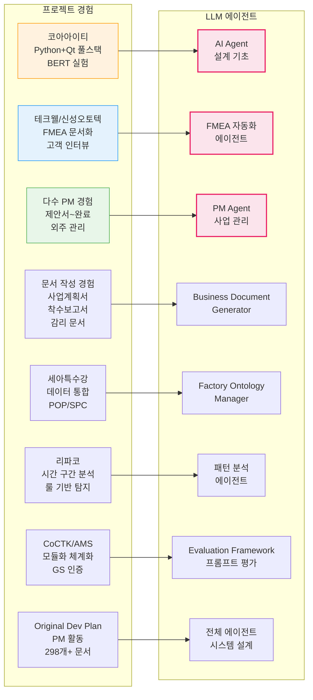

| 프로젝트명 | 기간 / 발주처 | 핵심 기술 | 역할 & 성과 |
|:---|:---|:---|:---|
| **Original_Development_Plan (Obsidian Design Origin)** (`project.obsidian_design_origin`) | 2020~2025 (집중 개발: 2025.5~7, 2025.8~10, 2025.10~12) 내부 개발 | ID 기반 온톨로지 맵, Phase 0-13 워크플로우, State 기반 정보 전달, 코드 에이전트 통합, 전문가 요약 시스템, 21개 development 프롬프트, **LangGraph/CrewAI 방식 워크플로우 오케스트레이션**, **상태 기반 진행 모니터링 및 완료 조건 판단 시스템**, **28개 Few-shot Rules System** (8개 도메인: design/api/database/component/state/security/performance/testing), **4단계 Testing Workflow** (Mock Setup → Unit → Integration → E2E), **규칙 이중 참조 구조** (설계 시 + 테스트 시 적용) | **전체 에이전트 시스템 설계 (PM 활동에서 문서, 개발 진행 관리에 활용)**, 코드 에이전트 + 문서 확인 + 프롬프트 보완 통합, 298개+ 설계 문서, 25개+ AI 프롬프트 체인, 21개 development 프롬프트(수정 관리 시스템 포함), 개발 에이전트 실시간 평가 시스템, **워크플로우 상태 모니터링 및 자동 복귀 로직**, **품질 관리 오케스트레이션**, 연속 개발 워크플로우, **Few-shot 규칙 기반 코드 품질 자동 검증**, **Mock 기반 테스트 자동화 워크플로우**. **LLM 에이전트 토대**: 다수 PM 경험(제안서~완료, 외주 관리)을 통해 전체 에이전트 시스템 설계의 토대 마련 |
| **FMEA 자동화 생성 시스템 (Claude Sub-Agent)** (`project.fmea_claude_agent`) | 2025.6~ 내부 개발 | Claude Code Task tool, Multi-Agent Workflow, 8개 Sub-Agent 협업 | **Master Orchestrator 설계**, 코딩 에이전트의 역설계 시스템 구조 적용, AIAG & VDA FMEA 표준 기반 범용 리스크 분석 시스템, Phase 0~5 자동화 워크플로우, **코드 에이전트에서 영감을 받은 전체 공장/회사/사무 자동화의 백정보 핵심**, **논문(2025)**. **LLM 에이전트 토대**: 테크웰/신성오토텍에서 FMEA 문서화 및 고객 인터뷰 경험을 쌓아 FMEA 자동화 에이전트 설계의 토대 마련 |
| **Evaluation_Framework** (`project.evaluation_framework`) | 2025.10~ 내부 개발 | Python, FastAPI, LangGraph, React, Docker | **System-Wide Quality Assurance Layer**: 49개 Python 모듈과 298개 문서 전체를 전수 검사하는 거대 평가 엔진 (6가지 관점 평가 수행), 단순 프로젝트가 아닌 전체 아키텍처의 건전성을 책임짐. **LLM 에이전트 토대**: CoCTK/AMS에서 모듈화 및 체계화 경험, GS 인증 프로세스 경험을 쌓아 Evaluation Framework 설계의 토대 마련 |
| **프롬프트 평가 엔진 (Claude Sub-Agent)** (`project.prompt_eval_claude_agent`) | 2025.6~ 내부 개발 | 구조화된 평가 프레임워크, 역할 기반 가중치, Human-in-the-Loop, 병렬 평가 구조, 17가지 역할별 가중치 시스템 | **AI Gatekeeper**: 모든 AI 생성물의 '입구'를 통제하는 심사관. **전체 프롬프트를 전수 평가**하는 시스템으로, 25개+ 프롬프트의 품질을 승인/반려하는 권한을 가짐. AI 생성 프롬프트를 다른 AI가 평가하는 이중 검증(Double-Check) 시스템. **3가지 핵심 차원(Quality, Consistency, Cost) 평가**, **MLOps Priority Matrix 기반 가중치(Structural 40%, Correctness 30%, Relevancy 20%, Tone 10%)**, **17가지 역할별 동적 가중치 적용**, **병렬 처리 구조(4개 메트릭 동시 평가)**. **LLM 에이전트 토대**: CoCTK/AMS에서 모듈화 및 체계화 경험, GS 인증 프로세스 경험을 쌓아 프롬프트 평가 엔진 설계의 토대 마련 |
| **PM Agent (Business Management Sub-Agent)** (`project.pm_agent`) | 2025.10~ 내부 개발 | MCP (Model Context Protocol), Docker, Claude Agent, HWP 파서 | **Execution Manager & Governance**: 사업 관리의 '전체 라이프사이클'을 관장. 1. **Risk Management**: 계약서/과업지시서 내 독소 조항 자동 추출 및 리스크 평가 2. **Schedule Tracking**: 회의록 분석을 통한 타임라인 자동 현행화 3. **Integrity Check**: 누락된 문서나 데이터 파편화를 방지하는 무결성 검증. **LLM 에이전트 토대**: 다수 PM 경험(제안서 작성, 외주 관리, 완료서 작성, 포미아 DX 등)을 통해 PM Agent 설계의 토대 마련 |
| **Virtual Company Creation Agent** (`project.virtual_company_creation_agent`) | 2026.1.4~ 내부 개발 | Claude Agent, HQONS (Hyper-Quantum Omni-Net Structure), 하이퍼디멘션(HDC), MCP, Vector DB, GFS (Grape File System), Dual-Tier AI, PostgreSQL-Inspired Architecture, Decoupled Intelligence Architecture | **AI 에이전트로만 구성된 가상 기업 생성 시스템**: **"직원 225명 대신 빈 책상 225개 + 천재 직원 1명"** - **Decoupled Intelligence Architecture (지능과 상태의 분리)**: 225개의 빈 책상(포도송이/Grape Cluster)은 평소 Dormant 상태로 유지비 0원, 1명의 슈퍼 AI(거대 에이전트)가 필요한 순간 특정 책상으로 순간이동(Docking)하여 **O(1) 리소스로 O(N) 스케일링** 달성, **7단계 Chain Workflow** (Chain 01~07: Foundation → Organization → Agents → System Orchestrator → Protocol → Assembly → Crystallization), **15 Systems × 15 Sub-Agents = 225개 서브시스템**, **14 Layer 온톨로지 좌표 체계** (Strategic/Structural/Functional/Operational/Protocol), **🍇 GFS (Grape File System)**: AI 없이도 데이터 접근 가능한 파일 기반 NoSQL 구조로 **비용 87% 절감** (단순 조회 $0.01/요청 → $0), **🔐 Dual-Tier AI 아키텍처**: High-Spec AI (추론)와 Low-Spec AI (조회) 분리로 **최대 87% 비용 절감**, **🐘 PostgreSQL-Inspired 기능**: WAL (Write-Ahead Log), MVCC (Multi-Version Concurrency Control), Index, Vacuum으로 엔터프라이즈급 데이터 무결성 보장, **🎛️ Docking Protocol**: 거대 에이전트의 도킹 주기/모드 관리로 리소스 최적화, **🔧 Modular Execution Engine**: Full/Partial/Single/Resume 모드 지원으로 유연한 워크플로우 실행, **"Intelligence as a Service" Serverless Agent Orchestration**, **20개 이상 설계 문서 완료** (architecture 폴더: Blue_Print, Business_Summary, Process_Overview, Ontology_Overview, Grape_Cluster_Architecture, API_Design, Database_Design 등), **설계 단계 완료, 구현 기초 단계 진행 중**, **Platform All 통합 플랫폼 생태계 핵심 구성요소** |
| **Business Document Generator** (`project.business_document_generator`) | 2025.12~ 내부 개발 | Claude Agent, Multi-Step Chain Workflow, Role-based Expert Personas, Mermaid Diagram Generation, PDF Conversion | **사업계획서/제안서/착수보고서 자동 생성 시스템**: 요구조건 문서 및 Architecture 파일 파싱, 포트폴리오 스마트 매칭, 발주처 유형별 페르소나 적용(정부/민간/공공기관), 청크 기반 생성 및 PM 통합 검증, WBS 세부화, PDF 자동 변환, **사무 에이전트 핵심 도구**, **이력 포폴 자동 생성**. **LLM 에이전트 토대**: **2023년부터 한솔코에버 AI 쪽 사업계획은 사용자의 손을 안 거친 게 없을 정도로 많은 사업계획서, 제안서, 착수보고서를 작성** → 다수 문서 작성 경험(사업계획서, 제안서, 착수보고서, 감리 문서 등)을 통해 Business Document Generator 설계의 토대 마련. **핵심 스토리**: 사용자의 이력이 한솔코에버 AI 연구 이력과 동일하고, 회사에서 AI 쪽 사업계획은 적어도 2023년부터는 사용자의 손을 안 거친 게 없음. 사업계획서를 하도 만들다 보니, 이걸 자동화하면 좋겠다고 생각해서 Business Document Generator를 개발. 이력 포폴 자동으로 쓰고 사업계획서, 제안서, 착수보고서 자동으로 쓰는 시스템 완성 |
| **AI_DB_tester (VACTS)** (`project.ai_db_tester`) | 2026.1.7~ 내부 개발 | Python, 프롬프트 기반 테스트 자동화, Cursor IDE 통합, GFS 검증, LangGraph 기반 자연어 쿼리 | **Virtual Company Creation Agent 테스트 자동화**: 5가지 실행 모드 (Full Test, Simulation, Single Chain/System, I/O Test), **QUERY_AGENT**: 자연어 인터페이스로 테스트 실행 및 결과 조회, 자동 검증(GFS, 온톨로지, 스키마), 자동 리포트 생성, Cursor IDE 통합. **OntoFlow 통합 테스트**: OntoFlow Document Processing Chain Agent의 9단계 워크플로우 테스트 자동화, 문서 처리 파이프라인 검증, 온톨로지 추출 정확도 검증, API 엔드포인트 통합 테스트 |
| **OntoFlow Document Processing Chain Agent** (`project.ontoflow_doc_processor`) | 2025.12~ 내부 개발 | Claude Agent, FastAPI, React, TypeScript, vis-network, IndexedDB, LangChain/LangGraph, 9-Step Chain Workflow, API 기반 자동화 | **문서 색인화 및 구조화 자동화 시스템**: Obsidian 기반 마크다운 문서를 9단계 워크플로우로 처리하여 온톨로지 자동 추출 및 지식그래프 구축. **Phase 1: 문서 등록 (Step 1-5)**: 요청 분석 → 관련 문서 조회 → 문서 존재 확인 → 관계 매핑(wiki/md 링크) → DB 업데이트. **Phase 2: 문서 분석 (Step 6-9)**: 키워드 추출(10-20개) → 세부요약 생성(200-500단어) → 간단요약 생성(50-150단어) → 관계 추론(semantic_meaning). **프롬프트 체인 기반 처리**: 9개 프롬프트 파일로 각 단계별 처리 로직 체계화, 배치 처리 지원(6-9_Batch_Execution_Guide). **온톨로지 뷰어 & 자연어 연결 관리**: GraphCanvas에서 semantic_meaning 기반 자연어 관계 표시, 백엔드 graph_service.py에서 semantic_meaning 자동 추출 및 제공, 하드코딩 제거로 유연한 관계 표현. **API 기반 자동화**: RESTful API로 문서 처리 자동화, 데이터 보존 규칙(Step 7-8에서 이전 데이터 포함 필수), 비동기 그래프 재생성 지원. **AI_DB_tester 통합**: AI_DB_tester를 통한 자동화된 테스트 파이프라인, 문서 처리 워크플로우 검증, 온톨로지 추출 정확도 자동 검증, API 엔드포인트 통합 테스트. **비즈니스 가치**: 문서 처리 시간 70% 절감, 온톨로지 추출 자동화로 298개+ 문서 관리, 자연어 기반 관계 표시로 사용자 이해도 향상. **LLM 에이전트 토대**: 문서 색인화/구조화 경험을 쌓아 지식 관리 시스템 설계의 토대 마련 |
| **Factory Ontology Manager AI Agent** (`project.factory_ontology_manager_ai_agent`) | 2026.1.8~ 내부 개발 | React, TypeScript, Flask, LangGraph, Instructor, AI_DB_center, 자연어 처리, DB Grounding, Ontology Mapping, Human-in-the-Loop | **자연어 기반 공정 문서 파싱 및 캔버스 레이아웃 자동 생성**: 공정 문서를 파싱하여 공장 데이터와 매핑, 캔버스 레이아웃 자동 생성, **핵심 기능**: 자연어 파싱, DB Grounding, Ontology Mapping, Spec-First Modification, **LangGraph V2**: 공정 재사용 로직, 자재 할당 개선, materialId 검증, factory_loader.py 개발, **비즈니스 가치**: 레이아웃 생성 시간 80% 단축, 데이터 일관성 향상. **LLM 에이전트 토대**: 세아특수강에서 데이터 통합(POP/SPC, RS232C-LAN 변환, Lot 매칭) 경험을 쌓아 Factory Ontology Manager AI Agent 프론트 및 기본 기능 설계의 토대 마련 |
| **Insight_Ops** (`project.insight_ops`) | 2026.1~ (개발 중) 내부 개발 | React + TypeScript + Express + Prisma, Feature-based Architecture, Hybrid Database (SQLite + AI_DB_center + 파일 시스템), RAG (Retrieval-Augmented Generation), 벡터 DB (LanceDB, Pinecone, Chroma 등) | **기업용 AI 기반 문서 분석 및 채팅 플랫폼**: anything-llm 기반으로 설계 완료 후 개발 진행 중. 문서 업로드 및 분석(PDF, TXT, DOCX, 마크다운), 문서 기반 RAG 채팅, 실시간 스트리밍 응답, 30개 이상 AI 모델 지원(OpenAI, Anthropic, Ollama 등), 멀티유저 및 역할 기반 권한 관리(Admin, Manager, Default), No-code 방식 커스텀 AI 에이전트 생성, 워크스페이스별 문서 및 채팅 컨텍스트 분리 관리. **Platform All 생태계 연결**: OntoFlow_doc와 온톨로지 기반 문서 구조화 연동(Ontology-Enhanced RAG), AI_DB_center 통합으로 Hybrid Database 전략 구현, OpsClaw 메시징 게이트웨이와 RAG 엔진 공유 가능, Virtual Company Creation Agent의 기업 풀 정보 확장. **기술 스택**: React 18.3.1+ + TypeScript 5.5.3+ + Vite 7.1.12+, Node.js + Express + Prisma, Zustand + React Query. **아키텍처**: Feature-based Architecture, RESTful API + WebSocket, Hybrid Database Strategy. **상태**: 설계 완료, 개발 진행 중 |
| **OpsClaw** (`project.opsclaw`) | 2026.1~ (설계 단계) 내부 개발 | TypeScript, Gateway Server, MCP (Model Context Protocol), Multi-Channel Support (WhatsApp, Telegram, Slack, Discord), OntoFlow_doc 통합, AI_DB_center 통합, Lit 기반 Control UI | **AI 기반 메시징 게이트웨이 및 개발 플랫폼**: 다양한 채널(WhatsApp, Telegram, Slack, Discord 등)을 지원하는 메시징 게이트웨이. OntoFlow_doc 및 AI_DB_center와 통합되어 문서 기반 AI 응답 제공. Gateway Server(포트 18789), Control UI(통합 및 개발 서버), 벡터 검색 및 메모리 인덱스 관리, Pi Agent 런타임 지원. **Platform All 생태계 연결**: AI_DB_center 파일 시스템 직접 접근 통합 완료(REF-001), OntoFlow_doc HTTP API 통합 진행 중, Insight_Ops RAG 엔진 활용 가능, Virtual Company Creation Agent의 기업 풀 정보를 메시징 채널로 접근 가능. **아키텍처**: Gateway 서버 기반 HTTP/WebSocket, 채널 플러그인 구조, AI_DB_center 클라이언트 통합. **상태**: 설계 단계 (설계 문서 완료, 개발 준비 중) |
| **Goose Architecture Analysis** (`project.goose_architecture_analysis`) | 2026.1~ (파악 단계) 내부 분석 | Electron + React + Rust, Component-based Architecture, MCP (Model Context Protocol), 로컬 AI 에이전트 데스크톱 앱 | **로컬 AI 에이전트 데스크톱 애플리케이션 아키텍처 파악**: Block, Inc.의 goose 프로젝트(버전 1.20.0) 아키텍처 분석 중. Electron 프론트엔드와 Rust 백엔드(goosed)로 구성된 로컬 실행 AI 에이전트. 주요 구성 요소: Hub/Pair 페이지(AI 채팅 인터페이스), 세션 관리, 확장 기능(MCP 서버 통합), 레시피/스케줄 자동화, 로컬 실행으로 데이터 프라이버시 보장. **Platform All 생태계 연결**: Component-based Architecture 및 MCP 활용 방식 학습, 로컬 실행 전략 참고(데이터 프라이버시 보장), MCP 기반 확장 기능 구조를 Platform All 생태계에 적용 가능, 설계 문서 파악을 통한 설계 패턴 학습. **아키텍처 문서 분석**: Blue_Print, Business_Summary, Project_Structure_Design, API_Design, Database_Design 등 설계 문서 파악 진행 중. **목적**: 확장 가능한 오픈소스 AI 에이전트 아키텍처 학습 및 Platform All 생태계 설계 참고. **상태**: 아키텍처 파악 단계 |

### Platform All 생태계 통합 프로젝트

#### Insight_Ops: 문서 중심 AI 플랫폼
**역할**: 기업용 문서 분석 및 RAG 채팅 플랫폼  
**연결 관계**:
- **OntoFlow_doc**: 온톨로지 기반 문서 구조화 연동 (Ontology-Enhanced RAG)
- **AI_DB_center**: Hybrid Database 전략으로 통합 (SQLite + AI_DB_center + 파일 시스템)
- **OpsClaw**: RAG 엔진 공유 및 메시징 채널 연동 가능
- **Virtual Company Creation Agent**: 기업 풀 수준의 정보를 Insight_Ops의 문서 분석으로 확장 가능

#### OpsClaw: 메시징 게이트웨이
**역할**: 멀티 채널 메시징 및 AI 응답 게이트웨이  
**연결 관계**:
- **AI_DB_center**: 파일 시스템 직접 접근 통합 완료 (REF-001)
- **OntoFlow_doc**: HTTP API 통합 진행 중 (`http://localhost:8020/api/ontoflow/*`)
- **Insight_Ops**: RAG 엔진 활용 가능 (메시징 채널을 통한 문서 기반 AI 응답 제공)
- **Virtual Company Creation Agent**: 기업 풀 수준의 정보를 메시징 채널을 통해 접근 가능

#### Goose Architecture Analysis: 아키텍처 학습
**역할**: 오픈소스 AI 에이전트 아키텍처 분석 및 설계 패턴 학습  
**연결 관계**:
- **Platform All 생태계**: 설계 패턴 참고 및 적용 (Component-based Architecture, MCP 활용 방식)
- **MCP 활용**: 확장 기능 구조 학습 (MCP 서버 통합 패턴)
- **로컬 실행 전략**: 데이터 프라이버시 보장 방식 참고 (Electron + Rust 아키텍처)
- **설계 문서 분석**: Blue_Print, Business_Summary, Project_Structure_Design 등 설계 문서 파악을 통한 설계 패턴 학습

## 7. 컨설팅 및 데이터 분석 프로젝트 (`section.projects.consulting`)
| 프로젝트명 | 기간 / 발주처 | 핵심 기술 | 역할 & 성과 |
|:---|:---|:---|:---|
| **테크웰 AMS 컨설팅** (`project.techwell_ams_consulting`) | 2025.03~2025.07 포다스 용역 | **FMEA 기반 AMS**, 전력 데이터 분석, AI 피쉬본, 확률 네트워크, 룰 생성 | **데이터 분석 PM (FMEA)**: 반도체/전자부품 업체 대상. 마이크로 오븐 공정 중심 전력 데이터 분석. **AMS 핵심 기능 기반 구축**: 룰 생성, AI 피쉬본 자동 생성, 확률 네트워크 구현. 고객 공정 관리 문서와 통합한 FMEA 문서 생성. **인사이트**: 전력 분석은 품질보다 공정 자체 문제 탐지에 유효함을 확인. 고객 인터뷰 및 고객 관점(View) 파악 경험이 **AMS FMEA 자동화 모듈 설계에 기여** (데이터바우처에서 실제 구현 완료). **LLM 에이전트 토대**: 테크웰에서 FMEA 문서화 및 고객 인터뷰 경험을 쌓아 FMEA 자동화 에이전트 설계의 토대 마련 |
| **신성오토텍 AMS 컨설팅** (`project.shinsung_ams_consulting`) | 2025.03~2025.06 포다스 용역 | 사출 조건 분석 (사이클 타임, 위치 변경), 사출조건표 문서화, 룰 베이스 알림 | **데이터 분석 PM**: 자동차 부품 사출 업체 대상 컨설팅. 고객 요구에 따라 **사출조건표 문서 작성** 중심 진행. AI 룰 베이스 상하한치 알림 및 중요도 기반 모니터링 위치 조정 제공. 사이클 타임이 핵심 변수임을 확인. **LLM 에이전트 토대**: 신성오토텍에서 FMEA 문서화 및 고객 인터뷰 경험을 쌓아 FMEA 자동화 에이전트 설계의 토대 마련 |
| **테크웰 데이터바우처** (`project.techwell_databoucher`) | 2025.04~2025.11 밸리언트데이터 용역 | 전력 데이터 분석, 데이터 라벨링, AMS 실제 구현 | **PM**: AMS 컨설팅에서 설계한 내용 실제 구현 완료 (룰, AI 피쉬본, 확률 네트워크). 계획서 작성, 외주 관리, 완료서 작성 |
| **대성금형 데이터바우처** (`project.daesung_databoucher`) | 2025.04~2025.11 밸리언트데이터 용역 | 사출 데이터 분석, 데이터 라벨링, FMEA 전단계 문서 | **2차 PM** (1차 PM 퇴사 후 인수): 사출 데이터 분석 및 **FMEA 전단계 관리 문서 예시** 작성. FMEA 산출물 예시 기반 가이드 제공. 완료 관리 (2021년 스마트공장 프로젝트와 동일 업체) |
| **포다스 유의변수/가상변수 생성** (`project.podas_variable_generation`) | 2025.12~2026.01 (진행중) 포다스 용역 (포미아 내 중간기관) | 시계열 분리, **FFT 분석**, FMEA 기반 리포팅, 드론 비행 데이터 분석 | **컨설팅**: 드론스테이션 비행 데이터 시계열 분리 및 FFT 분석 기반 FMEA 리포팅 + 사출업체 분석. **인사이트**: 안정된 데이터가 반드시 정상이 아님을 발견 (정상 비행이 사소한 날개 문제 상태보다 오히려 덜 안정적인 경향) |
| **리파코 컨설팅** (`project.ripaco_consulting`) | 2023.04~2023.12 충북과학기술원 주관 산업 디지털 전환 지원체계 구축사업 리파코 | **시간 구간 기반 클러스터링**, 로봇 동작 패턴 분석, 룰 기반 이상 탐지 | **박스 이송 로봇 데이터 분석**: 동작 구간별 클러스터링을 통해 이상 상황(박스 놓침 등) 탐지 룰 개발. 값 편차와 룰 일치 검증으로 현장 관리자 경험을 데이터로 입증. **AMS 패턴 분석 및 룰 기반 이상 탐지 시스템의 초석 마련** (2023.11.03 컨설팅 시작, 2023.12.26 최종보고서 완료). **AMS 영향**: Pattern Module의 시간 구간 클러스터링 기법 기여. **LLM 에이전트 토대**: 리파코에서 시간 구간 분석 및 룰 기반 탐지 경험을 쌓아 패턴 분석 에이전트 설계의 토대 마련 |
| **코아아이티 자연어 처리 & 챗봇 컨설팅** (`project.coaaiti_nlp_chatbot`) | 2023.04~2023.12 충북과학기술원 주관 산업 디지털 전환 지원체계 구축사업 코아아이티 | 자연어 처리, BERT 모델, **Python + Qt (프론트/백엔드)**, 한약재/건강식품 검색 시스템 | **수출업 대상 한약재 검색 시스템 개발 컨설팅**: BERT 기반 자연어 처리 모델 실험 (영어→한글 변환 및 배경 지식 주입으로 성능 개선 확인, 당시 LLM 한계 경험). Python+Qt 풀스택 개발. **LLM 에이전트 토대**: 코아아이티에서 Python+Qt 풀스택 개발 및 BERT 실험 경험을 쌓아 AI Agent 설계 및 개발의 기초가 됨 |
| **해태가루비 AI 솔루션 실증지원사업** (`project.haetae_ai_solution`) | 2023~2024.02 해태가루비/더블유앤이케이 | Frying 공정 분석 (패들, 컨베이어 속도, 온도, 습도, Fry 온도), 패턴 기반 룰 알람 | **AI 백엔드 PL**: 감자 칩 품질 예측을 위한 공정 변수 분석 및 패턴 기반 룰 알람 시스템 구축. **교훈**: 공정 변수(특히 패들) 영향 확인했으나, 원재료(감자) 품질이 핵심 요인임을 발견 → **복합 AI(원재료+공정 통합)** 필요성 인식. (2024.02.02 완료보고서 작성). **AMS 영향**: 패턴 기반 룰 알람 경험 → AMS Pattern Module 기여 |
| **뿌리기업 제조데이터 활용 컨설팅 (로드원)** (`project.roadone_consulting`) | 2024.05~2025.03 한국능률협회컨설팅(KMAC) 로드원(Road One) | **프로젝트 총괄(PM) 및 핵심 기술 개발**: 제조 공정(사출) 진단, 데이터 활용 전략 모델 정의, 실행 계획 수립 및 최종 완료 보고서 작성 주도. LS PLC 데이터 수집 미들웨어 설계 및 구현, 데이터 정합성 검증 및 현장 적용 총괄. Direct Memory Access(LS PLC DINT/UDINT), Type Conversion Logic, Edge Middleware(C# WinForm, SQLite Store & Forward), 모니터링 대시보드 설계 및 구현. **컨설팅 문서 완료** | 완료 |

## 8. 인증 및 공모전 (`section.projects.certification`)
| 프로젝트명 | 기간 / 발주처 | 핵심 기술 | 역할 & 성과 |
|:---|:---|:---|:---|
| **PDS(AMS일부) GS 인증** (`project.pds_gs_certification`) | 2025.02~ 한국정보통신기술협회 | GS 인증 프로세스, 백엔드 AI 엔진 | 개발 PM, 백엔드 AI 엔진 개발 |
| **TTA 인증** (`project.tta_certification`) | 2025.01~ 한국정보통신기술협회 | TTA 인증 프로세스 | 대표 진행, 전체 관리 |
| **제조AI 솔루션 공모전** (`project.smart_manufacturing_contest`) | - 스마트제조혁신추진단 | 공모전 참여, 기술 발표 | 1차 선정 / 2차 탈락, 자료 생성, 발표 진행 |

## 9. 참여 프로젝트 (탈락 포함) (`section.projects.participated`)
| 프로젝트명 | 기간 / 발주처 | 수행 내용 | 결과 |
|:---|:---|:---|:---|
| **AI바우처 - HFR** (`project.hfr_aivoucher`) | 2024.03~2025.03 HFR (에치에프알) 정보통신산업진흥원(NIPA) | **프로젝트 총괄**: 5G 프론트홀 EMS 장애 예측 AI 시스템. 사업계획서 작성, PT 자료 작성, 발표 준비 협업 (발표는 수요기업 HFR 진행). Facebook Prophet/LSTM 기반 광 모듈 Tx/Rx Power 감쇠 트렌드 예측, Autoencoder 기반 Anomaly Detection, RESTful API 연동, Health Score 알고리즘. **2024년 제안 (발표 탈락) → 2025년 재제안 (발표 탈락, 사유: HFR 규모가 커서 AI 바우처 부적절) → PoC 진행하여 기술 검증 완료**. **AI 바우처 제약사항**: 일부 기업만 가능하여 하나씩만 진행, 다른 기업들과는 PoC를 진행 | 2024년 제안 발표 탈락, 2025년 재제안 발표 탈락, PoC 진행 완료 |
| **산업AI솔루션 실증확산지원사업** (`project.infact_ai`) | 2025.08~ 인팩이엠텍 | PM, 계획서 작성 | 초기 종료 (업체 사정) |
| **자동차부품 자율제조 기술개발** (`project.autonomous_manufacturing`) | 2025.06~2028.12 산업통상자원부/KEIT 42억 원 | **기술 기획서 메인 작성, PT 기술 지원**: 자동차 부품 용접·성형 공정의 유연생산 및 자율제조 기술 개발. Vision AI(CNN) 기반 용접 비드 결함 검출(정확도 95% 목표), 예지보전(FFT+Autoencoder), 로봇 자동화(Spot/TWB 용접, AGV/AMR 연동), OPC-UA Middleware, Digital Twin(Unity/Three.js). 진행 시 AI 개발 총괄 예정이었음 | 발표 탈락 |
| **배터리 화재 특성 분석 AI 조기 감지** (`project.battery_fire_detection`) | 2025.04~2027.12 산업통상자원부 30억 원 | **기술 기획서 작성 (초반 일부 지원 → 발표 직전 전체 정리 완료), PT 기술 부분 지원**: 배터리 화재 조기 감지 및 예방 시뮬레이션 기술. Virtual Factor Generation(시뮬레이션→학습 데이터), Sensor Fusion(열화상+가스 센서 멀티모달 딥러닝), LSTM/GRU 시계열 분석, FDS(Fire Dynamics Simulator), Edge Intelligence | 서류 통과, 발표 탈락 |
| **서울 테스트베드 환경오염 빅데이터 AI 예측** (`project.seoul_air_quality`) | 2024.07~2024.12 SBA/서울시 금천구청 4억 원 | **프로젝트 총괄(PM), 기술 기획서 메인 작성, PT 메인 및 발표 진행**: 환경오염 빅데이터 AI 예측 시스템 실증. IoT 기반 미세먼지 측정망, Hybrid Ensemble 모델(기상청+IoT 센서), MAPE/RMSE 기반 성능 최적화(정확도 80~90%), LTE-Cat.M1/LoRa 통신, GIS Visualization(OpenLayers/Leaflet) | 발표 탈락 |
| **폐수처리장 탄소중립 AIoT** (`project.wastewater_carbon_neutral`) | 2025.05~2025.12 NIPA 16.5억 원 ㈜더블유앤이케이 주관 | **AI 기술 부분 전부 작성, PT 자료 작성** (발표는 전무님 참석): AIoT 기술 기반 폐수처리장 한국형 탄소중립 서비스 모델 확산. Reinforcement Learning 기반 AI-DO Control, Virtual Sensor(Soft Sensor) BOD/COD 실시간 추정, OPC-UA(IEC 62541) 양방향 제어, FEMS | 발표 탈락 |
| **자동차 부품 사출 산업 DX 플랫폼** (`project.injection_dx_platform`) | 2024.01~2024.12 한국산업기술진흥원/포항소재산업진흥원 | **기술 부분 작성, AI 부분 작성**: 자동차 부품 사출 산업의 디지털 혁신을 위한 AI 기반 사출 공정 DX 플랫폼 개발. LS PLC(XGT/XGB) 및 Euromap 63/77 프로토콜 분석, C# WinForm Edge Client, Store & Forward 메커니즘, Pearson 상관계수 분석. 진행 시 본인이 전체 대응 예정이었음 | 진행 상태 불명 |
| **멀티모달 센서 산업재해 예방 (P.R.E.V.E.N.T)** (`project.prevent_safety`) | 2025.09~ 더블유앤이케이 (WNEK) | **AI 기술 부분 작성 (멀티모달 센서 융합), LLM 기반 안전 분석 프레임워크 작성**: 작업장 안전강화를 위한 멀티모달 센서 융합 기반 산업재해 예방 및 자동 대응 솔루션. UWB/LiDAR/RGB 카메라/환경센서 융합, Safety Ontology 및 RAG, CAN Protocol(J1939) 지게차 제어, TTC 알고리즘+Kalman Filter. 비전 쪽은 타 업체, PT는 타 업체 | 탈락 (서류/발표 단계 불명) |
| **제조 디지털트윈 시스템 실증** (`project.digital_twin_manufacturing`) | 2024.04~2028.12 산업통상자원부/KEIT 57개월 | **기술 부분 작성 (DT 개발자 정보 부족으로 본인이 직접 조사하여 작성), AI 부분 작성, PT 자료 기술 부분 작성**: 제조기업 산업문제 특화형 제조 디지털트윈 시스템 실증. Physics-based Modeling(유체역학, 열역학), Virtual Commissioning(VIB), What-if Analysis, ms 단위 실시간 데이터 동기화 | 발표 탈락 |
| **자율제조로봇 실증사업** (`project.autonomous_robot`) | 2025~ KIRIA 에스에이치아이앤티 (SH INT) | **기술 내용 작성, 전체 다이어그램 작성, PT 자료 기술 부분 작성**: 2025년 자율제조로봇 실증사업. Motion Planning(로봇 이동 경로 최적화), Peripheral Interface(그리퍼, 지그, 컨베이어 연동), Safety PLC(ISO 10218), Feasibility Study(ROI 분석). 발표는 본인이 진행하지 않음 | 발표 탈락 |

## 10. 스마트공장 구축 프로젝트 상세 (2020-2026) (`section.projects.smart_factory`)

> [!INFO] **2020~2026년 스마트공장 구축 프로젝트 실적**
> 제조 현장 구축 프로젝트 상세 리스트입니다. (총 18개 프로젝트, 컨설팅 프로젝트는 섹션 7 참조)

### 연도별 프로젝트 현황

| 연도 | 구축 프로젝트 수 | 주요 발주처 | 핵심 솔루션 |
|:---|:---:|:---|:---|
| **2020** | 2 | 에스에이치, 에이치피엔씨 | FBS, 시계열 품질 |
| **2021** | 7 | 한중엔시에스, 알티스트, 대성금형 등 | AI 백엔드, FBS |
| **2022** | 6 | 롯데알루미늄, 송월타올, 이튼 등 | SWC, 전력 패턴 분석 |
| **2023** | 3 | 해태가루비, 코스모폴, 한솔로지스 | CoCTK, 정보량 분석 |
| **2024** | 4 | 에스에이치(풀 플랫폼), 롯데알루미늄 등 | **AMS 플랫폼**, 레시피 |
| **2025-26** | 1 | 테이패스 새만금 | **CoCTK 시험 적용** |

### 프로젝트 일정 (Gantt Chart)

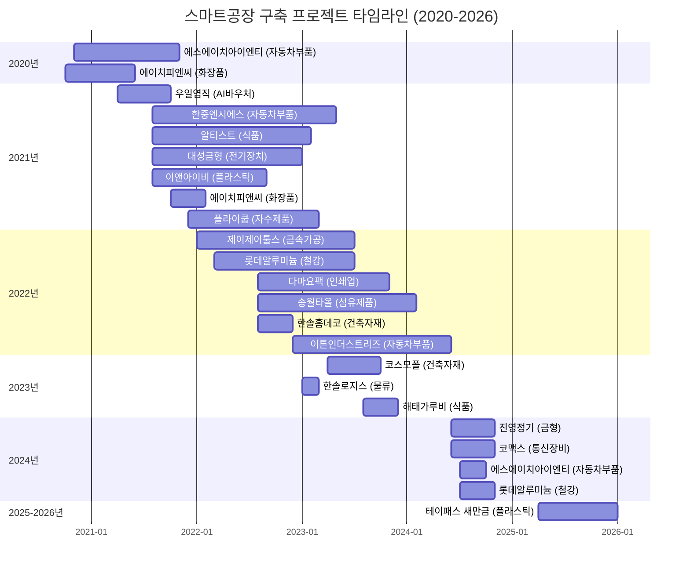

### 연도별 프로젝트 상세

#### 2020-2021년 (초기 품질 예측 엔진 개발)

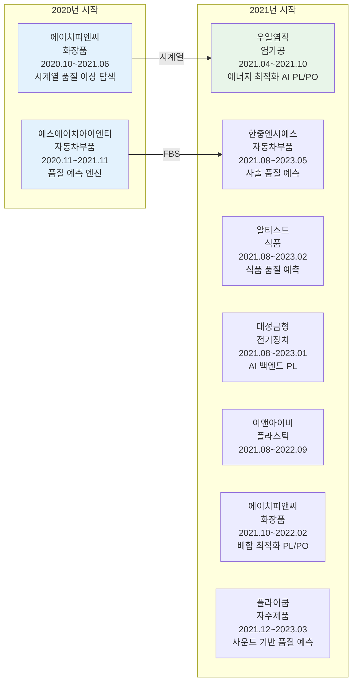

#### 2022-2023년 (데이터 분석 및 FBS 확산)

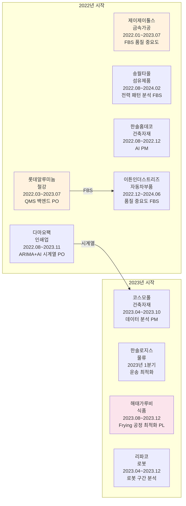

#### 2024-2026년 (고도화 및 CoCTK 납품)

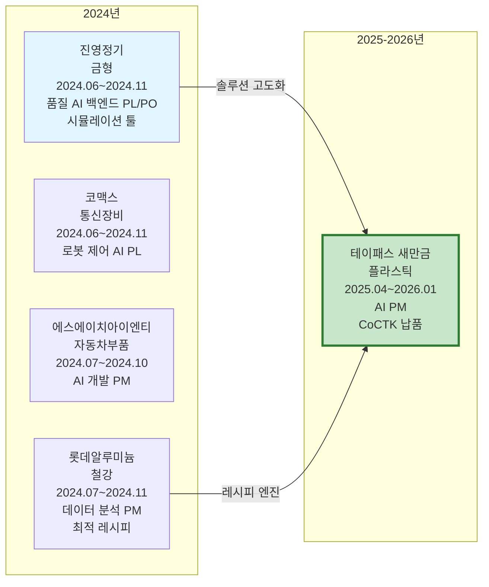

### 상세 프로젝트 목록

| 프로젝트명 | 기간 | 발주처 | 업종 | 역할 & 성과 |
|:---|:---|:---|:---|:---|
| **스마트공장 구축** (`project.sf.jinyoung`) | 2024-06~2024-11 | 진영정기 | 주형 및 금형 제조업 | **품질 AI 백엔드 PL/PO**: 시뮬레이션 툴 생성, 사용자 패턴 입력 시 품질 결과 예측 (OK/NG) |
| **스마트공장 구축** (`project.sf.shint_2024`) | 2024-07~2024-10 | 에스에이치아이엔티 | 자동차 부품 제조업 | **데이터 분석, AI 프로그램 개발 PM**: **AMS 풀 플랫폼 납품** (수집+분석+시각화), AX 모니터링 및 FMEA 시범 적용 |
| **정부일반형 스마트공장 구축사업** (`project.sf.teypas`) | 2025-04~2026-01 | 테이패스 새만금 | 플라스틱 시트 및 판 제조업 | **AI PM**: 품질 요구사항 확인, **CoCTK 시험 적용** (Vision-AMS 통합을 위한 초석 마련) |
| **스마트공장 구축** (`project.sf.eaton`) | 2022-12~2024-06 | 이튼인더스트리즈 | 자동차용 전용 신품 부품 판매업 | **품질 중요도 FBS**: 전력 패턴에 따른 주요 관리 순위 선정 및 알림값 설정 |
| **스마트공장 구축** (`project.sf.damayo`) | 2022-08~2023-11 | 다마요팩 | 오프셋 인쇄업 | **품질 예측 시계열 백엔드 PO**: ARIMA와 AI 시계열 엔진을 융복합한 예측엔진 개발 |
| **스마트공장 구축** (`project.sf.songwol`) | 2022-08~2024-02 | 송월타올수건이야기 | 섬유제품 제조업 | **품질 중요도 FBS**: 전력 패턴에 따른 주요 관리 순위 선정 및 알림값 설정 (패턴 룰) |
| **스마트공장 구축** (`project.sf.flycoupe`) | 2021-12~2023-03 | 플라이쿱 | 자수제품 및 자수용 재료 제조업 | **품질 AI 백엔드 PL/PO**: 주요 품질 지표(사운드)와 공정 정보를 연동하여 품질 결과 예측 |
| **스마트공장 구축** (`project.sf.jjtools`) | 2022-01~2023-07 | 제이제이툴스 | 금속 가공제품 제조업 | **품질 중요도 FBS**: 중요도에 따른 배치 및 그룹화 적용 |
| **스마트공장 구축** (`project.sf.hpnc_2021`) | 2021-10~2022-02 | 에이치피앤씨 | 화장품 제조업 | **품질 AI 백엔드 PL/PO**: 화장품 배합 비율 분석, 최적 분석 시간 도출 (시간대비) |
| **스마트공장 구축** (`project.sf.hanjung`) | 2021-08~2023-05 | 한중엔시에스 | 자동차 부품 제조업 | **품질 AI 백엔드 PL/PO**: 사출 조건에 따른 품질 예측 (RandomForest, XGBoost, AdaBoost 앙상블 적용) |
| **스마트공장 구축** (`project.sf.altist`) | 2021-08~2023-02 | 알티스트 | 식료품 제조업 | **품질 AI 백엔드 PL/PO**: 초기 데이터 상관관계 및 중요도 분석 (CoCTK 엔진의 초석) |
| **스마트공장 구축** (`project.sf.daesung`) | 2021-08~2023-01 | 대성금형 | 전기회로 개폐, 보호 장치 제조업 | **품질 AI 백엔드 PL**: 관리 프로그램 백엔드 개발, 사용자 조건 설정 및 예측, 중요도 모니터링, 제품별 품질 OUT 예측 |
| **스마트공장 구축** (`project.sf.enaivi`) | 2021-08~2022-09 | 이앤아이비 | 플라스틱 선, 봉, 관 및 호스 제조업 | **품질 중요도 FBS, 주요 순위 QMS 백엔드 PO, 데이터 분석** |
| **스마트공장 구축** (`project.sf.shint_2020`) | 2020-11~2021-11 | 에스에이치아이엔티 | 자동차 부품 제조업 | **품질 중요도 FBS**: 다단 클러스터링 및 짧은 정보 패턴 그룹화, 중요도 순 정렬 및 패턴 조건 알림값 설정 |
| **스마트공장 구축** (`project.sf.hpnc_2020`) | 2020-10~2021-06 | 에이치피앤씨 | 화장품 제조업 | **최적 품질 레시피 생성 PO/PL**: 시계열 예측(ARIMA, RNN)을 통한 품질 이상 징후 탐색 및 초기 예측 모델 개발 |
| **알미늄 진천/평택 스마트팩토리 확대 구축** (`project.sf.lotte_2024`) | 2024-07~2024-11 | 롯데알루미늄 | 철강 제조업 | **데이터 분석 PM**: 관리 라인/비관리 라인 비교 검증, **AI RMS (Rule Management System)** 개발을 위한 기틀 마련 및 최적 패턴/룰 검증 |
| **스마트공장 구축** (`project.sf.komax`) | 2024-06~2024-11 | 코맥스 | 유선통신장비 제조업 | **로봇 제어 방법 예측 AI PL** |
| **알미늄 진천/평택 스마트팩토리 확대 구축** (`project.sf.lotte_2022`) | 2022.3~2023.7 | 롯데알루미늄 | 철강 제조업 | **품질 중요도 FBS (PoC)**: 품질-전력 연결 분석, **SWC(Sliding Window Correlation)** 초기 도입 (생산 시점 동기화 시도했으나, 이후 패턴 분석과의 기능 중복으로 최적화/제외됨). **AMS 룰 생성 기여** (다단 클러스터링 기반 역전파 중요도) |
| **데이터 바우처** (`project.sf.cosmopol`) | 2023.4~2023.10 | 코스모폴 | 합성수지 제조/건축자재 도소매 | **데이터 분석, 품질 분석 PM**: 생산 공정 패턴 품질 분석, 정보량(Entropy) 기반 최적 패턴 도출 및 중요도 확정, 고객 커뮤니케이션 주도 |
| **AI바우처 지원사업** (`project.sf.wooil`) | 2021.4~2021.10 | 우일염직 | 염가공 | **AI PL/PO**: 에너지 다소비 설비 중심 맞춤형 제어, HMI 장비 탑재형 생산·에너지 최적화 AI SW 개발 실증, 센싱 데이터 전처리 기술 고도화, 최적 레시피 생성 및 설비/불량 이상 징후 탐지 기술 고도화 |
| **AI 문제해결 컨설팅 및 실증사업** (`project.sf.haetae`) | 2023.8~2023.12 | 해태가루비 | 식품 제조업 | **AI 백엔드 PL**: 품질향상을 위한 AI 기반 Frying 공정 작업조건/환경정보를 활용한 감자 칩 품질 상태 최적화 솔루션 실증, 알고리즘 기반 이상인지 알람 |
| **AI 솔루션 실증지원사업** (`project.sf.hansol_homedeco`) | 2022.8~2022.12 | (주)한솔홈데코 | 건축자재/고기능 소재 생산 제조업 | **AI PM**: 품질 관리 지표 논의 및 지정, 패턴 예측을 통한 모니터링 백엔드 개발 |
| **AI 과제** (`project.sf.hansol_logis`) | 2023년 1분기 | 한솔로지스 | 글로벌 물류, W&D, 컨테이너 운송 | **내부 엔진 개발 PO**: 내부 엔진 점검, 고객 니즈 확인, 고객 AI 요구사항 인터뷰, 운송 최적화 알고리즘 보안/수정 |

> [!TIP] **GS 인증 1등급 전략 (CoCTK/AMS)**
> "포기할 건 포기하고 잘하는 것에 집중한다."
> 관리자가 요구하는 필수 조건에 자원(Resource)을 집중하는 **실용주의적(Pragmatic)** 접근으로 대용량 데이터 처리와 예외 상황 방어를 성공적으로 통과함.

### 업종별 분포

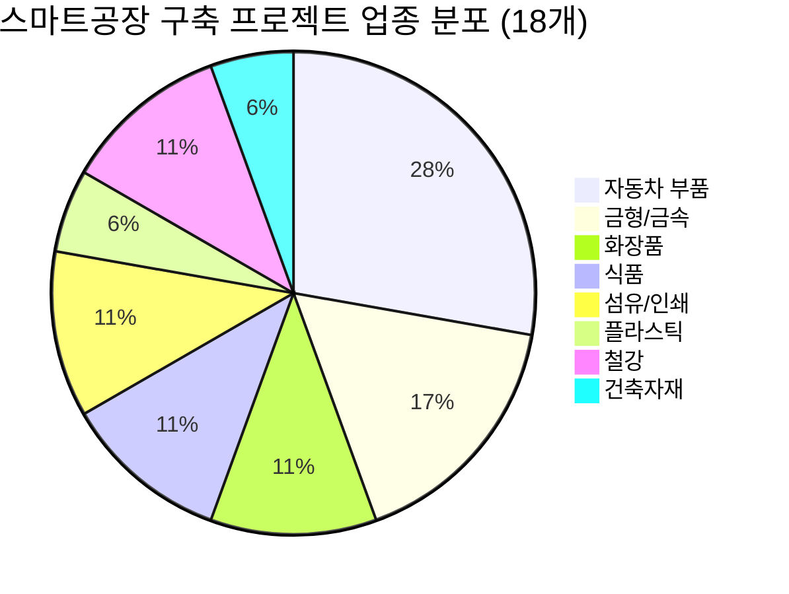

---

## 11. 미래 프로젝트: 사무 자동화 업그레이드 (`section.projects.future`)
| 프로젝트명 | 기간 | 핵심 기술 | 목표 |
|:---|:---|:---|:---|
| **사무 자동화 업그레이드 시스템** (`project.office_automation_upgrade`) | 2025~ 내부 개발 | ID 기반 온톨로지 맵, Phase 워크플로우 | 공장 이상 기록과 배경 정보를 Mix하여 사용자에게 **최적 해결책 추천 및 자동 보고서 생성** 시스템 구축 (AMS + Generative AI 통합) |

---

## 관련 문서

- [[00_Personal_Profile|개인 프로필 및 기술 철학]] (`page.portfolio.personal_profile`) - 개인 프로필 및 핵심 철학
- [[04_Academic_Publications|학술 논문 목록]] (`page.portfolio.academic`) - 상세한 논문 목록과 초록 정보
- [[Architecture_Overview|아키텍처 개요]] (`page.portfolio.architecture`) - 각 프로젝트의 상세 아키텍처와 구현 내용
- [[Testing_Context|테스트 컨텍스트]] (`page.portfolio.testing`) - 실증 및 검증 사례
- [[00_Portfolio_Index|포트폴리오 인덱스]] (`page.portfolio.index`) - 전체 포트폴리오 개요

---

## ID 참조

- **문서 ID**: `page.portfolio.projects`
- **섹션 ID**:
  - `section.projects.tech_evolution` - 기술 진화 계보 (Technology Evolution Lineage)
  - `section.projects.ai_analytics` - AI & Analytics Solutions
  - `section.projects.digital_platforms` - Digital Transformation Platforms
  - `section.projects.sensors_iot` - Smart Sensors & IoT
  - `section.projects.safety_energy` - Industrial Safety & Energy Optimization
  - `section.projects.healthcare` - Healthcare & Medical AI
  - `section.projects.ai_workflow` - AI Workflow & Automation Tools
  - `section.projects.consulting` - 컨설팅 및 데이터 분석 프로젝트
  - `section.projects.certification` - 인증 및 공모전
  - `section.projects.participated` - 참여 프로젝트 (탈락 포함)
  - `section.projects.smart_factory` - 스마트공장 구축 프로젝트 (18개, 중복 제거 후)
  - `section.projects.future` - 미래 프로젝트: 사무 자동화 업그레이드
- **프로젝트 ID**:
  - AI & Analytics: `project.ams`, `project.coctk`, `project.japan_dx`, `project.quality_prediction`, `project.defect_prediction`, `project.fbs`, `project.shint_quality_ai`, `project.injection_dx`
  - Digital Platforms: `project.dps`, `project.production_integration`, `project.pomia_dx_center`
  - Sensors & IoT: `project.smart_sensors`, `project.ai_composite_sensor`, `project.virtual_sensor`, `project.seah.data_integration`
  - Safety & Energy: `project.cleanroom_energy`, `project.energy_pattern`, `project.power_prediction`, `project.digital_twin_safety`, `project.power_quality`
  - Healthcare: `project.medical_constitution`
  - AI Workflow: `project.obsidian_design_origin`, `project.fmea_claude_agent`, `project.evaluation_framework`, `project.prompt_eval_claude_agent`, `project.pm_agent`, `project.virtual_company_creation_agent`, `project.business_document_generator`, `project.ai_db_tester`, `project.ontoflow_doc_processor`, `project.factory_ontology_manager_ai_agent`, `project.insight_ops`, `project.opsclaw`, `project.goose_architecture_analysis`
  - Consulting: `project.ripaco_consulting`, `project.coaaiti_nlp_chatbot`, `project.haetae_ai_solution`, `project.techwell_ams_consulting`, `project.shinsung_ams_consulting`, `project.techwell_databoucher`, `project.daesung_databoucher`, `project.podas_variable_generation`
  - Certification: `project.pds_gs_certification`, `project.tta_certification`, `project.smart_manufacturing_contest`
  - Participated: `project.hfr_aivoucher`, `project.infact_ai`
  - **Smart Factory** (18개, 중복 제거 후): `project.sf.jinyoung`, `project.sf.shint_2024`, `project.sf.teypas`, `project.sf.eaton`, `project.sf.damayo`, `project.sf.songwol`, `project.sf.flycoupe`, `project.sf.jjtools`, `project.sf.hpnc_2021`, `project.sf.hanjung`, `project.sf.altist`, `project.sf.daesung`, `project.sf.enaivi`, `project.sf.shint_2020`, `project.sf.hpnc_2020`, `project.sf.lotte_2024`, `project.sf.komax`, `project.sf.lotte_2022`, `project.sf.cosmopol`, `project.sf.wooil`, `project.sf.haetae`, `project.sf.hansol_homedeco`, `project.sf.hansol_logis`
  - Future: `project.office_automation_upgrade`
