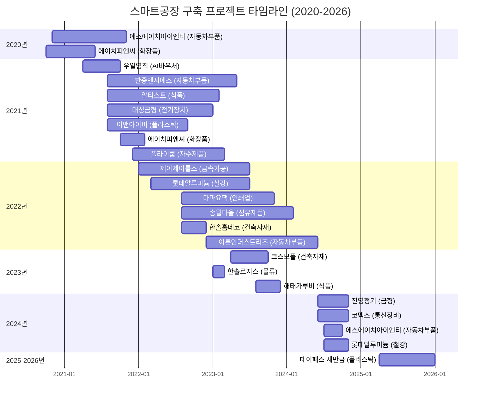
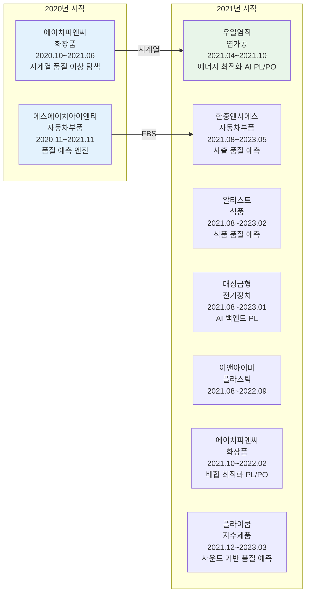
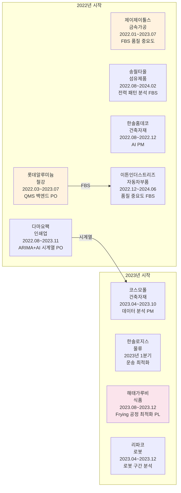
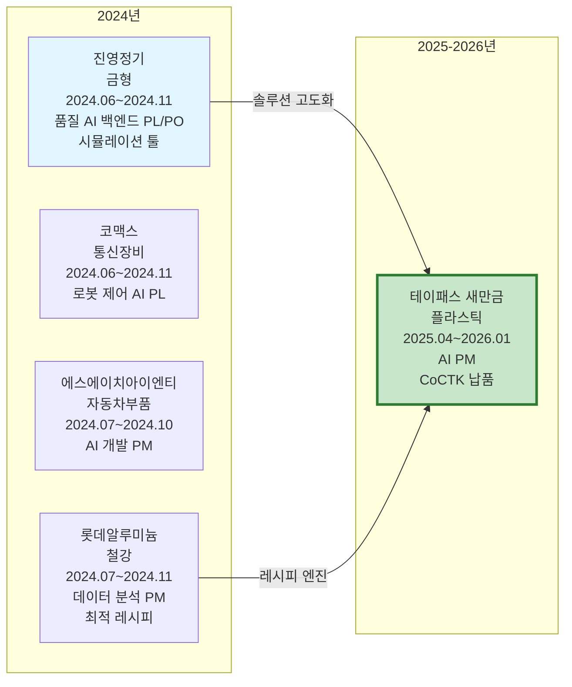
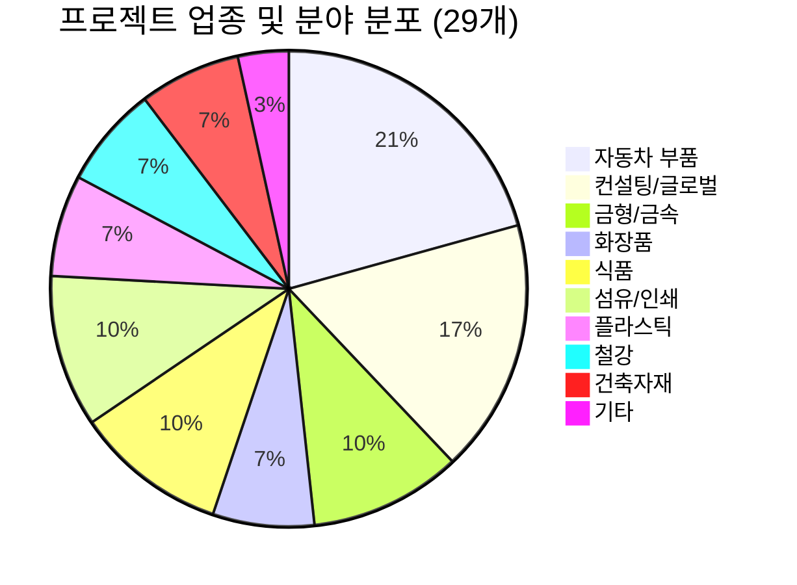

# 📊 Major Projects & Solutions Overview

**문서 ID**: `page.portfolio.projects`

PDF 포트폴리오 분석을 통해 확인된 30개 이상의 주요 프로젝트와 솔루션 요약입니다.

---

## 📅 연도별 프로젝트 종합 현황 (2020-2026)

> [!INFO] **총 프로젝트 현황**
> - **AI & Analytics**: 7개 (AMS, CoCTK, FBS 등)
> - **스마트공장 구축**: 23개 (에스에이치아이엔티, 롯데알루미늄 등)
> - **컨설팅**: 8개 (테크웰, 신성오토텍 등)
> - **AI 에이전트**: 9개 (FMEA, PM Agent 등)

---

## 📋 주요 수행 과제 및 기간

| 과제명 (프로젝트) | 수행 기간 | 지원/주관 기관 |
|:---|:---|:---|
| **고가센서 대체 가상센서** | 2021.05. ~ 2021.10. | 한국에너지기술평가원 |
| **클린룸 송풍기 제어** | 2021.04. ~ 2021.10. | 한국에너지기술평가원 |
| **전력 데이터 예측** | 2021.04. ~ 2021.11. | 정보통신산업진흥원 |
| **품질 이상 예측** | 2021.04. ~ 2021.11. | 정보통신산업진흥원 |
| **공정 불량 예측** | 2023.04. ~ 2023.10. | 정보통신산업진흥원 |
| **FBS (Fishbone Structure)** | 2020.09. ~ 2021.10. | 한국에너지기술평가원 |
| **한솔코에버 내부 프로그램 개발 (CoCTK)** | 2022.03. ~ 2023.09. | 중소기업기술정보진흥원 |
| **진료기록을 통한 체질 관리 시스템** | 2022.06. ~ 2022.10. | 한국데이터산업진흥원 | **NLP의 정량화 시도**: 비정형 진료 텍스트를 0/1 바이너리 테이블로 변환하여 네트워크 분석 및 체질 예측 (단순 워드클라우드 한계 극복) |
| **리파코 컨설팅** | 2023.04. ~ 2023.12. | 충북과학기술원 (산업 디지털 전환 지원체계 구축사업) |
| **코아아이티 자연어 처리 & 챗봇 컨설팅** | 2023.04. ~ 2023.12. | 충북과학기술원 (산업 디지털 전환 지원체계 구축사업) |
| **해태가루비 AI 솔루션 실증지원사업** | 2023. ~ 2024.02. | 해태가루비/더블유앤이케이 |

### 카테고리별 상세 설명

#### [가상 센서 및 제어 최적화]

**압축 사출 업체 고가센서 대체 가상센서 설계 및 구축** (2021)
- ML 기반 가상 센서 개발로 고가 센서를 저비용으로 대체
- 인증 완료, 비용 절감 성과 달성

**클린룸 송풍기 최적 제어 프로젝트 AI 엔진 개발 PM 및 논문 발표** (2021)
- 송풍기 최적 제어, 에너지 소비 패턴 분석
- 효율 20% 향상, 논문 발표 (2023)

#### [AI 예측 모델 개발]

**사출 업체 전력 데이터 및 품질 예측 AI 엔진 개발** (2021)
- 전력 소비 패턴 ML 예측, 시계열 분석
- PLC 변화 기반 패턴 분석

**다수 업체(사출, 도정, 금형 등) 품질 예측 AI 엔진 개발 및 고도화** (2021~2023)
- 사출/도정/금형 공정 품질 예측 모델 개발
- 불량률 감소 성과 달성

**진료기록을 통한 체질 분석** (2022)
- 한의원 진료 기록 기반 체질 예측 AI 시스템 개발
- 헬스케어 AI 적용

#### [데이터 분석 및 플랫폼 개발]

**오웰(일본)社 자동차 도정 공정 데이터 기반 인과 관계 다이어그램 AI 엔진 개발** (2020~2024)
- 패턴 최적 선택(정보량)과 계층 클러스터링 종합한 관계구조 생성
- 전사적 DX 가속화, 완료보고 및 산출물 작성, 논문 발표 (2022)

**한솔코에버 CoCTK 엔진 총괄 설계 및 화면설계 개발 PM 및 GS 1등급 취득** (2022~2024)
- 데이터 전처리, 상관관계 분석, 비용 최적화 엔진 개발
- GS 1등급 취득 (2024), 논문 발표 (2023)

**생산공정 에너지 및 설비 상태 데이터 패턴 분석 기반 라벨링 연구과제 메인 수행** (2023)
- 설비 상태 데이터 패턴 분석, 라벨링 시스템
- 에너지 효율화 기반 구축

**AI 종합 플랫폼 개발 총괄 PM 및 GS 1등급 취득** (2024~2025)
- 베이지안 네트워크 기반 이상 탐지 모델 개발, 이상탐지율 93.7% 달성
- GS 1등급 취득 (PDS 명칭), 특허 등록
- 세아특수강 포미아 DX 실증센터 구축 (PM), 테크웰/신성오토텍 AMS 컨설팅
- 2025년 솔루션 개발 완료, 논문 발표 (2025, 2024)

---

## 1. AI & Analytics Solutions (`section.projects.ai_analytics`)
| 프로젝트명 | 기간 / 발주처 | 핵심 기술 | 역할 & 성과 |
|:---|:---|:---|:---|
| **AMS (Analysis Management System)** (`project.ams`) | 2024.07~2025.12 한국산업기술진흥원 | 피쉬본 다이어그램 자동생성, FMEA 자동화, 베이지안 네트워크 | **AI 종합 플랫폼 개발 총괄 PM**, 확률 최적화(경사하강법 이용)를 통한 이상상황 확률 네트워크→시계열 분석에 대한 정보 온톨로지 output, 이상탐지율 93.7% (실질적 정확도 60~70%, 데이터 한계 고려), **GS 1등급 (PDS 명칭)**, 특허 등록, **세아특수강 포미아 DX 실증센터 구축 (PM)**, **테크웰/신성오토텍 AMS 컨설팅**, **2025년 솔루션 개발 완료**, **논문(2025, 2024)** |
| **CoCTK (Consulting Tool Kit)** (`project.coctk`) | 2022.03~2024 중소기업기술정보진흥원 | 데이터 전처리, 상관관계 분석, 비용 최적화 | **엔진 총괄 설계 & 화면설계 개발 총괄 PM**, **GS 1등급** 취득 (2024), **논문(2023)** |
| **오웰(일본)社 자동차 도정 공정** (`project.japan_dx`) | 2023.12~2025.03 O-WELL | 인과 관계 다이어그램 AI 엔진, 전문가 지식 통합 | 자동차 도정 공정 데이터 기반 인과 관계 다이어그램 AI 엔진 개발, 패턴 최적 선택(정보량)과 계층 클러스터링 종합한 관계구조 생성, 전사적 DX 가속화, 완료보고 및 산출물 작성, **논문(2022)** |
| **품질 예측 AI 엔진** (`project.quality_prediction`) | 2021~2023 정보통신산업진흥원 | 사출/도정/금형 공정 품질 예측 모델 | 다수 업체(사출, 도정, 금형 등) 품질 예측 AI 엔진 개발 및 고도화, 불량률 감소 |
| **공정 불량 예측** (`project.defect_prediction`) | 2023.04~2023.10 정보통신산업진흥원 | 공정 불량 예측 모델 | 공정 불량 예측 AI 엔진 개발 |
| **FBS (Fishbone Structure)** (`project.fbs`) | 2020.09~2021.10 한국에너지기술평가원 | 피쉬본 다이어그램 자동 생성 알고리즘 | FBS 엔진 초기 개발, AMS의 핵심 모듈로 발전 |
| **SHINT 사출공정 품질 AI 이상감지** (`project.shint_quality_ai`) | 2024.07~2025.01 중기부 제조 데이터 상품가공지원사업 | 사출공정 품질 AI, 이상감지 학습 데이터셋 | 데이터 분석 및 감리, 완료보고 작성 |

## 2. Digital Transformation Platforms (`section.projects.digital_platforms`)
| 프로젝트명 | 기간 / 발주처 | 핵심 기술 | 역할 & 성과 |
|:---|:---|:---|:---|
| **DPS (데이터수집시스템)** (`project.dps`) | 2021~2024 | 5층 아키텍처, Microservices, Neo4j 그래프DB | 금속산업 5대 공정 AI 자동화, **핵심 아키텍처 설계 및 개발 (PM 수행)**, **논문(2024)** |
| **생산정보 연계 통합 운영관리** (`project.production_integration`) | 2021~2022 | 생산-설비-환경-에너지 통합, 실시간 데이터 연계 | 제조 현장 디지털화 실증, **논문(2022)** |
| **지자체 DX 실증센터** (`project.dx_center`) | 2022~2023 | 개념 설계, 하이브리드 인프라 | 맞춤형 솔루션 기획 및 **PM 총괄** |
| **포미아 DX 실증센터 분석 플랫폼** (`project.pomia_dx_center`) | 2025.06~2025.10 ISTN에임즈 용역, 세아특수강 | 데이터 연동, POP 프로그램, 철강 5대공정 데이터 분석 | **PM 총괄**, 계획서 작성, 외주 관리, 완료서 작성 |
| **자동차 부품 사출 DX** (`project.injection_dx`) | 2021~2023 | 사출 파라미터 최적화, 공정 불량 예측 | 불량률 감소 및 비용 절감, **논문(2022)** |

## 3. Smart Sensors & IoT (`section.projects.sensors_iot`)
| 프로젝트명 | 기간 / 발주처 | 핵심 기술 | 역할 & 성과 |
|:---|:---|:---|:---|
| **보급형 스마트센서 3종** (`project.smart_sensors`) | 2022~2024 | 모듈화 센서, Modbus/OPC-UA | 소규모 제조기업 보급 최적화, **논문(2024)** |
| **AI 복합 센서** (`project.ai_composite_sensor`) | 2021~2023 | 에지 컴퓨팅(Edge AI), 가상 센서 | 데이터 전송량 감소, 실시간 이상 검출, **논문(2025)** |
| **고가센서 대체 가상센서** (`project.virtual_sensor`) | 2021.05~2021.10 한국에너지기술평가원 | **3-Type Virtual Sensors** (Pattern/Calculation/Prediction) | **가상 센서 기술 구현**:  1. **패턴 기반**: 패턴 분석 결과 자체를 센서값으로 활용  2. **연산 기반**: 이종 데이터 결합 계산  3. **예측 기반**: 백그라운드 정보(시뮬레이션 등)를 통해 부재한 물리 센서 값을 AI로 예측/모니터링 |
| **세아특수강 데이터 통합** (`project.seah.data_integration`) | 2025 | RS232C-LAN 변환, Lot 매칭 | 실시간 검사 자동화 구축 |

## 4. Industrial Safety & Energy Optimization (`section.projects.safety_energy`)
| 프로젝트명 | 기간 / 발주처 | 핵심 기술 | 역할 & 성과 |
|:---|:---|:---|:---|
| **산업용 클린룸 에너지 최적화** (`project.cleanroom_energy`) | 2021.04~2021.10 한국에너지기술평가원 | 송풍기 최적 제어, 에너지 소비 패턴 분석 | **AI 엔진 개발 총괄 PM**, 효율 20% 향상, **논문(2023)** |
| **생산공정 에너지 데이터 패턴 분석** (`project.energy_pattern`) | 2023 연구과제 | 설비 상태 데이터 패턴 분석, 라벨링 시스템 | **메인 수행**: 초기 백엔드 개발 → 풀스택 개발 및 총괄 PM으로 확장. **계층적 클러스터링(Hierarchical Clustering)** 도입 및 **패턴 민주주의(Pattern Voting)** 기법 고안. 이 구조적 분화와 투표 방식이 훗날 **AMS(이상탐지 시스템)**의 핵심 알고리즘 모체가 됨 |
| **전력 데이터 예측** (`project.power_prediction`) | 2021.04~2021.11 정보통신산업진흥원 | 전력 소비 패턴 ML 예측, 시계열 분석 | 사출 업체 전력 데이터 예측 AI 엔진 개발, PLC 변화 기반 패턴 분석 |
| **EV/ESS 디지털트윈 안전** (`project.digital_twin_safety`) | 2023~2024 | 가상 모델 매핑, 위험 식별 | 제조 공정 안전성 확보 및 사고 예방 |
| **전력품질 에너지 효율 플랫폼** (`project.power_quality`) | 2022~2023 | 전력 파라미터 실시간 분석 | 에너지 효율화 시장 확산 및 실증, **논문(2023)** |

> [!TIP] **현장이 곧 연구실 (Research in Field)**
> 총 10편의 학술 논문과 특허는 모두 **실제 프로젝트 현장의 데이터와 실증 결과**를 기반으로 작성되었습니다.
> 특히 초기 **개념적 특허(전무님 발의)**를 실제 작동하는 **알고리즘과 시스템으로 구체화(Concretization)**하여 현장에 적용하고 입증한 것이 핵심 성과입니다.

## 5. Healthcare & Medical AI (`section.projects.healthcare`)
| 프로젝트명 | 기간 / 발주처 | 핵심 기술 | 역할 & 성과 |
|:---|:---|:---|:---|
| **진료기록 체질 분석 시스템** (`project.medical_constitution`) | 2022.06~2022.10 한국데이터산업진흥원 | 진료기록 데이터 분석, 체질 패턴 ML 모델 | 한의원 진료 기록 기반 체질 예측 AI 시스템 개발, 헬스케어 AI 적용 |

## 6. AI Workflow & Automation Tools (`section.projects.ai_workflow`)
| 프로젝트명 | 기간 / 발주처 | 핵심 기술 | 역할 & 성과 |
|:---|:---|:---|:---|
| **Original_Development_Plan (Obsidian Design Origin)** (`project.obsidian_design_origin`) | 2020~2025 (집중 개발: 2025.5~7, 2025.8~10, 2025.10~12) 내부 개발 | ID 기반 온톨로지 맵, Phase 0-13 워크플로우, State 기반 정보 전달, 코드 에이전트 통합, 전문가 요약 시스템, 21개 development 프롬프트, **LangGraph/CrewAI 방식 워크플로우 오케스트레이션**, **상태 기반 진행 모니터링 및 완료 조건 판단 시스템**, **28개 Few-shot Rules System** (8개 도메인: design/api/database/component/state/security/performance/testing), **4단계 Testing Workflow** (Mock Setup → Unit → Integration → E2E), **규칙 이중 참조 구조** (설계 시 + 테스트 시 적용) | **전체 에이전트 시스템 설계 (PM 활동에서 문서, 개발 진행 관리에 활용)**, 코드 에이전트 + 문서 확인 + 프롬프트 보완 통합, 298개+ 설계 문서, 25개+ AI 프롬프트 체인, 21개 development 프롬프트(수정 관리 시스템 포함), 개발 에이전트 실시간 평가 시스템, **워크플로우 상태 모니터링 및 자동 복귀 로직**, **품질 관리 오케스트레이션**, 연속 개발 워크플로우, **Few-shot 규칙 기반 코드 품질 자동 검증**, **Mock 기반 테스트 자동화 워크플로우** |
| **FMEA 자동화 생성 시스템 (Claude Sub-Agent)** (`project.fmea_claude_agent`) | 2025.6~ 내부 개발 | Claude Code Task tool, Multi-Agent Workflow, 8개 Sub-Agent 협업 | **Master Orchestrator 설계**, 코딩 에이전트의 역설계 시스템 구조 적용, AIAG & VDA FMEA 표준 기반 범용 리스크 분석 시스템, Phase 0~5 자동화 워크플로우, **코드 에이전트에서 영감을 받은 전체 공장/회사/사무 자동화의 백정보 핵심**, **논문(2025)** |
| **Evaluation_Framework** (`project.evaluation_framework`) | 2025.10~ 내부 개발 | Python, FastAPI, LangGraph, React, Docker | **System-Wide Quality Assurance Layer**: 49개 Python 모듈과 298개 문서 전체를 전수 검사하는 거대 평가 엔진 (6가지 관점 평가 수행), 단순 프로젝트가 아닌 전체 아키텍처의 건전성을 책임짐 |
| **프롬프트 평가 엔진 (Claude Sub-Agent)** (`project.prompt_eval_claude_agent`) | 2025.6~ 내부 개발 | 구조화된 평가 프레임워크, 역할 기반 가중치, Human-in-the-Loop, 병렬 평가 구조, 17가지 역할별 가중치 시스템 | **AI Gatekeeper**: 모든 AI 생성물의 '입구'를 통제하는 심사관. **전체 프롬프트를 전수 평가**하는 시스템으로, 25개+ 프롬프트의 품질을 승인/반려하는 권한을 가짐. AI 생성 프롬프트를 다른 AI가 평가하는 이중 검증(Double-Check) 시스템. **3가지 핵심 차원(Quality, Consistency, Cost) 평가**, **MLOps Priority Matrix 기반 가중치(Structural 40%, Correctness 30%, Relevancy 20%, Tone 10%)**, **17가지 역할별 동적 가중치 적용**, **병렬 처리 구조(4개 메트릭 동시 평가)** |
| **PM Agent (Business Management Sub-Agent)** (`project.pm_agent`) | 2025.10~ 내부 개발 | MCP (Model Context Protocol), Docker, Claude Agent, HWP 파서 | **Execution Manager & Governance**: 사업 관리의 '전체 라이프사이클'을 관장. 1. **Risk Management**: 계약서/과업지시서 내 독소 조항 자동 추출 및 리스크 평가 2. **Schedule Tracking**: 회의록 분석을 통한 타임라인 자동 현행화 3. **Integrity Check**: 누락된 문서나 데이터 파편화를 방지하는 무결성 검증 |
| **Virtual Company Creation Agent** (`project.virtual_company_creation_agent`) | 2026.1.4~ 내부 개발 | Claude Agent, HQONS (Hyper-Quantum Omni-Net Structure), 하이퍼디멘션(HDC), MCP, Vector DB, GFS (Grape File System), Dual-Tier AI, PostgreSQL-Inspired Architecture, Decoupled Intelligence Architecture | **AI 에이전트로만 구성된 가상 기업 생성 시스템**: **"직원 225명 대신 빈 책상 225개 + 천재 직원 1명"** - **Decoupled Intelligence Architecture (지능과 상태의 분리)**: 225개의 빈 책상(포도송이/Grape Cluster)은 평소 Dormant 상태로 유지비 0원, 1명의 슈퍼 AI(거대 에이전트)가 필요한 순간 특정 책상으로 순간이동(Docking)하여 **O(1) 리소스로 O(N) 스케일링** 달성, **7단계 Chain Workflow** (Chain 01~07: Foundation → Organization → Agents → System Orchestrator → Protocol → Assembly → Crystallization), **15 Systems × 15 Sub-Agents = 225개 서브시스템**, **14 Layer 온톨로지 좌표 체계** (Strategic/Structural/Functional/Operational/Protocol), **🍇 GFS (Grape File System)**: AI 없이도 데이터 접근 가능한 파일 기반 NoSQL 구조로 **비용 87% 절감** (단순 조회 $0.01/요청 → $0), **🔐 Dual-Tier AI 아키텍처**: High-Spec AI (추론)와 Low-Spec AI (조회) 분리로 **최대 87% 비용 절감**, **🐘 PostgreSQL-Inspired 기능**: WAL (Write-Ahead Log), MVCC (Multi-Version Concurrency Control), Index, Vacuum으로 엔터프라이즈급 데이터 무결성 보장, **🎛️ Docking Protocol**: 거대 에이전트의 도킹 주기/모드 관리로 리소스 최적화, **🔧 Modular Execution Engine**: Full/Partial/Single/Resume 모드 지원으로 유연한 워크플로우 실행, **"Intelligence as a Service" Serverless Agent Orchestration**, **20개 이상 설계 문서 완료** (architecture 폴더: Blue_Print, Business_Summary, Process_Overview, Ontology_Overview, Grape_Cluster_Architecture, API_Design, Database_Design 등), **설계 단계 완료, 구현 기초 단계 진행 중**, **Platform All 통합 플랫폼 생태계 핵심 구성요소** |
| **Business Document Generator** (`project.business_document_generator`) | 2025.12~ 내부 개발 | Claude Agent, Multi-Step Chain Workflow, Role-based Expert Personas, Mermaid Diagram Generation, PDF Conversion | **사업계획서/제안서/착수보고서 자동 생성 시스템**: 요구조건 문서 및 Architecture 파일 파싱, 포트폴리오 스마트 매칭, 발주처 유형별 페르소나 적용(정부/민간/공공기관), 청크 기반 생성 및 PM 통합 검증, WBS 세부화, PDF 자동 변환, **사무 에이전트 핵심 도구** |
| **AI_DB_tester (VACTS)** (`project.ai_db_tester`) | 2026.1.7~ 내부 개발 | Python, 프롬프트 기반 테스트 자동화, Cursor IDE 통합, GFS 검증, LangGraph 기반 자연어 쿼리 | **Virtual Company Creation Agent 테스트 자동화**: 5가지 실행 모드 (Full Test, Simulation, Single Chain/System, I/O Test), **QUERY_AGENT**: 자연어 인터페이스로 테스트 실행 및 결과 조회, 자동 검증(GFS, 온톨로지, 스키마), 자동 리포트 생성, Cursor IDE 통합 |
| **Factory Ontology Manager AI Agent** (`project.factory_ontology_manager_ai_agent`) | 2026.1.8~ 내부 개발 | React, TypeScript, Flask, LangGraph, Instructor, AI_DB_center, 자연어 처리, DB Grounding, Ontology Mapping, Human-in-the-Loop | **자연어 기반 공정 문서 파싱 및 캔버스 레이아웃 자동 생성**: 공정 문서를 파싱하여 공장 데이터와 매핑, 캔버스 레이아웃 자동 생성, **핵심 기능**: 자연어 파싱, DB Grounding, Ontology Mapping, Spec-First Modification, **LangGraph V2**: 공정 재사용 로직, 자재 할당 개선, materialId 검증, factory_loader.py 개발, **비즈니스 가치**: 레이아웃 생성 시간 80% 단축, 데이터 일관성 향상 |

## 7. 컨설팅 및 데이터 분석 프로젝트 (`section.projects.consulting`)
| 프로젝트명 | 기간 / 발주처 | 핵심 기술 | 역할 & 성과 |
|:---|:---|:---|:---|
| **테크웰 AMS 컨설팅** (`project.techwell_ams_consulting`) | 2025.03~2025.07 포다스 용역 | 전력량 측정계 설치, 전력 모니터링 프로그램 | 컨설팅 진행 및 문서 작성 |
| **신성오토텍 AMS 컨설팅** (`project.shinsung_ams_consulting`) | 2025.03~2025.06 포다스 용역 | 사출기 데이터 수집, 사출 데이터 모니터링 프로그램 | 컨설팅 진행 및 문서 작성 |
| **테크웰 데이터바우처** (`project.techwell_databoucher`) | 2025.04~2025.11 밸리언트데이터 용역 | 전력 데이터 분석, 데이터 라벨링 | **PM**, 계획서 작성, 외주 관리, 완료서 작성 |
| **대성금형 데이터바우처** (`project.daesung_databoucher`) | 2025.04~2025.11 밸리언트데이터 용역 | 사출 데이터 분석, 데이터 라벨링 | **2차 PM**, 완료 관리 |
| **포다스 유의변수/가상변수 생성** (`project.podas_variable_generation`) | 2025.12~2026.01 (진행중, 2026.01.12 기준) 포다스 용역 | 유의변수 및 가상변수 생성, 드론 고장탐구 | 컨설팅 보고서 작성 |
| **리파코 컨설팅** (`project.ripaco_consulting`) | 2023.04~2023.12 충북과학기술원 주관 산업 디지털 전환 지원체계 구축사업 리파코 | 컨설팅 및 최종보고서 작성 | 산업 디지털 전환 지원체계 구축사업 일환으로 컨설팅 진행 및 최종보고서 작성 (2023.11.03 컨설팅 시작, 2023.12.26 최종보고서 완료) |
| **코아아이티 자연어 처리 & 챗봇 컨설팅** (`project.coaaiti_nlp_chatbot`) | 2023.04~2023.12 충북과학기술원 주관 산업 디지털 전환 지원체계 구축사업 코아아이티 | 자연어 처리, 챗봇 개발, 한약재/건강식품 데이터 분석, BERT 모델 생성, 공정 데이터 자연어 처리 | 산업 디지털 전환 지원체계 구축사업 일환으로 자연어 분석 및 챗봇 개발 컨설팅, 한약재 효과 및 주의사항 데이터 처리 (자연어처리_예제_231212_코아아이티.csv 기반 파이프라인), 공정 데이터 자연어 처리 (공정데이터.ipynb: 공정 기능 추출, 토큰화, 벡터화), BERT 기반 자연어 처리 모델 생성 및 학습 (자연어버트_모델_생성.ipynb: BertForSequenceClassification, DistilBERT 등 다양한 모델 실험) |
| **해태가루비 AI 솔루션 실증지원사업** (`project.haetae_ai_solution`) | 2023~2024.02 해태가루비/더블유앤이케이 | AI 솔루션 실증지원사업 | 2023년 AI 솔루션 실증지원사업 수행, 2024.02.02 완료보고서 작성 |

## 8. 인증 및 공모전 (`section.projects.certification`)
| 프로젝트명 | 기간 / 발주처 | 핵심 기술 | 역할 & 성과 |
|:---|:---|:---|:---|
| **PDS(AMS일부) GS 인증** (`project.pds_gs_certification`) | 2025.02~ 한국정보통신기술협회 | GS 인증 프로세스, 백엔드 AI 엔진 | 개발 PM, 백엔드 AI 엔진 개발 |
| **TTA 인증** (`project.tta_certification`) | 2025.01~ 한국정보통신기술협회 | TTA 인증 프로세스 | 대표 진행, 전체 관리 |
| **제조AI 솔루션 공모전** (`project.smart_manufacturing_contest`) | - 스마트제조혁신추진단 | 공모전 참여, 기술 발표 | 1차 선정 / 2차 탈락, 자료 생성, 발표 진행 |

## 9. 참여 프로젝트 (탈락 포함) (`section.projects.participated`)
| 프로젝트명 | 기간 / 발주처 | 수행 내용 | 결과 |
|:---|:---|:---|:---|
| **AI바우처 - HFR** (`project.hfr_aivoucher`) | 2024.03~2025.03 HFR (에치에프알) | 공장 내부 통신 업체, AI바우처 지원사업, PM(예정) | 2024.03.13~2024.03.14 사업계획서 작성 시작, 2025.03 발표 탈락 |
| **지능형 IoT 적용 확산 사업** (`project.dusol_iot`) | 2025.04~2025.12 두솔 | 한솔코에버측 대표 진행, 기술 발표 대응 | 발표 탈락 |
| **디지털 트윈 혁신서비스 선도** (`project.nextr_digitaltwin`) | 2025.05~2025.12 넥스터 | - | 서류 탈락 |
| **산업AI솔루션 실증확산지원사업** (`project.infact_ai`) | 2025.08~ 인팩이엠텍 | PM, 계획서 작성 | 초기 종료 (업체 사정) |
| **디지털기반 중소제조 산재예방 기술개발 지원사업** (`project.wnk_safety`) | 2025.09~ 더블유엔케이 | - | 발표 탈락 |
| **제조안전고도화기술개발** (`project.dongjin_safety`) | 2025.03~ 동진기업 | 기술 개발쪽 발표자료 작성, 기술 발표 대응 | 발표 탈락 |

## 10. 스마트공장 및 컨설팅 프로젝트 상세 (2020-2026) (`section.projects.smart_factory`)

> [!INFO] **2020~2026년 프로젝트 및 컨설팅 종합 실적**
> 제조 현장 구축부터 글로벌 솔루션, 데이터 분석 컨설팅까지 포함된 상세 리스트입니다. (총 29개 프로젝트)

### 연도별 프로젝트 현황

| 연도 | 구축/컨설팅 수 | 주요 발주처 | 핵심 솔루션 |
|:---|:---:|:---|:---|
| **2020** | 3 | O-WELL(일본), 에스에이치, 에이치피엔씨 | **AMS Origin**, FBS |
| **2021** | 7 | 한중엔시에스, 알티스트, 대성금형 등 | AI 백엔드, FBS |
| **2022** | 6 | 롯데알루미늄, 송월타올, 이튼 등 | SWC, 전력 패턴 분석 |
| **2023** | 6 | 해태가루비, 코스모폴, 리파코, 코아아이티 등 | CoCTK, NLP, 로봇 분석 |
| **2024** | 6 | 에스에이치(풀 플랫폼), 테크웰, 신성오토텍 등 | **AMS 플랫폼**, FMEA |
| **2025-26** | 1 | 테이패스 새만금 | **CoCTK 시험 적용** |

### 프로젝트 일정 (Gantt Chart)

### 연도별 프로젝트 상세

#### 2020-2021년 (초기 품질 예측 엔진 개발)

#### 2022-2023년 (데이터 분석 및 FBS 확산)

#### 2024-2026년 (고도화 및 CoCTK 납품)

### 상세 프로젝트 목록

| 프로젝트명 | 기간 | 발주처 | 업종 | 역할 & 성과 |
|:---|:---|:---|:---|:---|
| **스마트공장 구축** (`project.sf.jinyoung`) | 2024-06~2024-11 | 진영정기 | 주형 및 금형 제조업 | **품질 AI 백엔드 PL/PO**: 시뮬레이션 툴 생성, 사용자 패턴 입력 시 품질 결과 예측 (OK/NG) |
| **스마트공장 구축** (`project.sf.shint_2024`) | 2024-07~2024-10 | 에스에이치아이엔티 | 자동차 부품 제조업 | **데이터 분석, AI 프로그램 개발 PM**: **AMS 풀 플랫폼 납품** (수집+분석+시각화), AX 모니터링 및 FMEA 시범 적용 |
| **정부일반형 스마트공장 구축사업** (`project.sf.teypas`) | 2025-04~2026-01 | 테이패스 새만금 | 플라스틱 시트 및 판 제조업 | **AI PM**: 품질 요구사항 확인, **CoCTK 시험 적용** (Vision-AMS 통합을 위한 초석 마련) |
| **스마트공장 구축** (`project.sf.eaton`) | 2022-12~2024-06 | 이튼인더스트리즈 | 자동차용 전용 신품 부품 판매업 | **품질 중요도 FBS**: 전력 패턴에 따른 주요 관리 순위 선정 및 알림값 설정 |
| **스마트공장 구축** (`project.sf.damayo`) | 2022-08~2023-11 | 다마요팩 | 오프셋 인쇄업 | **품질 예측 시계열 백엔드 PO**: ARIMA와 AI 시계열 엔진을 융복합한 예측엔진 개발 |
| **스마트공장 구축** (`project.sf.songwol`) | 2022-08~2024-02 | 송월타올수건이야기 | 섬유제품 제조업 | **품질 중요도 FBS**: 전력 패턴에 따른 주요 관리 순위 선정 및 알림값 설정 (패턴 룰) |
| **스마트공장 구축** (`project.sf.flycoupe`) | 2021-12~2023-03 | 플라이쿱 | 자수제품 및 자수용 재료 제조업 | **품질 AI 백엔드 PL/PO**: 주요 품질 지표(사운드)와 공정 정보를 연동하여 품질 결과 예측 |
| **스마트공장 구축** (`project.sf.jjtools`) | 2022-01~2023-07 | 제이제이툴스 | 금속 가공제품 제조업 | **품질 중요도 FBS**: 중요도에 따른 배치 및 그룹화 적용 |
| **스마트공장 구축** (`project.sf.hpnc_2021`) | 2021-10~2022-02 | 에이치피앤씨 | 화장품 제조업 | **품질 AI 백엔드 PL/PO**: 화장품 배합 비율 분석, 최적 분석 시간 도출 (시간대비) |
| **스마트공장 구축** (`project.sf.hanjung`) | 2021-08~2023-05 | 한중엔시에스 | 자동차 부품 제조업 | **품질 AI 백엔드 PL/PO**: 사출 조건에 따른 품질 예측 (RandomForest, XGBoost, AdaBoost 앙상블 적용) |
| **스마트공장 구축** (`project.sf.altist`) | 2021-08~2023-02 | 알티스트 | 식료품 제조업 | **품질 AI 백엔드 PL/PO**: 초기 데이터 상관관계 및 중요도 분석 (CoCTK 엔진의 초석) |
| **스마트공장 구축** (`project.sf.daesung`) | 2021-08~2023-01 | 대성금형 | 전기회로 개폐, 보호 장치 제조업 | **품질 AI 백엔드 PL**: 관리 프로그램 백엔드 개발, 사용자 조건 설정 및 예측, 중요도 모니터링, 제품별 품질 OUT 예측 |
| **스마트공장 구축** (`project.sf.enaivi`) | 2021-08~2022-09 | 이앤아이비 | 플라스틱 선, 봉, 관 및 호스 제조업 | **품질 중요도 FBS, 주요 순위 QMS 백엔드 PO, 데이터 분석** |
| **스마트공장 구축** (`project.sf.shint_2020`) | 2020-11~2021-11 | 에스에이치아이엔티 | 자동차 부품 제조업 | **품질 중요도 FBS**: 다단 클러스터링 및 짧은 정보 패턴 그룹화, 중요도 순 정렬 및 패턴 조건 알림값 설정 |
| **스마트공장 구축** (`project.sf.hpnc_2020`) | 2020-10~2021-06 | 에이치피앤씨 | 화장품 제조업 | **최적 품질 레시피 생성 PO/PL**: 시계열 예측(ARIMA, RNN)을 통한 품질 이상 징후 탐색 및 초기 예측 모델 개발 |
| **알미늄 진천/평택 스마트팩토리 확대 구축** (`project.sf.lotte_2024`) | 2024-07~2024-11 | 롯데알루미늄 | 철강 제조업 | **데이터 분석 PM**: 관리 라인/비관리 라인 비교 검증, **AI RMS (Rule Management System)** 개발을 위한 기틀 마련 및 최적 패턴/룰 검증 |
| **스마트공장 구축** (`project.sf.komax`) | 2024-06~2024-11 | 코맥스 | 유선통신장비 제조업 | **로봇 제어 방법 예측 AI PL** |
| **알미늄 진천/평택 스마트팩토리 확대 구축** (`project.sf.lotte_2022`) | 2022.3~2023.7 | 롯데알루미늄 | 철강 제조업 | **품질 중요도 FBS (PoC)**: 품질-전력 연결 분석, **SWC(Sliding Window Correlation)** 초기 도입 (생산 시점 동기화 시도했으나, 이후 패턴 분석과의 기능 중복으로 최적화/제외됨). **AMS 룰 생성 기여** (다단 클러스터링 기반 역전파 중요도) |
| **데이터 바우처** (`project.sf.cosmopol`) | 2023.4~2023.10 | 코스모폴 | 합성수지 제조/건축자재 도소매 | **데이터 분석, 품질 분석 PM**: 생산 공정 패턴 품질 분석, 정보량(Entropy) 기반 최적 패턴 도출 및 중요도 확정, 고객 커뮤니케이션 주도 |
| **AI바우처 지원사업** (`project.sf.wooil`) | 2021.4~2021.10 | 우일염직 | 염가공 | **AI PL/PO**: 에너지 다소비 설비 중심 맞춤형 제어, HMI 장비 탑재형 생산·에너지 최적화 AI SW 개발 실증, 센싱 데이터 전처리 기술 고도화, 최적 레시피 생성 및 설비/불량 이상 징후 탐지 기술 고도화 |
| **AI 문제해결 컨설팅 및 실증사업** (`project.sf.haetae`) | 2023.8~2023.12 | 해태가루비 | 식품 제조업 | **AI 백엔드 PL**: 품질향상을 위한 AI 기반 Frying 공정 작업조건/환경정보를 활용한 감자 칩 품질 상태 최적화 솔루션 실증, 알고리즘 기반 이상인지 알람 |
| **AI 솔루션 실증지원사업** (`project.sf.hansol_homedeco`) | 2022.8~2022.12 | (주)한솔홈데코 | 건축자재/고기능 소재 생산 제조업 | **AI PM**: 품질 관리 지표 논의 및 지정, 패턴 예측을 통한 모니터링 백엔드 개발 |
| **테크웰 AMS 컨설팅** (`project.sf.techwell_ams`) | 2024.01~2024.12 | 테크웰 | 전력 모니터링 | **데이터 분석 PM (FMEA)**: 전력 데이터 분석 및 공정 전문가 인터뷰를 통해 **FMEA(고장모드 및 영향분석) 문서 생성** 및 관리 체계 구축. (AI보다는 고객이 선호하는 시계열 문제 상황 분석에 집중) |
| **신성오토텍 AMS 컨설팅** (`project.sf.shinsung_ams`) | 2024.01~2024.12 | 신성오토텍 | 사출/성형 | **데이터 분석 PM (FMEA)**: 사출 데이터 기반 FMEA 문서화 및 커뮤니케이션 주도. 관리자가 직관적으로 이해할 수 있는 시간별 문제 상황 시각화 제공 |
| **리파코 컨설팅** (`project.sf.ripaco`) | 2023.04~2023.12 | 리파코 | 로봇/자동화 | **데이터 분석 컨설팅**: 로봇의 구간별 동작 데이터 분석을 통해 오류/누락 구간 탐지. 실제 관리자 경험과 데이터가 일치함을 검증하며 **AMS 최적 패턴 분석의 초석 마련** |
| **코아아이티 자연어 처리** (`project.sf.coreit`) | 2023.04~2023.12 | 코아아이티 | IT/SW | **NLP 챗봇 컨설팅**: 재료 정보를 채팅으로 확인하는 챗봇 구축. Word Cloud 시각화의 한계를 극복하고 테이블 데이터 변환 분석 시도 |
| **O-WELL DX 엔진 개발** (`project.global.owell`) | 2020.01~2024.12 | O-WELL (일본) | 도료/화학 | **AMS의 기원 (Origin)**: 4년간 초기 개발부터 총괄 PM까지 수행. **계층적 클러스터링(Hierarchical Clustering)**과 **패턴 민주주의(Pattern Voting)** 기법을 고안하여 AMS의 핵심 알고리즘 베이스 구축 |
| **AI 과제** (`project.sf.hansol_logis`) | 2023년 1분기 | 한솔로지스 | 글로벌 물류, W&D, 컨테이너 운송 | **내부 엔진 개발 PO**: 내부 엔진 점검, 고객 니즈 확인, 고객 AI 요구사항 인터뷰, 운송 최적화 알고리즘 보안/수정 |

> [!TIP] **GS 인증 1등급 전략 (CoCTK/AMS)**
> "포기할 건 포기하고 잘하는 것에 집중한다."
> 관리자가 요구하는 필수 조건에 자원(Resource)을 집중하는 **실용주의적(Pragmatic)** 접근으로 대용량 데이터 처리와 예외 상황 방어를 성공적으로 통과함.

### 업종별 분포

---

## 11. 미래 프로젝트: 사무 자동화 업그레이드 (`section.projects.future`)
| 프로젝트명 | 기간 | 핵심 기술 | 목표 |
|:---|:---|:---|:---|
| **사무 자동화 업그레이드 시스템** (`project.office_automation_upgrade`) | 2025~ 내부 개발 | ID 기반 온톨로지 맵, Phase 워크플로우 | 공장 이상 기록과 배경 정보를 Mix하여 사용자에게 **최적 해결책 추천 및 자동 보고서 생성** 시스템 구축 (AMS + Generative AI 통합) |

---

## 관련 문서

- [[00_Personal_Profile|개인 프로필 및 기술 철학]] (`page.portfolio.personal_profile`) - 개인 프로필 및 핵심 철학
- [[04_Academic_Publications|학술 논문 목록]] (`page.portfolio.academic`) - 상세한 논문 목록과 초록 정보
- [[Architecture_Overview|아키텍처 개요]] (`page.portfolio.architecture`) - 각 프로젝트의 상세 아키텍처와 구현 내용
- [[Testing_Context|테스트 컨텍스트]] (`page.portfolio.testing`) - 실증 및 검증 사례
- [[00_Portfolio_Index|포트폴리오 인덱스]] (`page.portfolio.index`) - 전체 포트폴리오 개요

---

## ID 참조

- **문서 ID**: `page.portfolio.projects`
- **섹션 ID**:
  - `section.projects.ai_analytics` - AI & Analytics Solutions
  - `section.projects.digital_platforms` - Digital Transformation Platforms
  - `section.projects.sensors_iot` - Smart Sensors & IoT
  - `section.projects.safety_energy` - Industrial Safety & Energy Optimization
  - `section.projects.healthcare` - Healthcare & Medical AI
  - `section.projects.ai_workflow` - AI Workflow & Automation Tools
  - `section.projects.consulting` - 컨설팅 및 데이터 분석 프로젝트
  - `section.projects.certification` - 인증 및 공모전
  - `section.projects.participated` - 참여 프로젝트 (탈락 포함)
  - `section.projects.smart_factory` - 스마트공장 구축 프로젝트 (23개)
  - `section.projects.future` - 미래 프로젝트: 사무 자동화 업그레이드
- **프로젝트 ID**:
  - AI & Analytics: `project.ams`, `project.coctk`, `project.japan_dx`, `project.quality_prediction`, `project.defect_prediction`, `project.fbs`, `project.shint_quality_ai`
  - Digital Platforms: `project.dps`, `project.production_integration`, `project.dx_center`, `project.pomia_dx_center`, `project.injection_dx`
  - Sensors & IoT: `project.smart_sensors`, `project.ai_composite_sensor`, `project.virtual_sensor`, `project.seah.data_integration`
  - Safety & Energy: `project.cleanroom_energy`, `project.energy_pattern`, `project.power_prediction`, `project.digital_twin_safety`, `project.power_quality`
  - Healthcare: `project.medical_constitution`
  - AI Workflow: `project.obsidian_design_origin`, `project.fmea_claude_agent`, `project.evaluation_framework`, `project.prompt_eval_claude_agent`, `project.pm_agent`, `project.virtual_company_creation_agent`, `project.business_document_generator`, `project.ai_db_tester`, `project.factory_ontology_manager_ai_agent`
  - Consulting: `project.ripaco_consulting`, `project.coaaiti_nlp_chatbot`, `project.haetae_ai_solution`, `project.techwell_ams_consulting`, `project.shinsung_ams_consulting`, `project.techwell_databoucher`, `project.daesung_databoucher`, `project.podas_variable_generation`
  - Certification: `project.pds_gs_certification`, `project.tta_certification`, `project.smart_manufacturing_contest`
  - Participated: `project.hfr_aivoucher`, `project.dusol_iot`, `project.nextr_digitaltwin`, `project.infact_ai`, `project.wnk_safety`, `project.dongjin_safety`
  - **Smart Factory** (23개): `project.sf.jinyoung`, `project.sf.shint_2024`, `project.sf.teypas`, `project.sf.eaton`, `project.sf.damayo`, `project.sf.songwol`, `project.sf.flycoupe`, `project.sf.jjtools`, `project.sf.hpnc_2021`, `project.sf.hanjung`, `project.sf.altist`, `project.sf.daesung`, `project.sf.enaivi`, `project.sf.shint_2020`, `project.sf.hpnc_2020`, `project.sf.lotte_2024`, `project.sf.komax`, `project.sf.lotte_2022`, `project.sf.cosmopol`, `project.sf.wooil`, `project.sf.haetae`, `project.sf.hansol_homedeco`, `project.sf.hansol_logis`
  - Future: `project.office_automation_upgrade`
