# 학술 연구 및 논문 성과 (Academic Publications)

**문서 ID**: `page.portfolio.academic`

본 문서는 사용자의 기술적 전문성을 학술적으로 뒷받침하는 연구 성과들을 정리한 것입니다. 특히 2020년부터 현재까지 발표된 논문들은 AI, 스마트 공장, 에너지 최적화 분야의 실증적 근거를 제공합니다.

## 핵심 연구 분야
- **제조 AI 및 이상 진단**: 피쉬본 모델, 확률 네트워크 기반의 설비 상태 추론 및 자동화.
- **에너지 최적화**: 송풍 설비 및 전력 패턴 분석을 통한 에너지 절감 실증.
- **데이터 분석 및 예측**: 머신러닝 기반 품질 예측 및 데이터 밸런스 문제 해결.

---

## 주요 논문 목록 (2020 - 2025)

| 발행일 | 논문 제목 | 학술지/학회 | 핵심 성과 및 프로젝트 연계 |
| :--- | :--- | :--- | :--- |
| 2025.12 | **분석 상관/확률 네트워크 최적 경로 정보 및 공정 관리 문서 기반 FMEA 생성 연구** | KSFM 2025년도 동계학술대회 | [FMEA 자동화/복합센서/AMS] 상관/확률 네트워크 최적 경로 분석 기반 FMEA 자동 생성 기술 검증, AMS 결과 표시 LLM agent (GPT OSS) 개발 및 포미아 납품 적용 |
| 2025.06 | **AI를 활용한 구조와 룰을 활용한 구조-확률 종합 네트워크 및 최적 관리 방안 도출** | 한국유체기계학회 | [AMS] 피쉬본 AI 모델의 학술적 고도화 및 최적 관리 로직 증명 |
| 2024.12 | **공장 운영 핵심 요소의 식별 및 최적화를 위한 클러스터링 기법 적용** | 한국생산제조학회 | [DPS] 공장 운영 데이터의 다차원 분석 및 디지털 트윈 최적화 근거 |
| 2024.12 | **설비 이상상태 기반 최적 공정 데이터 추론 및 위험/안전 관리 최적 자동화** | 한국유체기계학회 | [AMS] 실시간 이상 상태 기반 위험 관리 알고리즘의 유효성 검증 |
| 2024.07 | **전력 데이터를 통한 설비 상태 추론 및 이상 상황 설정 예측** | 한국유체기계학회 | [에너지/센서] 전력 데이터 기반의 설비 예지 보전 기술 실증 |
| 2023.12 | **송풍 설비 변동부하 대응 전력품질 분석 및 에너지 절감 연구** | 한국유체기계학회 | [에너지 최적화] 에너지 20% 절감 실증 솔루션의 핵심 물리 분석 모델 |
| 2023.12 | **압축기 공정에서 데이터 밸런스 문제 해결 및 품질 결과 사전 예측을 위한 AI 시스템** | 한국유체기계학회 | [AI/데이터] 소량의 불량 데이터 극복을 위한 AI 학습 모델 연구 |
| 2023.07 | **생산공정 에너지 및 설비 상태 진단을 위한 AI기반의 전력 사용 패턴 및 SOH분석** | 한국유체기계학회 | [에너지/전력] 설비 건전성(SOH) 진단 및 에너지 효율화 융합 기술 |
| 2022.12 | **자동차 부품 생산 산업을 위한 머신러닝 기반의 품질예측 알고리즘** | 한국생산제조학회 | [AI/제조] 세아베스틸 등 자동차 부품 공정 품질 예측 모델의 기초 |
| 2022.06 | **ICT 융복합 기술을 활용한 스마트 공장 및 에너지 절감 솔루션 적용 사례** | 한국유체기계학회 | [Global DX] 일본 도료기업 등 글로벌 스마트 공장 구축 사례의 실증 |

---

## 논문 간 기술 발전 관계

논문들은 기술 발전 흐름에 따라 5개 계열로 그룹화됩니다:

```mermaid
graph TB
    subgraph "1. 피쉬본/확률 네트워크 계열"
        FBS["FBS 기초<br/>2020"]
        AIFishbone["AI 피쉬본 클러스터링<br/>공장 운영 핵심 요소 식별<br/>2024.12"]
        AMSProb["AMS 확률 네트워크<br/>설비 이상상태 기반<br/>2024.12"]
        StructProb["구조-확률 종합 네트워크<br/>2025.06"]
        FMEAGen["FMEA 생성<br/>상관/확률 네트워크 최적 경로<br/>2025.12"]
        
        FBS -->|"피쉬본 자동화"| AIFishbone
        AIFishbone -->|"클러스터링 기법"| AMSProb
        AMSProb -->|"확률 네트워크 고도화"| StructProb
        StructProb -->|"최적 경로 분석"| FMEAGen
    end
    
    subgraph "2. 에너지 최적화 계열"
        PowerSOH["전력 패턴 SOH<br/>2023.07"]
        PowerData["전력 데이터<br/>2024.07"]
        EnergySave["에너지 절감<br/>2023.12"]
        
        PowerSOH -->|"건전성 진단"| PowerData
        PowerData -->|"설비 상태 추론"| EnergySave
    end
    
    subgraph "3. 데이터 분석 계열"
        QualityPred["품질 예측<br/>2022.12"]
        DataBalance["데이터 밸런스<br/>2023.12"]
        
        QualityPred -->|"불량 데이터 극복"| DataBalance
    end
    
    subgraph "4. 센서/설비 계열"
        PowerData2["전력 데이터<br/>2024.07"]
        EquipmentState["설비 상태 추론<br/>2024.07"]
        RiskMgmt["이상상태 위험 관리<br/>2024.12"]
        
        PowerData2 -->|"예지 보전"| EquipmentState
        EquipmentState -->|"자동화"| RiskMgmt
    end
    
    subgraph "5. 통합 플랫폼 계열"
        SmartFactory["스마트 공장<br/>2022.06"]
        DPS["DPS 공장 운영<br/>2024.12"]
        
        SmartFactory -->|"디지털 트윈"| DPS
    end
    
    style FMEAGen fill:#e74c3c,color:#fff
    style StructProb fill:#3498db,color:#fff
    style AMSProb fill:#9b59b6,color:#fff
    style AIFishbone fill:#e67e22,color:#fff
    style EnergySave fill:#27ae60,color:#fff
```

### 기술 발전 흐름 설명

**1. 피쉬본/확률 네트워크 계열** (핵심 기술 발전)
- **FBS (2020)**: 피쉬본 다이어그램 자동 생성 알고리즘의 기초
- **AI 피쉬본 클러스터링 (2024.12)**: 공장 운영 핵심 요소 식별을 위한 클러스터링 기법 적용
- **AMS 확률 네트워크 (2024.12)**: 설비 이상상태 기반 최적 공정 데이터 추론 및 위험/안전 관리 자동화
- **구조-확률 종합 네트워크 (2025.06)**: 구조와 룰을 활용한 종합 네트워크 및 최적 관리 방안 도출
- **FMEA 생성 (2025.12)**: 상관/확률 네트워크 최적 경로 정보 및 공정 관리 문서 기반 FMEA 자동 생성

**2. 에너지 최적화 계열**
- 전력 사용 패턴 및 SOH 분석을 통한 설비 건전성 진단
- 전력 데이터 기반 설비 상태 추론 및 이상 상황 예측
- 송풍 설비 변동부하 대응을 통한 에너지 절감 실증

**3. 데이터 분석 계열**
- 머신러닝 기반 품질 예측 알고리즘 개발
- 소량의 불량 데이터 극복을 위한 데이터 밸런스 문제 해결

**4. 센서/설비 계열**
- 전력 데이터를 통한 설비 상태 추론 및 예지 보전 기술
- 실시간 이상 상태 기반 위험 관리 알고리즘 자동화

**5. 통합 플랫폼 계열**
- ICT 융복합 기술을 활용한 스마트 공장 구축
- 공장 운영 핵심 요소 식별 및 최적화를 위한 다차원 분석

---

## 연구 성과의 시사점
1. **기술적 신뢰도 확보**: 단순히 솔루션을 구축하는 것에 그치지 않고, 그 기저의 알고리즘과 방법론을 학술적으로 검증받았습니다.
2. **현장 밀착형 연구**: 모든 연구는 실제 제조 현장의 데이터(전력, 진동, 공정 로그 등)를 기반으로 수행되어 즉각적인 산업 적용이 가능합니다.
3. **지속적인 혁신**: 2022년부터 2025년까지 매년 2~3편의 논문을 꾸준히 발표하며 최신 AI 트렌드를 제조 산업에 이식하고 있습니다.

---

## 관련 문서

- [[02_Projects_Overview|프로젝트 개요]] (`page.portfolio.projects`) - 논문과 연계된 프로젝트 상세 정보
- [[Architecture_Overview|아키텍처 개요]] (`page.portfolio.architecture`) - 논문에서 다룬 기술의 아키텍처 상세
- [[Testing_Context|테스트 컨텍스트]] (`page.portfolio.testing`) - 논문의 실증 사례
- [[00_Portfolio_Index|포트폴리오 인덱스]] (`page.portfolio.index`) - 전체 포트폴리오 개요

---

## ID 참조

- **문서 ID**: `page.portfolio.academic`
- **관련 프로젝트**: `project.ams`, `project.dps`, `project.coctk` 등
- **관련 문서**: `page.portfolio.*`
