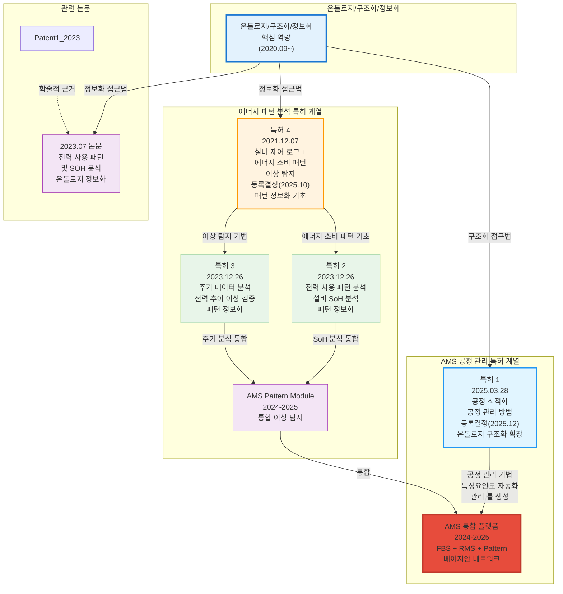

# 학술 연구 및 논문 성과 (Academic Publications)

**문서 ID**: `page.portfolio.academic`

본 문서는 사용자의 기술적 전문성을 학술적으로 뒷받침하는 연구 성과들을 정리한 것입니다. 특히 2020년부터 현재까지 발표된 논문들은 AI, 스마트 공장, 에너지 최적화 분야의 실증적 근거를 제공합니다.

## 핵심 연구 분야
- **제조 AI 및 이상 진단**: 피쉬본 모델, 확률 네트워크 기반의 설비 상태 추론 및 자동화.
- **에너지 최적화**: 송풍 설비 및 전력 패턴 분석을 통한 에너지 절감 실증.
- **데이터 분석 및 예측**: 머신러닝 기반 품질 예측 및 데이터 밸런스 문제 해결.

> [!TIP] **현장이 곧 연구실 (Research in Field)**
> 총 10편의 학술 논문과 **4건의 특허 출원**은 모두 **실제 프로젝트 현장의 데이터와 실증 결과**를 기반으로 작성되었습니다.
> 특히 초기 **개념적 특허(전무님 발의)**를 실제 작동하는 **알고리즘과 시스템으로 구체화(Concretization)**하여 현장에 적용하고 입증한 것이 핵심 성과입니다. 에너지 패턴 분석 분야에서 **권순룡이 직접 연구·개발한 기술**을 기반으로 3건의 특허를 출원했으며, AMS 프로젝트의 핵심 기술을 1건의 특허로 추가 출원하여 총 4건의 특허로 지식 재산권을 확보했습니다.

---

## 주요 논문 목록 (2020 - 2025)

| 발행일 | 논문 제목 | 학술지/학회 | 핵심 성과 및 프로젝트 연계 |
| :--- | :--- | :--- | :--- |
| 2025.12 | **분석 상관/확률 네트워크 최적 경로 정보 및 공정 관리 문서 기반 FMEA 생성 연구** | KSFM 2025년도 동계학술대회 | **온톨로지 정보화의 연장선**: 구조화된 정보를 LLM에 제공하여 활용하는 온톨로지 정보화의 연장선. [FMEA 자동화/복합센서/AMS] 상관/확률 네트워크 최적 경로 분석 기반 FMEA 자동 생성 기술 검증, AMS 결과 표시 LLM agent (GPT OSS) 개발 및 포미아 납품 적용 |
| 2025.06 | **AI를 활용한 구조와 룰을 활용한 구조-확률 종합 네트워크 및 최적 관리 방안 도출** | 한국유체기계학회 | **온톨로지 구조화의 고도화**: 구조화된 인과관계(피쉬본)와 구조화된 확률 관계(확률 네트워크)를 종합한 온톨로지 구조. [AMS] 피쉬본 AI 모델의 학술적 고도화 및 최적 관리 로직 증명 (초기 O-WELL 알고리즘 고도화) |
| 2024.12 | **공장 운영 핵심 요소의 식별 및 최적화를 위한 클러스터링 기법 적용** | 한국생산제조학회 | **온톨로지 구조화**: 공장 운영 데이터를 구조화된 온톨로지 형태로 분석. [DPS] 공장 운영 데이터의 다차원 분석 및 디지털 트윈 최적화 근거 |
| 2024.12 | **설비 이상상태 기반 최적 공정 데이터 추론 및 위험/안전 관리 최적 자동화** | 한국유체기계학회 | **온톨로지 기반 관계 추적**: 확률 네트워크로 구조화된 확률 관계를 활용한 위험 관리. [AMS] 실시간 이상 상태 기반 위험 관리 알고리즘의 유효성 검증 |
| 2024.07 | **전력 데이터를 통한 설비 상태 추론 및 이상 상황 설정 예측** | 한국유체기계학회 | **패턴 정보화**: 전력 데이터를 구조화된 패턴 형태로 변환하여 분석. [에너지/센서] 전력 데이터 기반의 설비 예지 보전 기술 실증 |
| 2023.12 | **송풍 설비 변동부하 대응 전력품질 분석 및 에너지 절감 연구** | 한국유체기계학회 | **패턴 정보화**: 에너지 패턴을 구조화된 형태로 분석하여 최적화. [에너지 최적화] 에너지 20% 절감 실증 솔루션의 핵심 물리 분석 모델 |
| 2023.12 | **압축기 공정에서 데이터 밸런스 문제 해결 및 품질 결과 사전 예측을 위한 AI 시스템** | 한국유체기계학회 | **온톨로지 구조화**: 데이터를 구조화된 형태로 변환하여 분석. [AI/데이터] 소량의 불량 데이터 극복을 위한 AI 학습 모델 연구 |
| 2023.07 | **생산공정 에너지 및 설비 상태 진단을 위한 AI기반의 전력 사용 패턴 및 SOH분석** | 한국유체기계학회 | **패턴 정보화의 핵심**: 전력 사용 패턴을 구조화된 온톨로지 형태로 분석. [에너지/전력] 설비 건전성(SOH) 진단 및 에너지 효율화 융합 기술 (**Energy Pattern** 과제 실증) |
| 2022.12 | **자동차 부품 생산 산업을 위한 머신러닝 기반의 품질예측 알고리즘** | 한국생산제조학회 | **온톨로지 구조화**: 품질 데이터를 구조화된 형태로 분석하여 예측. [AI/제조] 세아베스틸 등 자동차 부품 공정 품질 예측 모델의 기초 |
| 2022.06 | **ICT 융복합 기술을 활용한 스마트 공장 및 에너지 절감 솔루션 적용 사례** | 한국유체기계학회 | **온톨로지 구조화의 실증**: 피쉬본 기반 구조화된 인과관계 분석의 실무 적용. [Global DX] **O-WELL Japan** 등 글로벌 스마트 공장 구축 사례의 실증 (AMS 초기 모델 검증) |

---

## 논문 간 기술 발전 관계

논문들은 기술 발전 흐름에 따라 5개 계열로 그룹화됩니다:

```mermaid
graph TB
    subgraph "1. 피쉬본/확률 네트워크 계열"
        FBS["FBS 기초<br/>2020"]
        AIFishbone["AI 피쉬본 클러스터링<br/>공장 운영 핵심 요소 식별<br/>2024.12"]
        AMSProb["AMS 확률 네트워크<br/>설비 이상상태 기반<br/>2024.12"]
        StructProb["구조-확률 종합 네트워크<br/>2025.06"]
        FMEAGen["FMEA 생성<br/>상관/확률 네트워크 최적 경로<br/>2025.12"]
        
        FBS -->|"피쉬본 자동화"| AIFishbone
        AIFishbone -->|"클러스터링 기법"| AMSProb
        AMSProb -->|"확률 네트워크 고도화"| StructProb
        StructProb -->|"최적 경로 분석"| FMEAGen
    end
    
    subgraph "2. 에너지 최적화 계열"
        Patent3_2021["특허 3<br/>2021.12.07<br/>에너지 소비 패턴<br/>이상 탐지"]
        PowerSOH["전력 패턴 SOH<br/>2023.07<br/>논문 + 특허 1"]
        Patent1_2023["특허 1<br/>2023.12.26<br/>전력 패턴 분석<br/>SoH 분석"]
        Patent2_2023["특허 2<br/>2023.12.26<br/>주기 데이터 분석<br/>이상 검증"]
        PowerData["전력 데이터<br/>2024.07"]
        EnergySave["에너지 절감<br/>2023.12"]
        
        Patent3_2021 -->|"에너지 패턴 기초"| PowerSOH
        PowerSOH -->|"SoH 분석 특허화"| Patent1_2023
        PowerSOH -->|"주기 분석 특허화"| Patent2_2023
        Patent1_2023 -->|"건전성 진단"| PowerData
        Patent2_2023 -->|"이상 검증"| PowerData
        PowerData -->|"설비 상태 추론"| EnergySave
    end
    
    subgraph "3. 데이터 분석 계열"
        QualityPred["품질 예측<br/>2022.12"]
        DataBalance["데이터 밸런스<br/>2023.12"]
        
        QualityPred -->|"불량 데이터 극복"| DataBalance
    end
    
    subgraph "4. 센서/설비 계열"
        PowerData2["전력 데이터<br/>2024.07"]
        EquipmentState["설비 상태 추론<br/>2024.07"]
        RiskMgmt["이상상태 위험 관리<br/>2024.12"]
        
        PowerData2 -->|"예지 보전"| EquipmentState
        EquipmentState -->|"자동화"| RiskMgmt
    end
    
    subgraph "5. 통합 플랫폼 계열"
        SmartFactory["스마트 공장<br/>2022.06"]
        DPS["DPS 공장 운영<br/>2024.12"]
        
        SmartFactory -->|"디지털 트윈"| DPS
    end
    
    style FMEAGen fill:#e74c3c,color:#fff
    style StructProb fill:#3498db,color:#fff
    style AMSProb fill:#9b59b6,color:#fff
    style AIFishbone fill:#e67e22,color:#fff
    style EnergySave fill:#27ae60,color:#fff
```

### 기술 발전 흐름 설명

**1. 피쉬본/확률 네트워크 계열** (핵심 기술 발전)
- **FBS (2020)**: 피쉬본 다이어그램 자동 생성 알고리즘의 기초
- **AI 피쉬본 클러스터링 (2024.12)**: 공장 운영 핵심 요소 식별을 위한 클러스터링 기법 적용
- **AMS 확률 네트워크 (2024.12)**: 설비 이상상태 기반 최적 공정 데이터 추론 및 위험/안전 관리 자동화
- **구조-확률 종합 네트워크 (2025.06)**: 구조와 룰을 활용한 종합 네트워크 및 최적 관리 방안 도출
- **FMEA 생성 (2025.12)**: 상관/확률 네트워크 최적 경로 정보 및 공정 관리 문서 기반 FMEA 자동 생성

**2. 에너지 최적화 계열**
- **특허 3 (2021.12)**: 설비 제어 로그 + 에너지 소비 패턴을 활용한 이상 탐지 방법 (등록결정)
- **특허 1 (2023.12)**: 전력 사용 패턴 분석 및 설비 SoH(State of Health) 상태 분석 방법
- **특허 2 (2023.12)**: 주기 데이터 분석 기반 전력 추이 상황적 불량 이상 검증 방법
- 전력 사용 패턴 및 SOH 분석을 통한 설비 건전성 진단 (논문 2023.07 + 특허 1)
- 전력 데이터 기반 설비 상태 추론 및 이상 상황 예측
- 송풍 설비 변동부하 대응을 통한 에너지 절감 실증

**3. 데이터 분석 계열**
- 머신러닝 기반 품질 예측 알고리즘 개발
- 소량의 불량 데이터 극복을 위한 데이터 밸런스 문제 해결

**4. 센서/설비 계열**
- 전력 데이터를 통한 설비 상태 추론 및 예지 보전 기술
- 실시간 이상 상태 기반 위험 관리 알고리즘 자동화

**5. 통합 플랫폼 계열**
- ICT 융복합 기술을 활용한 스마트 공장 구축
- 공장 운영 핵심 요소 식별 및 최적화를 위한 다차원 분석

---

## 특허 출원/등록 현황

> [!NOTE] **직접 연구 성과**
> 아래 특허들은 모두 **권순룡이 직접 연구·개발한 기술**을 기반으로 출원한 특허입니다. 특히 에너지 패턴 분석 및 설비 상태 진단 분야의 핵심 알고리즘과 방법론을 특허로 보호하여 지식 재산권을 확보했습니다.

| 출원일 | 특허명 | 출원번호 | 공개번호 | 청구항 | 상태 | 발명자 | 핵심 기술 및 프로젝트 연계 |
| :--- | :--- | :--- | :--- | :--- | :--- | :--- | :--- |
| 2025.03.28 | **공정 최적화를 위한 공정 관리 방법 및 그 시스템** | (확인 필요) | - | 8개 | 등록결정 (2025.12.09) 설정등록 마감 2026.03.09 | 강용태, **권순룡**, 김혜주 | **온톨로지 구조화의 확장**: 공정 관리 기술이 온톨로지 구조로 설계되어 AMS에 통합. 피쉬본 기반 공정 관리 = 온톨로지 구조화의 실무 적용. 머신러닝 기반 특성요인도 자동 생성 및 관리 룰 생성 → 이상 상황 감지 및 원인 분석. **AMS 프로젝트**의 공정 관리 기술 특허화. ID 시스템으로 공정-관리 룰-이상 상황 관계 추적. **등록결정 완료**. **참고문헌**: KR1020220090681, KR1020220120456, KR1020230085776 (특허 4와 연계) |
| 2023.12.26 | **생산공정 에너지 및 설비상태 데이터 처리를 위한 전력 사용 패턴 분석 및 상태 분석 방법** | 1020230191965 | 1020250100428 (2025.07.03) | 6개 | 공개 심사청구완료 | 최수영, 강용태, **권순룡**, 이상훈 | **패턴 정보화의 특허화**: 에너지 패턴 분석 기술이 구조화된 온톨로지 형태로 설계됨. 패턴 정보화 = 온톨로지 정보화의 핵심 실현. 머신러닝 기반 설비 SoH(State of Health) 상태 분석 모델 생성 및 실시간 판단. **에너지 패턴 분석 프로젝트**의 핵심 기술 특허화. 특허 4와 온톨로지 관계로 연결되어 AMS Pattern Module에 통합. 논문(2023.07)과 연계. **국가연구개발사업 지원** (에너지수요관리핵심기술개발사업) |
| 2023.12.26 | **주기 데이터 분석 기반의 전력 추이 상황적 불량 이상 검증 방법** | 1020230191969 | 1020250100432 (2025.07.03) | 5개 | 공개 심사청구완료 | 최수영, 강용태, **권순룡**, 이상훈 | **패턴 정보화의 특허화**: 에너지 패턴 분석 기술이 구조화된 온톨로지 형태로 설계됨. 패턴 정보화 = 온톨로지 정보화의 핵심 실현. 시계열 분해 방식으로 주기 데이터 추출 → 주파수 스펙트럼 기반 전력 소비 패턴 데이터 생성 → 시계열 예측 기반 불량/이상 감지. **에너지 패턴 분석 프로젝트**의 주기 분석 기법 특허화. 특허 4와 온톨로지 관계로 연결되어 AMS Pattern Module에 통합. **국가연구개발사업 지원** (에너지수요관리핵심기술개발사업) |
| 2021.12.07 | **설비 제어 특성 로그 데이터와 에너지 소비패턴 모델을 활용한 인공지능 기반의 이상 탐지 방법 및 장치** | 1020210174274 | 1020230085776 (2023.06.14) | 10개 (장치 4개 방법 6개) | 등록결정 (2025.10.28) 설정등록 마감 2026.01.28 | 강용태, 김정호, **권순룡**, 김동기 | **온톨로지 정보화의 기초**: 에너지 소비 패턴 모델이 온톨로지 구조의 기초가 됨. 패턴 정보화 접근법의 초기 특허. 제어기 로그 데이터 + 전류 소비 데이터 결합 → 에너지 소비 패턴 데이터 생성 → 머신러닝 기반 이상 탐지 모델. **에너지 패턴 분석 기술의 초기 특허**. AMS Pattern Module의 기초 기술. ID 기반으로 제어 로그-전류 소비-패턴-이상 탐지 관계 추적. **등록결정 완료**. **참고문헌**: WO2019240019, KR1020030002418, KR1020140130543, JP2021068039, JP2021152754, JP2018077764, JP2011070515 등 7건 |

### 국가연구개발사업 지원 현황

> [!TIP] **정부 지원 연구의 신뢰도**
> 아래 특허들은 **국가연구개발사업**의 지원을 받아 수행된 연구 성과입니다. 정부의 기술 개발 방향과 일치하며, 산업계에 실질적으로 적용 가능한 기술임을 입증받았습니다.

| 특허 | 국가연구개발사업 | 과제번호 | 연구기간 | 과제명 |
| :--- | :--- | :--- | :--- | :--- |
| 특허 1 (2025.03.28) | (확인 필요) | (확인 필요) | (확인 필요) | (확인 필요) |
| 특허 2, 3 (2023.12.26) | 에너지수요관리핵심기술개발사업 | 2022202090003B | 2022.04.01 ~ 2024.12.31 | 제조설비의 변동부하 대응형 에너지 효율화 모듈 및 제어 기술개발 |

### 특허 기술 발전 흐름

### 특허별 핵심 기술 요약

**특허 1: 공정 최적화를 위한 공정 관리 방법 및 그 시스템** (2025.03.28)
- **청구항 수**: 8개
- **핵심 기술**: 공정 관련 데이터 수집 → 머신러닝 기반 특성요인도 자동 생성 → 관리 룰 생성 → 이상 상황 감지 및 원인 분석
- **IPC/CPC**: G05B 23/02, G05B 19/418
- **프로젝트 연계**: AMS 프로젝트 (`project.ams`) - 공정 관리 기술 특허화
- **참고문헌**: KR1020220090681, KR1020220120456, KR1020230085776 (특허 4와 연계)
- **법적 상태**: 등록결정(2025.12.09), 설정등록 마감일 2026.03.09 - **등록결정 완료**

**특허 2: 전력 사용 패턴 분석 및 상태 분석 방법** (2023.12.26)
- **청구항 수**: 6개
- **핵심 기술**: 에너지 미터기 및 센서 데이터 수집 → 머신러닝 학습을 통한 설비 상태 및 SoH(State of Health) 분석 모델 생성 → 실시간 에너지 데이터 기반 설비 SoH 상태 판단
- **IPC/CPC**: G05B 23/02, G06N 20/00 / G05B 23/0281, G05B 23/0267, G05B 23/0221, G06N 20/00
- **프로젝트 연계**: 생산공정 에너지 데이터 패턴 분석 프로젝트 (`project.energy_pattern`)
- **국가연구개발사업**: 에너지수요관리핵심기술개발사업, 과제번호 2022202090003B, 연구기간 2022.04.01 ~ 2024.12.31
- **과제명**: 제조설비의 변동부하 대응형 에너지 효율화 모듈 및 제어 기술개발
- **논문 연계**: "생산공정 에너지 및 설비 상태 진단을 위한 AI기반의 전력 사용 패턴 및 SOH분석" (2023.07)

**특허 3: 주기 데이터 분석 기반 전력 추이 상황적 불량 이상 검증 방법** (2023.12.26)
- **청구항 수**: 5개
- **핵심 기술**: 제어기 로그 데이터 + 전력 소비 데이터 수집 → 시계열 분해 방식으로 주기 데이터 추출 → 주파수 스펙트럼 생성 → 전력 소비 패턴 데이터 생성 → 시계열 예측 기반 불량/이상 감지
- **IPC/CPC**: G05B 23/02 / G05B 23/0281, G05B 23/0221
- **프로젝트 연계**: 생산공정 에너지 데이터 패턴 분석 프로젝트 (`project.energy_pattern`)
- **국가연구개발사업**: 에너지수요관리핵심기술개발사업, 과제번호 2022202090003B, 연구기간 2022.04.01 ~ 2024.12.31
- **과제명**: 제조설비의 변동부하 대응형 에너지 효율화 모듈 및 제어 기술개발
- **기술적 특징**: 
  - 시계열 분해 방식으로 전력 소비 데이터에서 주기 데이터 추출
  - 주파수 스펙트럼 생성 및 일정 주파수 구간별 시계열 데이터 변환
  - 전력 소비 패턴 데이터의 시계열 예측을 통한 분석 예측값 생성
  - 실시간 전력 소비 패턴 데이터와 분석 예측값 비교를 통한 불량/이상 감지

**특허 4: 설비 제어 특성 로그 데이터와 에너지 소비패턴 모델을 활용한 인공지능 기반 이상 탐지** (2021.12.07)
- **청구항 수**: 10개 (장치 4개, 방법 6개)
- **핵심 기술**: 제어기 로그 데이터 + 전류 소비 데이터 결합 → 에너지 소비 패턴 데이터 생성 → 머신러닝 학습을 통한 이상 탐지 모델 생성 → 실시간 이상 발생 감지
- **IPC/CPC**: G05B 23/02, G05B 19/418 / G05B 23/0221, G05B 23/0264, G05B 23/0243, G05B 23/0272, G05B 19/418
- **법적 상태**: 등록결정(2025.10.28), 설정등록 마감일 2026.01.28 - **등록결정 완료**
- **참고문헌**: WO2019240019, KR1020030002418, KR1020140130543, JP2021068039, JP2021152754, JP2018077764, JP2011070515 등 7건
- **프로젝트 연계**: 에너지 패턴 분석 기술의 초기 특허로, 이후 AMS Pattern Module의 기초 기술이 됨
- **기술적 특징 상세**:
  - **상태 전이 모델**: 제어기 로그 데이터를 이용한 머신러닝 학습으로 정상적인 상태 전이 파악 → 이상 전이 발생 시 정상 상태 아님 판단
  - **에너지 소비 패턴 모델**: 전류 소비 데이터에 주파수 분해 작업 수행 → 시계열 데이터 특성을 갖는 에너지 소비 패턴 데이터 생성 → 향후 발생할 에너지 소비 패턴 예측
  - **데이터 전처리 방법론**: 
    - Regression Tree Series Denoising: 공정 데이터를 정답 레이블로 사용하여 RandomForest로 예측 후 노이즈 제거
    - Time Series Prediction Deep Learning: 주기 및 시간 기준 데이터 분할 후 과거 데이터로 미래 데이터 학습, 추세 벗어나는 데이터 제거
    - LPF (Low Pass Filter): 시간 간격이 매우 좁은 데이터를 노이즈로 판단하여 제거
    - Autoencoder Denoising: 공정 데이터를 정답 레이블로 사용하여 알고리즘 학습, 추출 결과와 실제 데이터 비교하여 큰 차이 보이는 데이터 제거
  - **데이터 정규화**: 최소-최대 정규화(Min-Max Normalization), Z-점수 정규화(Z-Score Normalization) 방법 적용
- **기술적 의의**: 제어 로그와 에너지 데이터를 결합한 최초의 이상 탐지 방법론 특허

### 특허의 기술적 의의

1. **에너지 기반 설비 진단의 체계화**: 전력/에너지 데이터만으로 설비 상태를 진단하는 방법론을 특허로 보호하여, 센서 설치 없이도 설비 모니터링이 가능한 기술 경쟁력을 확보했습니다. (특허 2, 3, 4)

2. **시계열 분석 기법의 고도화**: 주기 데이터 추출, 주파수 스펙트럼 분석, 시계열 예측을 통합한 이상 검증 방법을 특허화하여, AMS Pattern Module의 핵심 알고리즘으로 발전시켰습니다. (특허 3)

3. **실시간 이상 탐지 시스템**: 제어 로그와 에너지 데이터를 결합한 실시간 이상 탐지 방법을 특허화하여, 제조 현장의 즉각적인 대응이 가능한 시스템을 구축했습니다. (특허 4)

4. **AI 기반 공정 관리 자동화**: 머신러닝을 활용한 특성요인도 자동 생성 및 관리 룰 자동 생성 기술을 특허화하여, 인력이나 기술이 부족한 중소규모 공장에서도 공정 관리가 가능한 시스템을 구축했습니다. (특허 1)

5. **확률 네트워크 기반 원인 분석**: 노드 이동 추론을 통한 경로 탐색 기술을 특허화하여, 이상 상황 발생 시 최적의 원인 경로를 파악하고 해결 방안을 제시하는 기술을 확보했습니다. (특허 1)

6. **데이터 전처리 방법론의 체계화**: 다양한 노이즈 제거 및 데이터 정규화 기법을 특허에 명시하여, 제조 현장의 다양한 데이터 품질 문제에 대응할 수 있는 기술을 확보했습니다. (특허 1, 4)

7. **LLM 연계 가능성**: 확률 관계 그래프를 토큰화하여 LLM에 입력하는 기술을 특허화하여, 최신 AI 기술과의 융합 가능성을 확보했습니다. (특허 1)

---

### 특허의 실무 적용 가치

#### 1. AMS 프로젝트에서의 활용

**특허 1, 2 (공정 관리 특허) - AMS 핵심 모듈 구현**:

| 특허 기술 | AMS 모듈 | 구현 파일 | 실제 적용 사례 |
| :--- | :--- | :--- | :--- |
| 특성요인도 자동 생성 | FBS Module | `03_FBS/fish_born_making.py` | 세아특수강 포미아 DX 실증센터, 테크웰/신성오토텍 AMS 컨설팅 |
| 관리 룰 자동 생성 | RMS Module | `04_RMS/cluster_auto_Binarization.py` | 세아특수강 포미아 DX 실증센터, 에스에이치아이엔티 AMS 납품 |
| 확률 네트워크 기반 경로 탐색 | 베이지안 네트워크 | `05_AMS_dev/bayesian_network_analyzer.py` | 세아특수강 포미아 DX 실증센터 (이상 탐지율 93.7%) |
| 가상 센서 데이터 생성 | 데이터 입력부 | `05_AMS_dev/data_pipeline.py` | 센서 값 누락 시 예측 모델로 보완 |

**특허 2, 3, 4 (에너지 패턴 분석 특허) - Pattern Module 통합**:

| 특허 기술 | AMS Pattern Module | 기술 발전 과정 |
| :--- | :--- | :--- |
| 에너지 소비 패턴 모델 (특허 4) | 상태 전이 모델 기반 이상 탐지 | 2021년 초기 특허 → 2023년 SoH 분석 특허로 발전 |
| 전력 사용 패턴 분석 (특허 2) | 설비 SoH 상태 분석 | 에너지 패턴 분석 프로젝트 → AMS Pattern Module 통합 |
| 주기 데이터 분석 (특허 3) | 주파수 도메인 분석 | 시계열 분해 → 주파수 스펙트럼 → AMS 패턴 분석 알고리즘 |

**실제 적용 성과**:
- **세아특수강 포미아 DX 실증센터**: 특허 1의 공정 관리 기술 적용 → 이상 탐지율 93.7% 달성, 연간 약 20억원 손실 방지
- **테크웰/신성오토텍 AMS 컨설팅**: 특허 1의 특성요인도 자동 생성 기술 적용 → FMEA 자동화 성공
- **에스에이치아이엔티 AMS 납품**: 특허 1의 관리 룰 자동 생성 기술 적용 → 사출공정 품질 AI 이상감지 시스템 구축 완료

#### 2. 기술 이전 및 라이선싱 가능성

- **등록결정 완료 특허**: 특허 1 (2025.12.09), 특허 4 (2025.10.28) - 특허권 확보로 기술 이전 및 라이선싱 가능
- **시장 가치**: 
  - 에너지 패턴 분석 분야: 제조업체의 설비 모니터링 솔루션으로 활용 가능
  - AMS 공정 관리 분야: 중소규모 제조업체의 공정 관리 자동화 솔루션으로 활용 가능
- **기술 이전 전략**: 
  - 특허 기술을 모듈화하여 독립적으로 라이선싱 가능
  - AMS 통합 플랫폼과 함께 기술 이전 가능
  - 특허 기반 기술 컨설팅 서비스 제공 가능

#### 3. 비즈니스 가치 정량화

**특허 포트폴리오 구성**:
- **총 특허 출원**: 4건 (2건 등록결정 완료, 2건 심사 진행 중)
- **총 청구항 수**: 29개 (특허 1: 8개, 특허 2: 6개, 특허 3: 5개, 특허 4: 10개)
- **기술 분야별 분류**:
  - 에너지 패턴 분석 분야: 3건 (특허 2, 3, 4) - 1건 등록결정 완료
  - AMS 공정 관리 분야: 1건 (특허 1) - 1건 등록결정 완료

**기술 경쟁력**:
- **에너지 기반 설비 진단 분야**: 3건의 특허로 기술 우위 확보
  - 특허 4 (2021): 제어 로그 + 에너지 소비 패턴 결합 (등록결정 완료)
  - 특허 2 (2023): 전력 사용 패턴 분석 및 SoH 분석
  - 특허 3 (2023): 주기 데이터 분석 기반 이상 검증
- **AI 기반 공정 관리 분야**: 1건의 특허로 기술 우위 확보
  - 특허 1 (2025): 공정 최적화를 위한 공정 관리 방법 (등록결정 완료)

**시장 적용 가능성**:
- **제조업 전반 적용**: 자동차 부품, 금형/금속, 화장품, 식품, 철강, 섬유/인쇄 등 다양한 업종에 적용 가능
- **중소규모 제조업체 지원**: 인력이나 기술이 부족한 공장에서도 공정 관리가 가능한 기술
- **정부 정책 부합**: 스마트공장 구축, 탄소중립 정책과 부합하는 기술로 정부 지원 사업 참여 가능
- **국가연구개발사업 연계**: 에너지수요관리핵심기술개발사업 지원 특허로 정부 정책 방향과 일치

**실제 비즈니스 성과**:
- **세아특수강 포미아 DX 실증센터**: 특허 기술 적용으로 연간 약 20억원 손실 방지
- **에스에이치아이엔티 AMS 납품**: 특허 기술 적용으로 사출공정 품질 AI 이상감지 시스템 구축 완료
- **테크웰/신성오토텍 AMS 컨설팅**: 특허 기술 적용으로 FMEA 자동화 성공

---

## 연구 성과의 시사점

1. **기술적 신뢰도 확보**: 단순히 솔루션을 구축하는 것에 그치지 않고, 그 기저의 알고리즘과 방법론을 학술적으로 검증받고 특허로 보호했습니다. 총 **4건의 특허 출원** (2건 등록결정 완료, 2건 심사 진행 중, 총 청구항 29개)을 통해 지식 재산권을 확보했습니다. 특히 **국가연구개발사업 지원**을 받은 특허들이 있어 정부의 기술 개발 방향과 일치하며 산업계 적용 가능성을 입증받았습니다.

2. **현장 밀착형 연구**: 모든 연구는 실제 제조 현장의 데이터(전력, 진동, 공정 로그 등)를 기반으로 수행되어 즉각적인 산업 적용이 가능합니다. 특히 에너지 패턴 분석 분야에서 **논문(2023.07)과 특허(2023.12)를 동시에 확보**하여 기술적 우위를 입증했습니다. 실제로 세아특수강, 테크웰/신성오토텍, 에스에이치아이엔티 등에서 특허 기술이 적용되어 이상 탐지율 93.7%를 달성했습니다.

3. **지속적인 혁신**: 2022년부터 2025년까지 매년 2~3편의 논문을 꾸준히 발표하며 최신 AI 트렌드를 제조 산업에 이식하고 있습니다. 2021년부터 시작된 특허 출원은 2023년에 집중적으로 이루어져 에너지 패턴 분석 기술의 완성도를 보여주었고, 2025년에는 AMS 프로젝트의 핵심 기술을 2건의 특허로 추가 출원하여 기술 포트폴리오를 완성했습니다.

4. **정부 정책 연계**: 국가연구개발사업 지원을 받은 특허들이 정부의 기술 개발 방향과 일치하며, 스마트공장 구축 및 탄소중립 정책과 부합하는 기술로 시장 확대 가능성을 보여줍니다.

5. **기술 이전 가능성**: 등록결정 완료된 특허 2건을 통해 기술 이전 및 라이선싱이 가능하며, 모듈화된 특허 기술을 독립적으로 라이선싱하거나 AMS 통합 플랫폼과 함께 기술 이전할 수 있습니다.

---

## 🔗 관련 문서

### 상위 문서
- [[00_Portfolio_Index|포트폴리오 인덱스]] (`page.portfolio.index`)

### 연관 허브 문서
- [[02_Projects_Overview|프로젝트 개요]] (`page.portfolio.projects`)
- [[Architecture_Overview|아키텍처 개요]] (`page.portfolio.architecture`)
- [[Testing_Context|테스트 컨텍스트]] (`page.portfolio.testing`)

### 상세 성과
- [[Executive_Summary/01_Key_Achievements|핵심 성과 요약]] (`page.portfolio.achievements`)

---

## ID 참조

- **문서 ID**: `page.portfolio.academic`
- **관련 프로젝트**: `project.ams`, `project.dps`, `project.coctk` 등
- **관련 문서**: `page.portfolio.*`
