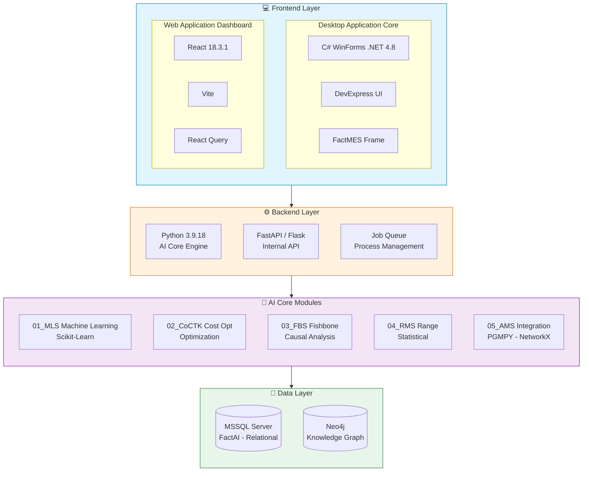
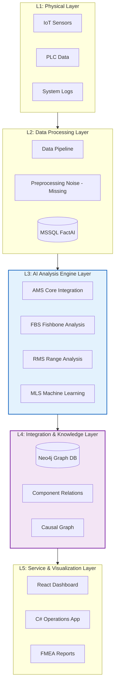
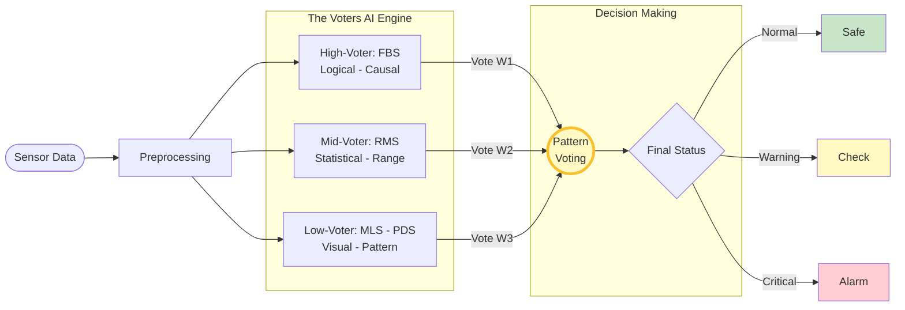
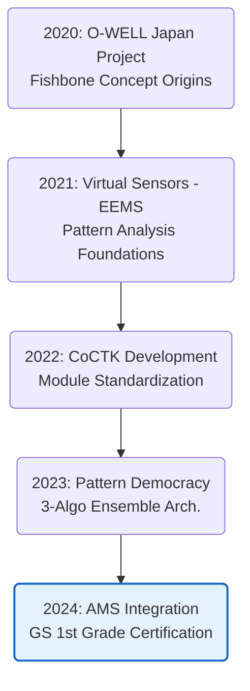

# 🧠 AMS (Anomaly Management System) Solution Architecture

**문서 ID**: `page.portfolio.ai_solution_detail`  
**작성자**: 권순룡 (Senior Software Architect)  
**생성일**: 2026-01-23

---

## 1. 사용 프레임워크 및 기술 스택 (Usage Framework)

본 솔루션은 **MSA (Microservices Architecture)** 기반으로 설계되어, 독립적인 Python 분석 엔진들과 C# WinForms 기반의 현장 친화적 UI가 결합된 구조입니다.

### 🛠️ Technology Stack Architecture

### 📋 상세 스펙

| Layer | Technology | Details |
|:---:|:---:|:---|
| **Frontend (Desk)** | **C# WinForms** | 제조 현장 Operator용 메인 UI. DevExpress 사용하여 고성능 데이터 시각화. |
| **Frontend (Web)** | **React** | 관리자용 대시보드. 데이터 모니터링 및 리포트 조회. |
| **Backend** | **Python 3.9** | 5개 핵심 모듈(MLS, CoCTK, FBS, RMS, AMS)로 구성된 AI 엔진. |
| **Database** | **Polyglot** | **MSSQL** (정형 데이터/설정), **Neo4j** (설비 관계/원인 분석). |

---

## 2. 사용 아키텍처 (Usage Architecture)

AMS는 **5-Layer Architecture**를 기반으로 데이터 수집부터 의사결정 지원까지 체계적인 흐름을 가집니다.

### 🏗️ 5-Layer System Architecture

---

## 3. AI 솔루션 세부 설명 (AI Solution Details)

### A. AMS 패턴 민주주의 (Pattern Democracy)

AMS는 단일 알고리즘의 편향을 방지하기 위해 3가지 서로 다른 관점의 알고리즘이 투표를 통해 최종 이상 여부를 판단하는 **앙상블 시스템**을 구현했습니다.

1.  **FBS (Fishbone Structure)**: 설비의 부품 간 인과관계를 기반으로 논리적인 이상을 탐지합니다.
2.  **RMS (Range Management)**: 데이터의 통계적 분포(평균, 표준편차 등)를 기반으로 수치적 이상을 탐지합니다.
3.  **MLS/PDS (Pattern)**: 머신러닝 및 시계열 패턴 매칭을 통해 과거 고장 패턴과의 유사성을 분석합니다.

### B. 핵심 AI 모듈 (Core Modules)

소스 코드(`AMS/AI_docker_en`)에 구현된 5대 핵심 모듈은 다음과 같습니다:

1.  **01_MLS (Machine Learning Service)**
    *   데이터 전처리, 특징 추출(Feature Extraction), 머신러닝 학습 담당.
2.  **02_CoCTK (Cost Control Toolkit)**
    *   비용 최적화 및 운영 효율성 분석 알고리즘.
3.  **03_FBS (Fishbone Structure)**
    *   피쉬본 다이어그램 구조 생성 및 원인-결과 경로 추적.
4.  **04_RMS (Range Management System)**
    *   데이터 클러스터링 및 동적 정상 범위(Dynamic Baselines) 설정.
    *   `cluster_auto_Binarization.py`를 통한 자동 임계치 설정.
5.  **05_AMS_dev (Analysis Management System)**
    *   전체 분석 파이프라인 통합 관리.
    *   베이지안 네트워크(`bayesian_network_analyzer.py`)를 활용한 확률적 원인 추론.
    *   FMEA 자동 생성(`generate_fmea.py`) 및 결과 DB 저장.

---

## 4. 진화의 역사 (Evolution History)

AMS는 2020년부터 시작된 R&D와 다양한 실증 프로젝트를 통해 완성되었습니다.

