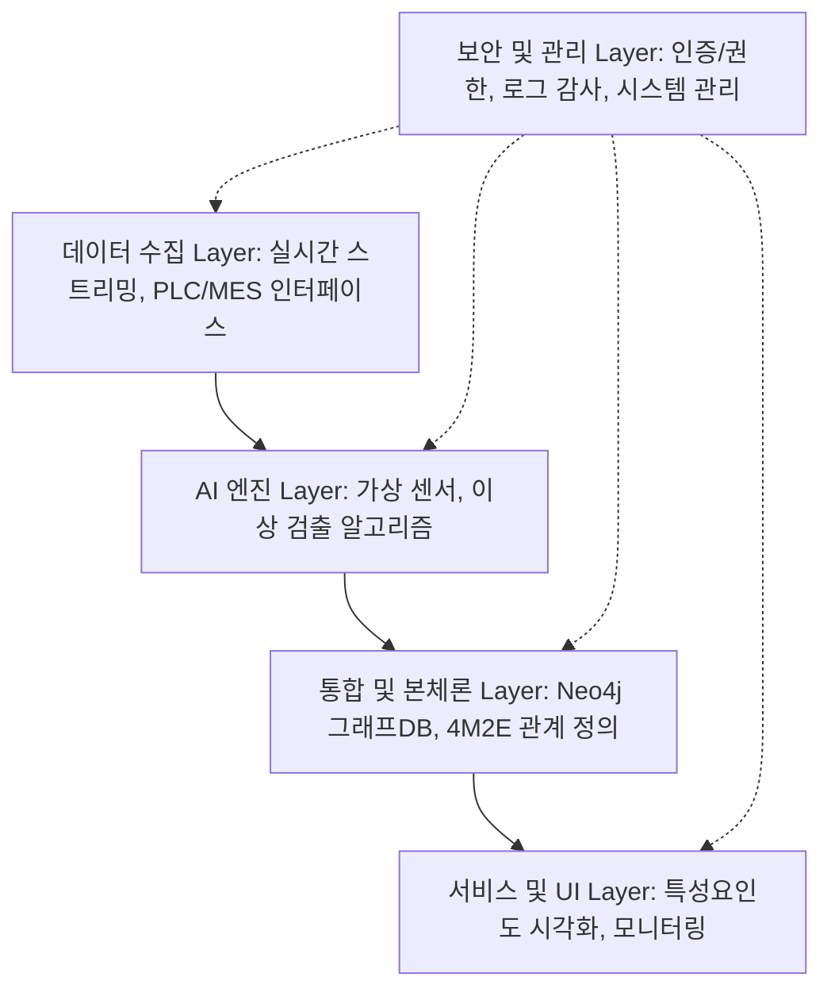
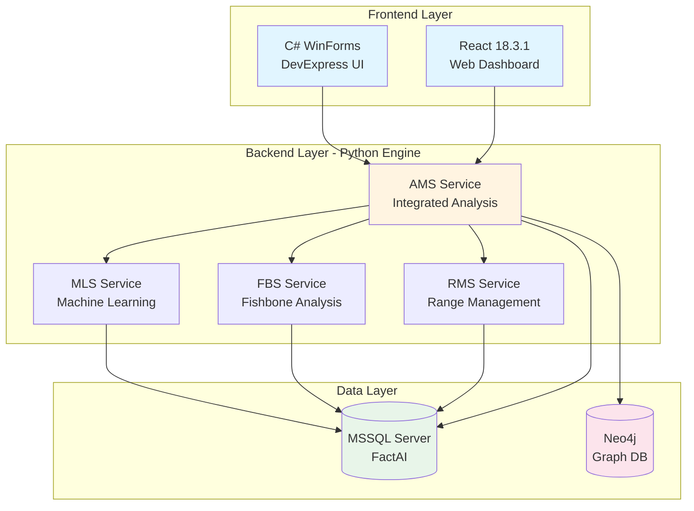
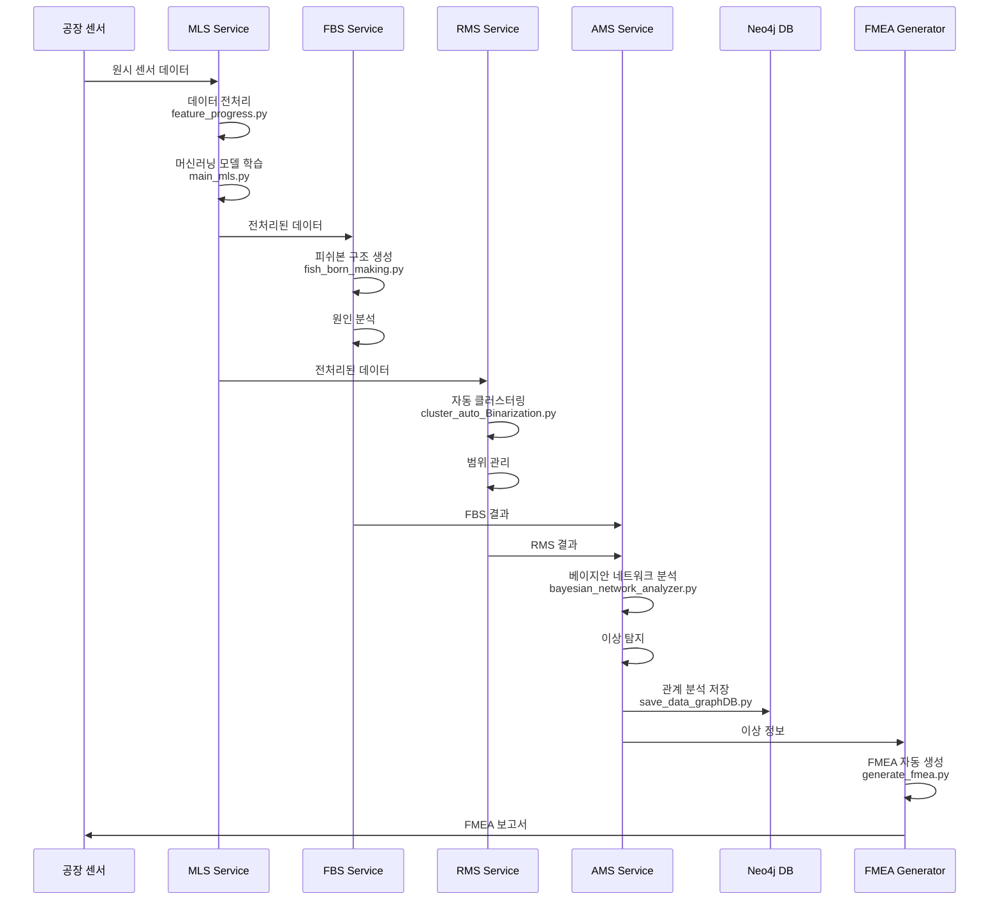

# Architecture Overview

**문서 ID**: `page.portfolio.architecture`

> [!NOTE] 문서 목적
> 본 문서는 단순한 단일 시스템이 아닌, **4대 전문 영역(AI, 플랫폼, 센서, 산업안전/에너지)**에서 구축된 다양한 솔루션들의 통합 아키텍처와 기술 스택을 상세히 설명합니다.

---

## 🏗️ 솔루션 도메인별 아키텍처

### 1. AI & Analytics: AMS/CoCTK 엔진

**AMS (Anomaly Management System)**는 데이터 수집부터 이상 탐지, FMEA 생성까지의 전체 파이프라인을 담당하는 핵심 분석 엔진입니다.
- **개발 기간**: 2020~2025 (최종: 2024.07~2025.03, 한국산업기술진흥원)
- **역할**: 총괄 PM
- **성과**: GS 1등급, 이상탐지율 93.7%, 특허 등록
- (상세 내용은 하단 'AMS 시스템 아키텍처' 섹션 참조)

**CoCTK (Consulting Tool Kit)**는 데이터 전처리, 상관관계 분석, 비용 최적화를 위한 통합 분석 도구입니다.
- **개발 기간**: 2022.03~2024 (중소기업기술정보진흥원)
- **역할**: 엔진 총괄 설계 및 화면설계 개발 PM
- **성과**: GS 1등급 취득
- **기술**: Python 분석 엔진 + C# WinForms UI
- **주요 모듈**: 02_CoCTK (4개 Python 파일) - 비용 분석, 최적화 알고리즘

**FBS (Fishbone Structure)**는 피쉬본 다이어그램 자동 생성 알고리즘의 초기 개발 프로젝트입니다.
- **개발 기간**: 2020.09~2021.10 (한국에너지기술평가원)
- **역할**: 핵심 알고리즘 개발
- **성과**: AMS의 핵심 모듈(03_FBS)로 발전
- **주요 모듈**: 03_FBS (6개 Python 파일) - 피쉬본 구조 생성, 원인 분석

### 2. Digital Transformation Platform: DPS (Digital Production System)
금속 공정 자동화를 위한 **모듈화 5층 아키텍처**입니다. 



- **기술 특징**: Docker 컨테이너 기반의 **마이크로서비스 아키텍처**, 서버-엣지 하이브리드 인프라 지원.

### 3. Energy Optimization: 산업용 에너지 관리 플랫폼
클린룸 및 공장 에너지 효율화를 위한 AI 최적화 엔진입니다.

- **프로세스**: 데이터 수집 → 전처리 → **AI 최적화 규칙 생성** → 실시간 제어 및 최적화 제안.
- **성과**: 에너지 소비 패턴 분석을 통한 효율 20% 향상.

### 4. Smart Sensors & IoT: 지능형 복합 센서
고가의 센서를 대체하는 **저비용-보급형 스마트센서** 및 **Edge AI 복합 센서** 구조입니다.

- **Edge Computing**: 센서 레벨에서 데이터 전처리 및 이상 검출을 수행하여 서버 부하 감소.
- **모듈화 디자인**: 온도, 습도, 진동, 전류 등 필요한 측정항목을 자유롭게 결합 가능.

---

## 🎯 AMS 프로젝트 핵심 성과

### 프로젝트 개요

**개발 기간**: 2020~2025년 초 (최종 단계: 2024.07~2025.03)
**발주처**: 한국산업기술진흥원 (KIAT)
**프로젝트**: 한솔코에버 AMS (Anomaly Management System)
**역할**: 총괄 PM (Project Manager)
**개발 총괄**: 권순룡 (한솔코에버 연구소 팀장)

**한솔코에버**:
- 한솔그룹 자회사
- EMS, MES, AI, 3D 프린팅, 스마트 팩토리 전문 기업
- 제조 및 에너지 IT 전문

### Python 엔진 100% 자체 개발

**총 49개 Python 파일로 구성**:

| 모듈 | 파일 수 | 주요 기능 | 담당 |
|------|---------|-----------|------|
| **01_MLS** (Machine Learning Service) | 15개 | 머신러닝 모델 학습, 데이터 전처리 | 권순룡 |
| **02_CoCTK** (Cost Control Toolkit) | 4개 | 비용 분석, 최적화 | 권순룡 |
| **03_FBS** (Fishbone Structure) | 6개 | 피쉬본 구조 생성, 원인 분석 | 권순룡 |
| **04_RMS** (Range Management System) | 4개 | 범위 관리, 클러스터링 | 권순룡 |
| **05_AMS_dev** (Anomaly Management System) | 17 개 | 통합 이상 관리, FMEA 생성 | 권순룡 |
| **common** | 2개 | 공통 모듈 (DB 연결, 로깅) | 권순룡 |

**주요 파일**:
```
AI_docker_en/
├── 01_MLS/
│   ├── main_mls.py
│   ├── AI_preprocessing.py
│   ├── data_loader.py
│   ├── feature_progress.py
│   └── ...
├── 02_CoCTK/
│   ├── main_ctk.py
│   └── ctk_ver2.py
├── 03_FBS/
│   ├── main_fbs.py
│   ├── fish_born_making.py
│   └── AI_preprocessing.py
├── 04_RMS/
│   ├── main_rms.py
│   ├── cluster_auto_Binarization.py
│   └── AI_preprocessing.py
├── 05_AMS_dev/
│   ├── main_ams.py
│   ├── data_pipeline.py
│   ├── bayesian_network_analyzer.py
│   ├── generate_fmea.py
│   └── save_data_graphDB.py
└── common/
    ├── mssql_db_connection.py
    └── error_log.py
```

### 핵심 성과

- ✅ **GS 인증 1등급**: 소프트웨어 품질 인증 최고 등급 획득
- ✅ **특허 출원/등록**: 한솔코에버 명의로 특허 출원 및 등록
- ✅ **논문 발표**: 관련 연구 논문 게재 (2024, 2025)
- ✅ **이상 탐지율 93.7%**: 실증 검증된 높은 정확도
- ✅ **실 납품**: 세아특수강, 포미아(포항소재산업진흥원)
- ✅ **검증 완료**: 내부 개발 + 현장 테스트 + 컨설팅 POC

---

## 🏗️ AMS 시스템 아키텍처

### 전체 시스템 구조



### 기술 스택

#### Frontend

**C# WinForms** (주요 인터페이스):
- 언어: C# 7.0+ (.NET Framework 4.8)
- UI 라이브러리: DevExpress
- 내부 프레임워크: FactMES
- HTTP 클라이언트: System.Net.Http.HttpClient

**React** (웹 대시보드):
- React: 18.3.1
- TypeScript: 5.5.3
- Vite: 7.1.12
- Tailwind CSS: 3.4.11
- React Query: 5.56.2
- Recharts: 2.12.7

#### Backend (Python Engine)

**Python**: 3.9.18
**주요 라이브러리**:
- pandas >= 1.5.0
- numpy >= 1.23.0
- scikit-learn >= 1.2.0
- pgmpy >= 0.1.19 (베이지안 네트워크)
- pyodbc >= 4.0.39
- sqlalchemy >= 2.0.0
- neo4j >= 5.0.0
- networkx >= 2.8.0

#### Database

- **MSSQL Server**: 메인 관계형 데이터베이스 (FactAI)
- **Neo4j**: 그래프 데이터베이스 (관계 분석)

---

## 📊 데이터 파이프라인

### AMS 전체 파이프라인



### 파이프라인 단계별 설명

#### 1단계: MLS (Machine Learning Service)

**주요 파일**:
- `main_mls.py`: MLS 메인 서비스
- `AI_preprocessing.py`: 데이터 전처리
- `feature_progress.py`: 특징 추출
- `data_loader.py`: 데이터 로드

**기능**:
- 센서 데이터 수집 및 전처리
- 머신러닝 모델 학습
- 이상 패턴 탐지

#### 2단계: FBS (Fishbone Structure)

**주요 파일**:
- `main_fbs.py`: FBS 메인 서비스
- `fish_born_making.py`: 피쉬본 구조 생성
- `make_fish_born.py`: 피쉬본 구조 최적화

**기능**:
- 피쉬본 다이어그램 자동 생성
- 이상 원인 추적
- 원인-결과 관계 분석

#### 3단계: RMS (Range Management System)

**주요 파일**:
- `main_rms.py`: RMS 메인 서비스
- `cluster_auto_Binarization.py`: 자동 클러스터링
- `make_cluster_ratio.py`: 클러스터 비율 계산

**기능**:
- 데이터 범위 자동 관리
- K-means 클러스터링
- 이진화 및 정상/비정상 범위 설정

#### 4단계: AMS (Anomaly Management System)

**주요 파일**:
- `main_ams.py`: AMS 메인 서비스
- `data_pipeline.py`: 데이터 파이프라인
- `bayesian_network_analyzer.py`: 베이지안 네트워크 분석
- `generate_fmea.py`: FMEA 자동 생성
- `save_data_graphDB.py`: Neo4j 그래프 DB 저장

**기능**:
- MLS, FBS, RMS 결과 통합
- 베이지안 네트워크로 확률적 원인 분석
- Neo4j에 관계 데이터 저장
- FMEA 자동 생성

---

## 📋 데이터베이스 설계

### 주요 테이블

#### AMS3000M - AMS 설정 테이블
```sql
CREATE TABLE AMS3000M (
    SNRO_ID INT PRIMARY KEY,          -- 시나리오 ID
    SNRO_NM VARCHAR(100),              -- 시나리오 이름
    FBS_ID INT,                        -- FBS 작업 ID (FK)
    RMS_ID INT,                        -- RMS 작업 ID (FK)
    STD_FBS_ID INT,                    -- 표준 FBS ID
    ANOM_RATE DECIMAL(5,2),            -- 이상율
    USE_YN CHAR(1),                    -- 사용 여부
    FOREIGN KEY (FBS_ID) REFERENCES FBS1100M(JOB_ID),
    FOREIGN KEY (RMS_ID) REFERENCES RMS1100M(JOB_ID)
);
```

#### AMS4000M - AMS 결과 테이블
```sql
CREATE TABLE AMS4000M (
    RSLT_ID INT PRIMARY KEY,           -- 결과 ID
    SNRO_ID INT,                       -- 시나리오 ID (FK)
    RSLT_DT DATETIME,                  -- 결과 일시
    ANOM_TYPE VARCHAR(50),             -- 이상 유형
    SEVERITY INT,                      -- 심각도
    FOREIGN KEY (SNRO_ID) REFERENCES AMS3000M(SNRO_ID)
);
```

### Neo4j 그래프 구조

```cypher
// 노드 타입
(:Sensor {id, name, type})
(:Anomaly {id, timestamp, type, severity})
(:Cause {id, description, probability})
(:Action {id, description, priority})

// 관계
(:Sensor)-[:DETECTED]->(:Anomaly)
(:Anomaly)-[:CAUSED_BY]->(:Cause)
(:Cause)-[:REQUIRES]->(:Action)
(:Cause)-[:RELATED_TO]->(:Cause)
```

---

## 🛠️ obsidian_design_origin 시스템

### 개요

**위치**: `AI_agent_test/Original_Development_Plan/docs/obsidian_design_origin/`

**목적**: 설계 문서 기반 개발 시스템 구축

### 구조

```
obsidian_design_origin/
├── architecture/              # 14개 설계 문서
│   ├── Blue_Print.md
│   ├── API_Design.md
│   ├── Database_Design.md
│   ├── Component_Interfaces_Design.md
│   ├── State_Management_Design.md
│   ├── Screen_Design.md
│   ├── Testing_Framework_Design.md
│   ├── Docker_Environment_Design.md
│   ├── Technology_Stack_Specification.md
│   └── ...
├── specs/
│   ├── 04_Prompts/           # 25개+ AI 프롬프트
│   └── 05_Templates/         # 11개+ 문서 템플릿
├── phases/                    # 7개 Phase 가이드
├── conventions/               # 작성 가이드
└── meta/                      # 전략 문서
```

### 주요 Architecture 문서 요약

#### 1. Blue_Print.md
- 프로젝트 전체 청사진
- 페이지/컴포넌트/서비스 명세
- 의존성 테이블

#### 2. Database_Design.md
- MSSQL Server 테이블 설계
- Neo4j 그래프 구조
- ID 기반 관계 추적

#### 3. API_Design.md
- RESTful API 엔드포인트
- 요청/응답 스키마
- 에러 핸들링

#### 4. Component_Interfaces_Design.md
- React/WinForms 컴포넌트 인터페이스
- Props 정의
- 이벤트 핸들러

#### 5. Testing_Framework_Design.md
- Unit Test 전략
- Integration Test 시나리오
- E2E 테스트 계획

---

## 🔄 버전 진화

### obsidian_design_origin 버전별 발전

| 버전 | 기간 | 주요 변경사항 |
|------|------|---------------|
| **v1.0** | 2020-2021 | 초기 설계 문서 시스템 구축 |
| **v2.0** | 2021-2022 | AI 프롬프트 라이브러리 추가 (10개) |
| **v3.0** | 2022-2023 | 프롬프트 체인 도입, 템플릿 확장 (15개) |
| **v4.0** | 2023-2025 | 전체 시스템 통합, 프롬프트 25개+ |

---

## 🔗 관련 문서

- [[Phase_1_Foundation/Step_01_Repetitive_Work|Step 1: 반복적 업무 식별]] (`phase.foundation.step01`) - 문서 구조 중심 개발 시스템
- [[Phase_1_Foundation/Step_04_Modularization|Step 4: 모듈화 전략]] (`phase.foundation.step04`) - ID 시스템 및 프롬프트 라이브러리
- [[Phase_1_Foundation/Step_05_IO_Optimization|Step 5: I/O 최적화]] (`phase.foundation.step05`) - 파일 기반 파이프라인
- [[Testing_Context|테스트 컨텍스트]] (`page.portfolio.testing`) - 테스트 및 시연 사례
- [[02_Projects_Overview|프로젝트 개요]] (`page.portfolio.projects`) - 13개 프로젝트 상세
- [[04_Academic_Publications|학술 논문]] (`page.portfolio.academic`) - 기술의 학술적 근거
- [[00_Portfolio_Index|포트폴리오 인덱스]] (`page.portfolio.index`) - 전체 포트폴리오 개요

---

## ID 참조

- **문서 ID**: `page.portfolio.architecture`
- **관련 Phase**: `phase.foundation.*`
- **관련 프로젝트**: `project.ams`, `project.dps`, `project.coctk` 등
- **관련 문서**: `page.portfolio.*`

---

> [!SUCCESS] 검증된 멀티 솔루션 역량
> 단순한 기술 개발을 넘어 4대 영역에서 **13개 이상의 프로젝트**를 성공적으로 완수했습니다.
> 
> **핵심 통합 성과**:
> - **GS 인증 2개** 소프트웨어 인증서 취득 (CoCTK, AMS(PDS))
> - **특허 출원 및 등록** (피쉬본 관리 시스템 등)
> - **핵심 엔진 100% 자체 개발** (MLS, CoCTK, DPS 등)
> - **글로벌 실증**: 국내 대기업(세아특수강 등) 및 일본 도료 전문기업 DX 수행
> - **정량적 가치**: 에너지 효율 20% 향상, 이상 탐지율 93.7%, 연간 수십억 원 규모 손실 방지
> 
> **연구 리더십**:
> - 한솔코에버 연구소 팀장으로서 연구 전략, 팀 관리, 기술 검증, 위험 관리 전 과정 주도.
