# Architecture Overview

**문서 ID**: `page.portfolio.architecture`

> [!NOTE] 옵시디언 네비게이션 허브
> 본 문서는 **옵시디언에서 네비게이션 역할을 하는 위키백과 첫 페이지**처럼 설계되었습니다. 포트폴리오의 전체 구조를 한눈에 파악하고, 각 문서로 빠르게 이동할 수 있도록 구성되어 있습니다.

---

## 👤 사용자 소개 및 문서 개요

### 작성자 정보

**이름**: 권순룡  
**소속**: 한솔코에버 연구소 대리 (2020.09 ~ 재직중)  
**총 경력**: 5년 (2020~2025)

> [!QUOTE] 핵심 철학
> **"모델보다 데이터, 데이터보다 정보, 지식구조를 정리하는 현장친화적 연구원"**

### 주요 성과

- **GS 인증 2개**: CoCTK, AMS(PDS) 소프트웨어 품질 인증 1등급
- **20개 이상 프로젝트**: 4대 전문 영역에서 다양한 솔루션 구축
- **9편 논문**: 학술 연구 및 논문 발표
- **특허 출원/등록**: 피쉬본 관리 시스템 등

### 문서 목적

본 문서는 단순한 단일 시스템이 아닌, **4대 전문 영역(AI, 플랫폼, 센서, 산업안전/에너지)**에서 구축된 다양한 솔루션들의 통합 아키텍처와 기술 스택을 상세히 설명합니다.

**대상 독자**:
- 기술자: 시스템 아키텍처와 기술 스택을 이해하고자 하는 개발자
- PM/기획자: 프로젝트 구조와 비즈니스 가치를 파악하고자 하는 기획자
- 연구자: 기술의 학술적 근거와 실증 사례를 확인하고자 하는 연구자
- 처음 보는 사람: 포트폴리오의 전체 구조를 빠르게 파악하고자 하는 독자

**관련 문서**: [[00_Personal_Profile|개인 프로필]] (`page.portfolio.personal_profile`) - 상세한 개인 정보 및 기술 철학

---

## 📑 목차 (Table of Contents)

1. [👤 사용자 소개 및 문서 개요](#사용자-소개-및-문서-개요) - 권순룡 소개 및 핵심 철학
2. [📂 포트폴리오 문서 구조](#포트폴리오-문서-구조) - 폴더 구조 및 문서 간 관계
3. [🧭 옵시디언 빠른 네비게이션](#옵시디언-빠른-네비게이션) - 카테고리별 빠른 링크
4. [🏗️ 솔루션 도메인별 아키텍처](#솔루션-도메인별-아키텍처)
   - 1. AI & Analytics: AMS/CoCTK 엔진
   - 2. Digital Transformation Platform: DPS
   - 3. Energy Optimization
   - 4. Smart Sensors & IoT
5. [🎯 AMS 프로젝트 핵심 성과](#ams-프로젝트-핵심-성과)
6. [🏗️ AMS 시스템 아키텍처](#ams-시스템-아키텍처)
7. [📊 데이터 파이프라인](#데이터-파이프라인)
8. [📋 데이터베이스 설계](#데이터베이스-설계)
9. [🗺️ obsidian_design_origin 시스템](#obsidian_design_origin-시스템)
10. [🤖 AI Workflow & Automation](#ai-workflow--automation)
11. [🚀 사무 자동화의 미래 비전](#사무-자동화의-미래-비전)
12. [🌐 Platform All: 통합 플랫폼 생태계](#platform-all-통합-플랫폼-생태계)

> [!TIP] 옵시디언 네비게이션
> 옵시디언에서 자동으로 앵커 링크가 생성되므로, 목차의 링크를 클릭하면 해당 섹션으로 바로 이동할 수 있습니다.

---

## 📂 포트폴리오 문서 구조

### 폴더 구조 개요

포트폴리오 문서는 `portfolio/portfolio_docs/` 폴더에 체계적으로 구성되어 있습니다. 각 폴더와 파일의 역할은 다음과 같습니다:

**폴더 구조 머메이드 그래프**:

```mermaid
graph TB
    subgraph "portfolio/portfolio_docs/"
        direction TB
        
        subgraph "핵심 문서 (00_*.md)"
            Index[00_Portfolio_Index.md<br/>포트폴리오 인덱스]
            Profile[00_Personal_Profile.md<br/>개인 프로필]
            IDGuide[00_ID_System_Guide.md<br/>ID 시스템 가이드]
            AIGuide[00_AI_Workflow_Guide.md<br/>AI 워크플로우 가이드]
            PMGuide[00_PM_Roles_Guide.md<br/>PM 역할 가이드]
            TeamGuide[00_Team_Roles_Guide.md<br/>팀 역할 가이드]
            RelMap[00_Relationship_Map.md<br/>관계 맵]
        end
        
        subgraph "프로젝트 문서"
            Projects[02_Projects_Overview.md<br/>프로젝트 개요]
            Architecture[Architecture_Overview.md<br/>아키텍처 개요<br/>현재 문서]
            Academic[04_Academic_Publications.md<br/>학술 논문]
            Testing[Testing_Context.md<br/>테스트 컨텍스트]
        end
        
        subgraph "Executive_Summary/"
            Exec00[00_Overview_For_Non_Technical.md<br/>비전문가용 개요]
            Exec01[01_Key_Achievements.md<br/>핵심 성과]
            Exec02[02_Business_Value.md<br/>비즈니스 가치]
            Exec03[03_Technology_Simplified.md<br/>기술 간소화]
            Exec04[04_Visual_Portfolio.md<br/>시각적 포트폴리오]
        end
        
        subgraph "Phase_1_Foundation/"
            Step01[Step_01_Repetitive_Work.md<br/>반복 업무 식별]
            Step02[Step_02_Expertise_Targeting.md<br/>전문성 타겟팅]
            Step03[Step_03_Micro_Starts.md<br/>초소형 시작]
            Step04[Step_04_Modularization.md<br/>모듈화]
            Step05[Step_05_IO_Optimization.md<br/>I/O 최적화]
        end
        
        subgraph "Phase_2_Assets/"
            Step06[Step_06_Daily_Log.md<br/>데일리 로그]
            Step07[Step_07_Visuals.md<br/>시각 자산]
        end
        
        subgraph "Phase_3_Expansion/"
            Step08[Step_08_Feedback_Loop.md<br/>피드백 루프]
            Step09[Step_09_Continuous_Update.md<br/>지속 업데이트]
        end
        
        subgraph "templates/"
            Templates[템플릿 문서들<br/>8개 파일]
        end
        
        subgraph "assets/"
            Assets[자산 파일들<br/>PDF, 이미지 등]
        end
    end
    
    Architecture -.->|참조| Index
    Architecture -.->|참조| Profile
    Architecture -.->|참조| Projects
    Architecture -.->|참조| Academic
    Architecture -.->|참조| Testing
    Architecture -.->|참조| Exec01
    Architecture -.->|참조| Step02
    
    style Architecture fill:#e74c3c,color:#fff
    style Index fill:#3498db,color:#fff
    style Profile fill:#9b59b6,color:#fff
    style Projects fill:#e67e22,color:#fff
```

### 문서 간 연결 관계

**문서 간 연결 관계 머메이드 그래프**:

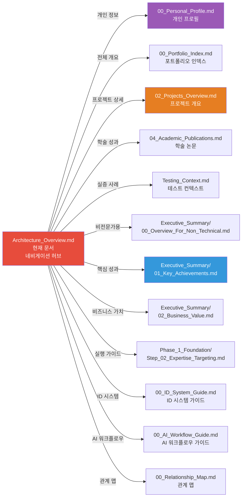

### 각 폴더/파일의 역할

#### 핵심 문서 (00_*.md)

- **[[00_Portfolio_Index|00_Portfolio_Index.md]]**: 포트폴리오의 전체 인덱스 및 9단계 실행 가이드
- **[[00_Personal_Profile|00_Personal_Profile.md]]**: 개인 프로필, 학력, 경력, 기술 철학
- **[[00_ID_System_Guide|00_ID_System_Guide.md]]**: ID 시스템 명명 규칙 및 사용 방법
- **[[00_AI_Workflow_Guide|00_AI_Workflow_Guide.md]]**: AI 워크플로우 및 문서 참조 전략
- **[[00_PM_Roles_Guide|00_PM_Roles_Guide.md]]**: PM 역할 및 책임 가이드
- **[[00_Team_Roles_Guide|00_Team_Roles_Guide.md]]**: 팀 역할 및 협업 가이드
- **[[00_Relationship_Map|00_Relationship_Map.md]]**: 프로젝트 간 관계 시각화

#### 프로젝트 문서

- **[[02_Projects_Overview|02_Projects_Overview.md]]**: 20개 이상 프로젝트 상세 요약
- **Architecture_Overview.md** (현재 문서): 통합 시스템 아키텍처 및 기술 스택
- **[[04_Academic_Publications|04_Academic_Publications.md]]**: 학술 연구 및 논문 성과
- **[[Testing_Context|Testing_Context.md]]**: 실증 및 검증 사례

#### Executive_Summary/ (요약 문서)

- **[[Executive_Summary/00_Overview_For_Non_Technical|00_Overview_For_Non_Technical.md]]**: 비전문가를 위한 개요
- **[[Executive_Summary/01_Key_Achievements|01_Key_Achievements.md]]**: 핵심 성과 요약
- **[[Executive_Summary/02_Business_Value|02_Business_Value.md]]**: 비즈니스 가치 분석
- **[[Executive_Summary/03_Technology_Simplified|03_Technology_Simplified.md]]**: 기술 간소화 설명
- **[[Executive_Summary/04_Visual_Portfolio|04_Visual_Portfolio.md]]**: 시각적 포트폴리오

#### Phase_1_Foundation/ (Phase 1 문서)

- **[[Phase_1_Foundation/Step_01_Repetitive_Work|Step_01_Repetitive_Work.md]]**: 반복 업무 식별
- **[[Phase_1_Foundation/Step_02_Expertise_Targeting|Step_02_Expertise_Targeting.md]]**: 전문성 타겟팅
- **[[Phase_1_Foundation/Step_03_Micro_Starts|Step_03_Micro_Starts.md]]**: 초소형 시작
- **[[Phase_1_Foundation/Step_04_Modularization|Step_04_Modularization.md]]**: 모듈화 전략
- **[[Phase_1_Foundation/Step_05_IO_Optimization|Step_05_IO_Optimization.md]]**: I/O 최적화

#### Phase_2_Assets/ (Phase 2 문서)

- **[[Phase_2_Assets/Step_06_Daily_Log|Step_06_Daily_Log.md]]**: 데일리 로그 기록
- **[[Phase_2_Assets/Step_07_Visuals|Step_07_Visuals.md]]**: 시각적 자산 생성

#### Phase_3_Expansion/ (Phase 3 문서)

- **[[Phase_3_Expansion/Step_08_Feedback_Loop|Step_08_Feedback_Loop.md]]**: 피드백 루프
- **[[Phase_3_Expansion/Step_09_Continuous_Update|Step_09_Continuous_Update.md]]**: 지속 업데이트

#### templates/ (템플릿)

- 8개의 문서 템플릿 (프로젝트 요약, 평가, 메트릭, 타임라인 등)

#### assets/ (자산)

- PDF 문서, 이미지 등 자산 파일

### ID 시스템

모든 문서는 고유 ID를 가지며, `type.module.name` 형식으로 명명됩니다:
- `page.portfolio.*`: 포트폴리오 문서
- `phase.foundation.*`: Phase 1 단계
- `project.*`: 프로젝트

자세한 내용은 [[00_ID_System_Guide|ID 시스템 가이드]]를 참조하세요.

---

## 🧭 옵시디언 빠른 네비게이션

### 📋 시작하기

- [[00_Portfolio_Index|포트폴리오 인덱스]] (`page.portfolio.index`) - 전체 포트폴리오 개요
- [[00_Personal_Profile|개인 프로필]] (`page.portfolio.personal_profile`) - 권순룡 소개 및 기술 철학

### 📊 프로젝트 정보

- [[02_Projects_Overview|프로젝트 개요]] (`page.portfolio.projects`) - 20개 이상 프로젝트 상세
- [[04_Academic_Publications|학술 논문]] (`page.portfolio.academic`) - 9편 논문 목록
- [[Testing_Context|테스트 컨텍스트]] (`page.portfolio.testing`) - 실증 사례

### 📈 요약 문서

- [[Executive_Summary/00_Overview_For_Non_Technical|비전문가용 개요]] - 비전문가를 위한 간단한 설명
- [[Executive_Summary/01_Key_Achievements|핵심 성과]] - 주요 성과 요약
- [[Executive_Summary/02_Business_Value|비즈니스 가치]] - 비즈니스 가치 분석
- [[Executive_Summary/03_Technology_Simplified|기술 간소화]] - 기술을 쉽게 설명
- [[Executive_Summary/04_Visual_Portfolio|시각적 포트폴리오]] - 시각화된 포트폴리오

### 🎯 실행 가이드

#### Phase 1: Foundation (작은 성공)
- [[Phase_1_Foundation/Step_01_Repetitive_Work|Step 1: 반복 업무 식별]]
- [[Phase_1_Foundation/Step_02_Expertise_Targeting|Step 2: 전문성 타겟팅]]
- [[Phase_1_Foundation/Step_03_Micro_Starts|Step 3: 초소형 시작]]
- [[Phase_1_Foundation/Step_04_Modularization|Step 4: 모듈화]]
- [[Phase_1_Foundation/Step_05_IO_Optimization|Step 5: I/O 최적화]]

#### Phase 2: Assets (지식 자산화)
- [[Phase_2_Assets/Step_06_Daily_Log|Step 6: 데일리 로그]]
- [[Phase_2_Assets/Step_07_Visuals|Step 7: 시각 자산]]

#### Phase 3: Expansion (확장)
- [[Phase_3_Expansion/Step_08_Feedback_Loop|Step 8: 피드백 루프]]
- [[Phase_3_Expansion/Step_09_Continuous_Update|Step 9: 지속 업데이트]]

### 📚 가이드 문서

- [[00_ID_System_Guide|ID 시스템 가이드]] (`guide.id.system`) - ID 명명 규칙 및 사용 방법
- [[00_AI_Workflow_Guide|AI 워크플로우 가이드]] (`guide.ai.workflow`) - AI 워크플로우 및 문서 참조 전략
- [[00_Relationship_Map|관계 맵]] (`page.portfolio.relationship_map`) - 프로젝트 간 관계 시각화
- [[00_PM_Roles_Guide|PM 역할 가이드]] - PM 역할 및 책임
- [[00_Team_Roles_Guide|팀 역할 가이드]] - 팀 역할 및 협업

### 📖 문서 읽기 순서 가이드

#### 처음 보는 사람
1. [[00_Personal_Profile|개인 프로필]] - 작성자 소개
2. [[00_Portfolio_Index|포트폴리오 인덱스]] - 전체 개요
3. [[Executive_Summary/00_Overview_For_Non_Technical|비전문가용 개요]] - 간단한 설명

#### 기술자
1. **Architecture_Overview.md** (현재 문서) - 시스템 아키텍처
2. [[02_Projects_Overview|프로젝트 개요]] - 프로젝트 상세
3. [[Testing_Context|테스트 컨텍스트]] - 실증 사례

#### PM/기획자
1. [[Executive_Summary/02_Business_Value|비즈니스 가치]] - 비즈니스 가치 분석
2. [[Executive_Summary/01_Key_Achievements|핵심 성과]] - 주요 성과
3. [[02_Projects_Overview|프로젝트 개요]] - 프로젝트 상세

#### 연구자
1. [[04_Academic_Publications|학술 논문]] - 논문 목록
2. [[Testing_Context|테스트 컨텍스트]] - 실증 사례
3. **Architecture_Overview.md** (현재 문서) - 기술 아키텍처

---

## 🏗️ 솔루션 도메인별 아키텍처

> [!NOTE] 섹션 개요
> 본 섹션은 4대 전문 영역(AI, 플랫폼, 센서, 산업안전/에너지)에서 구축된 다양한 솔루션들의 아키텍처를 설명합니다.
> 
> **관련 문서**:
> - [[02_Projects_Overview|프로젝트 개요]] - 프로젝트 상세 정보
> - [[Executive_Summary/01_Key_Achievements|핵심 성과]] - 주요 성과 요약
> - [[Testing_Context|테스트 컨텍스트]] - 실증 사례

### 1. AI & Analytics: AMS/CoCTK 엔진

**AMS (Anomaly Management System)**는 데이터 수집부터 이상 탐지, FMEA 생성까지의 전체 파이프라인을 담당하는 핵심 분석 엔진입니다.
- **개발 기간**: 2020~2025 (최종: 2024.07~2025.03, 한국산업기술진흥원)
- **역할**: 총괄 PM
- **성과**: GS 1등급, 이상탐지율 93.7%, 특허 등록
- (상세 내용은 하단 'AMS 시스템 아키텍처' 섹션 참조)

**CoCTK (Consulting Tool Kit)**는 데이터 전처리, 상관관계 분석, 비용 최적화를 위한 통합 분석 도구입니다.
- **개발 기간**: 2022.03~2024 (중소기업기술정보진흥원)
- **역할**: 엔진 총괄 설계 및 화면설계 개발 PM
- **성과**: GS 1등급 취득
- **기술**: Python 분석 엔진 + C# WinForms UI
- **주요 모듈**: 02_CoCTK (4개 Python 파일) - 비용 분석, 최적화 알고리즘

**FBS (Fishbone Structure)**는 피쉬본 다이어그램 자동 생성 알고리즘의 초기 개발 프로젝트입니다.
- **개발 기간**: 2020.09~2021.10 (한국에너지기술평가원)
- **역할**: 핵심 알고리즘 개발
- **성과**: AMS의 핵심 모듈(03_FBS)로 발전
- **주요 모듈**: 03_FBS (6개 Python 파일) - 피쉬본 구조 생성, 원인 분석

### 2. Digital Transformation Platform: DPS (데이터수집시스템)
금속 공정 자동화를 위한 **모듈화 5층 아키텍처**입니다. 

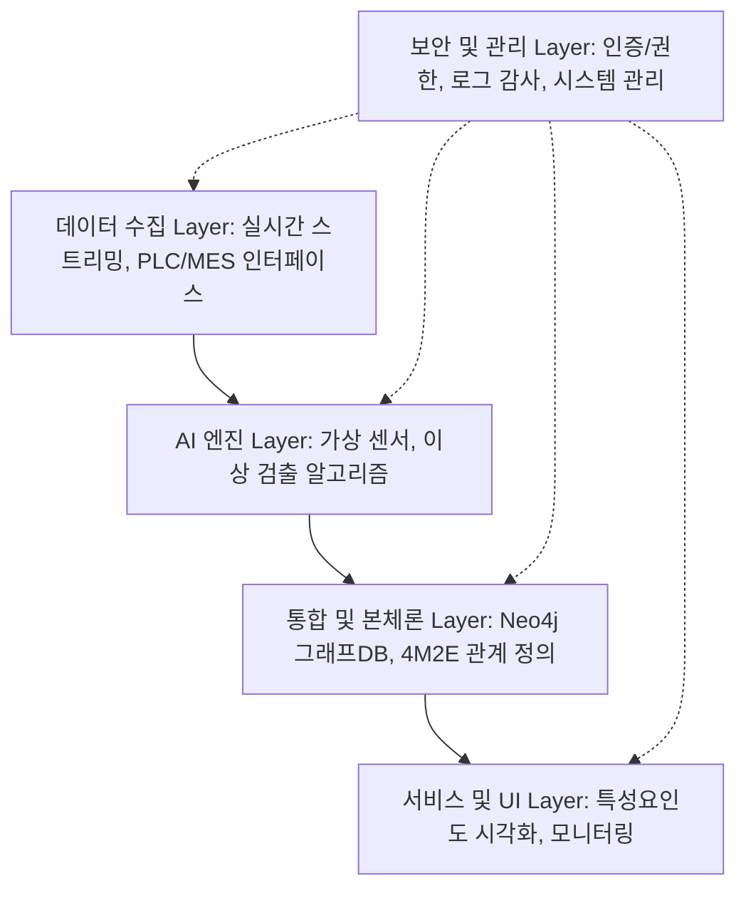

- **기술 특징**: Docker 컨테이너 기반의 **마이크로서비스 아키텍처**, 서버-엣지 하이브리드 인프라 지원.

### 3. Energy Optimization: 산업용 에너지 관리 플랫폼
클린룸 및 공장 에너지 효율화를 위한 AI 최적화 엔진입니다.

- **프로세스**: 데이터 수집 → 전처리 → **AI 최적화 규칙 생성** → 실시간 제어 및 최적화 제안.
- **성과**: 에너지 소비 패턴 분석을 통한 효율 20% 향상.

### 4. Smart Sensors & IoT: 지능형 복합 센서
고가의 센서를 대체하는 **저비용-보급형 스마트센서** 및 **Edge AI 복합 센서** 구조입니다.

- **Edge Computing**: 센서 레벨에서 데이터 전처리 및 이상 검출을 수행하여 서버 부하 감소.
- **모듈화 디자인**: 온도, 습도, 진동, 전류 등 필요한 측정항목을 자유롭게 결합 가능.

---

## 🎯 AMS 프로젝트 핵심 성과

> [!NOTE] 섹션 개요
> 본 섹션은 AMS (Anomaly Management System) 프로젝트의 핵심 성과를 상세히 설명합니다.
> 
> **관련 문서**:
> - [[02_Projects_Overview|프로젝트 개요]] - AMS 프로젝트 상세 정보
> - [[Executive_Summary/01_Key_Achievements|핵심 성과]] - 주요 성과 요약
> - [[Testing_Context|테스트 컨텍스트]] - 실증 사례 (세아특수강, 포미아)

### 프로젝트 개요

**개발 기간**: 2020~2025년 초 (최종 단계: 2024.07~2025.03)
**발주처**: 한국산업기술진흥원 (KIAT)
**프로젝트**: 한솔코에버 AMS (Anomaly Management System)
**역할**: 총괄 PM (Project Manager)
**개발 총괄**: 권순룡 (한솔코에버 연구소 팀장)

**한솔코에버**:
- 한솔그룹 자회사
- EMS, MES, AI, 3D 프린팅, 스마트 팩토리 전문 기업
- 제조 및 에너지 IT 전문

### Python 엔진 100% 자체 개발

**총 49개 Python 파일로 구성**:

| 모듈 | 파일 수 | 주요 기능 | 담당 |
|------|---------|-----------|------|
| **01_MLS** (Machine Learning Service) | 15개 | 머신러닝 모델 학습, 데이터 전처리 | 권순룡 |
| **02_CoCTK** (Cost Control Toolkit) | 4개 | 비용 분석, 최적화 | 권순룡 |
| **03_FBS** (Fishbone Structure) | 6개 | 피쉬본 구조 생성, 원인 분석 | 권순룡 |
| **04_RMS** (Range Management System) | 4개 | 범위 관리, 클러스터링 | 권순룡 |
| **05_AMS_dev** (Anomaly Management System) | 17 개 | 통합 이상 관리, FMEA 생성 | 권순룡 |
| **common** | 2개 | 공통 모듈 (DB 연결, 로깅) | 권순룡 |

**주요 파일**:
```
AI_docker_en/
├── 01_MLS/
│   ├── main_mls.py
│   ├── AI_preprocessing.py
│   ├── data_loader.py
│   ├── feature_progress.py
│   └── ...
├── 02_CoCTK/
│   ├── main_ctk.py
│   └── ctk_ver2.py
├── 03_FBS/
│   ├── main_fbs.py
│   ├── fish_born_making.py
│   └── AI_preprocessing.py
├── 04_RMS/
│   ├── main_rms.py
│   ├── cluster_auto_Binarization.py
│   └── AI_preprocessing.py
├── 05_AMS_dev/
│   ├── main_ams.py
│   ├── data_pipeline.py
│   ├── bayesian_network_analyzer.py
│   ├── generate_fmea.py
│   └── save_data_graphDB.py
└── common/
    ├── mssql_db_connection.py
    └── error_log.py
```

### 핵심 성과

- ✅ **GS 인증 1등급**: 소프트웨어 품질 인증 최고 등급 획득
- ✅ **특허 출원/등록**: 한솔코에버 명의로 특허 출원 및 등록
- ✅ **논문 발표**: 관련 연구 논문 게재 (2024, 2025)
- ✅ **이상 탐지율 93.7%**: 실증 검증된 높은 정확도
- ✅ **실 납품**: 세아특수강, 포미아(포항소재산업진흥원)
- ✅ **검증 완료**: 내부 개발 + 현장 테스트 + 컨설팅 POC

---

## 🏗️ AMS 시스템 아키텍처

> [!NOTE] 섹션 개요
> 본 섹션은 AMS 시스템의 전체 아키텍처, 기술 스택, 프론트엔드/백엔드 구조를 설명합니다.
> 
> **관련 문서**:
> - [[02_Projects_Overview|프로젝트 개요]] - AMS 프로젝트 상세 정보
> - [[Phase_1_Foundation/Step_02_Expertise_Targeting|전문성 타겟팅]] - AMS 개발 과정

### 전체 시스템 구조

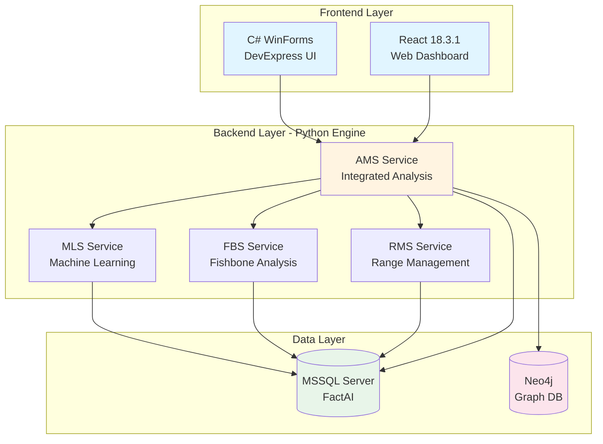

### 기술 스택

#### Frontend

**C# WinForms** (주요 인터페이스):
- 언어: C# 7.0+ (.NET Framework 4.8)
- UI 라이브러리: DevExpress
- 내부 프레임워크: FactMES
- HTTP 클라이언트: System.Net.Http.HttpClient

**React** (웹 대시보드):
- React: 18.3.1
- TypeScript: 5.5.3
- Vite: 7.1.12
- Tailwind CSS: 3.4.11
- React Query: 5.56.2
- Recharts: 2.12.7

#### Backend (Python Engine)

**Python**: 3.9.18
**주요 라이브러리**:
- pandas >= 1.5.0
- numpy >= 1.23.0
- scikit-learn >= 1.2.0
- pgmpy >= 0.1.19 (베이지안 네트워크)
- pyodbc >= 4.0.39
- sqlalchemy >= 2.0.0
- neo4j >= 5.0.0
- networkx >= 2.8.0

#### Database

- **MSSQL Server**: 메인 관계형 데이터베이스 (FactAI)
- **Neo4j**: 그래프 데이터베이스 (관계 분석)

---

## 📊 데이터 파이프라인

> [!NOTE] 섹션 개요
> 본 섹션은 AMS의 데이터 파이프라인 구조와 각 단계별 처리 과정을 설명합니다.
> 
> **관련 문서**:
> - [[Phase_1_Foundation/Step_05_IO_Optimization|I/O 최적화]] - 파일 기반 파이프라인
> - [[02_Projects_Overview|프로젝트 개요]] - 파이프라인 관련 프로젝트

### AMS 전체 파이프라인

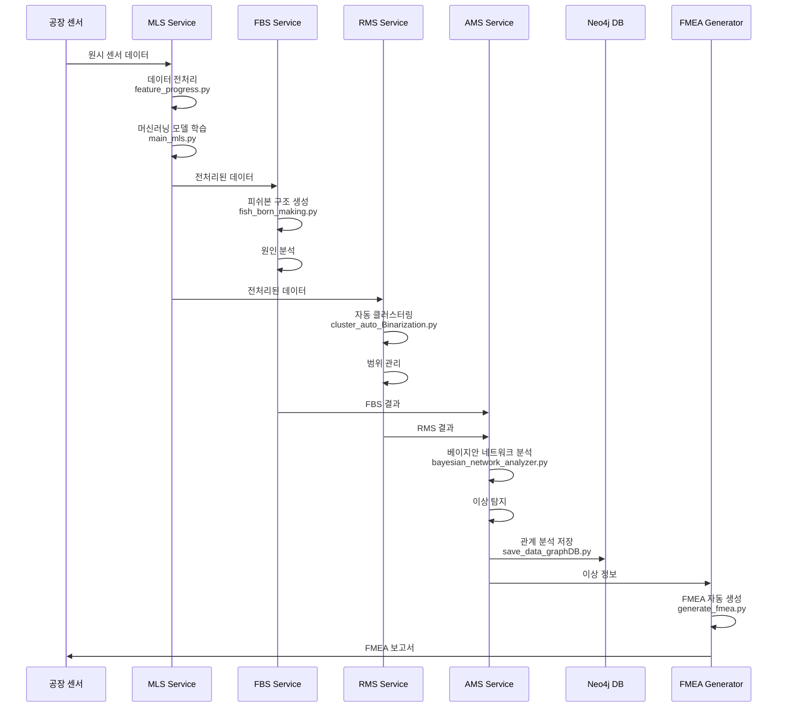

### 파이프라인 단계별 설명

#### 1단계: MLS (Machine Learning Service)

**주요 파일**:
- `main_mls.py`: MLS 메인 서비스
- `AI_preprocessing.py`: 데이터 전처리
- `feature_progress.py`: 특징 추출
- `data_loader.py`: 데이터 로드

**기능**:
- 센서 데이터 수집 및 전처리
- 머신러닝 모델 학습
- 이상 패턴 탐지

#### 2단계: FBS (Fishbone Structure)

**주요 파일**:
- `main_fbs.py`: FBS 메인 서비스
- `fish_born_making.py`: 피쉬본 구조 생성
- `make_fish_born.py`: 피쉬본 구조 최적화

**기능**:
- 피쉬본 다이어그램 자동 생성
- 이상 원인 추적
- 원인-결과 관계 분석

#### 3단계: RMS (Range Management System)

**주요 파일**:
- `main_rms.py`: RMS 메인 서비스
- `cluster_auto_Binarization.py`: 자동 클러스터링
- `make_cluster_ratio.py`: 클러스터 비율 계산

**기능**:
- 데이터 범위 자동 관리
- K-means 클러스터링
- 이진화 및 정상/비정상 범위 설정

#### 4단계: AMS (Anomaly Management System)

**주요 파일**:
- `main_ams.py`: AMS 메인 서비스
- `data_pipeline.py`: 데이터 파이프라인
- `bayesian_network_analyzer.py`: 베이지안 네트워크 분석
- `generate_fmea.py`: FMEA 자동 생성
- `save_data_graphDB.py`: Neo4j 그래프 DB 저장

**기능**:
- MLS, FBS, RMS 결과 통합
- 베이지안 네트워크로 확률적 원인 분석
- Neo4j에 관계 데이터 저장
- FMEA 자동 생성

---

## 📋 데이터베이스 설계

> [!NOTE] 섹션 개요
> 본 섹션은 AMS 시스템의 데이터베이스 설계, 주요 테이블 구조, Neo4j 그래프 구조를 설명합니다.
> 
> **관련 문서**:
> - [[Phase_1_Foundation/Step_04_Modularization|모듈화 전략]] - 모듈화된 데이터베이스 구조
> - [[02_Projects_Overview|프로젝트 개요]] - 데이터베이스 관련 프로젝트

### 주요 테이블

#### AMS3000M - AMS 설정 테이블
```sql
CREATE TABLE AMS3000M (
    SNRO_ID INT PRIMARY KEY,          -- 시나리오 ID
    SNRO_NM VARCHAR(100),              -- 시나리오 이름
    FBS_ID INT,                        -- FBS 작업 ID (FK)
    RMS_ID INT,                        -- RMS 작업 ID (FK)
    STD_FBS_ID INT,                    -- 표준 FBS ID
    ANOM_RATE DECIMAL(5,2),            -- 이상율
    USE_YN CHAR(1),                    -- 사용 여부
    FOREIGN KEY (FBS_ID) REFERENCES FBS1100M(JOB_ID),
    FOREIGN KEY (RMS_ID) REFERENCES RMS1100M(JOB_ID)
);
```

#### AMS4000M - AMS 결과 테이블
```sql
CREATE TABLE AMS4000M (
    RSLT_ID INT PRIMARY KEY,           -- 결과 ID
    SNRO_ID INT,                       -- 시나리오 ID (FK)
    RSLT_DT DATETIME,                  -- 결과 일시
    ANOM_TYPE VARCHAR(50),             -- 이상 유형
    SEVERITY INT,                      -- 심각도
    FOREIGN KEY (SNRO_ID) REFERENCES AMS3000M(SNRO_ID)
);
```

### Neo4j 그래프 구조

```cypher
// 노드 타입
(:Sensor {id, name, type})
(:Anomaly {id, timestamp, type, severity})
(:Cause {id, description, probability})
(:Action {id, description, priority})

// 관계
(:Sensor)-[:DETECTED]->(:Anomaly)
(:Anomaly)-[:CAUSED_BY]->(:Cause)
(:Cause)-[:REQUIRES]->(:Action)
(:Cause)-[:RELATED_TO]->(:Cause)
```

---

## 🛠️ obsidian_design_origin 시스템

> [!NOTE] 섹션 개요
> 본 섹션은 설계 문서 기반 개발 시스템인 obsidian_design_origin의 구조와 주요 Architecture 문서를 설명합니다.
> 
> **관련 문서**:
> - [[Phase_1_Foundation/Step_01_Repetitive_Work|반복적 업무 식별]] - 문서 구조 중심 개발 시스템
> - [[Phase_1_Foundation/Step_04_Modularization|모듈화 전략]] - ID 시스템 및 프롬프트 라이브러리
> - [[Phase_1_Foundation/Step_05_IO_Optimization|I/O 최적화]] - 파일 기반 파이프라인

### 개요

**위치**: `AI_agent_test/Original_Development_Plan/docs/obsidian_design_origin/`

**목적**: 설계 문서 기반 개발 시스템 구축

### 구조

```
obsidian_design_origin/
├── architecture/              # 14개 설계 문서
│   ├── Blue_Print.md
│   ├── API_Design.md
│   ├── Database_Design.md
│   ├── Component_Interfaces_Design.md
│   ├── State_Management_Design.md
│   ├── Screen_Design.md
│   ├── Testing_Framework_Design.md
│   ├── Docker_Environment_Design.md
│   ├── Technology_Stack_Specification.md
│   └── ...
├── specs/
│   ├── 04_Prompts/           # 25개+ AI 프롬프트
│   └── 05_Templates/         # 11개+ 문서 템플릿
├── phases/                    # 7개 Phase 가이드
├── conventions/               # 작성 가이드
└── meta/                      # 전략 문서
```

### 주요 Architecture 문서 요약

#### 1. Blue_Print.md
- 프로젝트 전체 청사진
- 페이지/컴포넌트/서비스 명세
- 의존성 테이블

#### 2. Database_Design.md
- MSSQL Server 테이블 설계
- Neo4j 그래프 구조
- ID 기반 관계 추적

#### 3. API_Design.md
- RESTful API 엔드포인트
- 요청/응답 스키마
- 에러 핸들링

#### 4. Component_Interfaces_Design.md
- React/WinForms 컴포넌트 인터페이스
- Props 정의
- 이벤트 핸들러

#### 5. Testing_Framework_Design.md
- Unit Test 전략
- Integration Test 시나리오
- E2E 테스트 계획

---

## 🤖 AI Workflow & Automation: Claude Sub-Agent Systems

> [!NOTE] 섹션 개요
> 본 섹션은 Claude Sub-Agent 기반 AI 워크플로우 자동화 시스템(FMEA 자동화, 프롬프트 평가 엔진)을 설명합니다.
> 
> **관련 문서**:
> - [[Phase_1_Foundation/Step_02_Expertise_Targeting|전문성 타겟팅]] - FMEA 자동화 시스템 구축 과정
> - [[00_AI_Workflow_Guide|AI 워크플로우 가이드]] - AI 워크플로우 전략

### FMEA 자동화 생성 시스템 (Claude Sub-Agent)

**핵심 구조**: 코딩 에이전트의 역설계 시스템 구조 적용
- 복잡한 FMEA 프로세스를 역으로 분석하여 Sub-Agent로 분해
- 각 Sub-Agent가 전문 영역(R&D, Mfg, QA)을 담당하는 구조
- 8개 독립 Sub-Agent의 협업 구조

**아키텍처**:
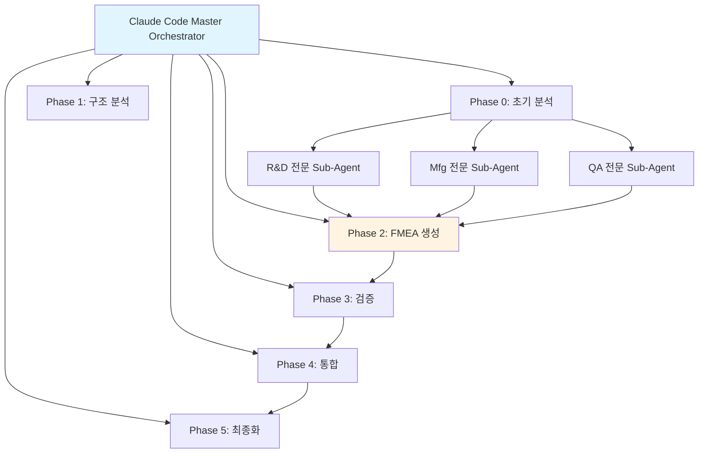

**기술적 의의**:
- Python 스크립트 없이 Claude Code 세션 자체가 Orchestrator
- 프롬프트 기반 완전 자동화
- AIAG & VDA FMEA 표준 기반 범용 리스크 분석 시스템

### 프롬프트 평가 엔진 (Claude Sub-Agent)

**핵심 구조**: 프롬프트 저지(Prompt Judging) 시스템
- AI가 생성한 프롬프트를 다른 AI가 평가하는 저지 시스템
- 생성 AI와 평가 AI의 분리로 환각(Hallucination) 방지
- 5단계 평가 프로세스 (Role Inference → Metrics → Consolidation → Report → Translation)

**아키텍처**:
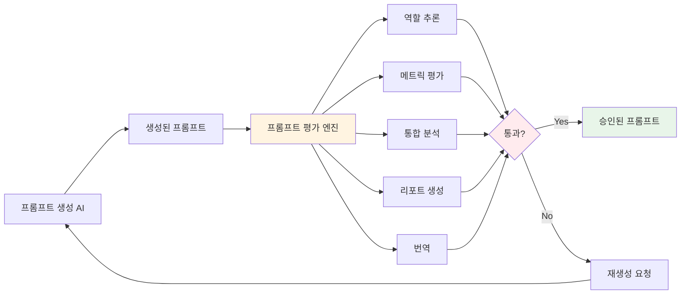

**기술적 의의**:
- 역할 기반 가중치 시스템
- Human-in-the-Loop 프로세스
- 배치 처리 지원
- 25개+ 프롬프트 품질 보장

### Multi-Agent Workflow 구조

**전체 워크플로우**:
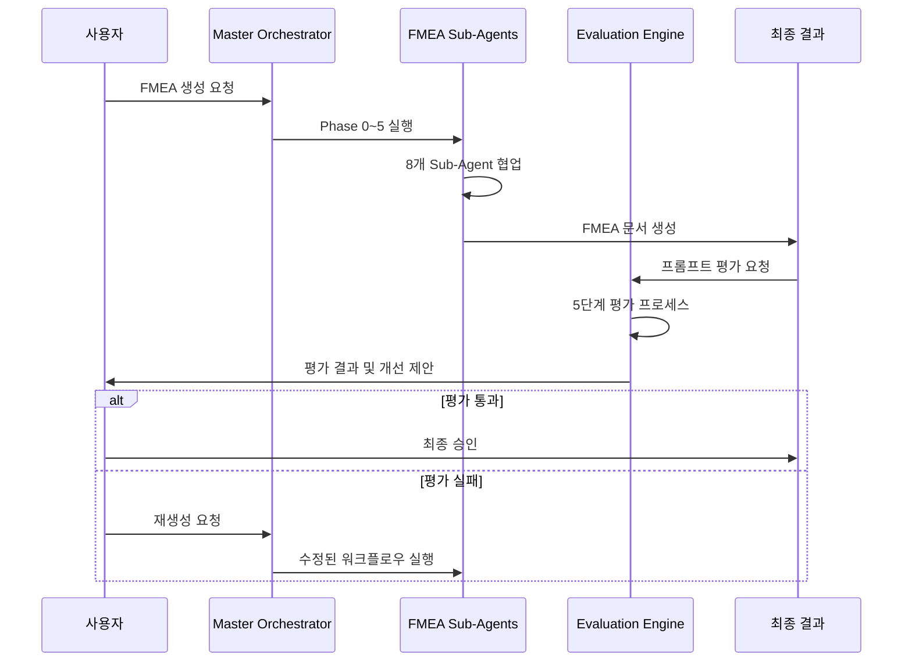

---

## 🚀 사무 자동화의 미래 비전: Obsidian Design Origin 기반 업그레이드

> [!NOTE] 섹션 개요
> 본 섹션은 Obsidian Design Origin 구조를 참조한 사무 자동화 업그레이드 계획과 미래 비전을 설명합니다.
> 
> **관련 문서**:
> - [[Phase_1_Foundation/Step_01_Repetitive_Work|반복적 업무 식별]] - 문서 구조 중심 개발 시스템
> - [[Phase_1_Foundation/Step_04_Modularization|모듈화 전략]] - ID 시스템 및 프롬프트 라이브러리
> - [[00_AI_Workflow_Guide|AI 워크플로우 가이드]] - AI 워크플로우 전략

### 현재 상태

- FMEA 자동화와 프롬프트 평가 엔진을 Claude Sub-Agent로 구현
- Task tool 기반 Multi-Agent Workflow 구축
- 코딩 에이전트 역설계 시스템 구조 적용

### 미래 비전: 체계적인 워크플로우 자동화 시스템

**Obsidian Design Origin의 구조를 참조한 사무 자동화 업그레이드 계획**

#### 핵심 구조 요소

1. **ID 기반 온톨로지 맵 문서 시스템**
   - 모든 요소에 고유 ID 부여 (`page.*`, `comp.*`, `api.*`, `db.*`)
   - 문서 간 관계 추적 및 의존성 관리
   - 온톨로지 기반 영향 관계 분석

2. **Phase 기반 체계적인 워크플로우**
   - Phase 0-13까지의 단계별 프로세스 자동화
   - 각 Phase별 전문가 Sub-Agent 역할 분담
   - 의존성 기반 자동 실행 순서 관리

3. **State 기반 정보 전달 시스템 (LangGraph/CrewAI 스타일)**
   - 각 단계에서 핵심 정보만 추출하여 컨텍스트 길이 최적화
   - 전문가 요약 시스템으로 도메인 지식 기반 핵심 정보 추출
   - 세션 컨텍스트 관리로 휘발성 정보 효율적 관리

4. **변경 관리 프로세스**
   - 변경 영향 매트릭스 기반 자동 영향 분석
   - 변경 전파 규칙에 따른 자동 문서 업데이트
   - 설계 단계별 의존성 매트릭스 관리

5. **Human-in-the-Loop 통합**
   - 청사진 생성 전 방향 선택
   - 평가 후 최종 확인
   - 개발 완료 후 연속 개발 워크플로우

#### Phase 0-13 워크플로우 다이어그램

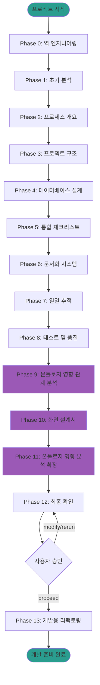

#### State 기반 정보 전달 시스템 구조

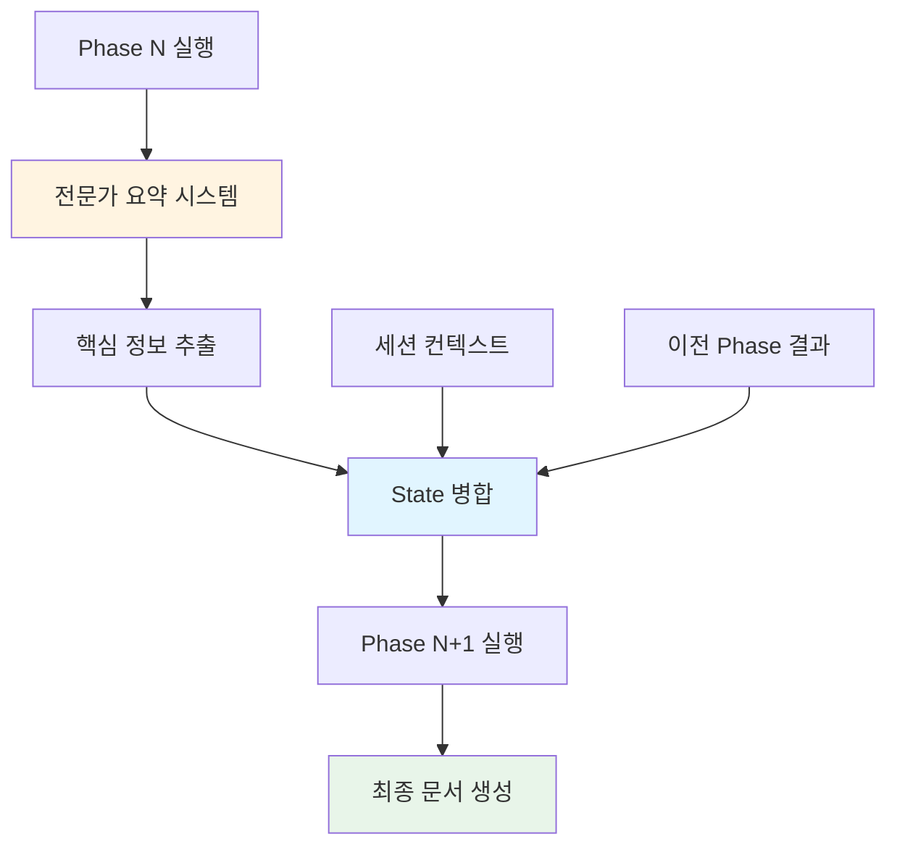

#### 변경 관리 프로세스 흐름도

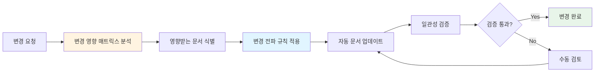

#### 전문가 Sub-Agent 협업 구조

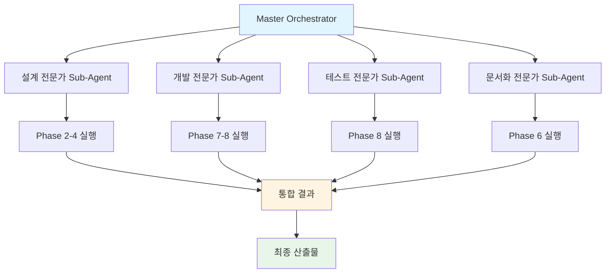

#### 기술적 의의

- **이전**: 단순 프롬프트 체인으로 작업 수행
- **미래**: ID 기반 온톨로지 맵 + Phase 워크플로우 + State 기반 정보 전달의 통합 시스템
- **주요 특징**:
  - 설계부터 개발까지 전체 라이프사이클 자동화
  - 문서 간 관계 추적 및 일관성 유지
  - 변경 영향 분석 및 전파
  - 전문가별 Sub-Agent 협업

#### 적용 분야

- **프로젝트 설계 자동화**: 신규 프로젝트 설계 및 기존 프로젝트 역설계
- **문서 생성 자동화**: 설계 문서, API 문서, 데이터베이스 설계 자동 생성
- **품질 평가 자동화**: 문서 품질 평가, 일관성 확인, 개발 준비도 평가
- **개발 워크플로우 자동화**: 개발 방향 찾기, 단계별 설계 문서 생성, 체크리스트 자동 생성

---

## 🔄 버전 진화

### obsidian_design_origin 버전별 발전

| 버전 | 기간 | 주요 변경사항 |
|------|------|---------------|
| **v1.0** | 2020-2021 | 초기 설계 문서 시스템 구축 |
| **v2.0** | 2021-2022 | AI 프롬프트 라이브러리 추가 (10개) |
| **v3.0** | 2022-2023 | 프롬프트 체인 도입, 템플릿 확장 (15개) |
| **v4.0** | 2023-2025 | 전체 시스템 통합, 프롬프트 25개+ |

---

## 🔗 관련 문서

### 핵심 문서
- [[00_Portfolio_Index|포트폴리오 인덱스]] (`page.portfolio.index`) - 전체 포트폴리오 개요
- [[00_Personal_Profile|개인 프로필]] (`page.portfolio.personal_profile`) - 개인 정보 및 기술 철학
- [[02_Projects_Overview|프로젝트 개요]] (`page.portfolio.projects`) - 20개 이상 프로젝트 상세
- [[04_Academic_Publications|학술 논문]] (`page.portfolio.academic`) - 기술의 학술적 근거
- [[Testing_Context|테스트 컨텍스트]] (`page.portfolio.testing`) - 테스트 및 시연 사례

### Phase 문서
- [[Phase_1_Foundation/Step_01_Repetitive_Work|Step 1: 반복적 업무 식별]] (`phase.foundation.step01`) - 문서 구조 중심 개발 시스템
- [[Phase_1_Foundation/Step_02_Expertise_Targeting|Step 2: 전문성 타겟팅]] (`phase.foundation.step02`) - 전문성 타겟팅 및 시스템 구축
- [[Phase_1_Foundation/Step_04_Modularization|Step 4: 모듈화 전략]] (`phase.foundation.step04`) - ID 시스템 및 프롬프트 라이브러리
- [[Phase_1_Foundation/Step_05_IO_Optimization|Step 5: I/O 최적화]] (`phase.foundation.step05`) - 파일 기반 파이프라인

### 가이드 문서
- [[00_ID_System_Guide|ID 시스템 가이드]] (`guide.id.system`) - ID 명명 규칙 및 사용 방법
- [[00_AI_Workflow_Guide|AI 워크플로우 가이드]] (`guide.ai.workflow`) - AI 워크플로우 및 문서 참조 전략
- [[00_Relationship_Map|관계 맵]] (`page.portfolio.relationship_map`) - 프로젝트 간 관계 시각화

---

## 🌐 Platform All: 통합 플랫폼 생태계 (`section.architecture.platform_all`)

> [!NOTE] 섹션 개요
> 본 섹션은 7개 통합 플랫폼 프로젝트(Original_Development_Plan, factory_ontology_manager, pipeline_system_complete, TAM_Hub, Evaluation_Framework, all_platform_center, FMEA_Automation_Generation_Technology)의 생태계 구성을 설명합니다.
> 
> **관련 문서**:
> - [[02_Projects_Overview|프로젝트 개요]] - Platform All 프로젝트 상세 정보
> - [[Phase_1_Foundation/Step_02_Expertise_Targeting|전문성 타겟팅]] - Platform All 구축 과정

### 7.1 Original_Development_Plan (Obsidian Design Origin)

**전체 에이전트 시스템 구조**:

- **코드 에이전트**: Development_Agent_Evaluation_Prompt로 실시간 코드 평가
- **에이전트 중간 문서 확인**: Phase별 문서 자동 검증
- **프롬프트 보완**: 전문가 요약 시스템
- **State 기반 정보 전달**: LangGraph/CrewAI 스타일

**Phase 0-13 워크플로우**:

- Phase 0: 역 엔지니어링
- Phase 1-8: 기본 설계 문서 생성
- Phase 9: 온톨로지 영향 관계 분석
- Phase 10: 화면 설계서
- Phase 11: 온톨로지 영향 분석 확장
- Phase 12: 최종 확인 (휴먼 루프)
- Phase 13: 개발용 리팩토링

**내부 구조의 촘촘함**:

- **Workflow_Orchestrator**: 실행 순서 및 의존성 관리
- **State_Management_System**: 정보 전달 최적화
- **Session_Context_Manager**: 휘발성 정보 관리
- **21개 development 프롬프트**: 개발 단계의 정교한 관리
  - 개발 워크플로우: 사용자 요청을 개발 작업으로 변환, 코드 생성
  - 개발 완료 후 휴먼 루프: 연속 개발 지원 (진행/수정/browser 디버깅/트러블 관리)
  - 문서 업데이트 자동 체크: 큰 수정 시 자동으로 문서 업데이트 필요성 판단
  - 개발 방향 찾기: 변경 영향 매트릭스 기반 개발 방향 결정
  - 단계별 뒷받침 설계 문서 생성: 변경 전파 규칙 통합
  - 단계별 체크리스트 생성: 검증 항목 및 완료 기준 설정
  - 브라우저 디버깅: 브라우저 기반 디버깅 지원
  - 트러블 관리: 변경 전파 규칙 통합
  - 변경 리포트 생성: 자동 변경 리포트 생성

- **변경 관리 프로세스**: 문서 일관성 자동 유지
  - 변경 영향 매트릭스 기반 자동 영향 분석
  - 변경 전파 규칙에 따른 자동 문서 업데이트
  - 설계 단계별 의존성 매트릭스 관리

**개발 타임라인**:

- **2025년 10월~12월**: 핵심 개발 집중 (21개 development 프롬프트 구축)
- **2025년 5월~7월**: 컨소들 모여서 연구 사업계획서 작성 및 아이디어 구체화
- **2025년 8월~10월**: 배경 연구 및 테스트, 내용 보완

### 7.2 factory_ontology_manager

**시각적 팩토리 관리 시스템**:

- shapez.io 게임에서 영감을 받은 드래그 앤 드롭 인터페이스
- 계층적 구조 관리 (공장 > 작업장 > 생산라인 > 공정)
- 마스터 데이터 통합 (자재, 센서, PLC)

### 7.3 pipeline_system_complete

**시계열 데이터 파이프라인**:

- 8단계 파이프라인 구조
- Supabase 기반 실시간 데이터 처리
- 체계적인 문서화 (219개 Markdown)

### 7.4 TAM_Hub

**기술 자산 관리 허브**:

- MCP 서버 통합 (32개 Python 파일)
- AMS 엔진, progressing_engine 통합
- Obsidian Design Origin 기반 문서화

### 7.5 Evaluation_Framework

**AI 에이전트 평가 프레임워크**:

- 6가지 관점 평가 시스템
- LangGraph 워크플로우 오케스트레이션
- Docker 기반 배포

### 7.6 all_platform_center

**통합 플랫폼 센터**:

- 모든 플랫폼의 중앙 관리
- 통합 대시보드
- 사용자 인증 및 권한 관리

### 7.7 FMEA_Automation_Generation_Technology (Claude Sub-Agent)

**코드 에이전트에서 영감을 받은 전체 공장/회사/사무 자동화의 백정보 핵심**:

- **Multi-Agent Architecture**: 8개 독립 Sub-Agent 협업 (R&D Team 3개, Manufacturing Team 3개, QA Team 2개)
- **역설계 시스템**: 코딩 에이전트의 역설계 시스템 구조를 FMEA 분석에 적용
- **범용 도메인 지원**: 제조업, 사무업무, 서비스업 모두 지원
- **Phase 0-5 워크플로우**: 컨텍스트 수집 → 범위 정의 → 심층 분석 → 리스크 평가 → 최적화 & 문서 생성 → 지속 개선
- **Living Document**: 지속적 개선 추적 시스템
- **AIAG & VDA FMEA 표준**: 국제 표준 기반 리스크 분석

**Platform All 통합 플랫폼 생태계 구성 다이어그램**:

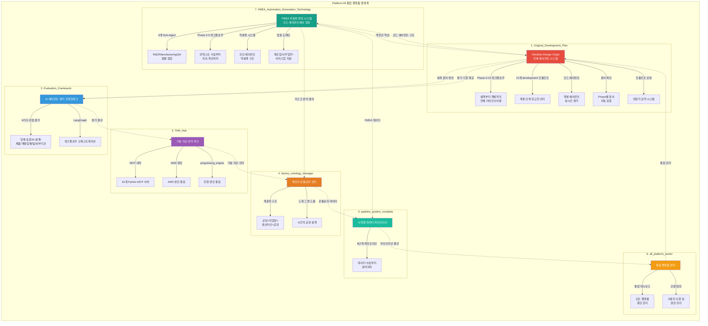

**생태계 연동 목적**:

1. **Original_Development_Plan → Evaluation_Framework**: 설계 문서를 평가 프레임워크에 제공하여 AI 에이전트 평가 기준으로 활용
2. **Evaluation_Framework → TAM_Hub**: 평가 결과를 기술 자산으로 관리하여 지속적 개선 추적
3. **TAM_Hub → factory_ontology_manager**: 기술 자산을 팩토리 온톨로지에 통합하여 제조 공정 설계에 활용
4. **factory_ontology_manager → pipeline_system_complete**: 팩토리 온톨로지 데이터를 시계열 파이프라인으로 전달하여 실시간 분석
5. **pipeline_system_complete → all_platform_center**: 파이프라인 결과를 통합 플랫폼 센터로 집중하여 대시보드 표시
6. **all_platform_center → Original_Development_Plan**: 통합 관리 결과를 Original_Development_Plan에 피드백하여 지속적 개선
7. **Original_Development_Plan → FMEA_Automation_Generation_Technology**: 코드 에이전트 구조를 FMEA 시스템에 제공하여 역설계 시스템 구현
8. **FMEA_Automation_Generation_Technology → factory_ontology_manager**: FMEA 리스크 분석 결과를 팩토리 온톨로지에 통합하여 제조 공정 리스크 관리
9. **FMEA_Automation_Generation_Technology → pipeline_system_complete**: FMEA 데이터를 시계열 파이프라인으로 전달하여 리스크 추적 및 분석
10. **FMEA_Automation_Generation_Technology → Original_Development_Plan**: 전체 공장/회사/사무 자동화의 백정보 핵심으로 활용

**생태계의 핵심 가치**:

- **자동화된 워크플로우**: 설계부터 평가, 관리, 분석까지 전체 프로세스 자동화
- **데이터 연동**: 각 플랫폼 간 데이터 흐름을 통한 통합 분석
- **지속적 개선**: 평가 결과를 기술 자산으로 관리하고 설계에 반영하는 순환 구조

---

## ID 참조

- **문서 ID**: `page.portfolio.architecture`
- **관련 Phase**: `phase.foundation.*`
- **관련 프로젝트**: `project.ams`, `project.dps`, `project.coctk` 등
- **관련 문서**: `page.portfolio.*`

---

> [!SUCCESS] 검증된 멀티 솔루션 역량
> 단순한 기술 개발을 넘어 4대 영역에서 **13개 이상의 프로젝트**를 성공적으로 완수했습니다.
> 
> **핵심 통합 성과**:
> - **GS 인증 2개** 소프트웨어 인증서 취득 (CoCTK, AMS(PDS))
> - **특허 출원 및 등록** (피쉬본 관리 시스템 등)
> - **핵심 엔진 100% 자체 개발** (MLS, CoCTK, DPS 등)
> - **글로벌 실증**: 국내 대기업(세아특수강 등) 및 일본 도료 전문기업 DX 수행
> - **정량적 가치**: 에너지 효율 20% 향상, 이상 탐지율 93.7%, 연간 수십억 원 규모 손실 방지
> 
> **연구 리더십**:
> - 한솔코에버 연구소 팀장으로서 연구 전략, 팀 관리, 기술 검증, 위험 관리 전 과정 주도.
