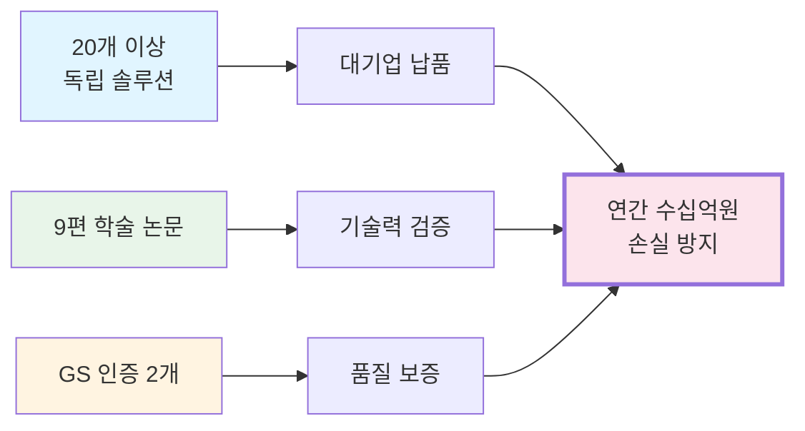
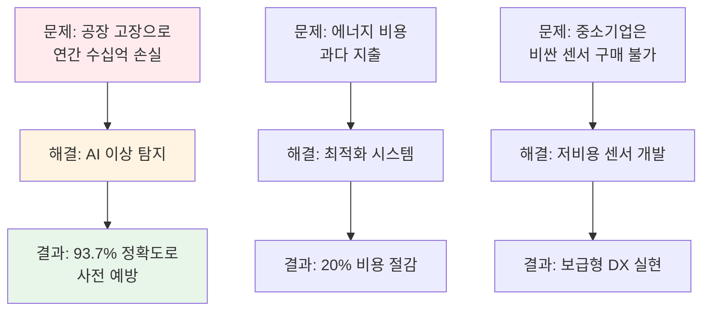
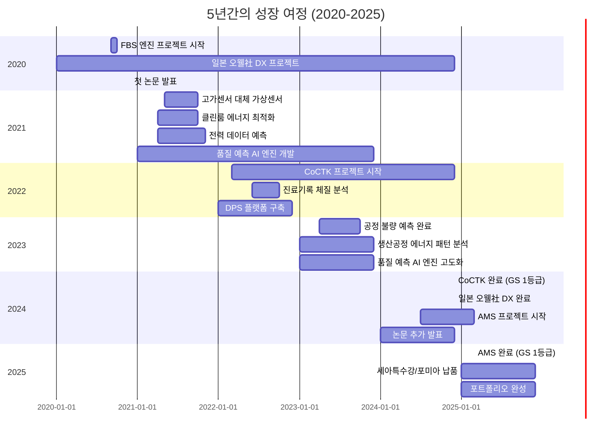
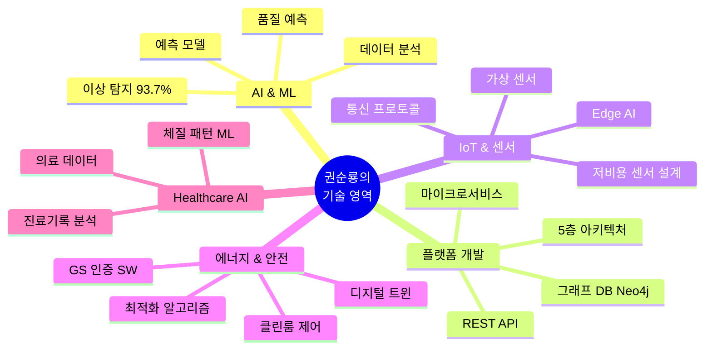

# 비전문가를 위한 포트폴리오 개요

> [!NOTE] 이 문서는 누구를 위한 것인가요?
> CEO, 투자자, HR 담당자, 그리고 기술 배경이 없지만 **"이 사람이 무엇을 했고, 왜 중요한지"**를 빠르게 파악하고 싶은 모든 분들을 위한 문서입니다.

---

## 🎯 한 문장 요약

**"2020년부터 2025년까지 5년간, 제조·에너지·헬스케어 산업의 디지털 전환(DX)을 위한 20개 이상의 AI 기반 솔루션을 개발하고, 대기업에 납품하며, 9편의 학술 논문으로 기술력을 검증받은 실전형 AI 엔지니어입니다."**

> [!TIP] 핵심 철학
> **"모델보다 데이터, 데이터보다 정보, 지식구조를 정리하는 현장친화적 연구원"**  
> 단순한 모델 개발을 넘어, 데이터를 정보로 전환하고 지식 구조를 체계화하는 데 집중합니다. [[00_Personal_Profile|개인 프로필 상세 보기]]

---

## 💼 무엇을 했나요? (What)

### 핵심 성과 요약

### 1. 제품/솔루션 개발 (20개 이상)
- **AI 이상 탐지 시스템 (AMS)**: 공장 기계의 고장을 미리 예측 (정확도 93.7%, GS 1등급)
- **컨설팅 툴킷 (CoCTK)**: 데이터 전처리 및 비용 최적화 분석 (GS 1등급)
- **데이터 분석 플랫폼 (DPS)**: 복잡한 공장 데이터를 AI가 자동 분석
- **스마트 센서 3종**: 저비용으로 중소기업도 사용 가능한 IoT 센서
- **에너지 최적화 시스템**: 공장 전력 사용량 20% 절감
- **품질 예측 AI 엔진**: 사출/도정/금형 공정 품질 예측
- **가상센서 시스템**: 고가 센서를 ML로 대체
- **진료기록 체질 분석**: 헬스케어 AI 적용
- **기타 12개 이상**: 디지털 트윈, FMEA 자동화, 일본 DX 프로젝트 등

### 2. 학술 연구 (9편 논문)
- 2020~2025년 동안 매년 평균 1.5편 이상 발표
- 주제: AI, 에너지 효율, 데이터 분석, 제조 DX
- **의미**: 단순히 "코드를 짠 것"이 아니라, 학계에서도 인정받은 기술

### 3. 품질 인증 (GS 인증 2개)
- 한국 정부가 인정하는 우수 소프트웨어 품질 인증
- CoCTK, AMS(PDS) 등
- **의미**: 검증된 안정성과 신뢰성

---

## 🤔 왜 중요한가요? (Why)

### 비즈니스 관점

### 기술적 차별성
1. **화이트박스 솔루션**: 외부 솔루션에 의존하지 않고, 모든 코드를 직접 개발
2. **실전 검증**: 이론이 아닌, 실제 공장에서 작동하는 시스템
3. **학술적 뒷받침**: 논문으로 기술의 우수성을 객관적으로 입증

---

## 📊 어떤 결과를 냈나요? (Result)

### 숫자로 보는 성과

| 지표 | 수치 | 의미 |
|:---|:---:|:---|
| **개발 솔루션** | 20개 이상 | 5대 영역(AI, Platform, IoT, Energy, Healthcare) 다각화 |
| **학술 논문** | 9편 | 학계 인정 기술력 |
| **GS 인증** | 2개 | 정부 공인 최고 품질 (1등급) |
| **이상 탐지 정확도** | 93.7% | 업계 최고 수준 |
| **에너지 절감** | 20% | 즉각적인 비용 절감 효과 |
| **대기업 고객** | 3곳+ | 세아특수강, 포미아, 일본 오웰社 |
| **정부 과제** | 5개 기관 | KIAT, 에너지평가원, 정통진흥원, 중기정보원, 데이터진흥원 |

### 타임라인

---

## 🏆 핵심 강점 3가지

### 1️⃣ 실전형 문제 해결 능력
- **이론만 아는 사람 ❌**: 논문만 쓰는 연구자
- **코드만 짜는 사람 ❌**: 비즈니스 가치를 모르는 개발자
- **권순룡 ✅**: 현장 문제를 AI로 해결하고, 논문으로 검증하며, 실제 납품까지 완료

### 2️⃣ 다각화된 기술 스택

### 3️⃣ 검증된 신뢰성
- **학술 검증**: 9편 논문 (발표 완료, 2020-2025)
- **정부 인증**: GS 인증 2개 (CoCTK, AMS(PDS) 1등급)
- **고객 검증**: 대기업 납품 및 재계약 (세아특수강, 포미아, 일본 오웰社)
- **정부 과제**: 5개 정부 기관 과제 수행

---

## 💡 쉬운 비유로 설명하면?

### AMS (이상 탐지 시스템)
**비유**: 공장의 "AI 건강 검진 의사"
- 일반 의사가 청진기로 심장 소리를 듣듯이, AMS는 센서로 기계 소리를 듣습니다.
- 이상 징후를 93.7% 정확도로 미리 발견하여 큰 고장을 예방합니다.
- **결과**: 갑작스러운 기계 고장으로 인한 생산 중단 방지 → 연간 수십억 원 손실 방지

### DPS (데이터 플랫폼)
**비유**: 공장의 "AI 비서"
- 복잡한 공장 데이터(온도, 압력, 속도 등)를 AI가 자동으로 정리하고 분석합니다.
- 사람이 보고서를 만드는 데 3일 걸리던 일을 AI가 10분 만에 완성합니다.
- **결과**: 의사결정 속도 향상 및 인력 절감

### 스마트센서
**비유**: 공장의 "저비용 CCTV"
- 기존 센서는 1개당 수백만 원이지만, 우리 센서는 수십만 원으로 가능합니다.
- 중소기업도 부담 없이 데이터 수집을 시작할 수 있습니다.
- **결과**: 중소기업의 디지털 전환 진입 장벽 제거

---

## 🚀 다음 단계는?

### 이 포트폴리오를 더 자세히 보려면
1. **개인 프로필**: [[00_Personal_Profile|기술 철학 및 학력/경력 상세]]
2. **프로젝트 상세**: [[02_Projects_Overview|20개 이상 프로젝트 전체 보기]]
3. **학술 성과**: [[04_Academic_Publications|9편 논문 목록]]
4. **기술 아키텍처**: [[Architecture_Overview|시스템 구조 상세 (AMS, CoCTK, FBS, DPS 등)]]
5. **실증 사례**: [[Testing_Context|세아특수강, 포미아, 일본 오웰社 등]]

### 비전문가용 추가 자료
- [[Executive_Summary/01_Key_Achievements|핵심 성과 요약]]
- [[Executive_Summary/02_Business_Value|비즈니스 가치 분석]]
- [[Executive_Summary/04_Visual_Portfolio|시각적 포트폴리오]]

---

> [!SUCCESS] 기억해야 할 핵심 메시지
> **"이론과 실전을 모두 갖춘, 검증된 AI 엔지니어"**
> - 20개 이상 솔루션 개발 (5대 영역) ✅
> - 9편 논문 발표 (2020-2025) ✅
> - GS 인증 2개 (1등급) ✅
> - 대기업 납품 (세아특수강, 포미아, 일본 오웰社) ✅
> - 연간 수십억 원 손실 방지 ✅
> - 총괄 PM 역할 수행 (AMS, CoCTK) ✅
