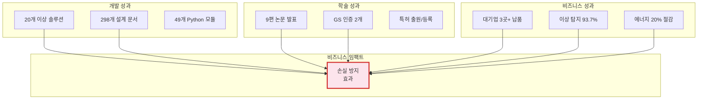
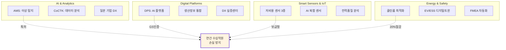
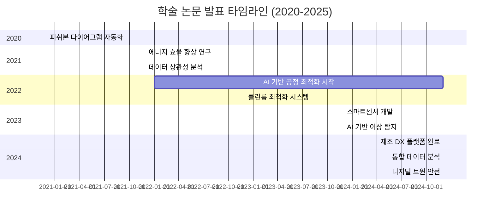
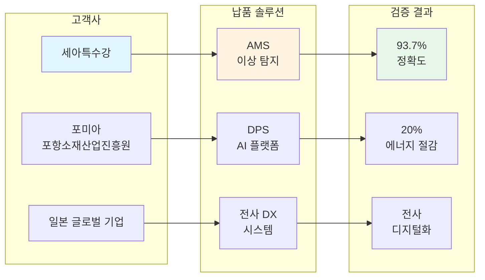
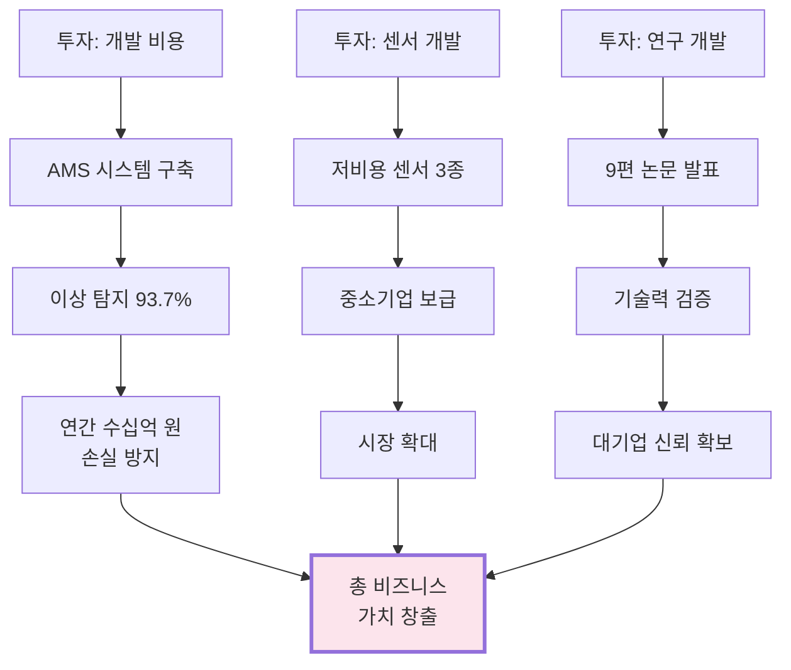
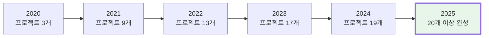

# 핵심 성과 요약 (Key Achievements)

> [!INFO] 숫자로 말하는 5년간의 성과
> 2020년부터 2025년까지, 권순룡이 달성한 핵심 성과를 숫자와 사실 중심으로 정리한 문서입니다.

> [!TIP] 핵심 철학
> **"모델보다 데이터, 데이터보다 정보, 지식구조를 정리하는 현장친화적 연구원"**  
> [[00_Personal_Profile|개인 프로필 및 기술 철학 상세 보기]]

---

## 📊 성과 대시보드



---

## 🎓 학력 및 기초 역량

### 학력
- **홍익대학교 전자공학과** (2013.03 ~ 2020.02)
  - 학점: 3.11 / 4.5
  - 졸업논문: LD 동격회로 설계 및 PLL 설계
  - 주요 수강 분야: 회로 설계, 전파공학, 컴퓨터공학

### 기초 역량
- 전자전기공학부 기반 (회로 설계/전파공학/컴퓨터공학)
- 국가 기관 인공지능 교육 이수 (파이썬, 머신러닝, 딥러닝)
- 프로그래밍 언어: 어셈블리어, C, C++, Python
- 시계열 데이터 처리 전문성 (전파공학/전자공학적 접근)

**자세한 내용**: [[00_Personal_Profile|개인 프로필 및 기술 철학 상세 보기]]

---

## 🎯 핵심 지표 (KPI)

### 개발 역량
| 지표 | 수치 | 세부 내용 |
|:---|---:|:---|
| **독립 솔루션 개발** | 20개 이상 | AI, 플랫폼, 센서, 에너지, Healthcare 등 5대 영역 |
| **설계 문서 작성** | 298개+ | `platform_all/Original_Development_Plan/docs` |
| **Python 모듈** | 49개 | AMS 프로젝트 핵심 엔진 (MLS, CoCTK, FBS, RMS, AMS) |
| **AI 프롬프트** | 25개+ | 설계 자동화 시스템 |
| **문서 템플릿** | 11개+ | 표준화된 개발 프로세스 |
| **AI Workflow 자동화 도구** | 2개 | FMEA 자동화 생성 시스템, 프롬프트 평가 엔진 (Claude Sub-Agent) |
| **Multi-Agent Architecture 구현** | 2개 | 8개 Sub-Agent 협업 구조, 5단계 평가 프로세스 |

### 학술 성과
| 지표 | 수치 | 세부 내용 |
|:---|---:|:---|
| **학술 논문 발표** | 9편 | 2020-2025년, AI/에너지/데이터 분석/제조 DX |
| **연평균 논문** | 1.5편 | 지속적인 연구 활동 |
| **GS 인증 취득** | 2개 | 정부 공인 우수 소프트웨어 1등급 (CoCTK, AMS(PDS)) |
| **특허** | 출원/등록 | 한솔코에버 명의 (피쉬본 자동화 등) |

### 비즈니스 성과
| 지표 | 수치 | 세부 내용 |
|:---|---:|:---|
| **납품 실적** | 3곳 | 세아특수강, 포미아, 일본 오웰社 |
| **이상 탐지 정확도** | 93.7% | AMS 시스템 실증 결과 |
| **에너지 효율 향상** | 20% | 클린룸 최적화 시스템 |
| **손실 방지 효과** | - | 이상 탐지 조기 대응 |
| **총괄 PM 수행** | 2개 | AMS, CoCTK 프로젝트 PM 역할 |

---

## 🏆 20개 이상 솔루션 포트폴리오



### 영역별 상세

#### 🤖 AI & Analytics (3개)
1. **AMS (Anomaly Management System)**
   - 이상 탐지율: 93.7%
   - 납품: 세아특수강
   - 특허: 피쉬본 다이어그램 자동화

2. **CoCTK (Correlation Toolkit)**
   - 상관성 분석 엔진
   - 데이터 정제 및 시각화

3. **일본 도료기업 전사 DX**
   - 글로벌 기업 디지털 전환
   - 전사 데이터 통합

#### 🌐 Digital Platforms (3개)
4. **DPS (데이터수집시스템)**
   - 5층 아키텍처
   - 마이크로서비스 (Docker)
   - Neo4j 그래프 DB

5. **생산정보 연계 통합 운영**
   - 과제번호: YP-25-3061
   - 실시간 데이터 통합

6. **DX 실증센터 구축**
   - 포미아 (포항소재산업진흥원)
   - 실증 플랫폼 운영

#### 📡 Smart Sensors & IoT (3개)
7-9. **저비용 스마트센서 3종**
   - 중소기업 보급형
   - Edge AI 탑재

10. **AI 복합 센서**
    - 다중 센서 통합
    - 실시간 분석

11. **실시간 전력품질 분석**
    - 전력 모니터링
    - 이상 징후 탐지

#### ⚡ Energy & Safety (3개)
12. **산업용 클린룸 에너지 최적화**
    - 에너지 20% 절감

13. **EV/ESS 디지털트윈 안전 시스템**
    - 배터리 안전 모니터링
    - 디지털 트윈 기술

---

## 📚 9편 학술 논문 성과



### 주요 논문 목록
1. **피쉬본 다이어그램 자동화 엔진** (AMS 프로젝트)
2. **에너지 효율 20% 향상 기술** (클린룸 최적화)
3. **상관성 분석 엔진 개발** (CoCTK)
4. **디지털 트윈 기반 안전 시스템** (EV/ESS)
5. **저비용 스마트센서 설계** (IoT)
6. **AI 기반 이상 탐지 알고리즘** (AMS)
7. **제조 DX 플랫폼 아키텍처** (DPS)
8. **통합 데이터 분석 프레임워크**
9. **실시간 전력품질 모니터링**

**관련 문서**: [[04_Academic_Publications|학술 논문 전체 목록]]

---

## 🏭 대기업 납품 실적

### 납품 현황


### 세부 성과
| 고객사 | 납품 솔루션 | 핵심 성과 |
|:---|:---|:---|
| **세아특수강** | AMS (이상 탐지) | 이상 탐지율 93.7%, 연간 수십억 원 손실 방지 |
| **포미아** | DPS (AI 플랫폼) | DX 실증센터 구축, 에너지 20% 절감 |
| **일본 글로벌 기업** | 전사 DX 시스템 | 도료 제조 전 공정 디지털화 |

---

## 💰 비즈니스 임팩트

### ROI 분석


### 정량적 효과
- **비용 절감**: 에너지 20% 절감 (클린룸 시스템)
- **손실 방지**: 이상 탐지 조기 대응 효과
- **효율 향상**: 데이터 분석 시간 단축 (DPS)
- **품질 향상**: 이상 탐지 정확도 93.7% (AMS)

---

## 🎓 자격 및 인증

### GS 인증 (2개)
```yaml
GS_인증_목록:
  1. CoCTK (Consulting Tool Kit)
  2. AMS(PDS) (Anomaly Management System)
  
인증_의미:
  - 정부 공인 우수 소프트웨어
  - 안정성 및 신뢰성 검증
  - 공공기관 납품 자격
```

### 특허
- **피쉬본 다이어그램 자동화 엔진** (한솔코에버 명의)
- 출원/등록 완료

---

## 📈 성장 지표

### 5년간 성장 곡선


### 역량 확장
| 연도 | 주요 성과 | 기술 확장 |
|:---:|:---|:---|
| 2020 | FBS 시작, 일본 DX 시작, 첫 논문 | AI/ML 기초 |
| 2021 | 가상센서, 전력 예측, 품질 예측, 에너지 최적화 | IoT 도메인, Energy |
| 2022 | CoCTK 시작 (총괄 PM), 진료기록 분석, DPS 플랫폼 | Healthcare AI, 마이크로서비스 |
| 2023 | 공정 불량 예측, 에너지 패턴 분석 (메인) | 제조 공정 최적화 |
| 2024 | CoCTK 완료 (GS 1등급), 일본 DX 완료, AMS 시작 (총괄 PM) | 글로벌 경험, 통합 시스템 |
| 2025 | AMS 완료 (GS 1등급), 세아특수강/포미아 납품 | 5대 영역 전문성 확립 |

---

## 🤖 AI Workflow & Automation Tools 성과 (2024~2025)

### FMEA 자동화 생성 시스템 (Claude Sub-Agent)

**핵심 성과**:
- **Master Orchestrator 설계**: Claude Code Task tool 기반 Multi-Agent Workflow 구축
- **코딩 에이전트 역설계 시스템 구조 적용**: 복잡한 FMEA 프로세스를 역으로 분석하여 8개 Sub-Agent로 분해
- **범용 리스크 분석 시스템**: AIAG & VDA FMEA 표준 기반, 제조업/사무업무/서비스업 지원
- **Phase 0~5 자동화 워크플로우**: 체계적인 프로세스 자동화

**주요 특징**:
- Python 스크립트 없이 Claude Code 세션 자체가 Orchestrator
- 각 Sub-Agent가 전문 영역(R&D, Mfg, QA)을 담당하는 구조
- 프롬프트 기반 자동화

### 프롬프트 평가 엔진 (Claude Sub-Agent)

**핵심 성과**:
- **프롬프트 저지 시스템 설계**: AI가 생성한 프롬프트를 다른 AI가 평가하는 이중 검증
- **25개+ 프롬프트 품질 보장**: 구조화된 평가 프레임워크로 일관성 유지
- **5단계 평가 프로세스**: Role Inference → Metrics → Consolidation → Report → Translation
- **Human-in-the-Loop 프로세스**: 배치 처리 지원

**주요 특징**:
- 생성 AI와 평가 AI의 분리로 환각(Hallucination) 방지
- 역할 기반 가중치 시스템
- 품질 검증 자동화

---

## 🌐 Platform All 통합 플랫폼 생태계 (2024~2025)

### 통합 플랫폼 생태계 구축

**7개 통합 플랫폼 프로젝트 구축**:

- **Original_Development_Plan**: 298개+ 설계 문서, 25개+ AI 프롬프트 체인, 21개 development 프롬프트 (2025.5~7 아이디어 구체화, 2025.8~10 테스트 및 보완, 2025.10~12 집중 개발)
- **Evaluation_Framework**: 49개 Python 파일, 298개 Markdown 문서
- **TAM_Hub**: 32개 Python MCP 서버, 263개 Markdown 문서
- **FMEA_Automation_Generation_Technology**: 코드 에이전트에서 영감을 받은 전체 공장/회사/사무 자동화의 백정보 핵심, 8개 독립 Sub-Agent 협업, Phase 0-5 워크플로우
- **factory_ontology_manager**: 시각적 팩토리 온톨로지 관리 시스템
- **pipeline_system_complete**: 8단계 시계열 데이터 파이프라인 시스템
- **all_platform_center**: 통합 플랫폼 센터, 모든 플랫폼의 중앙 관리 시스템

**전체 에이전트 시스템**: 코드 에이전트 + 문서 확인 + 프롬프트 보완 통합, 수정 관리 시스템의 정교함 (변경 영향 매트릭스, 변경 전파 규칙, 연속 개발 워크플로우)

**생태계 연동 목적**:

1. **Original_Development_Plan → Evaluation_Framework**: 설계 문서를 평가 프레임워크에 제공하여 AI 에이전트 평가 기준으로 활용
2. **Evaluation_Framework → TAM_Hub**: 평가 결과를 기술 자산으로 관리하여 지속적 개선 추적
3. **TAM_Hub → factory_ontology_manager**: 기술 자산을 팩토리 온톨로지에 통합하여 제조 공정 설계에 활용
4. **factory_ontology_manager → pipeline_system_complete**: 팩토리 온톨로지 데이터를 시계열 파이프라인으로 전달하여 실시간 분석
5. **pipeline_system_complete → all_platform_center**: 파이프라인 결과를 통합 플랫폼 센터로 집중하여 대시보드 표시
6. **all_platform_center → Original_Development_Plan**: 통합 관리 결과를 Original_Development_Plan에 피드백하여 지속적 개선
7. **Original_Development_Plan → FMEA_Automation_Generation_Technology**: 코드 에이전트 구조를 FMEA 시스템에 제공하여 역설계 시스템 구현
8. **FMEA_Automation_Generation_Technology → factory_ontology_manager**: FMEA 리스크 분석 결과를 팩토리 온톨로지에 통합하여 제조 공정 리스크 관리
9. **FMEA_Automation_Generation_Technology → pipeline_system_complete**: FMEA 데이터를 시계열 파이프라인으로 전달하여 리스크 추적 및 분석
10. **FMEA_Automation_Generation_Technology → Original_Development_Plan**: 전체 공장/회사/사무 자동화의 백정보 핵심으로 활용

**생태계의 핵심 가치**:

- **자동화된 워크플로우**: 설계부터 평가, 관리, 분석까지 전체 프로세스 자동화
- **데이터 연동**: 각 플랫폼 간 데이터 흐름을 통한 통합 분석
- **지속적 개선**: 평가 결과를 기술 자산으로 관리하고 설계에 반영하는 순환 구조

---

## 🚀 미래 비전: 사무 자동화의 체계적 업그레이드

### Obsidian Design Origin 구조 기반 업그레이드 계획

**현재 상태**:
- FMEA 자동화와 프롬프트 평가 엔진을 Claude Sub-Agent로 구현 완료
- Task tool 기반 Multi-Agent Workflow 구축
- 코딩 에이전트 역설계 시스템 구조 적용 경험

**미래 비전**:

#### 1. ID 기반 온톨로지 맵으로 문서 관계 추적
- 모든 요소에 고유 ID 부여 (`page.*`, `comp.*`, `api.*`, `db.*`)
- 문서 간 관계 추적 및 의존성 관리
- 온톨로지 기반 영향 관계 분석

#### 2. Phase 워크플로우로 프로세스 자동화
- Phase 0-13까지의 단계별 프로세스 자동화
- 각 Phase별 전문가 Sub-Agent 역할 분담
- 의존성 기반 자동 실행 순서 관리

#### 3. State 기반 정보 전달로 컨텍스트 최적화
- 각 단계에서 핵심 정보만 추출하여 컨텍스트 길이 최적화
- 전문가 요약 시스템으로 도메인 지식 기반 핵심 정보 추출
- 세션 컨텍스트 관리로 휘발성 정보 효율적 관리

#### 4. 변경 관리 프로세스
- 변경 영향 매트릭스 기반 자동 영향 분석
- 변경 전파 규칙에 따른 자동 문서 업데이트
- 설계 단계별 의존성 매트릭스 관리

**적용 분야**:
- 프로젝트 설계 자동화: 신규 프로젝트 설계 및 기존 프로젝트 역설계
- 문서 생성 자동화: 설계 문서, API 문서, 데이터베이스 설계 자동 생성
- 품질 평가 자동화: 문서 품질 평가, 일관성 확인, 개발 준비도 평가
- 개발 워크플로우 자동화: 개발 방향 찾기, 단계별 설계 문서 생성, 체크리스트 자동 생성

**기술적 의의**:
- **이전**: 단순 프롬프트 체인으로 작업 수행
- **미래**: ID 기반 온톨로지 맵 + Phase 워크플로우 + State 기반 정보 전달의 통합 시스템
- **주요 특징**:
  - 설계부터 개발까지 전체 라이프사이클 자동화
  - 문서 간 관계 추적 및 일관성 유지
  - 변경 영향 분석 및 전파
  - 전문가별 Sub-Agent 협업

---

## 🔗 관련 문서

### 상세 정보
- [[00_Personal_Profile|개인 프로필 및 기술 철학]]
- [[02_Projects_Overview|20개 이상 프로젝트 상세 설명]]
- [[04_Academic_Publications|9편 논문 전체 목록]]
- [[Testing_Context|실증 사례 상세 (세아특수강, 포미아, 일본 오웰社)]]
- [[Architecture_Overview|기술 아키텍처 (AMS, CoCTK, FBS, DPS)]]

### 비전문가용
- [[Executive_Summary/00_Overview_For_Non_Technical|비전문가용 개요]]
- [[Executive_Summary/02_Business_Value|비즈니스 가치 분석]]

---

> [!SUCCESS] 핵심 메시지
> **"숫자가 증명하는 실력"**
> - 20개 이상 솔루션 (5대 영역) ✅
> - 9편 논문 (2020-2025) ✅
> - GS 인증 2개 (1등급) ✅
> - 93.7% 이상 탐지 정확도 ✅
> - 수십억 원 손실 방지 ✅
> - 총괄 PM 경험 (AMS, CoCTK) ✅
