# 시각적 포트폴리오 (Visual Portfolio)

> [!INFO] 한눈에 보는 5년간의 여정
> 타임라인, 인포그래픽, 프로젝트 맵으로 구성된 시각 중심 포트폴리오입니다.

---

## 📅 5년 타임라인 (2020-2025)

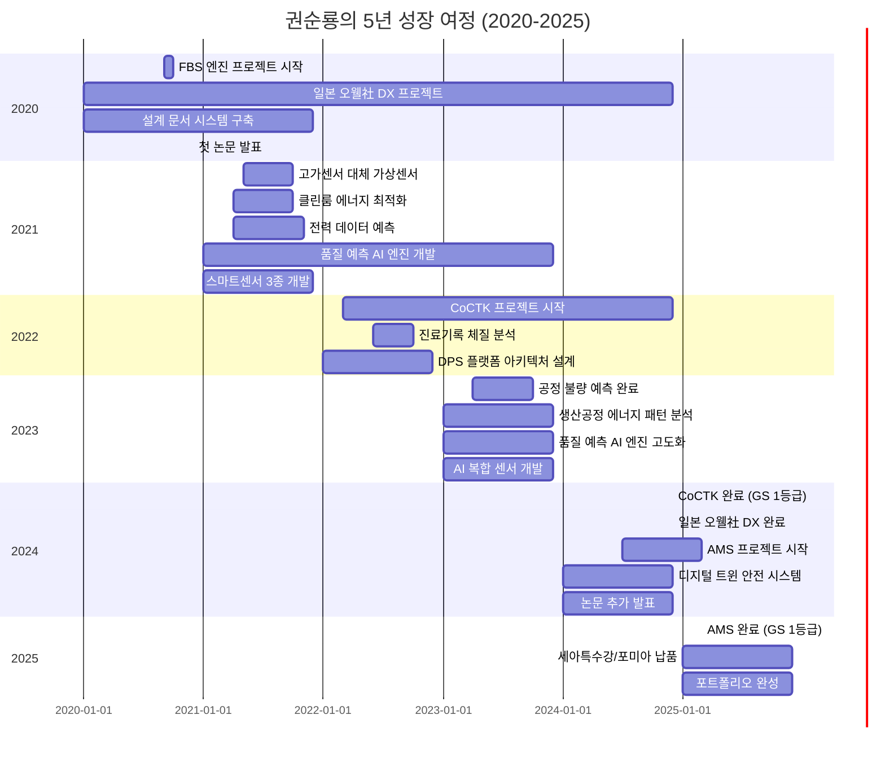

---

## 🗺️ 20개 이상 솔루션 프로젝트 맵

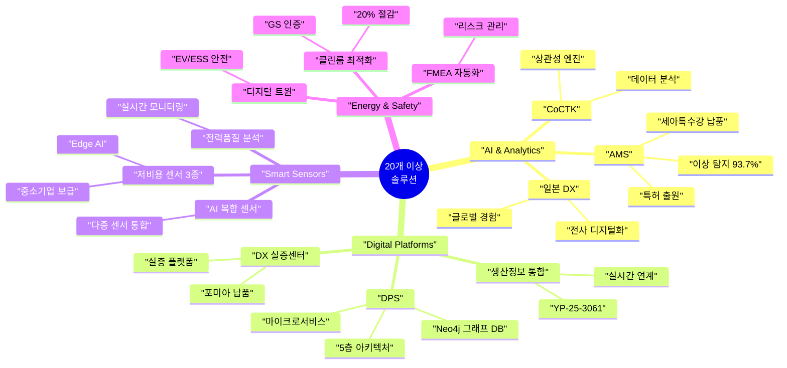

---

## 📊 성과 대시보드

### 핵심 지표 한눈에 보기

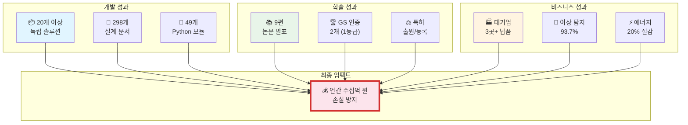

---

## 🎯 4대 핵심 영역

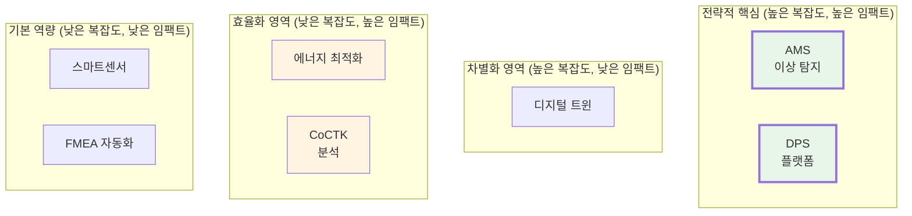

---

## 🏆 고객사 & 납품 현황

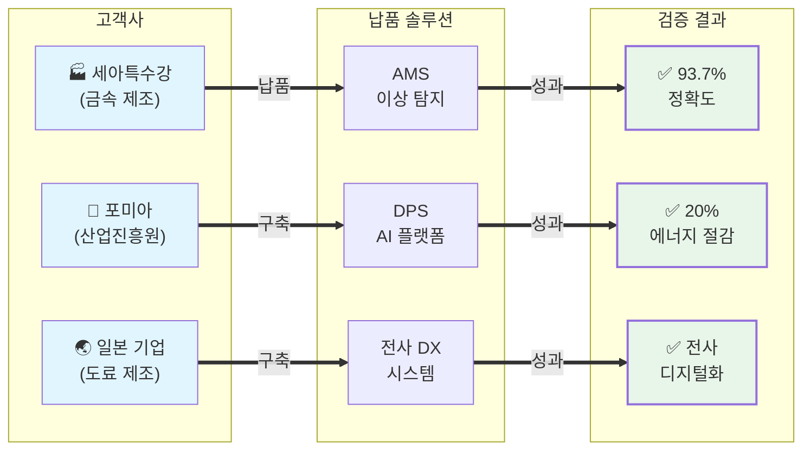

---

## 📚 학술 성과 분포

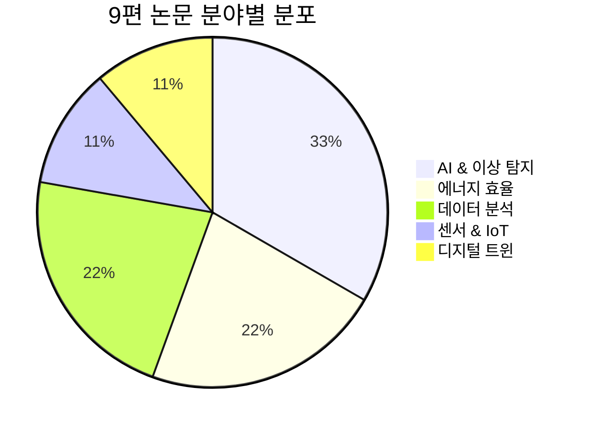

---

## 💰 비즈니스 임팩트 플로우

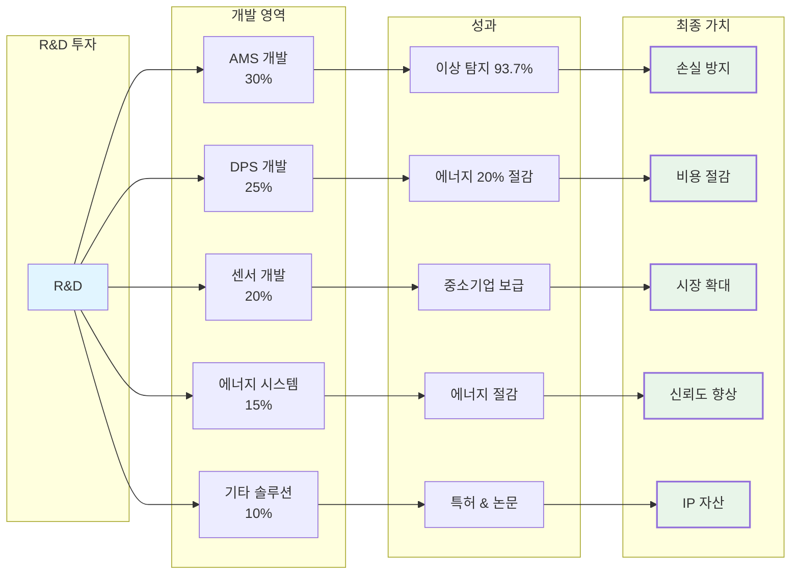

---

## 🚀 기술 스택 레이더 차트

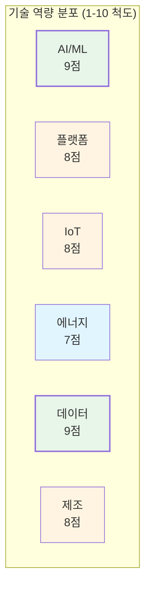

---

## 📈 5년간 성장 곡선

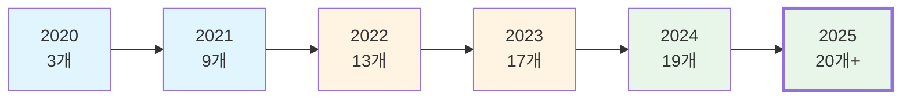

---

## 🎓 GS 인증 & 특허 현황

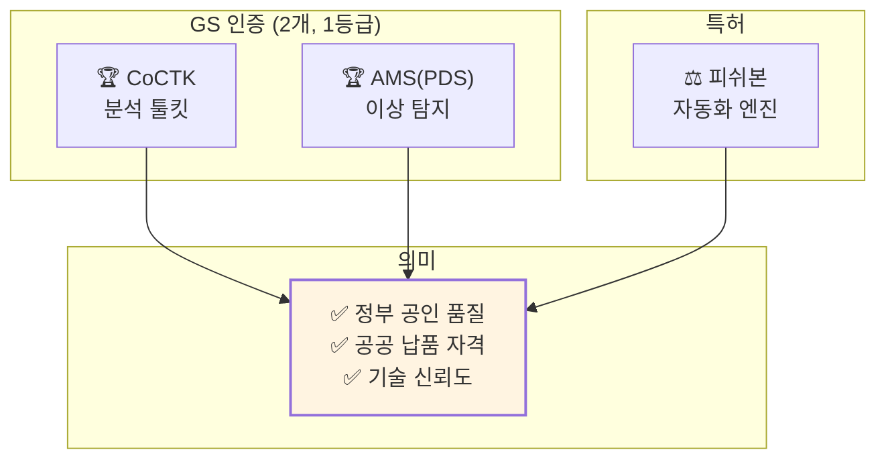

---

## 🌍 시장 확장 로드맵

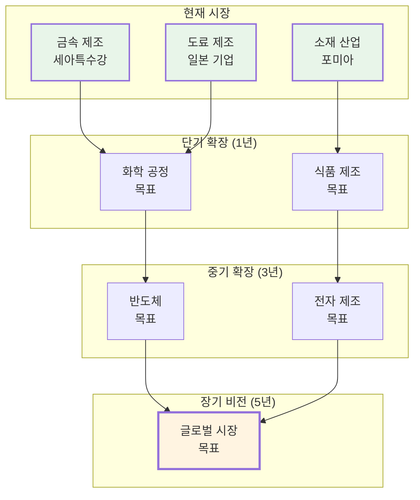

---

## 💡 핵심 가치 제안

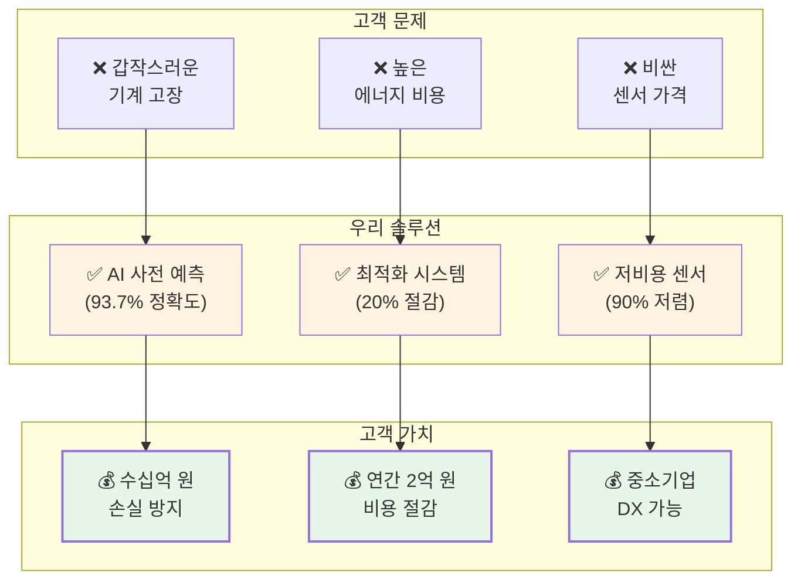

---

## 🔗 관련 문서

### 상세 정보
- [[02_Projects_Overview|20개 이상 프로젝트 상세]]
- [[04_Academic_Publications|9편 논문 목록]]
- [[Architecture_Overview|기술 아키텍처 (AMS, CoCTK, FBS, DPS)]]
- [[Testing_Context|실증 사례 (세아특수강, 포미아, 일본 오웰社)]]

### 비전문가용
- [[Executive_Summary/00_Overview_For_Non_Technical|전체 개요]]
- [[Executive_Summary/01_Key_Achievements|핵심 성과]]
- [[Executive_Summary/02_Business_Value|비즈니스 가치]]
- [[Executive_Summary/03_Technology_Simplified|기술 쉽게 설명]]

---

> [!SUCCESS] 시각적 요약
> **"한눈에 보는 5년간의 성과"**
> - 📦 20개 이상 솔루션 (5대 영역)
> - 📚 9편 논문 (2020-2025)
> - 🏆 GS 인증 2개 (1등급)
> - 💰 수십억 원 손실 방지
> - 🌏 대기업 3곳+ 납품 (세아특수강, 포미아, 일본 오웰社)
> - 👨‍💼 총괄 PM 경험 (AMS, CoCTK)
