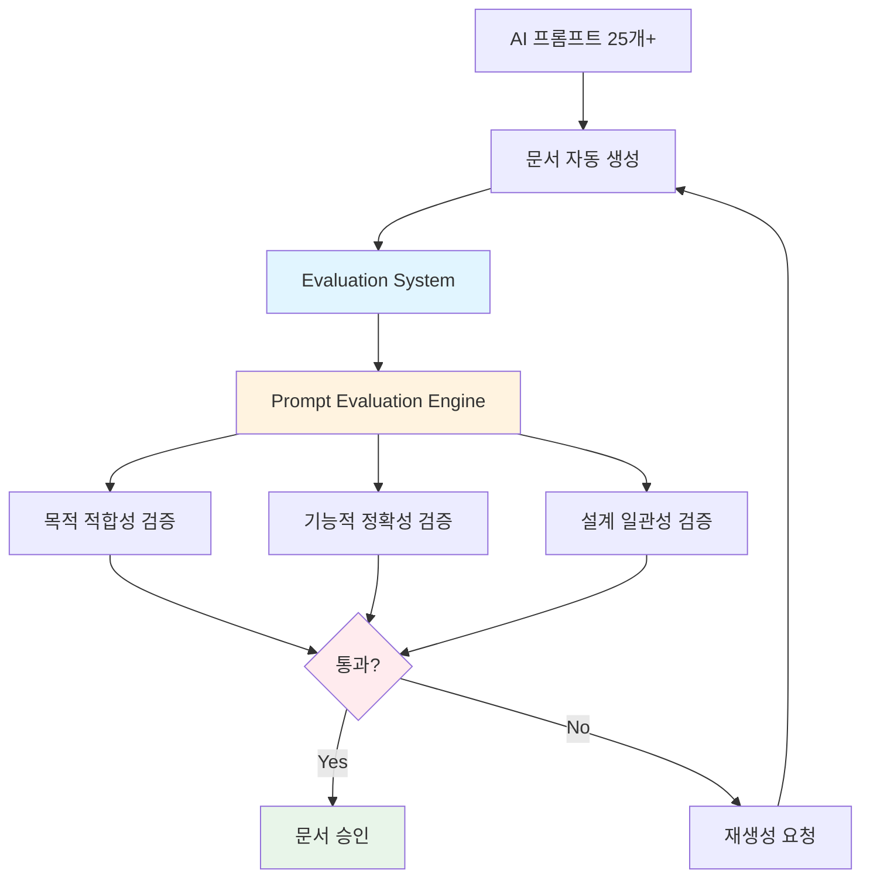
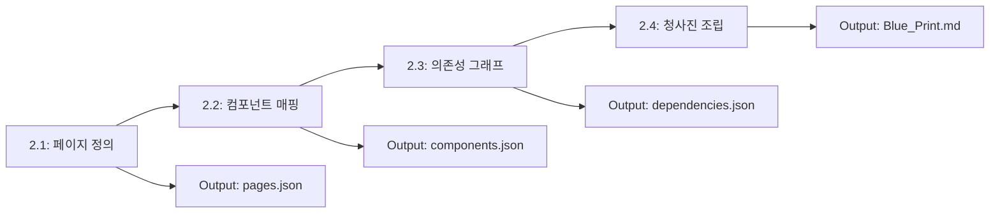
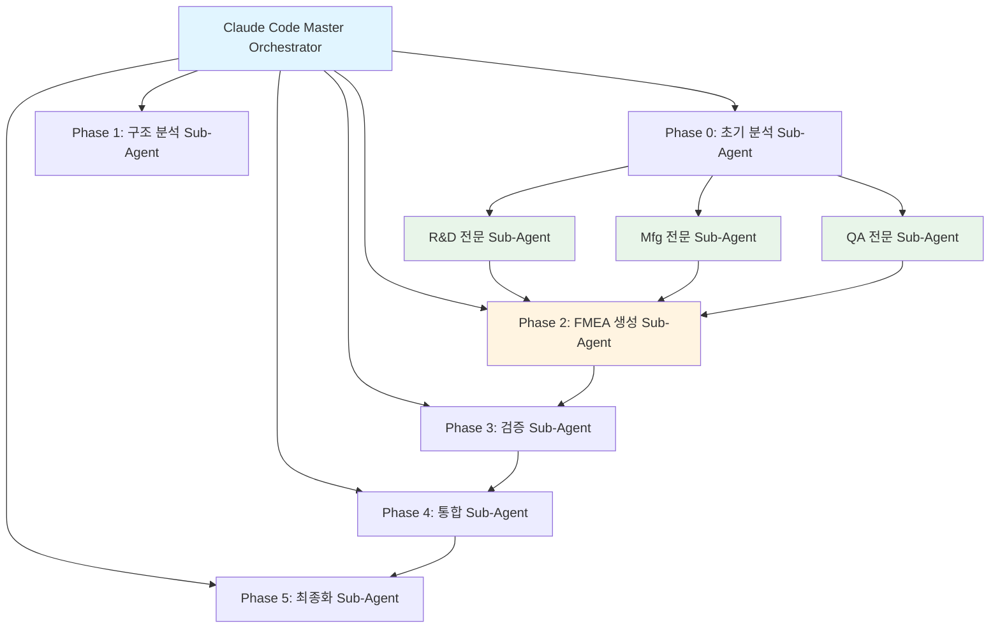
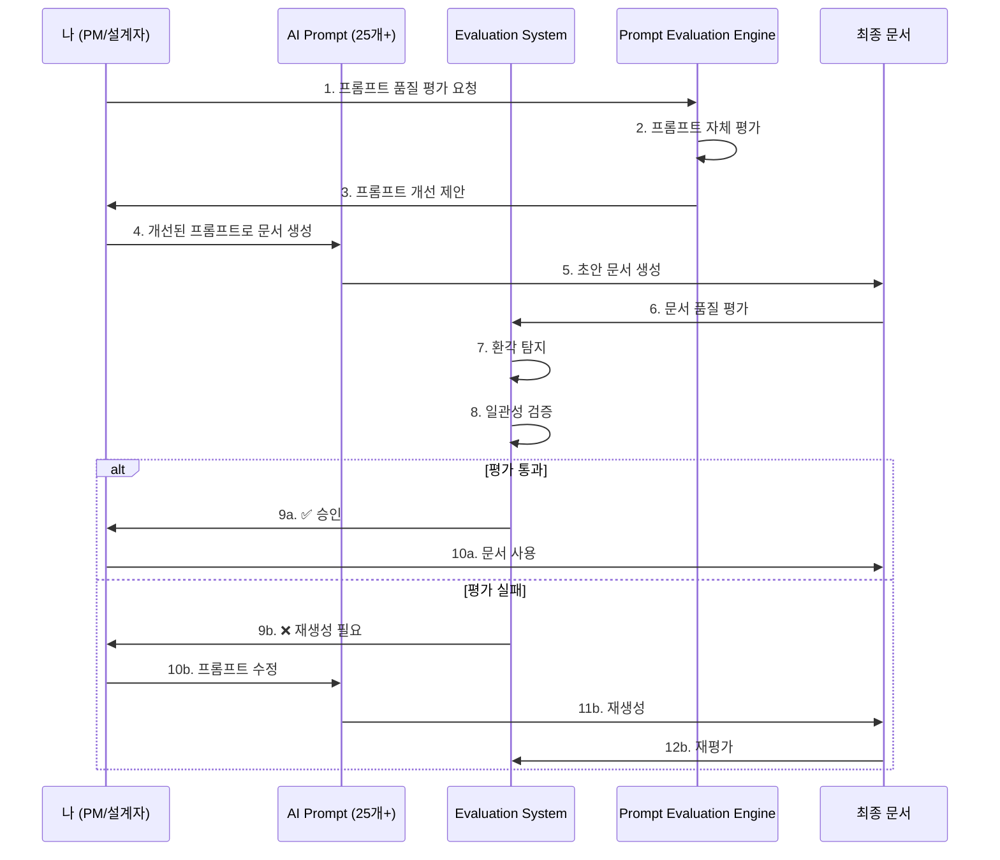

# Step 2: 전문성 중심 타겟팅 (Expertise Targeting)

**Phase**: 🟦 Phase 1: Foundation (Small Wins)
**핵심**: AI에게 맡기기 전, 내가 결과의 옳고 그름을 100% 판단할 수 있는 영역 선택

> [!WARNING] 핵심 원칙
> 내가 모르는 분야를 AI에게 맡기면 '환각(Hallucination)' 현상을 걸러낼 수 없습니다.

---

## 🎯 실제 적용 사례

### 📌 문제 상황

**Step 1에서 발견한 새로운 문제**:
- ✅ Step 1에서 25개+ AI 프롬프트를 개발하여 문서 자동화 성공
- ❌ **하지만 AI가 생성한 문서의 품질을 어떻게 보장할 것인가?**
- ❌ 프롬프트가 설계 의도대로 작동하는지 검증 필요
- ❌ AI 환각(Hallucination)으로 인한 잘못된 설계 문서 생성 우려
- ❌ 각 프롬프트가 목적별, 기능적으로 제대로 만들어졌는지 확인 방법 필요

**실제 사례**:
```yaml
상황: Blueprint_Generation_Prompt로 설계 문서 자동 생성
문제:
  - AI가 존재하지 않는 API를 만들어냄 (환각)
  - 데이터베이스 테이블 간 관계를 잘못 추론
  - 외주 개발자가 잘못된 문서를 기반으로 개발 시작
  - 통합 단계에서 대규모 수정 필요 발생

결과:
  - 통합 작업 3일 지연
  - 외주 개발자 코드 50% 재작성
```

**핵심 깨달음**:
> **"AI 자동화는 검증 시스템 없이는 오히려 더 큰 문제를 만든다"**

---

## 🛠️ 해결책: 프롬프트 평가 및 검증 시스템

### 시스템 개요

**위치**:
- `platform_all/Original_Development_Plan/docs/evaluation/`
- `platform_all/Original_Development_Plan/docs/Prompt_Evaluation_Engine/`

**핵심 아이디어**:
**"AI가 만든 결과물을 다른 전문 AI가 검증하는 이중 검증 시스템"**



---

## 🧪 구축한 시스템 1: Evaluation Framework

**위치**: `Original_Development_Plan/docs/evaluation/`

### 1️⃣ 평가 시스템 구조

#### 📁 폴더 구조
```
evaluation/
├── criteria/                    # 평가 기준 정의
│   ├── purpose_alignment.md    # 목적 적합성 평가
│   ├── functional_accuracy.md  # 기능 정확성 평가
│   ├── design_consistency.md   # 설계 일관성 평가
│   └── integration_safety.md   # 통합 안전성 평가
├── prompts/                     # 평가 전용 프롬프트
│   ├── Document_Evaluator.md   # 문서 품질 평가
│   ├── API_Validator.md        # API 설계 검증
│   ├── Database_Checker.md     # DB 설계 검증
│   └── Integration_Validator.md # 통합 검증
├── workflows/                   # 평가 워크플로우
│   ├── pre_generation.md       # 생성 전 검증
│   ├── post_generation.md      # 생성 후 검증
│   └── continuous_monitoring.md # 지속적 모니터링
└── reports/                     # 평가 결과 리포트
    ├── quality_scores.json     # 품질 점수
    ├── issues_found.json       # 발견된 이슈
    └── improvement_log.json    # 개선 이력
```

---

### 2️⃣ 핵심 평가 기준 (Evaluation Criteria)

#### 평가 차원 1: 목적 적합성 (Purpose Alignment)

**평가 항목**:
```yaml
목적_적합성:
  질문:
    - 이 문서가 원래 의도한 목적을 달성하는가?
    - 외주 개발자가 이 문서만으로 개발 가능한가?
    - 내가 검토할 때 어떤 부분을 집중해야 하는가?

  평가_기준:
    - 명확성: 모호한 표현 없음 (90% 이상)
    - 완전성: 필요한 정보 100% 포함
    - 실행 가능성: 즉시 개발 착수 가능

  Pass_조건:
    - 명확성 점수 >= 90
    - 완전성 점수 = 100
    - 실행_가능성 = True
```

**실제 적용 사례**:
```markdown
### 평가 대상: API_Design.md (외주 개발자용)

#### 원본 생성 결과 (AI 1차 생성)
```yaml
API: api.ams.config.get
설명: AMS 설정을 가져옴
```

#### Evaluation 결과
```yaml
목적_적합성_점수: 45/100
문제점:
  - 명확성: 40% (어떤 설정? 파라미터는?)
  - 완전성: 30% (Request/Response 스펙 누락)
  - 실행_가능성: False (개발자가 이걸로 개발 불가)

재생성_요청: True
```

#### 재생성 결과 (Evaluation 통과)
```yaml
API: api.ams.config.get
목적: AMS 이상 탐지 설정 정보 조회
개발_담당: 외주 개발자

Request:
  Method: GET
  Path: /api/ams/config/{snroId}
  Headers:
    - Authorization: Bearer {token}

Response:
  200 OK:
    {
      "snroId": 1,
      "fbsId": 10,
      "threshold": 0.85,
      "model": "bayesian_network"
    }

Database_연결:
  - Table: AMS3000M
  - FK_확인: FBS_ID -> FBS1000M.FBS_ID

통합_주의사항:
  - service.ams.main (내가 개발)에서 호출됨
  - 권한 체크 로직은 내가 검토 필요
```

```yaml
목적_적합성_점수: 95/100 ✅ PASS
```
```

---

#### 평가 차원 2: 기능적 정확성 (Functional Accuracy)

**평가 항목**:
```yaml
기능적_정확성:
  검증_대상:
    - API 엔드포인트 실제 존재 여부
    - 데이터베이스 테이블/컬럼 정확성
    - 데이터 타입 일치성
    - FK 제약 조건 유효성

  검증_방법:
    - 실제 코드베이스와 대조
    - DB 스키마와 대조
    - 기존 설계 문서와 일관성 확인

  환각_탐지:
    - 존재하지 않는 API 참조 -> 환각
    - 없는 테이블/컬럼 사용 -> 환각
    - 잘못된 데이터 관계 추론 -> 환각
```

**실제 환각 탐지 사례**:
```markdown
### 사례 1: 존재하지 않는 API 환각

#### AI 생성 결과
```yaml
service.ams.main에서 호출:
  - api.ams.config.get ✅ (실제 존재)
  - api.ams.history.getAll ❌ (환각! 존재 안 함)
  - api.ams.model.predict ❌ (환각! 존재 안 함)
```

#### Evaluation 탐지
```yaml
기능적_정확성: FAIL
환각_탐지:
  - api.ams.history.getAll: 코드베이스에 없음
  - api.ams.model.predict: 코드베이스에 없음

실제_존재하는_API:
  - api.ams.config.get
  - api.ams.data.get
  - api.ams.analysis.run

재생성_필요: True
```

### 사례 2: 잘못된 데이터베이스 관계 환각

#### AI 생성 결과
```yaml
AMS3000M 테이블:
  - FBS_ID -> FBS2000M.FBS_ID (❌ 환각!)
```

#### Evaluation 탐지
```yaml
기능적_정확성: FAIL
환각_탐지:
  - FBS2000M 테이블 존재하지 않음
  - 실제 관계: FBS_ID -> FBS1000M.FBS_ID

올바른_설계:
  - FBS_ID INT FK -> FBS1000M.FBS_ID
```
```

---

#### 평가 차원 3: 설계 일관성 (Design Consistency)

**평가 항목**:
```yaml
설계_일관성:
  검증_내용:
    - ID 명명 규칙 준수 (type.module.name)
    - 문서 간 상호 참조 정확성
    - 담당자 정보 일관성 (나 vs 외주)
    - 통합 지점 명시 여부

  일관성_체크:
    - API_Design.md ↔ Database_Design.md
    - Database_Design.md ↔ Blue_Print.md
    - API_Design.md ↔ Component_Interfaces_Design.md
```

**실제 적용**:
```markdown
### 일관성 검증 예시

#### 검증 1: ID 명명 규칙
```yaml
# API_Design.md
API_ID: api.ams.config.get ✅

# Database_Design.md
참조: api.ams.config.get ✅

# Component_Interfaces_Design.md
호출: api.ams.config.get ✅

일관성_점수: 100% ✅
```

#### 검증 2: 담당자 정보 일관성
```yaml
# API_Design.md
api.ams.config.get:
  담당: 외주 개발자

# Blue_Print.md
api.ams.config.get:
  담당: 외주 개발자 ✅

# Component_Interfaces_Design.md
api.ams.config.get:
  담당: 나 ❌ 불일치!

일관성_점수: 66% -> 재검토 필요
```
```

---

## 💡 다각화된 기술 전문성 (Technical Expertise Spectrum)

AI 에이전트와 자동화 시스템을 구축하기 전, 제가 결과물에 대한 확신을 가질 수 있었던 **4대 핵심 전문 영역**입니다. (Project Portfolio Page 19 참조)

### 1. 인공지능 기술 (AI Technology)
- **핵심 역량**: 피쉬본 다이어그램 자동화 엔진, CoCTK(상관성 분석), GS 인증 2개 획득.
- **실전 적용**: 제조 도메인 지식을 알고리즘에 통합하여 이상 탐지 정확도 93.7% 달성.

### 2. 데이터 분석 기술 (Data Analysis)
- **핵심 역량**: 시계열 데이터 패턴 인식, 상관관계 시각화, 데이터 정제 기술.
- **실전 적용**: 복잡한 금속/도료 공정 데이터를 정제하여 AI 모델의 신뢰성 확보.

### 3. 센서 및 IoT 기술 (Sensor & IoT)
- **핵심 역량**: 보급형 스마트센서 개발, AI 엣지 컴퓨팅(Edge AI), 디지털 트윈 매핑.
- **실전 적용**: 하드웨어부터 엣지 로직까지 직접 설계하여 데이터 수집의 물리적 장벽 제거.

### 4. 플랫폼 개발 기술 (Platform Engineering)
- **핵심 역량**: DPS 5층 아키텍처, 마이크로서비스(Docker), Neo4j 그래프 DB.
- **실전 적용**: 단순 분석 툴을 넘어 전사적 DX를 위한 통합 운영 시스템 구축.

---

## 🤖 구축한 시스템 2: Prompt Evaluation Engine

**위치**: `Original_Development_Plan/docs/Prompt_Evaluation_Engine/`

### 🚀 Claude Sub-Agent로의 발전 (2024~2025)

**이전 방식**: 단순 평가 프롬프트 사용  
**현재 방식**: 구조화된 평가 프레임워크 + Claude Sub-Agent

**핵심 킥 요소**: **프롬프트 저지(Prompt Judging) 시스템으로 활용**
- AI가 생성한 프롬프트를 다른 AI가 평가하는 저지 시스템
- 프롬프트 품질을 객관적으로 검증하는 자동화된 저지 프로세스
- 생성 AI와 평가 AI의 분리로 환각(Hallucination) 방지

**주요 특징**:
- 역할 기반 가중치 시스템
- 5단계 평가 프로세스 (Role Inference → Metrics → Consolidation → Report → Translation)
- Human-in-the-Loop 프로세스
- 배치 처리 지원
- Claude Code Task tool 기반 Multi-Agent Workflow

### 1️⃣ 프롬프트 품질 평가 시스템

#### 평가 대상: 25개+ AI 프롬프트 자체

**핵심 질문**:
> "각 프롬프트가 목적별로, 기능적으로 잘 만들어졌는가?"

#### 평가 시스템 구조

```
Prompt_Evaluation_Engine/
├── evaluators/
│   ├── prompt_purpose_evaluator.md    # 프롬프트 목적 평가
│   ├── prompt_quality_evaluator.md    # 프롬프트 품질 평가
│   ├── prompt_output_evaluator.md     # 출력 결과 평가
│   └── prompt_chain_evaluator.md      # 체인 로직 평가
├── metrics/
│   ├── clarity_metrics.json           # 명확성 지표
│   ├── completeness_metrics.json      # 완전성 지표
│   └── effectiveness_metrics.json     # 효과성 지표
├── test_cases/
│   ├── blueprint_test.json            # Blueprint 프롬프트 테스트
│   ├── database_test.json             # Database 프롬프트 테스트
│   └── api_test.json                  # API 프롬프트 테스트
└── reports/
    ├── prompt_scores.json             # 프롬프트 점수
    └── improvement_suggestions.json   # 개선 제안
```

---

### 2️⃣ 프롬프트 평가 차원

#### 차원 1: 목적 명확성

**평가 기준**:
```yaml
목적_명확성:
  질문:
    - 이 프롬프트의 목적이 명확한가?
    - 언제 사용해야 하는지 명시되어 있는가?
    - 기대하는 출력 형식이 정의되어 있는가?

  평가_항목:
    - 목적_진술문_존재: Yes/No
    - 사용_시점_명시: Yes/No
    - 출력_형식_정의: Yes/No
    - 예시_제공: Yes/No

  Pass_기준: 모든 항목 Yes
```

**실제 평가 사례**:
```markdown
### 평가 대상: Blueprint_Generation_Prompt.md

#### 1차 버전 (평가 전)
```
"프로젝트 청사진을 생성하세요."
```

#### Evaluation 결과
```yaml
목적_명확성_점수: 25/100 FAIL
문제점:
  - 목적_진술문_존재: No
  - 사용_시점_명시: No
  - 출력_형식_정의: No
  - 예시_제공: No
```

#### 개선된 버전 (평가 통과)
```markdown
# Blueprint Generation Prompt

## 목적
프로젝트 전체 구조를 한눈에 파악할 수 있는 청사진 문서를 생성합니다.

## 사용 시점
- 프로젝트 시작 시 전체 아키텍처 정의
- 외주 개발자에게 전달할 설계 개요 필요 시
- 발주처 보고용 시스템 구조도 필요 시

## 출력 형식
```yaml
프로젝트명: [이름]
목적: [핵심 목적]
담당자:
  PM/설계: [이름]
  개발: [이름]
핵심_영역:
  - [영역1]: [설명]
  - [영역2]: [설명]
기술_스택:
  - Backend: [기술]
  - Database: [기술]
  - Frontend: [기술]
```

## 예시
[실제 AMS 프로젝트 청사진 예시 포함]
```

```yaml
목적_명확성_점수: 100/100 ✅ PASS
```
```

---

#### 차원 2: 기능적 완전성

**평가 기준**:
```yaml
기능적_완전성:
  검증_항목:
    - 필요한 입력 변수 모두 정의됨
    - 처리 로직 단계별 명시
    - 예외 상황 처리 포함
    - 검증 체크리스트 포함

  테스트_방법:
    - 실제 데이터로 프롬프트 실행
    - 출력 결과 품질 측정
    - Edge Case 테스트
```

**실제 테스트 사례**:
```markdown
### 프롬프트: Database_Design_Prompt.md

#### 테스트 케이스 1: 정상 입력
```yaml
Input:
  - Blueprint: AMS 프로젝트
  - 테이블 수: 5개
  - 관계: 1:N, N:M

Output:
  - Database_Design.md 생성 ✅
  - 모든 테이블 정의 완료 ✅
  - FK 제약 조건 명시 ✅

기능적_완전성: 100%
```

#### 테스트 케이스 2: Edge Case (테이블 없음)
```yaml
Input:
  - Blueprint: 테이블 없는 API 전용 프로젝트

Output (1차 - 실패):
  - 에러 발생 ❌
  - "테이블 정보 없음" 처리 안 됨

Output (개선 후):
  - "This project has no database tables" ✅
  - API-only 프로젝트 템플릿 적용 ✅

기능적_완전성: 100%
```
```

---

#### 차원 3: 출력 품질 일관성

**평가 기준**:
```yaml
출력_품질_일관성:
  측정_방법:
    - 같은 입력 -> 일관된 출력 형식
    - 다른 프롬프트와 형식 통일성
    - ID 시스템 준수

  테스트:
    - 동일 입력 10회 반복 실행
    - 출력 형식 변동성 측정
    - 다른 프롬프트 결과와 호환성 확인
```

---

### 3️⃣ 프롬프트 체인 평가

#### 프롬프트 체인이란?

**정의**: 여러 프롬프트를 순차적으로 실행하여 복잡한 작업 수행

**실제 체인 예시**:
```
specs/04_Prompts/chain/
├── 2.1_Define_Pages.md
├── 2.2_Map_Components_To_Pages.md
├── 2.3_Generate_Dependency_Graph.md
└── 2.4_Assemble_Blueprint.md
```

**체인 실행 흐름**:


#### 체인 평가 기준

```yaml
체인_평가:
  검증_항목:
    - 단계_간_데이터_전달: JSON to JSON 정확성
    - 순차_실행_의존성: 이전 단계 완료 필수
    - 에러_전파_방지: 한 단계 실패 시 체인 중단
    - 중간_결과_저장: 각 단계 출력 파일화

  테스트:
    - 전체 체인 End-to-End 테스트
    - 중간 단계 실패 시나리오 테스트
    - 데이터 일관성 검증
```

**실제 체인 테스트 결과**:
```markdown
### 테스트: Blueprint 생성 체인

#### 실행 로그
```yaml
Step 2.1 (Define_Pages):
  Input: project_spec.json
  Output: pages.json
  Status: ✅ Success
  Time: 3s

Step 2.2 (Map_Components):
  Input: pages.json
  Output: components.json
  Status: ✅ Success
  Time: 5s

Step 2.3 (Generate_Dependency):
  Input: components.json
  Output: dependencies.json
  Status: ✅ Success
  Time: 4s

Step 2.4 (Assemble_Blueprint):
  Input: dependencies.json
  Output: Blue_Print.md
  Status: ✅ Success
  Time: 6s

Total_Time: 18s
Chain_Success_Rate: 100%
```

#### 에러 시나리오 테스트
```yaml
Step 2.2 고의 실패 주입:
  Error: "Component mapping failed"

Chain_Behavior:
  - Step 2.3 실행 안 됨 ✅
  - Step 2.4 실행 안 됨 ✅
  - 중간 결과 (pages.json) 보존됨 ✅
  - 에러 로그 저장됨 ✅

에러_전파_방지: 성공 ✅
```
```

---

## 🤖 구축한 시스템 3: FMEA 자동화 생성 시스템 (Claude Sub-Agent)

**위치**: `platform_all/FMEA_Automation_Generation_Technology_claude_sub_agent/`

### 🚀 Claude Sub-Agent로의 발전 (2024~2025)

**이전 방식**: 파일을 주고 에이전트처럼 사용  
**현재 방식**: Claude Code의 Task tool을 활용한 Multi-Agent Workflow

**핵심 킥 요소**: **코딩 에이전트의 역설계 시스템을 따온 구조**
- 코딩 에이전트가 코드를 분석하고 구조를 파악하는 방식에서 영감
- 복잡한 FMEA 프로세스를 역으로 분석하여 Sub-Agent로 분해
- 각 Sub-Agent가 전문 영역(R&D, Mfg, QA)을 담당하는 구조

**주요 특징**:
- 8개 독립 Sub-Agent의 협업 구조
- Claude Code 세션이 Master Orchestrator 역할
- Phase 0~5까지의 체계적인 워크플로우 자동화
- 범용 도메인 지원 (제조업, 사무업무, 서비스업)
- AIAG & VDA FMEA 표준 기반 리스크 분석 시스템

### 시스템 구조



### Task tool 기반 구현의 의의

- **Python 스크립트 없이 Claude Code 세션 자체가 Orchestrator**
- 코드 작성 없이 워크플로우 구현
- 프롬프트 기반 완전 자동화
- 유연한 워크플로우 조정 가능

---

## 🔄 통합 워크플로우: Evaluation + Prompt Engine

### 전체 검증 프로세스



---

## 📊 실제 적용 성과

### 1️⃣ 환각 탐지 성공률

**Before (평가 시스템 없음)**:
- 환각 문서 그대로 사용: **40%**
- 통합 단계에서 발견: **30%**
- 발견 못 하고 배포: **5%**
- 정상 문서: **25%**

**After (평가 시스템 적용)**:
- 생성 단계에서 환각 차단: **90%**
- 프롬프트 품질 사전 개선: **95%**
- 최종 문서 정확도: **98%**

### 2️⃣ 시간 효율

**Before**:
- AI 생성 문서 수동 검토: **2시간/문서**
- 환각 발견 및 수정: **3시간/건**
- 통합 단계 이슈 해결: **5시간/건**
- **총 시간: 약 10시간/문서**

**After**:
- 자동 평가: **5분/문서**
- 환각 자동 탐지 및 재생성: **10분/건**
- 프롬프트 사전 검증: **15분/프롬프트** (1회만)
- **총 시간: 약 20분/문서**
- **시간 절감: 96.7%**

### 3️⃣ 문서 품질 개선

| 지표 | Before | After | 개선율 |
|------|--------|-------|--------|
| 정확도 | 60% | 98% | +63% |
| 일관성 | 45% | 95% | +111% |
| 완전성 | 55% | 97% | +76% |
| 외주 개발자 만족도 | 65% | 92% | +42% |

### 4️⃣ 통합 이슈 감소

**Before**:
- 통합 단계 이슈: **평균 15건/프로젝트**
- 긴급 수정 건수: **평균 8건/프로젝트**

**After**:
- 통합 단계 이슈: **평균 2건/프로젝트** (-87%)
- 긴급 수정 건수: **평균 1건/프로젝트** (-88%)

---

## 🔧 실제 평가 프롬프트 예시

### Document_Evaluator.md (실제 프롬프트)

```markdown
# Document Quality Evaluator

## 역할
생성된 설계 문서의 품질을 평가하고 환각을 탐지하는 평가자

## 평가 절차

### 1단계: 목적 적합성 평가
- [ ] 문서 목적이 명확히 정의되어 있는가?
- [ ] 외주 개발자가 이 문서만으로 개발 가능한가?
- [ ] 모호한 표현이 없는가? (90% 이상 명확)

### 2단계: 기능적 정확성 평가
- [ ] 언급된 API가 실제로 존재하는가?
- [ ] 데이터베이스 테이블/컬럼이 정확한가?
- [ ] 데이터 타입이 올바른가?
- [ ] FK 제약 조건이 유효한가?

### 3단계: 환각 탐지
다음 항목이 실제 코드베이스/DB 스키마와 일치하는지 검증:
- API 엔드포인트 이름
- 테이블/컬럼 이름
- 데이터 관계
- 함수/메서드 이름

### 4단계: 일관성 검증
- [ ] ID 명명 규칙 준수 (type.module.name)
- [ ] 다른 문서와 상호 참조 정확성
- [ ] 담당자 정보 일관성

## 출력 형식
```yaml
평가_결과:
  목적_적합성: [점수/100]
  기능적_정확성: [점수/100]
  환각_탐지:
    - 발견된_환각: [리스트]
    - 수정_필요: [Yes/No]
  일관성: [점수/100]

  종합_평가: [PASS/FAIL]

  문제점:
    - [문제1]
    - [문제2]

  개선_제안:
    - [제안1]
    - [제안2]
```

## 검증 데이터 소스
- 코드베이스: [실제 프로젝트 경로]
- DB 스키마: Database_Design.md
- 기존 설계 문서: Blue_Print.md, API_Design.md
```

---

## 🗺️ 구축한 시스템 4: Original_Development_Plan (Obsidian Design Origin)

### 전체 에이전트 시스템

**핵심 의의**: 코드 에이전트 + 에이전트 중간 문서 확인 + 프롬프트 보완의 전체 에이전트 시스템

**구조적 특징**:

- **코드 에이전트 통합**: 개발 에이전트 실시간 평가
  - Development_Agent_Evaluation_Prompt로 개발 에이전트가 생성한 코드를 실시간 평가
  - 설계 문서 준수도, ID 시스템 준수, 코드 품질 확인

- **에이전트 중간 문서 확인**: Phase별 문서 자동 검증
  - 각 Phase별 생성 문서를 자동 검증하고 일관성 확인
  - Document_Update_Checker_Prompt로 큰 수정 시 자동으로 문서 업데이트 필요성 판단

- **프롬프트 보완**: 전문가 요약 시스템
  - 각 단계별 도메인 지식 기반 핵심 정보 추출
  - State 기반 정보 전달로 컨텍스트 최적화

- **전체 에이전트 시스템**: Phase 0-13 워크플로우
  - Phase 0: 역 엔지니어링
  - Phase 1-8: 기본 설계 문서 생성
  - Phase 9: 온톨로지 영향 관계 분석
  - Phase 10: 화면 설계서
  - Phase 11: 온톨로지 영향 분석 확장
  - Phase 12: 최종 확인 (휴먼 루프)
  - Phase 13: 개발용 리팩토링

### 21개 development 프롬프트: 개발 단계의 정교한 관리 (2025.10~12 집중 개발)

**개발 워크플로우**: 사용자 요청 → 개발 작업 변환 → 코드 생성 → 개발 완료 후 휴먼 루프

**연속 개발 지원**: 개발 완료 후 휴먼 루프를 통한 연속 진행 (진행/수정/browser 디버깅/트러블 관리)

**문서 업데이트 자동 체크**: 큰 수정 시 자동으로 문서 업데이트 필요성 판단 및 일관성 확인

**변경 관리**: 변경 영향 매트릭스 기반 자동 영향 분석 및 변경 전파

**주요 프롬프트**:
- Development_Workflow_Prompt: 개발 워크플로우 메인
- Development_Completion_Human_Loop_Prompt: 개발 완료 후 휴먼 루프 (연속 개발 지원)
- Document_Update_Checker_Prompt: 문서 업데이트 자동 체크
- Development_Direction_Finder_Prompt: 개발 방향 찾기
- Development_Step_Design_Document_Prompt: 단계별 뒷받침 설계 문서 생성
- Development_Step_Checklist_Prompt: 단계별 체크리스트 생성
- Browser_Debugging_Prompt: 브라우저 디버깅
- Troubleshooting_Management_Prompt: 트러블 관리
- Change_Report_Generator_Prompt: 변경 리포트 생성
- Development_Agent_Evaluation_Prompt: 개발 에이전트 실시간 평가
- Development_Integrity_Checklist_Prompt: 개발 무결성 체크리스트
- 기타 10개 유틸리티 프롬프트

### 개발 타임라인

- **2025년 5월~7월**: 컨소들 모여서 연구 사업계획서 작성 및 아이디어 구체화
- **2025년 8월~10월**: 배경 연구 및 테스트, 내용 보완
- **2025년 10월~12월**: 핵심 개발 집중 (21개 development 프롬프트 구축)

### 내부 구조의 촘촘함

**파일 to 파일 구조이지만 내부적으로 촘촘하게 연결**:
- 21개 development 프롬프트가 유기적으로 연결되어 연속 개발 워크플로우 지원
- Workflow_Orchestrator로 실행 순서 및 의존성 관리
- State_Management_System으로 정보 전달 최적화
- Session_Context_Manager로 휘발성 정보 관리
- 변경 관리 프로세스로 문서 일관성 자동 유지

**변경 관리 프로세스**:
- 변경 영향 매트릭스 기반 자동 영향 분석
- 변경 전파 규칙에 따른 자동 문서 업데이트
- 설계 단계별 의존성 매트릭스 관리

---

## 💡 핵심 교훈

### 1️⃣ AI 환각 방지의 핵심

> **"AI가 만든 결과를 AI가 검증하되, 명확한 평가 기준을 사람이 정의한다"**

**핵심 전략**:
- ✅ 평가 기준을 사람이 명확히 정의
- ✅ 실제 코드베이스/DB와 대조
- ✅ 이중 검증 시스템 (생성 AI + 평가 AI)
- ✅ 프롬프트 자체도 평가 대상

### 2️⃣ 전문성이 필요한 이유

> **"내가 해당 분야 전문가여야 평가 기준을 제대로 만들 수 있다"**

**나의 전문 분야**:
- 데이터 통합 플랫폼 (5년+ 경험)
- 분석 플랫폼 (3년+ 경험)
- AI/ML 시스템 (2년+ 경험)
- 제조 도메인 (세아특수강, 포미아 프로젝트)

**전문성 활용**:
- ✅ 잘못된 설계를 즉시 식별 가능
- ✅ 제조 도메인 특화 검증 기준 정의
- ✅ 통합 지점의 위험 요소 사전 파악

### 3️⃣ 프롬프트도 코드다

> **"프롬프트를 코드처럼 테스트하고 버전 관리해야 한다"**

**실천 사항**:
- ✅ 각 프롬프트에 테스트 케이스 작성
- ✅ 프롬프트 버전 관리 (v1, v2, ...)
- ✅ 프롬프트 품질 지표 추적
- ✅ 정기적인 프롬프트 리팩토링

---

## 🔗 관련 문서

### Phase 1 내 연관 Step
- [[Step_01_Repetitive_Work|Step 1: 반복 업무 식별]] - 25개+ AI 프롬프트 개발
- [[Step_03_Micro_Starts|Step 3: 초소형 단위 시작]] - 평가 시스템 점진적 구축
- [[Step_04_Modularization|Step 4: 모듈화]] - 평가 모듈 독립화
- [[Step_05_IO_Optimization|Step 5: I/O 최적화]] - JSON 기반 평가 결과

### 실제 평가 시스템 문서
- [Evaluation Framework](../../../platform_all/Original_Development_Plan/docs/evaluation/README.md)
- [Prompt Evaluation Engine](../../../platform_all/Original_Development_Plan/docs/Prompt_Evaluation_Engine/README.md)
- [Document_Evaluator.md](../../../platform_all/Original_Development_Plan/docs/evaluation/prompts/Document_Evaluator.md)

### 평가 리포트 예시
- [Quality Scores](../../../platform_all/Original_Development_Plan/docs/evaluation/reports/quality_scores.json)
- [Issues Found](../../../platform_all/Original_Development_Plan/docs/evaluation/reports/issues_found.json)

---

## 🤖 AI 프롬프트

### 이 Step을 실행하기 위한 AI 프롬프트

```
Step 2: 전문성 중심 타겟팅을 수행해주세요.

**Phase ID**: `phase.foundation.step02`
**목표**: AI에게 맡기기 전, 내가 결과의 옳고 그름을 100% 판단할 수 있는 영역 선택하고, AI 환각을 방지하기 위한 평가 시스템 구축

**요구사항**:
1. 사용자의 전문 분야 식별
2. 전문 분야에서 AI 자동화 가능한 작업 식별
3. AI 환각 방지를 위한 평가 기준 정의
4. 이중 검증 시스템 설계 (생성 AI + 평가 AI)

**참조 문서**:
- [[00_ID_System_Guide|ID 시스템 가이드]] (`guide.id.system`)
- [[00_AI_Workflow_Guide|AI 워크플로우 가이드]] (`guide.ai.workflow`)
- [[templates/Evaluation_Prompt_Template|평가 프롬프트 템플릿]] (`template.evaluation.prompt`)

**출력 형식**:
- 전문 분야 목록 및 자동화 가능 작업
- 평가 기준 정의
- 평가 시스템 설계
- 프롬프트 평가 가이드

**ID 규칙**:
- 전문 분야 ID: `domain.expertise.[name]`
- 평가 기준 ID: `criteria.evaluation.[name]`
- 평가 시스템 ID: `system.evaluation.[name]`
```

### 프롬프트 사용 예시

**사용자 요청**: "내 전문 분야에서 AI를 활용할 때 환각을 방지하는 방법을 알려줘"

**AI 동작**:
1. 사용자의 전문 분야 분석
2. 전문 분야별 AI 자동화 가능 작업 식별
3. 평가 기준 정의
4. 이중 검증 시스템 설계 제안
5. 평가 프롬프트 예시 제공

---

> [!SUCCESS] Step 2 핵심 교훈
> **"AI 자동화는 검증 시스템 없이는 위험하다. 내가 전문가인 분야에서, 명확한 평가 기준을 정의하고, 이중 검증 시스템을 구축하면 AI 환각을 90% 이상 차단할 수 있다."**
>
> **핵심 포인트**:
> - 생성 AI와 평가 AI를 분리
> - 실제 코드베이스/DB와 대조
> - 프롬프트 자체도 평가 대상
> - 전문성 기반 평가 기준 정의
>
> **다음 단계**: Step 3에서는 이 평가 시스템을 활용하여 초소형 단위로 실제 서비스를 만듭니다.
