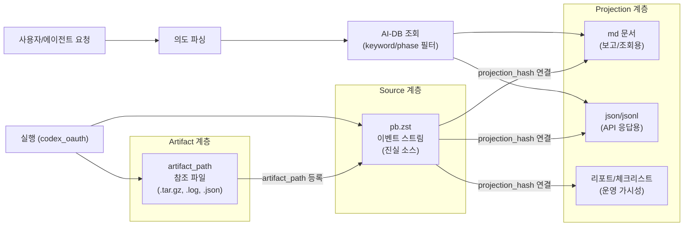

# Phase 4: AI-DB 운영 모델

**문서 ID**: `ops.ai_db`
**버전**: v9.0
**최종 업데이트**: 2026-02-27

> [!NOTE] 문서 목적
> AI-DB 전환 이후의 운영 모델을 정의합니다. `pb.zst` 이벤트 스트림을 진실 소스로 하는 저장 계층 규칙,
> 팀별·단계별·문서별 접근 구조, 문서 메타 계약, tri-mode 운영 방식을 기술합니다.

---

## 1. 핵심 원칙

1. **진실 소스 단일화**: `pb.zst` 이벤트 스트림이 유일한 진실 소스(Source of Truth)
2. **Projection 분리**: `json / jsonl / md` 파일은 조회·보고용 projection으로만 사용
3. **Artifact 참조 원칙**: 무거운 산출물(번들, 로그, 바이너리)은 본문 저장 금지 — `artifact_path` 참조로만 명시
4. **Projection 단독 쓰기 금지**: 상태 변경은 반드시 이벤트 append(`pb.zst`)로 수행

---

## 2. 저장 계층 구조

| 계층 | 형식 | 역할 |
|------|------|------|
| Source | `pb.zst` 이벤트 스트림 | 진실 소스 — 불변 append only |
| Projection | `md / json / jsonl` | 조회·보고용 — source로부터 조립 |
| Artifact | 외부 파일 (`.tar.gz`, `.log`, `.json`) | 무거운 산출물 — artifact_path로 참조 |

**Source ↔ Projection 연결**: `projection_hash`로 무결성 검증

**이중 쓰기(dual_write) 정책**:
- 초기 안정화 단계: `pb.zst + projection` 동시 쓰기 허용
- 안정화 완료 후: source write는 `pb.zst`만 허용

---

## 3. 팀별·단계별·문서별 접근 구조

### 팀 구분

| 팀 | 관할 범위 | 주요 경로 |
|----|-----------|-----------|
| `design_governance` | meta 계약, 온톨로지 정책 | `obsidian_design_origin/meta/` |
| `architecture_team` | 아키텍처 문서, 설계 산출물 | `obsidian_design_origin/architecture/` |
| `development_team` | 런타임 체인, 오케스트레이터 | `Virtual_company_creation_agent/runtime/`, `logic/` |

### 단계별 접근

| 모드 (tri-mode) | 조회 대상 | 쓰기 허용 |
|-----------------|-----------|-----------|
| 설계 (design) | `architecture`, `meta`, `specs` | `architecture`, `meta` |
| 개발 (development) | `development`, `chains`, `runtime` | `development`, `runtime` |
| 트러블슈팅 (troubleshooting) | 전체 읽기 | `reports`, `checklists` |

---

## 4. 문서 메타 계약

모든 obsidian_design_origin 문서의 frontmatter에는 아래 필드가 필수입니다.

```yaml
relation_type: <governance|architecture|development|reference>
category: <workflow-management|design|runtime|...>
relations: []
keywords: [keyword1, keyword2]
simple_summary: "1줄 요약"
detail_summary: "상세 설명"
wiki_links: []
artifact_path: ""   # 무거운 산출물 경로 (없으면 빈 문자열)
```

**계약 검증 스크립트**:
- `platform_all/Original_Development_Plan/docs/checklists/v9.0/scripts/backfill_meta_frontmatter_contracts.py`
- v9.0 frontmatter 누락 0건 확인 증적: `2026-02-25_Meta_Frontmatter_Backfill.log`

---

## 5. AI-DB 데이터 흐름 다이어그램



---

## 6. tri-mode 운영 예시

### 설계 모드

```
입력: 신규 체인 설계 요청
→ AI-DB 조회: architecture, meta 필터
→ 관련 문서 요약 제공 (simple_summary + detail_summary)
→ Human Loop 승인
→ Blue_Print.md + Component_Interfaces_Design.md 생성
→ pb.zst에 이벤트 append
→ projection(md) 갱신
```

### 개발 모드

```
입력: 런타임 버그 수정
→ AI-DB 조회: development, runtime 필터
→ orchestrator.py + run_ledger.py 참조
→ Human Loop 승인
→ 코드 수정 + 테스트 실행
→ pb.zst에 이벤트 append
→ change_report, doc_update_log 생성
```

### 트러블슈팅 모드

```
입력: 게이트 FAIL 원인 분석
→ AI-DB 조회: 전체 읽기
→ 관련 로그 + 체크리스트 조회 (artifact_path 참조)
→ 원인 분석 리포트 작성
→ pb.zst에 이벤트 append
→ 개선 액션 등록
```

---

## Source of Truth

| 항목 | 경로 |
|------|------|
| AI-DB 정책 원문 | `platform_all/Original_Development_Plan/docs/obsidian_design_origin/meta/AI_DB_Source_of_Truth_Policy.md` |
| Frontmatter 계약 | `platform_all/Original_Development_Plan/docs/obsidian_design_origin/meta/Artifact_Contract_Registry.md` |
| Frontmatter 보강 증적 | `platform_all/Original_Development_Plan/docs/checklists/approvals/v9.0/2026-02-25_Meta_Frontmatter_Backfill.log` |
| Migration 안전장치 | `platform_all/Original_Development_Plan/docs/obsidian_design_origin/meta/Backfill_Migration_Safety_Contract.md` |
| v9.0 완료 핸드오프 | `platform_all/Original_Development_Plan/docs/checklists/v9.0/2026-02-25_V9.0_Completion_Handoff.md` |
