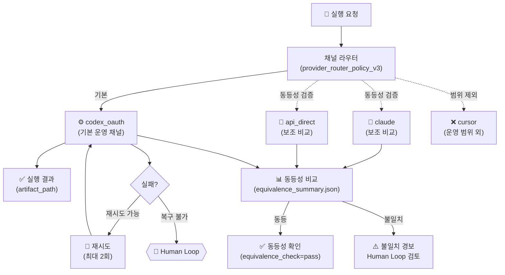

# Phase 4: 채널 정책 및 동등성 검증

**문서 ID**: `ops.channel_policy`
**버전**: v9.0
**최종 업데이트**: 2026-02-27

> [!NOTE] 문서 목적
> 코딩 에이전트 실행 채널의 역할 분리와 동등성(equivalence) 검증 정책을 정의합니다.
> `codex_oauth`를 기본 운영 채널로 확정하고, `claude / api_direct`를 비교 채널로 활용하는 방식을 기술합니다.

---

## 1. 채널 분류

| 채널 | 역할 | 운영 여부 | API key 필요 | 비고 |
|------|------|-----------|-------------|------|
| `codex_oauth` | **기본 운영 채널** | ✅ 프로덕션 | OAuth 토큰 | v9.0 기본 실행 경로 |
| `claude` | 보조 비교 채널 | 검증 전용 | API key | 동등성 검증 관점 |
| `api_direct` | 보조 비교 채널 | 검증 전용 | API key | 동등성 검증 관점 |
| `cursor` | **운영 범위 제외** | ❌ 제외 | — | 명시적 범위 외 |

---

## 2. Codex OAuth 실행 경로 상세

### API key 의존 경로 vs. Codex OAuth 경로 비교

| 항목 | API key 의존 경로 | Codex OAuth 경로 |
|------|------------------|-----------------|
| 인증 방식 | API key (환경 변수) | OAuth 토큰 (갱신 가능) |
| 실행 채널 | `api_direct` | `codex_oauth` |
| 프로덕션 사용 여부 | 보조 비교 전용 | **운영 기본 경로** |
| tool_choice_mode | `auto` | `auto` |
| malformed_tool_args_policy | `block` | `block` |

### Codex OAuth 실증 증적 (2026-02-27 FinalGate)

```json
{
  "status": "passed",
  "expected": "CODEX_OAUTH_RUNTIME_SMOKE_OK",
  "observed": "CODEX_OAUTH_RUNTIME_SMOKE_OK",
  "provider_meta": {
    "provider": "codex_oauth",
    "channel_mode": "codex_oauth_only",
    "selected_channel": "codex_oauth",
    "route_policy_version": "provider_router_policy_v3"
  }
}
```

**증적 경로**: `platform_all/Original_Development_Plan/docs/checklists/approvals/v9.0/2026-02-27_FinalGate_codex_oauth_runtime_smoke_result.json`

---

## 3. 채널 라우팅 정책

### Provider Router Policy v3 (v9.0 기준)

```
requested_channel: codex_oauth
→ selected_channel: codex_oauth
→ attempt_channels: [codex_oauth]
→ fallback_order: [primary, secondary, human_loop]
→ preferred_order: [codex_oauth]
```

**실패 시 fallback 순서**:

1. `primary`: 동일 채널 재시도 (최대 2회, backoff 250ms/500ms)
2. `secondary`: 오류 코드별 재시도 (`provider_timeout`, `provider_unavailable`, `provider_rate_limited`)
3. `human_loop`: 자동 복구 불가 시 인간 개입 요청

---

## 4. 동등성 검증 (Equivalence Testing)

동등성 검증은 `codex_oauth` 기본 실행 결과와 보조 채널(`claude`, `api_direct`) 결과를 비교하여 채널 간 출력 동등성을 확인합니다.

### 동등성 검증 절차

```
입력: 동일 프롬프트 + 동일 컨텍스트
→ codex_oauth 실행 → 결과 A
→ claude 실행 → 결과 B
→ api_direct 실행 → 결과 C
→ 동등성 비교: A ≈ B ≈ C (의미적 동등성)
→ 검증 리포트 작성 (equivalence_summary.json)
```

### 동등성 기준

| 비교 항목 | 동등성 판단 기준 |
|-----------|----------------|
| 출력 형식 | JSON 스키마 일치 |
| 핵심 내용 | 의미적 동등성 (LLM 평가) |
| 에러 동작 | 동일 오류 코드 반환 |
| 실행 시간 | ±20% 이내 |

### v9.0 동등성 검증 증적

- `platform_all/Original_Development_Plan/docs/checklists/approvals/v9.0/2026-02-27_R9_live_smoke_fallback_equivalence_summary.json`
- `platform_all/Original_Development_Plan/docs/checklists/approvals/v9.0/2026-02-27_R5_live_provider_cross_smoke_summary.json`

---

## 5. 채널 정책 다이어그램



---

## 6. 런타임 타임아웃 정책

```yaml
타임아웃_정책:
  connect_timeout_ms: 5000
  read_timeout_ms: 45000
  overall_timeout_ms: 60000

재시도_정책:
  max_retries: 2
  backoff_ms: [250, 500]
  retryable_error_codes:
    - provider_timeout
    - provider_unavailable
    - provider_rate_limited
```

---

## Source of Truth

| 항목 | 경로 |
|------|------|
| Codex OAuth smoke 결과 | `platform_all/Original_Development_Plan/docs/checklists/approvals/v9.0/2026-02-27_FinalGate_codex_oauth_runtime_smoke_result.json` |
| Codex OAuth smoke 메시지 | `platform_all/Original_Development_Plan/docs/checklists/approvals/v9.0/2026-02-27_FinalGate_codex_oauth_runtime_smoke_message.txt` |
| 동등성 검증 요약 | `platform_all/Original_Development_Plan/docs/checklists/approvals/v9.0/2026-02-27_R9_live_smoke_fallback_equivalence_summary.json` |
| Cross-provider smoke | `platform_all/Original_Development_Plan/docs/checklists/approvals/v9.0/2026-02-27_R5_live_provider_cross_smoke_summary.json` |
| Secret 정책 요약 | `platform_all/Original_Development_Plan/docs/checklists/approvals/v9.0/2026-02-27_R9_live_smoke_secret_policy_summary.json` |
| R8 readiness 문서 | `platform_all/Original_Development_Plan/docs/checklists/approvals/v9.0/2026-02-25_R8_codex_oauth_immediate_smoke_readiness.md` |
