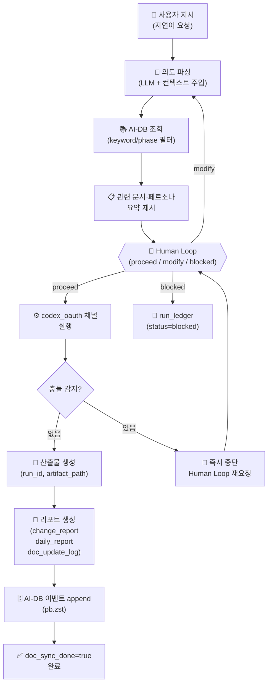

# Phase 4: 코딩 에이전트 실행 체인

**문서 ID**: `ops.coding_agent_chain`
**버전**: v9.0
**최종 업데이트**: 2026-02-27

> [!NOTE] 문서 목적
> 코딩 에이전트의 End-to-End 실행 순서를 정의합니다.
> 사용자 지시 → 의도 파싱 → AI-DB 조회 → Human Loop 승인 → 실행 → 리포트 → 문서 업데이트의
> 7단계 체인과 병렬 실행 오염 방지 규칙을 기술합니다.

---

## 1. 실행 체인 개요 (7단계)

| 단계 | 입력 | 게이트 | 산출물 | 증적 |
|------|------|--------|--------|------|
| 1. 사용자 지시 | 자연어 요청 | 요청 수신 확인 | 지시 원문 | run_ledger 기록 |
| 2. 의도 파싱 | 지시 원문 | 파싱 성공 | 의도 구조체 | intent_parse_log |
| 3. AI-DB 조회 | 의도 구조체 | 관련 문서 ≥1 | 요약 컨텍스트 | db_query_log |
| 4. Human Loop 승인 | 요약 컨텍스트 | `proceed` 수신 | 승인 토큰 | approval lineage |
| 5. 실행 | 승인 토큰 | 오류 없음 | 코드/문서 변경 | run_id 산출물 |
| 6. 리포트 | 실행 결과 | 리포트 생성 완료 | change_report, daily_report | artifact_path |
| 7. 문서 업데이트 | 리포트 | `doc_sync_done=true` | 갱신된 AI-DB | doc_update_log |

---

## 2. End-to-End 실행 체인 다이어그램



---

## 3. 병렬 실행 오염 방지 규칙

코딩 에이전트가 동시에 여러 작업을 실행할 때 적용됩니다.

### 작업 단위 격리

- 각 실행은 독립 `run_id`로 추적 (`run_ledger.py` 관리)
- `run_id` 범위 밖의 파일 접근은 금지
- 실행 완료 전까지 동일 파일에 대한 다른 `run_id`의 write 잠금

### 충돌 감지 및 처리

```
충돌 감지 조건:
  1. 동일 파일에 2개 이상 run_id의 write 시도
  2. 의존 문서 상태 불일치 (projection_hash mismatch)
  3. 온톨로지 변경 충돌 (동일 relations 노드 동시 수정)

처리 절차:
  1. 즉시 실행 중단 (status=conflict)
  2. run_ledger에 충돌 기록
  3. Human Loop 재요청
  4. 승인 후 충돌 해소 → 재실행
```

### closed run 재실행 규칙

- `status=closed` run은 재실행 시 idempotency skip 경로 적용
- `current_chain/is_complete` 초기화하여 신규 실행으로 처리
- skip 이력은 `status=skipped`로 run_ledger에 재현

---

## 4. Human Loop 필수 조건

아래 조건에서 에이전트는 반드시 인간 검토를 멈추고 요청해야 합니다.

| 조건 | 이유 |
|------|------|
| 문서 구조(온톨로지) 변경 포함 | 파급 범위 불특정 |
| `artifact_path` 신규 등록 | 외부 파일 추적 범위 확대 |
| 병렬 실행 충돌 감지 | 데이터 오염 위험 |
| 릴리즈 게이트 임계값 초과 | 릴리즈 가능 여부 결정 필요 |
| `impact_map`에 3개 이상 문서 포함 | 광범위 변경 안전성 확보 |

---

## 5. 산출물 계약 (run_id 연계)

실행 완료 후 반드시 생성해야 하는 산출물 (5종):

```yaml
필수_산출물:
  - mermaid: "실행 흐름 다이어그램"
  - development_checklist: "실행 단계 체크리스트"
  - change_report: "변경 내용 요약"
  - daily_report: "일일 실행 보고서"
  - doc_update_log: "문서 동기화 기록"

계약_필드:
  - run_id: "실행 고유 ID"
  - source_request_id: "원본 요청 ID"
  - artifact_ref: "산출물 참조 경로 (artifact_path)"
  - doc_sync_done: true
  - sync_timestamp: "ISO 8601 타임스탬프"
```

---

## 6. 실행 경로 참조

| 컴포넌트 | 경로 |
|----------|------|
| 오케스트레이터 | `platform_all/Virtual_company_creation_agent/logic/orchestrator.py` |
| Run Ledger | `platform_all/Virtual_company_creation_agent/runtime/run_ledger.py` |
| 실행 체인 정의 | `platform_all/Virtual_company_creation_agent/chains/` |
| 페르소나 참조 | `platform_all/Original_Development_Plan/docs/obsidian_design_origin/meta/Chain_Persona_Reference.md` |

---

## Source of Truth

| 항목 | 경로 |
|------|------|
| Codex OAuth smoke 결과 | `platform_all/Original_Development_Plan/docs/checklists/approvals/v9.0/2026-02-27_FinalGate_codex_oauth_runtime_smoke_result.json` |
| Codex OAuth smoke 메시지 | `platform_all/Original_Development_Plan/docs/checklists/approvals/v9.0/2026-02-27_FinalGate_codex_oauth_runtime_smoke_message.txt` |
| Run ID 산출물 계약 | `platform_all/Original_Development_Plan/docs/checklists/approvals/v9.0/2026-02-25_P0_Run_ID_Artifact_Linkage_Contract_Summary.json` |
| Doc Sync 계약 | `platform_all/Original_Development_Plan/docs/checklists/approvals/v9.0/2026-02-25_P0_Doc_Sync_Impact_Map_Contract_Summary.json` |
| 실행 제어면 회귀 테스트 | `platform_all/Original_Development_Plan/docs/checklists/approvals/v9.0/2026-02-25_P0_execution_control_plane_regression_test.log` |
