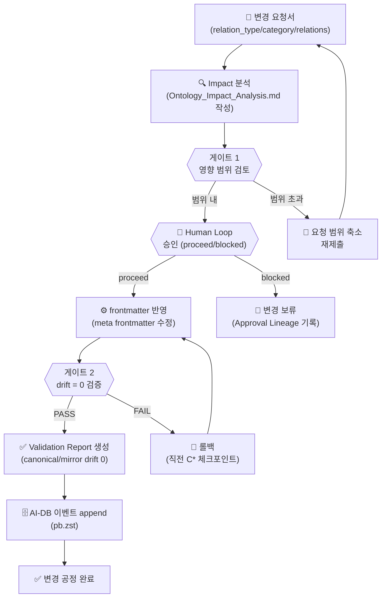

# Phase 4: 문서 온톨로지 변경 공정

**문서 ID**: `ops.ontology_change`
**버전**: v9.0
**최종 업데이트**: 2026-02-27

> [!NOTE] 문서 목적
> obsidian_design_origin 기반 문서 온톨로지의 변경을 안전하게 관리하는 공정을 정의합니다.
> `relation_type / category / relations` 기준으로 Impact 분석 → 승인 → 반영 → 검증 루프를 기술합니다.

---

## 1. 온톨로지 기준 구조

모든 문서 frontmatter는 아래 온톨로지 계약을 따릅니다.

```yaml
relation_type: <governance|architecture|development|reference|operations>
category: <workflow-management|design|runtime|monitoring|channel-policy|...>
relations:
  - type: "references"
    target: "meta/Target_Doc"
  - type: "implements"
    target: "architecture/Blueprint"
```

**핵심 `relation_type` 목록**:

| relation_type | 설명 |
|---------------|------|
| `governance` | 정책·계약·메타 규칙 문서 |
| `architecture` | 설계·아키텍처 문서 |
| `development` | 구현·코드·런타임 문서 |
| `reference` | 참조·인용용 문서 |
| `operations` | 운영·모니터링·채널 문서 (v9.0 신규) |

---

## 2. 변경 공정 (4단계)

### 입력 → 게이트 → 산출물 → 증적

| 단계 | 입력 | 게이트 기준 | 산출물 | 증적 |
|------|------|-------------|--------|------|
| **1. Impact 분석** | 변경 요청서 | 영향 범위 0건 or 승인된 범위 내 | `Ontology_Impact_Analysis.md` | `impact_map_refs` 파일 |
| **2. 승인** | Impact 분석 결과 | Human Loop `proceed` 수신 | 승인 토큰 | Approval Lineage 레코드 |
| **3. 반영** | 승인 토큰 | 충돌 없음, frontmatter 유효성 통과 | 변경된 메타 frontmatter | frontmatter diff |
| **4. 검증** | 반영 결과 | canonical/mirror drift = 0 | Validation Report | drift 리포트 |

---

## 3. 변경 공정 다이어그램



---

## 4. 설계 문서 참조 순서

온톨로지 변경 시 아래 문서를 순서대로 참조해야 합니다.

```
1. Canonical_Source_of_Truth.md          → 현재 canonical 상태 확인
2. Ontology_Impact_Analysis.md           → 영향 분석 템플릿
3. Approval_Lineage_Contract.md          → 승인 절차 규칙
4. Architecture_Name_Mapping_and_Merge_Rules.md  → 명칭 충돌 처리
5. Canonical_Mirror_Sync_Whitelist.txt   → 동기화 대상 확인
6. Canonical_Mirror_Sync_Blacklist.txt   → 동기화 제외 대상 확인
```

모두 `platform_all/Original_Development_Plan/docs/obsidian_design_origin/meta/` 하위에 있습니다.

---

## 5. 분기 조건 (Phase Gate)

| 조건 | 분기 |
|------|------|
| 영향 문서 수 ≤ 5 | 간소 승인 (1회 Human Loop) |
| 영향 문서 수 > 5 | 확장 승인 (단계별 Human Loop) |
| `relation_type` 신규 추가 | 전체 온톨로지 재검증 필요 |
| canonical/mirror drift > 0 | 즉시 롤백, 재반영 |
| 동일 relations 노드 충돌 | 실행 에이전트 격리 후 재조율 |

---

## 6. 롤백 규칙

- `S*` 단계 실패 시 직전 `C*` 체크포인트로 롤백
- 롤백 근거 문서: `platform_all/Original_Development_Plan/docs/obsidian_design_origin/meta/Fallback_ReadOnly_Runbook.md`
- 롤백 후 반드시 `validate_canonical_mirror_contract_drift.sh` 재실행

---

## 7. 검증 도구

| 도구 | 경로 | 역할 |
|------|------|------|
| drift 검증 스크립트 | `Virtual_company_creation_agent/scripts/validate_canonical_mirror_contract_drift.sh` | drift = 0 확인 |
| frontmatter 보강 스크립트 | `Original_Development_Plan/docs/checklists/v9.0/scripts/backfill_meta_frontmatter_contracts.py` | frontmatter 계약 누락 보완 |

---

## Source of Truth

| 항목 | 경로 |
|------|------|
| Canonical Mirror Diff | `platform_all/Original_Development_Plan/docs/obsidian_design_origin/checklists/Canonical_Mirror_Diff_Report.md` |
| Approval Lineage 계약 | `platform_all/Original_Development_Plan/docs/obsidian_design_origin/meta/Approval_Lineage_Contract.md` |
| Ontology Impact Analysis | `platform_all/Original_Development_Plan/docs/obsidian_design_origin/architecture/Ontology_Impact_Analysis.md` |
| v9.0 Gate7/8 재검증 결과 | `platform_all/Original_Development_Plan/docs/checklists/v9.0/2026-02-25_V9.0_Gate7_8_Revalidation_Update.md` |
| Fallback Runbook | `platform_all/Original_Development_Plan/docs/obsidian_design_origin/meta/Fallback_ReadOnly_Runbook.md` |
