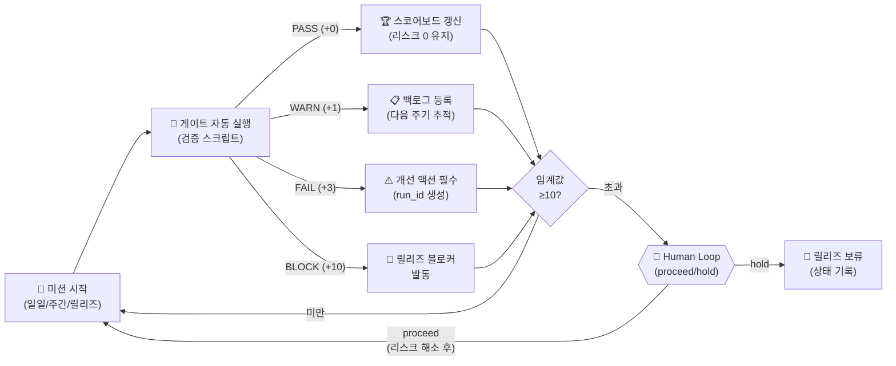

# Phase 4: 토탈 모니터링 게임보드

**문서 ID**: `ops.monitoring`
**버전**: v9.0
**최종 업데이트**: 2026-02-27

> [!NOTE] 문서 목적
> 운영자가 한눈에 전체 시스템 상태를 파악할 수 있는 게임형 모니터링 대시보드를 정의합니다.
> 미션 단위(일일/주간/릴리즈)로 게이트 상태를 점수화하고, 리스크 포인트 기반으로 릴리즈 가능 여부를 결정합니다.

---

## 1. 모니터링 구조 개요

### 미션 단위

| 미션 주기 | 범위 | 핵심 게이트 |
|-----------|------|------------|
| 일일 (Daily) | 당일 실행·변경 검증 | run_id 완결, doc_sync_done, frontmatter drift |
| 주간 (Weekly) | 1주 누적 상태 검토 | canonical/mirror drift, backlog 소화율 |
| 릴리즈 (Release) | 전체 게이트 최종 통과 | FinalGate 전 항목 PASS, 리스크 포인트 0 |

---

## 2. 게이트 점수 체계

| 게이트 상태 | 리스크 포인트 | 조치 |
|-------------|--------------|------|
| PASS | +0 | 계속 진행 |
| WARN | +1 | 백로그 등록, 다음 주기 추적 |
| FAIL | +3 | 즉시 개선 액션 필수 |
| BLOCK | +10 | 릴리즈 보류, Human Loop 필수 |

**릴리즈 임계값**: 누적 리스크 포인트 ≥ 10 → 릴리즈 블로커 자동 발동

---

## 3. 게임형 모니터링 루프 다이어그램



---

## 4. 게이트 목록 (v9.0 기준)

### 일일 게이트 (Daily Gates)

| Gate ID | 검증 항목 | PASS 기준 | 스크립트/도구 |
|---------|-----------|-----------|--------------|
| D-01 | run_id 완결 | `status=closed` 또는 `status=completed` | run_ledger.py 조회 |
| D-02 | doc_sync_done | 모든 실행에 `doc_sync_done=true` | doc_update_log 검증 |
| D-03 | frontmatter 누락 | 누락 0건 | backfill_meta_frontmatter_contracts.py |
| D-04 | artifact_path 유효성 | 끊긴 경로 0건 | pointer_integrity_check |

### 주간 게이트 (Weekly Gates)

| Gate ID | 검증 항목 | PASS 기준 |
|---------|-----------|-----------|
| W-01 | canonical/mirror drift | drift = 0 |
| W-02 | 백로그 소화율 | 미완료 항목 0건 |
| W-03 | 승인 미처리 | 대기 중 Human Loop 0건 |

### 릴리즈 게이트 (Release Gates)

| Gate ID | 검증 항목 | PASS 기준 |
|---------|-----------|-----------|
| R-01 | codex_oauth smoke | `CODEX_OAUTH_RUNTIME_SMOKE_OK` |
| R-02 | live provider smoke | 전 채널 동등성 확인 |
| R-03 | D10 시나리오 | 전 시나리오 PASS |
| R-04 | canonical contract drift | drift = 0 |
| R-05 | action guarantee gate | 보장 게이트 PASS |
| R-06 | nfr12a 계약 | conflicts 0건 |

---

## 5. 운영 대시보드 예시 (텍스트 형식)

```
╔══════════════════════════════════════════════════════════════╗
║        TOTAL MONITORING GAMEBOARD v9.0 — 2026-02-27         ║
╠══════════════════════════════════════════════════════════════╣
║ 미션: 릴리즈 FinalGate                                       ║
║ 리스크 포인트: 0 / 임계값: 10                                ║
╠══════════════════════════════════════════════════════════════╣
║ [R-01] codex_oauth smoke        ✅ PASS  (+0)               ║
║ [R-02] live provider smoke      ✅ PASS  (+0)               ║
║ [R-03] D10 시나리오             ✅ PASS  (+0)               ║
║ [R-04] canonical contract drift ✅ PASS  (+0)               ║
║ [R-05] action guarantee gate    ✅ PASS  (+0)               ║
║ [R-06] nfr12a 계약              ✅ PASS  (+0)               ║
╠══════════════════════════════════════════════════════════════╣
║ 결과: 🏆 RELEASE PROCEED — 리스크 포인트 0                  ║
╚══════════════════════════════════════════════════════════════╝
```

---

## 6. 게임형 보상 체계

| 달성 조건 | 보상 |
|-----------|------|
| 연속 7일 리스크 포인트 0 | "완벽한 한 주" 배지 |
| 릴리즈 게이트 전 항목 1회 통과 | "v9.0 릴리즈 마스터" 배지 |
| 백로그 소화율 100% 3회 연속 | "백로그 청소부" 배지 |
| canonical drift 0 유지 30일 | "온톨로지 수호자" 배지 |

---

## Source of Truth

| 항목 | 경로 |
|------|------|
| FinalGate v9.0 실행 로그 | `platform_all/Original_Development_Plan/docs/checklists/approvals/v9.0/2026-02-27_FinalGate_test_d10_release_gate_scenarios.log` |
| codex_oauth smoke 결과 | `platform_all/Original_Development_Plan/docs/checklists/approvals/v9.0/2026-02-27_FinalGate_codex_oauth_runtime_smoke_result.json` |
| live provider smoke 로그 | `platform_all/Original_Development_Plan/docs/checklists/approvals/v9.0/2026-02-27_FinalGate_test_live_provider_smoke.log` |
| action guarantee gate | `platform_all/Original_Development_Plan/docs/checklists/approvals/v9.0/2026-02-27_FinalGate_validate_action_guarantee_gate.log` |
| nfr12a conflicts lint | `platform_all/Original_Development_Plan/docs/checklists/approvals/v9.0/2026-02-27_FinalGate_lint_nfr12a_conflicts.log` |
| V9.0 완료 핸드오프 | `platform_all/Original_Development_Plan/docs/checklists/v9.0/2026-02-25_V9.0_Completion_Handoff.md` |
