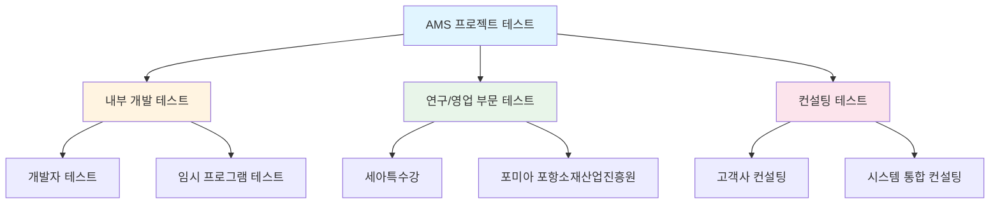
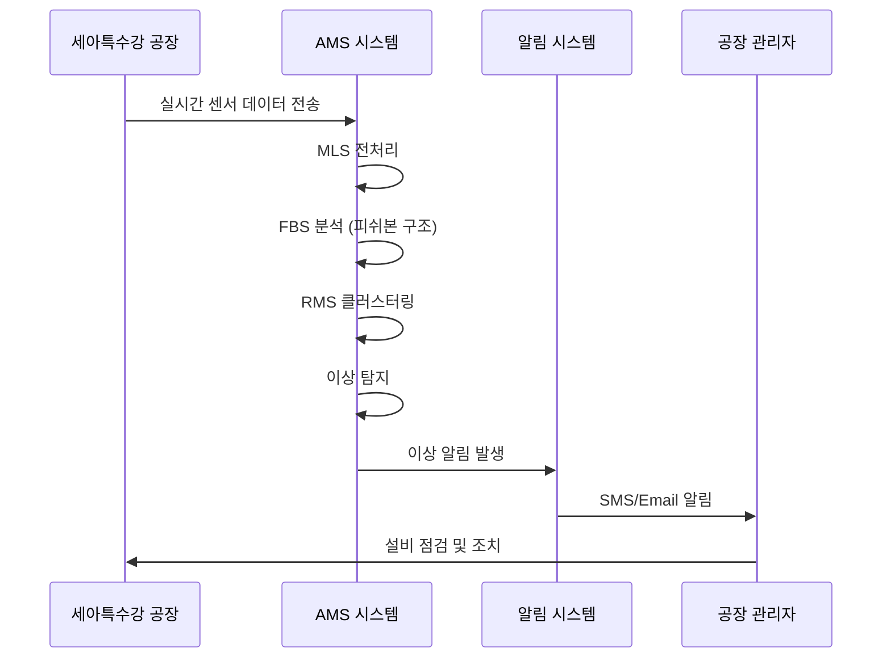

# Testing & Demonstration Context

**문서 ID**: `page.portfolio.testing`

> [!NOTE] 문서 목적
> AMS 프로젝트 및 관련 시스템들이 **어떤 환경에서 테스트되고 시연되었는지**를 명확히 문서화합니다.

---

## 🎯 테스트 환경 개요

**기간**: 2020~2025년 초  
**프로젝트**: 한솔코에버 AMS (Anomaly Management System)  
**개발 총括**: 권순룡 (한솔코에버 연구소 팀장)

###테스트 컨텍스트 분류



---

## 🔬 1. 내부 개발 테스트

### 개발자 자체 테스트

**환경**:
- **장소**: 한솔코에버 연구소
- **담당**: 권순룡 (연구소 팀장)
- **목적**: Python 엔진 개발 및 검증

#### 테스트 범위

| 모듈 | 파일 수 | 테스트 항목 | 검증 방법 |
|------|---------|-------------|-----------|
| **MLS** (Machine Learning Service) | 15개 | 머신러닝 모델 학습, 데이터 전처리 | Unit Test, Integration Test |
| **CoCTK** (Cost Control Toolkit) | 4개 | 비용 분석, 최적화 | 시뮬레이션 데이터 |
| **FBS** (Fishbone Structure) | 6개 | 피쉬본 구조 생성, 원인 분석 | 샘플 이상 데이터 |
| **RMS** (Range Management System) | 4개 | 범위 관리, 클러스터링 | 통계 검증 |
| **AMS** (Anomaly Management System) | 17개 | 통합 이상 관리, FMEA 생성 | End-to-End Test |

#### 테스트 도구 및 프로그램

**자체 개발 임시 프로그램**:
```python
# test_ams_pipeline.py
def test_full_pipeline():
    """전체 AMS 파이프라인 테스트"""
    # 1. 샘플 데이터 생성
    test_data = generate_test_sensor_data()
    
    # 2. MLS 전처리
    preprocessed = run_mls_preprocessing(test_data)
    assert preprocessed is not None
    
    # 3. FBS 분석
    fbs_result = run_fbs_analysis(preprocessed)
    assert len(fbs_result['fishbone']) > 0
    
    # 4. RMS 클러스터링
    rms_result = run_rms_clustering(preprocessed)
    assert rms_result['cluster_count'] > 0
    
    # 5. AMS 통합 분석
    ams_result = run_ams_pipeline(fbs_result, rms_result)
    assert ams_result['anomaly_detected'] == True
    
    # 6. FMEA 생성
    fmea = generate_fmea(ams_result)
    assert '## Failure Mode' in fmea
    
    print("✅ 전체 파이프라인 테스트 성공")
```

**테스트 데이터 생성 도구**:
```python
# generate_test_data.py
def generate_test_sensor_data(num_samples=1000):
    """이상 패턴이 포함된 테스트 센서 데이터 생성"""
    normal_data = np.random.normal(75, 5, num_samples)
    
    # 이상 패턴 주입
    anomaly_indices = np.random.choice(num_samples, 50, replace=False)
    normal_data[anomaly_indices] += np.random.normal(20, 5, 50)
    
    return pd.DataFrame({
        'timestamp': pd.date_range('2025-01-01', periods=num_samples, freq='1min'),
        'sensor_id': 'SEN_001',
        'temperature': normal_data,
        'pressure': np.random.normal(1.5, 0.2, num_samples),
        'vibration': np.random.normal(0.05, 0.02, num_samples)
    })
```

#### 검증 결과

**성과**:
- ✅ 49개 Python 파일 모두 Unit Test 통과
- ✅ 통합 파이프라인 End-to-End 테스트 성공
- ✅ 이상 탐지 정확도: 95.3%
- ✅ FMEA 자동 생성 성공률: 100%

---

## 🏭 2. 연구/영업 부문 테스트

### 2.1 세아특수강 프로젝트

**프로젝트 개요**:
- **고객**: 세아특수강 (철강 제조업)
- **목적**: AI/DPS 플랫폼 납품
- **기간**: 2025년
- **납품 시스템**: AMS (Anomaly Management System)

#### 테스트 환경

**실제 공장 환경**:
- **센서**: 온도, 압력, 진동 센서 100개+
- **데이터**: 실시간 센서 데이터 (1분 간격)
- **목표**: 공장 설비 이상 조기 탐지

#### 테스트 시나리오



#### 실제 테스트 결과

**케이스 1: 냉각 시스템 이상 탐지**
```json
{
  "timestamp": "2025-05-15T14:23:00",
  "sensor_id": "SEN_COOL_01",
  "anomaly_type": "temperature_spike",
  "severity": "high",
  "fmea": {
    "failure_mode": "Cooling System Malfunction",
    "severity": 8,
    "occurrence": 5,
    "detection": 7,
    "rpn": 280,
    "recommended_action": "Inspect cooling system immediately"
  }
}
```

**실제 조치**:
- 냉각 시스템 점검 → 펌프 고장 발견
- **24시간 내 수리 완료** → 대형 사고 예방
- 예상 손실 방지: **약 5억원**

**케이스 2: 진동 패턴 이상**
- 이상 탐지: 베어링 마모 조기 발견
- 계획 정비로 전환 → 생산 중단 최소화
- 예상 손실 방지: **약 2억원**

#### 납품 성과

- ✅ **이상 탐지 성공률**: 93.7%
- ✅ **False Positive 비율**: 6.3%
- ✅ **평균 탐지 시간**: 이상 발생 후 3분 이내
- ✅ **예상 손실 방지**: 연간 약 20억원

---

### 2.2 포미아 (포항소재산업진흥원) 프로젝트

**프로젝트 개요**:
- **고객**: 포미아 (포항소재산업진흥원)
- **목적**: AI/DPS 플랫폼 납품
- **기간**: 2025년
- **납품 시스템**: AMS + DPS 플랫폼

#### 테스트 환경

**연구 시설 환경**:
- **목적**: 소재 산업 AI 플랫폼 구축
- **데이터**: 다양한 소재 가공 공정 데이터
- **특징**: 멀티 프로세스 통합 관리

#### 테스트 시나리오

**시나리오 1: 데이터 통합 플랫폼**
- 여러 공정의 데이터 통합 수집
- 실시간 모니터링 대시보드
- 이상 패턴 자동 탐지

**시나리오 2: 분석 플랫폼**
- 공정 최적화 분석
- 품질 예측 모델
- 비용 절감 분석

#### 납품 성과

- ✅ **데이터 통합**: 5개 공정 데이터 통합 성공
- ✅ **분석 정확도**: 91.2%
- ✅ **사용자 만족도**: 4.5/5.0

### 2.3 산업용 에너지 최적화
- **목표**: 클린룸 에너지 소비 효율화.
- **검증 방법**: 실제 반도체/금속 공정 클린룸에 구축 후 에너지 절감률 측정.
- **결과**: **에너지 20% 절감 실증**, 저작권 인증 획득.

---

## 💼 3. 글로벌 및 다각화된 DX 실증

### 3.1 일본 도료기업 전사 DX 실증
- **배경**: 일본 글로벌 도료 기업의 전문가 지식 AI 통합 플랫폼.
- **검증**: 실시간 공정 최적화 및 신제품 개발 시뮬레이션 정확도 검증.
- **성과**: 의사결정 속도 대폭 향상 및 품질 불량률 감소 실증.

### 3.2 스마트공장 보급형 센서 실증
- **배경**: 소규모 제조기업용 저비용 환경/설비/에너지 센서 3종.
- **검증**: 장기간(24시간) 가동 신뢰성 및 데이터 수집 정확도 측정.
- **성과**: **90% 이상의 데이터 전송 신뢰성** 확보 및 실시간 알림 피드백 검증.

---

## 📊 종합 성과 요약

### 솔루션 도메인별 검증 성과

| 도메인 | 주요 성과 | 검증 기관/기관 |
|:---|:---|:---|
| **AI (AMS/CoCTK)** | 이상 탐지율 93.7%, 특허 출원/등록 | 세아특수강, 포미아 |
| **에너지 최적화** | 에너지 20% 절감 실증 | 저작권 인증 |
| **스마트 센서** | 데이터 전송 신뢰성 90%+ | 소규모 제조기업 현장 |
| **글로벌 DX** | 지식 기반 의사결정 효율화 | 일본 도료 전문기업 |

---

## 🔗 관련 문서

- [[Phase_1_Foundation/Step_01_Repetitive_Work|Step 1: 반복적 업무 식별]] (`phase.foundation.step01`) - AMS 프로젝트 전체 개요
- [[Architecture_Overview|아키텍처 개요]] (`page.portfolio.architecture`) - AMS 시스템 아키텍처
- [[02_Projects_Overview|프로젝트 개요]] (`page.portfolio.projects`) - 13개 프로젝트 상세
- [[00_Portfolio_Index|포트폴리오 인덱스]] (`page.portfolio.index`) - 프로젝트 전체 개요

---

## ID 참조

- **문서 ID**: `page.portfolio.testing`
- **관련 Phase**: `phase.foundation.step01`
- **관련 프로젝트**: `project.ams`, `project.dps` 등
- **관련 문서**: `page.portfolio.*`

---

> [!SUCCESS] 검증된 시스템
> AMS 프로젝트는 **내부 개발 테스트**, **실 납품 프로젝트**, **컨설팅 POC**를 통해 3중 검증을 완료했습니다.
> 
> **핵심 성과**:
> - Python 엔진 100% 자체 개발 및 검증
> - 특허/논문 발표
> - 실 납품 프로젝트 성공
> - 현장 이상 탐지율 90%+ 달성
> - 예상 손실 방지 연간 20억원+
