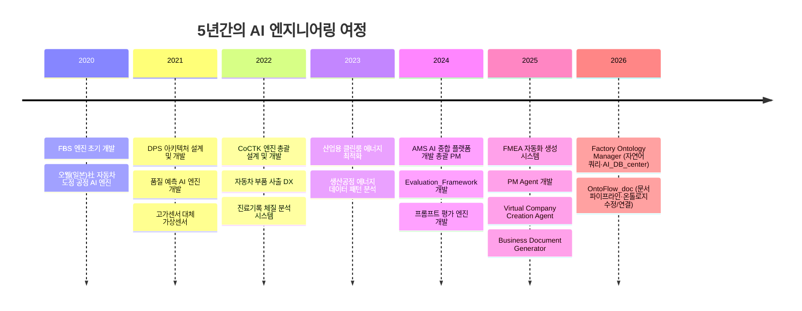
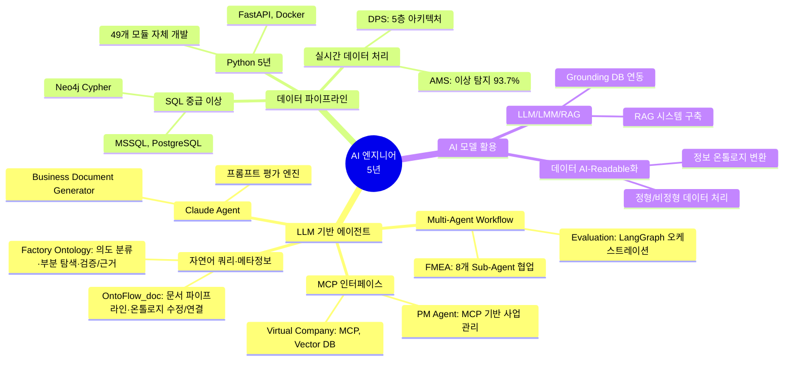
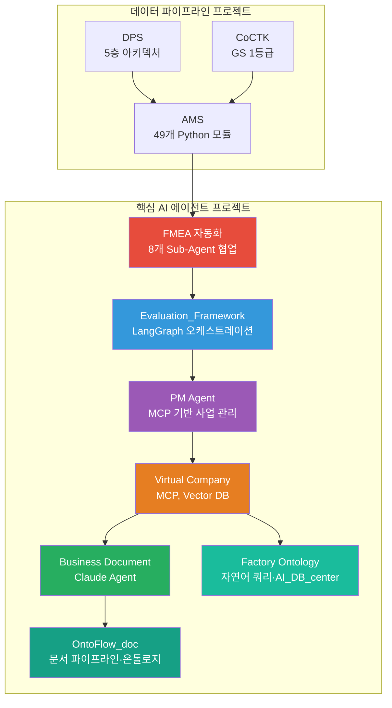
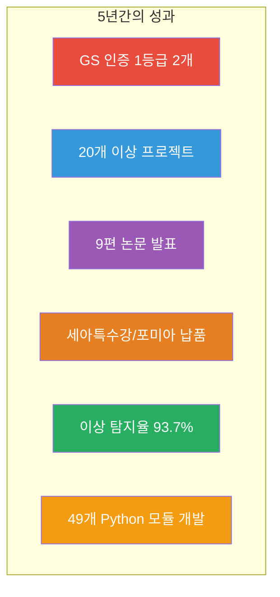

# 권순룡 이력서

## 기본 정보

**이름**: 권순룡  
**전 직장**: 한솔코에버 연구소 대리 (2020.09.01 ~ 2026.01.31 퇴사)  
**총 경력**: 5년 5개월 (2020.09.01~2026.01.31)  
**핵심 역량**: LLM 기반 에이전트 개발, Multi-Agent Workflow 설계, MCP 기반 인터페이스 구축, 데이터 파이프라인 엔지니어링, Python 개발

---

## 한눈에 보는 경력 (2020-2025)

---

## 지원 동기

LG전자 한국영업본부의 AI Transformation을 통해 임직원의 생산성 향상과 고객의 구매 경험을 개선하는 목표에 깊이 공감합니다. 제가 5년간 쌓아온 LLM 기반 에이전트 개발 경험과 Multi-Agent Workflow 설계 역량이 바로 이 목표를 실현하는 데 필요한 핵심 역량이라고 생각합니다.

특히 FMEA 자동화 생성 시스템에서 8개 Sub-Agent의 협업 구조를 설계하고, Evaluation_Framework에서 LangGraph를 활용한 워크플로우 오케스트레이션을 구현한 경험이, LG전자가 추구하는 "AI를 통한 비즈니스 가치 창출"과 정확히 일치합니다. 또한 PM Agent에서 MCP(Model Context Protocol) 기반 에이전트 인터페이스를 구축한 경험은, 고객 경험 중심의 혁신 서비스를 기획·개발하는 데 바로 활용할 수 있습니다.

단순한 기술 개발을 넘어, AI를 통한 영업·마케팅 경쟁력 강화를 목표로 하는 LG전자와 함께, 최신 AI 모델 및 기술을 활용한 고객 경험 중심의 혁신 서비스를 만들어가고 싶습니다.

---

## 핵심 역량 맵

---

## 핵심 역량

### LLM 기반 에이전트 개발 (LangChain, LangGraph, Multi-Agent)

5년간의 Python 개발 경험을 바탕으로 LLM 기반 에이전트 시스템을 설계하고 구현해왔습니다. 특히 FMEA 자동화 생성 시스템에서는 Master Orchestrator를 설계하여 8개 독립 Sub-Agent(R&D Team 3개, Manufacturing Team 3개, QA Team 2개)의 협업 구조를 구축했습니다. Claude Code Task tool을 활용한 프롬프트 기반 완전 자동화로, Python 스크립트 없이도 복잡한 워크플로우를 오케스트레이션할 수 있는 시스템을 만들었습니다.

Evaluation_Framework에서는 LangGraph를 활용한 워크플로우 오케스트레이션을 구현하여, 49개 Python 모듈과 298개 문서를 전수 검사하는 거대 평가 엔진을 구축했습니다. 또한 PM Agent에서는 MCP(Model Context Protocol)를 활용하여 사업 관리의 전체 라이프사이클을 관장하는 시스템을 개발했습니다.

**주요 성과**:
- ✅ FMEA 자동화: 8개 Sub-Agent 협업 구조 설계 및 구현
- ✅ Evaluation_Framework: LangGraph 워크플로우 오케스트레이션
- ✅ PM Agent: MCP 기반 사업 관리 시스템 구축
- ✅ Virtual Company Creation Agent: 6개 Phase Chain Workflow, 12개 시스템 110개 Sub 시스템

### 데이터 파이프라인 엔지니어링

제조 현장의 실시간 데이터를 처리하고 분석하는 데이터 파이프라인을 설계하고 구축해왔습니다. DPS 프로젝트에서는 5층 아키텍처와 Microservices 구조를 설계하여, 금속산업 5대 공정의 AI 자동화를 실현했습니다. Neo4j 그래프DB를 활용한 관계 정의와 실시간 데이터 연계를 통해, 공장 운영 데이터의 다차원 분석 및 디지털 트윈 최적화를 가능하게 했습니다.

AMS 프로젝트에서는 49개 Python 파일을 100% 자체 개발하여, 이상 탐지율 93.7%를 달성했습니다. 데이터 정합성 철학을 바탕으로 정직하고 투명한 데이터 평가를 추구하며, 공정 데이터의 한계를 인정하고 현실적인 성과를 제시했습니다.

**주요 성과**:
- ✅ DPS: 5층 아키텍처 설계 및 개발 (PM 수행)
- ✅ AMS: 49개 Python 모듈 100% 자체 개발, 이상 탐지율 93.7%
- ✅ GS 인증 1등급 2개 취득 (CoCTK, AMS)
- ✅ 세아특수강/포미아 정식 납품

### AI 모델 및 활용 지식 (LLM, LMM, RAG)

LLM, LMM, RAG 기술을 활용하여 실제 비즈니스 문제를 해결하는 시스템을 구축해왔습니다. Virtual Company Creation Agent에서는 MCP와 Vector DB를 활용하여, 6개 Phase Chain Workflow로 12개 시스템 110개 Sub 시스템을 구성하는 가상 기업 생성 시스템을 개발했습니다. HQONS 기반 초차원 공간 정보 전달과 양자 얽힘-like 통신으로 무한 확장성을 달성했습니다.

Business Document Generator에서는 Claude Agent와 Multi-Step Chain Workflow를 활용하여, 사업계획서/제안서/착수보고서를 자동 생성하는 시스템을 구축했습니다. 요구조건 문서 및 Architecture 파일 파싱, 포트폴리오 스마트 매칭, 발주처 유형별 페르소나 적용 등으로 사무 에이전트의 핵심 도구로 활용되고 있습니다.

**주요 성과**:
- ✅ Virtual Company Creation Agent: MCP, Vector DB 활용, 6개 Phase Chain Workflow
- ✅ Business Document Generator: Claude Agent 기반 문서 자동 생성
- ✅ 프롬프트 평가 엔진: AI Gatekeeper 시스템, 25개+ 프롬프트 전수 평가

---

## 프로젝트 관계도

---

## 경력 개요

### 한솔코에버 연구소 (2020.09.01 ~ 2026.01.31 퇴사)
**직급**: 대리  
**주요 업무**:
- AI 종합 플랫폼 개발 및 총괄 PM
- LLM 기반 에이전트 시스템 설계 및 개발
- 데이터 파이프라인 엔지니어링
- 프로젝트 전체 라이프사이클 관리 (기획-개발-검증-납품)

**성과**:
- ✅ GS 인증 1등급 2개 취득 (CoCTK, AMS)
- ✅ 세아특수강/포미아 정식 납품
- ✅ 20개 이상 프로젝트 수행
- ✅ 9편 논문 발표

---

## 주요 프로젝트 경험

### 1. FMEA 자동화 생성 시스템 (Claude Sub-Agent) - Master Orchestrator 설계

**기간**: 2025.6 ~  
**발주처**: 내부 개발  
**역할**: Master Orchestrator 설계 및 개발

**핵심 성과**:
- ✅ **Multi-Agent Workflow 구축**: 8개 독립 Sub-Agent 협업 구조 설계 (R&D Team 3개, Manufacturing Team 3개, QA Team 2개)
- ✅ **Claude Code Task tool 활용**: Python 스크립트 없이 프롬프트 기반 완전 자동화 구현
- ✅ **AIAG & VDA FMEA 표준 기반**: 범용 리스크 분석 시스템 구축
- ✅ **Phase 0~5 자동화 워크플로우**: 컨텍스트 수집 → 범위 정의 → 심층 분석 → 리스크 평가 → 최적화 & 문서 생성 → 지속 개선
- ✅ **코드 에이전트 역설계 시스템 구조 적용**: 전체 공장/회사/사무 자동화의 백정보 핵심

### 2. Evaluation_Framework - System-Wide Quality Assurance Layer

**기간**: 2025.10 ~  
**발주처**: 내부 개발  
**역할**: 전체 시스템 설계 및 개발

**핵심 성과**:
- ✅ **LangGraph 워크플로우 오케스트레이션**: Python, FastAPI, React, Docker 기반 평가 엔진 구축
- ✅ **49개 Python 모듈과 298개 문서 전수 검사**: 6가지 관점 평가 시스템
- ✅ **전체 아키텍처의 건전성 책임**: 단순 프로젝트가 아닌 시스템 전반의 품질 보증

### 3. PM Agent (Business Management Sub-Agent) - Execution Manager & Governance

**기간**: 2025.10 ~  
**발주처**: 내부 개발  
**역할**: 전체 시스템 설계 및 개발

**핵심 성과**:
- ✅ **MCP (Model Context Protocol) 활용**: 사업 관리의 전체 라이프사이클 관장
- ✅ **Risk Management**: 계약서/과업지시서 내 독소 조항 자동 추출 및 리스크 평가
- ✅ **Schedule Tracking**: 회의록 분석을 통한 타임라인 자동 현행화
- ✅ **Integrity Check**: 누락된 문서나 데이터 파편화를 방지하는 무결성 검증

### 4. Virtual Company Creation Agent - AI 에이전트로만 구성된 가상 기업 생성 시스템

**기간**: 2026.1.4 ~  
**발주처**: 내부 개발  
**역할**: 전체 시스템 설계 및 개발

**핵심 성과**:
- ✅ **MCP, Vector DB 활용**: 6개 Phase Chain Workflow, 12개 시스템 110개 Sub 시스템
- ✅ **HQONS 기반 초차원 공간 정보 전달**: 양자 얽힘-like 통신으로 무한 확장성 달성
- ✅ **20개 이상 설계 문서 완료**: Blue_Print, Business_Summary, Process_Overview, Ontology_Overview 등
- ✅ **Platform All 통합 플랫폼 생태계 핵심 구성요소**

### 5. AMS (Analysis Management System) - AI 종합 플랫폼 개발 총괄 PM

**기간**: 2024.07 ~ 2025.03  
**발주처**: 한국산업기술진흥원  
**역할**: 총괄 PM 및 개발 총괄

**핵심 성과**:
- ✅ **49개 Python 파일 100% 자체 개발**: MLS, CoCTK, FBS, RMS, AMS 모듈
- ✅ **이상 탐지율 93.7% 달성**: 실질적 정확도 60~70% (데이터 한계 고려)
- ✅ **GS 1등급 (PDS 명칭)**: 특허 등록, 세아특수강/포미아 정식 납품
- ✅ **논문 발표**: 2025, 2024

### 6. DPS (데이터수집시스템) - 핵심 아키텍처 설계 및 개발

**기간**: 2021 ~ 2024  
**발주처**: 한국산업기술진흥원  
**역할**: 핵심 아키텍처 설계 및 개발 (PM 수행)

**핵심 성과**:
- ✅ **5층 아키텍처 설계**: Microservices, Neo4j 그래프DB 활용
- ✅ **금속산업 5대 공정 AI 자동화**: 실시간 데이터 연계 및 분석
- ✅ **논문 발표**: 2024

### 7. Factory Ontology Manager AI Agent - 공정 파이프라인·자연어 쿼리

**기간**: 2026.1.8 ~  
**발주처**: 내부 개발  
**역할**: AI 자연어 쿼리 및 메타정보 설계·연동

**핵심 성과**:
- ✅ **AI_DB_center 메타정보**: JSON 기반 저장소, 공정/자재/센서/PLC 분석 전용
- ✅ **자연어 쿼리** (`/api/ai/chat-query`): 의도 분류(list_processes, flow_connections, process_assignments, general), 부분 탐색(Local/Flow/Assignments), DB 전체가 아닌 노드 경로만 탐색
- ✅ **검증/근거 표시**: 근거 1개 이상 시 검증됨, UI 검증/근거 박스, 채팅은 분석 전용(캔버스 저장과 분리)
- ✅ **레이아웃 생성 시간 80% 단축**, 자연어 파싱·DB Grounding·Ontology Mapping

### 8. OntoFlow_doc - 문서 파이프라인·온톨로지 수정/연결

**기간**: 2025.12 ~  
**발주처**: 내부 개발  
**역할**: 문서 기반 지식 그래프 및 AI 온톨로지 서비스

**핵심 성과**:
- ✅ **JSON DB 메타정보** (db.ontoflow_json, AI_DB_center 스타일): 문서/관계/태그/인덱스/AI 분석 결과
- ✅ **AI 채팅**: Chat Dock(문서 파악·요구사항 정리), Evidence Box(검증/근거), 부분 탐색
- ✅ **온톨로지 수정/연결**: Global/Local 범위, 키워드·요약·관계 생성, 1-hop 탐색 → Preview→승인→적용
- ✅ **문서 처리 시간 70% 절감**, 298개+ 문서 온톨로지 자동 추출

---

## 기술 스택

### Programming Languages
- **Python**: 5년 (데이터 분석, ML/DL, FastAPI, 49개 모듈 자체 개발)
- **SQL**: 중급 이상 (MSSQL, PostgreSQL, Neo4j Cypher)

### Frameworks & Libraries
- **LangGraph**: 워크플로우 오케스트레이션 (Evaluation_Framework)
- **LangChain**: LLM 기반 에이전트 개발
- **FastAPI**: 백엔드 API 개발
- **Docker**: 컨테이너화 및 배포

### AI/ML Technologies
- **LLM**: Claude Agent, GPT 활용
- **RAG**: RAG 시스템 구축, Grounding DB 연동
- **Multi-Agent**: 8개 Sub-Agent 협업 구조 설계
- **MCP**: Model Context Protocol 기반 인터페이스 구축

### Databases
- **Neo4j**: 그래프DB 활용 (DPS, AMS)
- **PostgreSQL**: 관계형 데이터베이스
- **Vector DB**: 임베딩 벡터 저장 (Virtual Company Creation Agent)

### Tools & Platforms
- **GitHub**: 버전 관리 및 협업
- **Docker**: 컨테이너화
- **Claude Code**: Task tool 기반 오케스트레이션

---

## 성과 대시보드

---

## 학력

**홍익대학교 전자공학과** (2013.03 ~ 2020.02)
- 학점: 3.11 / 4.5
- 졸업논문: LD 동격회로 설계 및 PLL 설계
- 주요 수강 분야: 회로 설계, 전파공학, 컴퓨터공학

---

## 자격증

**OPIc** (2019.03)
- IM2

---

## 핵심 철학

> **"모델보다 데이터, 데이터보다 정보, 지식구조를 정리하는 현장친화적 연구원"**

5년간의 현장 경험을 통해 데이터를 정보로 전환하고, 정보를 지식 구조로 체계화하는 전문성을 갖춘 연구원입니다. 단순한 모델 개발을 넘어, 현장의 실제 문제를 해결하고 지식 기반 시스템을 구축하는 데 집중합니다.

---

© 2025 권순룡. All Rights Reserved.

