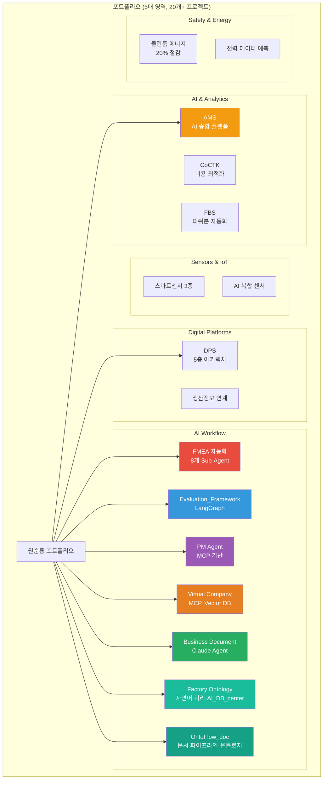
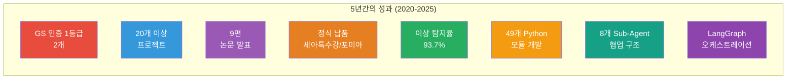
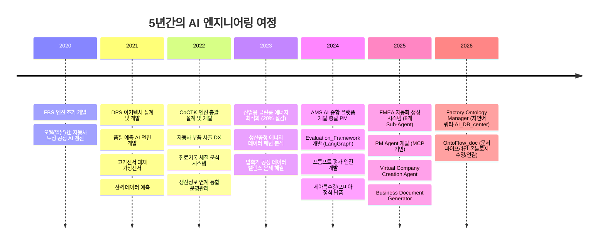
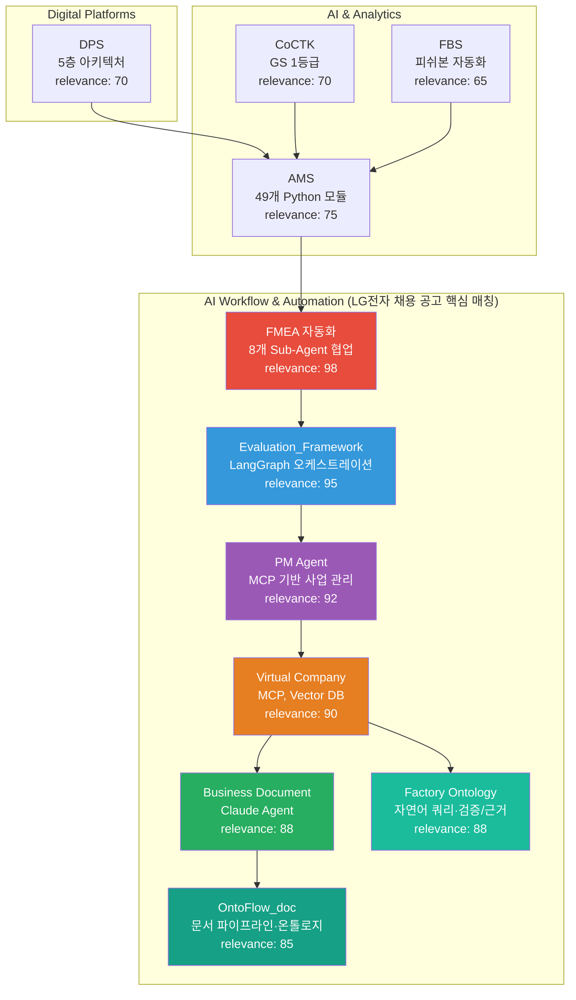
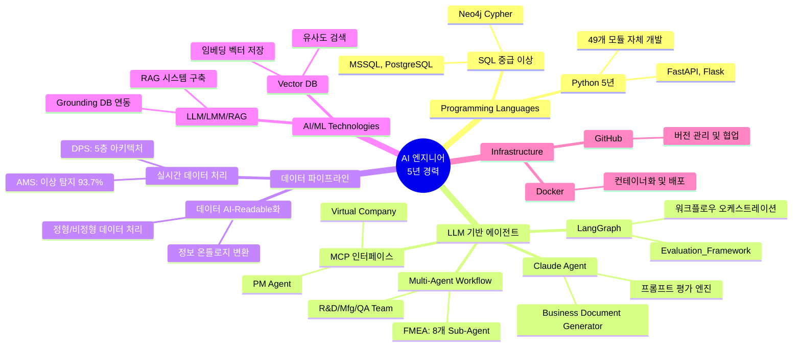

# 권순룡 포트폴리오

> **"모델보다 데이터, 데이터보다 정보, 지식구조를 정리하는 현장친화적 연구원"**

## 📌 기본 정보

**이름**: 권순룡  
**GitHub**: https://github.com/moobaek

---

## 📊 포트폴리오 구조 (한눈에 보기)

---

## 🎯 핵심 성과 대시보드

| 분류 | 지표 | 상세 |
|:---|---:|:---|
| **품질 인증** | GS 1등급 2개 | CoCTK, AMS (PDS 명칭) |
| **프로젝트 규모** | 20개 이상 | 5대 영역 (AI, 플랫폼, 센서, 안전/에너지, 헬스케어) |
| **학술 성과** | 9편 논문 | 2020-2025, 한국유체기계학회, 한국생산제조학회 등 |
| **납품 실적** | 3개 기업 | 세아특수강, 포미아, 일본 글로벌 기업 |
| **기술 역량** | 49개 Python 모듈 | 100% 자체 개발 (MLS, CoCTK, FBS, RMS, AMS) |
| **AI 에이전트** | 8개 Sub-Agent | Multi-Agent Workflow 설계 및 구현 |
| **워크플로우** | LangGraph | Evaluation_Framework 오케스트레이션 |

---

## 📅 경력 타임라인 (2020-2025)

---

## 🏆 주요 프로젝트 (20개+)

### 프로젝트 관계도

### 1. FMEA 자동화 생성 시스템 (Claude Sub-Agent) - 총괄 PM

**기간**: 2025.6 ~  
**역할**: Master Orchestrator 설계 및 개발  
**핵심 기술**: Claude Code Task tool, Multi-Agent Workflow, 8개 Sub-Agent 협업

**핵심 성과**:
- ✅ **Multi-Agent Architecture**: 8개 독립 Sub-Agent 협업 구조 설계 (R&D Team 3개, Manufacturing Team 3개, QA Team 2개)
- ✅ **Master Orchestrator 설계**: Python 스크립트 없이 Claude Code 세션 자체가 Orchestrator 역할
- ✅ **AIAG & VDA FMEA 표준 기반**: 범용 리스크 분석 시스템 구축
- ✅ **Phase 0~5 자동화 워크플로우**: 컨텍스트 수집 → 범위 정의 → 심층 분석 → 리스크 평가 → 최적화 & 문서 생성 → 지속 개선
- ✅ **코드 에이전트 역설계 시스템 구조 적용**: 전체 공장/회사/사무 자동화의 백정보 핵심
- ✅ **논문 발표**: 2025.12 KSFM 동계학술대회

**LG전자 채용 공고 매칭**:
- ✅ LLM 기반 에이전트 개발 경험 (LangChain, LangGraph, CrewAI 등)
- ✅ Multi-Agent Workflow 설계 및 구현
- ✅ Claude Code Task tool 활용

### 2. Evaluation_Framework - System-Wide Quality Assurance Layer

**기간**: 2025.10 ~  
**역할**: 전체 시스템 설계 및 개발  
**핵심 기술**: Python, FastAPI, LangGraph, React, Docker

**핵심 성과**:
- ✅ **LangGraph 워크플로우 오케스트레이션**: 49개 Python 모듈과 298개 문서 전체 전수 검사
- ✅ **6가지 관점 평가 시스템**: 업체 표준/AI 설계/제품/개발업체/팀/외부기관
- ✅ **Docker 기반 배포**: 컨테이너화 및 배포 자동화
- ✅ **전체 아키텍처의 건전성 책임**: 단순 프로젝트가 아닌 시스템 전반의 품질 보증

**LG전자 채용 공고 매칭**:
- ✅ LangGraph 워크플로우 오케스트레이션
- ✅ Python 3년 이상 개발 경험
- ✅ Public Cloud 기반 MLOps, CI/CD 경험 (Docker 기반)

### 3. PM Agent (Business Management Sub-Agent) - Execution Manager & Governance

**기간**: 2025.10 ~  
**역할**: 전체 시스템 설계 및 개발  
**핵심 기술**: MCP (Model Context Protocol), Docker, Claude Agent, HWP 파서

**핵심 성과**:
- ✅ **MCP (Model Context Protocol) 활용**: 사업 관리의 전체 라이프사이클 관장
- ✅ **Risk Management**: 계약서/과업지시서 내 독소 조항 자동 추출 및 리스크 평가
- ✅ **Schedule Tracking**: 회의록 분석을 통한 타임라인 자동 현행화
- ✅ **Integrity Check**: 누락된 문서나 데이터 파편화를 방지하는 무결성 검증

**LG전자 채용 공고 매칭**:
- ✅ MCP, A2A 기반 에이전트 인터페이스 구축 경험
- ✅ LLM API 연동 경험 (Claude Agent)

### 4. Virtual Company Creation Agent - AI 에이전트로만 구성된 가상 기업 생성 시스템

**기간**: 2026.1.4 ~  
**역할**: 전체 시스템 설계 및 개발  
**핵심 기술**: Claude Agent, HQONS (Hyper-Quantum Omni-Net Structure), 하이퍼디멘션(HDC), MCP, Vector DB

**핵심 성과**:
- ✅ **6개 Phase Chain Workflow**: 12개 시스템 110개 Sub 시스템
- ✅ **HQONS 기반 초차원 공간 정보 전달**: 양자 얽힘-like 통신으로 무한 확장성 달성
- ✅ **20개 이상 설계 문서 완료**: Blue_Print, Business_Summary, Process_Overview, Ontology_Overview, Grape_Cluster_Architecture 등
- ✅ **Platform All 통합 플랫폼 생태계 핵심 구성요소**

**LG전자 채용 공고 매칭**:
- ✅ MCP, A2A 기반 에이전트 인터페이스 구축 경험
- ✅ Vector DB 활용 (RAG 시스템 연계)
- ✅ LLM 기반 에이전트 개발 경험

### 5. Business Document Generator - 사업계획서/제안서/착수보고서 자동 생성 시스템

**기간**: 2025.12 ~  
**역할**: 전체 시스템 설계 및 개발  
**핵심 기술**: Claude Agent, Multi-Step Chain Workflow, Role-based Expert Personas, Mermaid Diagram Generation, PDF Conversion

**핵심 성과**:
- ✅ **요구조건 문서 및 Architecture 파일 파싱**: 포트폴리오 스마트 매칭
- ✅ **발주처 유형별 페르소나 적용**: 정부/민간/공공기관
- ✅ **청크 기반 생성 및 PM 통합 검증**: WBS 세부화, PDF 자동 변환
- ✅ **사무 에이전트 핵심 도구**

**LG전자 채용 공고 매칭**:
- ✅ LLM API 연동 경험 (Claude Agent)
- ✅ 정형/비정형 데이터 AI-Readable화 경험
- ✅ AI Tool 활용 경험

### 6. AMS (Analysis Management System) - AI 종합 플랫폼 개발 총괄 PM

**기간**: 2024.07 ~ 2025.03  
**발주처**: 한국산업기술진흥원  
**역할**: 총괄 PM 및 개발 총괄  
**핵심 기술**: 피쉬본 다이어그램 자동생성, FMEA 자동화, 베이지안 네트워크

**핵심 성과**:
- ✅ **49개 Python 파일 100% 자체 개발**: MLS, CoCTK, FBS, RMS, AMS 모듈
- ✅ **이상 탐지율 93.7% 달성**: 실질적 정확도 60~70% (데이터 한계 고려)
- ✅ **GS 1등급 (PDS 명칭)**: 특허 등록, 세아특수강/포미아 정식 납품
- ✅ **논문 발표**: 2025.12, 2024.12, 2025.06

**LG전자 채용 공고 매칭**:
- ✅ 데이터 파이프라인 엔지니어링 역량
- ✅ Python 3년 이상 개발 경험
- ✅ SQL 기반 데이터 탐색 능력

### 7. DPS (데이터수집시스템) - 핵심 아키텍처 설계 및 개발

**기간**: 2021 ~ 2024  
**역할**: 핵심 아키텍처 설계 및 개발 (PM 수행)  
**핵심 기술**: 5층 아키텍처, Microservices, Neo4j 그래프DB

**핵심 성과**:
- ✅ **5층 아키텍처 설계**: Microservices 구조, Neo4j 그래프DB 활용
- ✅ **금속산업 5대 공정 AI 자동화**: 실시간 데이터 연계 및 분석
- ✅ **논문 발표**: 2024.12

**LG전자 채용 공고 매칭**:
- ✅ 데이터 파이프라인 엔지니어링 역량
- ✅ SQL 기반 데이터 탐색 능력 (Neo4j Cypher)

### 8. Factory Ontology Manager AI Agent - 공정 파이프라인·자연어 쿼리

**기간**: 2026.1.8 ~  
**역할**: AI 자연어 쿼리 및 메타정보 설계·연동  
**핵심 기술**: AI_DB_center JSON, 의도 분류, 부분 탐색, 검증/근거 박스

**핵심 성과**:
- ✅ **자연어 쿼리** (`/api/ai/chat-query`): 공정/자재/센서/PLC 분석 전용, 의도 분류·부분 탐색(Local/Flow/Assignments), 검증/근거 표시
- ✅ **AI_DB_center 메타정보**: JSON 기반 저장소, 채팅 히스토리·분석 전용(캔버스 저장과 분리)
- ✅ **레이아웃 생성 시간 80% 단축**, DB Grounding·Ontology Mapping

**LG전자 채용 공고 매칭**:
- ✅ 자연어 기반 데이터 조회·분석 경험
- ✅ LLM 기반 에이전트 개발 (검증/근거 추적)

### 9. OntoFlow_doc - 문서 파이프라인·온톨로지 수정/연결

**기간**: 2025.12 ~  
**역할**: 문서 기반 지식 그래프 및 AI 온톨로지 서비스  
**핵심 기술**: JSON DB (db.ontoflow_json), AI 채팅, Ontology Update Panel, Global/Local

**핵심 성과**:
- ✅ **문서 메타정보**: JSON DB(AI_DB_center 스타일), 문서/관계/태그/인덱스/AI 분석 결과
- ✅ **AI 채팅**: 문서 파악·요구사항 정리, Evidence Box(검증/근거), 부분 탐색
- ✅ **온톨로지 수정/연결**: Global/Local, 키워드·요약·관계 생성, Preview→승인→적용
- ✅ **문서 처리 시간 70% 절감**, 298개+ 문서 온톨로지 자동 추출

**LG전자 채용 공고 매칭**:
- ✅ 정형/비정형 데이터 AI-Readable화, 메타정보 기반 RAG
- ✅ LLM 기반 문서 분석·온톨로지 관리 경험

---

## 💻 기술 스택 맵

---

## 📚 학술 성과 (9편)

| 발행일 | 논문 제목 | 학술지/학회 | 핵심 성과 및 프로젝트 연계 |
|:---|:---|:---|:---|
| 2025.12 | **분석 상관/확률 네트워크 최적 경로 정보 및 공정 관리 문서 기반 FMEA 생성 연구** | KSFM 2025년도 동계학술대회 | [FMEA 자동화/복합센서/AMS] 상관/확률 네트워크 최적 경로 분석 기반 FMEA 자동 생성 기술 검증, AMS 결과 표시 LLM agent (GPT OSS) 개발 및 포미아 납품 적용 |
| 2025.06 | **AI를 활용한 구조와 룰을 활용한 구조-확률 종합 네트워크 및 최적 관리 방안 도출** | 한국유체기계학회 | [AMS] 피쉬본 AI 모델의 학술적 고도화 및 최적 관리 로직 증명 |
| 2024.12 | **공장 운영 핵심 요소의 식별 및 최적화를 위한 클러스터링 기법 적용** | 한국생산제조학회 | [DPS] 공장 운영 데이터의 다차원 분석 및 디지털 트윈 최적화 근거 |
| 2024.12 | **설비 이상상태 기반 최적 공정 데이터 추론 및 위험/안전 관리 최적 자동화** | 한국유체기계학회 | [AMS] 실시간 이상 상태 기반 위험 관리 알고리즘의 유효성 검증 |
| 2024.07 | **전력 데이터를 통한 설비 상태 추론 및 이상 상황 설정 예측** | 한국유체기계학회 | [에너지/센서] 전력 데이터 기반의 설비 예지 보전 기술 실증 |
| 2023.12 | **송풍 설비 변동부하 대응 전력품질 분석 및 에너지 절감 연구** | 한국유체기계학회 | [에너지 최적화] 에너지 20% 절감 실증 솔루션의 핵심 물리 분석 모델 |
| 2023.12 | **압축기 공정에서 데이터 밸런스 문제 해결 및 품질 결과 사전 예측을 위한 AI 시스템** | 한국유체기계학회 | [AI/데이터] 소량의 불량 데이터 극복을 위한 AI 학습 모델 연구 |
| 2023.07 | **생산공정 에너지 및 설비 상태 진단을 위한 AI기반의 전력 사용 패턴 및 SOH분석** | 한국유체기계학회 | [에너지/전력] 설비 건전성(SOH) 진단 및 에너지 효율화 융합 기술 |
| 2022.12 | **자동차 부품 생산 산업을 위한 머신러닝 기반의 품질예측 알고리즘** | 한국생산제조학회 | [AI/제조] 세아베스틸 등 자동차 부품 공정 품질 예측 모델의 기초 |

---

## 🤖 LLM 활용 방법

### Agent/MCP/RAG 시스템

#### 1. Multi-Agent Workflow 설계 및 구현

**FMEA 자동화 생성 시스템**에서 8개 독립 Sub-Agent의 협업 구조를 설계했습니다. R&D Team 3개, Manufacturing Team 3개, QA Team 2개로 구성된 전문가 팀이 각자의 영역을 담당하며, Master Orchestrator가 전체 워크플로우를 관리합니다.

**기술적 특징**:
- Claude Code Task tool 기반 프롬프트 자동화
- Python 스크립트 없이 Claude Code 세션 자체가 Orchestrator 역할
- AIAG & VDA FMEA 표준 기반 범용 리스크 분석 시스템
- Phase 0~5 자동화 워크플로우

#### 2. LangGraph 워크플로우 오케스트레이션

**Evaluation_Framework**에서 LangGraph를 활용하여 49개 Python 모듈과 298개 문서를 전수 검사하는 거대 평가 엔진을 구축했습니다. 6가지 관점(업체 표준/AI 설계/제품/개발업체/팀/외부기관)에서 평가를 수행하며, 전체 아키텍처의 건전성을 책임집니다.

**기술적 특징**:
- LangGraph 워크플로우 오케스트레이션
- Python, FastAPI, React, Docker 기반
- 6가지 관점 평가 시스템
- Docker 기반 배포

#### 3. MCP (Model Context Protocol) 기반 인터페이스 구축

**PM Agent**와 **Virtual Company Creation Agent**에서 MCP를 활용하여 에이전트 인터페이스를 구축했습니다. PM Agent는 사업 관리의 전체 라이프사이클을 관장하며, Risk Management, Schedule Tracking, Integrity Check 기능을 제공합니다.

**기술적 특징**:
- MCP (Model Context Protocol) 활용
- Vector DB 연동 (Virtual Company Creation Agent)
- 6개 Phase Chain Workflow
- 12개 시스템 110개 Sub 시스템

#### 4. RAG 시스템 및 Grounding DB 연동

**Virtual Company Creation Agent**와 **Business Document Generator**에서 RAG 시스템을 구축하고 Grounding DB를 연동했습니다. Vector DB를 활용한 임베딩 벡터 저장 및 유사도 검색을 통해, 정형/비정형 데이터를 AI-Readable 형태로 변환했습니다.

**기술적 특징**:
- Vector DB 활용 (임베딩 벡터 저장)
- RAG 시스템 구축
- Grounding DB 연동
- 정형/비정형 데이터 AI-Readable화

#### 5. Claude Agent 기반 문서 자동 생성

**Business Document Generator**에서 Claude Agent와 Multi-Step Chain Workflow를 활용하여, 사업계획서/제안서/착수보고서를 자동 생성하는 시스템을 구축했습니다. 요구조건 문서 및 Architecture 파일 파싱, 포트폴리오 스마트 매칭, 발주처 유형별 페르소나 적용 등으로 사무 에이전트의 핵심 도구로 활용되고 있습니다.

**기술적 특징**:
- Claude Agent 기반 문서 자동 생성
- Multi-Step Chain Workflow
- Role-based Expert Personas
- PDF 자동 변환

#### 6. 자연어 쿼리·문서 파이프라인 (Factory Ontology Manager · OntoFlow_doc)

**Factory Ontology Manager**에서는 **공정 파이프라인**으로 AI_DB_center JSON 메타정보를 두고, `/api/ai/chat-query` 기반 **자연어 쿼리**를 구현했습니다. 의도 분류(list_processes, flow_connections, process_assignments, general) 후 부분 탐색(Local/Flow/Assignments)으로 노드 경로만 조회하고, **검증/근거 박스**로 신뢰도를 확보하며, 채팅은 분석 전용(캔버스 저장과 분리)으로 운영합니다.

**OntoFlow_doc**에서는 **문서 파이프라인**으로 JSON DB(db.ontoflow_json)에 문서/관계/태그/메타정보를 저장하고, **AI 채팅**(문서 파악·요구사항 정리, Evidence Box)과 **온톨로지 수정/연결**(Global/Local, Preview→승인→적용) 서비스를 제공합니다.

**기술적 특징**:
- 자연어 쿼리: 의도 분류, 부분 탐색, 검증/근거 표시
- 메타정보 중앙화: AI_DB_center 스타일 JSON DB
- 문서 파이프라인: 298개+ 문서 온톨로지 자동 추출, 문서 처리 70% 절감

---

## 🔗 관련 링크

### GitHub

- **메인 레포지토리**: https://github.com/moobaek/Testing_AI_agents_for_public_use
- **포트폴리오 문서**: https://github.com/moobaek/Testing_AI_agents_for_public_use/tree/main/portfolio/portfolio_docs
- **GitHub 프로필**: https://github.com/moobaek

---

© 2025 권순룡. All Rights Reserved.

