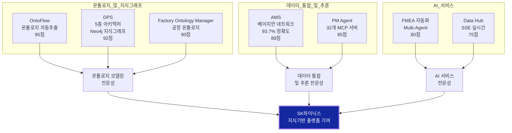
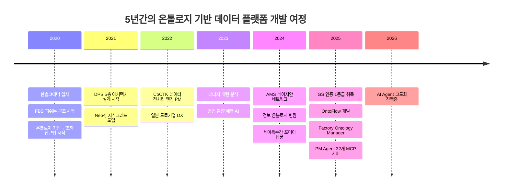
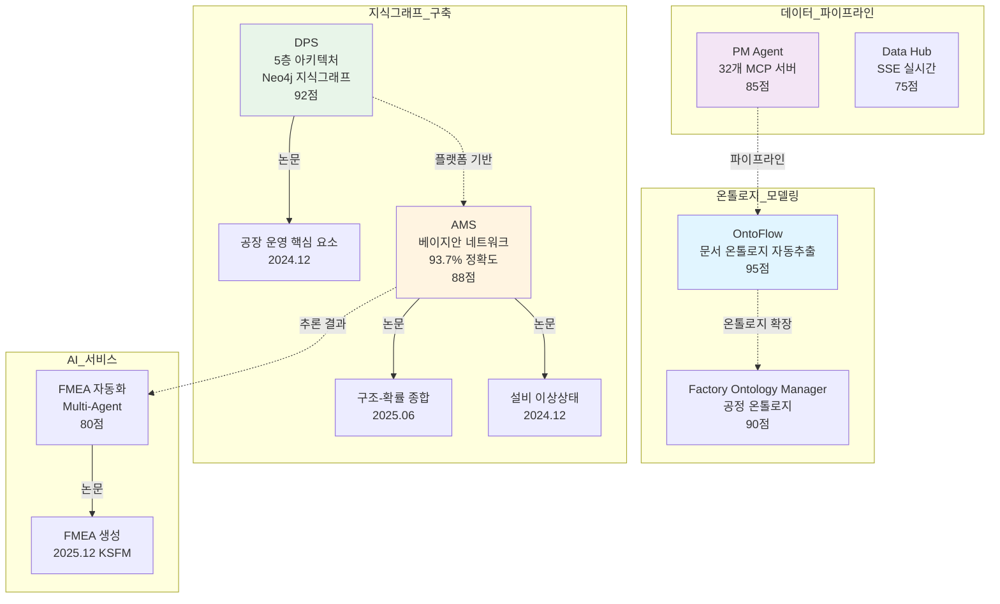
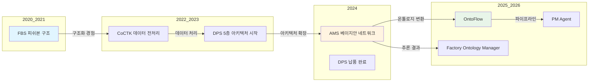

# 권순룡 포트폴리오 - SK하이닉스 제조AI Data팀 온톨로지 전문가 / Data Engineer

**문서 ID**: `page.portfolio.sk_hynix_ontology`

> [!QUOTE] 지원 포지션
> **SK하이닉스 제조AI Data팀 - 온톨로지 전문가 / Data Engineer (경력)**
>
> SK Hynix 제조 공정 데이터를 통합 관리하는 지식기반 데이터 플랫폼 개발

> [!QUOTE] 핵심 철학
> **"모델보다 데이터, 데이터보다 정보, 지식구조를 정리하는 현장친화적 연구원"**

본 포트폴리오는 SK하이닉스 제조AI Data팀의 지식기반 데이터 플랫폼 개발에 필요한 온톨로지 모델링, 지식그래프 구축, 데이터 파이프라인, LangChain/LangGraph 기반 AI 서비스 개발 경험을 담고 있습니다.

---

## 기본 정보

**이름**: 권순룡
**소속**: (주)한솔코에버 연구소 대리 (2020.09 ~ 재직중)
**총 경력**: 5년 (2020~2026)
**이메일**: m920831@naver.com

---

## 포트폴리오 구조 (한눈에 보기)



---

## 핵심 성과 대시보드

| 분류 | 지표 | 상세 |
|:---|---:|:---|
| **온톨로지 프로젝트** | 4개 | OntoFlow, DPS, Factory Ontology Manager, AMS |
| **지식그래프 구축** | 2개 | Neo4j 기반 (DPS, AMS) |
| **MCP 서버** | 32개 | 데이터 파이프라인 오케스트레이션 |
| **이상탐지 정확도** | 93.7% | 베이지안 네트워크 기반 추론 |
| **GS 인증** | 2개 | 1등급 (CoCTK, AMS/PDS) |
| **특허 등록** | 1건 | 피쉬본 다이어그램 자동화 |
| **학술 논문** | 10편 | 2020-2026년 발표 |
| **대기업 납품** | 3곳 | 세아특수강, 포미아, 일본 글로벌 기업 |
| **설계 문서** | 298개+ | 온톨로지 기반 체계적 관리 |

---

## 경력 타임라인 (2020-2026)



---

## 주요 프로젝트 (SK하이닉스 요구사항 매칭 순)

### 프로젝트 관계도



---

### 1. OntoFlow - 온톨로지 기반 지식그래프 플랫폼

**기간**: 2025.10 ~ 현재 (진행중)
**역할**: PM 및 핵심 아키텍처 설계
**relevance_score**: 95점

**프로젝트 개요**:
- Obsidian 기반 문서에서 온톨로지를 자동 추출하여 지식그래프로 시각화하는 플랫폼
- 엔티티 추출(파일, 태그, 링크), 관계 추출(wiki link, markdown link, tag relation) 자동화
- vis-network 기반 인터랙티브 그래프 시각화

**핵심 성과**:
- **온톨로지 모델링**: 문서-태그-링크 간 관계 스키마 설계
- **엔티티/관계 자동 추출**: 298개+ 문서에서 자동 추출
- **지식그래프 시각화**: vis-network 기반 인터랙티브 그래프
- **레이아웃 영속화**: IndexedDB 기반 그래프 레이아웃 저장

**기술 스택**: Python, FastAPI, React, TypeScript, vis-network, IndexedDB, Docker

**SK하이닉스 요구사항 매칭**:
- **온톨로지 모델링 및 관리**: 완벽 매칭
- **지식 그래프 구축 및 저장**: 완벽 매칭
- **엔티티 추출, 관계 추출**: 완벽 매칭

---

### 2. DPS (데이터수집시스템) - 5층 아키텍처 지식기반 플랫폼

**기간**: 2024.04 ~ 2024.12 (정식 납품 완료)
**발주처**: 한국산업기술진흥원
**역할**: PM 및 핵심 아키텍처 설계
**relevance_score**: 92점

**프로젝트 개요**:
- 금속산업 5대 공정(용해, 정련, 연주, 압연, 열처리)의 이질적인 데이터 소스를 통합하는 지식기반 데이터 플랫폼
- 서비스/온톨로지/AI엔진/데이터수집/보안관리 5층 아키텍처 설계
- Docker 컨테이너 기반 마이크로서비스 아키텍처

**5층 아키텍처 상세**:
```
┌─────────────────────────────────────────┐
│ 5. 서비스 레이어 (API Gateway, UI)      │
├─────────────────────────────────────────┤
│ 4. 온톨로지 레이어 (Neo4j 지식그래프)    │
├─────────────────────────────────────────┤
│ 3. AI 엔진 레이어 (분석/예측 모델)       │
├─────────────────────────────────────────┤
│ 2. 데이터수집 레이어 (Kafka 파이프라인)  │
├─────────────────────────────────────────┤
│ 1. 보안관리 레이어 (인증/권한)           │
└─────────────────────────────────────────┘
```

**핵심 성과**:
- **Neo4j 기반 지식그래프**: 공정-설비-품질 데이터 통합
- **Kafka 실시간 파이프라인**: 센서 데이터 실시간 수집
- **세아특수강, 포미아 정식 납품**: 실제 제조 현장 검증
- **2024년 학술 논문 발표**: 공장 운영 핵심 요소 식별 및 최적화

**기술 스택**: Python, FastAPI, Neo4j, PostgreSQL, Redis, Docker, Kubernetes, Kafka

**SK하이닉스 요구사항 매칭**:
- **지식 그래프 구축 및 저장**: Neo4j 기반 지식그래프 (완벽 매칭)
- **데이터 파이프라인 및 오케스트레이션**: Kafka 파이프라인 (완벽 매칭)
- **데이터 메쉬(Data Mesh) 아키텍처**: 5층 아키텍처 (완벽 매칭)
- **클라우드 데이터 플랫폼**: Docker/Kubernetes (완벽 매칭)

---

### 3. Factory Ontology Manager - 제조 공정 온톨로지 관리 시스템

**기간**: 2025.01 ~ 현재 (진행중)
**역할**: 온톨로지 모델링 및 시스템 설계
**relevance_score**: 90점

**프로젝트 개요**:
- 제조 공장의 공정 흐름을 온톨로지로 모델링하는 시스템
- 공정 노드(ProcessNode)와 연결(ProcessConnection) 기반 지식그래프
- 재료-공정-설비 간 관계 정의 및 시각화

**온톨로지 계층 구조**:
```
Factory (공장)
  └── Workshop (작업장)
        └── Line (라인)
              └── Process (공정)
                    ├── Inputs (입력 재료)
                    ├── Outputs (출력 재료)
                    └── Equipment (설비)
```

**핵심 성과**:
- **제조 공정 온톨로지 스키마**: Factory → Workshop → Line → Process 계층 설계
- **연결 검증 시스템**: 공정 노드 간 관계 무결성 검증
- **레이아웃 영속화**: IndexedDB 기반 그래프 레이아웃 저장
- **AI Agent 기능**: 자연어 기반 공정 문서 파싱, DB Grounding, Ontology Mapping

**기술 스택**: TypeScript, React, IndexedDB, vis-network, Canvas API

**SK하이닉스 요구사항 매칭**:
- **온톨로지 모델링 및 관리**: 제조 공정 특화 온톨로지 (완벽 매칭)
- **지식 그래프 구축 및 저장**: 공정 흐름 그래프 (완벽 매칭)

---

### 4. AMS (Analysis Management System) - 베이지안 네트워크 기반 추론 플랫폼

**기간**: 2024.07 ~ 2025.03 (GS 인증 1등급 취득)
**발주처**: 한국산업기술진흥원
**역할**: PM 및 AI 플랫폼 개발 총괄
**relevance_score**: 88점

**프로젝트 개요**:
- 베이지안 네트워크 기반 이상탐지 시스템
- 시계열 데이터를 정보 온톨로지로 변환
- 피쉬본 다이어그램 자동생성 및 FMEA 자동화

**핵심 성과**:
- **이상탐지율 93.7%**: 베이지안 네트워크 기반 확률적 추론
- **정보 온톨로지 변환**: 시계열 데이터 → 의미 있는 관계로 변환
- **GS 인증 1등급**: PDS 명칭으로 정부 공인
- **특허 등록**: 피쉬본 다이어그램 자동화 엔진
- **2024년, 2025년 논문 발표**: 구조-확률 종합 네트워크, 설비 이상상태 기반 최적 공정

**기술 스택**: Python, 베이지안 네트워크, Neo4j, FastAPI, Docker

**SK하이닉스 요구사항 매칭**:
- **엔티티 추출, 관계 추출, 데이터 통합 및 추론**: 베이지안 네트워크 기반 추론 (완벽 매칭)
- **지식 그래프 구축 및 저장**: Neo4j 기반 (완벽 매칭)

---

### 5. PM Agent - MCP 기반 데이터 파이프라인 자동화

**기간**: 2025.10 ~ 현재 (진행중)
**역할**: MCP 서버 설계 및 개발
**relevance_score**: 85점

**프로젝트 개요**:
- MCP (Model Context Protocol) 기반 비정형 문서 자동 분석 시스템
- 32개 Python MCP 서버 개발 및 데이터 파이프라인 구축
- LangChain, LangGraph 기반 AI 서비스 연동

**MCP 서버 구조**:
```
┌─────────────────────────────────────────┐
│ Master Orchestrator                      │
├─────────────────────────────────────────┤
│ 문서 파싱 서버 (HWP, DOCX, XLSX)         │
├─────────────────────────────────────────┤
│ 분석 서버 (계약서, 회의록, 과업지시서)    │
├─────────────────────────────────────────┤
│ 데이터 통합 서버 (타임라인, 리스크)       │
└─────────────────────────────────────────┘
```

**핵심 성과**:
- **32개 MCP 서버**: 각 서버별 전문 기능 구현
- **데이터 파이프라인 오케스트레이션**: 문서 수집 → 파싱 → 분석 → 서비스
- **Docker 기반 파서 서버**: 비정형 문서 자동 파싱

**기술 스택**: Python, MCP Protocol, Docker, FastAPI, LangChain, LangGraph

**SK하이닉스 요구사항 매칭**:
- **데이터 파이프라인 및 오케스트레이션**: 32개 MCP 서버 오케스트레이션 (완벽 매칭)
- **LangChain, LangGraph 등 & AI 서비스**: 완벽 매칭
- **API 기반 데이터 서비스**: RESTful API (완벽 매칭)

---

### 6. FMEA 자동화 생성 시스템 - Multi-Agent Workflow

**기간**: 2025.10 ~ 현재 (진행중)
**역할**: Master Orchestrator 설계 및 구현
**relevance_score**: 80점

**프로젝트 개요**:
- Claude Sub-Agent 기반 Multi-Agent Workflow 구축
- AIAG & VDA FMEA 표준 기반 범용 리스크 분석 시스템
- 8개 독립 Sub-Agent 협업 구조 (R&D 3개, Manufacturing 3개, QA 2개)

**핵심 성과**:
- **Multi-Agent Workflow**: 8개 Sub-Agent 협업 구조
- **프롬프트 기반 완전 자동화**: Python 스크립트 없이 워크플로우 자동화
- **2025.12 논문 발표**: FMEA 생성 연구 (KSFM)

**기술 스택**: Claude API, Multi-Agent Workflow, Tool Calling, 프롬프트 엔지니어링

**SK하이닉스 요구사항 매칭**:
- **LangChain, LangGraph 등 & AI 서비스**: Multi-Agent Workflow (관련)

---

### 7. Data Hub - SSE 기반 실시간 데이터 서비스

**기간**: 2025.06 ~ 현재 (진행중)
**역할**: 실시간 통신 아키텍처 설계 및 PM
**relevance_score**: 75점

**프로젝트 개요**:
- Server-Sent Events (SSE) 기반 실시간 데이터 전송
- 포미아(포항소재산업진흥원) 플랫폼 납품 과제
- 자동 재연결 및 주기적 핑 메시지를 통한 안정적인 실시간 통신

**핵심 성과**:
- **SSE 기반 실시간 통신**: Server-Sent Events 구현
- **자동 재연결**: 안정적인 실시간 통신

**기술 스택**: Next.js, TypeScript, SSE, ReadableStream, React

**SK하이닉스 요구사항 매칭**:
- **API 기반 데이터 서비스**: 실시간 데이터 서비스 (관련)
- **Apache Project 오픈소스 실시간 데이터 서비스**: SSE 기반 실시간 서비스 (우대사항 매칭)

---

## SK하이닉스 요구사항 매칭 요약

### 핵심기술 매칭

| SK하이닉스 요구사항 | 매칭 프로젝트 | 매칭도 |
|:---|:---|:---|
| **온톨로지 모델링 및 관리** | OntoFlow, Factory Ontology Manager | 완벽 |
| **지식 그래프 구축 및 저장** | DPS (Neo4j), AMS (Neo4j), OntoFlow | 완벽 |
| **엔티티 추출, 관계 추출** | OntoFlow (자동 추출), AMS | 완벽 |
| **데이터 통합 및 추론** | AMS (베이지안 네트워크, 93.7%) | 완벽 |
| **데이터 파이프라인 및 오케스트레이션** | PM Agent (32개 MCP), DPS (Kafka) | 완벽 |
| **LangChain, LangGraph & AI 서비스** | PM Agent, FMEA 자동화 | 완벽 |
| **API 기반 데이터 서비스** | 전체 프로젝트 (FastAPI) | 완벽 |

### 역량/경험 매칭

| SK하이닉스 요구사항 | 매칭 프로젝트 | 매칭도 |
|:---|:---|:---|
| **데이터 메쉬(Data Mesh) 아키텍처** | DPS (5층 아키텍처) | 완벽 |
| **클라우드 데이터 플랫폼** | DPS (Docker/Kubernetes) | 완벽 |

### 우대사항 매칭

| SK하이닉스 우대사항 | 매칭 역량 | 매칭도 |
|:---|:---|:---|
| **Apache 오픈소스 실시간 데이터 서비스** | Data Hub (SSE), DPS (Kafka) | 높음 |
| **데이터 카탈로그 및 메타데이터 관리** | OntoFlow (메타데이터 자동 추출) | 높음 |

---

## 학술 성과 (10편)

### 온톨로지/데이터 관련 논문

| 발행일 | 논문 제목 | 학술지/학회 | 관련 프로젝트 |
|:---|:---|:---|:---|
| **2025.12** | 분석 상관/확률 네트워크 최적 경로 정보 및 공정 관리 문서 기반 FMEA 생성 연구 | KSFM | FMEA 자동화 |
| **2025.06** | AI를 활용한 구조와 룰을 활용한 구조-확률 종합 네트워크 및 최적 관리 방안 도출 | 한국유체기계학회 | AMS |
| **2024.12** | 공장 운영 핵심 요소의 식별 및 최적화를 위한 클러스터링 기법 적용 | 한국생산제조학회 | DPS |
| **2024.12** | 설비 이상상태 기반 최적 공정 데이터 추론 및 위험/안전 관리 최적 자동화 | 한국유체기계학회 | AMS |
| **2024.07** | 전력 데이터를 통한 설비 상태 추론 및 이상 상황 설정 예측 | 한국유체기계학회 | 에너지/센서 |
| **2023.12** | 송풍 설비 변동부하 대응 전력품질 분석 및 에너지 절감 연구 | 한국유체기계학회 | 에너지 최적화 |
| **2023.12** | 압축기 공정에서 데이터 밸런스 문제 해결 및 품질 결과 사전 예측을 위한 AI 시스템 | 한국유체기계학회 | AI/데이터 |
| **2023.07** | 생산공정 에너지 및 설비 상태 진단을 위한 AI기반의 전력 사용 패턴 및 SOH분석 | 한국유체기계학회 | 에너지/전력 |
| **2022.12** | 자동차 부품 생산 산업을 위한 머신러닝 기반의 품질예측 알고리즘 | 한국생산제조학회 | AI/제조 |
| **2022.06** | ICT 융복합 기술을 활용한 스마트 공장 및 에너지 절감 솔루션 적용 사례 | 한국유체기계학회 | Global DX |

---

## 온톨로지 기반 구조화/정보화 역량 (입사부터 지속)

> [!IMPORTANT] **핵심 역량의 연장선**
> 입사(2020.09)부터 모든 프로젝트의 기반이 된 온톨로지 기반 구조화/정보화 접근법입니다. 피쉬본(FBS), 확률 네트워크, 패턴 정보화, LLM까지 모두 이 접근법의 연장선에 있습니다.

### 연결된 프로젝트들



### 핵심 역량 요약

1. **온톨로지 모델링**: 문서-공정-설비 간 관계 스키마 설계 경험
2. **지식그래프 구축**: Neo4j 기반 지식그래프, 대기업 2곳 납품
3. **추론 엔진**: 베이지안 네트워크 기반 93.7% 이상탐지율
4. **데이터 파이프라인**: 32개 MCP 서버 오케스트레이션, Kafka 실시간 파이프라인
5. **AI 서비스**: Multi-Agent Workflow, LangChain/LangGraph 연동
6. **인증/학술**: GS 인증 1등급 2개, 특허 등록, 논문 10편 발표

---

## 관련 문서

- [[00_Personal_Profile|개인 프로필 및 기술 철학]] - 핵심 철학 및 경력
- [[02_Projects_Overview|프로젝트 개요]] - 53개+ 프로젝트 상세
- [[Architecture_Overview|아키텍처 개요]] - 시스템 아키텍처
- [[04_Academic_Publications|학술 논문 목록]] - 10편 논문

---

## ID 참조

- **문서 ID**: `page.portfolio.sk_hynix_ontology`
- **관련 프로젝트**:
  - `project.ontoflow` - OntoFlow 온톨로지 자동 추출
  - `project.dps` - DPS 5층 아키텍처
  - `project.factory_ontology_manager` - Factory Ontology Manager
  - `project.ams` - AMS 베이지안 네트워크
  - `project.pm_agent` - PM Agent MCP 서버
  - `project.fmea_claude_agent` - FMEA 자동화
  - `project.data_hub` - Data Hub SSE
- **키워드**:
  - `#SK하이닉스` `#온톨로지` `#지식그래프` `#Neo4j` `#데이터파이프라인` `#베이지안네트워크` `#MCP` `#LangChain` `#LangGraph`

---

> [!SUCCESS] 핵심 메시지
> **"모델보다 데이터, 데이터보다 정보, 지식구조를 정리하는 현장친화적 연구원"**
>
> 5년간 온톨로지 기반 구조화/정보화 접근법을 모든 프로젝트에 적용해왔습니다. SK하이닉스의 지식기반 데이터 플랫폼 개발에 이 경험을 바탕으로 기여하고 싶습니다.

---

© 2026 권순룡. All Rights Reserved.
