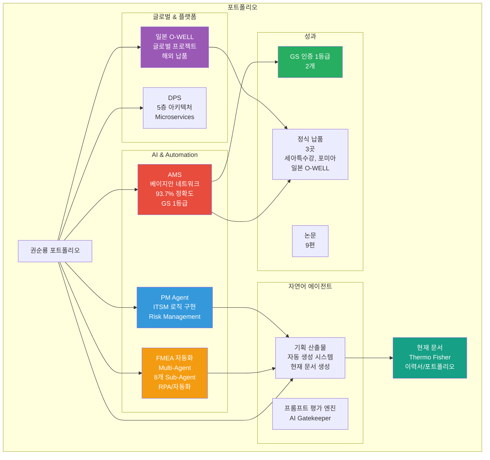
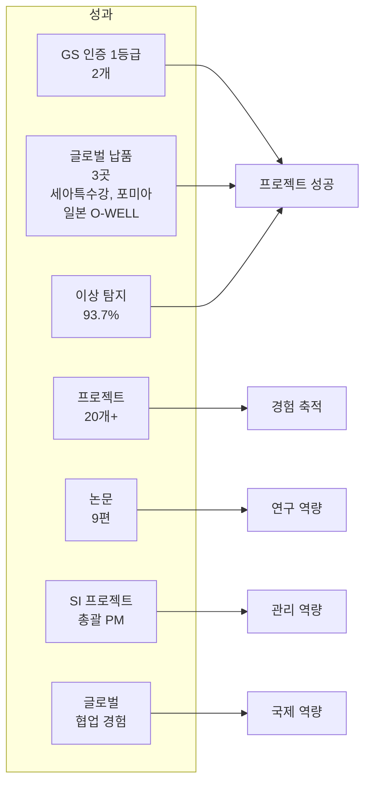
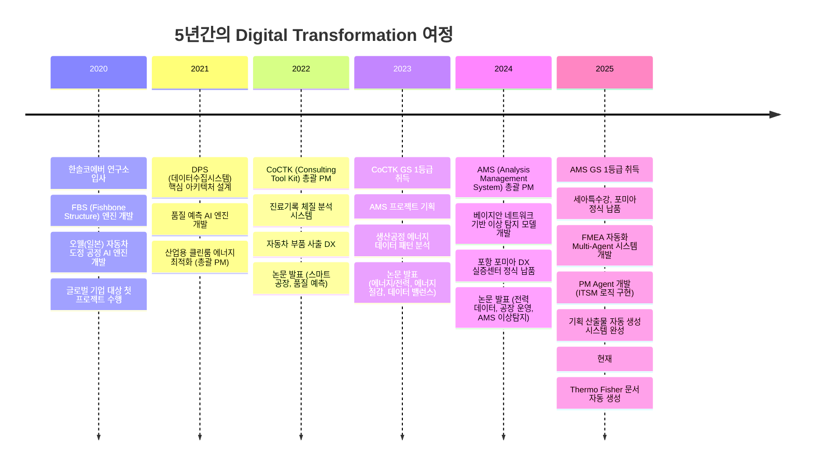
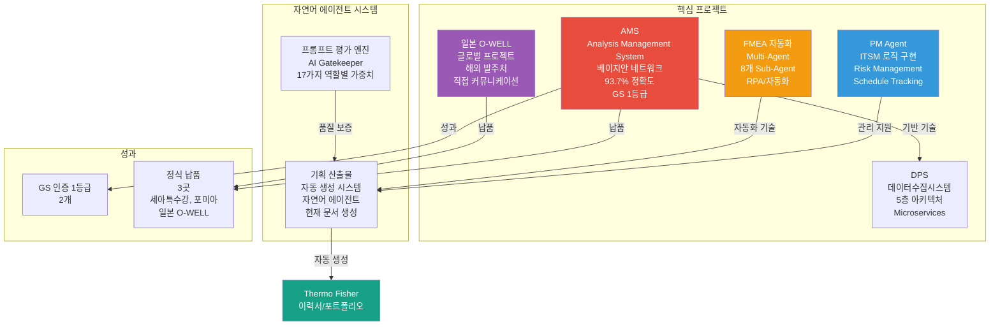
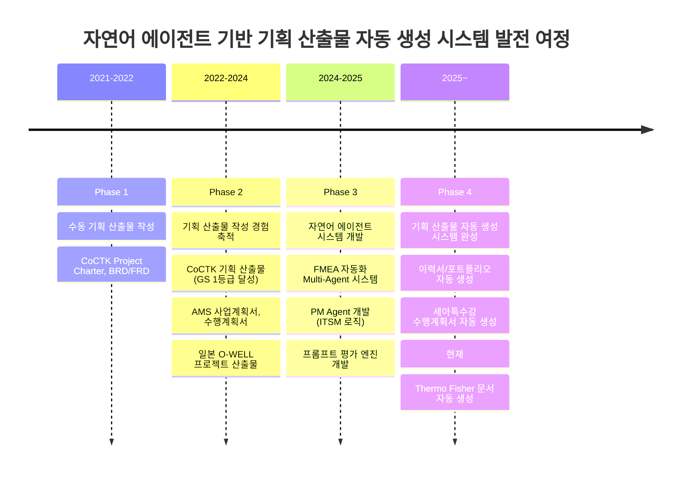
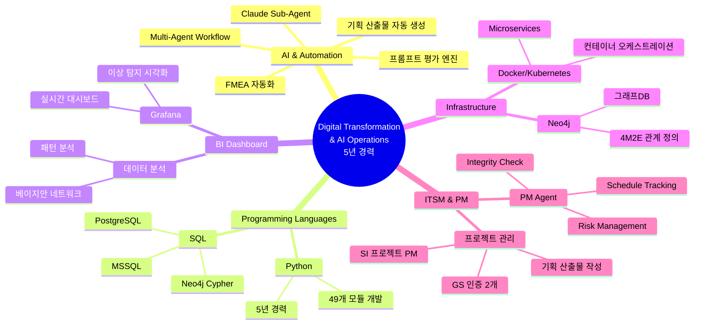

# 권순룡 포트폴리오

> **"모델보다 데이터, 데이터보다 정보, 지식구조를 정리하는 현장친화적 연구원"**

## 📌 기본 정보

**이름**: 권순룡  
**GitHub**: https://github.com/moobaek

---

## 📊 포트폴리오 구조 (한눈에 보기)

---

## 🎯 핵심 성과 대시보드

| 분류 | 지표 | 상세 |
|:---|---:|:---|
| **인증** | GS 1등급 2개 | CoCTK (2024), AMS (2025) |
| **글로벌 납품** | 3곳 | 세아특수강, 포미아, **일본 O-WELL** |
| **정확도** | 이상 탐지 93.7% | 베이지안 네트워크 기반 모델 |
| **프로젝트** | 20개+ | AI, 플랫폼, 센서, 에너지 최적화 |
| **논문** | 9편 | 2022~2025 학술 논문 발표 |
| **PM 경험** | SI 총괄 PM | AMS, CoCTK, DPS 등 |
| **글로벌 경험** | 일본 프로젝트 | O-WELL 해외 발주처 직접 협업 |

---

## 📅 경력 타임라인 (2020-2025)

---

## 🏆 주요 프로젝트 (20개+)

### 프로젝트 관계도

---

### 1. AMS (Analysis Management System) - 총괄 PM

**기간**: 2024.07 ~ 2025.03  
**발주처**: 한국산업기술진흥원  
**역할**: AI 종합 플랫폼 개발 총괄 PM

**핵심 성과**:
- ✅ **베이지안 네트워크 기반 이상 탐지 모델**: 확률 최적화(경사하강법)를 통한 이상상황 확률 네트워크 구축, 이상탐지율 93.7% 달성
- ✅ **Grafana 기반 실시간 대시보드**: 이상 탐지 시각화, 운영 의사결정 지원 (Power BI 유사 경험)
- ✅ **프로젝트 성공**: **GS 인증 1등급** (PDS 명칭) 취득, 세아특수강, 포미아 정식 납품
- ✅ **SI 프로젝트 PM**: 사업계획서, 수행계획서, Project Charter, BRD, FRD, WBS, PMP 등 작성

**기술 스택**: Python, SQL, Neo4j, 베이지안 네트워크, Grafana

**Thermo Fisher 직무와의 연관성**:
- **AI 이니셔티브 참여**: 베이지안 네트워크 기반 AI 솔루션 개발 및 비즈니스 적용
- **BI 대시보드 구축**: Power BI 유사 경험 (Grafana 실시간 대시보드)
- **SI 프로젝트 경험**: 정부 발주 SI 프로젝트 총괄 PM

---

### 2. FMEA 자동화 생성 시스템 (Claude Sub-Agent) - Master Orchestrator 설계

**기간**: 2025.6 ~  
**역할**: Master Orchestrator 설계 및 Multi-Agent Architecture 구축

**핵심 성과**:
- ✅ **Multi-Agent Workflow 구축**: 8개 독립 Sub-Agent 협업 구조 (R&D, Mfg, QA), Claude Code Task tool 기반 Master Orchestrator 설계
- ✅ **자연어 기반 자동화 시스템**: AIAG & VDA FMEA 표준 기반 범용 리스크 분석 시스템, Phase 0~5 자동화 워크플로우
- ✅ **RPA/자동화 역량 검증**: 문서 생성 자동화, 작업 시간 대폭 단축

**기술 스택**: Python, Claude Agent, Multi-Agent Architecture, MCP (Model Context Protocol)

**Thermo Fisher 직무와의 연관성**:
- **AI 이니셔티브**: use case 식별, 파일럿 수행, 비즈니스 워크플로우에 AI 솔루션 적용
- **RPA 솔루션 경험**: 워크플로우 자동화, 문서 생성 자동화
- **AI 도입 모범 사례 문서화**: FMEA 자동화 프로세스 문서화

---

### 3. PM Agent (Business Management Sub-Agent) - ITSM 로직 구현

**기간**: 2025.10 ~  
**역할**: 시스템 설계 및 개발 총괄

**핵심 성과**:
- ✅ **자체 개발 ITSM 로직 구현**: ServiceNow 유사 기능 개발
- ✅ **Risk Management**: 계약서/과업지시서 내 독소 조항 자동 추출 및 리스크 평가
- ✅ **Schedule Tracking**: 회의록 분석을 통한 타임라인 자동 현행화
- ✅ **Integrity Check**: 누락된 문서나 데이터 파편화를 방지하는 무결성 검증

**기술 스택**: MCP (Model Context Protocol), Docker, Claude Agent, HWP 파서

**Thermo Fisher 직무와의 연관성**:
- **ServiceNow 또는 유사 ITSM 플랫폼 경험**: 자체 개발 ITSM 로직
- **리스크 식별, 완화 계획 및 프로젝트 커뮤니케이션**: Risk Management 자동화
- **장애 후 근본 원인 및 예방 조치 문서화**: Integrity Check

---

### 4. 오웰(일본)社 자동차 도정 공정 - 글로벌 프로젝트

**기간**: 2023.12 ~ 2025.03  
**발주처**: O-WELL (일본)  
**역할**: AI 엔진 개발 및 해외 발주처 커뮤니케이션

**핵심 성과**:
- ✅ **글로벌 협업**: 일본 발주처와 직접 커뮤니케이션, 기술 협의, 요구사항 분석
- ✅ **인과 관계 다이어그램 AI 엔진 개발**: 패턴 최적 선택(정보량)과 계층 클러스터링 종합한 관계구조 생성
- ✅ **전사적 DX 가속화**: 완료보고 및 산출물 작성

**기술 스택**: Python, AI 엔진, 데이터 분석

**Thermo Fisher 직무와의 연관성**:
- **글로벌 또는 다국적 환경 근무 경험**: 일본 글로벌 기업 프로젝트
- **비즈니스 수준의 영어 능력**: 해외 발주처 커뮤니케이션
- **내부/외부 이해관계자와 협력**: 기술 협의, 요구사항 분석

---

### 5. DPS (데이터수집시스템) - PM 수행

**기간**: 2021 ~ 2024  
**역할**: 핵심 아키텍처 설계 및 개발 (PM 수행)

**핵심 성과**:
- ✅ **5층 아키텍처 설계**: Microservices 아키텍처, Neo4j 그래프DB 활용
- ✅ **대규모 데이터 처리**: 금속산업 5대 공정 AI 자동화, 실시간 데이터 수집 및 처리
- ✅ **Docker/Kubernetes 기반 인프라**: 컨테이너 오케스트레이션 경험

**기술 스택**: Python, SQL, Neo4j, Microservices, Docker, Kubernetes

**Thermo Fisher 직무와의 연관성**:
- **IT 운영, 애플리케이션 지원 또는 디지털 시스템 관리**: 5년간 시스템 운영 경험
- **구조화된 방식으로 다양한 우선순위 관리**: 5층 아키텍처 설계 및 운영

---

### 6. 기획 산출물 자동 생성 시스템 (자연어 에이전트)

**기간**: 2024~현재  
**역할**: 시스템 설계 및 개발 총괄

**핵심 성과**:
- ✅ **자연어 에이전트 기반 자동화**: Claude Sub-Agent 기반 Multi-Agent Workflow로 채용 공고 분석부터 문서 생성까지 전 과정 자동화
- ✅ **맞춤형 문서 생성**: 채용 공고 요구사항에 맞춰 이력서, 포트폴리오를 자동으로 생성
- ✅ **스마트 매칭 시스템**: AI가 포트폴리오를 분석하여 관련 프로젝트와 경험을 자동 선별
- ✅ **실제 적용 사례**: 현재 이 문서(Thermo Fisher 포트폴리오)를 이 시스템으로 생성

**기술 스택**: Claude Sub-Agent, Multi-Agent Workflow, Python, MCP, 프롬프트 엔지니어링

---

## 📋 본인이 작업한 기획 산출물: 자연어 에이전트 기반 자동 생성 시스템의 발전 여정

### 기획 산출물 자동 생성 시스템 발전 로드맵

5년간 총괄 PM으로서 기획 산출물 작성 경험을 축적하며, 자연어 에이전트 기반 기획 산출물 자동 생성 시스템을 단계적으로 발전시켜왔습니다. **이 문서(Thermo Fisher 이력서/포트폴리오)도 이 자연어 에이전트 시스템의 산출물입니다.**

---

### 생성된 기획 산출물 목록

| 생성 방식 | 프로젝트명 | 기획 산출물 종류 | 생성 기간 | 성과/결과 |
|:---|:---|:---|:---|:---|
| **자동 생성** | Thermo Fisher | 이력서/포트폴리오 | 2026.01 | 현재 문서 |
| **자동 생성** | 현대홈쇼핑 | 이력서/포트폴리오/자기소개서 | 2026.01 | 맞춤형 문서 자동 생성 |
| **자동 생성** | 세아특수강 | 수행계획서 (SOW) | 2025.06 | 5개월 프로젝트 성공적 완료 |
| **수동 작성** | AMS | 사업계획서, BRD/FRD, WBS/PMP | 2024.07 | GS 1등급, 정식 납품 |
| **수동 작성** | 일본 O-WELL | 완료보고 및 산출물 | 2025.03 | 글로벌 기업 납품 |

---

## 💻 기술 스택 맵

---

## 📚 학술 성과 (9편)

| 발행일 | 논문 제목 | 학술지/학회 | 핵심 성과 및 프로젝트 연계 |
|:---|:---|:---|:---|
| 2025.12 | **분석 상관/확률 네트워크 최적 경로 정보 및 공정 관리 문서 기반 FMEA 생성 연구** | KSFM 2025년도 동계학술대회 | [FMEA 자동화/AMS] 상관/확률 네트워크 최적 경로 분석 기반 FMEA 자동 생성 기술 검증 |
| 2025.06 | **AI를 활용한 구조와 룰을 활용한 구조-확률 종합 네트워크 및 최적 관리 방안 도출** | 한국유체기계학회 | [AMS] 피쉬본 AI 모델의 학술적 고도화 및 최적 관리 로직 증명 |
| 2024.12 | **공장 운영 핵심 요소의 식별 및 최적화를 위한 클러스터링 기법 적용** | 한국생산제조학회 | [포미아 DX] 공장 운영 데이터의 다차원 분석 |
| 2024.12 | **설비 이상상태 기반 최적 공정 데이터 추론 및 위험/안전 관리 최적 자동화** | 한국유체기계학회 | [AMS] 실시간 이상 상태 기반 위험 관리 알고리즘 |
| 2024.07 | **전력 데이터를 통한 설비 상태 추론 및 이상 상황 설정 예측** | 한국유체기계학회 | [에너지/센서] 전력 데이터 기반 설비 예지 보전 |
| 2023.12 | **송풍 설비 변동부하 대응 전력품질 분석 및 에너지 절감 연구** | 한국유체기계학회 | [에너지 최적화] 에너지 20% 절감 실증 |
| 2023.12 | **압축기 공정에서 데이터 밸런스 문제 해결 및 품질 결과 사전 예측을 위한 AI 시스템** | 한국유체기계학회 | [AI/데이터] AI 학습 모델 연구 |
| 2023.07 | **생산공정 에너지 및 설비 상태 진단을 위한 AI기반의 전력 사용 패턴 및 SOH분석** | 한국유체기계학회 | [에너지/전력] 설비 건전성 진단 |
| 2022.06 | **ICT 융복합 기술을 활용한 스마트 공장 및 에너지 절감 솔루션 적용 사례** | 한국유체기계학회 | [Global DX] 일본 도료기업 스마트 공장 구축 사례 |

---

## 🤖 자연어 에이전트 개발 경험 (AI 이니셔티브 핵심 역량)

### 자연어 에이전트 기반 Multi-Agent 시스템 개발

**FMEA 자동화 생성 시스템 (Claude Sub-Agent)**:
- **Master Orchestrator 설계**: Claude Code Task tool 기반, 8개 독립 Sub-Agent 협업 구조
- **자연어 기반 자동화**: AIAG & VDA FMEA 표준 기반 범용 리스크 분석 시스템
- **RPA/자동화 역량**: 문서 생성 자동화, 워크플로우 자동화

**PM Agent (ITSM 로직 구현)**:
- **Risk Management**: 계약서/과업지시서 내 독소 조항 자동 추출 및 리스크 평가
- **Schedule Tracking**: 회의록 분석을 통한 타임라인 자동 현행화
- **Integrity Check**: 누락된 문서나 데이터 파편화를 방지하는 무결성 검증

**프롬프트 평가 엔진 (Claude Sub-Agent)**:
- **AI Gatekeeper**: 모든 AI 생성물의 입구 통제, 전체 프롬프트 전수 평가
- **3가지 핵심 차원 평가**: Quality, Consistency, Cost
- **17가지 역할별 동적 가중치 시스템**

**기획 산출물 자동 생성 시스템**:
- **채용 공고 자동 파싱**: 요구사항, 기술 스택 자동 추출
- **포트폴리오 스마트 매칭**: AI가 관련 프로젝트와 경험 자동 선별
- **실제 적용 사례**: 현재 이 문서(Thermo Fisher 포트폴리오)를 이 시스템으로 생성

**기술 스택**: Claude Sub-Agent, Multi-Agent Workflow, Python, MCP (Model Context Protocol), 프롬프트 엔지니어링, LangGraph, FastAPI

---

## 🔗 관련 링크

### GitHub

- **메인 레포지토리**: https://github.com/moobaek/Testing_AI_agents_for_public_use
- **포트폴리오 문서**: https://github.com/moobaek/Testing_AI_agents_for_public_use/tree/main/portfolio/portfolio_docs
- **GitHub 프로필**: https://github.com/moobaek

---

© 2026 권순룡 (Kwon Sunryong). All Rights Reserved.
