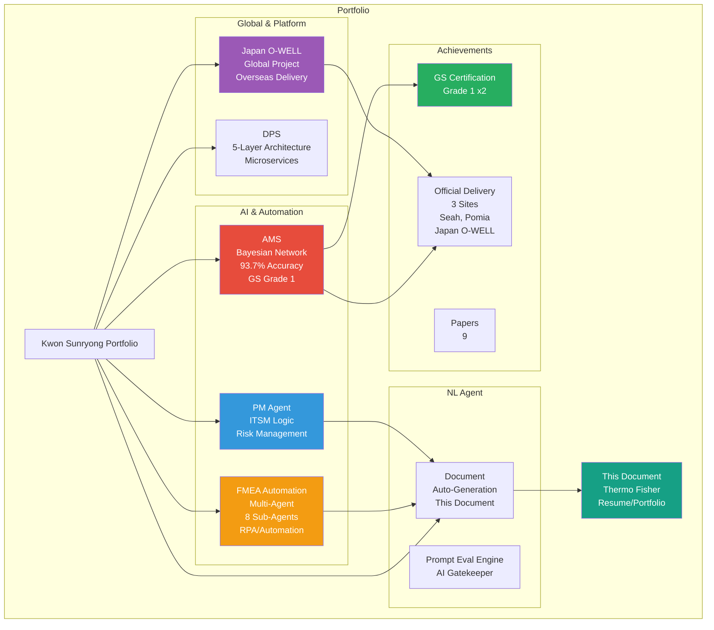
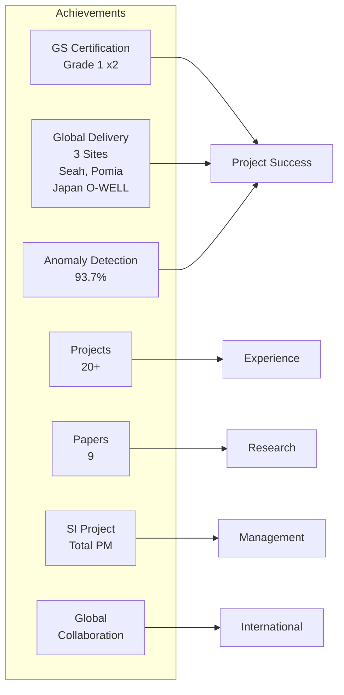
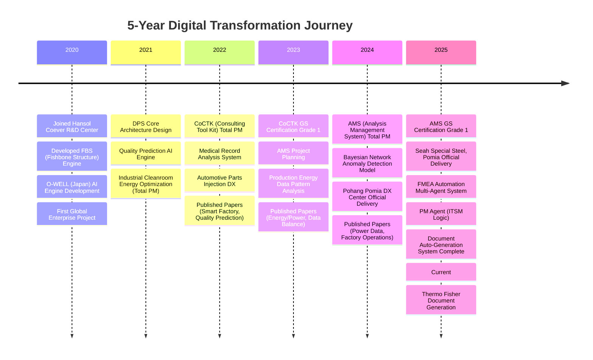
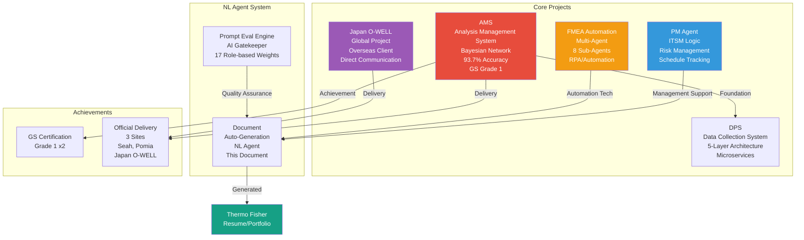
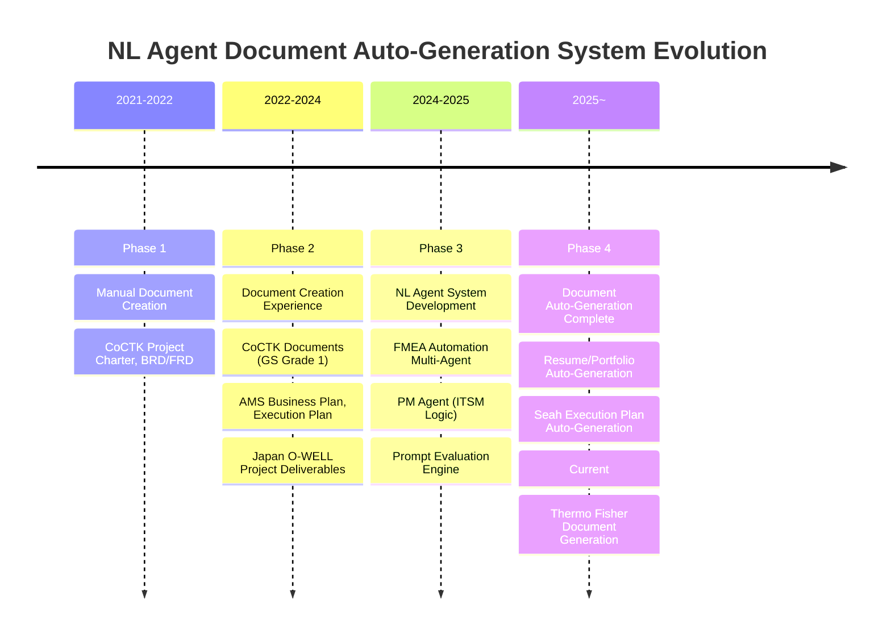
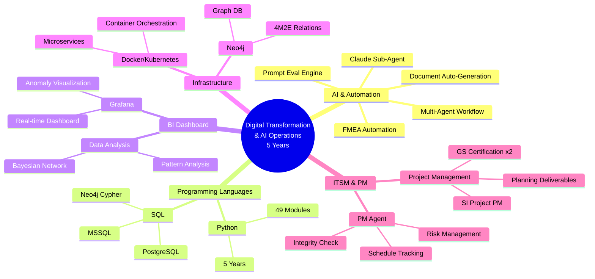

# Kwon Sunryong - Portfolio

> **"A field-oriented researcher who organizes knowledge structures, prioritizing information over data, and data over models"**

## 📌 Basic Information

**Name**: Kwon Sunryong (권순룡)  
**GitHub**: https://github.com/moobaek

---

## 📊 Portfolio Structure (Overview)

---

## 🎯 Key Achievement Dashboard

| Category | Metric | Details |
|:---|---:|:---|
| **Certification** | GS Grade 1 x2 | CoCTK (2024), AMS (2025) |
| **Global Delivery** | 3 Sites | Seah Special Steel, Pomia, **Japan O-WELL** |
| **Accuracy** | 93.7% | Bayesian Network-based Anomaly Detection |
| **Projects** | 20+ | AI, Platform, Sensors, Energy Optimization |
| **Papers** | 9 | Academic papers published 2022~2025 |
| **PM Experience** | SI Total PM | AMS, CoCTK, DPS, etc. |
| **Global Experience** | Japan Project | O-WELL Overseas Client Direct Collaboration |

---

## 📅 Career Timeline (2020-2025)

---

## 🏆 Major Projects (20+)

### Project Relationship Diagram

---

### 1. AMS (Analysis Management System) - Total PM

**Period**: Jul 2024 ~ Mar 2025  
**Client**: Korea Institute for Advancement of Technology (KIAT)  
**Role**: Total PM for AI Integrated Platform Development

**Key Achievements**:
- ✅ **Bayesian Network-based Anomaly Detection Model**: Probability optimization (gradient descent), 93.7% accuracy
- ✅ **Grafana Real-time Dashboard**: Anomaly detection visualization (Power BI-like experience)
- ✅ **Project Success**: **GS Certification Grade 1** (PDS name), Seah Special Steel, Pomia delivery
- ✅ **SI Project PM**: Business Plan, Execution Plan, Project Charter, BRD, FRD, WBS, PMP

**Tech Stack**: Python, SQL, Neo4j, Bayesian Network, Grafana

**Relevance to Thermo Fisher**:
- **AI Initiative Participation**: Bayesian Network-based AI solution development
- **BI Dashboard Development**: Power BI-like experience (Grafana)
- **SI Project Experience**: Government-funded SI Project Total PM

---

### 2. FMEA Automation System (Claude Sub-Agent) - Master Orchestrator Design

**Period**: Jun 2025 ~  
**Role**: Master Orchestrator Design and Multi-Agent Architecture

**Key Achievements**:
- ✅ **Multi-Agent Workflow**: 8 Independent Sub-Agent collaboration (R&D, Mfg, QA)
- ✅ **NL-based Automation**: AIAG & VDA FMEA standard-based risk analysis
- ✅ **RPA/Automation Validation**: Document generation automation

**Tech Stack**: Python, Claude Agent, Multi-Agent Architecture, MCP

**Relevance to Thermo Fisher**:
- **AI Initiatives**: Use case identification, pilots, AI solutions to business workflows
- **RPA Solution Experience**: Workflow automation, document automation
- **AI Adoption Best Practices Documentation**: FMEA automation process documentation

---

### 3. PM Agent (Business Management Sub-Agent) - ITSM Logic Implementation

**Period**: Oct 2025 ~  
**Role**: System Design and Development Lead

**Key Achievements**:
- ✅ **Self-developed ITSM Logic**: ServiceNow-like functionality
- ✅ **Risk Management**: Automatic toxic clause extraction and risk assessment
- ✅ **Schedule Tracking**: Automatic timeline updates through meeting minutes analysis
- ✅ **Integrity Check**: Integrity verification to prevent missing documents

**Tech Stack**: MCP, Docker, Claude Agent, HWP Parser

**Relevance to Thermo Fisher**:
- **ServiceNow or similar ITSM Platform Experience**: Self-developed ITSM logic
- **Risk Identification, Mitigation Planning**: Risk Management automation
- **Root Cause and Preventive Action Documentation**: Integrity Check

---

### 4. O-WELL (Japan) Automotive Painting Process - Global Project

**Period**: Dec 2023 ~ Mar 2025  
**Client**: O-WELL (Japan)  
**Role**: AI Engine Development and Overseas Client Communication

**Key Achievements**:
- ✅ **Global Collaboration**: Direct communication with Japanese client
- ✅ **Causal Relationship Diagram AI Engine**: Pattern optimization + hierarchical clustering
- ✅ **Company-wide DX Acceleration**: Completion reports and deliverables

**Tech Stack**: Python, AI Engine, Data Analysis

**Relevance to Thermo Fisher**:
- **Global or Multinational Environment Experience**: Japan global enterprise project
- **Business-level English Proficiency**: Overseas client communication
- **Internal/External Stakeholder Collaboration**: Technical discussions, requirements analysis

---

### 5. DPS (Data Collection System) - PM

**Period**: 2021 ~ 2024  
**Role**: Core Architecture Design and Development (PM)

**Key Achievements**:
- ✅ **5-Layer Architecture Design**: Microservices, Neo4j Graph DB
- ✅ **Large-scale Data Processing**: Metal industry 5 major process AI automation
- ✅ **Docker/Kubernetes Infrastructure**: Container orchestration

**Tech Stack**: Python, SQL, Neo4j, Microservices, Docker, Kubernetes

**Relevance to Thermo Fisher**:
- **IT Operations, Application Support, Digital Systems Management**: 5 years experience
- **Structured Approach to Multiple Priorities**: 5-layer architecture design and operation

---

### 6. Document Auto-Generation System (NL Agent)

**Period**: 2024 ~ Present  
**Role**: System Design and Development Lead

**Key Achievements**:
- ✅ **NL Agent-based Automation**: Claude Sub-Agent Multi-Agent Workflow
- ✅ **Customized Document Generation**: Resume and portfolio matching job requirements
- ✅ **Smart Matching System**: AI auto-selects relevant projects and experience
- ✅ **Actual Application**: This document (Thermo Fisher Portfolio) generated by this system

**Tech Stack**: Claude Sub-Agent, Multi-Agent Workflow, Python, MCP, Prompt Engineering

---

## 📋 Document Auto-Generation System Evolution

### Development Roadmap

---

### Generated Documents List

| Generation Method | Project | Document Type | Period | Result |
|:---|:---|:---|:---|:---|
| **Auto** | Thermo Fisher | Resume/Portfolio | Jan 2026 | This Document |
| **Auto** | Hyundai Home Shopping | Resume/Portfolio/Cover Letter | Jan 2026 | Customized Documents |
| **Auto** | Seah Special Steel | Execution Plan (SOW) | Jun 2025 | 5-month Project Success |
| **Manual** | AMS | Business Plan, BRD/FRD, WBS/PMP | Jul 2024 | GS Grade 1, Delivery |
| **Manual** | Japan O-WELL | Completion Reports | Mar 2025 | Global Enterprise Delivery |

---

## 💻 Tech Stack Map

---

## 📚 Academic Achievements (9 Papers)

| Date | Paper Title | Journal/Conference | Key Achievement |
|:---|:---|:---|:---|
| Dec 2025 | **FMEA Generation Research Based on Analysis Correlation/Probability Network Optimal Path** | KSFM 2025 Winter Conference | [FMEA/AMS] FMEA auto-generation tech validation |
| Jun 2025 | **Structure-Probability Integrated Network and Optimal Management Using AI** | Korean Fluid Machinery Association | [AMS] Fishbone AI model academic advancement |
| Dec 2024 | **Clustering Technique for Factory Operation Key Factor Identification** | Korean Production Manufacturing Society | [Pomia DX] Multi-dimensional factory data analysis |
| Dec 2024 | **Equipment Abnormal State-based Optimal Process Data Inference** | Korean Fluid Machinery Association | [AMS] Real-time risk management algorithm |
| Jul 2024 | **Equipment State Inference and Anomaly Prediction through Power Data** | Korean Fluid Machinery Association | [Energy/Sensor] Power-based predictive maintenance |
| Dec 2023 | **Power Quality Analysis and Energy Reduction for Variable Load Blowers** | Korean Fluid Machinery Association | [Energy] 20% energy reduction validation |
| Dec 2023 | **AI System for Data Balance Problem and Quality Prediction in Compressor Process** | Korean Fluid Machinery Association | [AI/Data] AI learning model research |
| Jul 2023 | **AI-based Power Usage Pattern and SOH Analysis for Production Energy** | Korean Fluid Machinery Association | [Energy/Power] Equipment health diagnosis |
| Jun 2022 | **Smart Factory and Energy Reduction Solution Cases Using ICT Convergence** | Korean Fluid Machinery Association | [Global DX] Japan paint company smart factory |

---

## 🤖 NL Agent Development Experience (AI Initiative Core Competency)

### Multi-Agent System Development

**FMEA Automation System (Claude Sub-Agent)**:
- **Master Orchestrator Design**: Claude Code Task tool, 8 Independent Sub-Agent collaboration
- **NL-based Automation**: AIAG & VDA FMEA standard-based risk analysis
- **RPA/Automation**: Document generation automation, workflow automation

**PM Agent (ITSM Logic)**:
- **Risk Management**: Automatic toxic clause extraction and risk assessment
- **Schedule Tracking**: Automatic timeline updates through meeting minutes
- **Integrity Check**: Integrity verification to prevent missing documents

**Prompt Evaluation Engine (Claude Sub-Agent)**:
- **AI Gatekeeper**: Controls all AI output entrance, full prompt evaluation
- **3 Core Dimension Evaluation**: Quality, Consistency, Cost
- **17 Role-based Dynamic Weight System**

**Document Auto-Generation System**:
- **Job Posting Auto-Parsing**: Requirements, tech stack auto-extraction
- **Portfolio Smart Matching**: AI auto-selects relevant projects
- **Actual Application**: This document (Thermo Fisher Portfolio) generated by this system

**Tech Stack**: Claude Sub-Agent, Multi-Agent Workflow, Python, MCP, Prompt Engineering, LangGraph, FastAPI

---

## 🔗 Links

### GitHub

- **Main Repository**: https://github.com/moobaek/Testing_AI_agents_for_public_use
- **Portfolio Documents**: https://github.com/moobaek/Testing_AI_agents_for_public_use/tree/main/portfolio/portfolio_docs
- **GitHub Profile**: https://github.com/moobaek

---

© 2026 Kwon Sunryong (권순룡). All Rights Reserved.
