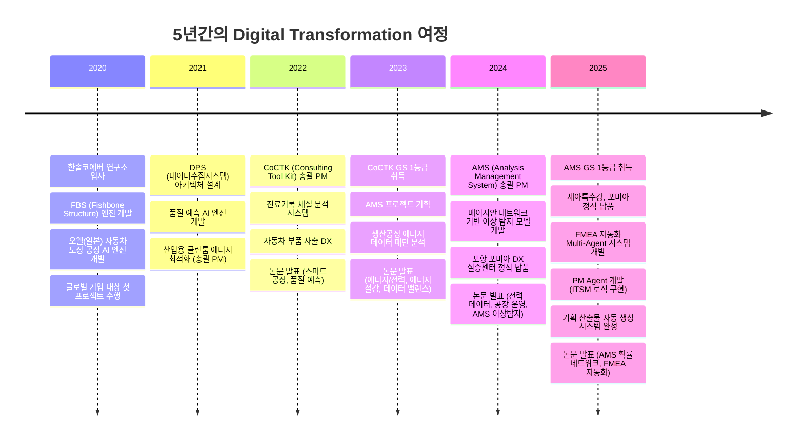
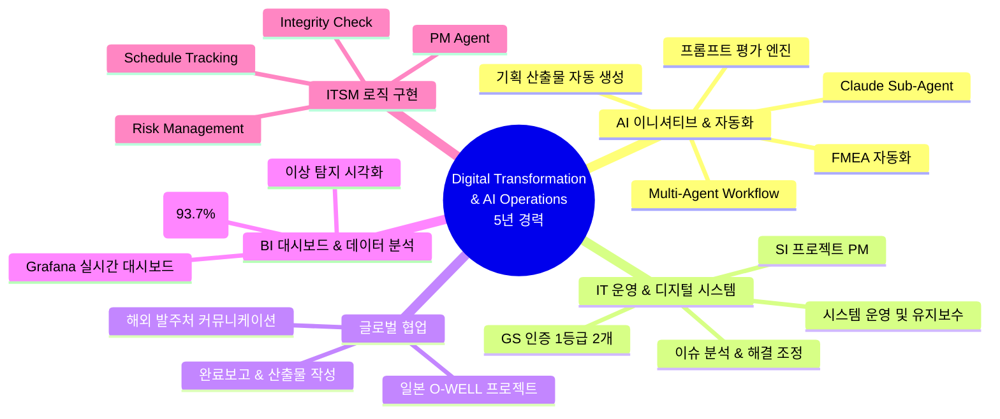
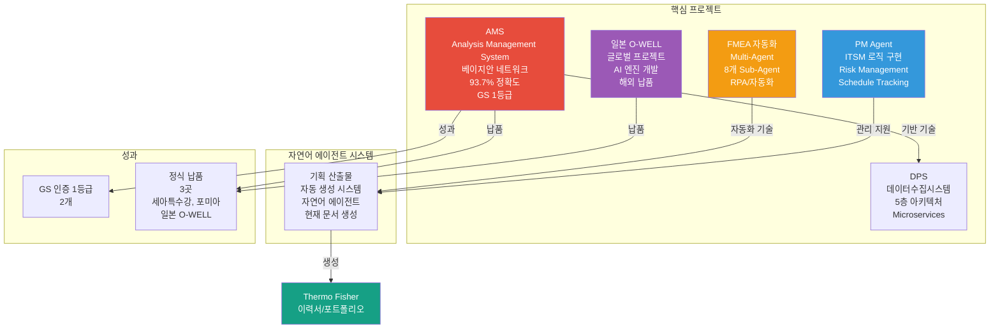
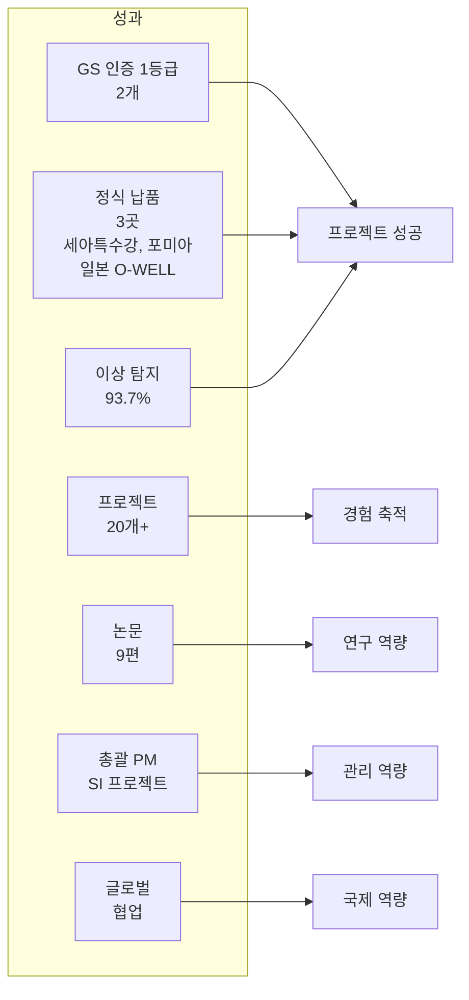

# 권순룡 이력서

## 기본 정보

**이름**: 권순룡  
**현 소속**: 한솔코에버 연구소 대리 (2020.09 ~ 재직중)  
**총 경력**: 5년 (2020~2025)  
**핵심 역량**: AI 이니셔티브 & 자동화, IT 운영 & 디지털 시스템 관리, 글로벌 프로젝트 협업, SI 프로젝트 PM, BI 대시보드 구축

---

## 한눈에 보는 경력 (2020-2025)

---

## 지원 동기

5년간 IT 운영, 디지털 시스템 관리, AI 모델 개발을 통해 "데이터를 정보로, 정보를 지식으로" 전환하는 과정에서 Digital Transformation과 AI 이니셔티브에 대한 전문성을 축적하였습니다.

특히 **일본 글로벌 기업(O-WELL) 프로젝트**에서 해외 발주처와 직접 커뮤니케이션하며 기술 협의, 요구사항 분석, 완료보고 및 산출물 작성을 수행한 경험이 있습니다. 이를 통해 Thermo Fisher Scientific의 **글로벌 팀과의 협업** 요구사항에 즉시 기여할 수 있습니다.

또한 **AMS 프로젝트에서 총괄 PM**으로 GS 인증 1등급을 취득하고, **FMEA 자동화 시스템**에서 Multi-Agent Workflow를 구축하여 **AI 이니셔티브 및 RPA/자동화** 역량을 검증하였습니다. **PM Agent**에서는 ServiceNow와 유사한 **ITSM 로직**(Risk Management, Schedule Tracking, Integrity Check)을 직접 구현하여 운영 안정성 확보 경험을 보유하고 있습니다.

Thermo Fisher Scientific의 E-commerce Operations, Sales App, Contact Center 플랫폼에서 **AI 기반 서비스 개선**, **글로벌 기술팀 조정**, **운영 대시보드 구축** 업무에 기여하고 싶습니다.

---

## 장단점

5년간의 AI 이니셔티브 개발과 IT 운영 경험으로 복잡한 시스템 문제를 체계적으로 분석하고 해결하는 능력을 보유하며, 총괄 PM으로서 **GS 인증 1등급 2개**, **글로벌 납품 3곳**(세아특수강, 포미아, 일본 O-WELL)의 성과를 달성하였습니다. 

다만 기술적 완성도에 대한 높은 기준으로 인해 세부 사항에 시간을 많이 투자하는 경향이 있어, 우선순위 기반 업무 분배와 적시성을 고려한 효율적인 시간 관리를 실천하고 있습니다.

---

## 핵심 역량 맵

---

## 핵심 역량

### AI 이니셔티브 & 자동화 (5년 경력)

FMEA 자동화 생성 시스템에서 **Claude Sub-Agent 기반 Multi-Agent Workflow**를 구축하여 8개 독립 Sub-Agent가 협업하는 구조를 설계하였습니다. AIAG & VDA FMEA 표준 기반 범용 리스크 분석 시스템을 구축하여 **AI 이니셔티브 참여 및 비즈니스 워크플로우에 AI 솔루션 적용** 역량을 검증하였습니다. 또한 **기획 산출물 자동 생성 시스템**을 개발하여 채용 공고 분석부터 문서 생성까지 전 과정을 자동화하였습니다. 이 문서(Thermo Fisher 이력서)도 이 자연어 에이전트 시스템의 산출물입니다.

### IT 운영 & SI 프로젝트 PM (5년 경력)

AMS, CoCTK 등 정부 발주 **SI 프로젝트에서 총괄 PM**을 수행하여 프로젝트 전체 라이프사이클(기획-개발-검증-납품)을 관리하였습니다. **GS 인증 1등급 2개**(CoCTK 2024, AMS 2025)를 취득하고, **세아특수강, 포미아에 정식 납품**하여 고객 중심 문제 해결 역량을 입증하였습니다. 사업계획서, 수행계획서, Project Charter, BRD, FRD, WBS, PMP 등 다양한 기획 산출물을 작성하여 프로젝트 성공에 기여하였습니다.

### 글로벌 협업 & 커뮤니케이션

**일본 글로벌 기업 O-WELL 프로젝트**에서 해외 발주처와 직접 커뮤니케이션하며 인과 관계 다이어그램 AI 엔진을 개발하였습니다. 완료보고 및 산출물 작성을 통해 **국제 이해관계자와의 효과적인 커뮤니케이션** 역량을 입증하였으며, 전사적 DX 가속화에 기여하였습니다.

### BI 대시보드 & 데이터 분석

AMS 프로젝트에서 **Grafana 기반 실시간 대시보드**를 구축하여 이상 탐지 시각화 시스템을 운영하였습니다. 베이지안 네트워크 기반 이상 탐지 모델을 개발하여 **93.7%의 정확도**를 달성하였으며, 데이터 분석을 통한 비즈니스 및 운영 의사결정 지원 인사이트를 생성한 경험이 있습니다.

### ITSM 로직 구현 (ServiceNow 유사 경험)

PM Agent에서 **자체 개발 ITSM 로직**을 구현하여 사업 관리 전체 라이프사이클을 관장하였습니다:
- **Risk Management**: 계약서/과업지시서 내 독소 조항 자동 추출 및 리스크 평가
- **Schedule Tracking**: 회의록 분석을 통한 타임라인 자동 현행화
- **Integrity Check**: 누락된 문서나 데이터 파편화를 방지하는 무결성 검증

---

## 프로젝트 관계도

---

## 경력 개요

### 한솔코에버 연구소 (2020.09 ~ 재직중)

**직급**: 대리  
**주요 업무**:
- AI 종합 플랫폼 개발 총괄 PM
- IT 운영 및 디지털 시스템 관리
- 글로벌 프로젝트 협업 및 커뮤니케이션
- Multi-Agent 기반 자동화 시스템 개발

**성과**:
- GS 인증 1등급 2개 취득 (CoCTK, AMS)
- 정식 납품 3곳 (세아특수강, 포미아, 일본 O-WELL)
- 이상 탐지 93.7% 정확도 달성
- 총괄 PM으로 프로젝트 전체 라이프사이클 관리

---

## 주요 프로젝트 경험

### 1. AMS (Analysis Management System) - 총괄 PM

**기간**: 2024.07 ~ 2025.03  
**발주처**: 한국산업기술진흥원  
**역할**: AI 종합 플랫폼 개발 총괄 PM

**핵심 성과**:
- ✅ **베이지안 네트워크 기반 이상 탐지 모델 개발**: 확률 최적화(경사하강법)를 통한 이상상황 확률 네트워크 구축, 이상탐지율 93.7% 달성
- ✅ **Grafana 기반 실시간 대시보드 구축**: 이상 탐지 시각화, 운영 의사결정 지원
- ✅ **프로젝트 성공**: **GS 인증 1등급** (PDS 명칭) 취득, 세아특수강, 포미아 정식 납품
- ✅ **기획 산출물 작성**: 사업계획서, 수행계획서, Project Charter, BRD, FRD, WBS, PMP 등 작성

**기술 스택**: Python, SQL, Neo4j, 베이지안 네트워크, Grafana

---

### 2. FMEA 자동화 생성 시스템 (Claude Sub-Agent) - Master Orchestrator 설계

**기간**: 2025.6 ~  
**역할**: Master Orchestrator 설계 및 Multi-Agent Architecture 구축

**핵심 성과**:
- ✅ **Multi-Agent Workflow 구축**: 8개 독립 Sub-Agent 협업 구조 (R&D, Mfg, QA), Claude Code Task tool 기반 Master Orchestrator 설계
- ✅ **자연어 기반 자동화 시스템**: AIAG & VDA FMEA 표준 기반 범용 리스크 분석 시스템, Phase 0~5 자동화 워크플로우
- ✅ **RPA/자동화 역량 검증**: 문서 생성 자동화, 작업 시간 대폭 단축

**기술 스택**: Python, Claude Agent, Multi-Agent Architecture, MCP (Model Context Protocol)

---

### 3. PM Agent (Business Management Sub-Agent) - ITSM 로직 구현

**기간**: 2025.10 ~  
**역할**: 시스템 설계 및 개발 총괄

**핵심 성과**:
- ✅ **자체 개발 ITSM 로직 구현**: ServiceNow 유사 기능 개발
- ✅ **Risk Management**: 계약서/과업지시서 내 독소 조항 자동 추출 및 리스크 평가
- ✅ **Schedule Tracking**: 회의록 분석을 통한 타임라인 자동 현행화
- ✅ **Integrity Check**: 누락된 문서나 데이터 파편화를 방지하는 무결성 검증

**기술 스택**: MCP (Model Context Protocol), Docker, Claude Agent, HWP 파서

---

### 4. 오웰(일본)社 자동차 도정 공정 - 글로벌 프로젝트

**기간**: 2023.12 ~ 2025.03  
**발주처**: O-WELL (일본)  
**역할**: AI 엔진 개발 및 해외 발주처 커뮤니케이션

**핵심 성과**:
- ✅ **글로벌 협업**: 일본 발주처와 직접 커뮤니케이션, 기술 협의, 요구사항 분석
- ✅ **인과 관계 다이어그램 AI 엔진 개발**: 패턴 최적 선택(정보량)과 계층 클러스터링 종합한 관계구조 생성
- ✅ **전사적 DX 가속화**: 완료보고 및 산출물 작성

**기술 스택**: Python, AI 엔진, 데이터 분석

---

### 5. DPS (데이터수집시스템) - PM 수행

**기간**: 2021 ~ 2024  
**역할**: 핵심 아키텍처 설계 및 개발 (PM 수행)

**핵심 성과**:
- ✅ **5층 아키텍처 설계**: Microservices 아키텍처, Neo4j 그래프DB 활용
- ✅ **대규모 데이터 처리**: 금속산업 5대 공정 AI 자동화, 실시간 데이터 수집 및 처리
- ✅ **Docker/Kubernetes 기반 인프라**: 컨테이너 오케스트레이션 경험

**기술 스택**: Python, SQL, Neo4j, Microservices, Docker, Kubernetes

---

### 6. 기획 산출물 자동 생성 시스템 (자연어 에이전트)

**기간**: 2024~현재  
**역할**: 시스템 설계 및 개발 총괄

**핵심 성과**:
- ✅ **자연어 에이전트 기반 자동화**: Claude Sub-Agent 기반 Multi-Agent Workflow로 채용 공고 분석부터 문서 생성까지 전 과정 자동화
- ✅ **맞춤형 문서 생성**: 채용 공고 요구사항에 맞춰 이력서, 포트폴리오를 자동으로 생성
- ✅ **실제 적용 사례**: 현재 이 문서(Thermo Fisher 이력서)를 이 시스템으로 생성

**기술 스택**: Claude Sub-Agent, Multi-Agent Workflow, Python, MCP, 프롬프트 엔지니어링

---

## 기술 스택

### Programming Languages
- **Python**: 5년 경력 (49개 Python 모듈 개발, MLS, CoCTK, FBS, RMS, AMS)
- **SQL**: MSSQL, PostgreSQL, Neo4j Cypher 활용

### AI & Automation
- **Multi-Agent Systems**: Claude Sub-Agent, LangGraph, MCP
- **ML/DL**: 베이지안 네트워크, 경사하강법, 예측 모델링, 이상 탐지

### BI Dashboard & Visualization
- **Grafana**: 실시간 대시보드 구축
- **데이터 시각화**: 이상 탐지 시각화, 운영 모니터링

### Infrastructure
- **Docker, Kubernetes**: 마이크로서비스 아키텍처, 컨테이너 오케스트레이션
- **Neo4j**: 그래프DB, 4M2E 관계 정의, 지식 그래프 플랫폼

### ITSM & Project Management
- **ITSM 로직 구현**: Risk Management, Schedule Tracking, Integrity Check
- **프로젝트 관리**: Agile, Waterfall, 기획 산출물 작성

---

## 성과 대시보드

---

## 학력 및 자격증

### 학력
- **홍익대학교 전자공학과** (2013.03 ~ 2020.02)
  - 학점: 3.11 / 4.5
  - 졸업논문: LD 동격회로 설계 및 PLL 설계
  - 주요 수강 분야: 회로 설계, 전파공학, 컴퓨터공학

### 자격증
- **OPIc** (2019.03) - ACT FL (American Council on the Teaching of Foreign Languages)

---

© 2026 권순룡 (Kwon Sunryong). All Rights Reserved.
