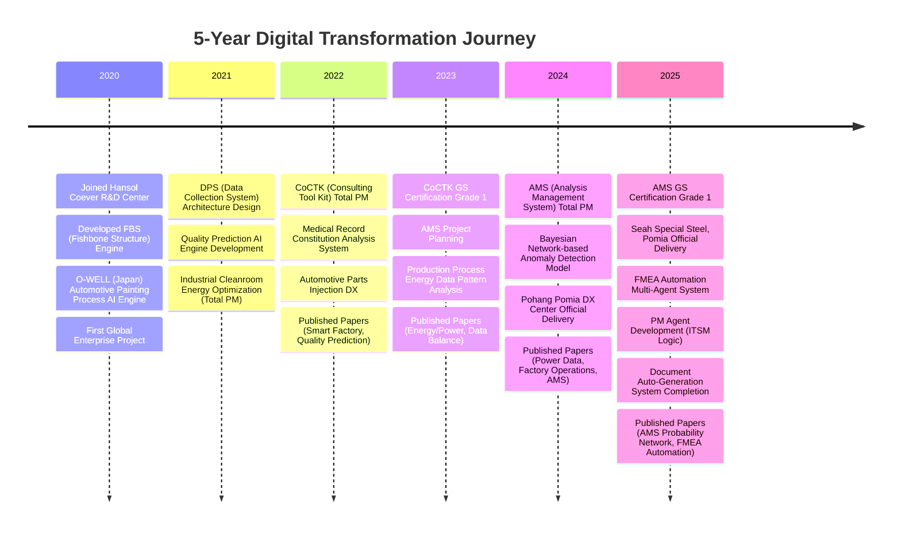
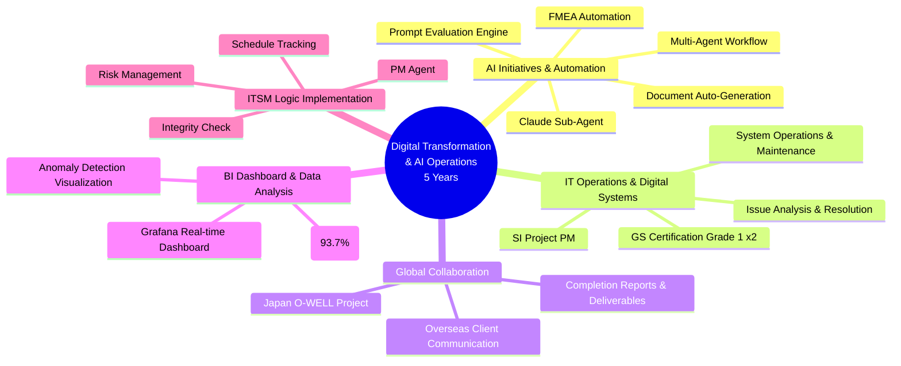
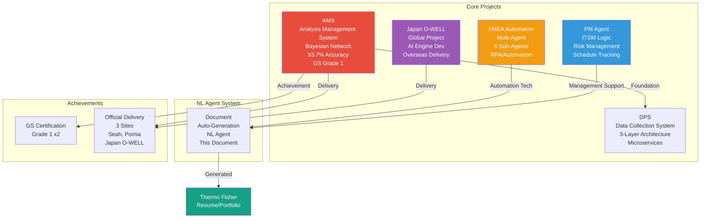
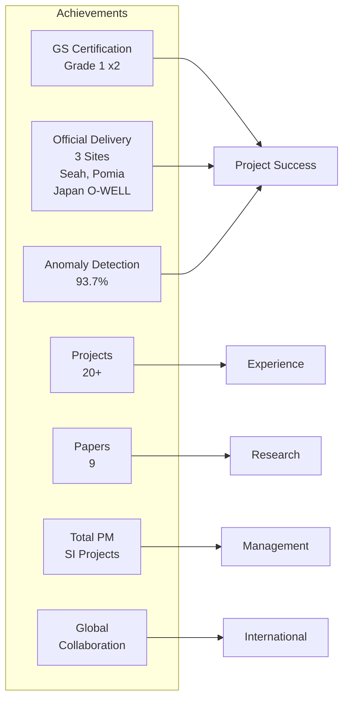

# Kwon Sunryong - Resume

## Basic Information

**Name**: Kwon Sunryong (권순룡)  
**Current Position**: Senior Researcher, Hansol Coever R&D Center (Sep 2020 ~ Present)  
**Total Experience**: 5 Years (2020~2025)  
**Core Competencies**: AI Initiatives & Automation, IT Operations & Digital Systems Management, Global Project Collaboration, SI Project PM, BI Dashboard Development

---

## Career Timeline (2020-2025)

---

## Motivation for Application

With 5 years of experience in IT operations, digital systems management, and AI model development, I have built expertise in Digital Transformation and AI initiatives through the process of converting "data to information, information to knowledge."

In the **O-WELL (Japan) Global Project**, I directly communicated with overseas clients, conducted technical discussions, requirements analysis, and prepared completion reports and deliverables. This experience enables me to immediately contribute to **Thermo Fisher Scientific's global team collaboration** requirements.

As **Total PM for the AMS Project**, I achieved GS Certification Grade 1, and in the **FMEA Automation System**, I built Multi-Agent Workflows to validate **AI initiatives and RPA/automation** capabilities. In **PM Agent**, I directly implemented **ITSM logic** similar to ServiceNow (Risk Management, Schedule Tracking, Integrity Check) to ensure operational stability.

I want to contribute to **AI-based service improvement**, **global technical team coordination**, and **operational dashboard development** for Thermo Fisher Scientific's E-commerce Operations, Sales App, and Contact Center platforms.

---

## Core Competencies Map

---

## Core Competencies

### AI Initiatives & Automation (5 Years)

Built **Claude Sub-Agent based Multi-Agent Workflow** in the FMEA Automation System with 8 independent Sub-Agents collaborating. Developed AIAG & VDA FMEA standard-based universal risk analysis system, validating **AI initiative participation and applying AI solutions to business workflows**. Also developed **Document Auto-Generation System** that automates the entire process from job posting analysis to document generation. This document (Thermo Fisher Resume) is also an output of this natural language agent system.

### IT Operations & SI Project PM (5 Years)

Served as **Total PM for government-funded SI projects** including AMS and CoCTK, managing the entire project lifecycle (planning-development-verification-delivery). Achieved **GS Certification Grade 1 x2** (CoCTK 2024, AMS 2025), and **official delivery to Seah Special Steel and Pomia**, proving customer-centric problem-solving capabilities. Contributed to project success by writing various planning deliverables including Business Plans, Execution Plans, Project Charters, BRD, FRD, WBS, PMP.

### Global Collaboration & Communication

In the **O-WELL (Japan) Global Project**, directly communicated with overseas clients to develop the Causal Relationship Diagram AI Engine. Demonstrated **effective communication with international stakeholders** through completion reports and deliverables, contributing to company-wide DX acceleration.

### BI Dashboard & Data Analysis

Built **Grafana-based real-time dashboards** in the AMS project, operating anomaly detection visualization systems. Developed Bayesian Network-based anomaly detection model achieving **93.7% accuracy**, with experience generating insights for business and operational decision support through data analysis.

### ITSM Logic Implementation (ServiceNow-like Experience)

Implemented **self-developed ITSM logic** in PM Agent to manage the entire business management lifecycle:
- **Risk Management**: Automatic extraction of toxic clauses from contracts/SOWs and risk assessment
- **Schedule Tracking**: Automatic timeline updates through meeting minutes analysis
- **Integrity Check**: Integrity verification to prevent missing documents or data fragmentation

---

## Project Relationship Diagram

---

## Career Overview

### Hansol Coever R&D Center (Sep 2020 ~ Present)

**Position**: Senior Researcher (Manager Level)  
**Main Responsibilities**:
- Total PM for AI Integrated Platform Development
- IT Operations and Digital Systems Management
- Global Project Collaboration and Communication
- Multi-Agent based Automation System Development

**Achievements**:
- GS Certification Grade 1 x2 (CoCTK, AMS)
- Official Delivery to 3 Sites (Seah Special Steel, Pomia, Japan O-WELL)
- Anomaly Detection 93.7% Accuracy
- Total PM managing entire project lifecycle

---

## Key Project Experience

### 1. AMS (Analysis Management System) - Total PM

**Period**: Jul 2024 ~ Mar 2025  
**Client**: Korea Institute for Advancement of Technology (KIAT)  
**Role**: Total PM for AI Integrated Platform Development

**Key Achievements**:
- ✅ **Bayesian Network-based Anomaly Detection Model**: Probability network construction through probability optimization (gradient descent), 93.7% anomaly detection rate
- ✅ **Grafana-based Real-time Dashboard**: Anomaly detection visualization, operational decision support
- ✅ **Project Success**: **GS Certification Grade 1** (PDS name), official delivery to Seah Special Steel, Pomia
- ✅ **Planning Deliverables**: Business Plan, Execution Plan, Project Charter, BRD, FRD, WBS, PMP

**Tech Stack**: Python, SQL, Neo4j, Bayesian Network, Grafana

---

### 2. FMEA Automation System (Claude Sub-Agent) - Master Orchestrator Design

**Period**: Jun 2025 ~  
**Role**: Master Orchestrator Design and Multi-Agent Architecture Development

**Key Achievements**:
- ✅ **Multi-Agent Workflow**: 8 independent Sub-Agent collaboration (R&D, Mfg, QA), Claude Code Task tool based Master Orchestrator design
- ✅ **NL-based Automation System**: AIAG & VDA FMEA standard-based universal risk analysis, Phase 0~5 automation workflow
- ✅ **RPA/Automation Validation**: Document generation automation, significant work time reduction

**Tech Stack**: Python, Claude Agent, Multi-Agent Architecture, MCP (Model Context Protocol)

---

### 3. PM Agent (Business Management Sub-Agent) - ITSM Logic Implementation

**Period**: Oct 2025 ~  
**Role**: System Design and Development Lead

**Key Achievements**:
- ✅ **Self-developed ITSM Logic**: ServiceNow-like functionality
- ✅ **Risk Management**: Automatic toxic clause extraction and risk assessment
- ✅ **Schedule Tracking**: Automatic timeline updates through meeting minutes analysis
- ✅ **Integrity Check**: Integrity verification to prevent missing documents

**Tech Stack**: MCP (Model Context Protocol), Docker, Claude Agent, HWP Parser

---

### 4. O-WELL (Japan) Automotive Painting Process - Global Project

**Period**: Dec 2023 ~ Mar 2025  
**Client**: O-WELL (Japan)  
**Role**: AI Engine Development and Overseas Client Communication

**Key Achievements**:
- ✅ **Global Collaboration**: Direct communication with Japanese client, technical discussions, requirements analysis
- ✅ **Causal Relationship Diagram AI Engine**: Relationship structure generation combining pattern optimization (information theory) and hierarchical clustering
- ✅ **Company-wide DX Acceleration**: Completion reports and deliverables

**Tech Stack**: Python, AI Engine, Data Analysis

---

### 5. DPS (Data Collection System) - PM

**Period**: 2021 ~ 2024  
**Role**: Core Architecture Design and Development (PM)

**Key Achievements**:
- ✅ **5-Layer Architecture Design**: Microservices architecture, Neo4j Graph DB
- ✅ **Large-scale Data Processing**: Metal industry 5 major process AI automation, real-time data collection
- ✅ **Docker/Kubernetes Infrastructure**: Container orchestration experience

**Tech Stack**: Python, SQL, Neo4j, Microservices, Docker, Kubernetes

---

### 6. Document Auto-Generation System (NL Agent)

**Period**: 2024 ~ Present  
**Role**: System Design and Development Lead

**Key Achievements**:
- ✅ **NL Agent-based Automation**: Claude Sub-Agent based Multi-Agent Workflow automating entire process from job posting analysis to document generation
- ✅ **Customized Document Generation**: Automatic resume and portfolio generation matching job posting requirements
- ✅ **Actual Application**: This document (Thermo Fisher Resume) generated by this system

**Tech Stack**: Claude Sub-Agent, Multi-Agent Workflow, Python, MCP, Prompt Engineering

---

## Tech Stack

### Programming Languages
- **Python**: 5 years (49 Python modules: MLS, CoCTK, FBS, RMS, AMS)
- **SQL**: MSSQL, PostgreSQL, Neo4j Cypher

### AI & Automation
- **Multi-Agent Systems**: Claude Sub-Agent, LangGraph, MCP
- **ML/DL**: Bayesian Network, Gradient Descent, Predictive Modeling, Anomaly Detection

### BI Dashboard & Visualization
- **Grafana**: Real-time dashboard development
- **Data Visualization**: Anomaly detection visualization, operational monitoring

### Infrastructure
- **Docker, Kubernetes**: Microservices architecture, container orchestration
- **Neo4j**: Graph DB, 4M2E relationship definition, knowledge graph platform

### ITSM & Project Management
- **ITSM Logic**: Risk Management, Schedule Tracking, Integrity Check
- **Project Management**: Agile, Waterfall, planning deliverables

---

## Achievement Dashboard

---

## Education & Certifications

### Education
- **Hongik University, Electronic Engineering** (Mar 2013 ~ Feb 2020)
  - GPA: 3.11 / 4.5
  - Thesis: LD Equivalent Circuit Design and PLL Design
  - Major Courses: Circuit Design, Radio Engineering, Computer Engineering

### Certifications
- **OPIc** (Mar 2019) - ACTFL (American Council on the Teaching of Foreign Languages)

---

© 2026 Kwon Sunryong (권순룡). All Rights Reserved.
