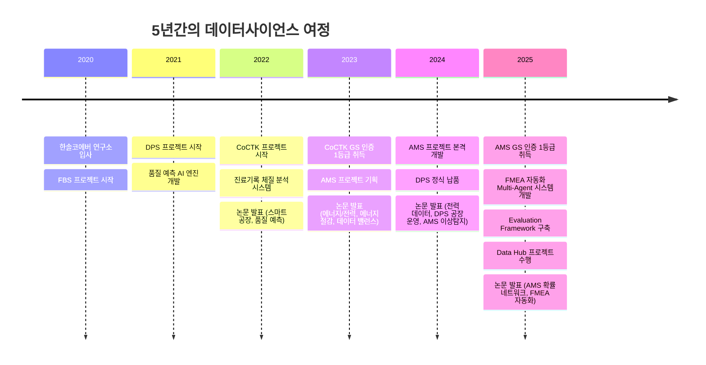
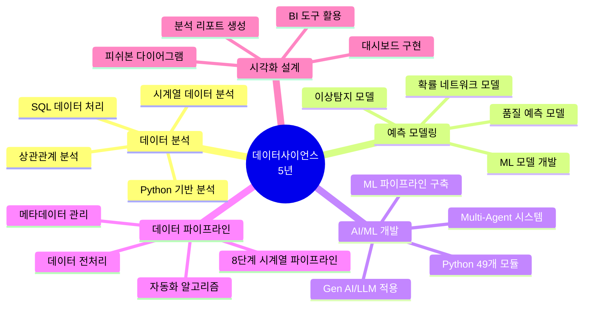
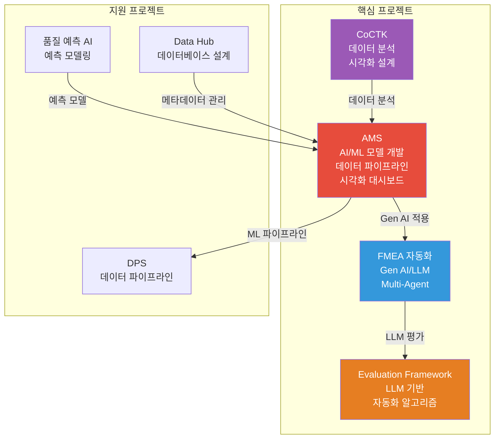
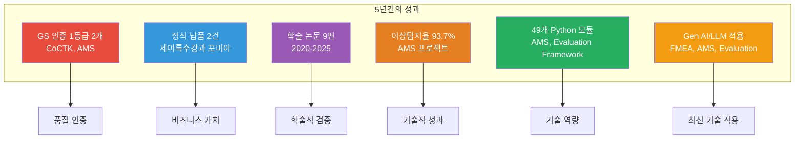

# 권순룡 이력서

## 기본 정보

**이름**: 권순룡  
**현 소속**: 한솔코에버 연구소 대리 (2020.09 ~ 재직중)  
**총 경력**: 5년 (2020~2025)  
**핵심 역량**: 데이터 분석, 예측 모델링, AI/ML 모델 개발, 데이터 파이프라인 설계, Gen AI/LLM 실무 적용

---

## 한눈에 보는 경력 (2020-2025)

---

## 지원 동기

YG엔터테인먼트 데이터사이언스팀의 "사내 비즈니스 데이터와 팬덤 플랫폼 데이터 분석을 통한 인사이트 제공"이라는 목표에 깊이 공감합니다. 5년간 제조 산업에서 데이터 분석 및 예측 모델링을 통해 실질적인 비즈니스 가치를 창출해온 경험이, 엔터테인먼트 산업의 데이터 기반 의사결정에도 기여할 수 있다고 확신합니다.

특히 AMS 프로젝트에서 49개 Python 모듈로 구성된 ML 파이프라인을 구축하여 이상탐지율 93.7%를 달성하고, FMEA 자동화 프로젝트에서 LLM 기반 Multi-Agent 시스템을 개발한 경험은 YG 데이터사이언스팀이 추구하는 "예측 모델 및 업무 자동화 파이프라인을 통한 실질적인 업무 효율화"와 정확히 일치합니다. 다양한 부서와의 협업 경험과 논리적 사고를 바탕으로 한 구조화된 문서 작성 능력을 바탕으로, YG 데이터사이언스팀의 목표 달성에 기여하고 싶습니다.

---

## 핵심 역량 맵

---

## 핵심 역량

### 데이터 사이언스 및 머신러닝 프로젝트 리딩

5년간 AI 기반 제조 솔루션 개발에서 총괄 PM으로 다수의 프로젝트를 리딩했습니다. AMS 프로젝트에서는 AI 종합 플랫폼 개발을 총괄하여 49개 Python 모듈로 구성된 ML 파이프라인을 구축했으며, 이상탐지율 93.7%를 달성하고 GS 인증 1등급을 취득했습니다. CoCTK 프로젝트에서는 엔진 총괄 설계 및 화면설계 개발을 총괄하여 GS 인증 1등급을 취득했습니다. 각 프로젝트에서 데이터 사이언스와 머신러닝의 전 과정을 기획부터 개발, 검증, 납품까지 총괄한 경험이 있습니다.

### SQL 및 Python 기반 데이터 분석 및 모델링

Python을 활용하여 49개 모듈을 개발했으며, 확률 최적화(경사하강법) 기반 이상탐지 모델을 구현했습니다. SQL은 PostgreSQL, Neo4j Cypher, MSSQL 등 다양한 데이터베이스에서 활용했으며, Data Hub 프로젝트에서는 PostgreSQL RDB를 설계하여 메타데이터 관리 시스템을 구축했습니다. 시계열 데이터 분석, 상관관계 분석, 비용 최적화 등 다양한 데이터 분석 기법을 적용하여 인사이트를 도출했습니다.

### BI 도구 사용 경험 및 시각화 설계 역량

AMS 프로젝트에서 피쉬본 다이어그램 자동생성 기능을 개발하여 시각화 대시보드를 구현했습니다. CoCTK 프로젝트에서는 화면설계 개발을 총괄하여 데이터 시각화를 구현했습니다. 데이터 분석 결과를 시각적으로 표현하여 이해하기 쉽게 전달하는 역량을 보유하고 있습니다.

### 데이터 파이프라인 및 자동화 알고리즘 설계

AMS 프로젝트에서 8단계 시계열 데이터 파이프라인을 구축했으며, 데이터 전처리부터 모델 학습, 예측, 결과 시각화까지 전 과정을 자동화했습니다. Evaluation Framework 프로젝트에서는 FastAPI와 LangGraph로 49개 Python 모듈과 298개 문서를 전수 검사하는 평가 엔진을 구축하여 자동화 알고리즘을 설계했습니다. DPS 프로젝트에서는 5층 아키텍처와 Microservices 기반 데이터 파이프라인을 구축했습니다.

### Gen AI 및 LLM 기반 실무 적용

FMEA 자동화 프로젝트에서 LLM 기반 Multi-Agent 시스템을 개발하여 8개 독립 Sub-Agent가 협업하는 구조를 구축했습니다. AMS 프로젝트에서는 LLM agent (GPT OSS)를 개발하여 결과 표시 기능을 구현했습니다. Evaluation Framework에서는 LangGraph를 활용하여 AI 프롬프트 평가 시스템을 구축했습니다. Gen AI와 LLM을 실무에 적용하여 업무 효율화를 실현한 경험이 있습니다.

---

## 프로젝트 관계도

---

## 경력 개요

### 한솔코에버 연구소 (2020.09 ~ 재직중)

**직급**: 대리  
**주요 업무**:
- AI 기반 제조 솔루션 개발 및 프로젝트 관리
- 데이터 분석 및 예측 모델링
- 데이터 파이프라인 설계 및 구축
- AI/ML 모델 개발 및 최적화

**성과**:
- GS 인증 1등급 2개 취득 (CoCTK, AMS)
- 세아특수강과 포미아에 정식 납품
- 학술 논문 9편 발표
- 특허 출원/등록

---

## 주요 프로젝트 경험

### 1. DPS (데이터수집시스템) - PM

**기간**: 2021-2024  
**역할**: 핵심 아키텍처 설계 및 개발 PM

**핵심 성과**:
- ✅ **데이터 파이프라인 구축**: 5층 아키텍처, Microservices 기반 데이터 파이프라인 구축
- ✅ **Python 백엔드 개발**: Python 기반 백엔드 개발
- ✅ **데이터베이스 활용**: Neo4j 그래프DB 활용
- ✅ **정식 납품**: 세아특수강과 포미아에 정식 납품
- ✅ **학술 연구**: 2024 논문 발표

### 2. AMS (Analysis Management System) - 총괄 PM

**기간**: 2024.7-2025.3  
**발주처**: 한국산업기술진흥원  
**역할**: AI 종합 플랫폼 개발 총괄 PM

**핵심 성과**:
- ✅ **AI/ML 모델 개발**: 49개 Python 모듈로 구성된 ML 파이프라인 구축, 확률 최적화(경사하강법) 기반 이상탐지 모델 개발, 이상탐지율 93.7% 달성
- ✅ **데이터 파이프라인 구축**: 8단계 시계열 데이터 파이프라인 설계 및 구축, 데이터 전처리부터 모델 학습, 예측, 결과 시각화까지 전 과정 자동화
- ✅ **시각화 대시보드 구현**: 피쉬본 다이어그램 자동생성 기능 개발, 데이터 분석 결과를 시각적으로 표현하는 대시보드 구현
- ✅ **Gen AI/LLM 실무 적용**: LLM agent (GPT OSS) 개발하여 결과 표시 기능 구현, Gen AI 기술을 실무에 적용
- ✅ **품질 인증 및 납품**: GS 인증 1등급 취득 (PDS 명칭), 세아특수강과 포미아에 정식 납품
- ✅ **학술 연구**: 학술 논문 2건 발표 (2024.12, 2025.06)

### 3. Data Hub - 개발자

**기간**: 2025.6-12  
**발주처**: 내부 개발  
**역할**: 메타데이터 관리 시스템 개발

**핵심 성과**:
- ✅ **데이터베이스 설계**: PostgreSQL RDB 설계 및 개발
- ✅ **메타데이터 관리**: 메타데이터 관리 시스템 구축
- ✅ **데이터 통합**: 다양한 외부 데이터베이스와의 연결 관리

### 4. Evaluation Framework - 개발자

**기간**: 2025.10-  
**발주처**: 내부 개발  
**역할**: 평가 엔진 개발

**핵심 성과**:
- ✅ **Gen AI/LLM 실무 적용**: LangGraph 기반 평가 엔진 구축, AI 프롬프트 평가 시스템 개발
- ✅ **자동화 알고리즘 설계**: 49개 Python 모듈과 298개 문서를 전수 검사하는 평가 엔진 구축
- ✅ **Python 기반 개발**: FastAPI와 LangGraph로 49개 Python 모듈 개발

### 5. FMEA 자동화 - Multi-Agent 시스템 - 개발자

**기간**: 2025-  
**발주처**: 내부 개발  
**역할**: LLM 기반 Multi-Agent 시스템 개발

**핵심 성과**:
- ✅ **Gen AI/LLM 실무 적용**: LLM 기반 Multi-Agent 시스템 개발, Claude Sub-Agent 기반 Workflow 구축
- ✅ **Multi-Agent 구조 설계**: 8개 독립 Sub-Agent가 협업하는 구조 구축, Claude Code Task tool 기반 Master Orchestrator 설계
- ✅ **자동화 알고리즘**: 프롬프트 기반 완전 자동화 구현, FMEA 자동 생성 시스템 개발
- ✅ **학술 연구**: 2025.12 논문 발표 (FMEA 자동 생성 연구)

### 6. CoCTK (Consulting Tool Kit) - 총괄 PM

**기간**: 2022.3-2024  
**발주처**: 중소기업기술정보진흥원  
**역할**: 엔진 총괄 설계 & 화면설계 개발 총괄 PM

**핵심 성과**:
- ✅ **데이터 분석 및 인사이트 도출**: 데이터 전처리, 상관관계 분석, 비용 최적화를 통한 인사이트 도출
- ✅ **시각화 설계 역량**: 화면설계 개발 총괄, 데이터 시각화 구현
- ✅ **데이터 전처리 경험**: 데이터 전처리 엔진 개발, 분석 리포트 생성
- ✅ **품질 인증**: GS 인증 1등급 취득 (2024)
- ✅ **학술 연구**: 2023 논문 발표

### 7. 품질 예측 AI 엔진 - 개발자

**기간**: 2021-2023  
**발주처**: 정보통신산업진흥원  
**역할**: 품질 예측 모델 개발

**핵심 성과**:
- ✅ **예측 모델링 경험**: 사출/도정/금형 공정 품질 예측 모델 개발, 다수 업체 품질 예측 AI 엔진 개발 및 고도화
- ✅ **프로젝트 리딩**: 다수 업체 프로젝트 리딩 경험
- ✅ **비즈니스 가치 창출**: 불량률 감소 성과
- ✅ **학술 연구**: 2022 논문 발표

---

## 기술 스택

### Programming Languages
- **Python**: 5년 (49개 모듈 개발, ML/DL, 데이터 분석, FastAPI, LangGraph)
- **SQL**: 5년 (PostgreSQL, Neo4j Cypher, MSSQL, 데이터베이스 설계)

### Databases
- **PostgreSQL**: RDB 설계 및 개발 (Data Hub 프로젝트)
- **Neo4j**: 그래프DB 활용 (DPS, AMS 프로젝트)
- **MSSQL**: 데이터 분석 및 처리

### Frameworks & Tools
- **FastAPI**: RESTful API 개발 (Evaluation Framework)
- **LangGraph**: LLM 기반 워크플로우 구축 (Evaluation Framework)
- **Docker**: 컨테이너 기반 마이크로서비스 아키텍처 (DPS)
- **Kubernetes**: 오케스트레이션 (DPS)

### AI/ML Technologies
- **Machine Learning**: ML 모델 개발, 예측 모델링, 이상탐지
- **Deep Learning**: 딥러닝 모델 개발
- **Gen AI/LLM**: LLM agent 개발, Multi-Agent 시스템, Claude Sub-Agent

### Data Analysis & Visualization
- **데이터 분석**: 시계열 분석, 상관관계 분석, 확률 네트워크 분석
- **시각화**: 피쉬본 다이어그램, 대시보드 구현, BI 도구 활용

---

## 성과 대시보드

---

## 학력

**홍익대학교 전자공학과** (2013.03 ~ 2020.02)
- 학점: 3.11 / 4.5
- 졸업논문: LD 동격회로 설계 및 PLL 설계
- 주요 수강 분야: 회로 설계, 전파공학, 컴퓨터공학

---

## 자격증

**OPIc** (2019.03)
- ACT FL (American Council on the Teaching of Foreign Languages)

---

## 핵심 철학

> **"모델보다 데이터, 데이터보다 정보, 지식구조를 정리하는 현장친화적 연구원"**

5년간 제조 산업에서 데이터를 정보로 전환하고, 정보를 지식 구조로 체계화하는 전문성을 갖추었습니다. 단순한 모델 개발을 넘어, 현장의 실제 문제를 해결하고 데이터 기반 의사결정을 지원하는 데 집중합니다. YG엔터테인먼트 데이터사이언스팀에서도 이러한 철학을 바탕으로 엔터테인먼트 산업의 데이터 기반 의사결정에 기여하고 싶습니다.

---

© 2026 권순룡. All Rights Reserved.
