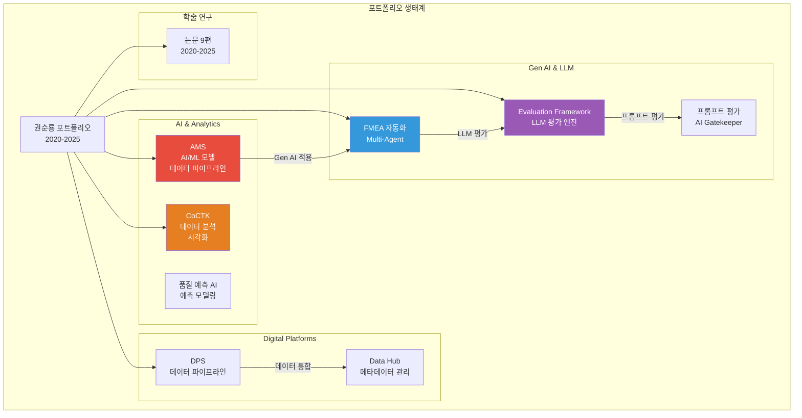
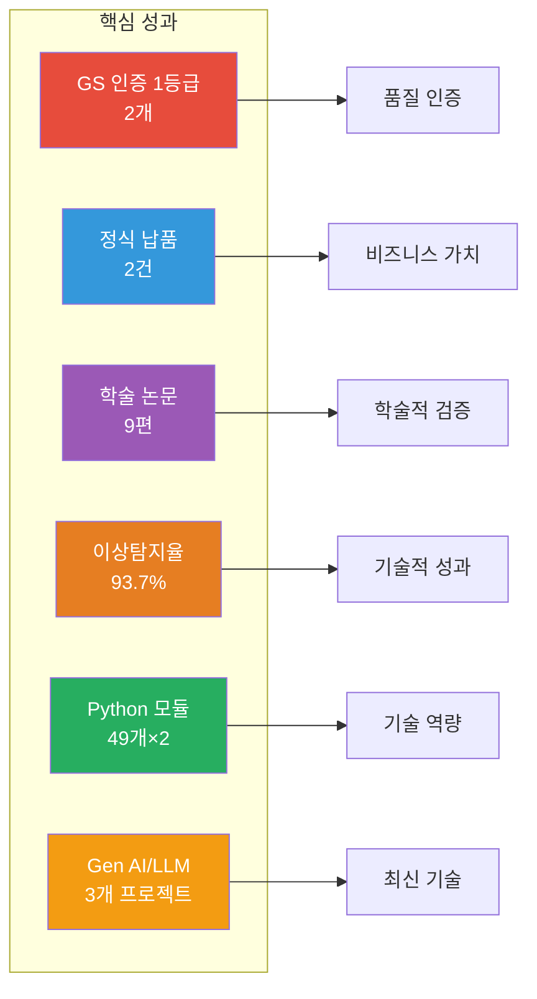
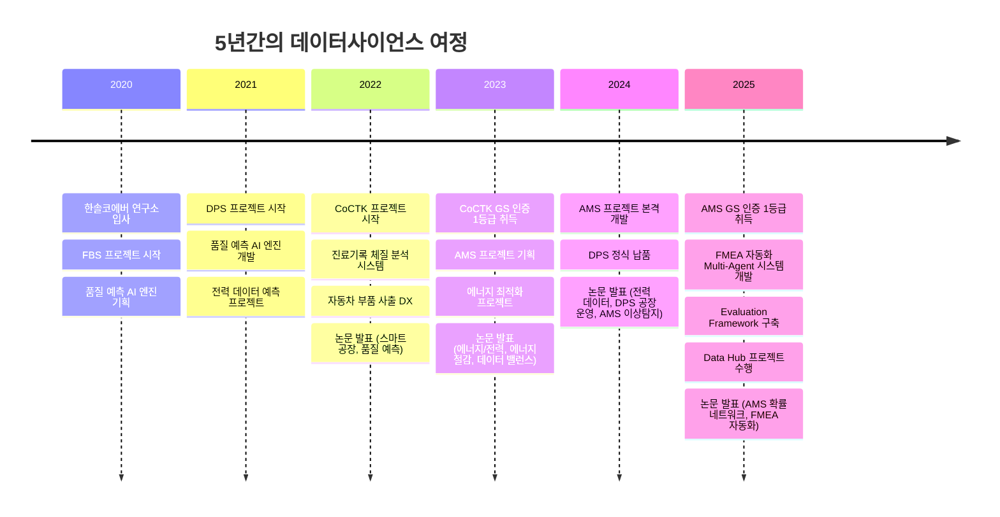
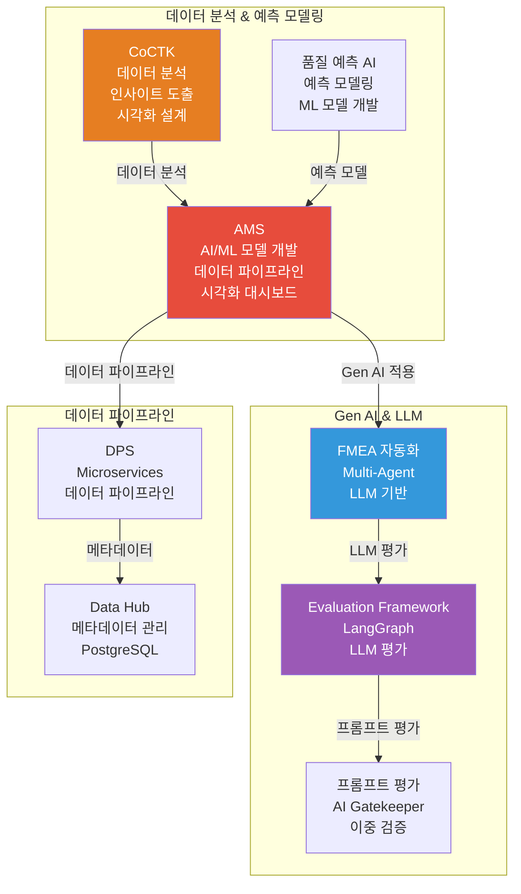
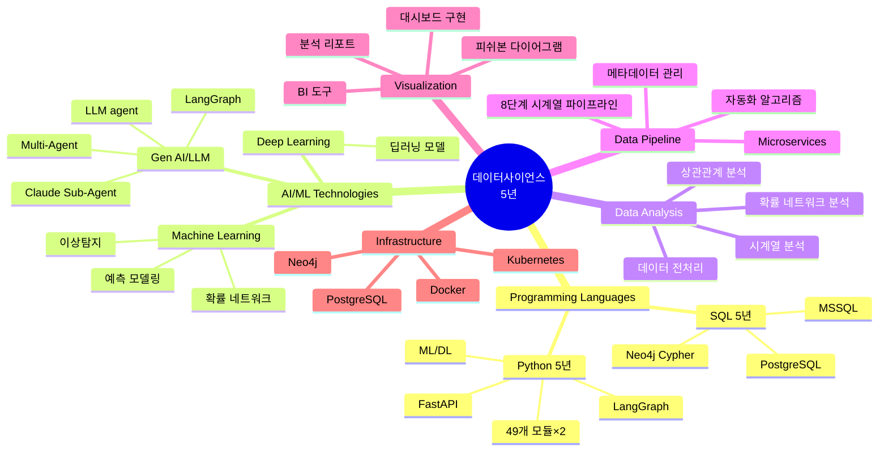

# 권순룡 포트폴리오

> **"모델보다 데이터, 데이터보다 정보, 지식구조를 정리하는 현장친화적 연구원"**

## 📌 기본 정보

**이름**: 권순룡  
**GitHub**: https://github.com/moobaek

---

## 📊 포트폴리오 구조 (한눈에 보기)

---

## 🎯 핵심 성과 대시보드

| 분류 | 지표 | 상세 |
|:---|---:|:---|
| **품질 인증** | GS 인증 1등급 2개 | CoCTK (2024), AMS (2025) |
| **비즈니스 가치** | 정식 납품 2건 | 세아특수강과 포미아 |
| **학술 연구** | 논문 9편 | 2020-2025, 한국생산제조학회, 한국유체기계학회 등 |
| **기술 성과** | 이상탐지율 93.7% | AMS 프로젝트, 확률 최적화 기반 |
| **기술 역량** | Python 모듈 98개 | AMS 49개, Evaluation Framework 49개 |
| **최신 기술** | Gen AI/LLM 프로젝트 3개 | FMEA 자동화, Evaluation Framework, AMS LLM agent |

---

## 📅 경력 타임라인 (2020-2025)

---

## 🏆 주요 프로젝트 (20개+)

### 프로젝트 관계도

### 1. DPS (데이터수집시스템) - PM

**기간**: 2021-2024  
**역할**: 핵심 아키텍처 설계 및 개발 PM

**핵심 성과**:
- ✅ **데이터 파이프라인 구축**: 5층 아키텍처, Microservices 기반 데이터 파이프라인 구축
- ✅ **Python 백엔드 개발**: Python 기반 백엔드 개발
- ✅ **데이터베이스 활용**: Neo4j 그래프DB 활용
- ✅ **정식 납품**: 세아특수강과 포미아에 정식 납품
- ✅ **학술 연구**: 2024 논문 발표

**기술 스택**: Python, SQL, Neo4j, Docker, Kubernetes

### 2. AMS (Analysis Management System) - 총괄 PM

**기간**: 2024.7-2025.3  
**역할**: AI 종합 플랫폼 개발 총괄 PM

**핵심 성과**:
- ✅ **AI/ML 모델 개발**: 49개 Python 모듈로 구성된 ML 파이프라인 구축, 확률 최적화(경사하강법) 기반 이상탐지 모델 개발, 이상탐지율 93.7% 달성
- ✅ **데이터 파이프라인 구축**: 8단계 시계열 데이터 파이프라인 설계 및 구축, 데이터 전처리부터 모델 학습, 예측, 결과 시각화까지 전 과정 자동화
- ✅ **시각화 대시보드 구현**: 피쉬본 다이어그램 자동생성 기능 개발, 데이터 분석 결과를 시각적으로 표현하는 대시보드 구현
- ✅ **Gen AI/LLM 실무 적용**: LLM agent (GPT OSS) 개발하여 결과 표시 기능 구현, Gen AI 기술을 실무에 적용
- ✅ **품질 인증 및 납품**: GS 인증 1등급 취득 (PDS 명칭), 세아특수강과 포미아에 정식 납품
- ✅ **학술 연구**: 학술 논문 2건 발표 (2024.12, 2025.06)

**기술 스택**: Python, SQL, Neo4j, PostgreSQL, ML/DL, LLM

### 3. Data Hub - 개발자

**기간**: 2025.6-2025.12  
**역할**: 메타데이터 관리 시스템 개발

**핵심 성과**:
- ✅ **데이터베이스 설계**: PostgreSQL RDB 설계 및 개발
- ✅ **메타데이터 관리**: 메타데이터 관리 시스템 구축
- ✅ **데이터 통합**: 다양한 외부 데이터베이스와의 연결 관리

**기술 스택**: PostgreSQL, SQL, Python

### 4. Evaluation Framework - 개발자

**기간**: 2025.10-2026.01
**역할**: 평가 엔진 개발

**핵심 성과**:
- ✅ **Gen AI/LLM 실무 적용**: LangGraph 기반 평가 엔진 구축, AI 프롬프트 평가 시스템 개발
- ✅ **자동화 알고리즘 설계**: 49개 Python 모듈과 298개 문서를 전수 검사하는 평가 엔진 구축
- ✅ **Python 기반 개발**: FastAPI와 LangGraph로 49개 Python 모듈 개발

**기술 스택**: Python, FastAPI, LangGraph, LLM

### 5. FMEA 자동화 - Multi-Agent 시스템 - 개발자

**기간**: 2025.06-2025.12
**역할**: LLM 기반 Multi-Agent 시스템 개발

**핵심 성과**:
- ✅ **Gen AI/LLM 실무 적용**: LLM 기반 Multi-Agent 시스템 개발, Claude Sub-Agent 기반 Workflow 구축
- ✅ **Multi-Agent 구조 설계**: 8개 독립 Sub-Agent가 협업하는 구조 구축, Claude Code Task tool 기반 Master Orchestrator 설계
- ✅ **자동화 알고리즘**: 프롬프트 기반 완전 자동화 구현, FMEA 자동 생성 시스템 개발
- ✅ **학술 연구**: 2025.12 논문 발표 (FMEA 자동 생성 연구)

**기술 스택**: Python, Claude Sub-Agent, Multi-Agent, LLM

### 6. CoCTK (Consulting Tool Kit) - 총괄 PM

**기간**: 2022.3-2024  
**역할**: 엔진 총괄 설계 & 화면설계 개발 총괄 PM

**핵심 성과**:
- ✅ **데이터 분석 및 인사이트 도출**: 데이터 전처리, 상관관계 분석, 비용 최적화를 통한 인사이트 도출
- ✅ **시각화 설계 역량**: 화면설계 개발 총괄, 데이터 시각화 구현
- ✅ **데이터 전처리 경험**: 데이터 전처리 엔진 개발, 분석 리포트 생성
- ✅ **품질 인증**: GS 인증 1등급 취득 (2024)
- ✅ **학술 연구**: 2023 논문 발표

**기술 스택**: Python, SQL, 데이터 분석, 시각화

### 7. 품질 예측 AI 엔진 - 개발자

**기간**: 2021-2023  
**역할**: 품질 예측 모델 개발

**핵심 성과**:
- ✅ **예측 모델링 경험**: 사출/도정/금형 공정 품질 예측 모델 개발, 다수 업체 품질 예측 AI 엔진 개발 및 고도화
- ✅ **프로젝트 리딩**: 다수 업체 프로젝트 리딩 경험
- ✅ **비즈니스 가치 창출**: 불량률 감소 성과
- ✅ **학술 연구**: 2022 논문 발표

**기술 스택**: Python, ML, 예측 모델링

---

## 💻 기술 스택 맵

---

## 📚 학술 성과

### 논문 목록 (2020-2025, 총 9편)

| 발행일 | 논문 제목 | 학술지/학회 | 핵심 성과 및 프로젝트 연계 |
|:---|:---|:---|:---|
| 2025.12 | **분석 상관/확률 네트워크 최적 경로 정보 및 공정 관리 문서 기반 FMEA 생성 연구** | KSFM 2025년도 동계학술대회 | [FMEA 자동화] 상관/확률 네트워크 최적 경로 분석 기반 FMEA 자동 생성 기술 검증, Multi-Agent 시스템 |
| 2025.06 | **AI를 활용한 구조와 룰을 활용한 구조-확률 종합 네트워크 및 최적 관리 방안 도출** | 한국유체기계학회 | [AMS] 피쉬본 AI 모델의 학술적 고도화 및 최적 관리 로직 증명 |
| 2024.12 | **공장 운영 핵심 요소의 식별 및 최적화를 위한 클러스터링 기법 적용** | 한국생산제조학회 | [DPS] 공장 운영 데이터의 다차원 분석 및 디지털 트윈 최적화 근거 |
| 2024.12 | **설비 이상상태 기반 최적 공정 데이터 추론 및 위험/안전 관리 최적 자동화** | 한국유체기계학회 | [AMS] 실시간 이상 상태 기반 위험 관리 알고리즘의 유효성 검증 |
| 2024.07 | **전력 데이터를 통한 설비 상태 추론 및 이상 상황 설정 예측** | 한국유체기계학회 | [에너지/센서] 전력 데이터 기반의 설비 예지 보전 기술 실증 |
| 2023.12 | **송풍 설비 변동부하 대응 전력품질 분석 및 에너지 절감 연구** | 한국유체기계학회 | [에너지 최적화] 에너지 20% 절감 실증 솔루션의 핵심 물리 분석 모델 |
| 2023.12 | **압축기 공정에서 데이터 밸런스 문제 해결 및 품질 결과 사전 예측을 위한 AI 시스템** | 한국유체기계학회 | [AI/데이터] 소량의 불량 데이터 극복을 위한 AI 학습 모델 연구 |
| 2023.07 | **생산공정 에너지 및 설비 상태 진단을 위한 AI기반의 전력 사용 패턴 및 SOH분석** | 한국유체기계학회 | [에너지/전력] 설비 건전성(SOH) 진단 및 에너지 효율화 융합 기술 |
| 2022.12 | **자동차 부품 생산 산업을 위한 머신러닝 기반의 품질예측 알고리즘** | 한국생산제조학회 | [AI/제조] 세아베스틸 등 자동차 부품 공정 품질 예측 모델의 기초 |

### 논문 간 기술 발전 관계

논문들은 기술 발전 흐름에 따라 5개 계열로 그룹화됩니다:

```mermaid
graph TB
    subgraph "1. 피쉬본/확률 네트워크 계열"
        FBS["FBS 기초<br/>2020"]
        AIFishbone["AI 피쉬본 클러스터링<br/>공장 운영 핵심 요소 식별<br/>2024.12"]
        AMSProb["AMS 확률 네트워크<br/>설비 이상상태 기반<br/>2024.12"]
        StructProb["구조-확률 종합 네트워크<br/>2025.06"]
        FMEAGen["FMEA 생성<br/>상관/확률 네트워크 최적 경로<br/>2025.12"]
        
        FBS -->|"피쉬본 자동화"| AIFishbone
        AIFishbone -->|"클러스터링 기법"| AMSProb
        AMSProb -->|"확률 네트워크 고도화"| StructProb
        StructProb -->|"최적 경로 분석"| FMEAGen
    end
    
    subgraph "2. 에너지 최적화 계열"
        PowerSOH["전력 패턴 SOH<br/>2023.07"]
        PowerData["전력 데이터<br/>2024.07"]
        EnergySave["에너지 절감<br/>2023.12"]
        
        PowerSOH -->|"건전성 진단"| PowerData
        PowerData -->|"설비 상태 추론"| EnergySave
    end
    
    subgraph "3. 데이터 분석 계열"
        QualityPred["품질 예측<br/>2022.12"]
        DataBalance["데이터 밸런스<br/>2023.12"]
        
        QualityPred -->|"불량 데이터 극복"| DataBalance
    end
    
    subgraph "4. 센서/설비 계열"
        PowerData2["전력 데이터<br/>2024.07"]
        EquipmentState["설비 상태 추론<br/>2024.07"]
        RiskMgmt["이상상태 위험 관리<br/>2024.12"]
        
        PowerData2 -->|"예지 보전"| EquipmentState
        EquipmentState -->|"자동화"| RiskMgmt
    end
    
    subgraph "5. 통합 플랫폼 계열"
        SmartFactory["스마트 공장<br/>2022.06"]
        DPS["DPS 공장 운영<br/>2024.12"]
        
        SmartFactory -->|"디지털 트윈"| DPS
    end
    
    style FMEAGen fill:#e74c3c,color:#fff
    style StructProb fill:#3498db,color:#fff
    style AMSProb fill:#9b59b6,color:#fff
    style AIFishbone fill:#e67e22,color:#fff
    style EnergySave fill:#27ae60,color:#fff
```

### 핵심 연구 분야

**1. 피쉬본/확률 네트워크 계열** (핵심 기술 발전)
- FBS (2020): 피쉬본 다이어그램 자동 생성 알고리즘의 기초
- AI 피쉬본 클러스터링 (2024.12): 공장 운영 핵심 요소 식별을 위한 클러스터링 기법 적용
- AMS 확률 네트워크 (2024.12): 설비 이상상태 기반 최적 공정 데이터 추론 및 위험/안전 관리 자동화
- 구조-확률 종합 네트워크 (2025.06): 구조와 룰을 활용한 종합 네트워크 및 최적 관리 방안 도출
- FMEA 생성 (2025.12): 상관/확률 네트워크 최적 경로 정보 및 공정 관리 문서 기반 FMEA 자동 생성

**2. 에너지 최적화 계열**
- 전력 사용 패턴 및 SOH 분석을 통한 설비 건전성 진단
- 전력 데이터 기반 설비 상태 추론 및 이상 상황 예측
- 송풍 설비 변동부하 대응을 통한 에너지 절감 실증 (20% 절감)

**3. 데이터 분석 계열**
- 머신러닝 기반 품질 예측 알고리즘 개발
- 소량의 불량 데이터 극복을 위한 데이터 밸런스 문제 해결

**4. 센서/설비 계열**
- 전력 데이터를 통한 설비 상태 추론 및 예지 보전 기술
- 실시간 이상 상태 기반 위험 관리 알고리즘 자동화

**5. 통합 플랫폼 계열**
- ICT 융복합 기술을 활용한 스마트 공장 구축
- 공장 운영 핵심 요소 식별 및 최적화를 위한 다차원 분석

### 연구 성과의 시사점

1. **기술적 신뢰도 확보**: 단순히 솔루션을 구축하는 것에 그치지 않고, 그 기저의 알고리즘과 방법론을 학술적으로 검증받았습니다.
2. **현장 밀착형 연구**: 모든 연구는 실제 제조 현장의 데이터(전력, 진동, 공정 로그 등)를 기반으로 수행되어 즉각적인 산업 적용이 가능합니다.
3. **지속적인 혁신**: 2022년부터 2025년까지 매년 2~3편의 논문을 꾸준히 발표하며 최신 AI 트렌드를 제조 산업에 이식하고 있습니다.

---

## 🤖 LLM 활용 방법

### Agent/MCP/RAG 시스템

#### 1. FMEA 자동화 Multi-Agent 시스템

**구조**: 8개 독립 Sub-Agent가 협업하는 Multi-Agent Workflow

**핵심 기술**:
- Claude Code Task tool 기반 Master Orchestrator 설계
- 각 Sub-Agent가 전문 영역(R&D, Mfg, QA)을 담당하는 구조
- 프롬프트 기반 완전 자동화로 개발 복잡성 감소
- Python 스크립트 없이 Claude Code 세션 자체가 Orchestrator 역할

**성과**:
- FMEA 자동 생성 시스템 구축
- AIAG & VDA FMEA 표준 기반 범용 리스크 분석 시스템
- Phase 0~5 자동화 워크플로우 구현
- 2025.12 논문 발표

#### 2. Evaluation Framework (LLM 평가 엔진)

**구조**: LangGraph 기반 평가 엔진

**핵심 기술**:
- FastAPI와 LangGraph로 49개 Python 모듈 개발
- 298개 문서를 전수 검사하는 평가 엔진 구축
- System-Wide Quality Assurance Layer 역할
- 6가지 관점 평가 수행

**성과**:
- 전체 아키텍처의 건전성을 책임지는 평가 시스템
- AI 프롬프트 평가 시스템 구축

#### 3. 프롬프트 평가 엔진 (AI Gatekeeper)

**구조**: 구조화된 평가 프레임워크, 역할 기반 가중치, Human-in-the-Loop

**핵심 기술**:
- AI 생성 프롬프트를 다른 AI가 평가하는 이중 검증(Double-Check) 시스템
- 생성 AI와 평가 AI의 분리로 환각(Hallucination) 방지
- 5단계 평가 프로세스 및 배치 처리 지원

**성과**:
- 25개+ 프롬프트의 품질을 승인/반려하는 권한
- 모든 AI 생성물의 '입구'를 통제하는 심사관 역할

#### 4. AMS LLM Agent

**구조**: GPT OSS 기반 LLM agent

**핵심 기술**:
- AMS 결과 표시 기능에 LLM agent 적용
- Gen AI 기술을 실무에 적용

**성과**:
- Gen AI/LLM 실무 적용 경험 축적
- 실무 환경에서 LLM 활용 방법 검증

### 기술적 의의

**1. Multi-Agent Architecture의 실제 적용**
- 복잡한 FMEA 프로세스를 역으로 분석하여 8개 Sub-Agent로 분해
- 각 Sub-Agent가 전문 영역을 담당하는 구조
- Claude Code Task tool 기반 Master Orchestrator 설계

**2. 프롬프트 평가 시스템의 혁신**
- AI가 생성한 프롬프트를 다른 AI가 평가하는 이중 검증 구조
- 생성 AI와 평가 AI의 분리로 환각 방지
- 5단계 평가 프로세스 및 배치 처리 지원

**3. 실무 적용 가능성**
- Python 스크립트 없이 Claude Code 세션 자체가 Orchestrator 역할
- 프롬프트 기반 완전 자동화로 개발 복잡성 감소
- Task tool 기반 구현으로 유연한 워크플로우 조정 가능

---

## 🔗 관련 링크

- **메인 레포지토리**: https://github.com/moobaek/Testing_AI_agents_for_public_use
- **포트폴리오 문서**: https://github.com/moobaek/Testing_AI_agents_for_public_use/tree/main/portfolio/portfolio_docs
- **GitHub 프로필**: https://github.com/moobaek

---

© 2026 권순룡. All Rights Reserved.
