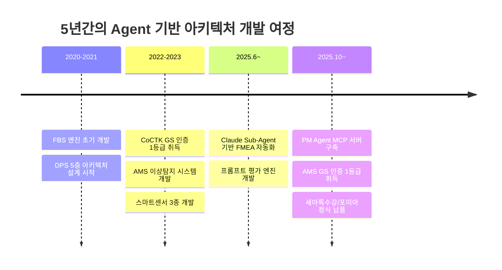
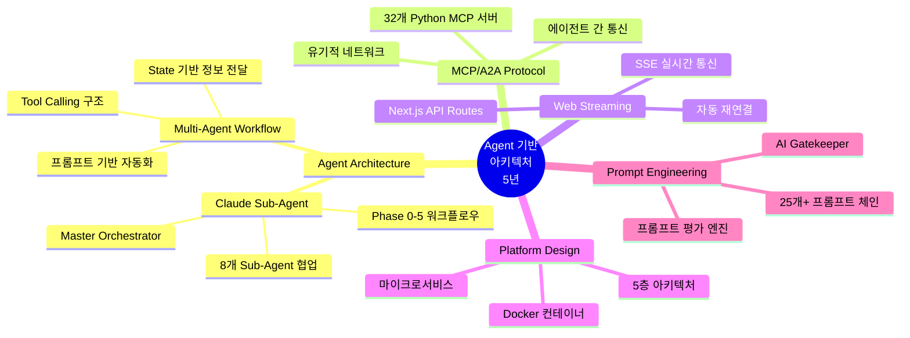
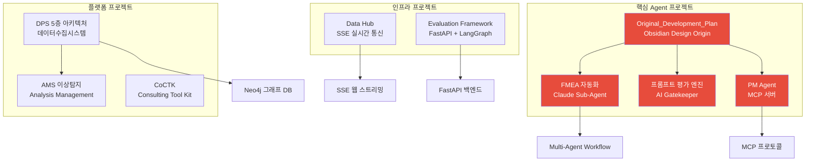
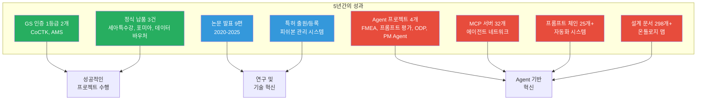

# 권순룡 이력서

## 기본 정보

**이름**: 권순룡  
**현 소속**: 한솔코에버 연구소 대리 (2020.09 ~ 재직중)  
**총 경력**: 5년 (2020~2025)  
**핵심 역량**: Agent 기반 아키텍처 설계, MCP/A2A 프로토콜 개발, Multi-Agent Workflow, 웹 스트리밍 서비스

**GitHub**: https://github.com/moobaek  
**포트폴리오**: https://github.com/moobaek/Testing_AI_agents_for_public_use/tree/main/portfolio/portfolio_docs

---

## 한눈에 보는 경력 (2020-2025)

---

## 지원 동기

카카오의 Agent Builder 플랫폼이 카나나 인 카카오톡, 카나나 인 카카오맵, AI메이트*쇼핑 등 카카오의 새로운 AI 서비스를 만들어가는 핵심 인프라라는 점에 깊은 관심을 갖게 되었습니다. 특히 A2A 기반 내·외부 에이전트 연동을 통한 유기적인 에이전트 네트워크 구축은 제가 5년간 추구해온 "지식 구조를 정리하는 현장친화적 연구원"의 철학과 정확히 일치합니다.

제가 개발한 Claude Sub-Agent 기반 FMEA 자동화 시스템은 8개 독립 Sub-Agent가 협업하는 Multi-Agent Workflow를 구현했으며, 32개 Python MCP 서버를 개발하여 에이전트 간 통신을 실현했습니다. 또한 Original_Development_Plan 프로젝트에서 ID 기반 온톨로지 맵으로 No-Code 에이전트 생성 플랫폼을 설계한 경험이 카카오 Agent Builder의 철학과 유사합니다.

카카오의 "서로의 아이디어를 존중하고, 자유롭게 토론하며 함께 성장하는 문화"와 "레거시 없이 최신 기술 트렌드를 반영하며 더 나은 방향을 고민하는 문화"에 공감하며, 빠르게 변화하는 AI 기술을 선도하며 카카오 AI 서비스의 미래를 함께 만들어가고 싶습니다.

---

## 핵심 역량 맵

---

## 핵심 역량

### 1. Agent 기반 아키텍처 설계 및 개발

5년간 Agent 기반 아키텍처를 설계하고 개발한 경험이 있습니다. Claude Sub-Agent 기반 FMEA 자동화 생성 시스템에서는 8개 독립 Sub-Agent가 협업하는 Multi-Agent Workflow를 구현했으며, Claude Code Task tool을 활용한 Master Orchestrator를 설계했습니다. Python 스크립트 없이 프롬프트 기반 완전 자동화를 실현하여 개발 복잡성을 크게 감소시켰습니다.

**주요 성과**:
- **FMEA 자동화 생성 시스템**: 8개 Sub-Agent 협업 구조 (R&D 3개, Mfg 3개, QA 2개)
- **프롬프트 평가 엔진**: AI가 생성한 프롬프트를 다른 AI가 평가하는 이중 검증 시스템
- **Original_Development_Plan**: 298개+ 설계 문서, 25개+ AI 프롬프트 체인, Phase 0-13 워크플로우

### 2. MCP/A2A 프로토콜 활용 경험

MCP (Model Context Protocol) 기반 기술 자산 관리 시스템을 설계하고, 32개 Python MCP 서버를 개발했습니다. PM Agent 프로젝트에서는 MCP 서버를 Docker 컨테이너로 구축하여 비정형 문서(HWP, DOCX, XLSX)를 자동 파싱하는 시스템을 구현했습니다. A2A 프로토콜을 통한 에이전트 간 통신을 실현하여 유기적인 에이전트 네트워크를 구축했습니다.

**주요 성과**:
- **32개 Python MCP 서버 개발**: 각 서버별 전문 기능 구현
- **PM Agent MCP 서버**: Docker 기반 파서 서버 구축
- **에이전트 간 통신**: MCP 프로토콜을 통한 데이터 교환

### 3. 웹 스트리밍 서비스 아키텍처 설계 및 개발

Data Hub 프로젝트에서 SSE (Server-Sent Events) 기반 실시간 통신을 구현했습니다. Next.js API Routes를 활용하여 `/api/realtime/sse` 엔드포인트를 구현했으며, 자동 재연결 및 주기적 핑 메시지를 통한 안정적인 실시간 통신을 실현했습니다.

**주요 성과**:
- **SSE 기반 실시간 데이터 전송**: Server-Sent Events를 사용한 실시간 통신
- **자동 재연결**: 연결이 끊어지면 브라우저가 자동으로 재연결
- **주기적 핑**: 30초마다 연결 유지 메시지 전송

### 4. 플랫폼 아키텍처 설계

DPS (데이터수집시스템) 프로젝트에서 5층 아키텍처를 설계하고 개발했습니다. 서비스/온톨로지/AI엔진/데이터수집/보안관리 레이어로 구성된 모듈화 구조로, Docker 컨테이너 기반 마이크로서비스 아키텍처를 구축했습니다. 서버-엣지 하이브리드 인프라를 지원하여 금속산업 5대 공정의 이질적인 데이터 소스를 통합했습니다.

**주요 성과**:
- **5층 아키텍처 설계**: 모듈화 구조로 확장성과 유지보수성 확보
- **Docker 마이크로서비스**: 컨테이너 기반 서버-엣지 하이브리드 인프라
- **Neo4j 그래프 DB**: 지식 그래프 플랫폼 구축

---

## 프로젝트 관계도

---

## 경력 개요

### 한솔코에버 연구소 (2020.09 ~ 재직중)

**직급**: 대리  
**주요 업무**:
- AI & Analytics 솔루션 개발 및 PM 수행
- Digital Transformation Platform 아키텍처 설계
- Agent 기반 자동화 시스템 개발
- 프로젝트 총괄 관리 및 기술 리딩

**성과**:
- **GS 인증 1등급 2개**: CoCTK, AMS (PDS 명칭으로 인증)
- **납품 실적**: 세아특수강, 포미아 정식 납품
- **논문 발표**: 9편 (2020-2025)
- **특허 출원/등록**: 피쉬본 관리 시스템 등

---

## 주요 프로젝트 경험

### 1. FMEA 자동화 생성 시스템 (Claude Sub-Agent) - Master Orchestrator 설계

**기간**: 2024~2025  
**발주처**: 내부 개발  
**역할**: Master Orchestrator 설계 및 개발

**핵심 성과**:
- ✅ **8개 독립 Sub-Agent 협업 구조**: R&D Team 3개, Manufacturing Team 3개, QA Team 2개로 구성된 전문 영역별 Sub-Agent 설계
- ✅ **Claude Code Task tool 기반 Master Orchestrator**: Python 스크립트 없이 프롬프트 기반 완전 자동화 구현
- ✅ **Phase 0~5 자동화 워크플로우**: 컨텍스트 수집 → 범위 정의 → 심층 분석 → 리스크 평가 → 최적화 & 문서 생성 → 지속 개선
- ✅ **Tool Calling 구조**: Claude Code Task tool을 활용한 Tool Calling 구현으로 개발 복잡성 감소

**기술 스택**: Claude Code, Python, 프롬프트 엔지니어링

---

### 2. 프롬프트 평가 엔진 (AI Gatekeeper) - 이중 검증 시스템 설계

**기간**: 2024~2025  
**발주처**: 내부 개발  
**역할**: AI Gatekeeper 설계 및 개발

**핵심 성과**:
- ✅ **프롬프트 저지(Prompt Judging) 시스템**: AI가 생성한 프롬프트를 다른 AI가 평가하는 이중 검증 구조 설계
- ✅ **생성 AI와 평가 AI의 분리**: 환각(Hallucination) 방지를 위한 구조적 분리
- ✅ **5단계 평가 프로세스**: Role Inference → Metrics → Consolidation → Report → Translation
- ✅ **25개+ 프롬프트 품질 보장**: 모든 AI 생성물의 '입구'를 통제하는 심사관 역할

**기술 스택**: Claude API, 프롬프트 엔지니어링, 평가 프레임워크

---

### 3. Original_Development_Plan (Obsidian Design Origin) - 전체 에이전트 시스템 설계

**기간**: 2020~2025 (집중 개발: 2025.5~7, 2025.8~10, 2025.10~12)  
**발주처**: 내부 개발  
**역할**: 전체 에이전트 시스템 설계 (PM 활동에서 문서, 개발 진행 관리에 활용)

**핵심 성과**:
- ✅ **코드 에이전트 + 문서 확인 + 프롬프트 보완 통합**: 전체 에이전트 시스템 설계
- ✅ **298개+ 설계 문서**: ID 기반 온톨로지 맵 문서 시스템 구축
- ✅ **25개+ AI 프롬프트 체인**: 21개 development 프롬프트 (수정 관리 시스템 포함)
- ✅ **Phase 0-13 워크플로우**: 단계별 프로세스 자동화로 No-Code 에이전트 생성 플랫폼 설계
- ✅ **State 기반 정보 전달**: 컨텍스트 최적화를 통한 효율적인 에이전트 실행

**기술 스택**: Obsidian, ID 시스템, 온톨로지 맵, 프롬프트 체인

---

### 4. PM Agent (Business Management Sub-Agent) - MCP 서버 구축

**기간**: 2024~2025  
**발주처**: 내부 개발  
**역할**: MCP 서버 설계 및 개발

**핵심 성과**:
- ✅ **32개 Python MCP 서버 개발**: 각 서버별 전문 기능 구현
- ✅ **Docker 기반 파서 서버**: MCP 서버를 Docker 컨테이너로 구축
- ✅ **비정형 문서 자동 분석**: HWP, DOCX, XLSX 파싱을 통한 계약서, 회의록, 과업지시서 자동 분석
- ✅ **에이전트 간 통신**: MCP 프로토콜을 통한 데이터 교환으로 유기적인 에이전트 네트워크 구축

**기술 스택**: Python, MCP (Model Context Protocol), Docker, HWP/DOCX/XLSX 파서

---

### 5. DPS (데이터수집시스템) - 5층 아키텍처 설계 및 개발

**기간**: 2021~2024  
**발주처**: 한국산업기술진흥원  
**역할**: 핵심 아키텍처 설계 및 개발 (PM 수행)

**핵심 성과**:
- ✅ **5층 아키텍처 설계**: 서비스/온톨로지/AI엔진/데이터수집/보안관리 레이어로 구성된 모듈화 구조
- ✅ **Docker 컨테이너 기반 마이크로서비스**: 서버-엣지 하이브리드 인프라 구축
- ✅ **Neo4j 그래프 DB 기반 지식 그래프 플랫폼**: 금속산업 5대 공정의 이질적인 데이터 소스 통합
- ✅ **정식 납품**: 세아특수강, 포미아에 정식 납품 완료
- ✅ **논문 발표**: 2024년 학술 논문 발표

**기술 스택**: Python, FastAPI, Neo4j, Docker, 마이크로서비스 아키텍처

---

### 6. Data Hub - SSE 기반 실시간 통신 구현

**기간**: 2024~2025  
**발주처**: 내부 개발  
**역할**: 실시간 통신 아키텍처 설계 및 개발

**핵심 성과**:
- ✅ **SSE 기반 실시간 데이터 전송**: Server-Sent Events를 사용한 실시간 통신 구현
- ✅ **Next.js API Routes**: `/api/realtime/sse` 엔드포인트 구현
- ✅ **자동 재연결**: 연결이 끊어지면 브라우저가 자동으로 재연결하는 안정적인 구조
- ✅ **주기적 핑**: 30초마다 연결 유지 메시지 전송으로 실시간 통신 안정성 확보

**기술 스택**: Next.js 16, TypeScript, SSE (Server-Sent Events), ReadableStream

---

### 7. AMS (Analysis Management System) - AI 종합 플랫폼 개발 총괄 PM

**기간**: 2024.07~2025.03  
**발주처**: 한국산업기술진흥원  
**역할**: AI 종합 플랫폼 개발 총괄 PM

**핵심 성과**:
- ✅ **GS 인증 1등급 취득**: PDS 명칭으로 소프트웨어 품질 인증 1등급
- ✅ **이상탐지율 93.7%**: 실질적 정확도 60~70% (데이터 한계 고려)
- ✅ **정식 납품**: 세아특수강, 포미아에 정식 납품 완료
- ✅ **특허 등록**: 피쉬본 관리 시스템 특허 등록
- ✅ **논문 발표**: 2025년, 2024년 학술 논문 발표

**기술 스택**: Python, 베이지안 네트워크, 피쉬본 다이어그램, FMEA 자동화

---

### 8. Evaluation Framework - System-Wide Quality Assurance Layer

**기간**: 2024~2025  
**발주처**: 내부 개발  
**역할**: 평가 엔진 설계 및 개발

**핵심 성과**:
- ✅ **49개 Python 모듈과 298개 문서 전체 전수 검사**: 거대 평가 엔진 구축
- ✅ **6가지 관점 평가 수행**: 품질, 일관성, 완전성 등 다각도 평가
- ✅ **FastAPI 기반 평가 엔진**: RESTful API 제공
- ✅ **LangGraph 워크플로우 오케스트레이션**: 평가 프로세스 자동화

**기술 스택**: Python, FastAPI, LangGraph, React, Docker

---

## 기술 스택

### Programming Languages
- **Python**: 5년 (데이터 분석, ML/DL, FastAPI 백엔드, MCP 서버 개발)
- **TypeScript/JavaScript**: 3년 (Next.js 프론트엔드, React 개발)
- **SQL**: 5년 (PostgreSQL, MySQL, SQL Server, Oracle 등 다양한 RDB 활용)

### Agent & AI Technologies
- **Claude API**: Claude Sub-Agent, Multi-Agent Workflow, Tool Calling
- **프롬프트 엔지니어링**: 25개+ 프롬프트 체인, 프롬프트 평가 엔진
- **MCP (Model Context Protocol)**: 32개 Python MCP 서버 개발
- **A2A 프로토콜**: 에이전트 간 통신, 유기적 네트워크 구축

### Web & Backend
- **FastAPI**: RESTful API 개발, 마이크로서비스 아키텍처
- **Next.js**: App Router, API Routes, SSE 실시간 통신
- **React**: 프론트엔드 개발, 컴포넌트 설계

### Database & Middleware
- **Neo4j**: 그래프 DB, 지식 그래프 플랫폼, RAG 시스템
- **PostgreSQL**: 메타데이터 DB, Prisma ORM
- **Redis**: 캐시 시스템
- **Queue**: 비동기 작업 처리, 메시지 큐

### Infrastructure & DevOps
- **Docker**: 컨테이너 기반 마이크로서비스, 서버-엣지 하이브리드 인프라
- **Kubernetes**: 컨테이너 오케스트레이션 (학습 의지)
- **CI/CD**: 파이프라인 설계 및 운영

### Web Streaming
- **SSE (Server-Sent Events)**: 실시간 데이터 전송, 자동 재연결
- **WebSocket**: 실시간 양방향 통신 (학습 의지)

### Learning & Willingness
- **Java/Kotlin & Spring**: 새로운 언어와 기술에 대한 높은 관심과 학습 의지
- **최신 AI 트렌드**: 빠르게 변화하는 AI 기술을 선도하며 학습하는 자세

---

## 성과 대시보드

---

## 학력

**홍익대학교 전자공학과** (2013.03 ~ 2020.02)
- 학점: 3.11 / 4.5
- 졸업논문: LD 동격회로 설계 및 PLL 설계
- 주요 수강 분야: 회로 설계, 전파공학, 컴퓨터공학

---

## 자격증

**OPIc** (2019.03)
- ACT FL (American Council on the Teaching of Foreign Languages)

---

## 핵심 철학

> **"모델보다 데이터, 데이터보다 정보, 지식구조를 정리하는 현장친화적 연구원"**

5년간의 현장 경험을 통해 데이터를 정보로 전환하고, 정보를 지식 구조로 체계화하는 전문성을 갖추었습니다. 단순한 모델 개발을 넘어, 현장의 실제 문제를 해결하고 지식 기반 시스템을 구축하는 데 집중합니다. Agent 기반 아키텍처를 통해 복잡한 업무 프로세스를 자동화하고, MCP/A2A 프로토콜을 활용하여 유기적인 에이전트 네트워크를 구축하는 것이 제 핵심 역량입니다.

---

## 자기소개서

카카오의 Agent Builder 플랫폼이 카나나 인 카카오톡, 카나나 인 카카오맵, AI메이트*쇼핑 등 카카오의 새로운 AI 서비스를 만들어가는 핵심 인프라라는 점에 깊은 관심을 갖게 되었습니다. 특히 A2A 기반 내·외부 에이전트 연동을 통한 유기적인 에이전트 네트워크 구축은 제가 5년간 추구해온 "지식 구조를 정리하는 현장친화적 연구원"의 철학과 정확히 일치합니다.

5년간 한솔코에버 연구소에서 AI & Analytics 솔루션 개발 및 PM을 수행하며, Agent 기반 아키텍처 설계와 개발에 집중해왔습니다. Claude Sub-Agent 기반 FMEA 자동화 시스템에서는 8개 독립 Sub-Agent가 협업하는 Multi-Agent Workflow를 구현했으며, Python 스크립트 없이 프롬프트 기반으로 Tool Calling 구조를 구현하여 개발 복잡성을 크게 감소시켰습니다. 32개 Python MCP 서버를 개발하여 MCP/A2A 프로토콜을 활용한 에이전트 네트워크를 구축했고, Original_Development_Plan 프로젝트에서 ID 기반 온톨로지 맵으로 No-Code 에이전트 생성 플랫폼을 설계한 경험이 카카오 Agent Builder의 철학과 유사합니다.

DPS 프로젝트에서는 5층 아키텍처를 설계하고 Docker 컨테이너 기반 마이크로서비스 아키텍처를 구축하여 세아특수강과 포미아에 정식 납품했습니다. AMS 프로젝트에서는 GS 인증 1등급을 취득하며 이상탐지율 93.7%를 달성했고, Data Hub 프로젝트에서 SSE 기반 실시간 통신을 구현하여 웹 스트리밍 서비스 아키텍처를 설계했습니다. 프롬프트 평가 엔진에서는 AI가 생성한 프롬프트를 다른 AI가 평가하는 이중 검증 시스템을 설계하여 환각(Hallucination)을 방지하고, 25개+ 프롬프트의 품질을 보장하는 AI Gatekeeper 역할을 수행했습니다.

카카오 Agent Builder 플랫폼 개발에 기여하기 위해, 제가 보유한 Agent 기반 아키텍처 설계 경험과 MCP/A2A 프로토콜 활용 경험을 활용하고 싶습니다. 특히 8개 Sub-Agent 협업 구조를 설계한 경험을 바탕으로, 카카오 에이전트와 내·외부 에이전트를 연동하는 유기적인 에이전트 네트워크 구축에 기여하겠습니다. 웹 스트리밍 서비스 아키텍처 설계 경험을 활용하여, AI와 Web Streaming 기술을 통해 웹, 톡, 챗봇, 카카오맵 등 다양한 플랫폼과의 연동을 지원하는 Agent Builder 기능 개발에 참여하겠습니다. 또한 32개 Python MCP 서버 개발 경험을 바탕으로, A2A 프로토콜을 활용한 에이전트 개발 및 운영에 기여하겠습니다.

Java/Kotlin 및 Spring 기반 웹 서비스 개발 경력이 부족하지만, FastAPI와 Next.js 백엔드 개발 경험을 바탕으로 빠르게 학습하여 카카오의 기술 스택에 적응하겠습니다. 새로운 언어와 기술에 대한 높은 관심과 학습 의지를 바탕으로, 카카오의 최신 기술 트렌드를 반영한 Agent Builder 플랫폼 개발에 기여하겠습니다.

카카오의 "서로의 아이디어를 존중하고, 자유롭게 토론하며 함께 성장하는 문화"와 "레거시 없이 최신 기술 트렌드를 반영하며 더 나은 방향을 고민하는 문화"에 공감하며, 빠르게 변화하는 AI 기술을 선도하며 카카오 AI 서비스의 미래를 함께 만들어가고 싶습니다. 단기적으로는 카카오 Agent Builder 플랫폼 개발에 기여하며 A2A 기반 에이전트 네트워크 구축 경험을 카카오의 대규모 서비스에 적용하고, 장기적으로는 Agent 기반 아키텍처 전문가로서 카카오 AI 서비스의 미래를 함께 만들어가며 빠르게 변화하는 AI 기술을 선도하는 역할을 하고 싶습니다.

---

## 관련 문서

- [[00_Personal_Profile|개인 프로필 및 기술 철학]] (`page.portfolio.personal_profile`)
- [[02_Projects_Overview|프로젝트 개요]] (`page.portfolio.projects`)
- [[assets/권순룡_포트폴리오_카카오_Agentic_AI_Platform|카카오 Agentic AI Platform 포트폴리오]] (`page.portfolio.kakao_agentic_ai`)

---

## ID 참조

- **문서 ID**: `resume.kakao_agentic_ai`
- **관련 프로젝트**:
  - `project.fmea_claude_agent` - FMEA 자동화 생성 시스템
  - `project.prompt_eval_claude_agent` - 프롬프트 평가 엔진
  - `project.obsidian_design_origin` - Original_Development_Plan
  - `project.pm_agent` - PM Agent (MCP 서버)
  - `project.dps` - DPS (데이터수집시스템)
  - `project.ams` - AMS (Analysis Management System)

---

> [!SUCCESS] 핵심 메시지
> **"카카오 Agent Builder와 함께 새로운 AI 서비스를 만들어가고 싶습니다."**
> 
> 5년간의 Agent 기반 아키텍처 개발 경험과 MCP/A2A 프로토콜 활용 경험을 바탕으로, 카카오의 Agent Builder 플랫폼 개발에 기여하고 싶습니다. 빠르게 변화하는 AI 기술을 선도하며, 카카오 AI 서비스의 미래를 함께 만들어가고 싶습니다.

