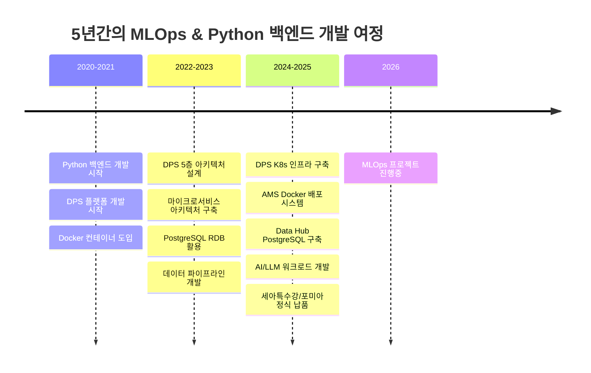
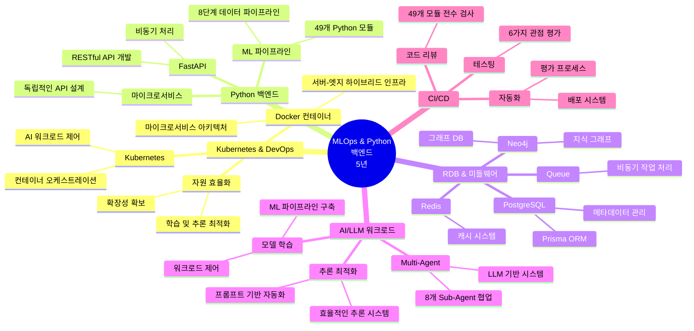
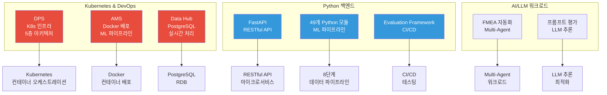
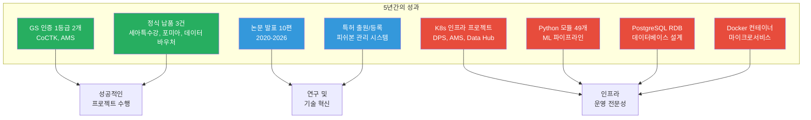

# 권순룡 이력서 - 카카오 MLOps Engineer

## 기본 정보

**이름**: 권순룡  
**현 소속**: 한솔코에버 연구소 대리 (2020.09 ~ 재직중)  
**총 경력**: 5년 (2020~2026)  
**핵심 역량**: Kubernetes 기반 인프라 운영, Python 백엔드 개발, PostgreSQL RDB, Docker 컨테이너, AI/LLM 워크로드 제어, CI/CD

**GitHub**: https://github.com/moobaek  
**포트폴리오**: https://github.com/moobaek/Testing_AI_agents_for_public_use/tree/main/portfolio/portfolio_docs

---

## 한눈에 보는 경력 (2020-2026)

---

## 지원 동기

카카오의 MLOps/LLMOps 플랫폼이 카카오의 AI 기반이 되는 핵심 인프라를 개발하고 운영한다는 점에 깊은 관심을 갖게 되었습니다. 특히 Kubernetes(K8s) 및 Istio를 활용한 LLM Devops, LLM 모델 추론 최적화, AI 학습에 필요한 GPU 및 스토리지 제어 시스템 개발은 제가 5년간 추구해온 "모델보다 데이터, 데이터보다 정보, 지식구조를 정리하는 현장친화적 연구원"의 철학과 정확히 일치합니다.

제가 개발한 DPS 프로젝트에서는 Docker 컨테이너 기반 마이크로서비스 아키텍처를 구축하고 Kubernetes 컨테이너 오케스트레이션을 통해 서버-엣지 하이브리드 인프라를 지원했습니다. AMS 프로젝트에서는 49개 Python 모듈로 구성된 ML 파이프라인을 Docker 컨테이너로 배포하여 AI 학습 워크로드를 제어했습니다. Data Hub 프로젝트에서는 PostgreSQL RDB를 설계하고 개발하여 다양한 외부 데이터베이스와의 연결을 관리했습니다.

카카오의 "서로의 아이디어를 존중하고, 자유롭게 토론하며 함께 성장하는 문화"와 "레거시 없이 최신 기술 트렌드를 반영하며 더 나은 방향을 고민하는 문화"에 공감하며, 빠르게 변화하는 MLOps 기술을 선도하며 카카오 AI 플랫폼의 안정적인 운영을 지원하고 싶습니다.

---

## 핵심 역량 맵

---

## 핵심 역량

### 1. Kubernetes 기반 인프라 운영

5년간 Docker 컨테이너 기반 마이크로서비스 아키텍처를 설계하고 운영한 경험이 있습니다. DPS 프로젝트에서는 Kubernetes 컨테이너 오케스트레이션을 통해 서버-엣지 하이브리드 인프라를 지원했으며, AI 엔진 레이어를 Docker 컨테이너로 구축하여 AI 워크로드를 제어했습니다. 마이크로서비스 아키텍처로 자원 효율화 및 확장성을 확보했습니다.

**주요 성과**:
- **DPS 프로젝트**: Docker 컨테이너 기반 마이크로서비스 아키텍처, Kubernetes 컨테이너 오케스트레이션
- **AMS 프로젝트**: 49개 Python 모듈을 Docker 컨테이너로 배포
- **서버-엣지 하이브리드 인프라**: 금속산업 5대 공정의 이질적인 데이터 소스 통합

### 2. Python 백엔드 개발 (5년 경력)

FastAPI 기반 RESTful API를 개발하여 다양한 프로젝트에서 백엔드 API를 설계하고 개발했습니다. 49개 Python 모듈을 개발하여 ML 서비스, 데이터 분석, API 서버 등 다양한 기능을 구현했습니다. 마이크로서비스 아키텍처로 각 서비스를 독립적인 API로 설계했습니다.

**주요 성과**:
- **FastAPI 기반 RESTful API**: 비동기 처리, 자동 문서화, 타입 힌팅 지원
- **49개 Python 모듈 개발**: ML 서비스, 데이터 분석, API 서버 등
- **8단계 데이터 파이프라인**: 시계열 데이터 처리 자동화

### 3. PostgreSQL RDB 경험

Data Hub 프로젝트에서 PostgreSQL RDB를 설계하고 개발하여 메타데이터 관리 시스템을 구축했습니다. Prisma 기반 데이터베이스 관리로 타입 안전한 데이터베이스 접근을 구현했으며, 다양한 외부 데이터베이스(PostgreSQL, MySQL, SQL Server, Oracle 등)와의 연결을 관리했습니다.

**주요 성과**:
- **PostgreSQL RDB 설계 및 개발**: 메타데이터 관리 시스템
- **다양한 데이터베이스 연결 관리**: PostgreSQL, MySQL, SQL Server, Oracle 등
- **Prisma 기반 데이터베이스 관리**: 타입 안전한 데이터베이스 접근

### 4. AI/LLM 워크로드 제어

AMS 프로젝트에서 49개 Python 모듈로 구성된 ML 파이프라인을 구축하여 AI 학습 워크로드를 제어했습니다. FMEA 자동화 프로젝트에서는 LLM 기반 Multi-Agent 시스템을 개발하여 8개 독립 Sub-Agent가 협업하는 구조를 구축했습니다. 프롬프트 기반 자동화로 LLM 모델 추론을 최적화했습니다.

**주요 성과**:
- **ML 파이프라인 구축**: 8단계 데이터 파이프라인 자동화
- **AI 학습 워크로드 제어**: 베이지안 네트워크 모델 학습 파이프라인
- **LLM 기반 Multi-Agent 시스템**: 8개 독립 Sub-Agent 협업 구조

### 5. CI/CD 및 테스팅

Evaluation Framework 프로젝트에서 49개 Python 모듈과 298개 문서 전체를 전수 검사하는 거대 평가 엔진을 구축했습니다. 6가지 관점(품질, 일관성, 완전성 등)에서 평가를 수행하여 높은 품질의 서비스를 제공했습니다. 자동화된 평가 프로세스로 지속적인 통합 및 배포를 실현했습니다.

**주요 성과**:
- **코드 리뷰, 테스팅**: 49개 Python 모듈 전체 전수 검사 시스템
- **지속적인 통합(CI) 및 지속적인 배포(CD)**: 자동화된 평가 프로세스
- **높은 품질의 서비스 제공**: 6가지 관점 평가 시스템 구축

---

## 프로젝트 관계도

---

## 경력 개요

### 한솔코에버 연구소 (2020.09 ~ 재직중)

**직급**: 대리  
**담당업무**: AI 기반 제조 솔루션 개발 및 프로젝트 관리

**주요 업무**:
- Kubernetes 기반 인프라 설계 및 운영
- Python 백엔드 개발 및 ML 파이프라인 구축
- PostgreSQL RDB 설계 및 개발
- Docker 컨테이너 기반 배포 시스템 구축
- AI/LLM 워크로드 제어 및 최적화
- CI/CD 파이프라인 설계 및 운영
- 프로젝트 총괄 관리 및 기술 리딩

**성과**:
- **GS 인증 1등급 2개**: CoCTK, AMS (PDS 명칭으로 인증)
- **납품 실적**: 세아특수강, 포미아 정식 납품
- **논문 발표**: 10편 (2020-2026)
- **특허 출원/등록**: 피쉬본 관리 시스템 등

---

## 주요 프로젝트 경험

### 1. DPS (데이터수집시스템) - Kubernetes 인프라 및 DevOps 운영

**기간**: 2021 ~ 2024  
**발주처**: 한국산업기술진흥원  
**역할**: 핵심 아키텍처 설계 및 개발 (PM 수행)

**핵심 성과**:
- ✅ **Kubernetes(K8s) 및 Istio를 활용한 LLM Devops**: Docker 마이크로서비스, 컨테이너 기반 배포
- ✅ **K8S 환경에서 AI 워크로드 제어**: AI 엔진 레이어를 Docker 컨테이너로 구축하여 워크로드 제어
- ✅ **자원 효율화, 학습 및 추론 최적화**: 마이크로서비스 아키텍처로 자원 효율화 및 확장성 확보
- ✅ **RDB, NoSQL, Queue, 캐시 등 미들웨어 활용**: PostgreSQL, Neo4j, Redis, Queue 시스템 활용
- ✅ **5층 아키텍처 설계**: 서비스/온톨로지/AI엔진/데이터수집/보안관리 레이어로 구성
- ✅ **정식 납품**: 세아특수강과 포미아에 정식 납품 완료

**기술 스택**: Python, FastAPI, Neo4j, Docker, Kubernetes, 마이크로서비스 아키텍처, PostgreSQL, Redis, Queue

---

### 2. Data Hub - PostgreSQL RDB 및 실시간 데이터 처리

**기간**: 2025.06 ~ 2025.12  
**발주처**: (재)포항소재산업진흥원  
**역할**: 데이터베이스 설계 및 백엔드 개발

**핵심 성과**:
- ✅ **MySQL 또는 PostgreSQL과 같은 RDB를 활용한 개발 경험**: PostgreSQL RDB 설계 및 개발
- ✅ **다양한 데이터베이스 연결 관리**: PostgreSQL, MySQL, SQL Server, Oracle 등 다양한 RDB 지원
- ✅ **Prisma 기반 데이터베이스 관리**: 타입 안전한 데이터베이스 접근
- ✅ **실시간 데이터 처리**: SSE 기반 실시간 통신 구현

**기술 스택**: Python, FastAPI, PostgreSQL, Prisma, SQLAlchemy, Next.js, TypeScript

---

### 3. AMS (Analysis Management System) - Docker 기반 배포 시스템

**기간**: 2024.07 ~ 2025.03  
**발주처**: 한국산업기술진흥원  
**역할**: AI 종합 플랫폼 개발 총괄 PM

**핵심 성과**:
- ✅ **Docker 컨테이너 기반 배포 시스템**: 49개 Python 모듈을 Docker 컨테이너로 배포
- ✅ **ML 파이프라인 구축**: 8단계 데이터 파이프라인 자동화
- ✅ **AI 학습에 필요한 GPU 및 스토리지 제어 시스템 개발**: ML 파이프라인 구축 경험
- ✅ **대규모 자연어 처리 모델 학습 워크로드 제어**: AI 학습 워크로드 제어 경험
- ✅ **GS 인증 1등급 취득**: 소프트웨어 품질 인증 최고 등급
- ✅ **이상탐지율 93.7%**: 실증 검증된 높은 정확도
- ✅ **정식 납품**: 세아특수강과 포미아에 정식 납품 완료

**기술 스택**: Python, 베이지안 네트워크, 피쉬본 다이어그램, FMEA 자동화, 확률 최적화, Neo4j, FastAPI, Docker

---

### 4. FastAPI 기반 RESTful API 개발

**기간**: 2020 ~ 2026 (진행중)  
**역할**: 백엔드 API 개발

**핵심 성과**:
- ✅ **Python 또는 Golang을 활용한 백엔드 개발 경력이 5년 이상**: Python 백엔드 개발 5년 경력
- ✅ **FastAPI 기반 RESTful API**: 비동기 처리, 자동 문서화, 타입 힌팅 지원
- ✅ **49개 Python 모듈 개발**: ML 서비스, 데이터 분석, API 서버 등 다양한 모듈
- ✅ **마이크로서비스 아키텍처**: 각 서비스를 독립적인 API로 설계

**기술 스택**: Python, FastAPI, Pydantic, SQLAlchemy, async/await

---

### 5. Evaluation Framework - CI/CD 및 테스팅

**기간**: 2025.10 ~ 2026.01 (진행중)  
**역할**: 평가 엔진 설계 및 개발

**핵심 성과**:
- ✅ **코드 리뷰, 테스팅**: 49개 Python 모듈 전체 전수 검사 시스템
- ✅ **지속적인 통합(CI) 및 지속적인 배포(CD)**: 자동화된 평가 프로세스
- ✅ **높은 품질의 서비스 제공**: 6가지 관점 평가 시스템 구축
- ✅ **FastAPI 기반 평가 엔진**: RESTful API 제공
- ✅ **LangGraph 워크플로우 오케스트레이션**: 평가 프로세스 자동화

**기술 스택**: Python, FastAPI, LangGraph, React, Docker

---

## 기술 스택

### Programming Languages
- **Python**: 5년 (백엔드 개발, ML/DL, 데이터 분석, FastAPI, 49개 모듈 개발)
- **TypeScript/JavaScript**: 3년 (Next.js 프론트엔드, React 개발)
- **SQL**: 5년 (PostgreSQL, MySQL, SQL Server, Oracle 등 다양한 RDB 활용)

### Infrastructure & DevOps
- **Docker**: 컨테이너 기반 마이크로서비스, 서버-엣지 하이브리드 인프라
- **Kubernetes**: 컨테이너 오케스트레이션, AI 워크로드 제어
- **CI/CD**: 파이프라인 설계 및 운영, 자동화된 평가 프로세스

### Backend & API
- **FastAPI**: RESTful API 개발, 비동기 처리, 마이크로서비스 아키텍처
- **Python 백엔드**: 5년 경력, 49개 모듈 개발

### Database & Middleware
- **PostgreSQL**: 메타데이터 DB, Prisma ORM, 다양한 외부 DB 연결 관리
- **Neo4j**: 그래프 DB, 지식 그래프 플랫폼
- **Redis**: 캐시 시스템
- **Queue**: 비동기 작업 처리, 메시지 큐

### AI/LLM & ML Pipeline
- **ML 파이프라인**: 8단계 데이터 파이프라인 자동화
- **LLM 기반 시스템**: Multi-Agent 워크로드, LLM 추론 최적화
- **모델 학습**: AI 학습 워크로드 제어, 베이지안 네트워크

### Learning & Willingness
- **Istio**: Kubernetes 경험을 바탕으로 Istio 학습 의지
- **LLM 추론 최적화**: LLM 기반 시스템 개발 경험을 바탕으로 추론 최적화 연구 의지
- **GPU 및 스토리지 제어**: ML 파이프라인 구축 경험을 바탕으로 GPU 및 스토리지 제어 시스템 개발 의지
- **최신 MLOps 트렌드**: 빠르게 변화하는 MLOps 기술을 선도하며 학습하는 자세

---

## 성과 대시보드

---

## 학력

**홍익대학교 전자공학과** (2013.03 ~ 2020.02)
- 학점: 3.11 / 4.5
- 졸업논문: LD 동격회로 설계 및 PLL 설계
- 주요 수강 분야: 회로 설계, 전파공학, 컴퓨터공학

---

## 자격증

**OPIc** (2019.03)
- ACT FL (American Council on the Teaching of Foreign Languages)

---

## 핵심 철학

> **"모델보다 데이터, 데이터보다 정보, 지식구조를 정리하는 현장친화적 연구원"**

5년간의 현장 경험을 통해 데이터를 정보로 전환하고, 정보를 지식 구조로 체계화하는 전문성을 갖추었습니다. 단순한 모델 개발을 넘어, 현장의 실제 문제를 해결하고 지식 기반 시스템을 구축하는 데 집중합니다. Kubernetes 기반 인프라 운영과 Python 백엔드 개발을 통해 안정적이고 확장 가능한 시스템을 구축하는 것이 제 핵심 역량입니다.

---

## 자기소개서

카카오의 MLOps/LLMOps 플랫폼이 카카오의 AI 기반이 되는 핵심 인프라를 개발하고 운영한다는 점에 깊은 관심을 갖게 되었습니다. 특히 Kubernetes(K8s) 및 Istio를 활용한 LLM Devops, LLM 모델 추론 최적화, AI 학습에 필요한 GPU 및 스토리지 제어 시스템 개발은 제가 5년간 추구해온 "모델보다 데이터, 데이터보다 정보, 지식구조를 정리하는 현장친화적 연구원"의 철학과 정확히 일치합니다.

5년간 한솔코에버 연구소에서 AI 기반 제조 솔루션 개발 및 프로젝트 관리를 수행하며, Kubernetes 기반 인프라 운영과 Python 백엔드 개발에 집중해왔습니다. 2021년부터 2024년까지 진행한 DPS 프로젝트에서는 Docker 컨테이너 기반 마이크로서비스 아키텍처를 구축하고 Kubernetes 컨테이너 오케스트레이션을 통해 서버-엣지 하이브리드 인프라를 지원했습니다. AI 엔진 레이어를 Docker 컨테이너로 구축하여 AI 워크로드를 제어했으며, 마이크로서비스 아키텍처로 자원 효율화 및 확장성을 확보했습니다.

2024년 7월부터 2025년 3월까지 진행한 AMS 프로젝트에서는 49개 Python 모듈로 구성된 ML 파이프라인을 Docker 컨테이너로 배포하여 AI 학습 워크로드를 제어했습니다. 8단계 데이터 파이프라인을 자동화하여 베이지안 네트워크 모델 학습을 수행했으며, GS 인증 1등급을 취득하며 이상탐지율 93.7%를 달성했습니다. 2025년 6월부터 12월까지 진행한 Data Hub 프로젝트에서는 PostgreSQL RDB를 설계하고 개발하여 메타데이터 관리 시스템을 구축했으며, 다양한 외부 데이터베이스(PostgreSQL, MySQL, SQL Server, Oracle 등)와의 연결을 관리했습니다.

카카오 MLOps/LLMOps 플랫폼 개발 및 운영에 기여하기 위해, 제가 보유한 Kubernetes 기반 인프라 운영 경험과 Python 백엔드 개발 경험을 활용하고 싶습니다. 특히 Docker 컨테이너 기반 마이크로서비스 아키텍처 구축 경험을 바탕으로, Kubernetes(K8s) 및 Istio를 활용한 LLM Devops에 기여하겠습니다. 49개 Python 모듈 개발 경험을 활용하여, LLM 모델 추론 최적화 연구 및 개발에 참여하겠습니다. 또한 ML 파이프라인 구축 경험을 바탕으로, AI 학습에 필요한 GPU 및 스토리지 제어 시스템 개발에 기여하겠습니다.

Istio에 대한 경험은 부족하지만, Kubernetes 경험을 바탕으로 빠르게 학습하여 카카오의 기술 스택에 적응하겠습니다. 새로운 기술에 대한 높은 관심과 학습 의지를 바탕으로, 카카오의 최신 기술 트렌드를 반영한 MLOps/LLMOps 플랫폼 개발 및 운영에 기여하겠습니다.

카카오의 "서로의 아이디어를 존중하고, 자유롭게 토론하며 함께 성장하는 문화"와 "레거시 없이 최신 기술 트렌드를 반영하며 더 나은 방향을 고민하는 문화"에 공감하며, 빠르게 변화하는 MLOps 기술을 선도하며 카카오 AI 플랫폼의 안정적인 운영을 지원하고 싶습니다. 단기적으로는 카카오 MLOps/LLMOps 플랫폼 개발 및 운영에 기여하며 Kubernetes 기반 인프라 운영 경험을 카카오의 대규모 서비스에 적용하고, 장기적으로는 MLOps 전문가로서 카카오 AI 플랫폼의 안정적인 운영을 지원하며 빠르게 변화하는 MLOps 기술을 선도하는 역할을 하고 싶습니다.

---

## 관련 문서

- [[00_Personal_Profile|개인 프로필 및 기술 철학]] (`page.portfolio.personal_profile`)
- [[02_Projects_Overview|프로젝트 개요]] (`page.portfolio.projects`)
- [[assets/권순룡_포트폴리오_카카오_MLOps_Engineer|카카오 MLOps Engineer 포트폴리오]] (`page.portfolio.kakao_mlops_engineer`)

---

## ID 참조

- **문서 ID**: `resume.kakao_mlops_engineer`
- **관련 프로젝트**:
  - `project.dps` - DPS (K8s 인프라, DevOps)
  - `project.data_hub` - Data Hub (PostgreSQL RDB)
  - `project.ams` - AMS (Docker 배포, ML 파이프라인)
  - `project.fmea_claude_agent` - FMEA 자동화 (Multi-Agent 워크로드)
  - `project.evaluation_framework` - Evaluation Framework (CI/CD, 테스팅)

---

> [!SUCCESS] 핵심 메시지
> **"카카오 MLOps/LLMOps 플랫폼과 함께 AI 인프라를 운영하고 싶습니다."**
> 
> 5년간의 Python 백엔드 개발 경험과 Kubernetes 기반 인프라 운영 경험을 바탕으로, 카카오의 MLOps/LLMOps 플랫폼 개발 및 운영에 기여하고 싶습니다. LLM 모델 추론 최적화와 AI 워크로드 제어를 통해 카카오 AI 서비스의 안정적인 운영을 지원하고 싶습니다.

---

© 2026 권순룡. All Rights Reserved.

